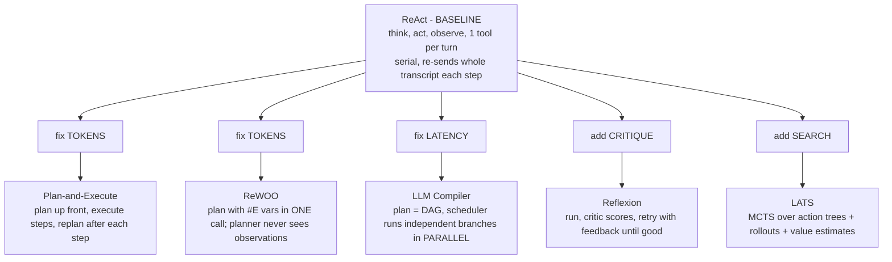
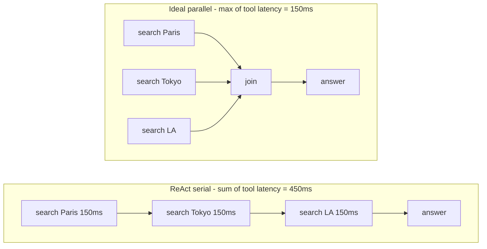

# Lecture 4: Control-Flow Patterns — The Landscape & ReAct's Cost Model

> In Week 1 you built one agent that loops. This week you learn the *shapes* agents come in — and, far more valuable, when NOT to reach for the fancy one. There is exactly one principle that runs through every pattern in this course: **the simplest topology that solves the task wins.** Everything else — Plan-and-Execute, ReWOO, LLM Compiler, Reflexion, LATS — is not a "better agent." Each is a targeted *reaction* to one specific way that the baseline (ReAct) hurts you: too many tokens, too much latency, no parallelism, no adaptation, no search. This lecture maps all six patterns onto a single diagram so you can see the family tree, then goes deep on ReAct itself — specifically the cost model that makes it the thing everything else is trying to fix. After this lecture you can (1) draw all six patterns and state each one's engineering tradeoff in a sentence, (2) explain *from first principles* why ReAct's token cost grows roughly quadratically with step count and why its tool calls are strictly serial, (3) work the token arithmetic for an N-step run by hand, and (4) name the six evaluation axes you will use all week to compare patterns instead of arguing by vibes.

**Prerequisites:** The agent loop and native tool calling (Lectures 1–3); comfort with big-O, basic arithmetic, and how transformer context windows are billed per token · **Reading time:** ~26 min · **Part of:** AI Agents & Agentic Systems, Week 2

## The core idea (plain language)

Here is the whole week in two sentences. Every agent control-flow pattern is a different answer to the question *"how do I arrange LLM calls and tool calls in time?"* ReAct's answer — think a little, call one tool, look at the result, repeat — is the simplest possible answer, it is correct astonishingly often, and it has three structural weaknesses that every other pattern is engineered to attack.

The three weaknesses, memorize them, because the whole map hangs off them:

1. **Cost grows with the square of the number of steps.** ReAct re-sends the *entire growing transcript* — every prior thought and every prior observation — to the model on every single step. Step 10 pays to reprocess everything from steps 1 through 9. This is not a tuning problem; it is baked into the loop's shape.
2. **Tool calls are strictly serial.** ReAct decides on *one* action, waits for its result, and only then decides the next. Even if three of your lookups have nothing to do with each other, ReAct does them one after another. There is no place in the loop for concurrency.
3. **There is no dedicated adaptation or search machinery.** ReAct adapts turn-by-turn (that's its charm), but it has no notion of "critique the whole answer and retry," and no notion of "explore several action sequences and keep the best." When a task genuinely needs those, ReAct just... doesn't have them.

Now watch how the patterns fall out. **Plan-and-Execute** and **ReWOO** attack weakness #1 (tokens) — they stop re-feeding observations into expensive reasoning calls. **LLM Compiler** attacks weakness #2 (serial latency) — it runs independent tool calls in parallel. **Reflexion** attacks the "no critique/retry" half of #3 — it adds a critic and a retry loop. **LATS** attacks the "no search" half of #3 — it does full tree search over action sequences. That's the entire family. Six patterns, three weaknesses, one baseline. If you hold that structure in your head, you never have to memorize the patterns as a flat list — you can *derive* which one you need by naming the weakness that's biting you.

The discipline this week asks of you is small but non-negotiable: **before you leave any pattern, write its one-line engineering tradeoff.** Not "what it is" — you can look that up — but "what it buys and what it costs." That single sentence is what you'll actually reach for at 2am when a production agent is too slow or too expensive.

## How it actually works (mechanism, from first principles)

### The map: six patterns, one diagram

Here is the family tree. Read it as "baseline, then each branch is the weakness it fixes."



One-line diagrams for each, the way you'd sketch them on a whiteboard:

- **ReAct:** `LLM → tool → LLM → tool → LLM → answer` (each `LLM` sees everything before it).
- **Plan-and-Execute:** `LLM(plan) → [exec step, LLM(replan)] × N → answer`.
- **ReWOO:** `LLM(plan with #E1,#E2,…) → [worker runs tools, no LLM] → LLM(solve)` — exactly **2 LLM calls** regardless of step count.
- **LLM Compiler:** `LLM(DAG of calls) → scheduler runs independent nodes concurrently → LLM(join)`.
- **Reflexion:** `agent → critic(score) → [if bad: agent-with-feedback] → … → answer`.
- **LATS:** `expand candidate actions → simulate rollouts → back up values → pick best branch` (a search tree, not a line).

That's the map. The rest of this lecture ignores five of the six and drills into the baseline, because you cannot reason about *why* the others exist until you can quantify what ReAct actually costs.

### ReAct, mechanically

Recall the loop from Week 1. On each iteration you call the model with the full `messages` list, the model either emits a `tool_use` or finishes, and if it emits a tool call you append the assistant turn *and* the `tool_result` and loop again. The critical line — the one that generates this entire week's worth of patterns — is that **`messages` only ever grows.** You never remove anything. Every observation you appended on step 3 is still sitting in the list, re-sent verbatim, on step 8.

Why must it grow? Because the model is stateless between calls. It has no memory of step 3 except what you put in the prompt on step 8. If you want the model on step 8 to "remember" what `web_fetch` returned on step 3, that observation *has to be in the transcript you send on step 8*. ReAct's interleaved reasoning — the thing that makes it adapt so well — is exactly what forces it to carry the full history: each thought is conditioned on all prior observations, so all prior observations must be present.

### The quadratic cost, derived

Let's make this precise with the only math you need: arithmetic and big-O.

Set up the model. Say each step adds a roughly constant chunk of new tokens to the transcript — the model's thought plus the tool's observation. Call that per-step growth `g` tokens. Say there's a fixed prefix (system prompt, tool schemas, the original question) of `p` tokens. Then on **step `k`**, the input you send the model is:

```
input_tokens(k) = p + g·(k − 1)      # prefix + everything appended in steps 1..k-1
```

Step 1 sends `p`. Step 2 sends `p + g`. Step 3 sends `p + 2g`. And so on. Now sum the *input* tokens across all `N` steps — because you pay for input tokens on **every** call, not just once:

```
total_input = Σ (from k=1 to N) [ p + g·(k−1) ]
            = N·p  +  g·(0 + 1 + 2 + … + (N−1))
            = N·p  +  g·( N·(N−1) / 2 )
```

Look at the second term: `g·N·(N−1)/2`. That's `O(N²)`. **The number of tokens you pay for grows with the square of the number of steps.** This is not because the transcript is quadratically large — the final transcript is only `O(N)` tokens. It's quadratic because you *re-send* an `O(N)` transcript `O(N)` times. Ten steps means you've paid to process the equivalent of ~55 full early-transcript chunks, not 10.

This is the single most important number in agent engineering, so let's put real figures on it.

### Worked numeric example

Concrete run. Suppose:

- Fixed prefix `p` = 1,500 tokens (system prompt + three tool schemas + the question).
- Each step's thought + observation adds `g` = 500 tokens (a modest web-search result summary plus a sentence of reasoning).
- Output per step is small and roughly constant — say 150 tokens — so we'll track it separately and focus on the input side where the quadratic lives.

Step-by-step **input** tokens:

```
step  input = p + g·(k-1)
  1   1500 + 500·0  = 1,500
  2   1500 + 500·1  = 2,000
  3   1500 + 500·2  = 2,500
  4   1500 + 500·3  = 3,000
  5   1500 + 500·4  = 3,500
  6   1500 + 500·5  = 4,000
  7   1500 + 500·6  = 4,500
  8   1500 + 500·7  = 5,000
        cumulative input = 26,000 tokens
```

Eight steps. The *final* transcript is only ~5,000 tokens, but you paid to process **26,000** input tokens getting there — more than 5× the size of the final context. Add output: 8 × 150 = 1,200 output tokens. So ~26,000 in + ~1,200 out.

Now stretch it to a longer research task, `N = 20` steps, same `p` and `g`:

```
total_input = 20·1500 + 500·(20·19/2)
            = 30,000  + 500·190
            = 30,000  + 95,000
            = 125,000 input tokens
```

The final transcript at step 20 is only `1500 + 500·19 = 11,000` tokens. But you paid for **125,000** input tokens across the run — over 11× the final size. Double the steps from 8 to 16 and the cost roughly *quadruples*, not doubles. That's the quadratic biting. **This is why "just let ReAct run longer" is a financially dangerous default:** cost doesn't scale with how far the agent got, it scales with the square of how many hops it took to get there.

A back-of-envelope dollar figure (label this approximate — prices move): at an input price around $3–$5 per million tokens, that 20-step run's 125k input tokens is roughly $0.40–$0.60 for *one* task. Run that agent over 10,000 support tickets a day and the quadratic is now a line item someone in finance will ask you about.

### The serial constraint, mechanically

The second weakness is structural in a different way. Look at the loop: the model emits a tool call, your harness runs it, you feed back the result, *then* the model decides the next action. The next decision is **causally downstream** of the previous observation — the model literally cannot choose step `k+1`'s action until it has seen step `k`'s result, because it decides one action at a time.

So even when the work is embarrassingly parallel — "look up the population of Paris, Tokyo, and Los Angeles," three lookups that depend on nothing — ReAct does them in sequence:



Wall-clock latency for the serial version is the *sum* of tool latencies; for the parallel version it's the *max*. With slow tools (a 2-second API call ×6 = 12s serial vs ~2s parallel) this is the difference between a snappy agent and one that feels broken. Native tool calling *can* return multiple `tool_use` blocks in one turn (you saw this in Week 1), and a well-written harness runs those concurrently — but ReAct's think-one-act-one loop rarely produces them, because each action is conditioned on the last observation. Getting real parallelism means giving up the interleaving, which is precisely what **LLM Compiler** does: plan the whole DAG first, then the scheduler is free to fire independent branches at once.

### The evaluation axes (use these all week)

You do not get to say pattern X is "better." You compare on axes, with numbers from a trace. Here are the six, and they map directly onto the weaknesses above:

| Axis | What it measures | Why it matters / where it bites |
|---|---|---|
| **Total tokens** | Sum of input+output across all LLM calls | The dollar cost; the quadratic lives here |
| **Wall-clock latency** | Real seconds start→finish | User-facing responsiveness; serial vs parallel decides it |
| **Number of LLM calls** | Count of model round-trips | Each call has fixed overhead + rate-limit pressure |
| **Parallelism** | Can independent work run concurrently? | Latency win when the task has independent subtasks |
| **Retry / adaptation** | Can it recover mid-run or after a bad answer? | Robustness on flaky tools / checkable-quality tasks |
| **Search breadth** | Does it explore multiple action paths? | Needed only for genuine search problems |

ReAct's row, to anchor the table: total tokens **O(N²)**, latency **serial (sum of tool times)**, LLM calls **N (one per step)**, parallelism **none**, adaptation **per-turn (strong)**, search breadth **none (single path)**. Every other pattern this week is a different row — and the whole skill is reading the task, guessing which axis will bite, and picking the pattern whose row wins on that axis without losing too much on the others.

## Worked example: the same task, ReAct's numbers

Take the week's shared task: *"Which of these three cities — the capital of France, the most populous city in Japan, and the city hosting the 2028 Summer Olympics — has the largest metro-area population, and what is that number?"*

A ReAct trajectory needs about six tool calls: three to resolve the city names (Paris, Tokyo, Los Angeles), three to get each metro population. That's ~6 steps, so ~7 LLM calls (six action-deciding calls plus the final answer). Using our model with `p` = 1,500 and `g` = 500:

```
step  action                          input tokens
  1   resolve "capital of France"     1,500
  2   resolve "populous city Japan"   2,000
  3   resolve "2028 Olympics host"    2,500
  4   search "Paris metro pop"        3,000
  5   search "Tokyo metro pop"        3,500
  6   search "LA metro pop"           4,000
  7   compose final answer            4,500
        cumulative input ≈ 21,000 tokens, 7 LLM calls
```

Now the two things that hurt: **tokens** — 21,000 input tokens, of which the final answer call alone re-processed all six prior observations. And **latency** — all six searches ran serially. If each search is 150ms that's 900ms of tool time; if you're hitting a real API at 1–2s each, it's 6–12 seconds the user waits, almost all of it avoidable because steps 1–3 (and 4–6) are mutually independent.

Hold these numbers. In the lab you'll build ReWOO for this exact task and watch the LLM-call count drop from ~7 to **exactly 2** (one planner, one solver) and the token count fall several-fold — because ReWOO's planner emits the whole `#E1…#E6` plan in one call and *never sees the observations*. And you'll note that LLM Compiler would fix the latency (parallel searches) even though it wouldn't help the tokens as much. Same task, three patterns, three different rows in the table. That contrast *is* the week.

## How it shows up in production

- **Your cost dashboard is superlinear in task difficulty.** Easy tickets resolve in 2–3 steps and cost pennies; hard ones spiral to 15–20 steps and cost 30–50× more, not 7× more. Finance notices the tail. The fix is rarely "a smarter model" — it's "stop re-feeding observations into reasoning calls" (Plan-and-Execute / ReWOO) or "cap steps and route hard cases to a cheaper topology."

- **Latency complaints track tool count, not model speed.** Users say the agent is "slow" and the instinct is to blame the LLM. Pull the trace: often 80% of wall-clock is six serial tool calls that could have run in one concurrent burst. That's an LLM Compiler / parallelization problem, not a model problem.

- **Context-window overflow errors on long runs.** The quadratic has a hard wall: eventually `input_tokens(k)` exceeds the model's context window and the call 400s. A ReAct agent that "worked in the demo" (5 steps) crashes in production (25 steps) with a context-length error. Bounded steps (Week 1) is your first guard; a token-cheaper topology is the real fix.

- **Prompt-cache economics change the arithmetic.** Providers cache stable prompt prefixes. Because ReAct only *appends*, its prefix (system + tool schemas + early turns) is stable and cache-friendly — cached input tokens are much cheaper. This *softens* the quadratic in practice but does not remove it: the *newly appended* observations on each step are never cached, and those are exactly the `g·(N−1)/2` term. Don't let "we have caching" talk you out of measuring.

- **"Just add agents" is the expensive reflex.** The most common production mistake is reaching for a multi-agent or tree-search topology when a step cap plus a cheaper single-agent pattern would do. Every pattern past ReAct multiplies either tokens or LLM calls; adopting one without a measured reason is how you 10× your bill for no quality gain.

## Common misconceptions & failure modes

- **"ReAct's cost is quadratic because the context gets huge."** No — the *final* context is linear (`O(N)`). The cost is quadratic because you re-send that linear context `O(N)` times. The bloat is in the billing, not the buffer.

- **"Native tool calling means ReAct runs tools in parallel."** The API *can* return multiple `tool_use` blocks per turn, and your harness should run those concurrently — but ReAct's interleaved loop rarely emits more than one, because each action is conditioned on the previous observation. Parallelism requires planning the independent calls *up front* (LLM Compiler), which means giving up interleaving.

- **"A fancier pattern is a better agent."** A fancier pattern is a *different tradeoff*. ReWOO saves tokens but loses mid-course adaptation. LATS explores broadly but costs enormously. There is no free lunch; there is only "which axis am I willing to spend on."

- **"More steps = more thorough = better."** More steps = quadratically more cost and a higher chance of drift/looping. Thoroughness and step count are not the same thing; a good plan (ReWOO) can be *more* thorough in *fewer* expensive reasoning calls.

- **Skipping the one-line tradeoff.** The failure mode of *this lecture* is reading all six patterns and retaining a flat list you can't apply. If you can't finish the sentence "Pattern X buys ___ at the cost of ___," you haven't learned it yet.

## Rules of thumb / cheat sheet

- **Default to ReAct.** It's simplest, adapts well, and is right more often than the internet implies. Reach past it only when you can *name the axis* that's failing.
- **Token bill too high on multi-step tasks?** → the observations are being re-fed into reasoning. Reach for **ReWOO** (predictable plan) or **Plan-and-Execute** (needs adaptation).
- **Latency too high and subtasks are independent?** → **LLM Compiler** (parallel DAG). Not "more autonomy."
- **Quality failing but "good" is checkable (tests pass, JSON validates, rubric)?** → **Reflexion** (critic + retry) with a hard stop condition.
- **Genuinely a search problem and you can afford the compute?** → **LATS**. Rarely ship it.
- **Estimate ReAct cost before running:** `total_input ≈ N·p + g·N·(N−1)/2`. If `N` might get large, that quadratic term is your warning light.
- **Latency mental model:** serial patterns cost the *sum* of tool times; parallel patterns cost the *max*.
- **Always write the one-liner** per pattern before moving on. "Buys ___, costs ___."
- **Cap steps regardless of pattern** — the quadratic (and runaway loops) make an uncapped agent a financial hazard (Week 1's budgets).

## Connect to the lab

This week's lab has you implement **Plan-and-Execute AND ReWOO** for the exact multi-city task worked above, instrument both with a token/latency/LLM-call meter, and produce a comparison table over the median of 5 runs. The numbers you hand-computed here (ReAct's ~7 LLM calls and ~21k input tokens) are your baseline reference point — ReWOO should show **exactly 2 LLM calls** and several-fold fewer tokens, and if it doesn't, your planner is leaking observations (the whole bug ReWOO exists to prevent). The memo you write at the end is just the "one-line tradeoff" discipline from this lecture, formalized: name the winner *and* the flip condition where the answer changes.

## Going deeper (optional)

Real, named resources — verify current URLs yourself, I'm giving you domains I'm confident exist plus search queries:

- **Anthropic — "Building Effective Agents"** (anthropic.com engineering blog). The canonical workflows-vs-agents framing and the five building blocks. Search: `Anthropic Building Effective Agents`.
- **LangGraph docs — "Agent architectures" / conceptual guides** (root: `langchain-ai.github.io/langgraph`). Engineering-first framing of ReAct, Plan-and-Execute, ReWOO, LLM Compiler as graphs. Search: `langgraph agent architectures`, `langgraph plan and execute`, `langgraph rewoo`, `langgraph llm compiler`.
- **ReAct paper** — "ReAct: Synergizing Reasoning and Acting in Language Models" (Yao et al., 2022). Skim the abstract and figures. Search: `ReAct Yao synergizing reasoning acting`.
- **ReWOO paper** — "ReWOO: Decoupling Reasoning from Observations for Efficient Augmented Language Models." The abstract is enough to internalize the token argument. Search: `ReWOO decoupling reasoning observations`.
- **Reflexion paper** — "Reflexion: Language Agents with Verbal Reinforcement Learning." Search: `Reflexion verbal reinforcement learning agents`.
- **LATS paper** — "Language Agent Tree Search Unifies Reasoning, Acting, and Planning." Search: `LATS language agent tree search`.
- **Anthropic — Prompt caching docs** (docs at claude/anthropic platform). Understand *why* ReAct's append-only shape is cache-friendly and where the cache misses. Search: `Anthropic prompt caching`.
- **OpenAI — "A Practical Guide to Building Agents"** (PDF). A second industry framing of the same mental model. Search that exact title.

## Check yourself

1. Explain, without using the word "quadratic," *why* a ReAct agent's total token cost grows faster than linearly with the number of steps. What specifically is being paid for more than once?
2. For a ReAct run with fixed prefix `p = 2,000` tokens and per-step growth `g = 400` tokens, compute the total *input* tokens over `N = 10` steps. Then say how the final-step context size compares to the total you paid for.
3. A task has 5 tool calls, 4 of which are mutually independent, and your only complaint is latency. Which pattern do you reach for, and why won't switching to ReWOO help the thing you care about?
4. Map each of the following patterns to the *single* ReAct weakness it primarily attacks: Plan-and-Execute, LLM Compiler, Reflexion, LATS.
5. Why is "let ReAct just keep looping until it's confident" a financially dangerous default in production? Name the two failure modes.
6. Give the one-line tradeoff ("buys ___, costs ___") for ReAct itself.

### Answer key

1. Because ReAct re-sends the **entire growing transcript** — every prior thought and observation — on every step. The model is stateless between calls, so to "remember" step 3 on step 8 you must include step 3's observation in step 8's input. Early observations are therefore paid for on step 3, step 4, step 5… all the way to step N. The transcript itself is only linear in size; the *cost* is superlinear because a linear thing is re-processed a linear number of times.

2. `total_input = N·p + g·(N·(N−1)/2) = 10·2000 + 400·(10·9/2) = 20,000 + 400·45 = 20,000 + 18,000 = 38,000` input tokens. The final-step context is `p + g·(N−1) = 2000 + 400·9 = 5,600` tokens. You paid for 38,000 input tokens to move through a run whose largest single context was only 5,600 — nearly 7× the final size.

3. Reach for **LLM Compiler** — it plans the calls as a DAG and its scheduler runs the 4 independent tool calls concurrently, turning latency from the *sum* of tool times into the *max*. ReWOO won't help latency: it attacks *tokens* (planner never sees observations, ~2 LLM calls), but its worker still executes tool calls serially unless you specifically parallelize them. Different axis, wrong tool.

4. Plan-and-Execute → **tokens** (stop re-feeding observations into every reasoning call). LLM Compiler → **latency / no-parallelism**. Reflexion → **no critique-and-retry adaptation** (checkable-quality tasks). LATS → **no search breadth** (explores multiple action paths).

5. Two failure modes: (a) **Cost** — because tokens grow with the square of step count, an agent that loops "a bit longer" can cost quadratically more, and a hard task's tail dominates your bill. (b) **Context overflow** — eventually the re-sent transcript exceeds the model's context window and the call fails outright; a demo that worked at 5 steps crashes at 25. (Runaway looping on a flaky tool is a related third hazard — hence Week 1's budgets.)

6. ReAct **buys** simplicity and strong per-turn adaptation with one tool call at a time; it **costs** roughly quadratic token growth with step count and strictly serial (no-parallelism) tool execution.
