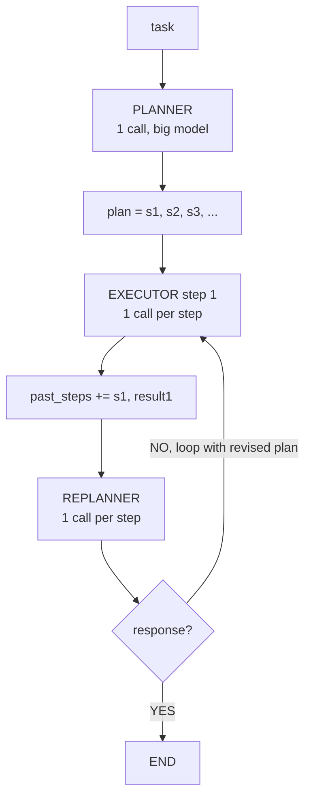

# Lecture 7: Plan-and-Execute

> A ReAct agent thinks a little, acts a little, thinks a little more — and re-reads its entire growing transcript with the biggest, most expensive model on *every* one of those thinking turns. Plan-and-Execute breaks that habit in two: **think about the whole task once, up front** (the planner), then **grind the steps** (the executor), and only **re-think when a result surprises you** (the replanner). This separation is the first real "topology" you meet after the bare loop, and it is the one whose control flow maps most cleanly onto a state machine. After this lecture you can draw the planner → executor → replanner cycle from memory, write the four-field state that flows through it, reason precisely about which costs it cuts (fewer big reasoning calls, a legible plan artifact) and which it does *not* (it still re-feeds accumulated context, and it stays strictly serial so latency does not improve), and name the exact task shape where it earns its keep.

**Prerequisites:** The agent loop and native tool calling (Lecture 1); the four budgets (Lecture 2); ReAct as the baseline and its quadratic-context weakness · **Reading time:** ~26 min · **Part of:** AI Agents & Agentic Systems, Week 2

## The core idea (plain language)

Watch a competent engineer tackle a multi-step task — "figure out which of three cities has the largest metro population." They do not decide their next move fresh after every single lookup. They glance at the whole problem, sketch a plan ("find the three cities, then look up each one's population, then compare"), and then execute that plan mechanically, only stopping to re-plan if something breaks — a lookup fails, a fact contradicts an assumption. Two distinct mental modes: **planning** (rare, expensive, holistic) and **execution** (frequent, cheap, local).

ReAct collapses those two modes into one. Every turn is a fresh "reason about everything I know and decide the single next action" call. That is powerful and flexible, but it means the most expensive cognitive act — high-level reasoning over the full task — is repeated on *every* step. If a task takes 6 steps, ReAct does 6 rounds of full-task reasoning, each one re-reading the entire transcript so far.

Plan-and-Execute says: separate the modes and pay for each at its true frequency. A **planner** LLM writes a multi-step plan *once*. An **executor** works the steps one at a time — and the executor can be a cheaper model, or even a dumb tool call, because it is not reasoning about the whole task, just doing step *k*. After each step completes, a **replanner** LLM looks at what happened and decides: is the task done (emit the answer), or does the remaining plan need revising given this new result? That decision — done or continue — is the loop's beating heart.

The payoff is two things engineers care about. First, **cost**: you replace N expensive full-task reasoning calls with 1 planning call plus N cheap execution steps plus some replanning calls. Second, **legibility**: the plan is an *explicit artifact*. You can print it, log it, show it to a human for approval, diff it across runs. When the agent does something dumb, you do not reverse-engineer intent from an interleaved thought/action transcript — you read the plan it wrote. Both of those matter enormously in production, and we will be honest below about what this pattern does *not* fix.

## How it actually works (mechanism, from first principles)

### The three roles and the cycle

Plan-and-Execute is three LLM roles wired into a loop. Draw it once and it sticks:



- **Planner.** One call. Input: the task. Output: an ordered list of steps — natural-language instructions ("Search for the capital of France"), not code. This is the one call where you want your strongest reasoning model, because a bad plan poisons everything downstream.
- **Executor.** One call (or tool invocation) *per step*. Input: the current step (and usually just enough context to do it). Output: the result of that step. The executor is deliberately narrow — it is not asked "what should we do next," only "do this."
- **Replanner.** One call per completed step. Input: the original task, the plan, and the accumulated `past_steps` (step + result pairs). Output: *either* a revised remaining plan *or* a final response. This is where mid-course adaptation lives.

The loop is: plan once → execute step → replan (done? → finish; else → execute next step). The executor and replanner alternate until the replanner emits a response.

### The state shape — four fields, and why each exists

Everything the graph passes around is a small typed dict. In LangGraph you would write it as a `TypedDict`:

```python
from typing import TypedDict, List, Tuple, Annotated
import operator

class PlanExecute(TypedDict):
    task: str                                          # the original question, never mutated
    plan: List[str]                                    # remaining steps, REPLACED by the replanner
    past_steps: Annotated[List[Tuple[str, str]], operator.add]   # (step, result), APPENDED
    response: str                                      # empty until we're done; set => finish
```

Read each field by *who writes it and how*:

- **`task`** — the immutable anchor. Every node can read it; nothing overwrites it. Without it the replanner would drift, because after a few compactions the plan alone no longer tells you *why* you are doing any of this.
- **`plan`** — the list of remaining steps. The planner *creates* it; the replanner *replaces* it wholesale each cycle (the returned plan is the new remaining plan). Crucially, the executor pops the front of the plan; completed steps leave `plan` and enter `past_steps`.
- **`past_steps`** — the append-only ledger of `(step, result)` pairs. The `Annotated[..., operator.add]` reducer means each executor node *appends* rather than overwrites — the same additive-state discipline you saw with `add_messages` in the loop. This is the accumulated context, and — foreshadowing the cost section — it is exactly what the replanner re-reads every cycle.
- **`response`** — the sentinel. Empty string (or `None`) means "not done, keep looping." A non-empty value means "the replanner produced the final answer; route to END." The done-or-continue edge is literally `if state["response"]: return END else return "executor"`.

### The done-or-continue decision, concretely

The replanner is a structured-output call. You give the model a schema with two mutually exclusive shapes — a `Response` (the task is done, here is the answer) or a `Plan` (not done, here is the revised list of remaining steps):

```python
class Response(BaseModel):
    response: str

class Act(BaseModel):
    # the model returns EITHER a Response OR a new Plan
    action: Union[Response, Plan]

def replan(state: PlanExecute):
    out = replanner.invoke({"task": state["task"],
                            "plan": state["plan"],
                            "past_steps": state["past_steps"]})
    if isinstance(out.action, Response):
        return {"response": out.action.response}   # sets sentinel -> END
    return {"plan": out.action.steps}              # new remaining plan -> loop

def should_end(state: PlanExecute):
    return END if state.get("response") else "executor"
```

That `should_end` function is the conditional edge. The whole topology is: `START → planner → executor → replanner → (should_end) → {executor | END}`.

### A numeric cost model — where the savings actually come from

Let us count calls and tokens for a 6-step task, using round numbers (label these approximate — real numbers depend on your prompts and model).

Assume: the task prompt is ~200 tokens; each step's result is ~150 tokens; a "reasoning" (big-model) call costs, say, $5 / 1M input tokens; execution steps are tool calls or cheap-model calls.

**ReAct** re-sends the whole growing transcript on every step. Step *k*'s input is roughly `base + k × (thought + action + observation)`. If each turn adds ~400 tokens, the input tokens across 6 steps are ~`200 + 600 + 1000 + 1400 + 1800 + 2200 ≈ 7,200` input tokens — and *all 6* are big-model reasoning calls. Context grows roughly quadratically with steps; every one of those calls is your most expensive model.

**Plan-and-Execute** does: 1 planner call (~200 in), 6 executor calls (narrow — say ~250 in each, and they can run on a *cheaper* model), and up to 6 replanner calls (each re-reads `task + plan + past_steps`, which grows like the ReAct transcript). The win is not that you send fewer total tokens — the replanner re-feeds accumulated context just like ReAct does. The win is that **the executor steps, which are the majority of the calls, are cheap and narrow**, and the single genuinely-expensive holistic-reasoning call (the planner) happens *once*, not six times.

So the honest one-line cost story: Plan-and-Execute converts "N expensive holistic calls" into "1 expensive holistic call + N cheap narrow calls + N replan calls." If your executor uses the same big model and you replan after every single step, the savings shrink toward zero — the pattern's economics depend on the executor being cheaper and/or the replanner not firing every step.

## Worked example

Task: *"Which of these three cities — the capital of France, the most populous city in Japan, and the 2028 Summer Olympics host — has the largest metro-area population, and what is that number?"* (This is the Week 2 lab's shared task.)

**Planner call (1).** Reads the task, emits:

```
plan = [
  "Find the capital of France",
  "Find the most populous city in Japan",
  "Find the 2028 Summer Olympics host city",
  "Look up the metro-area population of each of the three cities",
  "Compare the three populations and report the largest with its number",
]
```

**Executor (step 1).** Pops `"Find the capital of France"`, calls `search`, result: `"Paris"`. State now: `plan` has 4 steps left, `past_steps = [("Find the capital of France", "Paris")]`.

**Replanner (call 1).** Sees the task, remaining plan, and `past_steps`. The result did not surprise it — "Paris" is a clean answer. It returns the *same* remaining 4-step plan (no revision needed). `response` stays empty → continue.

**Executor (steps 2–3).** `"Tokyo"`, `"Los Angeles"`. `past_steps` now has three city facts. Replanner each time: continue.

**Executor (step 4).** Looks up populations: Paris ~11.2M, Tokyo ~37.4M, Los Angeles ~12.9M. `past_steps` grows.

**Replanner (call 4).** Now it has everything. It recognizes the remaining step ("compare and report") can be answered directly from `past_steps` — it does not even need to dispatch a fifth execution step. It emits a `Response`: *"Tokyo has the largest metro-area population at approximately 37.4 million."* `response` is set → the `should_end` edge routes to END.

Notice two things this trace makes concrete. First, **the plan was legible the whole time** — at any point you could `print(state["plan"])` and see exactly what the agent intended. Second, **the replanner short-circuited the last step**: once it had the data, it did not slavishly execute "compare and report" as a tool call; it just answered. That flexibility — collapsing remaining steps when the answer is already derivable — is the replanner earning its cost.

Now the *adaptive* payoff. Suppose step 3's `search("2028 Summer Olympics host")` had returned `"no result"` (the mock lacked that fact). ReAct would notice and adapt inline. Plan-and-Execute adapts at the **replanner**: seeing the failed result in `past_steps`, it revises the remaining plan to insert a fallback step — `"Search for 'city hosting 2028 Olympics'"` — before continuing. That is the whole reason to accept the replanner's cost: **mid-course correction on a written, inspectable plan.**

## How it shows up in production

**Cost is real but conditional.** The pattern's headline — "fewer expensive reasoning calls" — is true only if you actually make the executor cheaper. A common anti-pattern: teams wire Plan-and-Execute with the *same* frontier model for planner, executor, and replanner, and replan after every step. Now you have ReAct's token profile plus the overhead of an extra replan call each turn — strictly worse. The lever is: strong model for the planner, a cheaper/faster model (or bare tool calls) for the executor, and replan only when a step's result is surprising or the task is genuinely dynamic.

**Latency does not improve — say this out loud.** Execution stays strictly serial: step 2 waits for step 1, step 3 waits for step 2. Plan-and-Execute reorganizes *reasoning*, not *concurrency*. If your six lookups are mutually independent and latency is your complaint, Plan-and-Execute does nothing for you — you want the **LLM Compiler** pattern (a DAG of tool calls, independent branches run in parallel). Reaching for Plan-and-Execute to fix latency is a classic mis-diagnosis.

**The replanner re-feeds context.** Every replan call re-reads `task + plan + past_steps`, and `past_steps` grows with every step — the same roughly-quadratic context growth that bites ReAct. Plan-and-Execute does *not* solve the token-bloat problem; that is precisely what ReWOO (next lecture) attacks by keeping observations *out* of the planner. If your trace shows Plan-and-Execute using as many tokens as ReAct, that is expected, not a bug — the win was call *structure* and legibility, not raw tokens.

**Debuggability is the underrated win.** When a production agent misbehaves, the first question is "what did it think it was doing?" With ReAct you reconstruct that from an interleaved transcript. With Plan-and-Execute you read the plan artifact directly, and you can diff the plan across replans to see exactly *when* and *why* the agent changed course. This alone justifies the pattern for workflows a human has to audit or approve — you can even surface the plan for human sign-off (a natural place for a LangGraph `interrupt()`) before any step with side effects runs.

**Plan drift and over-planning.** Two failure modes bite in production. (1) A weak planner emits a plan that is subtly wrong in step 1 and the whole run is doomed — invest your best model here. (2) The planner over-decomposes ("Step 1: consider the problem. Step 2: think about the cities...") producing steps that are not executable actions — constrain the planner's prompt to emit *concrete, tool-shaped* steps.

## Common misconceptions & failure modes

- **"Plan-and-Execute is faster than ReAct."** No. It can be *cheaper* (fewer big-model calls) but execution is serial, so wall-clock latency is comparable or worse (you added planner/replanner overhead). Faster-via-parallelism is the LLM Compiler's job.
- **"The plan is fixed once written."** The opposite — the *replanner replaces the remaining plan* after each step. A rigid, no-replanner variant exists (that's closer to ReWOO), but canonical Plan-and-Execute is defined by its adaptivity.
- **"It saves tokens."** Only conditionally, and less than ReWOO. The replanner re-feeds `past_steps`, so total token growth resembles ReAct. The savings are in *call structure* (one holistic reasoning call, cheap executor steps), not total tokens.
- **"Use the same model for all three roles."** That throws away the main cost lever. Big model = planner; cheap model or raw tool = executor.
- **Silent plan-drift on failure.** If the executor returns an error and the replanner does not *notice* it (e.g., you feed it a truncated `past_steps` that dropped the error), it will happily continue a broken plan. Make failed results visible to the replanner.
- **Replanning every step by reflex.** If the task is predictable (the plan won't change), replanning after each step is pure overhead — that predictable case is exactly where ReWOO wins. Replan only when results can change the plan.
- **Non-executable plan steps.** "Step 1: understand the problem" is not an action. Constrain the planner to emit steps a tool or a narrow executor can actually perform.

## Rules of thumb / cheat sheet

- **Reach for Plan-and-Execute when:** the task is genuinely multi-step *and* mid-course adaptation matters (a result can invalidate the plan), *and* you want a legible/auditable plan artifact.
- **Do NOT reach for it when:** the plan is fully predictable (→ ReWOO, cheaper), or independent steps make latency the pain (→ LLM Compiler, parallel), or the task is one or two steps (→ plain ReAct).
- **Model assignment:** strongest model → planner and replanner; cheapest capable model (or raw tool) → executor. Same model everywhere ≈ no cost win.
- **Replan cadence:** replan every step only if results are dynamic; otherwise replan lazily (or not at all) to cut overhead.
- **State:** `task` (immutable), `plan` (replaced by replanner), `past_steps` (appended, `operator.add` reducer), `response` (sentinel: non-empty ⇒ END).
- **Done-or-continue edge:** `END if state["response"] else "executor"`. One line, the whole loop's exit.
- **Debug first move:** `print(state["plan"])` at each replan — the plan artifact is your primary observability surface.
- **Cost expectation:** total tokens ≈ ReAct (replanner re-feeds context); big-model *calls* far fewer. Latency: no improvement (serial).

## Connect to the lab

Week 2's lab builds Plan-and-Execute **and** ReWOO for the *same* multi-hop question and lets a trace decide the winner on tokens, latency, and LLM-call count. This lecture is the theory behind `plan_execute.py`: the LangGraph `planner → executor → replanner → conditional done/continue` graph, the four-field `PlanExecute` state, and the `should_end` edge. When you write the memo, the "flip condition" you are asked to name is exactly this lecture's honest cost story — Plan-and-Execute's replanner wins on *correctness* the moment a step result should change the plan, which is the one thing ReWOO cannot do.

## Going deeper (optional)

- **LangGraph — "Plan-and-Execute" tutorial.** The canonical implementation this lecture mirrors (planner/executor/replanner nodes, structured `Response`/`Plan` union). Root: `langchain-ai.github.io/langgraph`. Search: `langgraph plan and execute tutorial`.
- **LangGraph — "Agent architectures" / agentic concepts docs.** Frames ReAct, plan-and-execute, and related topologies as engineering tradeoffs. Search: `langgraph agentic concepts agent architectures`.
- **Wang et al. — "Plan-and-Solve Prompting" (paper).** The prompting-level ancestor of separating plan from execution; the abstract is enough context. Search: `Plan-and-Solve prompting paper`.
- **Anthropic — "Building Effective Agents."** The workflow-vs-agent framing and the "simplest topology that works" principle that governs *when* to pick this pattern at all. Search: `Anthropic Building Effective Agents`.
- **LangGraph — "ReWOO" tutorial.** Read immediately after this to see what dropping the replanner (and keeping observations out of the planner) buys and costs. Search: `langgraph rewoo`.

## Check yourself

1. Name the three LLM roles in Plan-and-Execute and state, in one clause each, what each one's single job is.
2. Which field of the state is the done-or-continue sentinel, who sets it, and what value routes the graph to END?
3. The pattern is often sold as "cheaper than ReAct." Under what concrete conditions is that claim false or negligible?
4. Your task has 6 mutually independent tool calls and your only complaint is latency. Why is Plan-and-Execute the wrong tool, and what is the right one?
5. Explain precisely why Plan-and-Execute's *total token count* tends to resemble ReAct's, and which pattern fixes that — and how.
6. Give a concrete scenario where Plan-and-Execute beats ReWOO on correctness, and tie it to a specific node in the Plan-and-Execute graph.

### Answer key

1. **Planner** — reads the task once and writes the full ordered list of steps. **Executor** — performs a single step at a time (a narrow, non-holistic action). **Replanner** — after each step, looks at accumulated results and either revises the remaining plan or emits the final answer.

2. The **`response`** field. The **replanner** sets it (returning a `Response` rather than a new `Plan`). A **non-empty** `response` routes the conditional edge to **END**; an empty/`None` value routes back to the executor to continue.

3. It is false or negligible when (a) you use the *same* expensive model for the executor as for the planner — then execution calls are as costly as ReAct's — and/or (b) you replan after *every* step, adding a full-context replanner call each turn. The cost win depends on a cheaper/narrower executor and on not replanning gratuitously; without both, you can end up strictly worse than ReAct.

4. Plan-and-Execute keeps execution **strictly serial** — step *k+1* waits for step *k* — so it does nothing for latency; it reorganizes reasoning, not concurrency. The right tool is the **LLM Compiler**, which plans a DAG of tool calls and runs independent branches in parallel, joining only where there are data dependencies.

5. The **replanner re-feeds accumulated context** — it re-reads `task + plan + past_steps` on every cycle, and `past_steps` grows with each step, giving the same roughly-quadratic context growth ReAct suffers. Plan-and-Execute's win is call *structure* (one holistic planning call + cheap executor steps), not token totals. **ReWOO** fixes the token bloat by having the planner emit the entire plan with variable placeholders in *one* call and never showing it the tool observations — the planner never re-reads growing results.

6. Any task where a step's result should change the remaining plan — e.g., a lookup returns "no result" (or a fact that invalidates a later assumption). Plan-and-Execute adapts at the **replanner node**, which sees the failed/surprising result in `past_steps` and revises the remaining plan (inserting a fallback query) before continuing. ReWOO commits to its whole plan up front and cannot adapt mid-run, so it produces a wrong or empty answer on that same failure.
