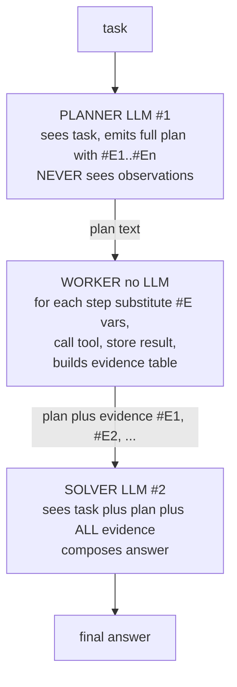

# Lecture 8: ReWOO — Reasoning WithOut Observation

> Plan-and-Execute (Lecture 7) cut planning cost by thinking about the whole task once. But it kept one expensive habit: the planner (and replanner) keeps *seeing every tool observation*, and re-sends that growing pile on every reasoning turn. That re-sent history is exactly what balloons your token bill on a long task. ReWOO is the surgical counterpunch. Its one idea: **decouple reasoning from observation entirely.** A Planner writes the *whole* plan up front — with variable placeholders `#E1`, `#E2`, … standing in for results it hasn't seen yet — in a single LLM call. A dumb, LLM-free Worker executes each tool call, substituting already-resolved variables into later arguments. A Solver reads the plan plus all the collected evidence and composes the final answer in one more call. Net: **exactly 2 LLM calls total, regardless of how many steps the plan has.** After this lecture you can write a ReWOO plan grammar, parse it with a regex, wire the variable-substitution worker, state the precise flip condition against Plan-and-Execute, and recognize the one failure mode that makes ReWOO the *wrong* choice: it cannot course-correct.

**Prerequisites:** The agent loop and native tool calling (Lectures 1-2); errors-as-observations (Lecture 3); Plan-and-Execute and the planner/executor/replanner split (Lecture 7); comfort with regex, string substitution, and reasoning about token counts · **Reading time:** ~26 min · **Part of:** AI Agents & Agentic Systems, Week 2

## The core idea (plain language)

Every reasoning-heavy agent pattern you've seen so far shares a hidden cost: the model *re-reads its own history*. In ReAct, step 5 re-sends the transcript of steps 1-4, including every observation. In Plan-and-Execute, the replanner re-sends the plan plus every result so far to decide the next move. The observations — search results, page text, tool JSON — are usually the *bulkiest* part of that history. And you pay for them again on every single reasoning turn, because the LLM is stateless: it only "knows" what's in the prompt you send this call.

ReWOO asks a blunt question: **does the planner actually need to see the observations to write a good plan?** For a large class of tasks — the ones where the plan is *predictable*, where you know the *shape* of the work before you start — the answer is no. If I ask "which of these three cities has the largest metro-area population," I can write the entire plan before running anything: look up each city, look up each city's population, compare. I don't need to *see* Tokyo's population to know that "look up Tokyo's population" is step 4. The reasoning is independent of the observations.

So ReWOO splits the job into three roles that never share the expensive context:

- **Planner** (1 LLM call): reads the task, emits the *complete* plan as a list of steps. Each step binds a variable — `#E1 = search[capital of France]` — and later steps can *reference* earlier variables — `#E4 = search[#E1 metro population]`. The planner writes `#E1` as a placeholder; it never learns what `#E1` resolves to. It reasons about *structure*, blind to results.
- **Worker** (0 LLM calls — this is the token win): walks the plan in order. For each step, it substitutes any already-resolved `#E` variables into the tool arguments, calls the tool, and stores the result under that step's variable. No model here. It's a `for` loop with string replacement.
- **Solver** (1 LLM call): gets the original task, the plan, and *all* the evidence (`#E1 → Paris`, `#E2 → Tokyo`, …), and writes the final answer in one shot.

The Planner never sees observations. The Worker never reasons. The Solver reasons once, at the end, over everything. That's the whole architecture, and it's the reason the token curve goes flat: **you reason twice (plan + solve) no matter how many tool calls sit in between.**

## How it actually works (mechanism, from first principles)

### The three-role dataflow



Contrast the arrows with Plan-and-Execute: there, an arrow loops *back* from each execution result into the (re)planner, and that back-arrow carries the observations into the next expensive reasoning call. ReWOO has no back-arrow into the planner. Evidence flows *forward only*, and it accumulates in a plain dict, not in an LLM's context.

### The plan grammar

ReWOO plans are deliberately simple so a dumb worker can parse them without an LLM. A minimal, practical grammar:

```
Plan: <free-text rationale for this step>
#E1 = ToolName[argument text, may contain no #E refs yet]
Plan: <rationale>
#E2 = ToolName[argument text]
...
#En = ToolName[argument text that may reference #E1 .. #E(n-1)]
```

Two rules make it work:

1. **Each `#Ei` is a single assignment** — the left side is a fresh variable, the right side is exactly one tool call `Tool[args]`.
2. **A step's args may reference *only already-defined* variables** (`#Ej` where `j < i`). This is what lets the worker resolve them in order without any planning.

The `Plan:` rationale lines are for the *planner's own* reasoning quality (chain-of-thought helps the model produce a coherent plan) and for your debugging. The worker ignores them; it only cares about the `#Ei = Tool[...]` lines.

### Parsing the plan (the regex)

The worker extracts steps with one regex. The canonical form:

```python
import re
STEP = re.compile(r"#E\d+ = (\w+)\[([^\]]+)\]")
# on the plan text:
#   matches[i] = (tool_name, raw_args)  in document order
steps = STEP.findall(plan_text)
```

Read the pattern piece by piece, because every character earns its place:

- `#E\d+` — literal `#E` then one-or-more digits: matches the variable being *assigned* (`#E1`, `#E42`). We don't capture it here; we recover the index from ordering, or capture it separately if you want to be robust to gaps.
- ` = ` — the literal separator (spaces included). If your planner sometimes omits spaces, loosen to `\s*=\s*`.
- `(\w+)` — **capture group 1**: the tool name (`search`, `calculator`). `\w+` is letters/digits/underscore — no brackets, no spaces.
- `\[([^\]]+)\]` — a literal `[`, then **capture group 2**: `[^\]]+` = "one or more characters that are not a closing bracket," then a literal `]`. This grabs the argument text and stops at the first `]`.

`findall` returns a list of `(tool, args)` tuples in the order they appear — exactly the execution order. If you want the variable name too (safer, tolerates non-sequential numbering), capture it:

```python
STEP = re.compile(r"(#E\d+)\s*=\s*(\w+)\[([^\]]+)\]")
# -> (var, tool, args), e.g. ("#E4", "search", "#E1 metro population")
```

**Sharp edge:** `[^\]]+` cannot handle nested brackets in the argument. If a tool arg legitimately contains `]` (rare for search queries, common for code), this regex truncates it. For those tools, switch to a delimiter the arg can't contain, or have the planner emit JSON args and parse with `json.loads`. Know the limit of the cheap regex before it bites you.

### The worker: substitution, then call, no model

```python
def run_worker(steps, tools):
    resolved = {}                          # "#E1" -> result string
    for i, (var, tool, args) in enumerate(steps, start=1):
        for k, v in resolved.items():      # substitute already-known vars
            args = args.replace(k, str(v))
        result = tools[tool](args)         # the ONLY work; NO LLM here
        resolved[var] = result
    return resolved                        # the evidence table
```

Three things to notice, because each is load-bearing:

1. **Substitution happens *before* the tool call**, using results already in `resolved`. Step `#E4 = search[#E1 metro population]` becomes `search[Paris metro population]` once `#E1` resolved to `Paris`. The dependency is expressed purely by variable reference; the worker never "understands" it.
2. **There is no model in this loop.** This is the entire economic argument. In Plan-and-Execute, each step's execution can involve an LLM (the executor reasoning about how to use the tool). In ReWOO the executor is `tools[tool](args)` — a function call. N tool calls cost N *tool* invocations and *zero* LLM invocations.
3. **It's still error-prone at the tool layer**, not the reasoning layer. A tool can return `ERROR: no result` (Lecture 3). The worker stores that string as the variable's value — and the Solver will see it. That's the only recovery ReWOO has: the Solver reading a failed evidence cell and doing its best. There is no re-plan.

### The token economics, with numbers

This is the reason the pattern exists, so let's make it concrete. Take a task with **N = 6** tool calls. Assume (illustrative, approximate figures — your mileage varies by model and payload):

- System prompt + tools + task framing: **~800 tokens**, re-sent on every reasoning call.
- Each observation (a search result): **~300 tokens**.
- Each reasoning turn's own output: **~150 tokens**.

**ReAct** (interleaved, re-sends full growing transcript each step). Step *k* re-sends the base plus all *k-1* prior observations and reasoning. Input tokens roughly:

```
step 1:  800
step 2:  800 + 300 + 150               = 1250
step 3:  800 + 2*(300+150)             = 1700
...
step k:  800 + (k-1)*450
sum over 6 steps ≈ 800*6 + 450*(0+1+2+3+4+5)
                 = 4800 + 450*15 = 4800 + 6750 = 11,550 input tokens
```

Plus 6 LLM calls, each with per-call output. Cost grows **quadratically** in N because each step re-reads a transcript that grew linearly.

**Plan-and-Execute** improves it but still re-feeds context to the replanner. Say 1 plan call + up to ~6 replan/execute reasoning calls, each carrying the plan + accumulated results (~800 + growing observations). It's better than ReAct's per-step re-reasoning but the replanner still sees observations, so on a 6-step task you're realistically looking at **~5-8 LLM calls** and input tokens in the thousands that scale with the observations seen so far.

**ReWOO**: exactly **2 LLM calls**.

```
Planner call:  input ≈ 800 (task+framing)      output ≈ 250 (the whole plan)
Solver call:   input ≈ 800 + 6*300 (evidence)  output ≈ 150 (answer)
             ≈ 800 + 250 + 800 + 1800 + 150 = 3,800 tokens total, 2 calls
```

The observations (6 × 300 = 1800 tokens) are paid for **once**, in the Solver's single input — not re-sent on every reasoning turn. And crucially, **the LLM-call count is flat at 2 whether N is 6 or 60.** The tool calls scale, but tool calls are cheap (an API or a function), not LLM reasoning calls. That's the counterpoint to Plan-and-Execute in one line: *ReWOO trades the ability to re-plan for a flat, minimal reasoning-token bill.*

## Worked example

Use the week's shared task (from the spine), mocked so numbers are reproducible:

> "Which of these three cities — the capital of France, the most populous city in Japan, and the city hosting the 2028 Summer Olympics — has the largest metro-area population, and what is that number?"

**Planner call (LLM #1).** Sees only the task. Emits:

```
Plan: Identify the three cities named indirectly in the question.
#E1 = search[capital of France]
#E2 = search[most populous city in Japan]
#E3 = search[2028 Summer Olympics host city]
Plan: Look up each city's metro-area population.
#E4 = search[#E1 metro population]
#E5 = search[#E2 metro population]
#E6 = search[#E3 metro population]
Plan: Compare the three populations and report the largest with its number.
```

Note steps 4-6 reference 1-3 *by variable*. The planner does **not** know that `#E1` is Paris — it just knows step 4 needs step 1's answer.

**Worker (no LLM).** Parses six steps. Executes in order, substituting as it goes, against the mock `FACTS` table:

| step | tool call after substitution     | result           |
|------|----------------------------------|------------------|
| #E1  | `search[capital of France]`      | Paris            |
| #E2  | `search[most populous city in Japan]` | Tokyo       |
| #E3  | `search[2028 Summer Olympics host city]` | Los Angeles |
| #E4  | `search[Paris metro population]` | 11.2 million     |
| #E5  | `search[Tokyo metro population]` | 37.4 million     |
| #E6  | `search[Los Angeles metro population]` | 12.9 million |

Six tool calls, zero LLM calls. The `#E1`→Paris substitution turned the abstract `#E1 metro population` into a concrete query.

**Solver call (LLM #2).** Gets the task + plan + the whole evidence table. Reasons once: 37.4M (Tokyo) > 12.9M (LA) > 11.2M (Paris). Emits:

> Tokyo has the largest metro-area population of the three, at 37.4 million.

**Tally:** 2 LLM calls, 6 tool calls. If the same task had 20 cities and 40 lookups, it would *still* be 2 LLM calls — 40 tool calls, but the reasoning bill is unchanged. That flatness is the whole point.

## How it shows up in production

**Cost on wide, predictable fan-outs.** ReWOO shines exactly where you have many *independent, foreseeable* lookups: enrich 30 leads, fetch 15 stock quotes and summarize, resolve a batch of 20 entity names. On these, the plan is knowable in advance and the observations are pure data the planner doesn't need. You'll see real 2-5× token reductions vs a re-reasoning pattern on such workloads — and the multiple grows with N. Approximate, but directionally reliable: the more steps, the bigger the ReWOO win.

**Latency has a subtle shape.** ReWOO removes per-step LLM round-trips (big latency saver — an LLM call is often 1-5s; a tool call may be 100ms). But the *worker as written is serial*: it runs `#E1` then `#E2` then `#E3`, even though those three are independent. So ReWOO cuts reasoning latency but not tool-fan-out latency. If tool latency dominates and calls are independent, ReWOO alone won't fix it — that's the door to **LLM Compiler** (Lecture 9), which emits a DAG and runs independent branches in parallel. State this crisply in a design memo: *"ReWOO fixes reasoning-token and reasoning-latency cost; it does not parallelize the tool fan-out."*

**Prompt-cache interaction.** Because the Planner's input (system + tools + task) is stable and sent once, and the Solver's is sent once, there's less repeated prefix to cache than in ReAct. That's usually fine — you weren't re-sending much anyway. The bigger caching story lives in patterns that *do* loop.

**Debuggability is excellent — then suddenly terrible.** The plan is a single artifact you can log, diff, and eyeball. When ReWOO works, you get a clean audit trail: here's the plan, here's each resolved variable, here's the answer. But when it *fails*, it fails opaquely: the planner emitted a plan that made sense given the task but was wrong given reality, and nothing corrected it. You find out only at the Solver, or when a user complains. Always **log the raw plan and the full evidence table** — that pair localizes almost every ReWOO bug to either "bad plan" or "bad evidence."

**Weak planners break the format.** This is the number-one production failure with local/small models. An 8B model (e.g. `llama3.1:8b`) will frequently botch the `#E` grammar: it writes `#E1: search(...)` with a colon and parens, or `E1 = ...` without the `#`, or narrates the plan in prose with no parseable steps, or references `#E7` that was never defined. Your regex then returns garbage or an empty list, and the worker silently does nothing or crashes. **Mitigation is mandatory, not optional:** run the plan through a validator (see cheat sheet) and, on failure, do a **repair retry** — feed the malformed plan back with an instruction to fix the format, once. If it still fails, that's your signal to upgrade the planner to a stronger model (`gpt-4o-mini`, a frontier model) for the planning call only. Log the raw plan every time so you can *see* the botch.

## Common misconceptions & failure modes

**"ReWOO is just Plan-and-Execute without the replanner."** Close but it misses the load-bearing part. The defining move is that the **planner never sees observations** *and* the executor is **LLM-free** via variable substitution. Plan-and-Execute's executor and replanner both consume observations with an LLM. Drop the replanner from Plan-and-Execute and you still have an LLM executor re-reading context; you don't get ReWOO's flat 2-call bill until the worker is a dumb substitution loop.

**The fatal failure mode: no mid-course correction.** This is the reason ReWOO is *not* a universal upgrade. The entire plan is committed before any tool runs. If step 2's result *invalidates* the plan — the search returns "no result," or reveals that the premise was wrong, or that step 4 should now query something different — ReWOO **cannot adapt.** The worker keeps executing the now-wrong steps, substituting garbage into later args, and the Solver is handed a poisoned evidence table. There is no feedback edge from observations back to reasoning. Concretely: if `#E1 = search[capital of France]` returned "no result" instead of "Paris," then `#E4 = search[no result metro population]` is nonsense, and ReWOO plows ahead anyway. Plan-and-Execute's replanner would have caught this and issued a fallback query. **ReWOO assumes the plan survives contact with reality.**

**"Fewer tokens means it's the better pattern."** No — fewer tokens on *this* task. The savings evaporate, and ReWOO returns *wrong* answers, the instant the task needs adaptation. Cheaper-and-wrong is not better than dearer-and-right. This is precisely why the week's memo requires a *flip condition*, not just a token count.

**"The worker can be a little bit smart."** The moment you put an LLM in the worker to "handle" a weird tool result, you've reinvented Plan-and-Execute and given up the flat 2-call economics. Keep the worker dumb. If results need interpreting per-step, ReWOO is the wrong pattern.

**Silent variable-reference bugs.** If the planner references `#E7` in step 4 but only defines `#E1..#E6`, the substitution loop simply doesn't replace `#E7`, and the tool receives the literal string `#E7 metro population`. The tool returns junk; the worker stores junk; no error is raised. Validate that every referenced variable is defined *before* it's used, and fail loudly if not.

## Rules of thumb / cheat sheet

- **Reach for ReWOO when:** the plan is *predictable up front*, steps are *many*, and observations are *data the planner doesn't need to reason over*. Wide, foreseeable fan-outs are the sweet spot.
- **Do NOT use ReWOO when:** step results can *change what the next step should be* (adaptive tasks, fallible lookups needing fallbacks, exploratory research). Use Plan-and-Execute's replanner instead.
- **The flip condition, stated crisply:** *ReWOO wins on tokens/latency while the plan is static; the moment a step's result should alter the plan, Plan-and-Execute (with its replanner) wins on correctness.* Predictability decides it, not size.
- **Call count is your invariant:** ReWOO = **exactly 2 LLM calls** (plan + solve), any N. If your ReWOO shows more, you leaked an LLM into the worker or into a "smart" step — that's the bug.
- **If ReWOO's token count ≈ Plan-and-Execute's,** your planner is seeing observations (a feedback edge you didn't mean to add). Cut it.
- **Always run a validator + one repair retry** on the plan. Minimal validator:

  ```python
  def valid_plan(steps):
      seen = set()
      for var, tool, args in steps:                 # (with 3-capture regex)
          if tool not in TOOLS: return False, f"unknown tool {tool}"
          for ref in re.findall(r"#E\d+", args):
              if ref not in seen: return False, f"{ref} used before defined"
          seen.add(var)
      return (len(steps) > 0), "empty plan" if not steps else "ok"
  ```

  On `False`, re-prompt the planner once with the error + the malformed plan; if still bad, escalate to a stronger model *for the plan call only*.
- **Log the raw plan and the full evidence table on every run.** They localize nearly every failure to "bad plan" vs "bad evidence."
- **Regex reminder:** `#E\d+ = (\w+)\[([^\]]+)\]` — `[^\]]+` stops at the first `]`, so it can't hold nested brackets. For args containing `]`, switch to JSON args or a safe delimiter.
- **Need the fan-out *faster*, not just cheaper?** That's LLM Compiler (a DAG + parallel scheduler), not "more ReWOO."

## Connect to the lab

This lecture is `rewoo.py` in the Week 2 lab — Pattern B, built against the *same* multi-hop city question you implemented Plan-and-Execute for. Wire the three nodes: a Planner that emits the `#E`-format plan in one call, a *no-LLM* Worker that parses with `re.findall(r"#E\d+ = (\w+)\[([^\]]+)\]", plan)` and substitutes resolved variables into later args, and a Solver that composes the answer in one call. Instrument it with the shared `Meter()` so `run_compare.py` can prove ReWOO makes **exactly 2 LLM calls** and **≥2× fewer total tokens** than Plan-and-Execute — and if it doesn't, your planner is leaking observations. The memo's job is the flip condition, in your own numbers.

## Going deeper (optional)

- **LangGraph "ReWOO" tutorial** — the canonical from-scratch implementation with the planner/worker/solver graph and the exact `#E` regex. Search: `langgraph rewoo tutorial`. (Root docs: `langchain-ai.github.io/langgraph`.)
- **ReWOO paper** — *"ReWOO: Decoupling Reasoning from Observations for Efficient Augmented Language Models"* (Xu et al., 2023). The abstract and Figure 1 (the three-module diagram) are enough context; the token-savings argument is the whole contribution. Search: `ReWOO decoupling reasoning from observations paper`.
- **Anthropic — "Building Effective Agents"** — for placing ReWOO in the workflow-vs-agent spectrum; ReWOO is a *workflow* (you own the control flow), not an autonomous agent. Search: `Anthropic Building Effective Agents`.
- **LangGraph "Plan-and-Execute" tutorial** — read side-by-side to *feel* the observation-feedback edge ReWOO removes. Search: `langgraph plan and execute`.
- **Compare-and-contrast search:** `ReWOO vs plan and execute token cost` to find practitioner write-ups with real (approximate) numbers on their own tasks.

## Check yourself

1. In one sentence each: what specific cost does ReWOO cut relative to Plan-and-Execute, and what capability does it surrender to do so?
2. Why is the LLM-call count *flat at 2* regardless of how many steps the plan has? Which component absorbs the growth in step count, and why is that cheap?
3. Your ReWOO run reports the *same* total token count as Plan-and-Execute on the same task. What is the single most likely bug, and where would you look?
4. A planner (8B model) emits: `E1: search(capital of France)`. Your regex `#E\d+ = (\w+)\[([^\]]+)\]` returns an empty list. Name two distinct format violations, and describe the two-tier mitigation.
5. Give a concrete task on which ReWOO produces a *confidently wrong* answer where Plan-and-Execute would be correct. What structural feature of ReWOO causes the failure?
6. State the flip condition between ReWOO and Plan-and-Execute in one sentence, and name the property of the task (not its size) that determines the winner.

### Answer key

1. **Cuts:** repeated reasoning-token cost — the planner never re-reads observations, and the executor uses no LLM, so you pay for reasoning exactly twice (plan + solve) instead of once per step. **Surrenders:** mid-course correction — because the whole plan is fixed before any tool runs, ReWOO cannot adapt when a step's result invalidates the plan.
2. Only two components use the LLM: the Planner (one call to emit the whole plan) and the Solver (one call to compose the answer). Step growth is absorbed by the **Worker**, which makes N *tool* calls with zero LLM calls — variable substitution plus a function/API call per step. Tool calls are cheap (no reasoning tokens), so N can grow without adding LLM calls.
3. The **planner is seeing observations** — you accidentally fed tool results back into the planning (or added a "smart" step that re-reasons over results), recreating Plan-and-Execute's feedback edge. Look at what context the planner node receives, and confirm the worker contains **no** LLM call. Also verify the call count is exactly 2; if it's higher, an LLM leaked into the loop.
4. Violations: (a) missing `#` — it wrote `E1` not `#E1`; (b) used a colon and parentheses `: search(...)` instead of ` = search[...]`. **Mitigation, two tiers:** first, a validator + **one repair retry** — feed the malformed plan back with an instruction to emit the exact `#Ei = Tool[args]` format; second, if it still fails, **escalate the planning call to a stronger model** (e.g. `gpt-4o-mini` or a frontier model) while keeping the rest on the cheap model. Always log the raw plan.
5. Any task where a lookup can fail or the premise can be revised. Example: "Find the CEO of the company that acquired Slack, then find that CEO's alma mater." If `#E1 = search[company that acquired Slack]` returns "no result" (or an ambiguous result), then `#E2 = search[#E1 CEO]` becomes `search[no result CEO]` — nonsense — and the Solver gets a poisoned evidence table. Plan-and-Execute's replanner would see the failed step and issue a fallback query. The structural cause: **no feedback edge from observations back to reasoning; the plan is committed before any tool runs.**
6. ReWOO wins on tokens and reasoning-latency while the plan is *static*; the moment a step's result should change the plan, Plan-and-Execute (with its replanner) wins on correctness. The deciding property is the **predictability** of the plan — whether you can write the correct steps before seeing any results — not the number of steps.
