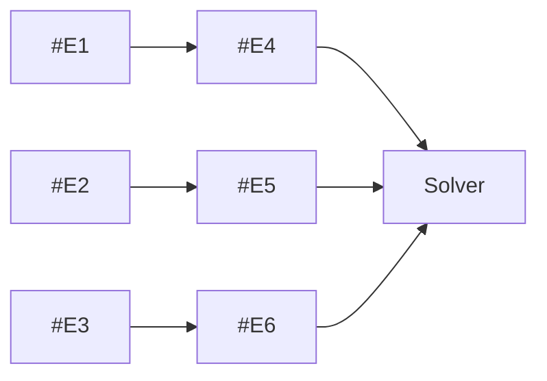
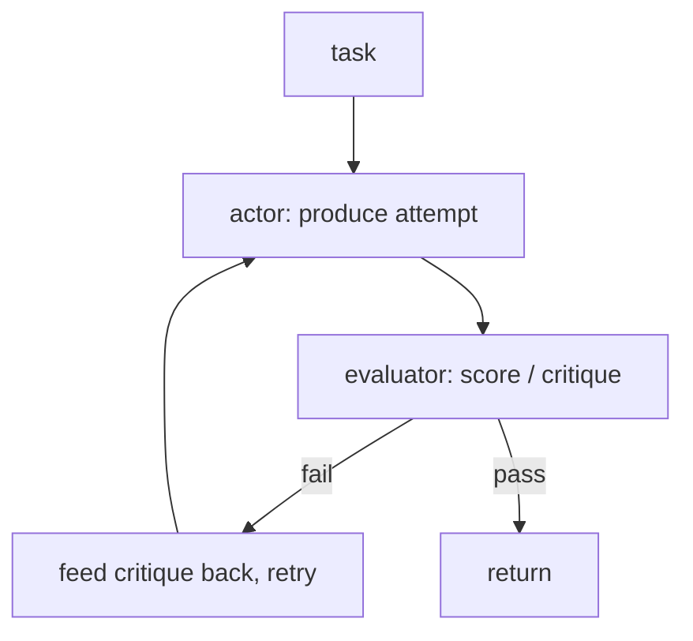

# Lecture 9: Parallelism, Reflection & Search — LLM Compiler, Reflexion, LATS

> You already know the workhorse patterns: ReAct (serial, interleaved), Plan-and-Execute (plan then grind), and ReWOO (plan once, execute cheaply, solve once). Those three cover the overwhelming majority of production agents. This lecture is about the *other* three — the ones you reach for only when a specific, measurable problem shows up. LLM Compiler attacks **latency** by running independent tool calls in parallel. Reflexion (Anthropic's evaluator-optimizer) attacks **quality** by having a critic score the output and feeding the critique back for a retry. LATS attacks **hard search problems** by doing tree search over action sequences with rollouts. The unifying skill this lecture builds is not "how to implement each" — it is *knowing when to reach for them and, more importantly, when not to.* After this you can look at a task, name the one signal that justifies each of these three, state the one-line engineering tradeoff each makes, and defend why the default answer is still "don't."

**Prerequisites:** ReAct, Plan-and-Execute, and ReWOO (the earlier Week-2 lectures); the workflow-vs-agent distinction and Anthropic's building-block vocabulary; comfort with big-O and simple probability · **Reading time:** ~26 min · **Part of:** AI Agents & Agentic Systems, Week 2

## The core idea (plain language)

The three patterns you already know all optimize the same thing in different ways: **token cost**. ReWOO cuts tokens by keeping observations away from the planner; Plan-and-Execute cuts high-level reasoning calls by planning once. But tokens are only one of the three axes an agent lives on. The full triangle is **tokens, latency, and quality**, and the three patterns in this lecture each pick a different corner.

- **LLM Compiler optimizes latency.** If four of your six tool calls don't depend on each other, running them one after another is wall-clock waste. The Compiler has the planner emit a *dependency graph* (a DAG) of tool calls, and a scheduler fires every independent branch concurrently, joining only where one call genuinely needs another's output. Same tokens, same tool calls — but the wall-clock time collapses from "sum of all calls" toward "length of the longest dependency chain."

- **Reflexion optimizes quality, but only when quality is checkable.** Run the task, then have a critic (an LLM, a test suite, a JSON validator, a rubric scorer) evaluate the output. Feed that critique back and let the agent try again. This is a cheap quality bump *if and only if* "good" has a concrete signal — tests that pass, JSON that validates, a numeric rubric score. When "good" is subjective and uncheckable, Reflexion is just an expensive way to generate plausible-sounding revisions with no ground truth telling you they're better.

- **LATS optimizes exploration of a genuine search space.** It runs Monte Carlo Tree Search (MCTS) over sequences of actions: expand candidate next steps, simulate rollouts, back up value estimates, and eventually commit to the best-scoring path. It is the "throw compute at the problem" endpoint of the whole spectrum. It can crack tasks the others fail at — but at a token and latency cost that is often 10-50x a plain agent, so you reach for it only when the task is *actually* a search problem and you can afford the bill.

The load-bearing lesson is the same as the rest of Week 2: **start simple, and add one of these only when you can name the specific signal that justifies it.** Reaching for LATS because it sounds powerful is the agentic equivalent of reaching for Kubernetes to run a cron job.

## How it actually works (mechanism, from first principles)

### LLM Compiler: a DAG, not a list

Plan-and-Execute and ReWOO both produce a *linear* plan — step 1, step 2, step 3 — and execute it top to bottom. The LLM Compiler's insight is that a linear plan throws away information: most plans are not truly linear, they only *look* linear because a list is the easiest thing for a planner to emit. The real structure is a **directed acyclic graph** where an edge from A to B means "B's arguments depend on A's result."

Consider the canonical Week-2 task: compare the metro populations of three cities (capital of France, most populous city in Japan, 2028 Olympics host). ReWOO emits six steps:

```
#E1 = search[capital of France]                 -> Paris
#E2 = search[most populous city in Japan]        -> Tokyo
#E3 = search[2028 Summer Olympics host]          -> Los Angeles
#E4 = search[#E1 metro population]               -> needs #E1
#E5 = search[#E2 metro population]               -> needs #E2
#E6 = search[#E3 metro population]               -> needs #E3
```

The dependency structure is not a line — it is three independent chains:



`#E1`, `#E2`, `#E3` depend on nothing — they can all fire at once. `#E4` depends only on `#E1`, `#E5` only on `#E2`, `#E6` only on `#E3`. There are only two *levels* of dependency here. A serial executor does 6 calls back-to-back. A DAG scheduler does level 1 (three calls in parallel), waits for them, then level 2 (three more in parallel) — **2 levels instead of 6 calls.**

Put numbers on it. Say each `search` takes 150 ms (the spine's mock latency) and each of the two LLM calls (plan + solve) takes 800 ms.

- **Serial (ReWOO):** plan (800) + 6 × search (6 × 150 = 900) + solve (800) = **2,500 ms**.
- **LLM Compiler:** plan (800) + level-1 parallel (max of 3 × 150 = 150) + level-2 parallel (150) + solve (800) = **1,900 ms**.

That is a 24% wall-clock reduction on a toy task with cheap tools. Now make the tools realistic — a web search or an API call at 2 seconds each:

- **Serial:** 800 + 6 × 2000 + 800 = **13,600 ms**.
- **Compiler:** 800 + 2000 (level 1) + 2000 (level 2) + 800 = **5,600 ms**.

That is a **2.4x speedup**, and it grows with the *width* of your DAG. The general rule: serial latency scales with the **number of calls**; DAG latency scales with the **critical path** (the longest dependency chain). The wider and shallower your dependency graph, the bigger the win.

```
SERIAL executor                    DAG scheduler (LLM Compiler)
call1 ─ call2 ─ call3 ─ ...        level 1: [call1 | call2 | call3]  (concurrent)
(latency = sum of all)             level 2: [call4 | call5 | call6]  (concurrent)
                                   (latency = sum over LEVELS = critical path)
```

The Compiler has three components: a **Planner** that emits the DAG (tasks plus their dependency edges, often with the same `#E`-style variable references as ReWOO), a **Task Fetching Unit** that watches which tasks have all their dependencies resolved and dispatches them as soon as they're ready, and a **Joiner** that decides whether the collected results are enough to answer or whether to re-plan. The scheduler is the part doing the real work: it is a topological execution of the graph where every node whose inputs are ready runs immediately, concurrently with its siblings.

The cost: **DAG planning is strictly harder than list planning.** The planner must correctly identify dependencies. Get one wrong and you either serialize things that could have been parallel (lose the benefit) or parallelize things that had a hidden dependency (get wrong answers because `#E4` fired before `#E1` resolved). Weaker models botch dependency extraction the same way they botch ReWOO's `#E` format. And if your tasks *don't* have real independent parallelism — if it's a genuine chain where each step needs the last — the Compiler adds planning complexity and buys you nothing. **The Compiler is overkill without real parallelism.**

### Reflexion / evaluator-optimizer: the retry loop that needs a stop condition

Reflexion is a loop with three roles: an **actor** produces an attempt, an **evaluator** scores/critiques it, and (if the score is inadequate) the critique is fed back so the actor retries with that feedback in context. Anthropic's "Building Effective Agents" names this the **evaluator-optimizer** building block, and the framing matters: the optimizer (actor) proposes, the evaluator judges, and you iterate until the evaluator is satisfied or you hit a limit.



The whole pattern rises or falls on **one question: is "good" checkable?** There are two grades of evaluator, and they are not equal:

1. **Programmatic / ground-truth evaluators.** Tests pass or fail. JSON validates against a schema or it doesn't. Code compiles and runs. A SQL query returns rows. These are *cheap, objective, and unfoolable* — the evaluator "call" might not even be an LLM. This is where Reflexion shines: the loop terminates when the tests go green, and each iteration is grounded in a real signal. Coding agents (write → run tests → read failures → fix) are the archetypal win.

2. **LLM-as-judge / rubric evaluators.** A critic LLM reads the output and assigns a rubric score or writes a critique. Useful, but two failure modes lurk: the judge can be **inconsistent** (score the same output differently across runs), and — subtly worse — the actor can learn to write outputs that *please the judge* rather than outputs that are *actually better*. When actor and judge are the same model family, they share blind spots, so the judge may rubber-stamp errors it would itself make.

The arithmetic of Reflexion is simple and unforgiving. Each iteration is (roughly) one actor call plus one evaluator call. Three iterations is ~6 LLM calls instead of one — **6x the cost and latency of a single shot.** That is fine when the quality bump is worth it and the loop *terminates*. It is a catastrophe when the loop *doesn't* terminate, which is the pattern's signature failure: **without a real stop condition, Reflexion loops forever** (or until a budget trips), burning tokens on revisions that never converge. You need a hard cap (max iterations, say 3) *and* a satisfaction condition (tests green / score ≥ threshold), and you need to handle the "gave up" case explicitly — return the best attempt so far, flagged as unverified.

A useful probability lens: if a single attempt succeeds with probability *p* and each retry is roughly independent given fresh critique, the chance of success within *N* tries is `1 − (1−p)^N`. At *p* = 0.6, one shot is 60%, three shots is `1 − 0.4³ ≈ 94%`. That is the quality bump, quantified — *but only if you can actually detect success*, which loops you right back to "is good checkable?" If your evaluator can't tell a good attempt from a bad one, that 94% is a fiction; you have no idea which attempt to return.

### LATS: MCTS over action sequences

LATS (Language Agent Tree Search) treats the agent's decision process as a **search tree**: each node is a state (the trajectory so far), each edge is an action (a tool call or reasoning step), and the agent explores this tree with Monte Carlo Tree Search — the same family of algorithm behind game-playing engines. The four MCTS phases, adapted to an LLM agent:

1. **Selection.** From the root, walk down the tree picking the most promising child at each level, balancing "exploit the node that looks best" against "explore nodes we're unsure about" (the classic UCT/UCB tradeoff).
2. **Expansion.** At a leaf, ask the LLM to propose several candidate next actions — this is the *branching factor*, and it is where cost explodes.
3. **Evaluation / rollout.** Simulate forward from the new node (let the agent run a few steps) and score the result with a value function — often an LLM-as-judge, sometimes a real environment reward.
4. **Backpropagation.** Push that score back up the path so ancestors' value estimates improve, guiding the next selection.

Repeat for a budget of iterations, then commit to the best path found. LATS also folds in reflection: a failed rollout produces a verbal critique stored on the node, so the search doesn't repeat the same mistake.

The reason you rarely ship this is the arithmetic. A tree with branching factor *b* and depth *d* has up to `b^d` nodes, and MCTS visits many of them, each visit costing at least one LLM call (expansion) plus rollout calls (several more) plus an evaluation call. A modest search — branching factor 5, depth 4, 30 MCTS iterations — can mean **hundreds of LLM calls for a single task.** Where ReAct spends ~5 calls and Reflexion ~6-15, LATS spends *hundreds*. The token and latency cost is enormous and often 10-50x a plain agent.

So the signal that justifies LATS is narrow: the task is a **genuine search problem** — there are many candidate action sequences, most are wrong, the space doesn't decompose into an easy plan, and a good solution is worth a lot (so you can afford to explore). Puzzle-solving, program synthesis with a verifier, complex multi-step web navigation where greedy choices dead-end. If a linear plan or a Reflexion retry would do, LATS is pure waste.

## Worked example

You are building a service that, given a company name, produces a one-paragraph competitive brief that must cite three data points: latest headcount, most recent funding round, and headquarters city. You have a `search(query)` tool (2 s/call) and the brief must pass a validator that checks all three data points are present and each is backed by a source URL. Walk the three patterns.

**Latency framing → LLM Compiler.** The three lookups (headcount, funding, HQ) are mutually independent — none needs another's result. Serial: plan (800 ms) + 3 × 2000 + solve (800) = **7,600 ms**. Compiler: plan (800) + max(3 × 2000) = 2000 + solve (800) = **3,600 ms**. A 2.1x speedup for free, because the DAG is one level wide with three parallel branches and no cross-dependencies. This is the textbook "4-of-6 calls are independent, latency is the complaint" signal. If you were doing 50 companies in a batch, that per-request halving is the difference between a snappy API and a timeout.

**Quality framing → Reflexion.** The brief must pass a validator — that is a *checkable* "good." So wrap the writer in an evaluator-optimizer loop: writer drafts the brief; the validator checks "all three data points present with source URLs"; if headcount is missing, feed back `"missing: headcount with source"`; writer retries. Cap at 3 iterations. Iteration 1 might miss HQ (52% of drafts do, say); iteration 2, given the specific critique, fills it. Cost: ~2 writer calls + 2 validator calls instead of 1 — roughly 4x — but the output goes from "usually incomplete" to "validated." This is a legitimate Reflexion win *because the validator is programmatic and objective.* Contrast: if the requirement were "make the brief compelling," there's no validator, an LLM judge would waffle, and Reflexion would spin without converging — don't use it.

**Search framing → LATS (and why not here).** Is producing this brief a search problem? No. There is one obvious plan (three lookups, then write), the space of "action sequences" is trivial, and there's nothing to explore. Reaching for LATS here would turn a 4-call task into a 200-call one for zero quality gain. LATS would be justified only if, say, the data were buried behind a maze of links where each navigation choice could dead-end and you had to backtrack — a genuine search. Naming *why you didn't* use LATS is the actual skill.

**The composition insight:** these aren't mutually exclusive. The right production design here is often *both* of the first two — an LLM-Compiler DAG for the parallel lookups wrapped in one Reflexion loop for the validation retry. LATS stays on the shelf.

## How it shows up in production

- **The Compiler's speedup is real but the planner is the risk.** In production the win is exactly what the arithmetic promises: wall-clock drops toward the critical path. But your p99 latency now depends on the planner correctly extracting dependencies. A planner that misses a dependency ships a subtly wrong answer (a call ran before its input was ready); a planner that invents a dependency silently serializes and you wonder why the "parallel" system is slow. Log the emitted DAG and assert its shape in tests — the DAG is now a debuggable artifact, not an implementation detail.

- **Async is not free plumbing.** "Run independent branches in parallel" means real concurrency — `asyncio.gather`, connection pools, and rate limits. Fire six parallel searches at an API with a 5 QPS limit and you'll trade latency wins for 429s. The Compiler moves your bottleneck from the model to your tool infrastructure; provision for it.

- **Reflexion's cost is multiplicative and easy to under-budget.** A 3-iteration loop is 3-6x the calls of a single shot. Nest it inside a multi-step agent and the multiplier compounds. The dollar budget from Week 1 is your backstop, but budget for the *expected* iterations, not the best case — and alert when runs routinely hit the max-iteration cap, because that means the loop isn't converging and you're paying full price for no improvement.

- **The infinite-loop failure is a real 3am page.** A Reflexion agent whose evaluator never says "good enough" will loop until a budget trips — and if you forgot the budget (Week 1's whole point), it runs until your bill notices. The two must-haves are a hard iteration cap *and* an explicit "gave up, returning best-effort, flagged unverified" path. Never let satisfaction be the *only* exit.

- **LLM-as-judge drift corrupts the signal.** If your Reflexion evaluator is an LLM, its scores wander run-to-run and version-to-version. An output that scored 8/10 last week scores 6/10 after a model upgrade, and your loop's behavior changes with no code change. Pin the judge model, and prefer programmatic checks wherever a real one exists — a test suite doesn't drift.

- **LATS costs will shock finance.** Hundreds of model calls per task is a different cost regime entirely. Before shipping LATS, do the multiplication: `iterations × (branching + rollout_steps + 1) × avg_call_cost`, and compare against the value of the marginal quality it buys over Reflexion. In practice most teams discover a well-tuned Reflexion loop captures 80% of the gain at 5% of the cost — which is exactly why LATS stays rare.

## Common misconceptions & failure modes

- **"LLM Compiler saves tokens."** It doesn't — it does the *same* tool calls and roughly the same tokens as a serial plan. It saves **wall-clock latency** by overlapping independent calls. If your complaint is cost, the Compiler is the wrong tool; look at ReWOO. If your complaint is *time* and you have independent calls, it's the right one.

- **"Parallelize inside Plan-and-Execute instead — same thing."** You can hand-parallelize a specific step, and for one known-independent fan-out that's often the *right, simpler* move. The Compiler's value is when the *planner* discovers the parallelism dynamically across an arbitrary DAG. Don't build the Compiler to parallelize one hard-coded step you already know about; just `asyncio.gather` that step.

- **"Reflexion always improves quality."** Only when "good" is checkable. With a real evaluator (tests, schema, rubric with ground truth) it's a genuine bump. With a vague or subjective target, the critic has nothing to anchor on, the actor optimizes to please the critic rather than reality, and you burn calls producing confident-but-not-better revisions. No checkable "good" → don't use Reflexion.

- **"The critic being an LLM is fine."** Sometimes — but an LLM judge can be inconsistent and can share the actor's blind spots (especially if it's the same model). Prefer a programmatic evaluator whenever one exists; reserve the LLM judge for genuinely subjective dimensions and pin its version.

- **"More Reflexion iterations = better."** Returns diminish fast (that `1 − (1−p)^N` curve flattens), cost grows linearly, and past a couple of iterations you're usually thrashing. Cap at 2-3 and treat hitting the cap as a signal, not a success.

- **"LATS is just a better agent."** LATS is a *search algorithm*, appropriate only for tasks that are genuinely search-shaped. On a task with an obvious plan it's 10-50x the cost for zero benefit. The competence signal is being able to say "this is not a search problem, so LATS is the wrong tool."

- **"These are alternatives to ReAct/ReWOO."** They're not a replacement tier — they're targeted upgrades for specific complaints (latency / checkable-quality / search). The default is still the simplest pattern that works; these are what you add *when a simpler topology measurably fails* on one specific axis.

## Rules of thumb / cheat sheet

- **LLM Compiler — reach for it when:** you have multiple mutually independent tool calls (e.g. 4 of 6) *and* latency is your top complaint. **One-line tradeoff:** trades harder DAG planning for wall-clock latency by overlapping independent calls. **Skip it when:** calls are a genuine dependency chain, or you don't have real parallelism — then it's pure added complexity.
- **Reflexion / evaluator-optimizer — reach for it when:** "good" is *checkable* (tests pass, JSON validates, rubric scores) and one shot is unreliable. **One-line tradeoff:** trades multiplied calls (3-6x) for higher quality — *contingent on a real evaluator*. **Non-negotiable:** a hard iteration cap AND a satisfaction condition AND an explicit give-up path, or it loops forever.
- **LATS — reach for it when:** the task is a *genuine search problem* (many candidate action sequences, most wrong, doesn't decompose into a plan) AND the answer is valuable enough to afford exploration. **One-line tradeoff:** trades enormous token/latency cost (often 10-50x) for the ability to explore and backtrack. **Default:** don't — a Reflexion loop usually captures most of the gain for a fraction of the cost.
- **Latency vs cost vs quality:** Compiler = latency; ReWOO = cost/tokens; Reflexion = quality (when checkable); LATS = search coverage. Name the axis before picking the pattern.
- **The overarching default:** simplest topology that works. Add one of these only when you can state the specific signal — and log the artifact (the DAG / the critique / the tree) so you can debug it.
- (All multipliers above are approximate order-of-magnitude rules of thumb, not measured benchmarks — verify on your own traces.)

## Connect to the lab

Week 2's lab builds Plan-and-Execute and ReWOO for the shared multi-hop question and writes a decision memo. This lecture is the "what's next, and why not yet" appendix to that memo: the lab explicitly notes that if you needed the independent lookups *faster*, the next move is **LLM Compiler, not more autonomy** — this lecture is the mechanism and the arithmetic behind that sentence. The lab's self-check ("4 of 5 calls independent, latency is the complaint — which pattern?") is answered here (Compiler, and why not just hand-parallelize inside Plan-and-Execute). And the lab's pitfall "reaching for LATS/LLM Compiler on this task is gold-plating" is exactly the *know-when-not-to* judgment this lecture trains.

## Going deeper (optional)

- **Anthropic — "Building Effective Agents."** The canonical framing of the **evaluator-optimizer** building block (Reflexion's production form) and the "simplest thing that works" discipline. Search: `Anthropic Building Effective Agents`.
- **LangGraph tutorials — LLM Compiler and LATS.** LangGraph ships runnable reference implementations of both, with the DAG scheduler and the MCTS loop spelled out. Root: `langchain-ai.github.io/langgraph`. Search: `langgraph llm compiler`, `langgraph LATS language agent tree search`.
- **Reflexion (Shinn et al., 2023).** The original "verbal reinforcement learning" paper — actor / evaluator / self-reflection memory. Search: `Reflexion language agents verbal reinforcement learning`.
- **LLM Compiler (Kim et al., 2023).** The paper introducing the planner + task-fetching-unit + joiner architecture and the latency arguments. Search: `LLMCompiler parallel function calling`.
- **LATS (Zhou et al., 2023).** "Language Agent Tree Search Unifies Reasoning, Acting, and Planning." Search: `LATS language agent tree search MCTS`.
- **MCTS background.** For the selection/expansion/rollout/backprop mechanics and the UCT exploration term. Search: `Monte Carlo Tree Search UCB1 explanation`.

## Check yourself

1. LLM Compiler and ReWOO both start with a planner that emits `#E`-style steps. What does the Compiler add that ReWOO lacks, and which axis (tokens / latency / quality) does that addition attack?
2. A task has 6 tool calls arranged as two independent chains of length 3. Each tool call is 2 s; plan and solve are 800 ms each. Compute the serial and DAG wall-clock times, and state the general rule for what DAG latency scales with.
3. State the single precondition that determines whether Reflexion is worth using at all, and give one example where it holds and one where it doesn't.
4. Reflexion's signature failure mode is an infinite loop. What two mechanisms must every Reflexion loop have to prevent it, and what third thing must you do when the loop gives up?
5. Roughly how many LLM calls does a LATS search with branching factor 5, depth 4, and 30 iterations imply, order-of-magnitude — and what single property must a task have before that cost is justified?
6. Your teammate proposes LATS to generate marketing copy that should be "more engaging." Give the two-part reason this is the wrong tool.

### Answer key

1. The Compiler adds an explicit **dependency graph (DAG)** over the steps — it records which steps depend on which — and a **scheduler** that runs all steps whose inputs are ready concurrently. That attacks **latency** (wall-clock), not tokens: it does the same calls as ReWOO but overlaps the independent ones instead of running them serially.

2. Serial: `800 + 6×2000 + 800 = 13,600 ms`. DAG: the critical path is one chain of length 3, and the three chains run in parallel, so `800 + 3×2000 + 800 = 7,600 ms` (each *level* across the three chains runs concurrently, so it's three sequential levels of 2 s each, not six). General rule: **DAG latency scales with the critical path (the longest dependency chain), while serial latency scales with the total number of calls.**

3. The precondition: **"good" must be checkable** — there must be a concrete success signal. It holds when there's a test suite, a JSON schema validator, a compiler, or a rubric with ground truth (e.g. "does this code pass its tests?"). It fails when the target is subjective and unverifiable (e.g. "make this prose more beautiful"), where a critic has nothing objective to anchor on and the actor just learns to please the judge.

4. Every Reflexion loop needs (a) a **hard iteration cap** (e.g. max 3) and (b) a **satisfaction condition** (tests green / score ≥ threshold) — satisfaction must never be the *only* exit. Third, when the loop hits the cap without satisfying the condition, you must **return the best attempt so far, explicitly flagged as unverified/best-effort**, rather than pretending it succeeded.

5. Order of magnitude: **hundreds of calls** — roughly `iterations × (branching + rollout_steps + 1)`, i.e. ~30 × (5 + a few rollout steps + 1) ≈ a few hundred LLM calls. That cost (often 10-50x a plain agent) is justified only when the task is a **genuine search problem**: many candidate action sequences, most of them wrong, no easy linear plan, and enough value in the answer to afford exploration.

6. (a) Marketing copy is **not a search problem** — there's no large space of action sequences to explore where most dead-end; it's a single generation task, so MCTS has nothing meaningful to search over. (b) "More engaging" is **not checkable** — there's no objective evaluator to guide the tree's value estimates, so the rollout scores would be arbitrary LLM-judge noise. Wrong on both the search axis and the checkable-quality axis; the right tool is at most a simple critique-and-revise (and only if you can define a rubric), never LATS.
