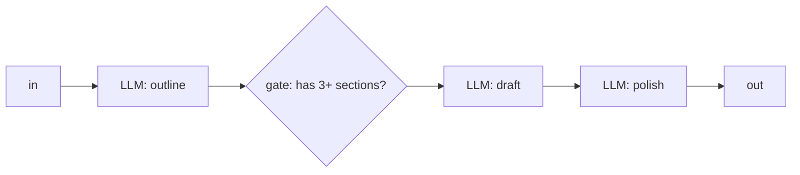
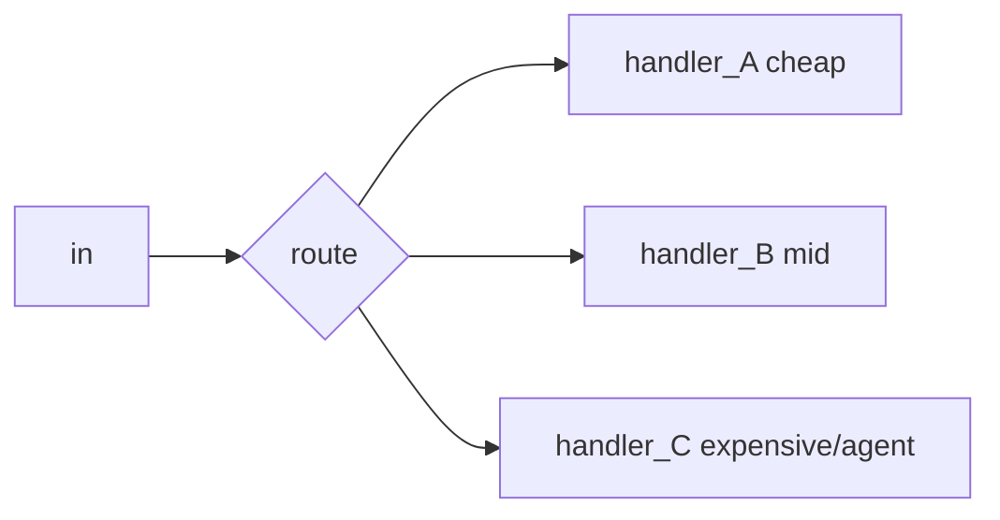
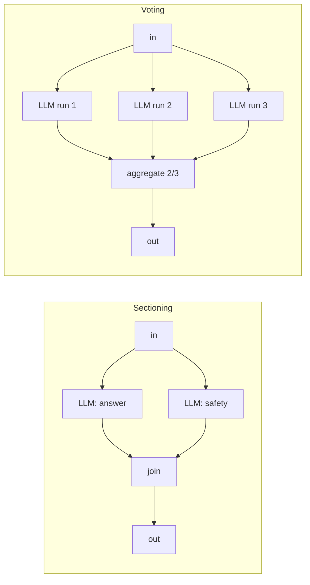
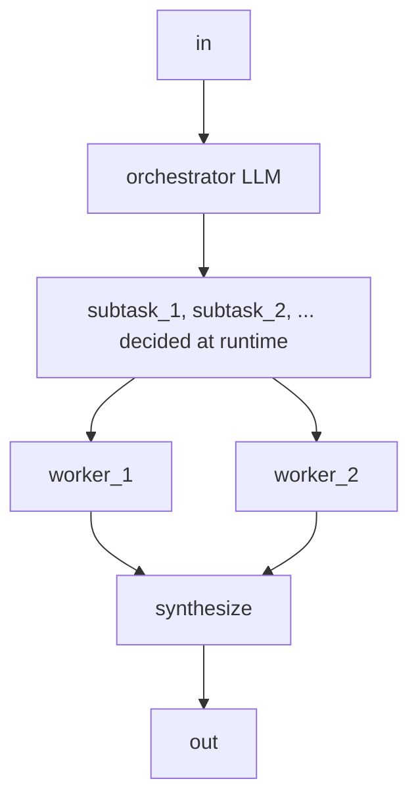
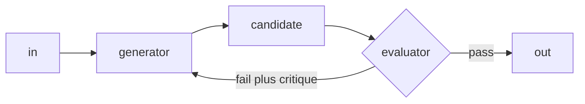

# Lecture 10: The Workflow-vs-Autonomous Spectrum, Building Blocks & Routing

> Most "agent" projects that blow their budget, drift, or become impossible to debug did so the moment someone reached for autonomy they didn't need. This lecture gives you the vocabulary and the discipline to avoid that: a sharp line between *workflows* (LLMs on code paths you own) and *agents* (LLMs that own their own control flow), five composable building blocks that cover ~90% of real systems, and a routing layer that sends each request to the cheapest handler that can serve it. After this you will be able to look at a task, name the simplest topology that solves it, encode a routing policy in code, and state the exact evidence you'd need before upgrading a workflow to a true agent.

**Prerequisites:** Lecture 9 / Week 1 (the agent loop, native tool calling, budgets), Phase 2 structured outputs & tool calling, basic probability & big-O. · **Reading time:** ~28 min · **Part of:** AI Agents & Agentic Systems (Expanded Deep Track), Week 2

---

## The core idea (plain language)

There is one distinction that organizes everything else in agent engineering, and Anthropic's *Building Effective Agents* states it cleanly:

- **Workflows** are systems where LLMs and tools are orchestrated through **predefined code paths**. *You* wrote the `if`/`for`/`await` that decides what happens next. The LLM fills in slots — classify this, extract that, summarize this — but the shape of the computation is fixed before runtime.
- **Agents** are systems where the LLM **directs its own process**, deciding dynamically which tools to call, in what order, and when it's done. The control flow *emerges* from the model's choices at runtime.

That's the whole spectrum. On the left, a `while` loop you can read top to bottom. On the right, a loop whose next step is a model output you can't predict. Everything real lives somewhere on this line, and most production systems that survive contact with users sit *further left than their builders originally wanted*.

Why does the position matter? Three properties trade off monotonically as you move right:

| Property | Workflow (left) | Agent (right) |
|---|---|---|
| Predictability | High — same input, same path | Low — path varies per run |
| Cost / latency | Low — bounded calls | High — unbounded loop, retried context |
| Debuggability | Easy — set a breakpoint | Hard — "why did it do that?" |
| Flexibility / open-endedness | Low | High |

The load-bearing principle for the entire week: **start with the simplest composition that could work, and add autonomy only when a simpler topology *measurably* fails.** Not when it feels limiting. Not when a demo of the fancy version looked cool. When you have a trace, a number, and a task the simpler thing provably can't do.

The five **building blocks** below are your default vocabulary. Learn to see any system as a composition of these before you reach for "an agent."

## How it actually works (mechanism, from first principles)

### The five building blocks

Anthropic frames five patterns. Each is a *shape of code* around one or more LLM calls. Learn the shape, the one concrete example, and the failure mode.

**1. Prompt chaining.** Decompose a task into a fixed sequence of steps; each LLM call works on the previous call's output. Optional programmatic "gates" between steps check that the intermediate result is valid before continuing.


*Concrete example:* generate marketing copy, then translate it. Step 1 writes copy in English; a gate checks length; step 2 translates. *Why it works:* trades latency for accuracy by making each call do one easy thing. *Failure mode:* a bad early step poisons everything downstream — put gates where a cheap check catches garbage early.

**2. Routing.** A classifier inspects the input and dispatches it to one of several specialized follow-on paths. This is the block this lecture goes deep on — see below.


*Concrete example:* a support inbox where "reset my password" goes to a canned-flow handler and "explain why my invoice is wrong" goes to a reasoning model with billing tools.

**3. Parallelization.** Run multiple LLM calls concurrently and aggregate. Two distinct sub-shapes that people constantly conflate:
- **Sectioning** — split the work into *independent subtasks* that run in parallel, then join. Example: one call drafts the answer while a *separate* call screens the same input for policy violations. Independence is the point — a guardrail that runs in the same call as the answer can be argued out of by the same prompt injection that fooled the answer.
- **Voting** — run the *same* task multiple times and aggregate (majority vote, or "flag if any run says unsafe"). Example: three independent calls review code for a vulnerability; you act if 2 of 3 agree. Voting buys reliability at linear cost.



**4. Orchestrator-workers.** A central LLM *dynamically* breaks a task into subtasks, delegates each to a worker LLM, and synthesizes the results. The difference from sectioning: the subtasks are **not known in advance** — the orchestrator decides them at runtime. This is where you cross from pure workflow toward agent: the *decomposition* is model-directed.

*Concrete example:* "make this change across the codebase" — the orchestrator finds which files are affected (it can't know beforehand) and spawns a worker per file.

**5. Evaluator-optimizer.** One LLM generates, a second LLM evaluates against criteria and returns critique, and you loop until the evaluator is satisfied or a budget trips. This is Reflexion / self-critique in building-block clothing.

*Concrete example:* literary translation where an evaluator flags nuance lost in the first pass. *Requires* a real notion of "good" the evaluator can check (tests pass, JSON validates, rubric score) — and a hard stop, or it loops forever burning tokens.

**When does something become an "agent"?** When the model, not your code, decides the sequence and termination. In practice: a `while` loop that keeps calling the model with a growing transcript, executing whatever tools it requests, until the model itself says "done." That's Week 1's ReAct loop. It's the most flexible and the most expensive/opaque thing on the spectrum. The five blocks above let you get most of the value *without* handing the model the steering wheel.

### The numeric intuition: why left-of-spectrum is cheaper

The dominant cost in a naive autonomous loop is that **the entire growing transcript is re-sent every step.** If step *k* carries roughly *k* units of context, the total input tokens across *n* steps is proportional to `1 + 2 + ... + n = n(n+1)/2` — **O(n²)** in the number of steps. That's the arithmetic behind "agents get expensive fast."

Worked comparison for a 6-step task, assuming ~500 tokens added per step and (illustrative) $5 / 1M input tokens:

- **Autonomous ReAct:** input tokens ≈ 500 × (1+2+3+4+5+6) = 500 × 21 = **10,500 input tokens**, across 6 model calls. Roughly $0.05 just on input replay, plus 6 sequential round-trips of latency.
- **A ReWOO-style workflow** (plan once, execute cheaply, solve once — you'll build this in the lab): ~2 reasoning calls total. The planner emits all 6 steps in one call (~600 tokens), workers run the tools with *no* LLM, the solver reads the evidence once (~1,500 tokens). Input tokens ≈ **~2,100**, in 2 model calls. Roughly **5× fewer tokens and 3× fewer round-trips.**

Same answer, when the plan is predictable. The workflow wins on cost *and* latency *and* traceability. The only thing it gives up is mid-course adaptation — and if the task never needs to adapt, that's not a loss.

> These are illustrative arithmetic, not measured benchmarks — the point is the *shape* (quadratic vs near-constant), which holds regardless of the exact token counts.

## Routing / dispatch in depth: the pattern that makes production economical

Here is the single highest-leverage move in cost engineering for LLM systems, and it's almost embarrassingly simple: **most requests are easy; don't send them to your most expensive handler.**

A router is a classifier at the front door. It reads each incoming request and dispatches it to **the cheapest handler that can serve it**. The classifier can be, in ascending order of cost and capability:

1. **Keyword / regex rules** — free, instant, deterministic. "contains `refund` and `order #` → billing flow." Use for the obvious, high-volume cases.
2. **An embedding + nearest-centroid classifier** — one embedding call (~$0.00002), sub-millisecond compare against a handful of labeled category centroids. Great when categories are fuzzy but stable.
3. **A small/cheap LLM** (e.g. Haiku-class / a 4o-mini-class model) asked to emit one label as structured output. Use when the decision needs a little reasoning. Cost is a fraction of routing to a frontier model for *every* request.

The economics: suppose 70% of your traffic is trivial (FAQ lookups) and 30% needs real reasoning. Without routing, every request hits your $X frontier handler. With routing, 70% hit a handler that costs ~5% of that, and the router itself costs almost nothing. Your blended cost drops toward `0.7 × 0.05X + 0.3 × X ≈ 0.335X` — you cut spend by roughly two thirds without touching quality on the hard cases. **This is the pattern that makes an LLM product's unit economics close.**

### Encoding a routing policy derived from a decision memo

In the Week 2 lab you write a one-page **decision memo**: you run the same multi-hop task under different topologies, measure tokens/latency/quality, and record *which pattern wins and under what conditions the answer flips*. The router is where that memo becomes code. A defensible starting policy, mapping the *shape* of the request to the *cheapest sufficient control-flow pattern*:

- **Single-fact lookup → ReAct.** One or two tool calls, answer inline. The overhead of planning is wasted; just loop once or twice.
- **Predictable multi-hop → ReWOO.** The steps are knowable up front and don't depend on each other's *content* (e.g. "look up three cities' populations, compare"). Plan once, execute cheaply, solve once. Big token win.
- **Adaptive / branch-on-result → Plan-and-Execute.** Later steps depend on what earlier steps *returned* (a lookup might fail and need a fallback query; a result might change the plan). You need a replanner in the loop, and you pay for it — correctly.

A minimal, honest router:

```python
def route(query: str, examples: list) -> str:
    q = query.lower()
    # 1) free rules first — catch the obvious, high-volume cases
    if len(q.split()) < 12 and q.count("?") <= 1 and " and " not in q and " compare" not in q:
        return "react"                      # single-fact shape
    # 2) cheap LLM (or embedding classifier) for the ambiguous middle
    label = cheap_llm_classify(             # -> {"react","rewoo","plan_execute"}
        system="Classify the query's control-flow needs. "
               "single fact -> react; predictable multi-step, steps independent -> rewoo; "
               "steps depend on prior results / may need fallback -> plan_execute. "
               "Answer with exactly one label.",
        user=query,
    )
    return label if label in {"react", "rewoo", "plan_execute"} else "plan_execute"

DISPATCH = {"react": run_react, "rewoo": run_rewoo, "plan_execute": run_plan_execute}
answer = DISPATCH[route(query, EXAMPLES)](query)
```

Two engineering notes that separate a toy router from a production one:

- **Fail toward capability, not toward cheapness.** When the classifier is unsure, default to the *more* capable handler (`plan_execute` above), not the cheapest. A misroute to a too-weak handler produces a wrong answer (expensive: a user-visible failure); a misroute to a too-strong handler just costs a few extra cents. Asymmetric stakes → asymmetric default.
- **Log the routing decision as structured data.** Every dispatch should emit `{query_hash, chosen_route, classifier_confidence, downstream_cost, correct?}`. That log *is* your evidence for tuning the policy — and, later, your training set if you ever fine-tune the router. Without it you're tuning by vibes.

### Routing as the composition backbone

Notice that routing composes with everything else. Your production system is usually: **router → {a cheap prompt-chain, a ReWOO workflow, or a full agent}**, with an **evaluator-optimizer** bolted onto whichever branch has a checkable quality bar. That composition — a workflow that *contains* an agent only on the branch that needs it — is how you get autonomy's flexibility on the 5% of hard requests without paying for it on the other 95%.

## Worked example

A B2B support assistant handling 10,000 tickets/day. Naive design: every ticket → one autonomous agent with 8 tools (search KB, read order, issue refund, escalate, …), average 5 loop steps.

**Before routing (all-agent):**
- 10,000 tickets × 5 steps × ~2,000 avg input tokens/step (transcript replay) ≈ 100M input tokens/day.
- At an illustrative $5/1M in + $15/1M out (say 15M out): ≈ $500 + $225 = **~$725/day**, and p95 latency dominated by 5 sequential model round-trips (~8-15s).

**After routing.** You bucket a week of tickets and find:
- 60% are single-fact ("what's my order status?") — one KB or order lookup. → **ReACT, 1-2 steps.**
- 30% are predictable multi-hop ("compare my last 3 invoices and tell me which changed") — knowable steps. → **ReWOO, 2 LLM calls.**
- 10% are genuinely open-ended ("my integration is failing intermittently, help me diagnose") — needs adaptive tool use. → **full agent.**

Router = an embedding classifier (~$0.00002/ticket) with a keyword pre-filter.

- 6,000 single-fact × ~2 calls × ~800 tokens ≈ 9.6M tokens.
- 3,000 multi-hop × 2 calls × ~1,500 tokens ≈ 9M tokens.
- 1,000 open-ended × 5 steps × ~2,000 tokens ≈ 10M tokens.
- Router: 10,000 × ~300 tokens ≈ 3M tokens (cheap model).
- **Total ≈ 31.6M input tokens/day vs 100M** — roughly a **3× cost reduction**, with p95 latency on the 90% common path down to 1-2 round-trips.

And you got something free: the 90% now runs on **debuggable, predictable code paths**. When a single-fact ticket returns garbage you can set a breakpoint; you're not spelunking a 5-step transcript asking "why did it do that?" The autonomy you kept is aimed exactly at the 10% that needs it.

## How it shows up in production

- **Cost.** The O(n²) transcript-replay math above is the #1 surprise on the first invoice. A loop that "works" on 3-step tasks becomes ruinous on 8-step ones. Routing + choosing a flatter topology (ReWOO, orchestrator with cheap workers) is where the money is.
- **Latency.** Autonomous loops are *sequential by construction* — each step waits for the previous model call. Users feel every round-trip. Workflows let you parallelize (sectioning, LLM-compiler-style DAGs) and cut wall-clock. If latency is the complaint, the fix is usually *more structure*, not more autonomy.
- **Debuggability & on-call.** When a workflow misbehaves you can attach a debugger to the failing node. When an agent misbehaves you get a transcript and a shrug. At 3am, the workflow is the one you can fix. This is a real operational cost that rarely shows up in the initial design doc.
- **Quality variance.** Autonomous agents have a *distribution* of behaviors per input; workflows have (nearly) one. A workflow that's 90% right is 90% right every time — you can find and fix the 10%. An agent that's 90% right is a moving target; the same input can pass Monday and fail Tuesday, which makes regression testing miserable.
- **The "add autonomy" ratchet only turns one way in practice.** Teams add autonomy to fix a capability gap, then discover they can't remove it without a rewrite because downstream expectations grew around the flexible behavior. Delaying autonomy is cheap; removing it is expensive. Bias toward starting simple.

## Common misconceptions & failure modes

- **"Agentic = better / more advanced."** No. Agentic = more autonomy = more cost, latency, and unpredictability. It's a tool with a price, not a badge. The most sophisticated production systems are mostly workflows with a small autonomous core.
- **"We need an agent framework to build this."** Most of what you need is `if`, `for`, `await`, and structured LLM calls. Frameworks (you'll evaluate them in Week 3) can *hide* the control flow you most need to see. Understand the building blocks first; adopt a framework because it earns its keep, not by default.
- **Confusing sectioning with voting.** Sectioning splits *different* subtasks in parallel; voting runs the *same* task multiple times for reliability. A guardrail belongs in a *separate section* from the answer (so the same jailbreak can't compromise both); a high-stakes yes/no belongs in a *vote*.
- **Confusing orchestrator-workers with sectioning.** Sectioning's subtasks are fixed in your code; orchestrator-workers' subtasks are decided by the model at runtime. If you can enumerate the subtasks in advance, you don't need an orchestrator — and you shouldn't pay for one.
- **Routing to cheapest and hoping.** A router that always fails toward the cheap handler quietly ships wrong answers on hard cases. Fail toward capability; measure misroute rate; log every decision.
- **Evaluator-optimizer with no stop condition.** Self-critique loops without a hard budget (max iterations *and* a "good enough" threshold) will happily spin forever. Bound it like any other loop.
- **Skipping the measurement before upgrading.** "It feels limited" is not evidence. The rule is *measurably* fails — you need a trace showing the simpler topology producing a wrong or impossible result on a real task before you add autonomy.

## Rules of thumb / cheat sheet

- **Default position:** simplest composition that could work. Move right on the spectrum only on evidence.
- **Reach order for a new task:** single LLM call → prompt chain → routing → parallelization → orchestrator-workers / evaluator-optimizer → *then* consider a full agent.
- **Route by shape:** single-fact → ReAct; predictable multi-hop → ReWOO; adaptive/branching → Plan-and-Execute.
- **Router cost ladder:** keywords (free) → embedding classifier (~cents/1000) → small LLM. Use the cheapest that's accurate enough.
- **Router default:** on low confidence, fail toward the *more capable* handler. Log every routing decision as structured data.
- **Cost mental model:** naive loop input tokens ≈ O(steps²) from transcript replay. Flatten the topology to flatten the curve.
- **Guardrails go in a separate section** from the thing they guard, never inline in the same call.
- **Evaluator-optimizer needs:** (a) a checkable "good" and (b) a hard iteration + budget cap.
- **Upgrade-to-agent signal (one):** the set of required steps genuinely *cannot be enumerated ahead of time* and *depends on intermediate results* across an open-ended range — e.g. "debug this failing system," "refactor across a codebase you must first explore." (Approximate rule.)
- **Why the upgrade usually isn't worth it (one):** you trade predictable O(n) cost + easy debugging for O(n²)-ish cost, high latency variance, and un-reproducible "why did it do that" failures — a price only a genuinely open-ended task repays.

## Connect to the lab

Week 2's lab has you implement **Plan-and-Execute and ReWOO for the *same* multi-hop question**, instrument both with a token/latency/LLM-call meter, and run each 5× to compare medians. That comparison table *is* the empirical version of this lecture's O(n²) argument — you'll watch ReWOO use ≥2× fewer tokens on the predictable plan. Then you write the **decision memo** (which wins, and the flip condition where Plan-and-Execute's replanner takes over), and finally build the **router** (`router.py`) that dispatches single-fact → ReAct, predictable multi-hop → ReWOO, adaptive → Plan-and-Execute — turning this lecture's routing section into runnable, tested code.

## Going deeper (optional)

Real, named resources (search titles; don't trust invented deep links):

- **Anthropic — "Building Effective Agents"** (the canonical source for this lecture; search: `Anthropic Building Effective Agents`). Root domain you can trust: `anthropic.com`.
- **OpenAI — "A Practical Guide to Building Agents"** (a second-vendor framing of the same mental model; search that exact title).
- **LangGraph docs — "Agent architectures" / "Workflows and agents"** (engineering-framed patterns incl. routing, orchestrator-worker, evaluator-optimizer). Root: `langchain-ai.github.io/langgraph`.
- **LangGraph tutorials — "Plan-and-Execute"** and **"ReWOO"** (search: `langgraph plan and execute`, `langgraph rewoo`) — the code shapes for the lab.
- **ReWOO paper** — *Reasoning WithOut Observation* (search: `ReWOO Reasoning Without Observation paper`); the abstract is enough for the intuition.
- **ReAct paper** — *ReAct: Synergizing Reasoning and Acting in Language Models* (search that title) — historical baseline; skim.
- **Chip Huyen — "Agents" essay** (search: `Chip Huyen agents`) for a systems-engineering framing of planning and tool use.

## Check yourself

1. State the one-sentence difference between a workflow and an agent, and name the three properties that trade off as you move from workflow toward agent.
2. You have a task with 6 tool calls where each call's *query* is knowable up front and none depends on another's *result*. Which building block / control-flow pattern do you pick, and roughly how many LLM calls does it cost versus a naive autonomous loop?
3. A teammate proposes running the "answer" generation and the "policy safety check" inside a single LLM call to save money. What's the security problem, and which parallelization sub-shape fixes it?
4. Your router is misrouting some hard tickets to a cheap handler and shipping wrong answers. What's the one-line policy change, and why is it the right asymmetry?
5. Give one concrete signal that justifies upgrading a workflow to a fully autonomous agent, and one concrete reason that upgrade usually isn't worth it.
6. Explain, using the transcript-replay argument, why a naive autonomous loop's *input* token cost grows roughly quadratically with the number of steps.

### Answer key

1. A workflow orchestrates LLMs/tools through **predefined code paths you own**; an agent lets the **LLM direct its own control flow** at runtime. Moving toward "agent" trades away **predictability, low cost/latency, and debuggability** in exchange for flexibility.
2. **ReWOO** (predictable multi-hop, independent steps). It costs roughly **2 LLM calls** (one planner + one solver, with the N tool calls done by a no-LLM worker) versus **~N reasoning calls** each carrying the full growing transcript in a naive loop — on the order of a 2-5× token reduction here.
3. If both live in the same call, a **single prompt injection can compromise the guardrail and the answer together** — the check has no independence from the thing it's checking. Use **sectioning**: run the safety check as a *separate* parallel LLM call so an attack that fools the answer generator doesn't automatically fool the guard.
4. Change the low-confidence default to **fail toward the more capable handler**, not the cheapest. The stakes are asymmetric: a misroute to a too-weak handler yields a user-visible wrong answer (expensive), while a misroute to a too-strong handler just costs a few extra cents.
5. **Signal to upgrade:** the required steps genuinely cannot be enumerated in advance and depend on intermediate results over an open-ended range (e.g., "diagnose this intermittently failing integration," "refactor across a codebase you must explore first"). **Reason it usually isn't worth it:** you trade predictable O(n) cost and easy debugging for O(n²)-ish cost, high latency/quality variance, and non-reproducible "why did it do that" failures — a price only a truly open-ended task repays.
6. A naive loop re-sends the **entire growing transcript** on every step. If step *k* carries ~*k* units of context, total input across *n* steps is `1 + 2 + ... + n = n(n+1)/2`, which is **O(n²)**. Doubling the number of steps roughly quadruples the input token bill.
