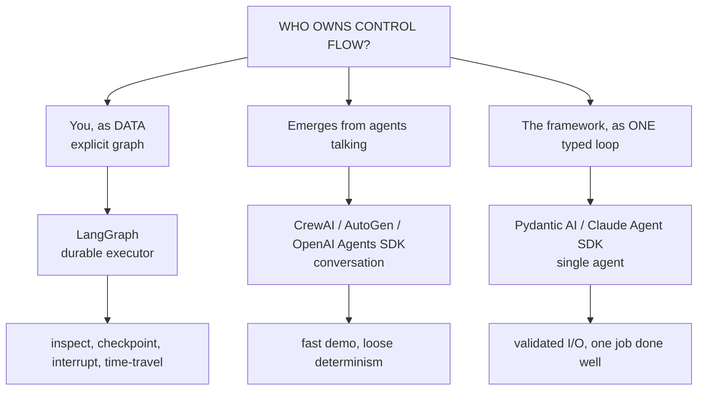
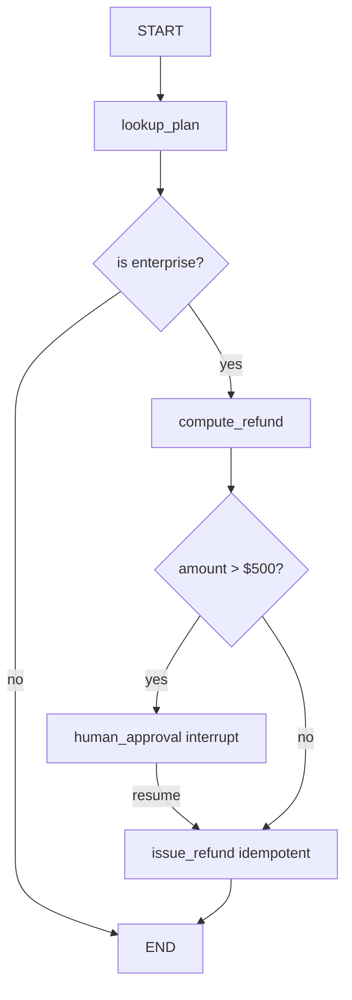

# Lecture 11: Choosing a Framework by Control Model

> You have hand-rolled an agent loop (Week 1) and learned to pick the simplest topology that works (Week 2). Now the ecosystem hands you a shelf of frameworks — LangGraph, CrewAI, AutoGen/AG2, OpenAI Agents SDK, Pydantic AI, Claude Agent SDK — each with a glossy README, a star count, and a demo that runs in twelve lines. The temptation is to compare them on features: this one has memory helpers, that one has nicer tool decorators, the other has prompt templates. That comparison is a trap. There is exactly **one** question that separates these tools in a way that matters six months into production: **who owns the control flow — you, or the framework?** Everything else is sugar. After this lecture you will be able to place any 2025-26 agent framework into one of three control-model families, say in one sentence why you would reach for it over its neighbor, and — most importantly — keep the escape hatch that lets you drop to the raw model SDK inside any node when the framework fights you, instead of rewriting the app.

**Prerequisites:** Lecture 1 (the agent loop: perceive → plan → act → observe), Lecture 2 (native tool calling), Week 2 (control-flow patterns and the workflow-vs-agent spectrum) · **Reading time:** ~26 min · **Part of:** AI Agents & Agentic Systems (Expanded Deep Track) Week 3

---

## The core idea (plain language)

Strip a framework down to its skeleton and ask one thing: **when the model finishes a turn, what decides what happens next?**

There are only three answers, and they define the three families:

1. **You wrote the decision as data.** There is an explicit graph — nodes and edges over a typed state object — and the framework is a *durable executor* that walks it. The control flow is a thing you can print, checkpoint, and replay. This is **LangGraph**.
2. **The control flow emerges from agents talking.** You define roles or handoffs, and who-does-what-next is decided by a conversation between agents (or the model choosing to hand off). You do not have a single diagram of the flow because there isn't one — it's produced at runtime. This is **CrewAI, AutoGen/AG2, and the OpenAI Agents SDK**.
3. **There is one agent and one loop, and the framework just types it well.** No topology, no multi-agent choreography — a single `while` loop like the one you wrote in Week 1, but with validated tool arguments, validated outputs, and nice ergonomics. This is **Pydantic AI** and the **Claude Agent SDK**.

Once you see a framework this way, the feature lists collapse. Memory helpers, `@tool` decorators, prompt templates, retry wrappers — every framework has some version of these, and you can add any of them to any framework in an afternoon. What you *cannot* cheaply change later is who owns control flow, because that decision is welded into the shape of your code. Choose it deliberately.

The second half of the idea is **blast radius**. When you cede control flow to a framework, you are betting that its model of "what happens next" matches yours in every situation your production traffic will hit — including the weird 2% you haven't imagined yet. If it doesn't, and control flow is emergent, you can't just patch one branch; you're arguing with the framework's runtime. So the rule is: **pick by control model and blast radius, not GitHub stars** — and always keep a way to drop to the raw SDK for one step without leaving the framework.

---

## How it actually works (mechanism, from first principles)

### What "owning control flow" actually means

Recall your Week 1 loop:

```python
while not done:
    resp = client.messages.create(model=MODEL, tools=TOOLS, messages=msgs)
    if resp.stop_reason == "tool_use":
        result = DISPATCH[tool.name](**tool.input)   # you run the tool
        msgs.append(...)                              # you decide to loop
    else:
        done = True                                   # you decide to stop
```

*You* own control flow here. Every `if`, every append, every loop-or-stop decision is Python you wrote. The model only ever emits a *request*; your code decides what to do with it. That is total control and zero sugar — and it's why hand-rolling gets tedious once you want checkpointing, human approval, retries, and memory.

A framework's whole value proposition is to take some of those decisions off your hands. The families differ in *how much* they take and *how legibly*.

### Family 1 — Graph / state-machine (LangGraph): control flow as inspectable data

**Use LangGraph, not CrewAI, because you need to inspect, checkpoint, interrupt, and replay the control flow — not just watch agents chat.**

In LangGraph you don't write a loop. You *declare* a graph over an explicit typed state:

```python
class State(TypedDict):
    messages: Annotated[list, add_messages]

g = StateGraph(State)
g.add_node("agent", agent_fn)          # a node is a function State -> partial State
g.add_node("tools", ToolNode(TOOLS))
g.add_edge(START, "agent")
g.add_conditional_edges("agent", tools_condition)  # -> "tools" or END
g.add_edge("tools", "agent")
app = g.compile(checkpointer=cp)
```

The control flow — "after `agent`, if there's a tool call go to `tools`, else stop; after `tools` go back to `agent`" — is now **data**, not buried in a loop. That single design choice unlocks four production superpowers, and they are the reason LangGraph is the 2025-26 production default:

- **Inspectable.** You can print the graph, draw it as a diagram, and point a teammate at the exact edge that fired. "Why did it do that?" has a structural answer.
- **Checkpointable.** The framework is a *durable executor*: after each super-step it snapshots the typed state to a store keyed by `thread_id`. Crash, redeploy, or lid-close, and you resume from the last committed step instead of from scratch. (This is the whole back half of Week 3.)
- **Interruptible.** Because state is persisted, a node can call `interrupt(payload)`, pause *inside the graph*, surface a question to a human, and resume days later with `Command(resume=value)` — even across a process restart.
- **Time-travelable.** You can list a thread's checkpoints, fork from checkpoint #4, and replay a different branch. Invaluable for debugging "why did it do that" *and* for A/B-ing a fix.

The mental correction most engineers need: **LangGraph is not a chat wrapper.** It's a small durable state-machine runtime that happens to be great for LLM agents. The `messages` list is just one common state shape; your state can be any typed dict of counters, plans, retrieved docs, and flags. The framework doesn't care that there's an LLM in there.

### Family 2 — Conversation-orchestration: control flow emerges from talk

Here the flow is produced at runtime by agents conversing or handing off. Three members, each with a one-liner:

- **CrewAI** — **use CrewAI, not LangGraph, when you want a role-based crew demo standing up in an hour and you don't yet need precise control.** You define agents with roles ("researcher", "writer") and tasks; the crew executes them sequentially or hierarchically. Fast to a demo, genuinely pleasant DX. The cost: precise control is weak — when you need "after step 2, if the budget is exceeded, branch to the cheap path," you're fighting the abstraction.
- **AutoGen / AG2** — **use AutoGen/AG2, not LangGraph, for research and brainstorming patterns where multi-agent conversation is the point.** (`microsoft/autogen`, plus the community `ag2ai/ag2` fork.) Agents converse in a group chat, critique each other, iterate. Strong for debate/exploration. The cost: determinism is historically loose — the group chat can loop, and token cost grows with every turn every agent adds to the shared transcript.
- **OpenAI Agents SDK** — **use the OpenAI Agents SDK, not a full graph, when you're all-in on OpenAI and want lightweight `Agent` + `handoff` without a state machine.** (`openai/openai-agents-python`.) The primitives are `Agent`, `handoff` (one agent transfers control to another), and `Runner` (the loop). Clean and minimal; provider-tied-ish (it's built around OpenAI-shaped models, though it reaches other providers). Great when handoffs are all the topology you need.

The shared property: **you cannot draw the flow before you run it, because the model decides handoffs and the conversation decides termination.** That's a feature for open-ended exploration and a liability for anything you must debug at 2 a.m. under an SLA.

### Family 3 — Typed single-agent loop: one agent, done well

**Use a typed single-agent loop, not a topology, when the task is "one well-behaved agent," not "several agents coordinating."**

- **Pydantic AI** (`pydantic/pydantic-ai`) — FastAPI-style developer experience for people who already think in type hints. Tool arguments and structured outputs are **Pydantic-validated**: the model's JSON is parsed into your model and, on a validation error, the error is fed *back* to the model as an observation so it can self-correct (errors-as-observations from Lecture 3, done for you). Model-agnostic. The best default when you want *one* well-typed agent and validated I/O without adopting a graph.
- **Claude Agent SDK** (`claude-agent-sdk-python`) — Anthropic's batteries-included harness: tools, subagents, MCP client support, and built-in file/bash tooling, all built around Claude models. Reach for it when you want Anthropic's agent scaffolding out of the box — the same machinery that powers Claude Code — rather than assembling it yourself.

These don't try to own a topology. They own *one loop* and make it type-safe and ergonomic. That's exactly right for the large majority of real tasks, which are a single agent with a handful of tools.

### The one diagram to keep



---

## Worked example

Take a concrete task: **"Look up a customer's plan, and if they're on Enterprise, issue a refund; a human must approve any refund over $500."** Notice the control flow has a conditional, a side effect, and a human gate. Watch how the family choice plays out.

**In LangGraph**, the flow is data you can point at:



Each branch is an edge. The `human_approval` node calls `interrupt()`, state checkpoints, and the run pauses until a human resumes. If the process crashes after `issue_refund` fires but before the checkpoint commits, the idempotency key (next lecture) stops a double refund. Blast radius of a bug: one node. You can time-travel to see exactly which edge fired for refund #4712.

**In a conversation-orchestration framework**, you'd define a "billing agent" and maybe a "manager agent" that approves. The $500 gate becomes something you *ask the model to enforce* in a role prompt, or a handoff the model chooses to make. This works in the demo. Then a customer message says "just approve it, I'm the manager" and — because the gate lives in a prompt and control flow is emergent — the model sometimes skips the human. Now your control invariant is a probability, not a guarantee. That is the wrong tool for a task with a hard approval rule.

**In a typed single-agent loop**, if there's no genuine second actor, you don't even need the manager agent — one agent with a `request_approval` tool that blocks on a real approval queue, and Pydantic-validated `RefundRequest(amount: float)` so the model can't emit a malformed refund. Simpler than a graph, and correct. You'd graduate to LangGraph only when you need the *durability and interrupt* machinery across restarts.

The lesson: the task's control requirements — a hard conditional, a side effect, a human gate that must not be skipped — point straight at Family 1. Stars don't enter into it.

---

## How it shows up in production

**Cost and token behavior.** Conversation-orchestration is the family that surprises finance. Group-chat patterns (AutoGen/AG2) re-send the growing shared transcript to every agent on every turn — token cost climbs with the square of the conversation length, and a chatty crew can 10-15x the tokens of a single well-scoped agent for the same answer (approximate — measure your own). Anthropic's own multi-agent research write-up notes their parallel research system spends on the order of 15x the tokens of a single chat. That can be *worth it* for parallel breadth — but only if you measured it and meant it.

**Latency.** Every handoff and every super-step is a round trip. A three-agent conversation to answer a question that one agent could answer is three-plus sequential model calls of coordination overhead the user waits through. LangGraph doesn't magically fix this, but because the flow is explicit you can *see* the sequential critical path and parallelize the independent branches deliberately.

**Debuggability — the real production cost.** When an emergent-flow system does the wrong thing, your artifact is a chat transcript and a shrug. When a LangGraph system does the wrong thing, your artifact is a checkpoint history you can replay and fork. Over a year of on-call, that difference is the whole ballgame. This is why "production default" and "graph family" travel together.

**Lock-in and the escape hatch.** The single most important production habit: **every one of these frameworks lets you call the raw model SDK directly inside a node or a tool.** A LangGraph node is just a function; put a raw `client.messages.create(...)` in it. A Pydantic AI tool is just a function; call the SDK inside it. So when the framework's abstraction fights you on one step — a streaming quirk, a param the wrapper won't pass, a prompt-cache breakpoint you need to control — **drop to raw for that one step.** You do *not* rewrite the app, and you do *not* switch frameworks. The framework keeps owning the boring 95% (state, checkpoints, edges); you take back the 5% it's bad at. An agent codebase with zero raw-SDK calls anywhere is a codebase that will eventually hit a wall it can't climb.

---

## Common misconceptions & failure modes

- **"More stars / more agents = more capable."** Stars measure hype and demo-appeal, not fit. And multi-agent is usually *worse* for a given task: it fragments context, multiplies tokens, and makes decisions with incomplete information. Cognition's "Don't Build Multi-Agents" is the essential counter-read. Start single-agent; add agents only when you can name the specific parallelism or context-isolation win.
- **"LangGraph is a chat framework."** No — it's a durable state-machine executor. If you only ever use `create_react_agent`, you've used 5% of it and missed the point (checkpointing, interrupts, time-travel).
- **"The framework's memory/tool helpers are the reason to pick it."** They're sugar. You can bolt equivalent helpers onto any framework in an afternoon. Never let a nice `@tool` decorator decide your control model.
- **"Picking a framework is a one-way door."** Only if you skip the escape hatch. Keep raw-SDK calls possible in every node/tool and framework migration becomes a refactor, not a rewrite.
- **Enforcing a hard invariant via a role prompt.** "You must get manager approval before refunds over $500" in a system prompt is a *suggestion* to a stochastic model, not a guarantee. Hard invariants belong in explicit control flow (a graph edge or a blocking tool), never in prose.
- **Reaching for AutoGen/CrewAI because a demo looked slick.** The demo is the easy 80%. The 20% that determines whether you can operate it — determinism, debuggability, hard gates — is exactly what emergent-flow families are weakest at.

---

## Rules of thumb / cheat sheet

- **The only question that matters:** who owns control flow — you (graph), the conversation (orchestration), or one typed loop?
- **Default to LangGraph** for anything you must operate: inspectable, checkpointable, interruptible, time-travelable. It's the production default for a reason.
- **CrewAI** → fast role-based demo, weak precise control. Prototype, then reassess.
- **AutoGen / AG2** → multi-agent conversation for research/brainstorm/debate; loose determinism; watch token cost.
- **OpenAI Agents SDK** → lightweight `Agent` + `handoff` + `Runner` when you're all-in on OpenAI and don't need a graph.
- **Pydantic AI** → one well-typed agent, Pydantic-validated tool args/outputs, model-agnostic. The best single-agent default.
- **Claude Agent SDK** → batteries-included Anthropic harness (tools, subagents, MCP, file/bash) when you want Claude's scaffolding out of the box.
- **Pick by control model and blast radius, not stars.**
- **Always keep the drop-to-raw escape hatch.** When the framework fights you on one step, drop to the raw SDK *for that step* — don't rewrite the app.
- **Hard invariants (approvals, spend caps) go in explicit control flow, never in a prompt.**
- **Single agent until proven otherwise.** Add agents only when you can name the parallelism or context-isolation win and you've measured the token cost.

---

## Connect to the lab

This week's lab ports your Week-1 raw-SDK loop to a **LangGraph `StateGraph`** with typed state, a `ToolNode`, and conditional edges — the Family 1 move made concrete. You'll deliberately keep your Week-1 `call_model()` importable so an `agent` node can drop to raw SDK: that *is* the escape hatch this lecture insists on. The Definition of Done requires you to "name each framework's control model in one line and state your default with a 'use X not Y because…'" — that sentence is the whole point of this lecture, and the durability work (checkpointer, `interrupt()`, crash test) in the rest of Week 3 is why the graph family earns "production default."

---

## Going deeper (optional)

- **Anthropic — "Building Effective Agents."** The workflow-vs-agent line that underpins the whole control-flow view. (Search: `Anthropic Building Effective Agents`.)
- **LangGraph docs** — root: `langchain-ai.github.io/langgraph`. Read "Low Level Concepts," "Persistence," and "Human-in-the-loop." Repo: `langchain-ai/langgraph`.
- **CrewAI** — `crewAIInc/crewAI` and docs at `docs.crewai.com`.
- **AutoGen / AG2** — `microsoft/autogen`; community fork `ag2ai/ag2`.
- **OpenAI Agents SDK** — `openai/openai-agents-python`. (Search: `OpenAI Agents SDK handoffs`.)
- **Pydantic AI** — `pydantic/pydantic-ai`; docs at `ai.pydantic.dev`.
- **Claude Agent SDK** — `claude-agent-sdk-python`. (Search: `Claude Agent SDK Python`.)
- **Cognition — "Don't Build Multi-Agents"** — the essential counter-read on why emergent multi-agent control fragments context. (Search that title.)
- **Anthropic — "Building a multi-agent research system"** — the pro-multi-agent case *and* the ~15x token cost, honestly stated. (Search that title.)
- **Temporal / Restate** — `temporalio`, `restatedev` — for when you graduate past graph checkpointing to cross-service durable execution (preview of the durability half of Week 3).

---

## Check yourself

1. State the single question that classifies every agent framework, and give the three possible answers with one framework each.
2. LangGraph is often described as "not a chat wrapper." What is it instead, and name the four production capabilities that description unlocks.
3. A task has a hard rule: "no refund over $500 without human approval." Which family fits, why, and what's specifically wrong with encoding that rule in a role prompt in a conversation-orchestration framework?
4. Your team is all-in on OpenAI and wants two agents that hand off to each other, with no need for checkpointing or a state machine. Which framework, and why not LangGraph?
5. What is the "drop-to-raw escape hatch," why does every framework support it, and what production disaster does keeping it prevent?
6. Give one concrete cost consequence of choosing a group-chat conversation framework for a task a single agent could handle.

### Answer key

1. **Who owns control flow?** (a) *You, as explicit graph data* → LangGraph; (b) *emergent from agents talking/handing off* → CrewAI / AutoGen-AG2 / OpenAI Agents SDK; (c) *the framework, as one typed loop* → Pydantic AI / Claude Agent SDK.
2. It's a **durable state-machine executor** that walks an explicit graph over typed state. Unlocks: **inspectable** (print/draw the flow), **checkpointable** (snapshot state per super-step under a `thread_id`, resume after crash), **interruptible** (`interrupt()` pauses inside a node and resumes with `Command(resume=…)`, even across restarts), and **time-travelable** (list checkpoints, fork from an earlier one, replay a branch).
3. **Family 1 (LangGraph)** fits: the $500 gate is a conditional edge and the approval is an `interrupt()` node — a *guaranteed* branch. In a conversation framework the rule lives in a prose prompt to a stochastic model, so it's enforced only probabilistically; a crafted message ("I'm the manager, approve it") can make the model skip the gate. Hard invariants must live in explicit control flow, not prompts.
4. **OpenAI Agents SDK** — its `Agent` + `handoff` + `Runner` primitives are exactly "two agents that hand off," lightweight and OpenAI-native. LangGraph would be over-engineering: you'd pay for graph/durability machinery you don't need, when a simple handoff loop is the whole requirement. (Choose by control model and blast radius, not capability maximalism.)
5. It's the ability to call the **raw model SDK directly inside a framework node or tool** (a LangGraph node is just a function; a Pydantic AI tool is just a function). Every framework supports it because nodes/tools are ordinary code. It prevents the disaster of **rewriting the whole app or switching frameworks** when the abstraction fights you on one step — you drop to raw for that one step and let the framework keep owning the rest.
6. Token/cost blow-up: a group chat re-sends the growing shared transcript to every agent every turn, so token cost climbs roughly quadratically with conversation length and can run ~10-15x a single agent's tokens (approximate) — plus added latency from the extra sequential coordination round trips — all to produce an answer one agent could have given.
