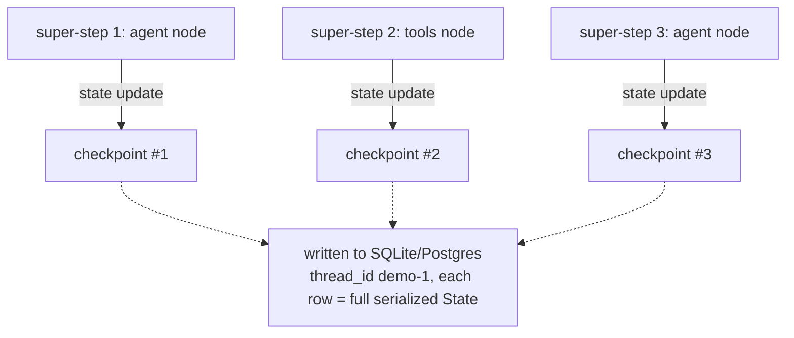

# Lecture 12: Durable Execution & Checkpointing

> Your Week-1 agent was a `while` loop in a process. Processes die. The OOM killer fires, the deploy rolls, the spot instance gets reclaimed with 30 seconds' notice, a tool takes three minutes and the request times out, or you close the laptop lid on the train. A demo tolerates this — you just re-run it. A *service* cannot: re-running a 40-step research agent from scratch burns the tokens again, re-fires the emails again, and loses the human's half-answered clarifying question. This lecture is about making an agent's progress survive the death of the process that produced it. After it you can state precisely what "durable execution" means, distinguish the two layers that implement it (state durability via checkpointing vs execution durability via a workflow engine), wire a LangGraph checkpointer so every super-step is persisted under a `thread_id`, explain exactly what a checkpoint stores and why a completed tool node is safe from re-execution on resume — and say, with a straight face, why you should *not* reach for Temporal on day one.

**Prerequisites:** The agent loop and native tool calling (Lectures 1–2); why an agent is a state machine not a script; the LangGraph `StateGraph` mental model from Lecture 6 · **Reading time:** ~28 min · **Part of:** AI Agents & Agentic Systems, Week 3

## The core idea (plain language)

A normal program keeps its progress in one place: RAM. Local variables, the call stack, the position in your `for` loop — all of it lives in process memory, and all of it evaporates the instant the process dies. For a script that runs in 200 ms, nobody cares; you re-run it. For an agent that might run for minutes, hours, or across a human coffee break, that volatility is a bug you will hit in week one of production.

**Durable execution** means: the workflow's progress is persisted to durable storage such that, after a crash, it **resumes from the last committed step rather than starting over**. The key word is *committed*. Durability is not "nothing bad happens" — crashes still happen — it is "when the bad thing happens, we lose at most the work since the last save point, and we can pick up exactly there."

The engineering move is simple to state and subtle to get right: **stop keeping the important state only in RAM.** After each meaningful unit of work, write a snapshot to a store (SQLite, Postgres, a cloud DB). On restart, load the latest snapshot and continue. The unit of work and the definition of "snapshot" are where the two layers below diverge, but the instinct is the same one you already have for databases: the transaction log is the source of truth, memory is just a fast cache of it.

There are two layers of durability, and confusing them is the single most common source of muddled thinking here.

- **State durability (checkpointing).** After each step, snapshot the *state* to a store. On resume, reload the state and keep going. This is what LangGraph gives you out of the box, per super-step, via a **checkpointer**. It is a persistence feature bolted onto a state machine.
- **Execution durability (workflow engines).** Make the *code itself* replayable. The engine records every non-deterministic result (tool outputs, timers, random values) to an event history, and on recovery it re-executes your workflow function from the top but *replays* those recorded results instead of doing the work again. Temporal and Restate live here. This is a stronger, more invasive guarantee — and you pay for it in architecture.

Most agent engineers need layer one and think they need layer two. Get the distinction crisp and you will save yourself a quarter of over-engineering.

## How it actually works (mechanism, from first principles)

### Why the state lives outside the process at all

Recall the shape of a LangGraph agent from Lecture 6: a `StateGraph` where a typed state flows through nodes connected by edges. That state is *the* thing that matters — it is the conversation, the plan, the accumulated results. If the state lives only in a Python object on the heap, then "the agent's progress" is a heap object, and heap objects die with the process.

A **checkpointer** interposes a write-to-store between graph steps. LangGraph executes the graph in **super-steps**: one "tick" of the state machine — a node (or a set of parallel nodes) runs, produces state updates, and those updates are merged into the state via the channel reducers (e.g. `add_messages`). *After each super-step commits, the checkpointer serializes the full state and writes it to the store*, tagged with a `thread_id` and a monotonically increasing `checkpoint_id`.



Crash anywhere and the store still holds the last fully-committed checkpoint. Re-invoke the graph with the **same `thread_id`** and no new input, and LangGraph loads that checkpoint and continues *from the node after the last committed one*. That last clause is the whole trick, and we will return to it when we ask why a completed tool node does not re-run.

### The concrete LangGraph port

You already have a raw ReAct loop from Week 1. The port to a durable graph is small and mechanical. State first — a `TypedDict` where `messages` uses the `add_messages` reducer so each node *appends* to the transcript instead of clobbering it:

```python
from typing import Annotated, TypedDict
from langgraph.graph import StateGraph, START, END
from langgraph.graph.message import add_messages
from langgraph.prebuilt import ToolNode, tools_condition
from tools import TOOLS            # your Week-1 tools, wrapped as @tool

class State(TypedDict):
    messages: Annotated[list, add_messages]   # reducer = append, not overwrite

def agent(state: State):
    # This node CAN be your raw Week-1 SDK call — the escape hatch stays open.
    from model import llm_with_tools           # a chat model .bind_tools(TOOLS)
    return {"messages": [llm_with_tools.invoke(state["messages"])]}

g = StateGraph(State)
g.add_node("agent", agent)
g.add_node("tools", ToolNode(TOOLS))           # runs any tool the model requested
g.add_edge(START, "agent")
g.add_conditional_edges("agent", tools_condition)  # -> "tools" if tool_calls, else END
g.add_edge("tools", "agent")                   # after tools, back to the model
GRAPH = g
```

Read the control flow like a state machine. `START → agent`. The `agent` node calls the model. `tools_condition` is a prebuilt router: it inspects the last message and returns `"tools"` if the model emitted `tool_calls`, otherwise `END`. `ToolNode` executes every requested tool and appends the results as tool messages. Then `tools → agent` sends control back to the model to look at the results and decide again. That is Week 1's `while` loop, redrawn as an explicit, inspectable graph — which is exactly what makes it checkpointable.

### Wiring the checkpointer: one import swap

The graph above is *not yet durable* — it is just a state machine. Durability is a compile-time argument. Locally, use SQLite:

```python
from langgraph.checkpoint.sqlite import SqliteSaver
from graph import GRAPH

with SqliteSaver.from_conn_string("checkpoints.sqlite") as cp:
    app = GRAPH.compile(checkpointer=cp)                 # <-- durability turned on here
    cfg = {"configurable": {"thread_id": "demo-1"}}      # <-- the resume handle
    for ev in app.stream({"messages": [("user", "...")]}, cfg, stream_mode="values"):
        print(ev["messages"][-1])
```

For production, swap the import and the connection string — the graph code does not change:

```python
from langgraph.checkpoint.postgres import PostgresSaver
with PostgresSaver.from_conn_string("postgresql://user:pw@host:5432/db") as cp:
    cp.setup()                        # ONE-TIME: creates the checkpoint tables. Do this once.
    app = GRAPH.compile(checkpointer=cp)
```

Two things earn a highlight. First, `PostgresSaver` needs a one-time `.setup()` to create its tables; forget it and the first write throws about a missing relation. `SqliteSaver` creates its schema on connect, so locally you skip this. Second — and this is the load-bearing sentence of the whole lecture — **the `thread_id` in `configurable` *is* the resume handle.** A checkpoint row is keyed by `thread_id`. To resume a crashed run you re-invoke with the *same* `thread_id` and (typically) *no new input*; LangGraph finds the latest checkpoint for that thread and continues. Pass a *new* `thread_id` and you have told the framework "this is a brand-new conversation" — it starts fresh and re-runs everything. There is no error, no warning; you just silently lose durability and pay for the whole run twice. `thread_id` is not a logging tag. It is the primary key of "which run am I resuming."

### What exactly is persisted — and why a done tool node is safe

Here is the mechanism that makes resume correct, and it is worth getting exactly right because the self-check will probe it.

A LangGraph checkpoint stores, for a given `thread_id` and `checkpoint_id`:

- the **channel values** — i.e. the full serialized `State` (your `messages` list, any other fields) as of that super-step;
- **versioning metadata** for each channel (so reducers apply correctly on resume);
- the **`next` frontier** — which node(s) are pending execution next;
- **pending writes** — updates produced but not yet fully committed (relevant to the commit-gap discussion below);
- parent-checkpoint links (so you can walk history / time-travel).

The crucial consequence: **the checkpointer stores the *result* of completed work, not the intent to do it.** Once the `tools` node has run and its output has been merged into `messages` and that super-step's checkpoint is committed, the tool's result is *in the state*. The `next` frontier now points at `agent`, not `tools`. On resume, LangGraph loads that checkpoint and dispatches whatever is in `next` — the `agent` node — reading the already-committed tool result straight from `messages`. The tool node is *behind* the frontier; it is never re-dispatched.

That is why a completed tool node is safe from re-execution on resume: not because tools are magic, but because **resume continues *after* the last committed super-step, and a committed super-step means its output is already in the persisted state.** Replay does not re-run the model (saving cost and avoiding output drift) and does not re-fire a side-effecting tool (avoiding the double email) — for any step whose checkpoint committed.

The dangerous word there is *committed*. There is a narrow window — the **commit gap** — where a side effect fires (the email sends, Stripe charges) but the process dies *before* the checkpoint recording that result is written. On resume, LangGraph sees the tool node still on the frontier and re-runs it → duplicate charge. Checkpointing alone does *not* close this gap; only **idempotency** (a deterministic key per action so the tool no-ops if already applied) does. That is a full topic of its own and gets the next lecture; flag it here so you never say "checkpointing prevents double-charges." It prevents them *except* in the commit gap.

## Worked example

Take the task: *"Read notes.txt from the sandbox, then compute 17*23, and report both."* Two tools, so the graph ticks like this:

| Super-step | Node fires | State after (messages) | Checkpoint written | `next` |
|---|---|---|---|---|
| 1 | `agent` | user + assistant(tool_calls: read_file, calculator) | #1 | `tools` |
| 2 | `tools` | + tool(notes contents) + tool("391") | #2 | `agent` |
| 3 | `agent` | + assistant("notes say X; 17×23 = 391") | #3 | `END` |

Now kill the process **after checkpoint #2 commits** but before super-step 3 runs — say the pod gets OOM-killed. The tool results are already in `messages` inside checkpoint #2, and `next = agent`. Re-invoke with `thread_id="demo-1"` and no new input:

- LangGraph loads checkpoint #2 (latest for the thread).
- It dispatches `next` → the `agent` node.
- The model sees the *stored* tool results and produces the final answer.
- The `read_file` and `calculator` tools **never run again.** No re-read, no re-compute.

Count the savings concretely. Say each `agent` call is ~1,200 input + 150 output tokens on a mid-tier model at $3/$15 per million. Without durability, a crash before the final step forces you to redo super-steps 1 and 2 — two model calls plus two tool executions (one of which is a network fetch). With durability you redo *only* super-step 3: one model call, zero tool executions. On a 40-step research agent the arithmetic gets brutal — a crash at step 38 without checkpointing means 38 model calls thrown away; with checkpointing it means resuming at step 38. The token bill and the wall-clock both scale with "steps lost," and durability drives "steps lost" toward one.

## How it shows up in production

- **Spot/preemptible reclaim is normal, not exceptional.** If you run agents on spot instances (the obvious cost play), you get ~30 seconds' notice and the box is gone. Without a checkpointer every in-flight run dies and restarts from zero on the replacement worker. With one, any worker can pick up any `thread_id` and continue — which is precisely what turns "a script" into "a horizontally-scalable service."
- **Deploys interrupt long runs.** A rolling deploy every few hours will, statistically, land in the middle of some long agent run. Durable state means the new pod resumes those threads instead of orphaning them.
- **Human-in-the-loop implies indefinite pause.** The moment a run pauses for human approval (a `interrupt()`), you have a "run" that might sit for hours. That state *must* be durable, or a server restart during the human's lunch loses the run. HITL is impossible without checkpointing — the two features are the same feature.
- **Debugging via time-travel.** Because checkpoints are a history keyed by `thread_id`, you can list them (`app.get_state_history(cfg)`), pick checkpoint #4, and re-run from there down a different branch. When a production agent did something dumb at step 12, you fork from checkpoint #11 and poke it — instead of trying to reproduce a non-deterministic run from scratch.
- **The `thread_id` bug is silent and expensive.** The most common production incident here is not a crash — it is generating a fresh `thread_id` on resume (e.g. `str(uuid4())` in the wrong place). Everything "works," conversations just mysteriously never remember anything and your token bill is double what the model math predicts. There is no exception to catch; you find it by noticing cost.

## Common misconceptions & failure modes

- **"Checkpointing prevents duplicate side effects."** No. It prevents *re-execution of committed steps*. The commit gap (side effect fired, checkpoint not yet written) still double-fires on resume. You need idempotency keys for that. Checkpoint *and* idempotency, never one alone.
- **"`MemorySaver` is fine."** `MemorySaver` (the in-memory checkpointer) is great for a notebook and *useless for durability* — it lives in the process heap, so it dies exactly when you need it. Prod uses `SqliteSaver` (single node) or `PostgresSaver` (shared/multi-worker).
- **"A new `thread_id` on resume is harmless."** It silently starts fresh and re-runs everything. `thread_id` is the resume handle; treat it as the run's primary key, persist it, reuse it.
- **"Forgot `PostgresSaver.setup()`."** The tables don't exist, the first write errors. It's a one-time call; run it at deploy/migration time.
- **Non-deterministic node *control flow*.** If a node's *branching* depends on `datetime.now()`, `random`, or a live external read, replay/time-travel can diverge. Keep node branching deterministic; push messy non-determinism into tools whose *results* get checkpointed.
- **"Reach for Temporal because durability."** Wrong layer for a single process. See the next section — this is the expensive mistake.
- **Assuming Postgres checkpoint size is free.** Each checkpoint serializes the *full* state, including the whole `messages` list. Long transcripts × many checkpoints × many threads is real storage and write bandwidth. Prune old threads; consider compaction of `messages` (Week 5) before it becomes a Postgres bloat ticket.

## When you graduate to a workflow engine (and why not on day one)

State durability (LangGraph checkpointing) persists *state* between super-steps of *one graph in one process*. **Execution durability** (Temporal, Restate) persists the *execution of your code* itself: you write deterministic workflow code, and all non-deterministic work — every tool/HTTP/DB call — is quarantined inside **activities** whose results are recorded to an event history. On recovery, the engine re-runs your workflow function from the top and *replays* the recorded activity results, so the code deterministically reconstructs its exact prior position. That buys you exactly-once orchestration, durable timers ("sleep 3 days then follow up"), automatic activity retries, and coordination *across services*.

You **graduate** to Temporal/Restate when you have:

- **Multi-service** orchestration — the workflow spans several independent systems (payment service + fulfillment + notification) and you need one authoritative coordinator, not each service checkpointing its own slice.
- **Multi-day / long-lived** workflows with durable timers and scheduled resumption.
- **Strict exactly-once across systems** — the guarantee has to hold *between* services, not just within one graph.

For a **single agent process** — one graph, one worker, minutes-to-hours runs — **LangGraph checkpointing is enough.** Do not reach for Temporal on day one. It is a real distributed system: a server, worker fleets, a determinism discipline in your workflow code (no wall-clock reads, no unguarded randomness), and an operational burden that dwarfs "add a Postgres checkpointer." Adopting it to make one agent crash-safe is like standing up Kubernetes to run a cron job. Add the checkpointer first; graduate only when the *cross-service, multi-day, exactly-once* trio is genuinely your problem.

## Rules of thumb / cheat sheet

- **Durable = resumes from last *committed* step.** The operative word is *committed*.
- **Two layers:** state durability = checkpoint the *state* (LangGraph); execution durability = replay the *code* (Temporal/Restate).
- **Default:** single agent process → LangGraph checkpointer. Postgres in prod, SQLite locally. One import swap between them.
- **`PostgresSaver.setup()` once.** SQLite self-creates; Postgres does not.
- **`thread_id` is the resume handle** — same thread + no new input = resume; new thread = start over (silently).
- **Never `MemorySaver` for durability.** Notebook only.
- **A committed step stores its *result*** → resume continues *after* it → completed model/tool nodes don't re-run.
- **Checkpointing ≠ idempotency.** Commit gap still double-fires; add idempotency keys for side effects (next lecture).
- **Keep node *branching* deterministic;** hide non-determinism inside tools whose results are checkpointed.
- **Watch checkpoint bloat:** full state × checkpoints × threads. Prune / compact.

## Connect to the lab

The Week-3 lab is exactly this lecture made runnable: you port your Week-1 agent to the `StateGraph` above, compile it with `SqliteSaver` (then swap to `PostgresSaver` behind Docker), and prove durability with `crash_test.py` — hard-kill mid-run, re-invoke the *same* `thread_id`, and confirm the run completes without redoing committed steps. The lab then pushes past pure checkpointing into the commit-gap: it kills the process both *after* a tool node commits (LangGraph resumes past it, tool never re-runs) and *inside* the commit gap (replay re-enters the tool, and only an idempotency key stops a duplicate) — that contrast is the point of the week.

## Going deeper (optional)

- **LangGraph docs — "Persistence" and "Add and manage memory."** The canonical reference for checkpointers, `thread_id`, and `get_state_history`. Root: `langchain-ai.github.io/langgraph`.
- **LangGraph reference — checkpointer libraries.** `langgraph-checkpoint-sqlite` and `langgraph-checkpoint-postgres` on the `langchain-ai/langgraph` GitHub repo; read the `SqliteSaver`/`PostgresSaver` source to see what a checkpoint row actually contains.
- **Temporal docs** (`docs.temporal.io`) — read the "workflows vs activities" and "deterministic constraints" pages to understand execution durability from the source. Search: `Temporal workflow determinism activities`.
- **Restate docs** (`docs.restate.dev`) — a lighter-weight take on durable execution; useful contrast to Temporal. Search: `Restate durable execution`.
- Talk/search: `durable execution explained Temporal` and `LangGraph human in the loop interrupt` for the HITL-durability connection.

## Check yourself

1. State the difference between **state durability** and **execution durability**, and name a tool for each layer.
2. On resume, why does a *completed* tool node not re-execute? Reference what a checkpoint actually stores.
3. Your agent crashes right after a tool sends a real email but *before* the checkpoint commits. On resume, will the email send again? What mechanism (not checkpointing) prevents the duplicate?
4. What is the exact role of `thread_id` in `configurable`, and what silently happens if you pass a fresh one when you meant to resume?
5. What must you do exactly once when using `PostgresSaver` that you don't with `SqliteSaver`, and why?
6. Give the three-part condition under which you'd graduate from LangGraph checkpointing to Temporal — and the one-line reason you don't do it for a single-agent process.

### Answer key

1. **State durability** persists the *state* between steps and reloads it on restart (LangGraph checkpointer, e.g. `SqliteSaver`/`PostgresSaver`); the framework re-drives the graph from the last committed super-step. **Execution durability** makes the *code* replayable — deterministic workflow code with non-deterministic work quarantined in activities whose results are recorded and replayed on recovery (Temporal, Restate). The first persists data; the second persists execution position.

2. Because a checkpoint stores the *result* of committed work plus the `next` frontier, not the intent to do work. Once the tool node's super-step commits, its output is already merged into the persisted `State` and the frontier has advanced past it. Resume loads that checkpoint and dispatches `next` (the node *after* the tools node), reading the stored tool result — so the tool is behind the frontier and never re-dispatched.

3. **It may send again.** The crash landed in the **commit gap**: the side effect fired but the checkpoint recording it never committed, so on resume LangGraph still sees the tool node on the frontier and re-runs it. Checkpointing does not help here. Only **idempotency** — a deterministic key per action so the tool no-ops if that key was already applied — prevents the duplicate.

4. `thread_id` is the primary key of the run — it's what the checkpointer keys checkpoint rows on and thus the **resume handle**: re-invoking with the same `thread_id` (and no new input) loads the latest checkpoint and continues. Passing a fresh `thread_id` silently starts a brand-new run from scratch, re-executing everything, with no error or warning — you just lose durability and pay twice.

5. Call `.setup()` exactly once (at deploy/migration time) to create the checkpoint tables. `SqliteSaver` creates its schema automatically on connect; `PostgresSaver` does not, so without `.setup()` the first write fails on a missing relation.

6. Graduate when you have (a) **multi-service** orchestration needing one authoritative coordinator, (b) **multi-day / long-lived** workflows with durable timers, and (c) **strict exactly-once guarantees across systems**. For a single agent process you don't, because Temporal is a full distributed system (server, workers, determinism discipline, ops burden) — LangGraph checkpointing already makes one process crash-safe, and Temporal for that is standing up Kubernetes to run a cron job.
