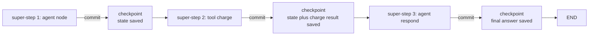
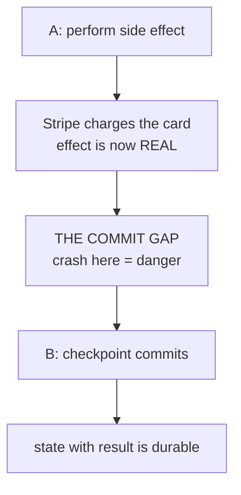
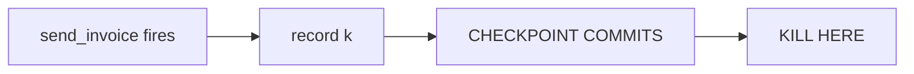
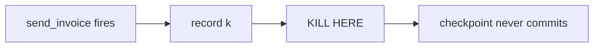

# Lecture 13: Idempotency & Safe Replay of Side Effects

> A durable agent is one that survives a crash and picks up where it left off. But "picking up where it left off" hides a trap that has quietly double-charged real customers and sent duplicate emails from real production systems: an agent's most important actions are *side effects* — a Stripe charge, an email, a database row — and replay must never re-run them. This lecture is about the single most important durability habit an agent engineer has: making replay safe. Two mechanisms do the work, and you need **both**, because each one covers a gap the other leaves open. After this lecture you can explain why LLM and tool calls are non-deterministic side effects, describe exactly what a checkpointer stores and why that makes a completed node replay-safe, derive an idempotency key and wire it into an append-only ledger, and — most importantly — reason precisely about the *two crash positions* that decide whether you double-fire, and state the crisp rule that keeps you safe on both.

**Prerequisites:** The agent loop (Lecture 1); errors-as-observations (Lecture 3); LangGraph state machines and checkpointers (this week's earlier material). Comfort with hashing and a mental model of "the process can die at any instruction." · **Reading time:** ~28 min · **Part of:** AI Agents & Agentic Systems, Week 3

## The core idea (plain language)

An agent that runs for more than a few seconds *will* be interrupted. Not "might" — will. A deploy rolls the pod. A spot instance is reclaimed. A tool call to a flaky vendor hangs for three minutes and the orchestrator kills it. Someone closes the laptop lid. Durable execution is the discipline of making that interruption a non-event: the workflow's progress is persisted so that after a restart it resumes from the last committed step instead of starting over.

But "resume" is dangerous the moment your agent does anything that touches the outside world. Re-running a pure computation is free — you get the same answer. Re-running `charge_card($90)` is not free — you charged the customer twice. The whole problem is that agents are full of actions that are *not* safe to repeat: they cost money (every LLM call bills you), they change over time (the model gives a slightly different answer on retry — "drift"), and they have irreversible external consequences (the email is sent, the invoice is issued, the row is inserted).

So safe replay rests on two ideas that sound similar but defend against different failures.

The first is **checkpoint the result, not the intent.** After a step finishes, you save its *output* to durable storage. When you resume, the framework does not re-execute that step — it reads the stored result. LangGraph does exactly this: it snapshots state after each node and, on resume, continues *after* the last completed node. A tool node that already ran and committed its result is simply not run again.

The second is **idempotency keys for the commit gap.** Here is the crack that checkpointing alone cannot seal: there is a window between "the side effect fired" and "the checkpoint recording it committed." If the process dies *in that window* — after Stripe accepted the charge but before we wrote down that we charged — then replay has no record that the effect happened, so it re-enters the tool and fires it again. The defense is to make the *tool itself* refuse to repeat work: compute a deterministic key for each action, record it in an append-only ledger the instant the effect succeeds, and have the tool no-op if that key is already present.

The crisp rule, which you should tattoo somewhere: **checkpointing + idempotency, never one or the other.** Checkpointing handles the common case (crash between steps). Idempotency handles the nasty case (crash inside the commit gap). Skip either and you have a duplicate-side-effect bug waiting for the wrong millisecond.

## How it actually works (mechanism, from first principles)

### Why LLM and tool calls are "non-deterministic side effects"

Start with vocabulary, because the whole lecture turns on it.

A **side effect** is any action whose consequence outlives the function call: bytes written to disk, a row in Postgres, an HTTP POST that made a vendor do something, a charge on a card. Contrast with a **pure** computation — `2 + 2` — which you can run a thousand times with no external trace.

**Non-deterministic** means running it again does not reproduce the same result. LLM calls are non-deterministic on two axes at once. First, they *cost*: a replayed `messages.create` bills you again — real dollars for zero new information. Second, they *drift*: even with the same prompt, model outputs vary run to run (sampling, and the fact that current frontier models don't expose a `temperature=0` lever), so a replay can pick a *different branch* than the original run. That second point is subtle and lethal: if replay re-runs the model and the model decides differently this time, your resumed run is not the same run — it's a fork.

Put those together: an agent step that calls an LLM and then a tool is a non-deterministic side effect. You must not re-run it on replay. You must *reuse the result you already have*.

### Mechanism 1 — checkpoint the result, not the intent

A checkpointer is a store (SQLite locally, Postgres in prod) that LangGraph writes to after every **super-step** (one "tick" of the graph — a node or a set of parallel nodes running together). What it persists is the *state*: the accumulated messages, the tool results, the channel values — the actual outputs, not a plan to produce them.

The consequence is the load-bearing sentence: **on resume, LangGraph reads the last committed checkpoint and continues *after* the last completed node.** A tool node that ran and whose result was checkpointed is not on the "still to do" list — its output is already in state. Replay sees the stored `tool_result` and moves on.



If the process dies *between* super-step 2 and 3 — i.e., after the tool result committed — resume reads checkpoint-2, sees the charge already happened (its result is in state), and starts at super-step 3. **The tool never re-runs.** This is the happy path, and it covers the overwhelming majority of crashes. This is also why the `thread_id` matters so much: it *is* the resume handle. Re-invoke with the same `thread_id` and you continue; use a new one and you start from scratch, re-running everything.

### Mechanism 2 — idempotency keys for the commit gap

Now zoom into a single tool node and slow down time. Inside it, two things must happen: (a) the side effect fires (Stripe accepts the charge), and (b) the checkpoint recording that it fired commits. They cannot be truly atomic — Stripe and your checkpoint store are different systems. So there is always a gap:



Crash at [A]-just-happened-but-before-[B]: Stripe charged the card, but no checkpoint records it. On resume, LangGraph's last durable checkpoint is the one *before* this node — so it re-enters the node and fires the charge **again**. Checkpointing did nothing wrong; the crash simply landed in the one window it cannot cover.

The defense lives *inside the tool*, not in the framework. Make the effect **idempotent**: repeating it produces no additional consequence. You do that with a deterministic **idempotency key** — a value that is identical every time this same logical action is attempted, but different for a genuinely different action.

The canonical recipe:

```
key = sha256(thread_id + step + serialized_args)
```

- `thread_id` scopes the key to this run (a *different* run legitimately charging the same customer the same amount should get a different key).
- `step` (or node id / call index) distinguishes two intentionally-separate charges within one run.
- `args` ties the key to *what* is being done, so changing the amount changes the key.

Because it is a hash of only deterministic inputs, the *replayed* invocation computes the *exact same key* as the original. That is the whole trick. You then store applied keys in an **append-only ledger** — a log where "did this happen?" is answered by "is this key present?" The tool checks the ledger first: if the key is there, it *no-ops* and returns a benign "already done" result; otherwise it performs the effect and records the key.

A subtle but critical ordering point: **record the key as close to the effect as possible, and treat the ledger write as the commit of truth.** If your downstream API itself accepts an idempotency key (Stripe, for instance, has a native `Idempotency-Key` header), pass yours through — then even the "record after effect" gap is covered by the vendor deduplicating on their side. Belt and suspenders.

## Worked example

Take the `send_invoice` tool from this week's lab and walk every line.

```python
# ledger.py — append-only; the source of truth for "did this actually happen"
import json, os, hashlib

LEDGER = "side_effects.log"

def key(*parts) -> str:
    return hashlib.sha256("|".join(map(str, parts)).encode()).hexdigest()[:16]

def applied(k) -> bool:
    return os.path.exists(LEDGER) and any(json.loads(l)["key"] == k for l in open(LEDGER))

def record(k, action):
    with open(LEDGER, "a") as f:
        f.write(json.dumps({"key": k, "action": action}) + "\n")
```

```python
# tools.py
from ledger import key, applied, record

def send_invoice(customer: str, amount: float, thread_id: str, step: int) -> str:
    k = key("send_invoice", thread_id, step, customer, amount)   # 1. compute deterministic key
    if applied(k):                                                # 2. check the ledger
        return f"already-sent:{k}"                                #    -> replay-safe NO-OP
    # 3. perform the real side effect (the invoice actually goes out here)
    #    e.g. billing_api.create_invoice(customer, amount, idempotency_key=k)
    record(k, f"invoice {customer} {amount}")                     # 4. record AFTER the effect
    return f"sent:{k}"
```

Now trace two runs of the same task, "invoice ACME for \$90."

**First run, no crash.** `key(...)` produces, say, `k=a1b2c3d4e5f6a7b8`. `applied(k)` is `False` (fresh ledger). The tool sends the invoice, appends `{"key":"a1b2...","action":"invoice ACME 90.0"}`, returns `sent:a1b2c3d4e5f6a7b8`. Ledger now has **1 line**. LangGraph checkpoints the state (including this result).

**Second run — a resume after a crash.** Same `thread_id`, same `step`, same args ⇒ `key(...)` produces the *identical* `k=a1b2c3d4e5f6a7b8`. Now `applied(k)` is `True`. The tool returns `already-sent:a1b2c3d4e5f6a7b8` *without sending anything*. Ledger still has **1 line**. The customer got exactly one invoice.

That "ledger line count is invariant across resume" is precisely the assertion the lab's `crash_test.py` makes, and it is the cleanest possible proof of safe replay: **count the side effects before and after resume; the numbers must match.**

### The two crash positions — the whole lesson in one contrast

The lab kills the process two ways on purpose. Understand the difference and you understand the lecture.

**Position (a): kill AFTER the tool node commits its checkpoint.**



On resume, LangGraph's last durable checkpoint is *after* `send_invoice`. It continues from the *next* node. **The tool never re-runs** — checkpointing alone saves you here. The idempotency key isn't even consulted. Ledger stays at 1 line.

**Position (b): kill IN the commit gap.**



On resume, the last durable checkpoint is *before* `send_invoice`, so LangGraph **re-enters the tool**. This time checkpointing does *not* save you — the framework genuinely thinks the node hasn't run. What saves you is that `record(k)` already wrote the key to the append-only ledger before the crash, so `applied(k)` now returns `True` and the tool no-ops. **Only the idempotency key prevents the duplicate.** Ledger stays at 1 line.

Two crashes, two different mechanisms doing the saving. Remove checkpointing and position (a) re-runs *everything* from scratch. Remove idempotency and position (b) double-fires. That is why the rule is "both, never one."

(One honest caveat for the truly paranoid: if the crash lands *between the side effect firing and `record(k)` executing* — a gap of microseconds, but real — even the ledger misses it. This is why you push the idempotency key *down into the vendor* (`Idempotency-Key` header) when the vendor supports it: then the vendor itself dedupes, closing even that sliver. When they don't, you accept a vanishingly small residual risk or use a transactional outbox pattern.)

## How it shows up in production

**The duplicate charge / duplicate email incident.** This is not hypothetical. Systems that retry-on-failure without idempotency double-send. The failure mode is invisible in testing (crashes don't happen on the happy path) and shows up as a support ticket: "I was billed twice." By the time you see it, money has moved. The fix is architectural, not a patch — every side-effecting tool needs a key *from day one*.

**LLM re-run cost and drift.** Without result-checkpointing, every resume re-runs the model calls that already happened. On a 20-step agent that crashed at step 18, a naive restart re-bills 17 model calls — and worse, because the model drifts, step 3 might decide *differently* this time and send the run down a path that no longer matches the 14 steps you already (partially) executed. You don't just pay twice; you get an *incoherent* run.

**"It worked in the demo."** Durability bugs are the definition of "works until it doesn't." A demo never crashes at the wrong microsecond. Production, running thousands of workflows, hits the commit gap eventually — the birthday-paradox of rare timing. Treat the crash test as a first-class acceptance test, not a nice-to-have.

**Debugging "why did it double-fire?"** The append-only ledger is also your forensic tool. When someone reports a duplicate, you `grep` the ledger for the customer and immediately see whether you fired twice (idempotency bug — two different keys for the same logical action, usually because a non-deterministic value leaked into the key) or once (the duplicate is downstream of you). A ledger keyed on deterministic inputs turns a mystery into a lookup.

**The non-deterministic-key trap.** The most common way idempotency silently fails: someone builds the key from something that *changes on replay*. `key = sha256(customer + amount + datetime.now())` looks fine and is completely broken — the replay computes a *different* timestamp, gets a *different* key, `applied()` returns `False`, and you double-fire. The key must be a function of *only* deterministic inputs (thread_id, step, args). If you need a timestamp in the payload, capture it once and *checkpoint it*, then read it back — don't recompute it.

## Common misconceptions & failure modes

- **"Checkpointing prevents duplicate side effects."** No. It prevents *re-running committed steps*, which covers crashes *between* steps. It does nothing for a crash *inside the commit gap*, where the effect fired but the checkpoint didn't. That gap is exactly what idempotency keys exist for.
- **"Idempotency keys make checkpointing unnecessary."** Also no. Without checkpointing, a resume re-runs *every* prior step from scratch — re-billing every LLM call and risking drift. Idempotency stops the *duplicate effect* but not the wasteful, incoherent re-execution. You need result-checkpointing for efficiency and coherence, keys for the gap.
- **"Just use `MemorySaver`, it's simpler."** The in-memory checkpointer evaporates on restart — which is the exact moment durability matters. It's fine for a notebook and useless for the thing this lecture is about. Use `SqliteSaver` locally, `PostgresSaver` in prod (and remember Postgres needs a one-time `.setup()`).
- **Non-deterministic node *control flow*.** If a node's *branching* depends on `datetime.now()`, `random`, or a live external read, replay can take a *different branch* than the original run — and now your resumed state is inconsistent with the checkpointed history. Keep branching deterministic. Quarantine the messiness *inside a tool* whose *result* is checkpointed: read the clock inside the tool, return the timestamp as the result, checkpoint that — then all downstream branching keys off the stored value, which replay reproduces exactly.
- **Key built from mutable/nondeterministic inputs.** Covered above — the silent double-fire. The key is only as safe as its inputs are deterministic.
- **Re-using a new `thread_id` on resume.** Then there's nothing to resume *from* — you start fresh and re-run everything. The `thread_id` is the resume handle; losing it loses durability.
- **Ledger that isn't append-only / isn't durable.** If your "ledger" is an in-memory set or a file on ephemeral disk, it vanishes with the process and `applied()` wrongly returns `False` on resume. The ledger must survive the crash — same durability requirement as the checkpoint store.
- **Assuming the tool is naturally idempotent when it isn't.** "It's just an UPSERT" — but the UPSERT increments a counter, or the email API has no dedup. Prove idempotency; don't assume it.

## Rules of thumb / cheat sheet

- **The rule:** checkpointing **and** idempotency, never one or the other. Checkpointing covers crash-between-steps; idempotency covers crash-in-the-commit-gap.
- **Checkpoint the *result*, not the intent.** Once a step's output is committed, resume reads it instead of re-executing. LangGraph resumes *after* the last completed node.
- **Idempotency key = `sha256(thread_id + step + args)`.** Deterministic inputs only. Never `datetime.now()`, `random`, `uuid4()`, or a live read *in the key*.
- **Ledger = append-only + durable.** `applied(k)` before the effect; `record(k)` immediately after. Same durability class as your checkpoint store.
- **Tool shape:** compute key → `if applied(k): return "already-done"` → perform effect → `record(k)`.
- **Push the key downstream** when the vendor supports it (Stripe `Idempotency-Key`, etc.) to close even the effect-before-record sliver.
- **Keep node branching deterministic.** Read clocks/RNG/live data *inside tools*, checkpoint the result, branch off the stored value.
- **`thread_id` is the resume handle.** Same id on resume = continue; new id = start over.
- **Prove it with a count.** Side-effect ledger line count must be *identical* before and after a resume. That invariant is your durability test.
- **Test both kill positions:** post-commit (checkpointing saves you) and commit-gap (only the key saves you). If both end with zero duplicates, you're durable.

## Connect to the lab

This lecture is the theory behind Week 3's `crash_test.py`, `ledger.py`, and `send_invoice`. The lab has you kill the process *two ways* and observe the difference: (a) kill **after** the tool node commits its checkpoint — LangGraph resumes past it, the tool never re-runs; (b) kill **in the commit gap** — replay re-enters the tool, and only the idempotency key stops a duplicate. The Definition-of-Done assertion — `side_effects.log` line count is identical before and after resume, for *both* kill positions — is exactly the "count the effects" invariant from the cheat sheet. When you write it, the key you compute in `send_invoice` must use only deterministic inputs, or position (b) will silently double-fire.

## Going deeper (optional)

- **LangGraph docs — "Persistence" and "Add and manage memory."** What a checkpoint stores, super-steps, `thread_id`, `get_state_history`, and resume semantics. Root: `langchain-ai.github.io/langgraph`. Search: `langgraph persistence checkpointer`.
- **Temporal docs — "Workflow determinism" / "Activities."** The execution-durability endpoint: deterministic workflow code with non-determinism quarantined in activities. The clearest articulation anywhere of *why* replay demands determinism. Root: `docs.temporal.io`. Search: `temporal workflow determinism replay`.
- **Restate docs.** A lighter-weight durable-execution engine with the same "durable side effects / idempotency" model; good contrast to Temporal. Root: `docs.restate.dev`. Search: `restate durable execution idempotency`.
- **Stripe docs — "Idempotent requests."** The canonical real-world API-level idempotency-key design; read it to see how a vendor closes the gap for you. Root: `docs.stripe.com`. Search: `stripe idempotent requests`.
- **"Transactional outbox pattern."** The database technique for making "do the effect AND record it" atomic when the effect is a message/event. Search: `transactional outbox pattern`.
- **Anthropic — "Building Effective Agents."** For the surrounding context of when durable agent execution is worth the machinery at all. Search: `Anthropic Building Effective Agents`.

## Check yourself

1. Explain why an LLM call is a "non-deterministic side effect" on *two* separate axes, and why the drift axis specifically can turn a naive resume into an incoherent run.
2. Your agent crashes right after `send_invoice` posts to the billing API but *before* the checkpoint commits. On resume, what prevents a double invoice — checkpointing, idempotency, or both? Walk the timeline.
3. Contrast the two lab kill positions. For each, say which mechanism does the saving and what would happen if that mechanism were absent.
4. A colleague writes `key = sha256(customer + amount + str(time.time()))`. Why is this broken, and what is the exact production symptom?
5. Why must node *branching* be deterministic, and what is the recommended way to use a value like "the current time" without breaking replay?
6. State the crisp durability rule in one sentence, and name the single assertion you'd use to *prove* safe replay in a test.

### Answer key

1. **Cost axis:** re-running the call bills you again for zero new information. **Drift axis:** the model's output varies run-to-run (sampling; no true `temperature=0` on current frontier models), so a replayed call can return a *different* answer. The drift axis is dangerous because if replay re-runs the model and it decides *differently*, the resumed run takes a different branch than the original — the state you already partially built no longer matches the path the model now wants, giving an incoherent, forked run.

2. **Idempotency** prevents it here (checkpointing cannot). Timeline: the effect fired and `record(k)` wrote the key to the durable append-only ledger, but the crash hit *before* the checkpoint committed. On resume, LangGraph's last durable checkpoint is *before* the tool node, so it re-enters `send_invoice`. It recomputes the *identical* key (deterministic inputs), `applied(k)` returns `True`, and the tool no-ops with `already-sent`. Checkpointing thinks the node never ran; the ledger knows better.

3. **Position (a), kill after checkpoint commit:** checkpointing saves you — resume continues *after* the tool node, so it never re-runs; the idempotency key isn't even consulted. Without checkpointing, resume would re-run everything from scratch (re-billing, drift). **Position (b), kill in the commit gap:** only the idempotency key saves you — LangGraph re-enters the tool because no checkpoint recorded it, and the key's `applied()` check makes it a no-op. Without the key, position (b) double-fires.

4. The key includes `time.time()`, which is **non-deterministic** — the replay computes a *different* timestamp, produces a *different* key, so `applied()` returns `False` and the effect fires again. Symptom: intermittent duplicate side effects (double charge/email) that only appear when a crash lands in the commit gap, invisible in testing and surfacing as customer complaints. Fix: build the key from deterministic inputs only (`thread_id + step + args`).

5. If branching depends on `datetime.now()`/`random`/live reads, replay can evaluate the condition *differently* and take a different edge than the original run, leaving resumed state inconsistent with the checkpointed history. Recommended pattern: perform the non-deterministic read *inside a tool*, return the value (e.g., the timestamp) as the tool's result, and let LangGraph *checkpoint* it — then all downstream branching keys off the stored value, which replay reproduces exactly.

6. **Rule:** checkpointing + idempotency, never one or the other. **Proof assertion:** the side-effect ledger's line count is *identical* before and after a resume (ideally verified for *both* kill positions) — i.e., the number of real side effects is invariant across replay.
