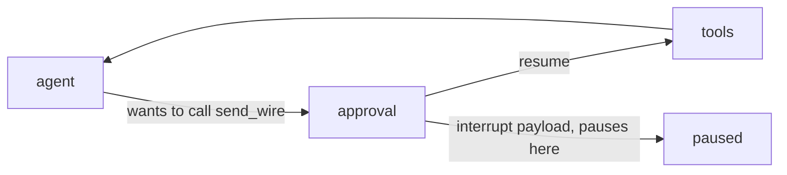

# Lecture 14: Human-in-the-Loop Interrupts, Time-Travel & Async Agents

> An agent that can only run start-to-finish in one uninterrupted process is a toy. Real agents pause to ask a human "should I really wire this $40,000?", get answered three hours later, and continue as if no time had passed — even though the server that started the run was replaced by a deploy in between. This lecture is about the three capabilities that turn a script into a service, and they all rest on one thing you built last lecture: a **checkpointer**. Because state is persisted, `interrupt()` can stop the graph *inside a node* and hand control back to your app; `Command(resume=value)` continues the exact same run on the same `thread_id`; `get_state_history()` lets you rewind to any past checkpoint and fork a different decision; and `async` nodes plus a shared checkpoint store let *any* worker resume *any* thread from a queue message or webhook. After this you can build the approve-before-a-dangerous-tool pattern, debug "why did it do that?" by replaying an alternate branch from step 4, and stand your graph up behind a FastAPI endpoint that takes a `thread_id` per request.

**Prerequisites:** LangGraph `StateGraph`, checkpointers (SqliteSaver/PostgresSaver), and durable execution from the previous lecture; async Python (`async`/`await`); basic HTTP/webhooks · **Reading time:** ~24 min · **Part of:** AI Agents & Agentic Systems, Week 3

## The core idea (plain language)

Last lecture you learned that a checkpointer snapshots the graph's state after every super-step, keyed by `thread_id`, so a crash resumes from the last committed step instead of from scratch. That same machinery does something less obvious but more powerful: it lets you **pause on purpose**.

Three features fall out of "state is durably persisted between steps":

1. **Human-in-the-loop (HITL) interrupts.** `interrupt(payload)` is called *inside a node*. It persists the current state, throws a special signal that bubbles up through the graph, and hands your `payload` back to the caller as an `__interrupt__` event. The run is now *paused*, not crashed and not blocked — the process can exit entirely. Later, you call `graph.invoke(Command(resume=value), config)` on the **same `thread_id`**; LangGraph loads the checkpoint, re-enters the interrupted node, and `interrupt()` returns `value` as if it had never left. Uses: approve a spend or a tool call, edit a plan before it executes, answer a clarifying question the agent got stuck on.

2. **Time-travel.** `get_state_history(config)` lists every checkpoint for a `thread_id` — a full undo history. Each has a `checkpoint_id`. Pass an old `checkpoint_id` back in `configurable` and you *fork* from that point: the graph replays the state as it was at step 4, and you can inject a different decision and watch an alternate branch play out. This is the debugging superpower for "why did it do that?"

3. **Event-driven / async agents.** Production agents rarely run from an interactive terminal. They're triggered by events — a queue message, a webhook, a cron. LangGraph nodes can be `async`, and because the checkpointer is an external store (Postgres, not RAM), *any* worker process can pick up *any* `thread_id` and continue it. A FastAPI endpoint that accepts a `thread_id` per request is the whole trick that turns your agent from a script you run into a service that runs.

The unifying insight: **persistence decouples "the run" from "the process."** Once state lives outside the process, pausing, rewinding, and resuming-on-a-different-machine are all the same operation — load a checkpoint and continue.

## How it actually works (mechanism, from first principles)

### `interrupt()` is a pause, implemented as a checkpointed exception

Naively you might implement "ask the human" with a blocking `input()` call inside a node. That is a disaster in production: it pins a process (and its memory, and its DB connection) for however long the human takes, it dies if the process restarts, and it can't be triggered from a webhook. `interrupt()` solves all three by *not blocking at all*.

Here is the mechanism, step by step:

```
1. Node runs, hits interrupt({"ask": "Approve wire $40k?"})
2. LangGraph writes the current state to the checkpoint store, keyed by thread_id
3. It records that THIS node is paused, waiting on a resume value
4. It raises a GraphInterrupt that propagates out of graph.stream()/invoke()
5. Your caller sees an __interrupt__ event carrying {"ask": "Approve wire $40k?"}
6. --- the process can now exit. Nothing is holding state in RAM. ---
7. Later: graph.invoke(Command(resume="yes"), {"configurable":{"thread_id": SAME}})
8. LangGraph loads the checkpoint, RE-RUNS the interrupted node from its top,
   and this time interrupt(...) RETURNS "yes" instead of raising
9. The node continues past the interrupt with decision="yes"
```

Two subtleties bite people, so internalize them now:

- **The node re-executes from the top on resume.** `interrupt()` does not magically resume mid-function at the exact line. On resume, LangGraph runs the whole node again; the *only* difference is that the `interrupt()` call now returns the resume value instead of pausing. Consequence: **any code before the `interrupt()` runs twice.** If you did something side-effecting (sent an email, incremented a counter) before the interrupt, it fires on the first pass *and* the resume pass. Keep everything before an `interrupt()` pure, or guard it with an idempotency key exactly like last lecture.

- **Multiple `interrupt()` calls in one node are resolved positionally.** If a node interrupts twice, LangGraph matches resume values to interrupts by order. This is why the docs recommend at most one `interrupt()` per node unless you know precisely what you're doing.

### Why the coffee-break / server-restart property is the whole point

This is the load-bearing claim, so let's make it concrete. Because the state was written to the checkpoint store at step 2 above and the process is free to exit at step 6, the wall-clock gap between the interrupt and the resume is **unbounded and survives a restart**:

```
09:00:00  graph.stream(...) runs until interrupt() -> writes checkpoint -> exits
09:00:01  process A terminates (deploy / spot reclaim / you Ctrl-C it)
09:00:30  new code deploys, process B starts
12:47:00  human finally clicks "Approve" in Slack (nearly 4 hours later)
12:47:00  process B: graph.invoke(Command(resume="yes"), cfg)  -> run continues
```

Process A and process B need not be the same process, the same machine, or even the same version of your code. The `thread_id` plus the checkpoint store is the entire handle. **This is impossible with `input()` and trivial with `interrupt()` — and the difference is 100% attributable to checkpointing.** If you'd used `MemorySaver`, the state would have died with process A and the resume would start a fresh, empty run.

### The approve-before-dangerous-tool pattern

The canonical HITL shape inserts an approval node between the agent (which *decides* to call a tool) and the tool node (which *executes* it):



```python
from langgraph.types import interrupt, Command

def approval(state):
    pending = state["messages"][-1].tool_calls[0]      # the tool the agent chose
    decision = interrupt({                              # <- PAUSES the graph here
        "ask": f"Approve {pending['name']}({pending['args']})?",
        "tool": pending["name"],
        "args": pending["args"],
    })
    if decision == "yes":
        return {"approved": True}
    return {"approved": False,
            "messages": [("system", f"Human DENIED {pending['name']}. Do not call it.")]}
```

Driving it from a CLI, you watch the stream for the `__interrupt__` event, render the question, collect a decision, and resume on the same thread:

```python
cfg = {"configurable": {"thread_id": "wire-42"}}

for ev in graph.stream({"messages": [("user", "Pay invoice INV-991")]}, cfg):
    if "__interrupt__" in ev:                          # the pause surfaces here
        payload = ev["__interrupt__"][0].value
        print("APPROVAL NEEDED:", payload["ask"])
        answer = input("yes/no > ")                    # or a Slack button, or a webhook
        # resume on the SAME thread_id — this can be a whole separate process
        for ev2 in graph.stream(Command(resume=answer), cfg):
            print(ev2)
```

The `__interrupt__` key is how the pause is *surfaced* to your app — the stream yields a normal event dict whose `__interrupt__` entry carries the payload you passed to `interrupt()`. Your CLI (or web UI, or Slack bot) renders it; nothing about the mechanism cares whether the human answers in 2 seconds or 2 days.

### Time-travel: `get_state_history` is your undo stack

Every super-step writes a checkpoint. `get_state_history(cfg)` returns them newest-first, each a `StateSnapshot` with the state values, the `next` nodes to run, and a `config` containing its `checkpoint_id`:

```python
for snap in graph.get_state_history(cfg):
    cid = snap.config["configurable"]["checkpoint_id"]
    print(cid, "next:", snap.next, "| msgs:", len(snap.values["messages"]))
```

To fork from an earlier point, you take that checkpoint's `config` (which pins its `checkpoint_id`) and resume from it. LangGraph rewinds state to exactly what it was at that checkpoint and continues:

```python
history = list(graph.get_state_history(cfg))
step4 = history[-5]                                    # some earlier checkpoint
fork_cfg = step4.config                                # pins the checkpoint_id

# Optionally inject a DIFFERENT decision at that point, then replay:
graph.update_state(fork_cfg, {"messages": [("system", "Use tool B, not tool A")]})
for ev in graph.stream(None, fork_cfg):                # stream(None) = resume, no new input
    print(ev)
```

The real debugging use: your agent did something dumb at step 6, and you suspect it was because of a bad decision at step 4. Instead of re-running the whole thing from scratch (expensive, and non-deterministic — the LLM may make *different* mistakes), you rewind to the step-4 checkpoint, inject the decision you *wish* it had made, and replay only steps 4-onward. You've turned "why did it do that?" from an archaeology project into an A/B test.

### Async agents: any worker, any thread

The final piece. A LangGraph node can be `async def`, and you drive the graph with `ainvoke` / `astream`. Combined with a *shared* checkpointer (Postgres, not the in-memory saver), this means the process that *starts* a thread and the process that *continues* it are completely decoupled:

```python
from fastapi import FastAPI
app = FastAPI()

@app.post("/agents/{thread_id}/messages")
async def send(thread_id: str, body: dict):
    cfg = {"configurable": {"thread_id": thread_id}}
    result = await graph.ainvoke({"messages": [("user", body["text"])]}, cfg)
    return {"reply": result["messages"][-1].content}

@app.post("/agents/{thread_id}/resume")
async def resume(thread_id: str, body: dict):
    cfg = {"configurable": {"thread_id": thread_id}}
    result = await graph.ainvoke(Command(resume=body["decision"]), cfg)
    return {"reply": result["messages"][-1].content}
```

Ten replicas of this FastAPI app behind a load balancer all share one Postgres checkpoint store. Request 1 (start thread `abc`) lands on replica 3; the run pauses at an interrupt. Three hours later request 2 (resume thread `abc`) lands on replica 7 — and it works, because replica 7 loads thread `abc`'s checkpoint from Postgres. The `thread_id` is the only thing the client needs to hold. That is the difference between "a script Alice runs on her laptop" and "a service that scales horizontally."

## Worked example

A finance-ops agent processes an invoice. Trace the timeline with real timestamps and a `thread_id` of `inv-7781`.

| Time | Where | What happens | Checkpoints for `inv-7781` |
|---|---|---|---|
| 10:00:00 | replica-3 | `astream({user: "pay INV-7781"})`; agent decides `send_wire(acct, $41,200)` | 1, 2 |
| 10:00:02 | replica-3 | enters `approval` node, calls `interrupt({...})`; state persisted; `GraphInterrupt` raised | 3 (paused) |
| 10:00:02 | client | stream yields `__interrupt__` → Slack message "Approve wire $41,200 to acct 55-9? [Approve][Deny]" | — |
| 10:00:05 | — | **replica-3 is drained by a deploy and terminates.** Nothing in RAM. | 3 (still in PG) |
| 13:26:40 | human | CFO clicks **Approve** in Slack (3.5 hours later) | — |
| 13:26:40 | replica-9 | webhook → `ainvoke(Command(resume="yes"), {thread_id: "inv-7781"})` | loads 3 |
| 13:26:40 | replica-9 | `approval` node re-runs; `interrupt()` returns `"yes"`; edge → `tools` | 4 |
| 13:26:41 | replica-9 | `send_wire` runs once (idempotency key guards the commit-gap); wire sent | 5 |
| 13:26:42 | replica-9 | agent composes "Paid INV-7781, confirmation #..." → END | 6 |

The run spanned 3.5 hours and two different processes on two different machines, with a deploy in the middle, and completed correctly with exactly one wire sent. Count the moving parts that made that possible: a durable checkpointer (state survived the drain), `interrupt()` (paused without blocking), a stable `thread_id` (the resume handle), an idempotency key (no double wire if the crash had landed in the commit gap), and async invocation (any replica serves any thread).

Now the time-travel angle. Suppose the agent had chosen the *wrong* account at step 2. You don't re-run from the user's message — you inspect history, find the checkpoint just before the account was chosen, and fork:

```python
for snap in graph.get_state_history(cfg):
    print(snap.config["configurable"]["checkpoint_id"], snap.next)
# pick the one whose `next` is the account-selection node, grab its config, then:
graph.update_state(that_cfg, {"messages": [("system", "Vendor acct is 55-9, not 55-8")]})
graph.invoke(None, that_cfg)   # replays only from that point with the corrected input
```

One replay from step 2, not a full re-run — cheaper, and it isolates the one variable you're testing.

## How it shows up in production

- **Latency budgets are meaningless across an interrupt.** Your p99 "agent response time" splits into two clocks: compute time (yours to optimize) and human-wait time (unbounded, not your latency). Don't let a paused-for-approval thread count against your service SLO — track "time-to-first-interrupt" and "compute time" separately from wall-clock.

- **The commit-gap double-fire is real and interrupts widen it.** Because the interrupted node re-runs from the top on resume, *anything* you did before the `interrupt()` executes twice. Sending a "requesting approval" email before the interrupt? It goes out on the first pass and again on resume. Guard pre-interrupt side effects, or (better) make the approval node do nothing but interrupt.

- **`MemorySaver` silently breaks all three features.** With the in-memory saver, HITL "works" in your notebook (same process) and dies the instant you restart; time-travel history is lost on restart; and async multi-worker resume is impossible because worker B can't see worker A's RAM. Use SqliteSaver locally, PostgresSaver in prod — the same rule as durability.

- **Cost of a bad decision, replayed vs re-run.** Re-running a 12-step agent to reproduce a bug costs 12 LLM calls *and* may not reproduce the bug (non-determinism). Forking from checkpoint 4 costs ~8 calls, is deterministic up to that point, and lets you change exactly one thing. On a $0.05/call agent that's real money at debugging scale, but the bigger win is reproducibility.

- **Thread-per-user vs thread-per-task.** A `thread_id` is a conversation/run boundary. Reusing one user's `thread_id` across unrelated tasks bloats its history (every checkpoint carries the whole message list) and slows every load. Mint a fresh `thread_id` per logical task; keep long-term facts in the memory store (next week), not in an ever-growing thread.

## Common misconceptions & failure modes

- **"`interrupt()` blocks the process until the human answers."** No. It *raises* and the process is free to exit. It's a pause of the *run*, not a block of the *thread of execution*. If you find yourself keeping a process alive to hold an interrupt, you've missed the entire point — the state is in the checkpoint store.

- **"The interrupted node resumes exactly where it paused."** No — the node re-runs from the top; only the `interrupt()` call returns instead of raising. Code above the interrupt runs again. This is the #1 source of duplicate side effects in HITL agents.

- **"Resuming needs the original process/machine."** No. Any process with access to the same checkpoint store and the same `thread_id` can resume. That's exactly what enables the FastAPI-behind-a-load-balancer shape.

- **"Time-travel replays are free and deterministic end-to-end."** Only the *rewind* is exact. Once you resume, nodes re-execute, and any LLM/tool call is non-deterministic again (last lecture's lesson). Time-travel gives you a deterministic *starting point*, not a deterministic *future*.

- **"Forking mutates the original run."** Forking creates a new line of checkpoints from the fork point; done carelessly you can confuse yourself about which branch is 'live'. Be deliberate: `get_state_history` shows all branches — know which `checkpoint_id` you're building on.

- **"Async makes it faster."** Async makes it *concurrent and resumable-anywhere*, not per-request faster. A single agent request is still gated by serial LLM calls. The win is throughput (many threads across workers) and the ability to resume on any worker — not lower single-run latency.

## Rules of thumb / cheat sheet

- **One `interrupt()` per node**, and put *nothing side-effecting before it* — the node re-runs top-to-bottom on resume.
- **Resume on the SAME `thread_id`** with `Command(resume=value)`; a new `thread_id` starts a fresh, empty run.
- **`stream(None, cfg)`** (input = `None`) means "resume this thread"; a real input dict means "add a new turn."
- **HITL/time-travel/async all require a durable checkpointer** — SqliteSaver local, PostgresSaver prod. `MemorySaver` breaks all three across a restart.
- **Watch the stream for the `__interrupt__` key** to detect a pause; its `.value` is the payload you passed to `interrupt()`.
- **Time-travel to debug:** `get_state_history(cfg)` → pick a `checkpoint_id` → optional `update_state` to change a decision → `stream(None, fork_cfg)` to replay only from there.
- **Fork instead of re-run** when reproducing a bug: cheaper and deterministic up to the fork point.
- **Async endpoint = `thread_id` per request** + shared Postgres checkpointer → any worker resumes any thread. That's the script→service line.
- **Idempotency keys still mandatory** — an interrupt's re-run and the commit-gap both re-execute code; checkpointing alone doesn't stop double side effects.

## Connect to the lab

Week 3's lab already has you wire `interrupt()` before the dangerous `send_invoice` tool and resume with `Command(resume=...)` across a *process restart* (Step 4) — this lecture is the mechanism behind why that restart survives (state was checkpointed at the interrupt) and why the code before the interrupt must be idempotent (the node re-runs on resume). Step 6's `get_state_history` + fork-from-an-earlier-`checkpoint_id` is the time-travel section made concrete. And the lab's optional stretch — the same graph behind an async FastAPI endpoint that accepts a `thread_id` per request — is exactly the "any worker resumes any thread" shape this lecture argues is the script→service transition.

## Going deeper (optional)

- **LangGraph docs — Human-in-the-loop.** The authoritative reference for `interrupt()`, `Command(resume=...)`, and the `__interrupt__` stream event, with the "node re-runs on resume" caveat spelled out. Root: `langchain-ai.github.io/langgraph`. Search: `langgraph human in the loop interrupt`.
- **LangGraph docs — Time travel.** `get_state_history`, forking from a `checkpoint_id`, and `update_state`. Search: `langgraph time travel get_state_history`.
- **LangGraph docs — Persistence / Checkpointing.** The foundation everything here rests on; re-read the "what a checkpoint contains" section. Search: `langgraph persistence checkpointer`.
- **LangGraph Platform / Server docs.** How the async, thread-per-request, multi-worker deployment shape is productionized (assistants, threads, webhooks). Search: `langgraph platform threads deployment`.
- **Temporal — "durable execution" concept.** For when you graduate past a single agent process to multi-service, multi-day orchestration with the same pause/resume guarantees at the code level. Root: `docs.temporal.io`. Search: `temporal durable execution human in the loop`.
- **Anthropic — "Building Effective Agents."** The human-oversight and approval-checkpoint discussion for *when* to insert a human, not just how. Search: `Anthropic Building Effective Agents`.

## Check yourself

1. Explain precisely why a human can take a 3-hour coffee break — and the server can restart — between an `interrupt()` and its resume, without losing the run. Which single component makes this possible, and what breaks if you swap it for `MemorySaver`?
2. A node sends a "please approve" email, then calls `interrupt(...)`. On resume, the customer gets *two* emails. Why, and what are two ways to fix it?
3. What does `graph.stream(None, cfg)` do differently from `graph.stream({"messages": [...]}, cfg)`, and when do you want each?
4. You resume with `Command(resume="yes")` but the run starts over from the user's first message instead of continuing. What's the most likely bug?
5. Describe the concrete steps to fork an alternate branch from the checkpoint at step 4 of a thread, injecting a different decision — and state why this beats re-running from scratch for debugging.
6. Your agent runs behind 10 FastAPI replicas. A thread pauses on replica 3, which then dies. The resume request lands on replica 9 and succeeds. What made that possible, and what would have to be true about the checkpointer for it to fail?

### Answer key

1. The **checkpointer**: at the `interrupt()` call, LangGraph writes the full graph state to the checkpoint store keyed by `thread_id`, then raises out of `stream`/`invoke`, so the process can exit with nothing held in RAM. Resume loads that checkpoint by `thread_id` and continues — the wall-clock gap and any restart are irrelevant because the state lives in the store, not the process. With `MemorySaver` the state is in RAM only; when the process exits (or restarts), it's gone, and the "resume" starts a fresh empty run.

2. On resume, LangGraph **re-runs the interrupted node from the top** — `interrupt()` returns the resume value instead of raising, but every line *before* it executes again, including the email send. Fixes: (a) move the email out so the approval node does nothing but `interrupt()`; or (b) guard the send with an idempotency key (e.g. `sha256(thread_id + step + "approve-email")`) so the second attempt no-ops — exactly the commit-gap discipline from the durability lecture.

3. `stream(None, cfg)` means **resume the existing thread** from its last checkpoint with no new input — used to continue after an interrupt or to replay a fork. `stream({"messages": [...]}, cfg)` **adds a new turn/input** to the thread. Use `None` to resume/replay; use an input dict to start or continue a conversation with new user content.

4. You almost certainly resumed on a **different (or new) `thread_id`** than the one that paused — the `configurable.thread_id` didn't match, so LangGraph found no checkpoint to resume and treated it as a fresh run. (A close second: you used `MemorySaver` and the process restarted, losing the checkpoint.) The `thread_id` is the resume handle; it must be identical.

5. Call `get_state_history(cfg)`, find the `StateSnapshot` whose `next` is the node you want to re-decide (the step-4 checkpoint), grab its `config` (which pins that `checkpoint_id`), optionally `update_state(that_cfg, {...})` to inject the different decision, then `stream(None, that_cfg)` to replay *only* from step 4 forward. It beats re-running because the rewind is exact and deterministic up to the fork point (you're not re-rolling steps 1-3 and hoping the LLM makes the same choices), it's cheaper (fewer calls), and it isolates the single variable you changed.

6. It worked because the checkpointer is an **external shared store** (Postgres) that all replicas read/write, and the `thread_id` is the only handle the resume request needs — replica 9 loaded thread state from Postgres that replica 3 had committed. It would fail if the checkpointer were **process-local** (`MemorySaver`) or otherwise not shared across replicas: replica 9 couldn't see replica 3's state, so the resume would start fresh or error. It would also fail if the resume used a different `thread_id`, or if replica 3 died in the commit gap *and* the tool had no idempotency key (then the resumed run could double-fire the side effect).
