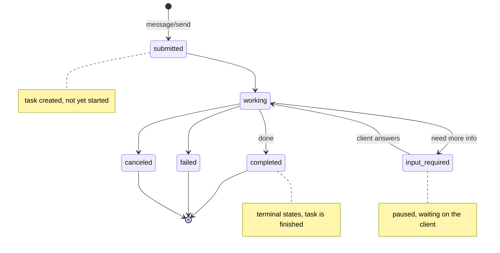

# Lecture 17: A2A — Agent Cards, Task Lifecycle & Streaming

> Your agent can now call tools over MCP (last lectures) — a vertical connection down to functions and resources it orchestrates. But the moment you want your agent to hand a *goal* to another team's agent — one with its own reasoning, its own tools, its own model, running in a different process behind a different company's firewall — a tool call is the wrong shape. You don't want to import their code; you can't (it's not yours), and you shouldn't (it changes weekly). You want to discover what they can do, hand them a task, and watch it progress. That is the horizontal problem, and **A2A (Agent2Agent)** is the protocol built for it. After this lecture you will be able to read and write an Agent Card, reason precisely about the Task lifecycle (`submitted → working → input-required → completed/failed/canceled`), pick between the three interaction modes (`message/send`, `message/stream`, and push notifications) for a given latency/duration profile, and wrap an existing agent as an A2A server plus a client that consumes it *by URL only* — never importing a line of the server's code.

**Prerequisites:** Lecture 11 (frameworks by control model), the MCP lectures earlier this week (JSON-RPC, transports, tools-vs-resources), Week 1 (the agent loop), comfort with HTTP, JSON, and SSE · **Reading time:** ~28 min · **Part of:** AI Agents & Agentic Systems (Expanded Deep Track) Week 4

---

## The core idea (plain language)

MCP connects an agent **down** to tools and resources it drives; A2A connects agents **across** to each other as peers it delegates to. Keep those two prepositions — *down* and *across* — and half of A2A is already intuitive.

The defining word for A2A is **opaque**. When you call another agent over A2A, you know three things and nothing more: its *address* (a URL), its *skills* (what it advertises it can do, in plain text), and its *auth requirements* (what token it wants). You do **not** know what model it runs, what framework it uses, whether it's one agent or a swarm of forty, or what its code looks like. It's a black box with a published menu. That opacity is the entire point: it's what lets a LangGraph agent at your company delegate to a CrewAI agent at a vendor and a Pydantic-AI agent at a partner, all without any of you sharing a codebase, a language, or a deploy pipeline. You integrate against a *contract*, not an implementation.

A2A was announced by Google in early 2025 and donated to the **Linux Foundation** later that year, with backing from a broad set of vendors (Microsoft, AWS, Salesforce, SAP, and dozens more). That governance detail matters for a boring but load-bearing reason: a wire protocol only earns network effects if no single vendor owns the on/off switch. A foundation-governed spec is one you can build a business on.

There are exactly four objects you must know cold, and everything else is detail:

1. **Agent Card** — a JSON manifest at a well-known URL that advertises who the agent is and what it can do. This is **capability discovery**.
2. **Task** — a stateful unit of work with an explicit lifecycle. This is the thing you create and track.
3. **Message / Part** — the turns of the conversation and the typed chunks (text, file, structured data) inside them.
4. **The three interaction modes** — request/response, streaming, and push notification — which differ only in *how the results reach you over time*.

Learn those four and you can reason about any A2A integration.

---

## How it actually works (mechanism, from first principles)

### The Agent Card — capability discovery as a static file

Before you can call an agent, you have to find out what it does. A2A's answer is deliberately dumb and therefore robust: the agent publishes a JSON file at a **well-known path**, `/.well-known/agent-card.json`. "Well-known URI" is an established web convention (RFC 8615 — the same mechanism behind `/.well-known/openid-configuration`); the client just fetches `https://host/.well-known/agent-card.json` and reads it. No registry required, no SDK required to discover — `curl` works.

A minimal card:

```json
{
  "name": "Week3 Research Agent",
  "description": "Answers questions using tools and memory.",
  "url": "https://research.example.com/a2a/",
  "version": "1.0.0",
  "capabilities": { "streaming": true, "pushNotifications": false },
  "defaultInputModes": ["text"],
  "defaultOutputModes": ["text"],
  "skills": [
    {
      "id": "research",
      "name": "Research assistant",
      "description": "Answers factual questions with sources.",
      "tags": ["research", "qa"],
      "examples": ["What changed in the Q3 report?"]
    }
  ],
  "securitySchemes": {
    "bearer": { "type": "http", "scheme": "bearer" }
  }
}
```

Read the fields as a contract:

- **`url`** is where clients POST tasks. It is *not* the same as the card's location — the card lives at `/.well-known/agent-card.json`, but the JSON-RPC endpoint that actually does work is whatever `url` says. A common bug is POSTing to the card's path.
- **`skills[]`** is the menu. Each skill has an `id` (stable, machine-referenced), a human `name`/`description`, `tags` (for filtering/search), and `examples` (few-shot-ish hints a *supervisor* LLM uses to decide whether this agent fits a task). Skills are how you address a peer: you pick an agent because it advertises the `research` skill, not because you know its function names.
- **`capabilities`** are booleans that tell you which interaction modes are available — critically, `streaming` and `pushNotifications`. You must read these *before* choosing a mode; calling `message/stream` against an agent whose card says `"streaming": false` is a client bug.
- **`securitySchemes`** declares what auth the endpoint expects (the same OpenAPI-style security-scheme vocabulary — `http`/`bearer`, `oauth2`, `apiKey`). This is where discovery and identity meet: the card tells you *how* to authenticate before you send a single task.

Because the card is just a file, capability discovery is decoupled from execution. A directory service can crawl thousands of cards; your supervisor can cache them; a human can read one in a browser. The security caveat (foreshadowing the identity lecture): a card is attacker-controllable data. A malicious `description` or `skill.examples` is a prompt-injection vector the moment your supervisor LLM reads it to route — treat card text as untrusted input, never as instructions.

### The Task lifecycle — a state machine, not a request

A tool call is a function: in, out, done. A Task is a **stateful unit of work** with a lifecycle, because peer agents do things that take time, need clarification, or fail halfway. The canonical states:



- **`submitted`** — the task exists; the agent has accepted it but not started.
- **`working`** — active. Long tasks live here, emitting progress.
- **`input-required`** — the agent needs something from you (a clarifying answer, a missing file, an approval) and has *paused*. This is the state most engineers forget exists, and it's the one that turns a one-shot call into a genuine collaboration: the agent can ask "which quarter's report?" mid-task and wait. You resume by sending another message referencing the same `taskId`.
- **`completed` / `failed` / `canceled`** — terminal. `completed` carries artifacts (the results). `failed` carries an error. `canceled` is the client-initiated stop (there's a `tasks/cancel` call).

The task has a stable **`taskId`**. Every message you send to continue it, every status query, every cancel references that id. This is what makes A2A resumable and traceable in a way a plain HTTP call is not — the id is the handle, exactly like `thread_id` was the resume handle in LangGraph's checkpointer (Week 3). The same durability instinct applies.

### Messages, Parts, and Artifacts

Inside a task, communication is **Messages**. Each Message has a `role` (`user` for the client, `agent` for the server) and a list of **Parts**. A Part is a typed chunk:

- **TextPart** — plain text.
- **FilePart** — a file, either inline (base64 `bytes`) or by reference (a `uri`). Use `uri` for anything large; inlining a 40 MB PDF as base64 balloons it ~33% and stuffs it through JSON.
- **DataPart** — structured JSON (a form, a parameter object, a table). This is how you pass machine-readable arguments rather than prose.

The multi-part design means one turn can carry "here's my question (text) + the spreadsheet (file) + the exact filters (data)" without inventing an ad-hoc envelope. Results that the agent produces are **Artifacts** — also made of Parts — attached to the task as it works. A research agent's Artifact might be a TextPart summary plus a FilePart citations list.

### The three interaction modes

All three do the same thing — create/advance a task — and differ only in **how output reaches you over time**. Choose by task duration and whether the client can hold a connection.

**1. Request/response — `message/send`.** One JSON-RPC call, one response. You send a Message; you get back the Task (or a Message) once the agent is done. Simplest; correct for tasks that finish in a few seconds. Blocking: your client waits on the HTTP response the whole time.

**2. Streaming — `message/stream` (Server-Sent Events).** You send the same Message but the connection stays open and the server pushes a sequence of SSE events as work progresses. Two event types matter:
- **`TaskStatusUpdate`** — the state changed (`submitted`→`working`→…) or a chunk of an intermediate message arrived.
- **`TaskArtifactUpdate`** — a piece of a result artifact is ready (possibly incrementally, `append: true`, like token streaming).

The final status update carries a `final: true` flag so the client knows the stream is done. Use streaming when the task takes long enough that the user wants to see progress (tens of seconds to a couple of minutes) and the client can keep a connection open. This is the exact same SSE mechanism MCP's streamable-HTTP transport uses — one long-lived HTTP response, `Content-Type: text/event-stream`, `data:` lines.

**3. Push notifications — webhook callbacks.** For genuinely long tasks (minutes to hours: a deep research crawl, a video render, a batch job), holding an SSE connection is fragile — load balancers, laptops, and mobile networks all drop idle connections. Instead the client registers a **webhook URL**; the agent POSTs a notification to it when the task changes state, and the client then fetches the task to read the result. The client holds *no* connection. This is the fire-and-forget mode, and it's why `capabilities.pushNotifications` is a distinct advertised capability — it requires the client to run a reachable, authenticated endpoint.

```
mode              client holds conn?   good for            failure if misused
────────────────  ──────────────────   ─────────────────   ───────────────────────
message/send      yes (blocking)       < ~5 s tasks        client times out on long work
message/stream    yes (SSE, long)      ~5 s – 2 min        dropped conn loses progress
push notification  no (webhook)         minutes – hours     needs a public, authed callback
```

### The wire: JSON-RPC 2.0

A2A rides on **JSON-RPC 2.0** over HTTP(S) — the same wire format as MCP, which is not a coincidence; both came out of the 2024–25 push to standardize agent plumbing. A `message/send` request is literally:

```json
{ "jsonrpc": "2.0", "id": 1, "method": "message/send",
  "params": { "message": { "role": "user", "parts": [{"kind":"text","text":"..."}] } } }
```

You almost never hand-write this — the `a2a-sdk` does it — but knowing the method names (`message/send`, `message/stream`, `tasks/get`, `tasks/cancel`, `tasks/pushNotificationConfig/set`) makes debugging a 400 in the network tab tractable.

---

## Worked example

Let's make it concrete with numbers: a **supervisor** agent needs a research sub-answer and delegates to your Week-3 research agent over A2A.

**Step 1 — discovery (1 HTTP GET).** The supervisor knows only the URL `https://research.example.com`. It fetches the card:

```
GET https://research.example.com/.well-known/agent-card.json   → 200, 1.4 KB JSON
```

It parses `skills` and sees `research` with example "What changed in the Q3 report?" — a match. It reads `capabilities.streaming: true` and `securitySchemes.bearer`. Cost so far: one GET, ~1.4 KB, ~30 ms. The supervisor **never imported the research agent's code** — it learned everything from a static file.

**Step 2 — delegate with streaming.** It mints a bearer token (identity lecture), then opens `message/stream` with the question. Over the next 18 seconds it receives:

```
t=0.2s  TaskStatusUpdate  state=submitted   taskId=t_9f3
t=0.4s  TaskStatusUpdate  state=working
t=6.1s  TaskArtifactUpdate  artifact append  "Revenue rose 12% QoQ..."   (partial)
t=12.7s TaskArtifactUpdate  artifact append  "...driven by EMEA."        (partial)
t=17.9s TaskStatusUpdate  state=completed   final=true
```

Five events. The user watching the supervisor's UI saw text appear at t=6.1s instead of staring at a spinner until t=17.9s — the entire reason to stream. Had the supervisor used `message/send`, it would have blocked for ~18 s and gotten one response; fine functionally, worse UX.

**Step 3 — the `input-required` fork.** Suppose at t=3s the research agent can't tell which "Q3" you mean. Instead of guessing it emits:

```
t=3.0s  TaskStatusUpdate  state=input-required
        message: "Which fiscal year's Q3 — FY2025 or FY2026?"
```

The stream pauses in `input-required`. The supervisor answers by sending a new message *on the same `taskId`* (`t_9f3`), the task returns to `working`, and streaming resumes. This is the collaboration loop a tool call can't express — a tool can't ask a follow-up question and wait.

**Cost intuition.** Discovery is trivial and cacheable — fetch the card once, reuse for thousands of tasks (respect the card's version to invalidate). The expensive part is the *delegated agent's own token spend*, which is opaque to you. That's the double-edged sword of peer delegation: you get capability without owning implementation, but you also can't see or cap the peer's internal cost from the outside — you can only bound *your* side (timeouts, and canceling via `tasks/cancel`).

### Wrapping an existing agent as an A2A server

The `a2a-sdk` splits into two halves: the **AgentExecutor** (your logic — how a task gets worked) and the **A2AStarletteApplication** (the plumbing — serves the card and the JSON-RPC endpoint). You write the first; the SDK gives you the second.

```python
# a2a_agent/agent_executor.py
from a2a.server.agent_execution import AgentExecutor, RequestContext
from a2a.server.events import EventQueue
from a2a.utils import new_agent_text_message

class ResearchExecutor(AgentExecutor):
    async def execute(self, ctx: RequestContext, events: EventQueue) -> None:
        question = ctx.get_user_input()
        # ---- drop to your Week-3 agent here (the escape hatch from Lec 11) ----
        answer = await run_week3_agent(question)      # your LangGraph app
        # emit the result; the SDK maps this onto the task lifecycle + SSE
        await events.enqueue_event(new_agent_text_message(answer))

    async def cancel(self, ctx: RequestContext, events: EventQueue) -> None:
        raise NotImplementedError("cancel not supported")
```

```python
# a2a_agent/server.py
from a2a.server.apps import A2AStarletteApplication
from a2a.server.request_handlers import DefaultRequestHandler
from a2a.server.tasks import InMemoryTaskStore
from a2a.types import AgentCard, AgentSkill, AgentCapabilities

skill = AgentSkill(id="research", name="Research assistant",
                   description="Answers questions using tools and memory.",
                   tags=["research", "qa"], examples=["What changed in the Q3 report?"])
card = AgentCard(name="Week3 Research Agent", description="Tool-using agent from Week 3.",
                 url="http://localhost:9999/", version="1.0.0",
                 capabilities=AgentCapabilities(streaming=True, pushNotifications=False),
                 defaultInputModes=["text"], defaultOutputModes=["text"], skills=[skill])

handler = DefaultRequestHandler(agent_executor=ResearchExecutor(), task_store=InMemoryTaskStore())
app = A2AStarletteApplication(agent_card=card, http_handler=handler).build()
# uvicorn a2a_agent.server:app --port 9999
```

`A2AStarletteApplication` now serves the card at `/.well-known/agent-card.json` *and* the JSON-RPC endpoint at `/`, and translates your `enqueue_event` calls into `submitted → working → completed` transitions plus SSE frames. You didn't write JSON-RPC, SSE, or the lifecycle state machine — you wrote "given a question, produce an answer" and let the app own the protocol.

### The client that never imports the server

```python
# client/a2a_client.py
import httpx
from a2a.client import A2ACardResolver, A2AClient
from a2a.types import MessageSendParams, SendStreamingMessageRequest

async def ask(base_url: str, question: str):
    async with httpx.AsyncClient() as http:
        # 1) discover: fetch the card by URL only — no server code imported
        card = await A2ACardResolver(http, base_url=base_url).get_agent_card()
        client = A2AClient(http, agent_card=card)             # 2) construct from the card
        req = SendStreamingMessageRequest(params=MessageSendParams(
            message={"role": "user", "parts": [{"kind": "text", "text": question}]}))
        async for event in client.send_message_streaming(req):  # 3) consume the stream
            print(event)                                        # TaskStatusUpdate / ArtifactUpdate
```

The load-bearing detail: this client's only inputs are a **URL** and a **question**. It imports the *SDK*, never the server's modules. Point it at any A2A-compliant agent — yours, a vendor's, one written in Java — and it works identically. That is the horizontal, opaque-peer promise made concrete.

---

## How it shows up in production

**Latency and the streaming decision.** The user-visible metric is time-to-first-token, not total time. A 20-second research task feels broken under `message/send` (blank until done) and responsive under `message/stream` (words at ~6 s). But streaming has a real operational cost: a long-lived SSE connection ties up a server worker and dies on any proxy with an idle timeout (many default to 60 s). If your task routinely exceeds a minute or two, **push notifications are not optional politeness — they're the only reliable mode**, because you stop betting on a connection staying up. Rule of thumb: seconds → send; tens of seconds → stream; minutes+ → push.

**Cost you can't see.** Delegating to a peer means delegating its token bill. You cannot inspect or cap the peer's internal spend; you can only bound your exposure with a client-side timeout and `tasks/cancel`. In a multi-agent system where a supervisor fans out to five peers, your cost is the *sum of five opaque bills* plus coordination overhead — the same 10-15x multiplier warning from the multi-agent lectures applies, now across a network boundary where it's even harder to trace. Instrument every delegation with the `taskId`, latency, and (if the peer reports it) usage.

**Debuggability and the `taskId`.** When a delegated task goes wrong, the `taskId` is your entire forensic handle across two systems. Log it on both sides. `tasks/get` lets you pull the current state of any task by id — build that into your ops tooling so on-call can answer "what happened to `t_9f3`?" without SSH-ing into the peer.

**Version skew.** The card has a `version`. Peers redeploy on their own schedule; a skill you depended on can change its behavior or vanish. Cache cards but *key the cache on version* and re-fetch periodically. Treating a card as forever-static is the "rug pull" failure mode — the same silent-redefinition risk MCP tools have, now for whole agents.

**Auth is a first-class field, not an afterthought.** `securitySchemes` in the card is the hook. In production every A2A call carries a token, and the right token is a short-lived, end-user-scoped one (next lecture) — never a shared service credential — precisely so a compromised peer can't act beyond the caller's authority. The confused-deputy risk is amplified across agent boundaries: you're handing a goal to something you don't control.

---

## Common misconceptions & failure modes

- **"A2A is just MCP for agents."** No. MCP exposes *tools/resources* you orchestrate — deterministic-ish, yours to drive. A2A exposes *peers* with their own reasoning you delegate goals to. Modeling a reasoning peer as an MCP tool throws away the task lifecycle, streaming, `input-required` collaboration, and discovery. Wrong shape.
- **POSTing to the card's path.** The card lives at `/.well-known/agent-card.json`; tasks go to the `url` field *inside* the card. They're often different paths. Read the field.
- **Ignoring `input-required`.** Engineers build the happy path (`working → completed`) and their client hangs or errors when the agent legitimately pauses to ask a question. Handle the pause: it's a normal, resumable state, not a failure.
- **Streaming a two-hour task.** SSE over a proxy with a 60 s idle timeout will drop mid-task and you'll lose progress. Long tasks need push notifications. Check `capabilities.pushNotifications` and design for it.
- **Trusting card text as instructions.** A card's `description`/`examples` are attacker-controllable. If your supervisor LLM reads them to route, a poisoned card is a prompt-injection vector. Treat all card text as untrusted data.
- **The client importing the server's code.** If your "A2A client" `import`s the server's modules or shares its types beyond the SDK, you've built a distributed monolith, not an opaque-peer integration. The client must work knowing only a URL. This is the one invariant that proves you understood the protocol.
- **Assuming one response.** `message/send` returns once; `message/stream` returns many events ending in `final: true`. Writing client code that reads exactly one event breaks the moment you stream.

---

## Rules of thumb / cheat sheet

- **MCP = down to tools/resources; A2A = across to peer agents.** Pick by "is the callee a function I orchestrate, or an autonomous peer I hand a goal?"
- **Discovery is a static file:** `GET /.well-known/agent-card.json`. `curl`-able, cacheable, no SDK needed to read.
- **Address peers by `skill`, not by function name.** The card's `skills[]` is the menu; `url` (inside the card) is where tasks go.
- **Read `capabilities` before choosing a mode.** `streaming` and `pushNotifications` are advertised booleans — don't assume.
- **Mode by duration:** `< ~5 s` → `message/send`; `~5 s–2 min` → `message/stream` (SSE); `minutes+` → push notifications (webhook).
- **`input-required` is normal.** Design the client to answer follow-ups on the same `taskId`, not to treat a pause as an error.
- **`taskId` is the handle** — log it on both sides; it's your only cross-system forensic thread. `tasks/get` reads state, `tasks/cancel` stops it.
- **Cache cards keyed on `version`;** re-fetch periodically to catch redeploys (rug-pull defense).
- **Every call carries a token** per `securitySchemes` — short-lived, end-user-scoped, never a shared service key (next lecture).
- **The client knows only a URL.** If it imports server code, it's not A2A.

---

## Connect to the lab

Step 3 of the Week-4 lab wraps your Week-3 agent in an `AgentExecutor` and serves it with the `a2a-sdk`'s `A2AStarletteApplication` — the card at `/.well-known/agent-card.json`, the JSON-RPC endpoint driving the Task lifecycle, `streaming: true`. Step 4 writes the second agent that uses the SDK's `A2ACardResolver` to fetch the card **by URL only**, constructs an `A2AClient`, runs a `message/send`, then consumes `message/stream` and prints ≥2 incremental events. The Definition-of-Done line "the client never imports the server's code" is this lecture's opaque-peer invariant turned into an acceptance test — if your client `import`s the server, you've failed the exercise even if it runs.

---

## Going deeper (optional)

- **A2A protocol docs** — root: `a2a-protocol.org`. Read "Key Concepts," "Agent Card," "Life of a Task," and "A2A and MCP." Start here.
- **A2A spec + SDK** — GitHub `a2aproject/A2A` (spec, JSON schema, examples) and the Python `a2a-sdk` (search: `a2a-sdk python`). The `samples/` directory has runnable client/server pairs.
- **Linux Foundation A2A announcement** — for governance/vendor-backing context. (Search: `Agent2Agent Linux Foundation`.)
- **JSON-RPC 2.0 spec** — `jsonrpc.org` — the wire format under both A2A and MCP; worth 15 minutes to read in full, it's short.
- **RFC 8615 (Well-Known URIs)** and **Server-Sent Events (the WHATWG HTML `EventSource` spec / MDN "Using server-sent events")** — the two web primitives A2A leans on for discovery and streaming. (Search: `MDN server-sent events`.)
- **A2A + MCP composition** — the A2A docs' own "A2A and MCP" page is the canonical read on when an A2A-exposed peer internally uses MCP tools.

---

## Check yourself

1. In one sentence each, distinguish MCP from A2A by the *kind* of thing on the other end of the call, and say what you'd lose by modeling a reasoning peer as an MCP tool.
2. Where does an A2A client look **first** to learn an agent's skills and auth requirements, what field tells it where to actually send tasks, and what field tells it whether it can stream?
3. Walk the Task lifecycle states. Which one turns a one-shot call into a collaboration, and how does the client resume from it?
4. You must delegate a task that reliably takes 40 minutes. Which interaction mode, why not streaming, and what does the client have to provide that streaming doesn't require?
5. Give the one client-side invariant that proves an integration is truly "opaque peer" A2A and not a distributed monolith.
6. Name two ways an Agent Card is an attack surface, and the mitigation for each.

### Answer key

1. **MCP** puts a *tool/resource* on the other end — a function you orchestrate, deterministic-ish, yours; **A2A** puts an *autonomous peer agent* with its own reasoning that you hand a goal. Modeling a peer as a tool loses the Task lifecycle, streaming progress, the `input-required` follow-up loop, and card-based discovery — you flatten a collaborator into a single blocking function call.
2. First: the **Agent Card** at `/.well-known/agent-card.json` (fetched by URL). Tasks go to the **`url`** field *inside* the card (not the card's own path). **`capabilities.streaming`** (a boolean) tells it whether `message/stream` is available; `securitySchemes` tells it how to authenticate.
3. `submitted` (accepted, not started) → `working` (active) → optionally `input-required` (paused, needs something from the client) → back to `working` → terminal `completed`/`failed`/`canceled`. **`input-required`** is the collaboration state: the agent asks a question and waits; the client resumes by sending a new message referencing the same **`taskId`**, returning the task to `working`.
4. **Push notifications (webhook callbacks).** Streaming (SSE) holds a long-lived connection that proxies/load balancers with idle timeouts (often ~60 s) will drop mid-task, losing progress; a 40-minute task will almost certainly be cut. Push notifications require the client to run a **reachable, authenticated webhook endpoint** the agent POSTs to on state change — something streaming doesn't need. (Also requires `capabilities.pushNotifications: true` on the card.)
5. **The client knows only a URL** (and the SDK) — it fetches the card, constructs the client from it, and calls the peer without importing any of the server's code or sharing its types beyond the standard SDK. If the client `import`s server modules, it's a distributed monolith, not opaque-peer A2A.
6. (a) **Card text** (`description`, `skill.examples`) is attacker-controllable and read by a routing LLM → prompt-injection vector; mitigate by treating all card text as untrusted data, never as instructions, and not letting card text alone authorize actions. (b) **Version drift / rug pull** — a peer silently changes a skill's behavior after you integrated; mitigate by caching cards keyed on `version` and re-fetching periodically, and by scoping the token you send so a misbehaving peer can't exceed the caller's authority.
