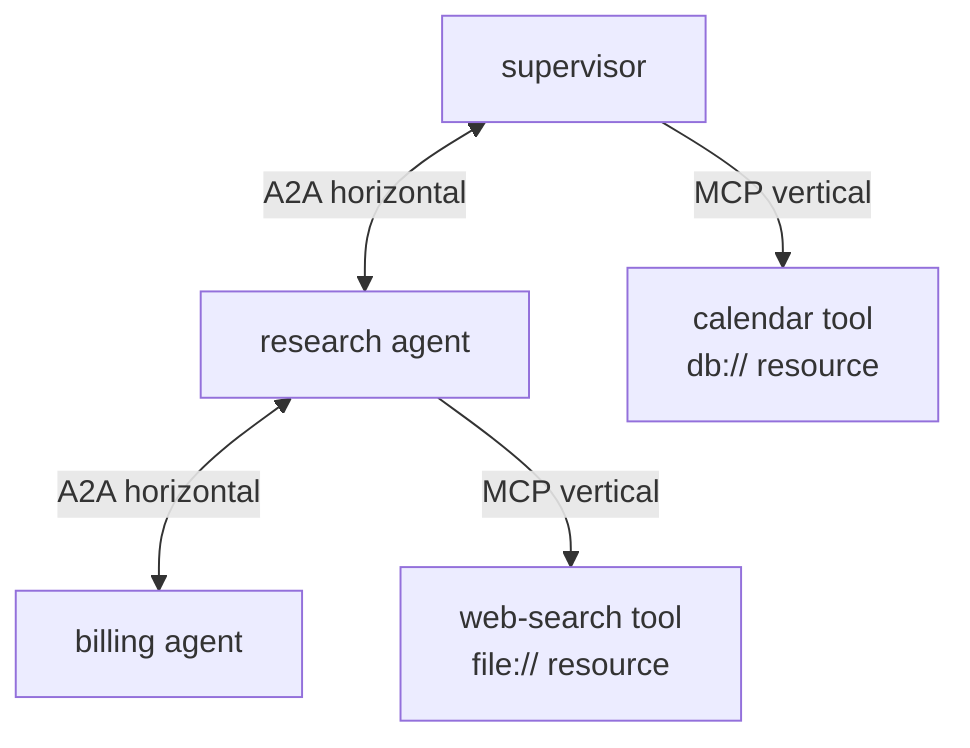
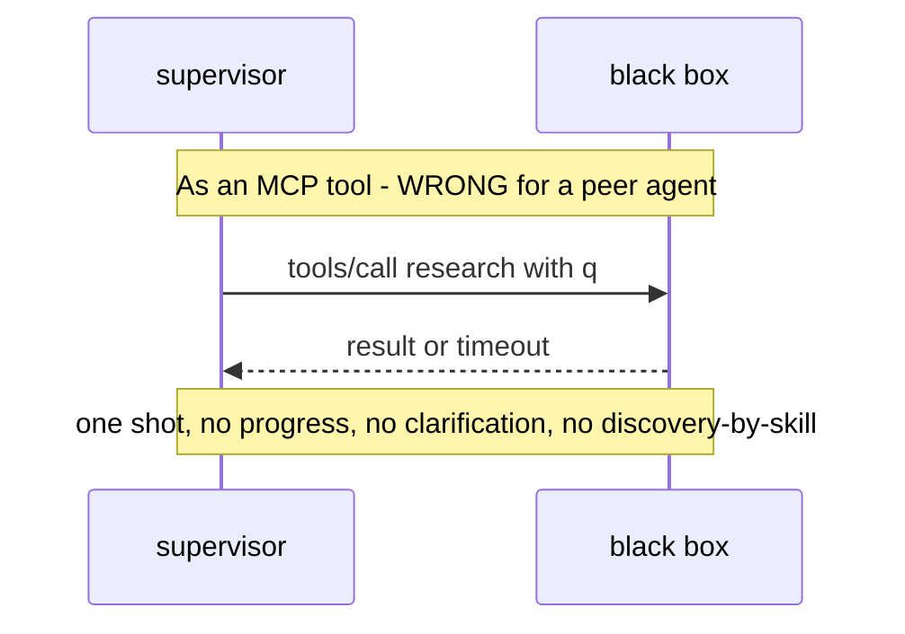
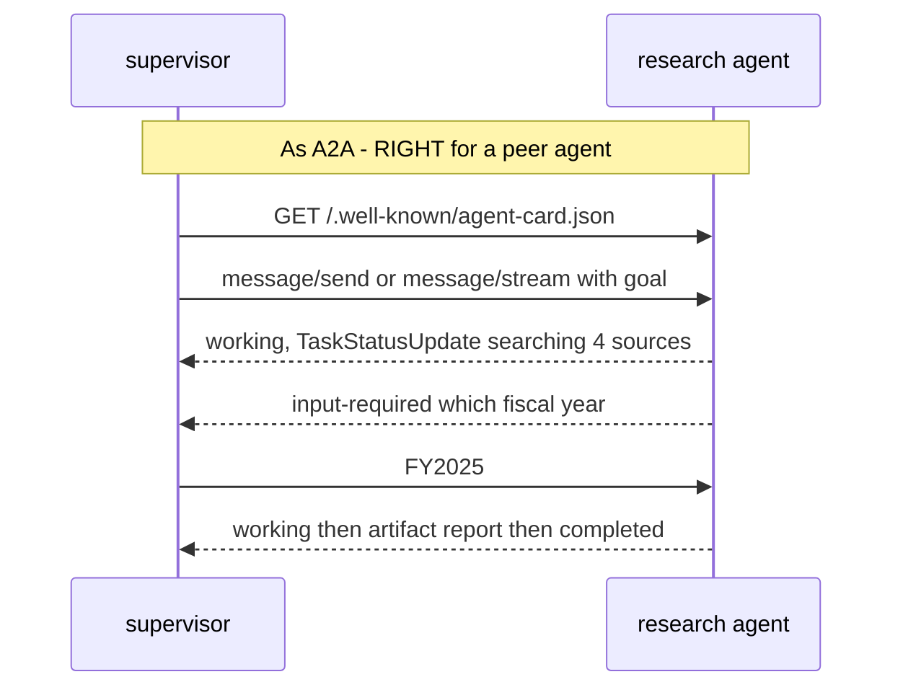

# Lecture 18: MCP vs A2A — Vertical vs Horizontal & Composition

> This is the distinction engineers get wrong more than any other in the agent stack, and getting it wrong is expensive: it silently strips lifecycle, streaming, and discovery out of your system and leaves you with a brittle RPC call wearing a peer-agent's clothes. The confusion is understandable — from ten feet away, "my agent calls an MCP tool" and "my agent calls another agent over A2A" both look like *one thing invoking another thing over JSON-RPC*. But the two protocols answer different questions and were designed against different assumptions, and the *real* production shape is not "pick one" — it's the two composing, with A2A on the outside and MCP on the inside. After this lecture you can state the one-liner cold, run the decision test on any new integration, explain precisely what you lose by modeling a peer agent as a tool, draw the canonical composed system (a supervisor delegating over A2A to a research agent that internally drives MCP servers), and place any integration on the vertical/horizontal axis with a one-sentence justification.

**Prerequisites:** The agent loop and native tool calling (Lectures 1–2); the workflow-vs-autonomous spectrum (Lecture 10); this week's MCP and A2A primitives — tools/resources/prompts, JSON-RPC transports, the Agent Card, the Task lifecycle. · **Reading time:** ~26 min · **Part of:** AI Agents & Agentic Systems, Week 4

## The core idea (plain language)

Two protocols, two axes, one sentence you should be able to recite in your sleep:

- **MCP = agent ↔ tools/resources.** You call a *tool*: a deterministic-ish function that you orchestrate. You decide when to call it, with what arguments, and what to do with the result. The tool does not have goals. It has a signature.
- **A2A = agent ↔ agent.** You hand a *goal* to an autonomous peer that has its own reasoning loop. You do not orchestrate its steps — you delegate an outcome and it figures out how to get there, possibly over many turns, possibly asking you for clarification, possibly streaming partial progress for a minute.

The mental picture is a pair of axes. MCP is **vertical**: it reaches *down* from your agent into the substrate of capabilities — a web-search function, a `file://` resource, a database query. A2A is **horizontal**: it reaches *sideways* to other agents that sit at the same level of abstraction as you, each an opaque black box with its own brain.

The single most useful thing in this lecture is a **decision test** you apply to every new integration:

> Does the callee have its own reasoning/autonomy, and are you handing it a *goal*? → **A2A.**
> Is the callee a deterministic function you orchestrate step by step? → **MCP.**

That's it. Everything else — the transports, the Agent Cards, the Task lifecycle — is machinery in service of that one distinction. And the reason the distinction is load-bearing rather than pedantic is that the two protocols expose *fundamentally different runtime contracts*, and if you pick the wrong one you don't get the contract you actually needed.

## How it actually works (mechanism, from first principles)

### The MCP contract: a request/response tool call you own

When your agent uses an MCP server, the shape is a synchronous-ish request/response over JSON-RPC 2.0. You do `tools/list` to discover the functions, then `tools/call` with a name and validated arguments, and you get a result back. The server exposes three primitives — **tools** (model-invoked functions with side effects), **resources** (read-only context addressed by URI), **prompts** (user-selected templates) — but the runtime posture of all three is the same: *the host is in control.* Your agent's loop decides the sequence. The MCP server is a passive capability provider that answers when spoken to.

Crucially, an MCP tool call has **no independent lifecycle you observe**. It's a function: it returns, or it errors, and that's the whole state machine. There's no "the tool is 40% done, still working." There's no "the tool needs to ask you a clarifying question and then continue." You call, you block (or await), you get bytes. That's a *feature* for tools — a `word_count(text)` function should be that simple.

### The A2A contract: a delegated goal with a lifecycle

A2A is built around the assumption that the callee is *not* a function — it's an agent that might think for a while. So the protocol gives you three things a tool call doesn't:

1. **Discovery via the Agent Card.** A peer agent publishes a JSON manifest at `/.well-known/agent-card.json` advertising its `name`, `description`, `url`, `skills`, `capabilities` (e.g. `streaming: true`, `pushNotifications`), and auth requirements. You discover an agent's *skills* the way you'd read a colleague's job description — by intent, not by importing its code. This is capability discovery at the agent level, and it's how a supervisor finds a research agent it has never been compiled against.

2. **A stateful Task lifecycle.** A2A work is a **Task** with an explicit state machine: `submitted → working → input-required → completed / failed / canceled`. The `input-required` state is the tell — a *tool* can't pause and ask you a question mid-execution; an *agent* can. That state literally does not exist in the MCP tool contract, because tools don't have that need.

3. **Streaming and long-running delivery.** Because a peer agent may take a minute (or an hour), A2A supports `message/stream` yielding incremental `TaskStatusUpdate` / `TaskArtifactUpdate` events over SSE, and **push notifications** (webhook callbacks) so a client doesn't have to hold a connection open for a multi-hour job. Again: a synchronous tool call has no analog. It just blocks.

Here is the same interaction drawn two ways, so the loss is concrete:

### Why modeling a peer agent as a tool actively hurts

Say you *do* wrap a peer research agent as an MCP tool called `research(query) -> str`. Mechanically it works — you'll get an answer back. But you have thrown away three things the peer agent was built to give you:

- **Lifecycle.** The peer's Task state machine collapses into "returned / raised." You can't observe `working`, you can't handle `input-required` (so if the agent needs to disambiguate the fiscal year, it either guesses or fails — both bad), and you can't `cancel` a runaway job cleanly. A 90-second research run becomes an opaque block that either resolves or hits your tool timeout.
- **Streaming.** A tool returns once. The peer's incremental `TaskArtifactUpdate` events — the thing that lets you show a user "found 3 of 6 sources…" and lets you *stop early* if the partial answer is already enough — are gone. You wait for the whole thing or nothing.
- **Discovery.** You bound to a fixed function signature at build time instead of reading the peer's Agent Card at runtime. When the peer adds a `skills` entry or changes its auth requirements, your tool wrapper is stale and you find out in production.

The tell that you've made this mistake: your "tool" has a suspiciously long and variable latency, occasionally wants to ask a question but can't, and you keep bumping its timeout. That's an agent trapped inside a tool's contract.

## Worked example

Let's build the canonical production shape with real numbers so the composition is concrete, not hand-wavy. The system: a **supervisor** agent that answers "What changed in our Q3 revenue vs Q2, and why?" by delegating research to a specialist.

**The pieces.** A `research agent` is exposed *over A2A*. Internally, that research agent is itself an agent loop that uses *MCP servers* to do its actual work: a `web_search` MCP tool and a `file://` MCP resource pointing at the company's financial docs. The supervisor has never imported the research agent's code — it only knows a URL.

**Step 1 — discovery (A2A, horizontal).** The supervisor fetches `http://research.internal/.well-known/agent-card.json`. It reads back a skill `id: "research"`, `capabilities.streaming: true`, and a `securitySchemes` entry requiring a Bearer token. The supervisor now knows *what* this peer can do and *how* to authenticate — without a single line of shared code.

**Step 2 — delegation (A2A).** The supervisor sends `message/stream` with the goal: *"Explain the Q3-vs-Q2 revenue change."* It does **not** send a step-by-step plan. It hands over an outcome.

**Step 3 — the research agent does its job (MCP, vertical).** Inside its own loop, the research agent:
- calls the `file://` MCP resource to read `q2.md` and `q3.md` (2 MCP calls, ~read-only, deterministic),
- calls the `web_search` MCP tool 3 times to check macro context ("2025 SaaS churn benchmarks", etc.),
- reasons over the results across ~4 loop iterations.

**Step 4 — streaming back up (A2A).** As it works, it emits `TaskStatusUpdate` events: `working: "read Q2/Q3 filings"`, `working: "cross-checking benchmarks"`, then a final `TaskArtifactUpdate` with the report and `completed`.

Now put arithmetic on it so the two axes are visibly different work:

| Layer | Protocol | Calls | Rough latency | Who's in control |
|---|---|---|---|---|
| supervisor → research agent | A2A | 1 delegation + N stream events | ~40 s (the peer thinks) | the *peer* |
| research agent → MCP servers | MCP | 2 resource reads + 3 tool calls | ~200 ms each, ~1 s total | the research agent |

Notice the asymmetry that *proves* the distinction. The 5 MCP calls are cheap, fast, deterministic-ish, and the research agent orchestrates every one — it decides the search queries, it decides when it has enough. The single A2A delegation is slow, variable, and the supervisor deliberately *does not* orchestrate its internals — it delegated a goal and watched a lifecycle unfold. Same JSON-RPC family on the wire; completely different contracts and responsibilities. This is exactly the case the A2A docs describe on their own **"A2A and MCP"** page: A2A for the agent-to-agent collaboration, MCP for the agent-to-tooling underneath, and they compose rather than compete.

## How it shows up in production

**Latency budgets and timeouts diverge by an order of magnitude.** MCP tool calls belong in the tens-to-hundreds-of-milliseconds regime; you set aggressive timeouts and retry them like any RPC. A2A delegations belong in the seconds-to-minutes regime and you should *not* be holding a synchronous connection for them — that's what streaming and push notifications exist for. Teams that model a peer agent as an MCP tool discover this the hard way: their tool-call timeout (say 30 s) fires on a legitimately-90-second research task, and they "fix" it by cranking the timeout to 120 s, which just papers over the fact that they picked the wrong protocol.

**Debugging surface changes.** When an MCP tool misbehaves you debug a function: bad args in, wrong bytes out, check the schema. When an A2A peer misbehaves you debug a *distributed conversation*: read the Task lifecycle, find where it went to `failed` or got stuck in `input-required` with no one answering, inspect the streamed events. If you've flattened a peer into a tool, you've *lost the lifecycle trace* that would have told you it was waiting for input — so it just looks like a mysteriously slow tool.

**Cost attribution.** An A2A peer runs its own model calls that bill against *its* budget, discovered and reasoned about independently. A per-week reminder from Lecture 4's budgets: a peer agent you delegate to can burn tokens on its own reasoning loop that never show up in your process's token counter. You need to reason about the *peer's* cost as a separate line item, the same way you'd reason about a downstream microservice's cloud bill — not fold it into your own tool spend.

**Discovery drift is a real ops event.** Because A2A discovery happens at runtime via the Agent Card, a peer changing its skills or auth requirements is a live-system change you detect by re-reading the card, not a compile error. This is a feature (loose coupling across teams/vendors) but it means Agent Card versioning and validation belong in your monitoring, not just your unit tests.

**Security posture differs.** An MCP tool's danger is mostly *tool poisoning / confused deputy* — a malicious tool description or an over-broad credential (covered in this week's security material). An A2A peer's danger is that it's an *autonomous actor* you're trusting with a goal: its Agent Card can lie about its skills, and it can return artifacts crafted to prompt-inject *you*. Treat a peer agent's output as untrusted content, exactly as you'd treat web-retrieved text.

## Common misconceptions & failure modes

- **"They're competitors; I have to choose."** No. The overwhelmingly common production shape is *both, layered*: A2A on the outside for agent collaboration, MCP on the inside for each agent's tools/resources. If you're choosing between them, you've probably misframed the problem.
- **"A2A is just MCP for agents."** They share JSON-RPC 2.0 and a discovery step, which invites this. But MCP has no `input-required` state, no Task lifecycle, no streaming-of-progress-with-artifacts as a first-class concept. Those exist precisely because a peer agent needs them and a tool doesn't.
- **"Wrapping the peer as a tool is simpler, ship it."** It's simpler *until* the peer needs to clarify, stream, or run long — at which point you're re-implementing half of A2A badly inside a tool. You lose lifecycle, streaming, and discovery, and you find out under load.
- **"MCP resources are the same as A2A artifacts."** A resource is read-only context *you* pull by URI (`file://`, `db://`) to feed your model. An artifact is output a *peer agent produced* while working a Task. One is input substrate; the other is a peer's deliverable.
- **"If it returns text, it's a tool."** Return type tells you nothing. A research agent returns text; so does a `word_count` tool. The distinguishing question is *autonomy and goal-handoff*, never the shape of the return value.
- **Over-delegating.** The inverse mistake: wrapping a plain deterministic function as an A2A agent because "agents are cool." Now you've paid for an Agent Card, a Task lifecycle, and a network hop to call something that should have been an in-process MCP tool. Autonomy you don't need is pure overhead.

## Rules of thumb / cheat sheet

- **The one-liner:** MCP = agent ↔ tools/resources (a call you orchestrate). A2A = agent ↔ agent (a goal you delegate to an autonomous peer).
- **The decision test:** *own reasoning + you hand it a goal → A2A. Deterministic function you orchestrate → MCP.*
- **Axis placement:** MCP is **vertical** (down to capabilities). A2A is **horizontal** (across to peers).
- **Lifecycle smell test:** does the callee ever need to say "still working" or "I need to ask you something"? If yes, it's an agent → A2A. If it's call-and-return, it's a tool → MCP.
- **Latency smell test:** callee is tens-to-hundreds of ms and deterministic → MCP. Callee is seconds-to-minutes and variable → A2A (use streaming / push, never a blocking tool timeout).
- **Composition default:** expose agents over A2A; back each agent's capabilities with MCP. Supervisor discovers peers by Agent Card; each peer drives its own MCP servers.
- **Don't flatten a peer into a tool** — you lose lifecycle, streaming, and discovery. Don't inflate a function into a peer — you pay for autonomy you don't need.
- **Treat peer outputs as untrusted** (prompt-injection surface); treat MCP tool descriptions as untrusted too (tool poisoning). Both are attack surfaces.

## Connect to the lab

This lecture is the conceptual spine of Week 4's lab (`06-agents.md`, Week 4, Step 3–4): you expose your Week-3 agent **over A2A** with a valid Agent Card at `/.well-known/agent-card.json`, and a *second* agent discovers it *by URL only* (no code import) and consumes a streaming response — that's the horizontal axis, live. Meanwhile Steps 1–2 have your agent **consume an MCP server** as a tool — the vertical axis. The composition example the DoD asks you to name in your README ("an A2A agent whose internal capabilities are backed by MCP tools") is exactly the worked example above; build it and you've made the distinction muscle memory.

## Going deeper (optional)

- **A2A official docs — the "A2A and MCP" page.** Root domain: `a2a-protocol.org`. This is the primary source referenced throughout; it lays out the compose-don't-compete relationship in the maintainers' own words. Also the spec repo `a2aproject/A2A` on GitHub.
- **Model Context Protocol spec and SDKs.** Root domain: `modelcontextprotocol.io`; GitHub org `modelcontextprotocol`. Read the primitives (tools/resources/prompts) and the transport section (stdio vs Streamable HTTP; SSE is legacy).
- **Anthropic — "Building Effective Agents."** Search: `Anthropic Building Effective Agents`. The workflow-vs-autonomous framing underpins *why* the decision test matters — it's the same "do you own the control flow or does the model?" question one level up.
- **Google / Linux Foundation A2A launch materials.** Search: `A2A protocol Agent2Agent Linux Foundation`. Context on why a horizontal agent-to-agent standard emerged separately from MCP.
- **Search queries for currency (2025–2026):** `A2A and MCP composition`, `Agent Card well-known agent-card.json`, `MCP vs A2A when to use`.

## Check yourself

1. State the one-liner distinction between MCP and A2A in a single sentence each, and say which axis (vertical/horizontal) each one occupies.
2. You're integrating a component that, given a question, sometimes needs to pause and ask a clarifying question before continuing, and can take 60+ seconds. MCP or A2A? Name the specific protocol feature that decides it.
3. Concretely, what three things do you lose when you model a peer research agent as an MCP tool?
4. In the composed system, the supervisor never imports the research agent's code. How does it learn what the research agent can do, and where does it look?
5. Give one example of the *inverse* mistake (inflating something into an A2A peer when it should be MCP) and say what it costs you.
6. Why is a callee's return type (e.g. "it returns a string") a useless signal for deciding MCP vs A2A?

### Answer key

1. **MCP = agent ↔ tools/resources** — a deterministic-ish call you orchestrate step by step (**vertical**, reaching down to capabilities). **A2A = agent ↔ agent** — a goal you delegate to an autonomous peer with its own reasoning (**horizontal**, reaching across to peers).
2. **A2A.** The deciding feature is the **Task lifecycle's `input-required` state** (and streaming for the long duration) — a peer can pause and ask a clarifying question mid-execution and stream progress; an MCP tool call is call-and-return with no such state.
3. **Lifecycle** (the Task state machine collapses to returned/raised — no `working`, no `input-required`, no clean `cancel`); **streaming** (incremental `TaskStatusUpdate`/`TaskArtifactUpdate` events vanish; you wait for the whole result or nothing); **discovery** (you bind to a fixed function signature at build time instead of reading the Agent Card at runtime, so the peer's skill/auth changes go undetected).
4. It performs **A2A capability discovery**: it fetches the peer's **Agent Card** at `/.well-known/agent-card.json`, which advertises the peer's `skills`, `capabilities` (e.g. `streaming`), and auth requirements — no code import needed, just the URL.
5. Wrapping a plain deterministic function (say `word_count`, or a currency-conversion lookup) as an A2A agent because "agents are cool." It costs you an unnecessary Agent Card, a Task lifecycle, and a network hop plus autonomy overhead for something that should have been an in-process/stdio MCP tool.
6. Because both tools and agents can return the same types — a research *agent* and a `word_count` *tool* both return text. The distinguishing property is **autonomy and goal-handoff** (does it reason on its own toward a goal you delegated?), which the return type says nothing about.
