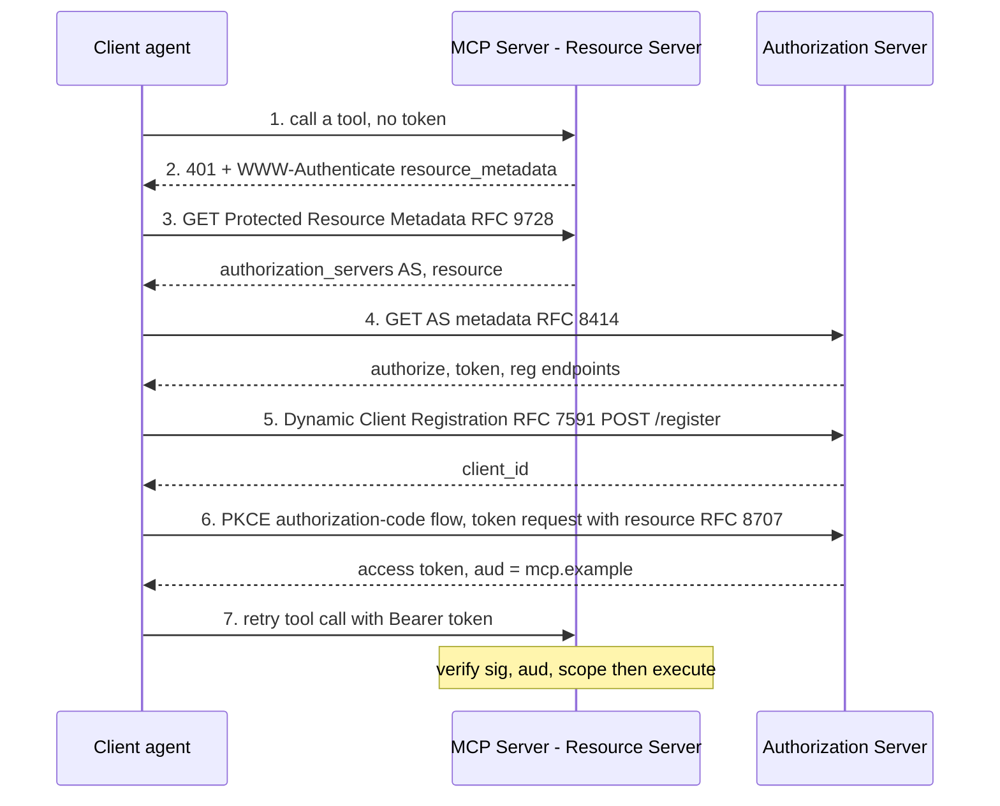

# Lecture 19: Agent Identity & Auth: OAuth 2.1, Scoped Tokens & Token Exchange

> An agent is a program that acts. The moment it acts on something that matters — reads your calendar, deletes a note, moves money — the only question that keeps you out of the incident channel is: *whose authority is it acting with, and how much of it?* Get this wrong and a single poisoned tool description turns your agent into a confused deputy that wields your admin key on an attacker's behalf. This lecture is the hard, load-bearing security core of the agents phase, and it does not get to be skimmed. After it you will be able to explain the OAuth 2.1 baseline and why PKCE is non-negotiable, describe scoped tokens and on-behalf-of delegation via RFC 8693 token exchange, walk the full MCP authorization dance (Protected Resource Metadata → discovery → PKCE authorization-code flow → Dynamic Client Registration → audience-bound Bearer token), articulate why secretless, per-end-user, short-lived credentials are precisely what kill the confused-deputy attack, place workload identity (SPIFFE/SVID) for the no-human case, and — most concretely — mint and verify a scoped JWT that returns 401, 403 `insufficient_scope`, and 200 for the right reasons.

**Prerequisites:** MCP basics (a server exposes tools/resources over JSON-RPC); the confused-deputy and tool-poisoning failure modes from this week's protocol lecture; comfort with HTTP status codes, redirects, JSON, and a rough mental model of JWTs (header.payload.signature). · **Reading time:** ~30 min · **Part of:** AI Agents & Agentic Systems, Week 4

## The core idea (plain language)

Reduce the entire agent-security story to one sentence and tape it to your monitor: **the agent should only ever act with the caller's authority, minimally scoped, for a short time.** Every mechanism in this lecture is machinery for enforcing exactly that sentence.

Break it into its three load-bearing words.

**Caller's authority.** When Alice asks your agent to "delete my draft note," the note-service must see *Alice's* identity and *Alice's* permissions — not the agent's, and definitely not some shared service account that can delete *everyone's* notes. If the agent presents its own broad credential, then Alice's request and an attacker's smuggled request are indistinguishable to the downstream service: both arrive wearing the agent's badge. That is the **confused deputy** — a privileged intermediary tricked into misusing its privilege on someone else's behalf. The fix is to make the agent a *transparent* deputy: the end user's identity flows *through* it to the resource.

**Minimally scoped.** A token that says "this bearer may do `notes:read`" is worthless for deleting a note — by design. A token should grant `calendar.read`, never "everything." If a tool is poisoned and starts issuing rogue calls, a narrowly scoped token bounds the blast radius to exactly the one thing that scope permits. Scope is the difference between "a compromised tool read one calendar" and "a compromised tool wiped the org."

**Short time.** A credential that lives for 5 minutes is a credential an attacker has 5 minutes to abuse before it's inert. Long-lived shared secrets (that `sk-admin-...` key in an env var) are the opposite: steal it once, own it forever. Short-lived, automatically-expiring tokens turn a catastrophic leak into a survivable one.

Everything below — OAuth 2.1, PKCE, token exchange, the MCP auth spec, SPIFFE — is a concrete protocol for producing credentials that satisfy those three properties in an automated, no-human-in-the-loop, agentic setting.

## How it actually works (mechanism, from first principles)

### OAuth 2.1: the consolidated baseline

OAuth 2.0 accumulated a decade of extensions, some of which were footguns. **OAuth 2.1** is not a new protocol — it's a *consolidation profile* that bakes the security best-practices in and rips the dangerous parts out. Three removals matter to you:

1. **The implicit grant is gone.** It returned an access token directly in the URL fragment (`#access_token=...`) — logged, leaked in referrers, stealable. Dead.
2. **The resource-owner password credentials (ROPC) grant is gone.** It had the app collect the user's actual username/password. That defeats the entire point of delegated auth. Dead.
3. **PKCE is mandatory** for *every* authorization-code flow — not just mobile/SPA clients, everyone.

What survives is the **authorization-code flow with PKCE**, and that is the flow you will use for agents.

**Why PKCE (Proof Key for Code Exchange, RFC 7636) is non-negotiable.** The authorization-code flow has a gap: the authorization server hands back a short `code` via a browser redirect, and the client later swaps that code for a token at the token endpoint. If an attacker intercepts the code (malicious app registered on the same redirect URI, a leaky proxy, shoulder-surfing a mobile deep link), they can redeem it. PKCE closes this with a one-time secret the interceptor never sees:

```
1. client invents a random code_verifier  (e.g. 43-128 chars, high entropy)
2. code_challenge = BASE64URL( SHA256(code_verifier) )
3. authorize request carries: code_challenge, code_challenge_method=S256
   --> AS remembers the challenge, returns a code
4. token request carries the raw code_verifier
   --> AS recomputes SHA256(verifier), compares to the stored challenge
       mismatch => reject
```

The stolen `code` alone is useless: redeeming it requires the `code_verifier`, which lived only in the legitimate client's memory and was never transmitted during the authorize step. Skipping PKCE "to move fast" reintroduces exactly the interception attack the removal of the implicit grant was meant to prevent.

### Scoped tokens: authority as a bounded set of strings

An access token is not "you're logged in." It is a *statement of permitted actions*, and the permissions are the `scope` claim — a space-delimited set of strings like `notes:read notes:write calendar.read`. The resource server's job on every request is dead simple and dead important: **does the token's scope include what this operation requires?**

```
delete_note()  requires scope "notes:delete"
token presents scope "notes:read notes:write"
notes:delete ∉ {notes:read, notes:write}   =>  403 insufficient_scope
```

The whole security value is that scopes are *subtractive from a god-key*. You start from "everything" and hand out the smallest subset that lets the operation succeed. If a scope isn't in the token, no amount of clever prompting makes the resource server honor the call.

### On-behalf-of delegation: OAuth Token Exchange (RFC 8693)

Here is the agentic twist. Alice authenticates to your agent and the agent gets a token for *itself* representing Alice's session. But the agent now needs to call a *downstream* service (say, the calendar API) as Alice. It must not just forward its own token (wrong audience, possibly wrong scopes) and it must not impersonate Alice with a shared key. It needs to **trade** its token for a *new* token that (a) is bound to the downstream service and (b) still carries Alice's identity and a *subset* of her scopes.

That trade is **RFC 8693 Token Exchange**. The agent calls the authorization server's token endpoint with a special grant type:

```
POST /token
grant_type      = urn:ietf:params:oauth:grant-type:token-exchange
subject_token   = <the token representing Alice>          # who we act FOR
subject_token_type = urn:ietf:params:oauth:token-type:access_token
audience        = https://calendar.example.com            # who the new token is FOR
scope           = calendar.read                            # request a SUBSET
# optionally actor_token = <the agent's own token>         # who is acting
```

The AS validates the subject token, checks the requested scope is allowed, and issues a *new* access token whose `sub` is still Alice, whose `aud` is now the calendar service, and whose scope is `calendar.read` — *not* the agent's authority. The result is a token that says, in effect: "the calendar service should treat this as Alice, permitted to read her calendar, and nothing else." The `actor_token` field lets you record *both* principals — "Alice, as acted-upon-by agent-X" — which is exactly the audit trail a security team wants after an incident.

This is the mechanism that makes the agent a *transparent* deputy instead of a confused one: the end user's identity and a minimized slice of their scopes flow through, and the downstream service authorizes against *the user*, never the agent.

### The MCP authorization spec, step by step

An MCP server that exposes tools with side effects is, in OAuth terms, a **Resource Server**: it holds protected resources (your notes, your files) and demands a valid access token to touch them. The 2025 MCP authorization spec wires this together out of standard OAuth RFCs so that a client the server has never seen can discover how to authenticate *at runtime*. The full dance:



Four RFCs earn their keep here:

- **RFC 9728 (Protected Resource Metadata)** — the server advertises *which authorization server* to use. The client doesn't hardcode it; it discovers it from the 401.
- **RFC 8414 (Authorization Server Metadata)** — the AS advertises its `authorization_endpoint`, `token_endpoint`, and `registration_endpoint`, so the client learns *where* to do each step.
- **RFC 7591 (Dynamic Client Registration)** — the client *registers itself on the fly* to get a `client_id`. This is what makes MCP work with clients nobody pre-provisioned: your agent shows up, registers, proceeds.
- **RFC 8707 (Resource Indicators)** — the client asks for a token **audience-bound** to *this* MCP server (`resource=https://mcp.example`). This is the anti-replay linchpin: the resulting token's `aud` claim names one server, and any *other* server that receives it must reject it.

**Audience binding is the whole ballgame for replay.** Without it, a Bearer token is a bearer instrument — whoever holds it, uses it. A malicious MCP server could collect the token you present and *replay it against a different server* where you have more privilege. With `aud=https://mcp.example` baked into the token and verified on every request, a token stolen by server A is inert at server B: `aud` mismatch → 401. Bake it in from the start; retrofitting it after a token-replay incident is not fun.

### Secretless, least-privilege, end-user-keyed credentials

Now stitch the pieces to the confused-deputy problem the protocol lecture named. The catastrophic anti-pattern is: your agent holds a single shared admin key and hands it to every MCP tool. A poisoned tool description (`"…also delete all notes"`) or an injected instruction then borrows that admin key and acts with *org-wide* authority. The agent is the confused deputy; the admin key is the loaded gun it's holding.

The fix is structural, not a filter: **never hand a tool a shared credential.** Instead, at call time, mint (or token-exchange for) a token that is:

- **Keyed to the end user** (`sub=alice`), so the downstream service authorizes against Alice's own permissions.
- **Minimally scoped** (`scope=notes:delete`, not `notes:*`), so even a fully-compromised tool can do *only* that one thing.
- **Short-lived** (`exp` = a few minutes out), so a leaked token self-destructs.
- Ideally **audience-bound** (`aud=this-server`), so it can't be replayed elsewhere.

A poisoned tool holding such a token can, at absolute worst, delete *Alice's own* notes that Alice already authorized deleting — which is precisely the authority Alice delegated, and nothing beyond it. The confused deputy is dead because there is no excess authority to be confused *into using*.

### Workload identity: when there is no human (SPIFFE/SVID)

Token exchange assumes a human somewhere in the chain. But agent-to-service traffic often has *no* human: a scheduled agent calling an internal microservice, a worker pulling from a queue. There is no "Alice" to represent. You still need identity — you just need *workload* identity.

**SPIFFE** (Secure Production Identity Framework For Everyone) gives every workload a verifiable identity, the **SVID** (SPIFFE Verifiable Identity Document), named by a URI like `spiffe://prod.example/agent/research-worker`. The SVID comes as a short-lived X.509 certificate or a JWT, auto-issued and auto-rotated by the platform (SPIRE, or your cloud's IAM: AWS IAM Roles / GCP service accounts / workload identity federation). Service A authenticates to service B by presenting its SVID; B checks it against the trust domain. Same three properties — identity, least privilege (SVIDs map to narrow authorizations), short lifetime (SVIDs rotate on the order of an hour) — just for machines. Rule of thumb: **human in the loop → OAuth token (exchange for downstream); no human → workload identity (SPIFFE/cloud IAM).**

## Worked example

Take the lab's laptop-scale version — a scoped JWT gate on an MCP `delete_note` tool — and run real numbers through it.

**Minting a token for Alice, scoped only to delete.** The auth server (your `tokens.py`) signs a JWT. The payload:

```json
{
  "sub": "alice",                     // the END USER — this is the caller's authority
  "aud": "https://mcp.example/notes", // audience-bound to THIS server
  "scope": "notes:delete",            // minimally scoped
  "iat": 1752019200,
  "exp": 1752019500                   // iat + 300s  => 5-minute lifetime
}
```

`exp - iat = 1752019500 - 1752019200 = 300` seconds. Five minutes. If this token leaks at second 200, an attacker has 100 seconds before it's a dead string.

**The three cases the resource server must produce**, and the exact logic that produces each:

```python
# authz.py — verify runs BEFORE the tool executes
def authorize(auth_header, required_scope, this_aud, now):
    if not auth_header:                                   # (a) NO TOKEN
        return 401, "missing bearer token"
    token = auth_header.removeprefix("Bearer ").strip()
    try:
        claims = jwt.decode(token, PUBLIC_KEY, algorithms=["RS256"],
                            audience=this_aud)            # verifies sig + aud + exp
    except jwt.InvalidAudienceError:
        return 401, "wrong audience"                      # replay from another server
    except jwt.ExpiredSignatureError:
        return 401, "token expired"
    except jwt.InvalidTokenError:
        return 401, "bad signature"
    scopes = set(claims.get("scope", "").split())
    if required_scope not in scopes:                      # (b) WRONG SCOPE
        return 403, "insufficient_scope"
    return 200, claims                                    # (c) SUCCESS
```

Trace all three against `delete_note`, which requires `notes:delete`:

| Case | Presented token | `authorize` checks | Result |
|---|---|---|---|
| (a) No token | *(none)* | `auth_header` empty | **401** missing bearer |
| (b) Read-only | `sub=alice, scope="notes:read"` | sig ✓, aud ✓, exp ✓; `notes:delete ∉ {notes:read}` | **403** `insufficient_scope` |
| (c) Correct | `sub=alice, scope="notes:delete"` | sig ✓, aud ✓, exp ✓; `notes:delete ∈ {notes:delete}` | **200** → tool runs as Alice |

Note the *ordering* is load-bearing: you authenticate (is the token real, unexpired, for *this* server?) → **then** authorize (does it carry the required scope?). 401 means "I don't know who you are / your token is invalid"; 403 means "I know who you are, and you're not allowed." Conflating them leaks information and confuses clients about whether to re-authenticate (401) or give up (403).

And observe what case (c) does *not* grant: nothing but `notes:delete`, only for Alice, only at this server, only for five minutes. That is the sentence from the top of the lecture, expressed as claims.

## How it shows up in production

**The confused-deputy incident is the one you'll actually see.** It rarely arrives as "someone stole a token." It arrives as: an MCP tool's description was poisoned (or a retrieved document contained an injected instruction), the agent dutifully called the tool with the *shared admin credential* it always uses, and the tool did something org-wide. Post-mortem finding: the agent had far more authority than the request needed. The scoped-per-user token is the control that would have made the incident a non-event — the tool simply couldn't exceed Alice's own permissions.

**Token lifetime is a direct dial on blast radius.** A 90-day static API key in an env var, committed once to a repo, is the classic breach vector — it's valid for a quarter after it leaks. Short-lived tokens (5–15 min) plus automatic refresh turn a leaked credential into a rounding error. The cost is operational: you need a mint/refresh path, and clients must handle 401-then-refresh gracefully. Budget for it.

**Audience-binding bugs manifest as "it works locally, fails in staging."** If you skip `resource`/`aud` binding, tokens are portable and everything works in a single-server dev setup. The bug surfaces the moment you have *two* MCP servers and a token minted for one gets presented to the other — either it wrongly succeeds (a security hole you won't notice) or, once you *add* audience checks, previously-passing calls start 401ing. Bake audience binding in from day one so there's no "it used to work" regression.

**Dynamic Client Registration changes your threat model.** DCR is what makes MCP ergonomic — clients self-register — but it means your AS accepts registrations from clients you never vetted. In production you gate this: software statements (signed attestations), registration policies, allowlists, or a human-approval step for sensitive resources. "Any client can register and immediately get tokens for our billing MCP server" is a decision, not a default.

**Latency: the auth dance is a cold-start cost, not a per-call cost.** The full discovery + DCR + PKCE flow happens *once* per client/server pairing; after that the client holds a token and refreshes it. Don't let the seven-step diagram scare you into thinking every tool call pays that — it doesn't. The per-call cost is one signature verification (sub-millisecond) plus a set membership check. If you find yourself doing the full flow per call, you have a token-caching bug.

## Common misconceptions & failure modes

- **"OAuth means the user logs in, so the agent is authenticated."** No. Login establishes *who the user is*; the hard part is making the *downstream* call carry that identity with *reduced* scope. That's token exchange, not login. An agent that logs the user in and then calls everything with its own broad token has learned nothing.
- **"A Bearer token proves the caller's identity."** A Bearer token proves *possession of the token*, full stop — that's why they're called bearer tokens. Whoever holds it, uses it. This is exactly why audience-binding (can't replay elsewhere) and short lifetimes (leaked token dies fast) are mandatory, not optional hardening.
- **"Scopes are just labels; the real check is auth."** Scopes *are* the authorization check. A perfectly authenticated token with the wrong scope must 403. Treating scope as decorative and gating only on "is the token valid?" is how a `notes:read` token ends up deleting notes.
- **"We'll add PKCE later."** PKCE is mandatory in OAuth 2.1 precisely because the authorization-code interception attack is real and cheap. "Later" is after the incident. The `code_verifier`/`code_challenge` pair is ~10 lines; there is no schedule pressure that justifies skipping it.
- **"Just give the MCP tool the service's admin key, it's internal."** This is the confused-deputy footgun by name. "Internal" doesn't help — the poisoned tool description or injected doc is *inside* the trust boundary by the time it borrows that key. Least-privilege, per-user, short-lived, always.
- **401 vs 403 confusion.** 401 = "authenticate (again)" — no/invalid/expired token; the client should refresh and retry. 403 `insufficient_scope` = "you're known but not permitted" — retrying with the same token is pointless; the client needs a *differently scoped* token (or the user must grant more). Returning 403 when you meant 401 sends clients into a no-refresh dead end.
- **"Token exchange is impersonation."** No — done right it's *delegation* with an audit trail. The `actor_token` records that agent-X acted *for* Alice. Impersonation erases the agent; delegation preserves both principals, which is what you want when reconstructing an incident.
- **Verifying scope *after* running the tool.** The check must gate *before* the side effect. "Run delete, then check the token" has already deleted the note. Authorize first, execute second.

## Rules of thumb / cheat sheet

- **The whole story, one sentence:** act only with the caller's authority, minimally scoped, for a short time.
- **OAuth 2.1 = authorization-code flow + mandatory PKCE.** No implicit grant, no password grant. If you're using either, you're on the wrong protocol version.
- **PKCE always:** `code_challenge = BASE64URL(SHA256(code_verifier))`, `method=S256`. ~10 lines; never skip.
- **Scope is subtractive:** grant the smallest set that makes the operation succeed. `notes:delete`, never `notes:*`, never a god-key.
- **On-behalf-of = RFC 8693 token exchange:** trade the user's token for a downstream token; `sub` stays the user, `aud` becomes the downstream service, `scope` is a *subset*. Use `actor_token` for the audit trail.
- **MCP auth chain:** 401 → Protected Resource Metadata (9728) → AS Metadata (8414) → Dynamic Client Registration (7591) → PKCE code flow → **audience-bound** token (Resource Indicators, 8707) → Bearer on retry.
- **Audience-bind every token** (`aud`/`resource`). It's the anti-replay control; a token for server A must 401 at server B.
- **Token lifetime = blast-radius dial.** Minutes, not months. Short-lived + refresh > long-lived static key.
- **401 = authenticate; 403 `insufficient_scope` = not permitted.** Don't swap them.
- **No human in the loop → workload identity** (SPIFFE/SVID, cloud IAM), short-lived and auto-rotated. Human in the loop → OAuth + token exchange.
- **Authorize before you execute.** The scope check gates the side effect; never the reverse.

## Connect to the lab

This lecture is the theory under Week 4's Step 5. There you add a sensitive `delete_note(name)` tool to your MCP server and gate it: `auth/tokens.py` mints a short-lived JWT carrying `sub=<end_user_id>` and `scope="notes:delete"`; `auth/authz.py` verifies the signature, checks the `aud` matches this server, and checks the scope **before** executing. Your Definition-of-Done is to demonstrate all three cases from the worked example — (a) no token → **401**, (b) `notes:read` token calling `delete_note` → **403 insufficient_scope**, (c) correctly-scoped token → success — and to write the two sentences explaining how a token *keyed to the end user* defeats the confused-deputy attack a shared admin key enables. Full RFC 8693 token exchange is the stretch goal; the scoped-per-user JWT captures the whole principle on a laptop.

## Going deeper (optional)

- **OAuth 2.1 draft** — the consolidated profile itself, short and readable. Root: `oauth.net/2.1`. Search: `OAuth 2.1 draft consolidation PKCE`.
- **RFC 8693 — OAuth 2.0 Token Exchange.** The on-behalf-of / delegation spec; read the `subject_token`/`actor_token` sections. Root: `datatracker.ietf.org`. Search: `RFC 8693 token exchange`.
- **RFC 7636 (PKCE), RFC 9728 (Protected Resource Metadata), RFC 8414 (AS Metadata), RFC 7591 (Dynamic Client Registration), RFC 8707 (Resource Indicators)** — the five that the MCP auth spec composes. Root: `datatracker.ietf.org`.
- **MCP Authorization specification.** The canonical wiring of the above RFCs for MCP servers as Resource Servers. Root: `modelcontextprotocol.io`. Search: `MCP authorization specification`.
- **OAuth 2.0 Security Best Current Practice (RFC 9700 / the BCP).** *Why* the 2.1 removals happened — the attacks against implicit and ROPC. Search: `OAuth 2.0 security best current practice`.
- **SPIFFE / SPIRE docs.** Workload identity, SVIDs, trust domains for the no-human case. Root: `spiffe.io`. Search: `SPIFFE SVID workload identity`.
- **"The confused deputy" — Norm Hardy's original note.** The 1988 paper that named the attack; two pages, still the clearest statement. Search: `Hardy confused deputy problem`.
- **Aaron Parecki's writing on OAuth for AI agents / MCP.** Current (2025) practitioner framing of exactly this stack. Search: `Aaron Parecki OAuth MCP agents`.

## Check yourself

1. State the one-sentence reduction of agent security, then name the specific mechanism that enforces each of its three parts (caller's authority, minimal scope, short time).
2. Why is PKCE mandatory in OAuth 2.1, and precisely which attack does it defeat? Walk the `code_verifier`/`code_challenge` exchange.
3. Your agent holds a token for itself representing Alice and must call a downstream calendar API as Alice. Why can't it just forward its own token, and what does RFC 8693 token exchange change about the resulting token's `sub`, `aud`, and `scope`?
4. In the MCP authorization flow, what does the client learn from each of RFC 9728, RFC 7591, and RFC 8707 — and which one prevents token replay against a different server?
5. Explain concretely how a short-lived, end-user-scoped token defeats the confused-deputy attack that a shared admin key enables. What can a fully-poisoned tool do in each case?
6. A request arrives with a valid, unexpired, correctly-signed token whose scope is `notes:read`, calling `delete_note`. What status do you return, why that one and not the other, and what should the client do next?

### Answer key

1. **"The agent should only ever act with the caller's authority, minimally scoped, for a short time."** *Caller's authority* → the end user's identity flows through via delegated auth / token exchange (`sub` = the user), so downstream services authorize against the user, not the agent. *Minimal scope* → scoped tokens grant exactly the needed permission strings (`notes:delete`), so a compromised tool can do only that. *Short time* → short `exp` (minutes) so a leaked token self-destructs.

2. PKCE defeats **authorization-code interception**: if an attacker steals the `code` returned via the browser redirect, they still can't redeem it. The client invents a random `code_verifier`, sends `code_challenge = BASE64URL(SHA256(verifier))` on the authorize request; the AS stores it and returns a code; the client sends the raw `verifier` on the token request; the AS recomputes the SHA-256 and compares. The stolen code alone is useless because the interceptor never saw the `verifier`. It's mandatory in 2.1 because the attack is real and cheap, so it's required for *all* clients, not just public ones.

3. Forwarding its own token is wrong on two axes: the token's `aud` names the agent's own resource (the calendar service should reject it) and its scope reflects the *agent's* authority, not Alice's minimized slice. Token exchange (`grant_type=...token-exchange`, `subject_token`=Alice's token, `audience`=calendar API, `scope`=`calendar.read`) yields a *new* token where `sub` stays **Alice**, `aud` becomes the **calendar service**, and `scope` is a **subset** (`calendar.read`). Optionally `actor_token` records that the agent acted for Alice — delegation with an audit trail, not impersonation.

4. **RFC 9728 (Protected Resource Metadata):** which authorization server this MCP server trusts (discovered from the 401, not hardcoded). **RFC 7591 (Dynamic Client Registration):** a `client_id` obtained on the fly, so a never-before-seen client can register at runtime. **RFC 8707 (Resource Indicators):** lets the client request a token **audience-bound** to this specific server (`resource=...`) — this is the one that **prevents replay**: the token's `aud` names one server, and any other server rejects it on mismatch.

5. **Shared admin key:** a poisoned tool borrows the agent's org-wide credential and can act on *anyone's* data — delete all notes, org-wide blast radius; the agent is the confused deputy. **Short-lived end-user-scoped token:** the tool holds a token that is `sub=alice`, `scope=notes:delete`, `aud=this-server`, expiring in minutes. A fully-poisoned tool can at worst delete *Alice's own* notes (exactly the authority she delegated) and only for a few minutes — there is no excess authority to be tricked into misusing, so the confused-deputy attack has nothing to exploit.

6. Return **403 `insufficient_scope`**, not 401. 401 means "authenticate" — but the token *is* valid and unexpired and for the right audience, so re-authenticating would produce the same token and change nothing. 403 correctly signals "you are known but not permitted for this operation." The client's correct next move is to obtain a *differently scoped* token — request `notes:delete` (which may require the user to grant that scope) — not to blindly refresh and retry the same read-only token.
