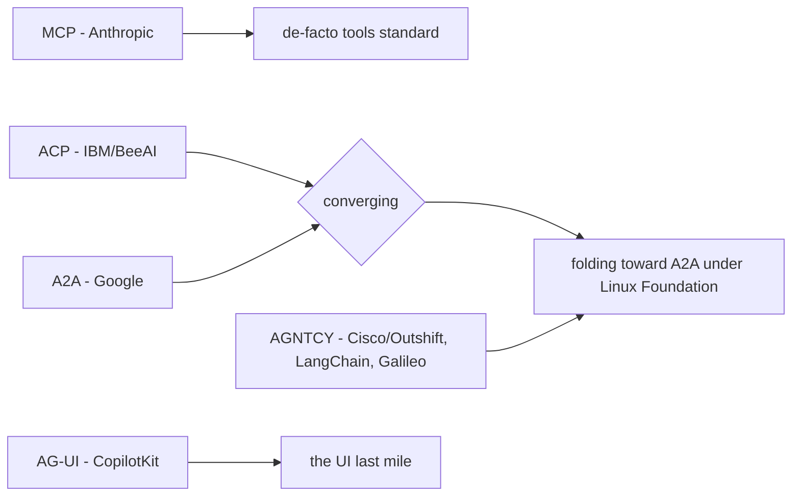
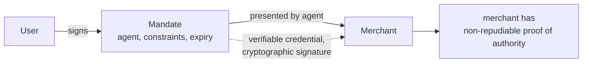
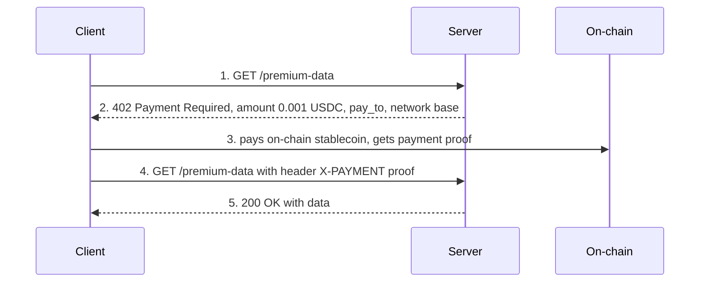

# Lecture 20: The Protocol Landscape — ACP, AGNTCY, AG-UI & Agentic Payments

> By now you can build a real MCP server and expose an agent over A2A. But if you open a tech-news tab in 2025–2026 you'll drown in acronyms: ACP, AGNTCY, ACP-again (different ACP), AG-UI, AP2, x402. It feels like you must learn six new stacks before shipping anything. You don't. This lecture is a **map**, not a build guide. Its job is to let you place every one of these specs on a small grid — what layer it lives at, who backs it, what problem it actually solves — so you can read a vendor announcement and instantly judge "do I care?" without opening a tutorial. After it you'll be able to explain why the "protocol soup" exists at all, defend the claim that **MCP + A2A + AG-UI covers ~90% of real needs**, and reason about the one genuinely hard problem the payment protocols expose: *who authorized this spend?*

**Prerequisites:** Lecture 15 (MCP), Lecture 16–19 (A2A, agent identity/OAuth) or the Week-4 spine · **Reading time:** ~26 min · **Part of:** AI Agents & Agentic Systems, Week 4

## The core idea (plain language)

Three questions describe almost everything an agent needs to talk to:

1. **How does an agent reach a tool or a piece of context?** → **MCP** (vertical: agent ↔ tools/resources).
2. **How does an agent reach another agent as a peer?** → **A2A** (horizontal: agent ↔ agent).
3. **How does a running agent stream its steps to a human's screen?** → **AG-UI** (the "last mile": agent ↔ frontend).

Those three axes are orthogonal, and together they cover the common shapes of production agent systems. Everything else in the soup is either (a) a **competing answer to a question one of those three already answers well** (ACP and AGNTCY's Agent Connect Protocol are both "how do agents talk to each other" — the same lane as A2A), or (b) a **new question layered on top** — specifically *payments*: once an agent can act autonomously, it can spend money, and now you need a way to prove the human actually said yes. That's AP2 and x402.

So the map has two zones. The **interop zone** (ACP, AGNTCY, AG-UI) is about *connectivity*, and it is consolidating fast under the Linux Foundation. The **payments zone** (AP2, x402) is about *authority to spend*, and it is genuinely new and unsettled. Treat the first zone as "know the names, use the winners." Treat the second as "understand the hard problem, watch the space."

## How it actually works (mechanism, from first principles)

### Why there is a soup at all

Standards usually lag the thing they standardize by years. With agents, the technology moved in *months*. Native tool calling became reliable in late 2024; by early 2025 every major lab and cloud vendor wanted to own the "how agents connect" layer, because owning a protocol means owning the ecosystem that forms around it (think of how HTTP shaped the web, or USB shaped peripherals). So in 2024–2025 you got a land-grab:



Two forces are now collapsing this. First, **the Linux Foundation** became the neutral home: A2A was donated to it in mid-2025, and MCP-adjacent governance is moving the same way. Neutral governance is what lets a competitor adopt your spec without feeling like they're paying rent to you. Second, **developer gravity**: engineers standardize on whatever has the most working integrations, and MCP (tools) plus A2A (agent peers) accumulated that gravity first. The practical result is that the *alternatives* to A2A are largely converging toward it rather than fragmenting further.

### ACP — Agent Communication Protocol (IBM / BeeAI)

ACP is a **RESTful agent-to-agent protocol**. Where A2A leans on JSON-RPC over HTTP with SSE streaming, ACP was designed around plain REST conventions and an agent-manifest for discovery — same *goal* as A2A (let one agent invoke another it didn't import), different surface. It came out of IBM Research and the **BeeAI** project.

The engineering point: **ACP and A2A occupy the same lane.** You do not need both. And the industry has effectively decided the tiebreak — ACP is **largely converging with / folding toward A2A under the Linux Foundation**. So the correct mental slot for ACP is "an A2A-like protocol that is merging into A2A." If you inherit an ACP integration, you keep it; you would not start a greenfield project on it in 2026.

> Naming landmine: there are **two different "ACP"s**. IBM/BeeAI's *Agent Communication Protocol*, and AGNTCY's *Agent Connect Protocol* (below). Same three letters, different specs, different sponsors. When you see "ACP" in the wild, check the source before you reason about it.

### AGNTCY — the "Internet of Agents"

AGNTCY is an **initiative**, not a single protocol — backed by **Cisco/Outshift, LangChain, and Galileo**, framed as building an open "Internet of Agents." It contributes two pieces worth knowing:

- **Agent Connect Protocol (ACP)** — a spec for *invoking* a remote agent (again: same lane as A2A).
- **Agent Directory** — the part that's genuinely distinctive. It's a **discovery layer at scale**: a registry where agents publish structured descriptions using the **OASF schema** (Open Agent Schema Framework), so a system can *search* for "an agent that can do X" across many providers, rather than knowing a specific URL up front.

Contrast this with A2A's discovery model. A2A gives you an **Agent Card** at a well-known URL — that's discovery of *one agent you already have a pointer to*. AGNTCY's Agent Directory aims at discovery of *agents you've never heard of*, the way DNS + search engines let you find websites you didn't have bookmarked. That "directory / marketplace at scale" ambition is the real idea to file away; the invocation protocol is again converging with A2A.

### AG-UI — the missing last mile

Here is the one in this lecture that is **not** redundant. AG-UI (**Agent-User Interaction Protocol**, led by **CopilotKit**) solves a problem MCP and A2A structurally do *not* touch: getting a running agent's internal steps onto a **frontend** in real time.

Think about what your Week-1 agent produces internally: a stream of "I'm thinking… calling tool `search` with these args… tool returned this… updating my plan… here's a partial answer." MCP defines how the tool call is *made*; A2A defines how a *peer* agent is invoked. Neither defines how you *pipe that live narration to a browser* so a user watches the agent work. Every chat UI that shows "🔧 Searching the web…" then streams tokens then shows a result card is solving this — and before AG-UI, everyone solved it with a bespoke WebSocket/SSE format.

AG-UI standardizes that as a **typed event stream**. The event types are the vocabulary you should recognize:

```
TEXT_MESSAGE_START / TEXT_MESSAGE_CONTENT (deltas) / TEXT_MESSAGE_END
TOOL_CALL_START / TOOL_CALL_ARGS / TOOL_CALL_RESULT
STATE_SNAPSHOT   (full agent state)      STATE_DELTA (a patch, e.g. JSON-Patch)
RUN_STARTED / STEP_STARTED / STEP_FINISHED / RUN_FINISHED / RUN_ERROR
```

Two design choices matter. **Text arrives as deltas** so the UI can render token-by-token (the streaming feel). **State arrives as a snapshot followed by patches** — send the full state once, then send small diffs — which is exactly how you keep a UI in sync cheaply without re-sending everything each tick. If you've used Redux, JSON-Patch, or React state, this is the same pattern applied to an agent's live state.

The engineer's placement: **MCP for tools, A2A for agent peers, AG-UI for the UI stream.** Those three axes are complementary, not competing, and together they are ~90% of what you actually wire in production. The rest is ecosystem awareness.

### The map, on one grid

```
                 CONNECTS…            PRIMARY SPEC        STATUS (2026)
MCP              agent → tools        (Anthropic)         de-facto standard
A2A              agent → agent        (Google/LF)         de-facto standard, absorbing rivals
AG-UI            agent → frontend     (CopilotKit)        the accepted "last mile"
─────────────────────────────────────────────────────────────────────────
ACP (IBM/BeeAI)  agent → agent        REST                folding into A2A
AGNTCY ACP       agent → agent        REST-ish            converging with A2A
AGNTCY Directory agent discovery      OASF schema         watch (discovery at scale)
─────────────────────────────────────────────────────────────────────────
AP2              agent → merchant     signed Mandates     emerging (payments)
x402             agent → paid API     HTTP 402            emerging (micropayments)
```

## Worked example

A concrete system makes the axes click. You're building a **travel-booking assistant** for a web app.

1. A user types "book me a hotel in Lisbon under €150/night for next weekend" into a chat box.
2. Your **orchestrator agent** needs live prices, so it calls a **peer "hotel-search agent"** run by a partner — that hop is **A2A**. It discovered the partner via its **Agent Card** (or, at internet scale, would have found it through an AGNTCY-style **Agent Directory**).
3. The hotel-search agent internally uses an **MCP** server (a `search_inventory` tool, a `pricing` resource) to do its job. **A2A on the outside, MCP on the inside** — the composition from Lecture 15/16.
4. Meanwhile, the whole time, the user's browser shows "🔎 searching Lisbon hotels… found 12… filtering by price…" streaming live. That narration is an **AG-UI** event stream: `TOOL_CALL_START(search)`, `STATE_DELTA(results: 12)`, `TEXT_MESSAGE_CONTENT` deltas for the summary.
5. The user picks a hotel and the agent needs to **pay €138**. Now MCP/A2A/AG-UI all go silent — none of them models "prove the user authorized €138 to this merchant." That's the payments zone.

Every acronym found its exact slot, and the one thing none of the connectivity protocols could do surfaced precisely at the money step.

### The payments zone: authorization is the whole problem

An autonomous agent that can spend money creates a question a human-in-the-loop checkout never had to ask out loud: **when the charge is disputed, how does the merchant prove the human actually authorized it?** The agent isn't the cardholder. "The AI decided to buy it" is not something a merchant can take to a chargeback dispute. Both emerging protocols are, at heart, *authorization-proof* mechanisms — they differ in style.

**AP2 — Agent Payments Protocol (Google-led).** AP2 is designed as an extension in the A2A/MCP family. Its core object is the **Mandate**: a **verifiable credential** (cryptographically signed) that proves the user authorized a purchase, with terms baked in (e.g., "up to €150/night, hotels in Lisbon, this weekend, this agent"). The agent presents the signed Mandate to the merchant, and the merchant gets **non-repudiable proof of authority** — a signature the user can't later plausibly deny. There are typically two flavors: a Mandate captured while the user is present ("buy this specific cart"), and a delegated Mandate for when the agent acts later without the user watching ("book something matching these constraints"). The mechanism to internalize: **signed intent, verifiable after the fact.** It answers "who approved this spend?" with math, not a log line.



**x402 — HTTP 402 revival (Coinbase).** x402 attacks a *different* payment shape: **per-call machine-to-machine micropayments** — an agent paying a few cents to call a metered API or tool, thousands of times, with no human in the loop at all. It revives the long-dormant **HTTP 402 Payment Required** status code. The flow is beautifully simple and HTTP-native:



The payment settles in **stablecoin** (so the amount is stable, unlike volatile crypto), and it's per-request, so it suits sub-cent charges that credit-card rails can't handle economically (card fees alone dwarf a $0.001 charge). x402's "authorization" is different in character: the client's *wallet* signs each payment, so authority is "whoever controls this key," and the hard question becomes **who funded and scoped that wallet, and with what limit?**

**The common hard problem.** Strip away the style and both protocols exist for one reason: **authorization — who approved this spend, and can you prove it?** AP2 answers with signed Mandates carrying user intent; x402 answers with wallet signatures per call. Neither has "solved" agent spending — the open, scary questions are the same ones you'd ask a junior employee with a company card: *what's the limit, what's it scoped to, when does the authority expire, and what's the audit trail?* This is the same **least-privilege, short-lived, scoped, auditable** discipline you learned for OAuth tokens in the identity lecture — now applied to money instead of API scopes.

## How it shows up in production

- **You will be pressured to adopt the new acronym.** A vendor blog or a teammate will say "we should support AGNTCY / ACP." The right first move is to ask *which axis does it sit on* — and if it's "agent → agent," the honest answer is usually "A2A already covers this, and this is converging toward A2A." Don't build a second connectivity stack on FOMO.
- **AG-UI is the one people forget until the demo looks dead.** Teams wire MCP and A2A, then discover the UI just spins with no feedback while a 20-second agent runs. Users abandon. Streaming the steps (via AG-UI's event vocabulary, or a compatible bespoke stream) is what makes an agent *feel* alive. Budget for it early — it's the difference between "looks broken" and "looks intelligent."
- **STATE_DELTA vs STATE_SNAPSHOT is a real cost lever.** If your agent's state is large (a big plan, a table of results) and you re-`SNAPSHOT` on every tick, you're shipping kilobytes per event over the wire. Patching (deltas) keeps the stream cheap. Same lesson as prompt-cache-friendly ordering: send stable stuff once, diff the rest.
- **Payments will not be your problem in most builds — until they suddenly are.** The moment a product manager says "let the agent just buy it," the authorization question becomes load-bearing and legal-adjacent (chargebacks, fraud, audit). Knowing AP2's Mandate concept lets you answer "how do we prove the user said yes?" without inventing a scheme from scratch.
- **The two-ACP confusion causes real miscommunication.** In a design doc, always disambiguate: "ACP (IBM Agent Communication)" vs "ACP (AGNTCY Agent Connect)." People have argued past each other for an hour over this.

## Common misconceptions & failure modes

- **"I need to learn all of these to be current."** No. You need to *place* them. The winners to actually build on are MCP, A2A, and AG-UI. The rest is reading comprehension.
- **"AGNTCY / ACP are alternatives I must evaluate against A2A."** They're largely *converging with* A2A, not competing long-term. Evaluate them as "A2A-compatible or A2A-bound," not as forks in the road.
- **"AG-UI is just SSE / WebSockets."** The transport may be SSE, but the *value* is the standardized **event vocabulary** (tool-call lifecycle, state snapshot/delta, run lifecycle). A raw socket gives you bytes; AG-UI gives you a contract a frontend library can render generically.
- **"x402 and AP2 do the same thing."** No — x402 is per-call M2M micropayments (agent pays an API), AP2 is agent-to-merchant purchases with proof of human authorization. Different payer, different amount scale, different authorization model.
- **"A signed Mandate / a funded wallet means spending is solved."** It proves *authorization existed*; it does not bound *how much*, *for how long*, or give you an *audit trail* by itself. Those are your responsibility — the same scoping discipline as OAuth. A Mandate with no expiry or no spend cap is the money equivalent of a god-token.
- **"HTTP 402 is a new invention."** It's been reserved in the HTTP spec for decades and largely unused; x402 *revives* it. Nice trivia, and a reminder these protocols reuse boring, proven plumbing rather than inventing wire formats.

## Rules of thumb / cheat sheet

- **Three questions → three protocols:** tools → **MCP**; agent peers → **A2A**; UI stream → **AG-UI**. Memorize this; it resolves most "which spec?" arguments.
- **Same-lane rule:** if a new protocol connects *agent → agent*, it's in A2A's lane → default to A2A; treat the newcomer as converging.
- **AGNTCY's keeper idea** is the **Agent Directory (OASF)** — discovery *at scale* — not its invocation protocol.
- **AG-UI events to know:** text deltas, `TOOL_CALL_*`, `STATE_SNAPSHOT` + `STATE_DELTA`, run/step lifecycle. Snapshot once, patch after.
- **Payments split:** **AP2** = signed **Mandates**, agent→merchant, proof of human authority (non-repudiable). **x402** = HTTP **402**, agent→API, per-call stablecoin micropayments.
- **The payments question that never goes away:** *who approved this spend, how much, for how long, and where's the audit trail?* Apply OAuth-style least privilege to money.
- **Adoption heuristic (approximate):** build on MCP/A2A/AG-UI today; keep an eye on AGNTCY's directory and AP2's Mandates; only touch x402 if you have a genuine sub-cent M2M metering need.

## Connect to the lab

Week 4's lab builds the real thing (MCP server + A2A agent + OAuth-scoped tool); this lecture's material is the *landscape* portion of that week. Do the **stretch goal**: emit your agent's tool-call start/args/result and a final state as an **AG-UI-style SSE stream** and render it live in a tiny HTML page — that makes the "last mile" concrete. Then, in your README's protocol-map section, place ACP, AGNTCY, AG-UI, AP2, and x402 in one sentence each; the Week-4 self-check question 5 (AP2 vs x402) is answered directly by the payments section above.

## Going deeper (optional)

- **AG-UI** — the CopilotKit-led docs and repo (search: `AG-UI protocol CopilotKit`, `ag-ui-protocol github`). The event-type list is the thing to read.
- **A2A** — `a2a-protocol.org` and the `a2aproject/A2A` repo; read the "A2A and MCP" page for the composition story, and follow the Linux Foundation donation announcement (search: `A2A Linux Foundation`).
- **ACP / BeeAI** — search `IBM BeeAI Agent Communication Protocol` and note the convergence-with-A2A discussion.
- **AGNTCY** — search `AGNTCY Internet of Agents`, `AGNTCY Agent Directory OASF`, `Outshift AGNTCY`.
- **AP2** — search `Agent Payments Protocol AP2 Google`; look specifically for how **Mandates** map onto **verifiable credentials**.
- **x402** — search `x402 Coinbase`, `HTTP 402 x402 spec`; read the request→402→pay→retry flow in the reference README.
- **Authorization background** — revisit OAuth 2.1 / RFC 8693 token exchange from the identity lecture; the "scoped, short-lived, auditable" framing is exactly what payments need.

> Do not trust any single benchmark or "protocol X won" claim from a vendor blog — this space is moving and most such posts are positioning. Cross-check against the Linux Foundation governance status and the number of real, independent integrations.

## Check yourself

1. State the three orthogonal questions that MCP, A2A, and AG-UI each answer, and why they don't compete.
2. Why is AG-UI *not* redundant with MCP and A2A — what does it do that neither can?
3. There are two "ACP"s. Name both, their sponsors, and which lane each sits in. Why does the lane matter for your build decision?
4. What is AGNTCY's most distinctive contribution, and how does it differ from A2A's Agent Card discovery?
5. AP2 vs x402: which uses signed Mandates for merchant purchases, which revives HTTP 402 for per-call micropayments, and what single hard problem do both exist to address?
6. A PM says "just let the agent buy things." Using the AP2 Mandate idea and OAuth-style discipline, what four properties must the spending authority have?

### Answer key

1. **Tools** (agent → tools/resources = MCP), **agent peers** (agent → agent = A2A), and **the UI stream** (agent → frontend = AG-UI). They're on orthogonal axes — a single system commonly uses all three at once (A2A on the outside, MCP on the inside, AG-UI to the browser), so they complement rather than compete.
2. AG-UI streams a *running* agent's internal steps — text deltas, tool-call lifecycle, state snapshots/patches, run lifecycle — to a **frontend**. MCP only defines how a tool call is *made*; A2A only defines how a *peer* agent is *invoked*. Neither pipes live narration to a UI, which is the "last mile" AG-UI fills.
3. **IBM/BeeAI's Agent Communication Protocol** (RESTful agent↔agent) and **AGNTCY's Agent Connect Protocol** (Cisco/Outshift, LangChain, Galileo; also agent↔agent). Both sit in the **agent → agent** lane — the same lane as A2A — which is why the build decision is "default to A2A; treat these as converging into it," not "evaluate as a fork."
4. The **Agent Directory** using the **OASF schema** — discovery *at scale*, finding agents you've never heard of (like search/DNS for agents). A2A's **Agent Card** is discovery of *one agent whose URL you already have*. Different scope: registry/marketplace vs. single-agent manifest.
5. **AP2** uses signed **Mandates** (verifiable credentials) for agent→merchant purchases with non-repudiable proof of human authority. **x402** revives **HTTP 402 Payment Required** for per-call agent→API stablecoin micropayments. Both exist to solve **authorization**: who approved this spend, and can you prove it?
6. Authority must be **scoped** (what it can buy / from whom), **bounded in amount** (a spend cap), **short-lived / expiring** (a valid-until), and **auditable** (a non-repudiable record — e.g., a signed Mandate). This is OAuth least-privilege applied to money; a Mandate with no cap or expiry is the money equivalent of a god-token.
