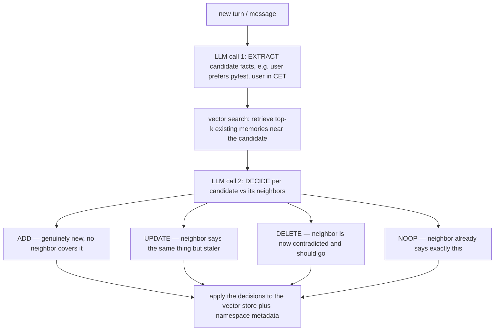

# Lecture 22: Long-Term Memory — The Write Path & Memory Systems

> Everyone building agent memory obsesses over retrieval — the embeddings, the vector index, the top-k. That's the easy half, and it's a solved problem you already built in Phase 4. The half where systems actually live or die is the *write path*: the opinionated, LLM-in-the-loop decision of **what to persist, what to skip, what to overwrite, and what to throw away**. Get it wrong and your beautiful vector search retrieves a store full of duplicates, stale contradictions, and yesterday's chit-chat — and every future turn gets worse, not better, the longer the agent runs. After this lecture you can design a disciplined write path (extract → dedup → conflict-resolve → namespace → TTL), reason about the ADD/UPDATE/DELETE/NOOP decision the way Mem0 does, explain when a temporal knowledge graph (Zep) or a memory-managing runtime (Letta) earns its complexity over a plain memory layer (Mem0), and write a namespaced `MemoryStore` wrapper that won't leak one user's memories into another's retrieval.

**Prerequisites:** RAG and vector search from Phase 4 (embeddings, cosine similarity, top-k); the agent loop (Lecture 1); short-term / working-memory budgeting (the preceding Week-5 material). · **Reading time:** ~28 min · **Part of:** AI Agents & Agentic Systems, Week 5

## The core idea (plain language)

Long-term memory is what survives a process restart. Short-term memory is the token budget you actively curate inside one run; long-term memory is the durable store — a vector DB, a graph, a table — that a *fresh* process in a *new* session reads back from. The read side is `search(query) → top-k`. Trivially easy. The write side is where all the engineering judgment lives, and it is fundamentally an **editorial** problem, not a storage problem.

Here is the trap. The naive design is: after every turn, embed the message and `insert` it. This *feels* like "the agent remembers everything." In practice it builds a landfill. Consider three consecutive user messages: "I live in Berlin," "actually I'm in the CET timezone," "btw I moved to New York last month." A dumb append stores all three as separate memories. Six months later the agent does `search("where does the user live")` and retrieves *all three*, ranked by cosine similarity, with no idea which is currently true. It confidently tells the user their meetings are in Berlin time. The store didn't get smarter as it grew — it got **noisier**.

The discipline that fixes this has four moves, and they happen **in order, on the write, before anything is persisted**:

1. **Extract** — decide *what* in this turn is worth remembering at all (durable facts, preferences, decisions, outcomes), and throw away the conversational packaging. This is itself an LLM call.
2. **Dedup** — retrieve near-neighbors of the candidate memory; if one is semantically equivalent, do nothing (NOOP). Don't store "prefers pytest" twice.
3. **Conflict-resolve** — if a near-neighbor *contradicts* the candidate ("was Berlin, now New York"), UPDATE or supersede the old one rather than appending a competitor.
4. **Namespace + TTL** — stamp every memory with a `user_id` (and often `agent_id`/`run_id`), and give ephemeral facts an expiry. A `search()` that forgets the namespace filter is a **cross-tenant data leak** — a security bug, not a missing feature.

That's the whole lecture in four bullets. The rest is mechanism and the three named systems that implement it with different tradeoffs.

## How it actually works (mechanism, from first principles)

### The write path is an LLM decision, not an `insert`

The single most important mental shift: **persisting a memory is a reasoning step, not a database call.** When Mem0's `add()` pipeline runs, it does roughly this:



Two LLM calls (extract, then decide) per write, plus one vector search. This is the cost you pay to keep the store clean — and it's *why* you don't run the write path on every message. You run it on turns that plausibly contain durable signal.

### What to persist (and what to aggressively drop)

Persist things whose truth outlives the conversation:

- **Durable facts about the user/world:** "user is in the CET timezone," "prod DB is Postgres 15 on port 5433," "company fiscal year ends in March."
- **Preferences:** "prefers pytest over unittest," "wants terse answers," "uses `uv`, not `pip`."
- **Decisions:** "we chose Qdrant over pgvector for the vector store."
- **Task outcomes:** "the Q3 migration completed successfully on 2026-06-14."

Do **not** persist: greetings, acknowledgements, the model's own thinking-out-loud, transient scratch state ("let me check that…"), or anything already trivially re-derivable. A good rule: *if re-reading it in three months would change how the agent behaves, keep it; otherwise drop it.*

### Dedup: the semantic-equivalence check

Before writing "user prefers pytest," you embed it and search the user's existing memories. Suppose the nearest hit is "user likes to use pytest for testing" at cosine similarity **0.94**. Above your dedup threshold (say 0.90) *and* judged equivalent by the decision LLM → **NOOP**. You just avoided a duplicate. Without this, a chatty user who mentions pytest five times gets five near-identical memories, all of which surface together on retrieval, all of which cost tokens to stuff into context, none of which add information.

The threshold is a real knob. Too low (0.75) and you NOOP things that were actually distinct ("prefers pytest" vs "prefers pytest-asyncio for async tests"). Too high (0.98) and near-duplicates slip through. Approximate starting point: **~0.90–0.92 cosine** for "probably the same fact," then let the decision LLM make the final call on the borderline cases. Treat these numbers as tuning defaults, not laws.

### Conflict resolution: the part that separates toys from systems

Dedup handles *agreement*. Conflict resolution handles *disagreement*, and it's harder because you must not simply keep both. When the candidate "user moved to New York (EST)" retrieves the neighbor "user is in Berlin (CET)" at high similarity but with **opposite content**, appending is the worst option — now retrieval returns two contradictory facts and downstream reasoning is a coin flip.

Two philosophies:

- **Supersede-in-place (Mem0's default posture):** UPDATE the old memory to the new value, or DELETE the stale one and ADD the new. The store holds *current truth only*. Simple, cheap, and correct for "the user's current timezone." The cost: you've **destroyed history** — you can no longer answer "where did they live before?"
- **Bi-temporal validity (Zep / Graphiti):** never destroy; instead stamp each fact with `valid_from` and `valid_to`. "Berlin" gets `valid_to = 2026-06-01`; "New York" gets `valid_from = 2026-06-01, valid_to = null`. Now "current truth" is a query (`valid_to IS NULL`) *and* history is preserved (`what was true on 2026-03-01?`). The cost: a graph store and more moving parts.

"Bi-temporal" means two independent time axes: *event time* (when the fact became true in the world) and *ingestion/transaction time* (when your system learned it). They differ constantly — a user tells you on July 9th that they moved "last month," so the fact is valid from June but was recorded in July. Systems that collapse these two get "as of when did we know?" audit questions wrong.

### Namespacing: the security-critical part everyone under-rates

Every memory MUST carry a namespace — minimally `user_id`, often also `agent_id` (which agent owns this) and `run_id` (which session). The namespace is not organizational tidiness; it is a **tenancy boundary**. Consider:

```python
# CATASTROPHIC: no namespace filter
results = memory.search("what are the user's payment details")
# returns near-neighbors across EVERY user in the collection

# CORRECT: namespace-scoped
results = memory.search("payment details", user_id="alice")
# vector search is filtered to alice's memories only
```

The first form is a cross-tenant leak: Alice's query pulls back Bob's stored card hint because it happened to be semantically close. In a multi-tenant product this is a reportable data breach, not a bug ticket. The fix is boring and absolute: **the namespace filter is mandatory on every read, and it should be structurally impossible to call `search` without one** (that's exactly what the wrapper below enforces).

### TTL: not everything deserves to be immortal

Some memories are durable ("user's name"); some are ephemeral ("user is currently debugging a flaky test in `billing/`"). Ephemeral facts get a **TTL** — an `expires_at` timestamp in metadata — and are filtered out (or swept) after they lapse. Reality check for the lab default: **Mem0 has no native TTL sweeper.** You store `expires_at` in metadata, filter on read, and run a cron/job that deletes lapsed IDs. Skipping TTL is how a store slowly fills with "was debugging X" notes from six months ago that now pollute every retrieval.

## Worked example

Let's run one user through the write path with numbers, so the ADD/UPDATE/NOOP machinery is concrete. User is `alice`. The store starts empty.

**Turn 1** — Alice: *"Hey! I'm in Berlin, and I really prefer pytest over unittest."*

- Extract → 2 candidates: `["alice is in Berlin (CET)", "alice prefers pytest over unittest"]`.
- Dedup search for each → store is empty, no neighbors.
- Decision → **ADD** both. Store now has 2 memories, each tagged `user_id=alice, source=user, trust=user`.

**Turn 2** — Alice: *"btw pytest is my go-to test runner."*

- Extract → 1 candidate: `"alice uses pytest as her test runner"`.
- Dedup search → nearest is `"alice prefers pytest over unittest"` at cosine **0.93**.
- Decision LLM: semantically equivalent, no new info → **NOOP**. Store still has 2 memories. *A naive append would now have 3, with two saying the same thing.*

**Turn 3** — Alice: *"Thanks!"*

- Extract → **nothing durable**. No candidate produced. Zero writes. (This is the "don't persist chit-chat" filter doing its job — and note we still paid ~1 LLM call to decide there was nothing to keep.)

**Turn 4 (three weeks later, fresh process)** — Alice: *"Update: I moved to New York, so I'm on Eastern time now."*

- Extract → 1 candidate: `"alice is in New York (EST)"`.
- Dedup search → nearest is `"alice is in Berlin (CET)"` at cosine **0.88** (locations are semantically close) — but the *content contradicts*.
- Decision LLM: contradiction detected → **UPDATE** (supersede). Under Mem0's default, the Berlin memory is replaced by the New York one. Store still has 2 memories, now current. Under a Zep-style store, Berlin gets `valid_to=today` and New York is added with `valid_from=today` — history preserved, current-truth still queryable.

**The payoff.** After 4 turns a naive append store holds ~4–5 memories including a duplicate and a contradiction. The disciplined write path holds exactly **2 correct, current memories**. Now query from a brand-new session:

```
search("what timezone is alice in?", user_id="alice")  → "alice is in New York (EST)"   ✓
search("which test runner does alice use?", user_id="alice") → "prefers pytest"          ✓
```

Clean retrieval, because the write path did the editorial work up front. That's the entire thesis: **you pay reasoning cost on write so that read stays cheap and correct.**

## How it shows up in production

**The write path is a latency and cost tax you must budget for.** Every persist is ~2 LLM calls + 1 vector search. If you naively run it on all 40 turns of a conversation, that's ~80 extra LLM calls — often more than the *actual task*. Real systems (a) only trigger the write path on turns likely to contain durable info, (b) batch extraction over several turns, and (c) frequently use a *cheaper/faster model for extraction* (a Haiku-class or `gpt-4o-mini`-class model) than for the main agent, because extraction is a narrow, well-specified task. Approximate rule: extraction on a small model runs in a few hundred ms and costs a fraction of a cent; that's the number to optimize.

**Retrieval quality degrades silently as the store grows dirty.** The insidious thing about a landfill store is there's no error — `search` still returns top-k, still looks fine in a demo. What you observe in production is a slow rot: answers that cite stale facts, contradictory recall between sessions, and top-k results increasingly clogged with duplicates so the *one* relevant memory gets crowded out of the window. The fix is upstream (write discipline), but teams often misdiagnose it as "we need a better embedding model" and burn weeks tuning the read side.

**Namespace bugs are among the worst incidents you can ship.** A missing `user_id` filter doesn't throw — it returns *plausible* results from the wrong tenant. It passes tests written with a single user. It surfaces when a real second customer's data appears in someone else's session. Enforce the namespace at the wrapper boundary so it cannot be forgotten, and write an explicit test that memories written under `user=alice` are **never** returned for `user=bob`.

**"Current truth vs history" is a genuine product fork.** If your product only ever needs "what's true now" (most assistants), supersede-in-place (Mem0) is simpler and cheaper — don't pay for a graph you won't query. If you need "what was true when," or auditability, or reasoning over how facts changed (compliance, longitudinal health/finance context, "why did the agent think X last month?"), that's when Zep's bi-temporal graph earns its operational weight. Choosing the graph *before* you have a temporal query is over-engineering; discovering you need history *after* you've been destroying it is worse.

## Common misconceptions & failure modes

- **"Memory = a vector database."** The vector DB is the storage substrate. Memory is the *write policy* on top of it. Two systems on identical Qdrant instances can behave completely differently depending on their extract/dedup/conflict logic.
- **"Store everything; retrieval will sort it out."** Retrieval is similarity ranking, not truth arbitration. It cannot tell the current fact from the stale one — they're both "relevant." Garbage in, top-k garbage out.
- **"Append is fine, newer memories will just rank higher."** Cosine similarity has no notion of recency. A stale Berlin memory and a fresh New York memory both match "where does alice live," and nothing in vanilla vector search prefers the new one. You need explicit conflict resolution or temporal metadata.
- **"Dedup by exact string match."** Users never repeat facts verbatim. "prefers pytest" and "pytest is my go-to" are the same fact with 0% string overlap and 93% semantic overlap. Dedup must be semantic (embedding + decision LLM), not string-based.
- **"The namespace filter is a nice-to-have."** It's a security control. An unfiltered `search` in a multi-tenant system is a cross-tenant data leak. Full stop.
- **"TTL is automatic."** In Mem0 it is not — no native sweep. If you don't store `expires_at` and filter/delete yourself, "ephemeral" memories are immortal.
- **"Mem0 vs Zep vs Letta — pick the most powerful one."** They solve different problems. Mem0 is a *library* (a memory layer over your vector store). Zep is a *service* (temporal knowledge graph). Letta is an *agent runtime* (memory management is the whole product). Reaching for Letta when you need a memory layer is like adopting Kubernetes to run one script.

## Rules of thumb / cheat sheet

- **Read is easy; the write path is the product.** Spend your engineering there: extract → dedup → conflict-resolve → namespace → TTL.
- **Persist durable facts, preferences, decisions, outcomes — not messages.** Test: "would re-reading this in 3 months change the agent's behavior?" If no, drop it.
- **Extraction is an LLM call — use a cheaper/faster model for it** and only trigger it on turns likely to hold durable signal.
- **Dedup semantically at ~0.90–0.92 cosine, then let the decision LLM confirm.** NOOP equivalents; never store the same fact twice.
- **On contradiction, UPDATE/supersede — never append.** Choose supersede-in-place (Mem0) for current-truth-only; choose bi-temporal `valid_from`/`valid_to` (Zep) only when you'll actually query history.
- **`user_id` on every write; namespace filter on every read — make it structurally impossible to omit.** This is a tenancy/security boundary.
- **Ephemeral memories get a TTL.** Mem0 has no native sweep — store `expires_at`, filter on read, cron-delete lapsed IDs.
- **System defaults:** *Mem0 + Qdrant* for "just give me a memory layer" (the lab default). *Zep* when you need "true now vs was true." *Letta* when self-editing memory tiers *are* the product.

## Connect to the lab

This lecture is the theory spine for Week 5's Step 2 (`06-agents.md`): you stand up **Mem0 on Qdrant** and build the namespaced `MemoryStore` wrapper — `remember()` runs the write path (with the poisoning guard from the next lecture wired in) and `recall()` enforces the `user_id` filter and excludes quarantined entries. The acceptance test is cross-session recall: teach a fact in *session A*, kill the process, and recall it from a fresh process in *session B* (Step 5). Below is the shape of that wrapper — namespaced, metadata-stamped, and letting Mem0's `add()` do the ADD/UPDATE/NOOP work internally:

```python
class MemoryStore:
    def __init__(self): self.m = make_memory()  # Mem0 over Qdrant

    def remember(self, text, user_id, source="user", trust="user", ttl_days=None):
        meta = {"source": source, "trust": trust}
        if ttl_days:  # Mem0 has no native TTL — we filter/sweep on this
            meta["expires_at"] = time.time() + ttl_days * 86400
        # user_id is MANDATORY; Mem0 does dedup/UPDATE/NOOP against alice's memories
        return self.m.add(text, user_id=user_id, metadata=meta)

    def recall(self, query, user_id, k=5):
        hits = self.m.search(query, user_id=user_id, limit=k)["results"]  # namespace enforced
        now = time.time()
        return [h for h in hits
                if (exp := h.get("metadata", {}).get("expires_at")) is None or exp > now]
```

## Going deeper (optional)

- **Mem0 — docs + repo.** Docs root: `docs.mem0.ai`; repo `mem0ai/mem0`. Read the **Quickstart** and the **"How Mem0 works"** / add-pipeline pages to see the ADD/UPDATE/DELETE/NOOP decision in the maintainers' own framing. Search: `Mem0 add memory pipeline`.
- **Zep + Graphiti — temporal knowledge graph.** Docs root: `help.getzep.com`; repos `getzep/zep` and `getzep/graphiti`. Focus on the **bi-temporal** model (`valid_from`/`valid_to`, event vs transaction time). Search: `Zep Graphiti temporal knowledge graph bi-temporal`.
- **Letta (ex-MemGPT) — memory-managing agent runtime.** Repo `letta-ai/letta`; the original **MemGPT paper** is the canonical read on core/archival memory tiers and self-editing memory via tools. Search: `MemGPT paper memory tiers` and `Letta core archival memory`.
- **Qdrant — the lab's vector store.** Docs root: `qdrant.tech/documentation`. Read payload filtering (this is the mechanism that makes namespace-scoped `search` fast and correct).
- **Currency queries (2025–2026):** `Mem0 vs Zep vs Letta comparison`, `agent long-term memory write path dedup`, `bi-temporal fact validity knowledge graph agents`.

## Check yourself

1. Why is the *read* side of long-term memory "easy" and the *write* side the hard, opinionated part? What specifically goes wrong if you just `insert` every message?
2. Name the four steps of the write path in order, and say which of them require an LLM call.
3. A candidate memory "user is in New York" retrieves an existing "user is in Berlin" at cosine 0.88. What's the *wrong* thing to do, and what are the two legitimate strategies — with the tradeoff each makes?
4. What does "bi-temporal" mean, and give a concrete question that a supersede-in-place store (Mem0) *cannot* answer but a Zep-style store can.
5. Why is a `search()` call that omits the `user_id` filter a security bug rather than just a correctness bug? How does the `MemoryStore` wrapper prevent it?
6. Match each to its right job: Mem0, Zep, Letta. When would reaching for Letta be over-engineering?

### Answer key

1. Reading is just embedding-similarity `search → top-k`, which you already built in Phase 4. Writing requires *editorial judgment* — deciding what's durable, whether it duplicates or contradicts existing memories, how to namespace it. Blindly inserting every message builds a landfill of duplicates, contradictions, and chit-chat; since similarity search ranks by relevance (not truth or recency), stale and duplicate facts crowd the top-k and retrieval quality *degrades* as the store grows.
2. **Extract** (LLM call — pull durable facts, drop packaging) → **Dedup** (vector search for near-neighbors) → **Conflict-resolve** (LLM call — decide ADD/UPDATE/DELETE/NOOP vs neighbors) → **Namespace + TTL** (stamp `user_id`/metadata, set `expires_at`). Extract and the resolve/decide step are LLM calls; dedup is a vector search.
3. **Wrong:** append it, leaving two contradictory memories that both match future "where does the user live" queries. **Strategy A — supersede-in-place** (Mem0): UPDATE/replace so the store holds current truth only; cheap and simple, but destroys history. **Strategy B — bi-temporal validity** (Zep): set the old fact's `valid_to` and add the new with `valid_from`; preserves history and keeps current-truth queryable, at the cost of a graph store and more complexity.
4. Bi-temporal = two independent time axes: *event time* (when the fact was true in the world) and *transaction/ingestion time* (when the system learned it). A supersede store overwrites Berlin with New York, so it cannot answer **"where did the user live before June / what was true on 2026-03-01?"** — that history is gone. A bi-temporal store answers it via `valid_from`/`valid_to`.
5. Because it doesn't error — it returns *plausible* near-neighbors from **every tenant**, so one user's query can retrieve another user's stored data (a cross-tenant leak, i.e. a data breach in a multi-tenant product). The wrapper prevents it by requiring `user_id` as a parameter on `recall()` and always passing it to `search`, making an unscoped query structurally impossible to issue through the API.
6. **Mem0** = library-first memory *layer* over your own vector store (best default for "just give me memory"). **Zep** = *service* with a temporal knowledge graph (reach for it when you need "true now vs was true"). **Letta** = *agent runtime* where self-editing core/archival memory tiers *are* the product. Reaching for Letta is over-engineering when you only need a memory layer bolted onto an agent you already control — you'd be adopting a whole runtime to get what a library provides.
