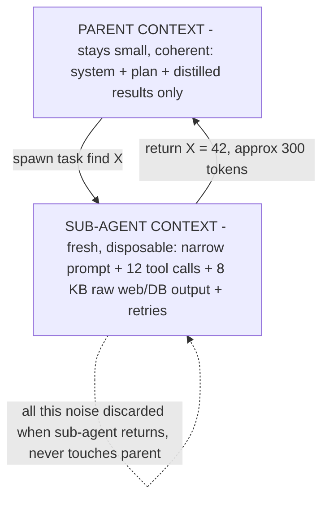

# Lecture 24: Context Engineering for Long-Horizon Agents

> A single model call is a sprint; a long-horizon agent is a marathon it runs while carrying every step it has already taken on its back. By step 40 the transcript is a landfill of tool outputs, half-finished reasoning, and stale observations — and every new turn re-reads all of it, paying for it in tokens and losing the plot in the noise. This lecture is about two of the highest-leverage moves for keeping a long run both coherent and affordable: **sub-agent context isolation** (spawn a clean, narrow context, return only the distilled result) and **tool-RAG** (retrieve the handful of relevant tool schemas per step instead of stuffing hundreds into the prompt). After it you will be able to reason quantitatively about *why* context is a scarce, adversarial resource, decide when isolation helps versus when it fragments your agent into contradiction, and build a per-step tool retriever that keeps selection accuracy high while your tool count grows into the hundreds.

**Prerequisites:** the agent loop (Week 1); sub-agent/A2A delegation across process boundaries (Week 4); RAG — embeddings, top-k retrieval, an ANN index (Phase 4). · **Reading time:** ~28 min · **Part of:** AI Agents & Agentic Systems, Week 5

## The core idea (plain language)

Two facts about transformers set up everything here. First, **cost and latency scale with the number of tokens in context**, and for the growing-transcript pattern of an agent loop the total tokens processed across a run grow *roughly quadratically* with the number of steps — every step re-reads the whole history. Second, **quality degrades as context grows**: models lose track of instructions buried in the middle of a long prompt ("lost in the middle"), and more candidate tokens means more surface for the model to get distracted, confused, or injected. Context is not free storage. It is a scarce, expensive, and adversarial resource that you must actively curate.

Two techniques attack this directly:

- **Sub-agent context isolation.** Instead of doing everything in one ballooning context, spin up a sub-agent with a *fresh, narrow* context scoped to one subtask. It burns through its own tool chatter, dead ends, and raw observations in its own private window — and hands the parent back only a short distilled result. The parent's context never accumulates the sub-agent's noise. This is the single biggest lever for keeping long runs coherent (Anthropic's multi-agent research write-up leans on exactly this).

- **Tool-RAG (tool retrieval).** When you have hundreds of tools, do *not* paste all their JSON schemas into the prompt. That blows the token budget and — counterintuitively — makes the model *worse* at picking the right tool, because it's choosing from a wall of near-duplicates. Instead, embed every tool's description into a vector index once, and at each step embed the *current intent*, retrieve the top-k most relevant tools, and offer the model only those. It's the RAG you already built in Phase 4, pointed at tool definitions instead of documents.

The catch, and the reason this lecture is not a sales pitch: isolation is a benefit **and** a risk. Cognition's "Don't Build Multi-Agents" is the essential counter-read. The moment you fragment context, sub-agents start making decisions with *incomplete information* and produce work that contradicts each other — because the shared understanding that lived in one context is now split across several that can't see each other. So the real skill is knowing *when* the isolation win outweighs the fragmentation cost.

## How it actually works (mechanism, from first principles)

### Why the transcript is a cost bomb

Take the naive single-context ReAct loop from Week 1. At step *k*, the context is: system prompt + all tool schemas + turns 1..k. Suppose each step adds ~500 tokens of assistant reasoning + tool call, and ~1,500 tokens of tool output (a fetched page, a DB result). So context grows by ~2,000 tokens/step.

Input tokens *processed* over an N-step run, ignoring the fixed prefix:

```
step 1:  ~2,000 tokens read
step 2:  ~4,000
step 3:  ~6,000
...
step N:  ~2,000·N
total ≈ 2,000 · (1+2+...+N) = 2,000 · N(N+1)/2  →  O(N²)
```

For N=40 that's `2,000 · 40·41/2 = 1,640,000` input tokens processed across the run — for a task whose *useful* state might be 20 KB. At an input price of, say, $3/M tokens that's ~$4.90 just re-reading history, and the *last* call alone stuffs ~80K tokens into the window, well into the "lost in the middle" quality-degradation zone.

Isolation breaks the quadratic. If a sub-agent handles steps that would have added 30K tokens of chatter and returns a 400-token summary, the parent pays for 400 tokens forever after — not 30K re-read on every subsequent step.

### Sub-agent context isolation, mechanically



The mechanism is deliberately simple: the parent calls the sub-agent as if it were a tool. The sub-agent runs its *own* full agent loop in a *separate* message list, does the messy work, and the only thing that crosses the boundary back to the parent is a compact, structured result. The parent's context grows by the size of the *summary*, not the size of the *work*.

Note this is the same shape as Week 4's A2A / sub-agent delegation, just viewed through a context lens: **A2A is context isolation across a process boundary.** When you delegate to a peer agent over A2A, its internal reasoning and tool calls live in *its* process and *its* context; you get back a Task result. Whether the boundary is an in-process function call or an HTTP hop to another vendor's agent, the payoff is identical — the caller's context stays clean.

### Where isolation bites back (the Cognition counter-argument)

Cognition's argument is a direct consequence of the same mechanism. If context is what carries shared understanding, then splitting context splits understanding. Concretely:

- Sub-agent A researches "which database to use" and — reasonably, in its narrow context — picks Postgres. Sub-agent B, in *its* narrow context, is writing the deployment config and picks MySQL because nothing told it about A's decision. Each was locally correct; the whole is contradictory.
- The distillation step is lossy. If the sub-agent's summary drops the caveat "…but only under 10K rows," the parent acts on a fact stripped of the condition that made it true.

Their prescription: prefer a **single agent with the full context** unless you can name a specific isolation or parallelism win, and when you *do* split, make the interfaces carry enough shared state that decisions don't collide. In practice: pass down the relevant *decisions so far*, not just the subtask, and have sub-agents return their *reasoning and assumptions*, not just answers.

### Tool-RAG, mechanically

Every tool you offer costs tokens in *two* ways. First, its JSON schema sits in context on every call (name, description, parameter schema — easily 100–300 tokens each). Second, and worse, each extra tool is one more distractor the model must discriminate against when choosing. Anthropic and others have observed that selection accuracy *degrades* as the tool list grows and tools overlap — the model picks `search_web` when `search_internal_docs` was right because both descriptions blur together.

MCP makes this acute. In Week 4 you connected to MCP servers; the trouble is that **a handful of MCP servers can expose 100+ tools** (a GitHub server alone exposes dozens; add Slack, a filesystem server, a database server, and you're past 200). Naively registering them all means 100 × ~200 = ~20,000 tokens of tool schemas on *every single call*, plus a selection problem the model reliably fumbles.

Tool-RAG applies Phase 4 retrieval to tool definitions:

```
ONE-TIME INDEXING (at startup / when a server connects)
  for each tool t:
      doc_t = t.name + "\n" + t.description + "\n" + param_names(t.schema)
      vec_t = embed(doc_t)
      index.add(id=t.name, vector=vec_t, payload=t.schema)

PER STEP (inside the agent loop)
  intent   = current user goal + last observation (the "query")
  q        = embed(intent)
  top_k    = index.search(q, k=8)           # 8 tool schemas, not 200
  tools    = [payload(hit) for hit in top_k]
  response = model.call(messages, tools=tools)   # model only sees these 8
```

What gets embedded and indexed is the **tool description text** (name + description + parameter names — the human-readable signal), stored in your existing vector store (Qdrant, pgvector — same infra as Phase 4). The *payload* attached to each vector is the full JSON schema you'll hand the model if that tool is retrieved. You embed once at registration; you retrieve every step.

The token math: 200 tools × ~200 tokens = ~40,000 tokens of schemas per call → collapses to 8 × ~200 = ~1,600 tokens. That's a ~25x reduction on the tool-schema portion of every call, *and* the model chooses from 8 plausible candidates instead of 200, so selection accuracy goes *up*, not just cost down.

## Worked example

A "release assistant" agent connects to four MCP servers exposing **180 tools** total. The task: *"Cut a v2.3.0 release: check open P0 bugs, tag the commit, post to #eng."* That's ~3 tool calls of real work.

**Naive (all tools in context), 6-step run:**

- Tool schemas: 180 × ~200 = ~36,000 tokens, present on all 6 calls.
- History grows ~2,000 tokens/step.
- Input tokens processed ≈ Σ over 6 steps of (36,000 + growing history) ≈ 6×36,000 + 2,000·(1+..+6) ≈ 216,000 + 42,000 = **~258,000 input tokens.**
- Selection: on step 1 the model must pick `list_issues` out of 180; it picks `search_issues` (wrong server) on ~1 in 4 runs → a wasted step + a retry.

**Tool-RAG (top-8 per step):**

- Tool schemas per call: 8 × ~200 = ~1,600 tokens.
- Input tokens processed ≈ 6×1,600 + 42,000 ≈ **~52,000 input tokens** — roughly a 5x reduction overall (and far more on the schema portion).
- Selection: the retriever surfaces `list_issues`, `create_tag`, `post_message` near the top because their descriptions match "bugs / tag / post"; the model chooses from 8 relevant tools, wrong-tool rate drops sharply.

**Add sub-agent isolation** for the "check open P0 bugs" step: a sub-agent queries the tracker (say 10 tool calls, paginating through 8 KB of issue JSON), and returns `"3 open P0s: #412, #418, #431 — all have fixes merged."` (~40 tokens). The parent never ingests the 8 KB. Its context after the whole release stays under ~5 KB instead of ballooning past 50 KB.

The two techniques compose: tool-RAG shrinks *what each step costs*, isolation shrinks *what survives into the next step*.

## How it shows up in production

- **Cost that grows super-linearly with session length.** The bill for a chat that runs 5 turns vs 50 turns is not 10x — it's closer to 100x if you never compact or isolate. Finance notices. The fix is architectural (isolation/compaction), not a cheaper model.
- **The "it got dumber halfway through" bug.** A long-running agent starts ignoring the system prompt or the user's original constraint around turn 30. That's lost-in-the-middle: the instruction is now buried under 40K tokens of tool output. Isolation keeps the *parent's* context short enough that instructions stay salient.
- **Wrong-tool selection at scale.** You add a second MCP server and suddenly the agent starts calling the wrong tool intermittently. It's not a regression in the model — you crossed a tool-count threshold where the descriptions collide. Tool-RAG (or at minimum namespacing + pruning) is the fix.
- **Contradictory multi-agent output.** Two sub-agents produce incompatible artifacts (the Postgres/MySQL problem). This is the Cognition failure mode in the wild. It shows up as "the plan says X but the code does Y," and it's a *context-fragmentation* bug, not a model bug — no amount of prompt tuning on the individual agents fixes it; you have to reconnect their contexts.
- **Debugging is harder across isolation boundaries.** When the sub-agent returns only a summary, and the summary is wrong, you can't see *why* from the parent trace. You need per-sub-agent traces (Week 1's structured logging) or you're debugging blind. Budget for this.
- **Retriever staleness / index drift.** If an MCP server hot-swaps a tool (Week 4's "rug pull") and you don't re-index, tool-RAG retrieves a schema that no longer matches reality. Re-index on reconnect.

## Common misconceptions & failure modes

- **"More agents = smarter system."** No. More agents = more context fragmentation and ~15x the token cost of a single chat (Anthropic's own rough figure for parallel research). Multi-agent wins for *genuinely parallel, separable* work; it loses for anything needing shared judgment. Start single-agent.
- **"Isolation is free coherence."** Isolation buys coherence *in the parent* at the cost of coherence *across children*. If the children need to agree, isolation is actively harmful unless you thread shared decisions through the interface.
- **"Just use a bigger context window."** A 1M-token window doesn't repeal lost-in-the-middle, and it doesn't repeal the O(N²) cost — it just lets you fail more expensively. A big window is a safety margin, not a strategy.
- **"Tool-RAG is just a token optimization."** Its bigger payoff is often *accuracy*: fewer, more-relevant tools = better selection. Treat the accuracy win as primary.
- **"Top-1 tool retrieval is enough."** No — retrieve top-k (k≈5–12) so the model has room to pick correctly and to compose multi-tool steps. Top-1 makes a single retrieval miss fatal.
- **"Embed the tool once and forget it."** Tool descriptions drift, servers reconnect with new tools, and a badly-written description retrieves poorly. The description *is* the retrieval key — invest in writing it well and re-index on change.
- **"The summary the sub-agent returns is lossless."** It never is. Design what the summary must carry (assumptions, caveats, source IDs), or the parent acts on stripped-down facts.

## Rules of thumb / cheat sheet

*(Approximate, opinionated, tune to your workload.)*

- **Default to a single agent.** Add sub-agents only when you can name the specific win: (a) genuine parallelism, (b) context that would cross-contaminate, or (c) specialized tools/prompts that would bloat one agent.
- **Isolate the noisy work, not the decisions.** Sub-agents are for grinding (search, paginate, scrape); keep cross-cutting *decisions* in one context.
- **Make sub-agent results carry their assumptions.** Return "X because Y, assuming Z," not just "X."
- **Turn on tool-RAG past ~30–50 tools**, and *definitely* past ~100. Below that, all-tools-in-context is fine and simpler.
- **Retrieve top-k with k ≈ 5–12.** Include any always-needed tools (e.g. `finish`, `ask_user`) as a fixed floor on every step regardless of retrieval.
- **The query for tool-RAG = current intent**, i.e. the goal plus the *last observation* — not the raw first user message. Re-embed per step.
- **Embed name + description + parameter names.** Write descriptions for *retrieval*, not just for the model — they're now search keys.
- **Re-index tools on server (re)connect.** Stale schemas = wrong-tool bugs.
- **Budget for cross-boundary tracing.** One trace per sub-agent, linked to the parent step that spawned it.
- **Measure the token bill per session length.** If it grows super-linearly, you're missing isolation or compaction.

## Connect to the lab

This week's lab builds a supervisor + 2 specialists over a shared Mem0/Qdrant store. The specialists returning only distilled results to the supervisor's shared `scratch` state — never their raw tool chatter — *is* sub-agent context isolation in code; watch a token trace confirm the supervisor's context stays flat as specialists do heavy work. For tool-RAG, extend the lab: register your Week-4 MCP tools into the same Qdrant instance (embed name+description), and swap the fixed `tools=[...]` list in the agent node for a per-step top-k retrieval — then verify (via the trace) that wrong-tool selection drops as you scale past ~50 tools.

## Going deeper (optional)

Real, named resources — search the titles; I'm not fabricating deep links.

- Anthropic — **"Building a multi-agent research system"** (the isolation-wins case, with the ~15x token figure). Search: `Anthropic multi-agent research system`.
- Cognition — **"Don't Build Multi-Agents"** by Walden Yan (the essential counter-read on context fragmentation). Search: `Cognition Don't Build Multi-Agents`.
- Anthropic — **"Effective context engineering for AI agents"** (compaction, note-taking, sub-agents). Search that title.
- The **"Lost in the Middle"** paper (Liu et al.) on positional degradation in long contexts. Search: `Lost in the Middle long context`.
- **Toolformer** and **Gorilla / ToolLLM** for tool-selection-at-scale framing that motivates tool-RAG. Search those names.
- **Model Context Protocol** docs — how tools are listed/described, which is the raw material you index (root: `modelcontextprotocol.io`).
- Your Phase 4 RAG notes — tool-RAG is literally that pipeline; reuse the embedder and index.

## Check yourself

1. Why does the naive single-context agent loop cost grow ~O(N²) in the number of steps, and which of the two techniques in this lecture attacks that growth — how?
2. Give a one-sentence statement of the *benefit* of sub-agent context isolation and a one-sentence statement of the *risk*, per Anthropic vs Cognition respectively.
3. You have 200 tools across 4 MCP servers. Explain the *two distinct* problems with putting all their schemas in every call, and how tool-RAG addresses each.
4. In the per-step tool-RAG flow, what exactly do you embed at index time, what do you embed as the query at run time, and what is stored as the payload?
5. Why is "just use a 1M-token context window" not a substitute for either technique? Name the two things it fails to fix.
6. How is Week 4's A2A delegation a form of context isolation, and what has to cross the boundary for the parent to stay coherent?

### Answer key

1. Each step re-reads the entire growing transcript; summing 2,000·(1+2+…+N) is 2,000·N(N+1)/2 = O(N²) input tokens processed. **Sub-agent isolation** attacks it by keeping the parent's context small — noisy work happens in a disposable child context and only a compact summary survives, so the per-step base that gets re-read stays flat instead of growing.
2. **Benefit (Anthropic):** isolating a sub-agent's raw tool chatter in its own context keeps the parent coherent and cheap over long runs. **Risk (Cognition):** fragmenting context makes sub-agents decide with incomplete information, producing contradictory work.
3. (a) **Token cost** — 200 × ~200 = ~40K tokens of schemas on *every* call. (b) **Selection accuracy** — the model must discriminate the right tool among 200 overlapping descriptions and picks wrong more often. Tool-RAG retrieves the top-k (say 8) relevant tools per step, cutting schema tokens ~25x *and* shrinking the choice set to plausible candidates so accuracy rises.
4. **Index time:** embed each tool's `name + description + parameter names`. **Query time:** embed the current intent (goal + last observation). **Payload:** the tool's full JSON schema, returned and handed to the model when that tool is in the top-k.
5. It doesn't repeal **lost-in-the-middle** (buried instructions still get ignored) and it doesn't repeal the **O(N²) cost growth** — a bigger window just lets the same failures happen more expensively.
6. When you delegate to an A2A peer, its internal reasoning and tool calls live in *its* process and context; you receive only a Task result — context isolation across a process boundary. To stay coherent, the returned result must carry the peer's key **decisions, assumptions, and caveats**, not just a bare answer, so the parent doesn't act on facts stripped of the conditions that made them true.
