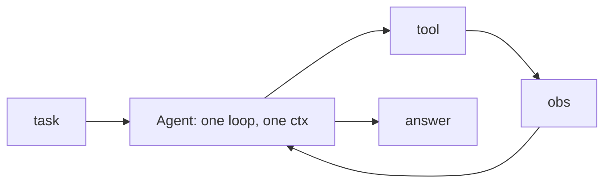
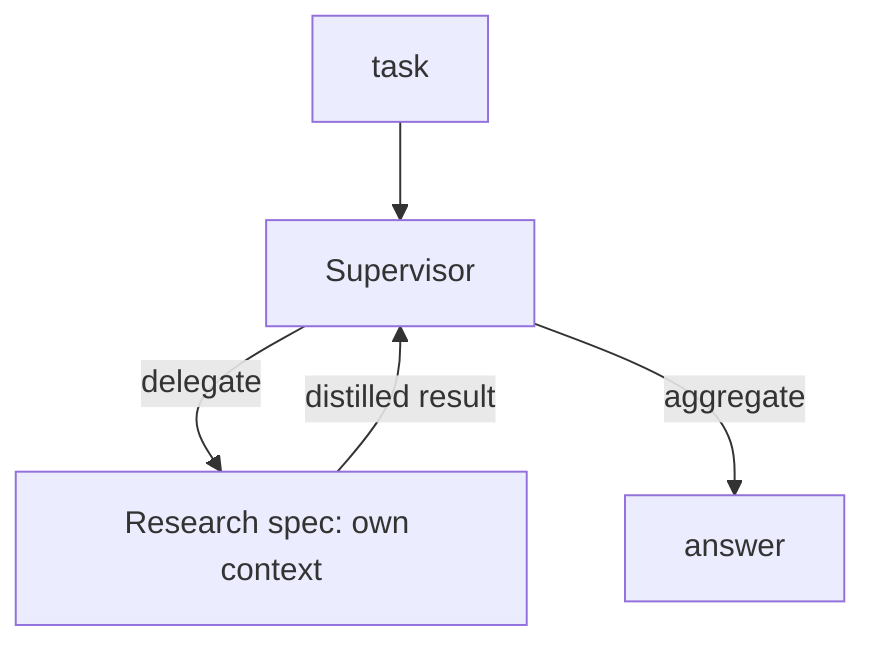
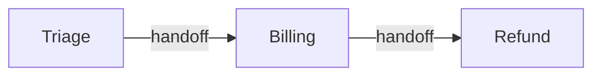

# Lecture 25: Multi-Agent Orchestration Topologies & When a Single Agent Wins

> Everyone who ships an agent eventually feels the pull to "add another agent" — a planner, a critic, a researcher, a writer. It *looks* like decomposition, the thing good engineers do. But most of the time it makes your system slower, pricier, and dramatically harder to debug, while quietly *degrading* answer quality. This lecture gives you the topology map (single / supervisor / hierarchical / swarm / group-chat), the real cost of each in tokens and latency, and a decisive rule for when a second agent actually earns its keep. After this you will be able to look at a task, name the topology it deserves, defend "single agent" against the reflex to fan out, and — when you *do* fan out — do it with numbers instead of vibes.

**Prerequisites:** Weeks 1–4 (the agent loop, control-flow patterns, LangGraph + durable execution, MCP/A2A). Comfort with token accounting and big-O intuition. · **Reading time:** ~28 min · **Part of:** AI Agents & Agentic Systems — Week 5

## The core idea (plain language)

An agent is a loop around a model that calls tools (Week 1). A *multi-agent system* is several such loops that talk to each other. The moment you have more than one loop, you have a new problem that has nothing to do with intelligence: **coordination**. Someone has to route work, someone has to pass context between loops, and someone has to merge the results back into one coherent answer.

Here is the uncomfortable truth that most tutorials bury: **coordination is almost always more expensive than the problem it claims to solve.** A single agent has *shared context by construction* — every fact it discovered on step 3 is trivially available on step 9, because it's all sitting in the same message list. The instant you split into two agents, that shared context becomes a thing you have to *serialize, transmit, and reconstruct* across an agent boundary — and every serialization is lossy. You are trading a free, perfect memory for a paid, imperfect one.

So the default is not "which multi-agent framework." The default is **one agent with good tools**, and you only leave that default when you can point at a *specific* structural win — parallelism, isolation, or specialization — that the single agent genuinely cannot capture. This lecture is mostly about learning to recognize those three wins so you stop paying for coordination you don't need.

## How it actually works (mechanism, from first principles)

### The five topologies

Think of topologies along one axis: **who owns control flow**, and how much context has to cross agent boundaries.

**1. Single agent with tools.** One loop. The model plans, calls tools, observes, and continues until done. Control flow lives in your `while` loop; the model decides *what* to do next each turn.



**2. Supervisor / orchestrator-worker.** A router agent receives the task, delegates sub-tasks to specialist workers, then aggregates their distilled results.



**3. Hierarchical.** Supervisors of supervisors. A top orchestrator delegates to mid-level supervisors, each of which owns a team of workers. Same mechanism as (2), recursed. Justified only for genuinely large task trees (think: "produce a 40-section compliance report," each section itself a research project).

**4. Swarm / handoffs.** Peers hand *control* to each other. Agent A decides "this is really a billing question" and hands the whole conversation to Agent B, who now owns the loop. There is no central router — control flow is emergent, decided locally by whichever agent currently holds the baton. This is the OpenAI Swarm / Agents SDK "handoff" model.



*Control moves; whoever holds it runs the loop.*

**5. Group chat.** N agents post to one shared transcript and take turns responding, like a Slack channel of bots (AutoGen / AG2). A "chat manager" picks who speaks next. Great for debate/brainstorm; the transcript is the shared state.

```
 ┌──────────── shared transcript ────────────┐
 │ Critic: "the plan ignores rate limits"     │
 │ Coder:  "adding backoff..."                │
 │ PM:     "ship it once tests pass"          │
 └────────────────────────────────────────────┘
   every agent reads the WHOLE transcript every turn
```

### Why coordination costs what it costs — the token arithmetic

The cost of a topology is dominated by **how many tokens cross agent boundaries and how many times.** Let's make this concrete.

Say a research task needs to consult 6 sources, and digesting each source produces ~2,000 tokens of notes. A single agent accumulates all of it in one growing context.

- **Single agent (serial ReAct):** the context grows as it works. By the last step it's carrying ~12,000 tokens of accumulated notes plus system prompt and tool defs (~2,000). Because the transcript is re-sent every turn, total *input* tokens over ~7 turns land roughly in the 40k–60k range. One model, one context, everything visible.

- **Group chat (4 agents, shared transcript):** every agent reads the *entire* transcript every turn. If the debate runs 12 turns and the transcript averages 8,000 tokens, that's `12 turns × 8,000 tokens ≈ 96,000` input tokens *just re-reading the transcript* — and that grows super-linearly as the transcript accumulates. This is why group chat token cost "explodes": every participant pays to re-read everyone else's every turn. This is also why it *loops* — with no owner of "are we done?", agents can politely agree to keep refining forever.

- **Supervisor + workers:** here the arithmetic can go *either* way, and that's the whole point. If the supervisor forwards the full task context to each worker AND each worker returns its full raw transcript, you pay for context twice (down to the worker, back up) plus the supervisor's own reasoning. But if workers run in **isolated context** and return only a *distilled* result (say 300 tokens instead of their 4,000-token working transcript), you can come out ahead — the supervisor's context stays small because it never sees the workers' noise.

The decisive quantity is the **distillation ratio**: raw work done inside a worker ÷ tokens returned to the parent. A worker that reads 8,000 tokens of sources and returns a 300-token summary has a ~27x ratio — that's a real isolation win. A worker that returns its whole transcript has a ratio near 1 — you paid for an extra agent and got nothing.

### Anthropic's ~15x number, and Cognition's counter

Two public, opposed positions frame this whole debate — know both.

**Anthropic (pro, in the right conditions):** their multi-agent research system runs a lead agent that spawns parallel sub-agents, each researching a facet of a query in its own context window, returning distilled findings. Their reported rule of thumb: this kind of system uses **roughly 15x the tokens of a plain chat interaction.** They justify it because research is *embarrassingly parallelizable* (sources are independent) and *context-hungry* (each source would bloat a single context), so the parallelism and isolation wins are real and worth the 15x. (Treat 15x as their reported approximation, not a law.)

**Cognition (skeptical, "Don't Build Multi-Agents"):** their argument is about *context fragmentation*. When you split a task across agents, each agent makes decisions with **incomplete information** — it can't see what the sibling agent decided. Two sub-agents asked to "build the UI" and "build the backend" will make silently incompatible assumptions (naming, data shapes, error contracts) because neither saw the other's choices. The result is work that *looks* done but doesn't compose. Their prescription: keep context unified — a single agent, or at most a strictly linear chain where full context flows forward.

These aren't contradictory. Anthropic's win case is **read-heavy, parallel, low-interdependence** (gathering facts). Cognition's failure case is **write-heavy, interdependent** (making decisions that must be mutually consistent). The rule below reconciles them.

### The decisive rule

> **Shared context beats coordination overhead — UNLESS the sub-tasks are (a) genuinely parallelizable, (b) need isolated context to avoid cross-contamination, or (c) need specialized tools/prompts that would bloat a single agent.**

Read that as a checklist you must pass *before* adding an agent. If you can't name which of (a)/(b)/(c) applies, you are about to pay for coordination and get fragmentation in return.

## Worked example

**Task:** "Compare the data-retention policies of our three biggest cloud vendors and recommend one for our EU workload."

Let's reason through it as an engineer choosing a topology.

**Step 1 — is it parallelizable?** Yes. Reading vendor A's policy is independent of reading vendor B's. Three independent lookups.

**Step 2 — does it need context isolation?** Yes, and this is the strong signal. Vendor A's docs are ~6,000 tokens of legalese; if a single agent reads all three sequentially, its context balloons to ~20k tokens of raw policy text *before* it even starts comparing — and cross-vendor terminology bleeds together ("retention" means different things per vendor). Isolated sub-agents each digest one vendor cleanly.

**Step 3 — specialized tools/prompts?** Mild. All three use the same web-fetch tool, so no strong specialization win, but the *prompt* "extract retention-relevant clauses" is worth pinning.

Two of three boxes check → a supervisor topology is justified. Now the numbers:

| Approach | Model calls | Approx input tokens | Wall-clock | Notes |
|---|---|---|---|---|
| Single agent, serial | ~8 | ~55,000 | slow (serial reads) | context bloated with 3× raw policy |
| Supervisor + 3 workers (isolated, distilled) | ~11 | ~38,000 | fast (parallel reads) | supervisor sees 3× 400-token summaries, not raw docs |

The supervisor version does **more model calls** (the coordination tax — a router call plus a synthesis call on top of the workers) yet uses **fewer total input tokens**, because the expensive raw policy text never enters the supervisor's context. It's also faster in wall-clock because the three reads run concurrently. The distillation ratio is `6,000 read / 400 returned ≈ 15x` per worker — a genuine isolation win.

Now flip one variable: change the task to "**write** a unified retention policy document, section by section, that must be internally consistent." Suddenly the sections are *interdependent* — section 4 must reference definitions from section 2. Isolated writers will contradict each other (Cognition's failure mode). Here the single agent wins again, because consistency needs one context. Same domain, opposite answer, decided entirely by interdependence.

### The LangGraph supervisor + 2 specialists skeleton

This is the shape you'll build in the lab. Note the discipline in the comments — it's where the win lives or dies.

```python
from langgraph.graph import StateGraph, END
from typing import TypedDict

class S(TypedDict):
    task: str; user_id: str; route: str
    scratch: list        # ONLY distilled results land here — never raw tool chatter
    answer: str

def supervisor(s: S) -> S:
    # cheap router: one small classification call -> "research"|"write"|"done"
    s["route"] = route_llm(s["task"], s["scratch"])
    return s

def research(s: S) -> S:
    # runs in its OWN context: tool calls, raw docs, dead ends stay local
    facts = do_research(s["task"])                 # may burn 8k tokens internally
    for f in facts:
        store.remember(f, s["user_id"], source="tool", trust="tool")  # durable
    s["scratch"].append({"research": distill(facts)})   # return ~300 tokens, not 8k
    return s

def writer(s: S) -> S:
    mem = store.recall(s["task"], s["user_id"])    # reads prior-session durable facts
    s["answer"] = compose(s["task"], mem, s["scratch"])
    return s

g = StateGraph(S)
for n, f in [("supervisor", supervisor), ("research", research), ("writer", writer)]:
    g.add_node(n, f)
g.set_entry_point("supervisor")
g.add_conditional_edges("supervisor", lambda s: s["route"],
    {"research": "research", "write": "writer", "done": END})
g.add_edge("research", "supervisor")   # loop back so supervisor can re-route
g.add_edge("writer", END)
app = g.compile()
```

The two load-bearing disciplines:

1. **Specialists return only distilled results to shared state.** The research node may internally burn 8,000 tokens on tool calls and dead ends, but it appends ~300 tokens of clean facts to `scratch`. The supervisor never inherits the raw tool chatter. Break this and your supervisor's context bloats exactly as if you'd never split — you pay for the extra agent and get nothing (distillation ratio ≈ 1).
2. **Durable facts go to the shared store, not just the transcript.** The research specialist *writes* facts to long-term memory; the writer *reads* them. This is how findings survive even a process restart, and how the writer gets the research without the research agent's noise.

## How it shows up in production

**Latency compounds per hop.** Each agent boundary adds at least one model round-trip. A supervisor that delegates and then synthesizes adds two calls *around* the work. If your workers run serially (a common bug — you `await` them one at a time), you get the coordination tax *without* the parallelism refund: slower AND pricier. Parallel dispatch (`asyncio.gather`) is what makes supervisor topologies pay off; if you're not actually running workers concurrently, you probably shouldn't have split.

**Debugging cost is the silent killer.** With a single agent you have one trace: thought → tool → observation, top to bottom. With a swarm, "why did it answer that?" requires reconstructing *which agent held control when*, what context each had, and where a handoff dropped a detail. Emergent control flow means your trace is a graph, not a line. Budget real engineering time for cross-agent tracing (this is exactly what Week 6's observability tackles) — teams routinely underestimate it by 5–10x.

**Token bills surprise finance.** The 15x multiplier is not hypothetical. A group-chat brainstorm left running in a loop can turn a $2 task into a $30 one overnight. Every multi-agent system needs the Week-1 budgets (max steps, token, dollar) *per agent* AND globally — a runaway worker shouldn't be able to blow the whole budget.

**Quality can go DOWN.** This is the counterintuitive one. Cognition's fragmentation isn't a latency problem — it's a *correctness* problem. Fanning out a decision-heavy task produces confidently-wrong, mutually-inconsistent output. More agents ≠ smarter system; often the opposite.

**Prompt caching gets harder.** A single agent with a stable system prompt keeps the provider's prompt cache warm (Week 5 short-term memory lecture). Multi-agent systems have N different system prompts and reshuffle context across boundaries, so cache hit rates drop — another hidden cost multiplier.

## Common misconceptions & failure modes

- **"Multi-agent = more capable."** No. It's more *parallel* and more *isolated*, at the cost of shared context. Capability comes from the model and the tools, not the org chart. A single good agent beats a swarm of the same model on most tasks.
- **"Specialists make it smarter by dividing labor."** Only if the labor is genuinely divisible. Humans split work and then spend half their time in meetings re-syncing context; agents pay the same tax, in tokens, and they're worse at the meetings.
- **"Group chat is good for hard problems."** Group chat is good for *divergent* problems (brainstorm, debate, red-teaming) where you *want* many perspectives on a shared transcript. It's terrible for *convergent* problems that need one consistent answer, and it loves to loop. Always give it a hard turn cap and an explicit termination condition.
- **Swarm handoffs that lose state.** When Agent A hands to Agent B, does B get A's full context or just the last message? Under-transfer → B re-asks questions the user already answered. Over-transfer → you've paid to move a giant context and lost the isolation benefit. Handoff payloads must be designed, not defaulted.
- **The "distillation ratio ≈ 1" anti-pattern.** Workers that return their entire transcript to the supervisor. You built a supervisor topology and got single-agent context bloat plus extra model calls — the worst of both. Always distill.
- **Reflexively reaching for the framework's fanciest primitive.** AutoGen makes group chat one line; the Agents SDK makes handoffs trivial. Ease of construction is not evidence of fit. The framework will happily let you build the wrong topology.
- **No global budget.** Per-agent budgets don't stop a system where the supervisor spawns workers in a loop. You need a *total* token/dollar ceiling across the whole run.

## Rules of thumb / cheat sheet

- **Start single-agent with tools. Always.** It's the cheapest, fastest, most debuggable, and has perfect shared context.
- **Add an agent only when you can NAME the win:** (a) genuine parallelism, (b) context isolation to prevent cross-contamination, or (c) specialized tools/prompts that would bloat one agent. If you can't name it, don't add it.
- **And only after you've MEASURED the token cost.** Multi-agent research is ~15x the tokens of a chat (Anthropic's approximation). Know your multiplier before you commit.
- **Decision-heavy + interdependent → single agent.** (Cognition's fragmentation zone.) Read-heavy + parallel + independent → supervisor/parallel is fair game (Anthropic's win zone).
- **Supervisor rule: workers return distilled results only.** Target a distillation ratio ≥ 5–10x. If workers return raw transcripts, you've gained nothing.
- **Group chat only for divergent tasks** (brainstorm/debate/critique) — and always cap turns + define termination or it loops and burns tokens.
- **Swarm only when routing is genuinely dynamic** and you accept emergent, harder-to-trace control flow. Design the handoff payload explicitly.
- **Hierarchical only for genuinely large task trees.** Two levels is already a lot to debug.
- **Every agent gets budgets; the whole system gets a global budget.** Kill switches at both levels.
- **When in doubt, don't add the agent.** The default is your friend. Coordination is a cost you pay forever; you should have to justify it every time.

## Connect to the lab

This lecture is the theory behind Week 5's Step 4 (`agents/graph.py`): you build the exact supervisor + 2-specialist topology sketched above, sharing one persistent Mem0 store. As you build it, **instrument it** — count tokens per agent and total, the way you did in Week 2's Plan-and-Execute vs ReWOO comparison. Then do the honest experiment: solve one task with the single-agent loop from Week 1 and again with the supervisor, and put the token/latency/quality numbers side by side. The lab's final objective — "articulate, with numbers, when a single agent beats multi-agent" — is graded on exactly the arithmetic in this lecture, not on whether the fancy topology runs.

## Going deeper (optional)

Real, named resources — open these, don't take my summary on faith:

- **Anthropic — "Building a multi-agent research system"** (the ~15x-tokens, parallel-research win case). Search: `Anthropic multi-agent research system engineering blog`.
- **Anthropic — "Effective context engineering for AI agents"** (sub-agent context isolation, distillation). Search: `Anthropic effective context engineering agents`.
- **Cognition — "Don't Build Multi-Agents"** (the essential counter-read on context fragmentation). Search: `Cognition Don't Build Multi-Agents`.
- **LangGraph docs — multi-agent / supervisor tutorials.** Root: `langchain-ai.github.io/langgraph`. Search: `langgraph multi-agent supervisor`.
- **OpenAI Swarm / Agents SDK — handoffs.** Repos: `openai/swarm` (experimental, educational) and `openai/openai-agents-python`. Search: `openai agents sdk handoffs`.
- **AutoGen / AG2 — group chat.** Repos: `microsoft/autogen`, `ag2ai/ag2`. Search: `autogen group chat conversation pattern`.
- **Anthropic — "Building Effective Agents"** (the workflow-vs-agent building blocks; orchestrator-worker is one of them). Search: `Anthropic building effective agents`.

## Check yourself

1. State the decisive rule for adding a second agent in one sentence, then name its three exception clauses.
2. Anthropic reports ~15x the tokens of a chat for multi-agent research and still recommends it there, while Cognition argues against multi-agent. Are they contradicting each other? Explain the task property that reconciles them.
3. In a supervisor topology, what is the "distillation ratio," why does a ratio near 1 mean you wasted your effort, and roughly what ratio should you target?
4. You have a task with 5 tool lookups, 4 of which are mutually independent, and your only complaint is latency. Which topology, and what specific implementation mistake would silently erase the benefit?
5. Why does group-chat token cost grow super-linearly, and why is it prone to infinite loops? Name the two guardrails you'd add.
6. Give a task in one domain where the supervisor wins and a closely related task in the *same* domain where the single agent wins, and name the property that flips the answer.

### Answer key

1. **Rule:** shared context beats coordination overhead. **Exceptions (add an agent only when sub-tasks are):** (a) genuinely parallelizable, (b) need isolated context to avoid cross-contamination, or (c) need specialized tools/prompts that would bloat one agent.
2. **Not contradictory.** Anthropic's win case is *read-heavy, parallel, low-interdependence* work (gathering independent facts), where parallelism + isolation are real wins worth 15x. Cognition's failure case is *write-heavy, interdependent* work (decisions that must be mutually consistent), where splitting causes fragmentation and contradictory output. The reconciling property is **interdependence**: independent sub-tasks favor multi-agent; interdependent ones favor a single shared context.
3. **Distillation ratio** = tokens of raw work done inside a worker ÷ tokens the worker returns to the parent. A ratio near 1 means the worker dumped its whole transcript into the supervisor's context, so the supervisor bloats exactly as if you never split — you paid for extra model calls and coordination for no context savings. **Target ≥ 5–10x.**
4. **Supervisor/parallel** (or an LLM-Compiler-style parallel dispatch). The silent mistake: running the 4 independent workers **serially** (awaiting them one at a time) instead of concurrently (`asyncio.gather`) — you then pay the coordination tax with none of the parallelism refund, ending up slower and pricier than the single agent.
5. Every agent re-reads the **entire shared transcript** every turn, so cost scales with `turns × transcript_size`, and the transcript itself grows each turn → super-linear. It loops because no single agent owns "are we done?" — agents can keep politely refining forever. **Guardrails:** a hard turn cap and an explicit termination condition (e.g., a designated agent or predicate that declares completion).
6. Example: **"Compare three vendors' retention policies and recommend one"** — parallelizable, isolation-friendly (raw legalese stays out of the supervisor's context) → **supervisor wins.** **"Write one internally-consistent retention policy, section by section"** — sections are interdependent, isolated writers contradict each other → **single agent wins.** The flipping property is **interdependence between sub-tasks** (independent gather vs. consistent compose).
