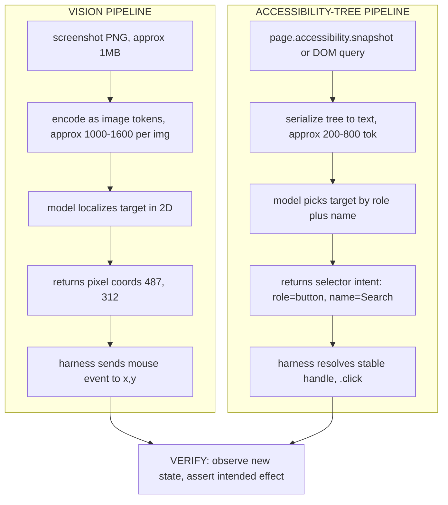

# Lecture 26: Computer Use & Browser Control — Vision vs Accessibility Tree

> Every "AI that uses your computer" demo eventually forks into the same two roads. Road one: take a screenshot, feed the pixels to a model, ask it "where do I click?", and send a mouse event to those coordinates. Road two: parse the page's structure, find the element by its *role and name* ("button named 'Search'"), and click it directly. These aren't two implementations of one idea — they are two fundamentally different theories of how an agent *perceives*, and they fail in opposite ways. This lecture teaches you both mechanisms from first principles, why the accessibility tree is the pragmatic sweet spot for anything web-shaped, why vision-only browser agents are a demo trap that dies in production, and — the habit that makes *either* road survivable — verify-after-action: never take step N+1 until you have observed and asserted that step N actually did what you intended. After this you will be able to pick the right perception strategy for a given task, explain the cost/latency/reliability tradeoff in concrete numbers, and write a closed-loop browser step that doesn't silently cascade one missed click into ten wrong ones.

**Prerequisites:** Lecture 1 (the perceive→act→observe loop), Week 1 (tool calling, errors-as-observations), Lecture 3 (errors-as-observations) · **Reading time:** ~28 min · **Part of:** AI Agents & Agentic Systems (Expanded Deep Track) Week 6

---

## The core idea (plain language)

An agent that "uses a computer" needs two things every loop iteration: a way to **perceive** the current screen, and a way to **act** on it. The whole design space collapses onto one question — *what representation of the screen do you hand the model?* — and there are exactly two answers that matter.

**Vision-based** perception hands the model **pixels**. You take a screenshot, send it as an image, and the model returns an action in *screen coordinates*: "click at (487, 312)", "type 'hello'", "scroll down 300px". This is how Anthropic's Computer Use (the `computer_20250124` tool) and OpenAI's computer-use / Operator work. The defining property: it works on *anything that renders*. A native desktop app, a `<canvas>` game, a remote-desktop stream, a PDF viewer, a Flutter app that exposes no DOM — if it produces pixels, a vision agent can drive it. The price is steep: screenshots are large (thousands of image tokens each), the model has to *localize* a target in a 2D image (hard, error-prone), and the coordinates it returns are brittle to resolution, DPI scaling, scroll position, and layout shifts.

**DOM / accessibility-tree** perception hands the model **structure**. Instead of pixels, you give it a semantic description of the page: roles (`button`, `textbox`, `link`), accessible names ("Search", "Email address"), and states (checked, disabled, expanded). The model picks a *target* by role and name, and you act on it with a stable selector — `page.get_by_role("button", name="Search").click()`. This is how Playwright-style automation, `browser-use`, Playwright MCP, and Stagehand operate. It is far cheaper (a compact text tree, not a megapixel image) and far more reliable (a stable element handle, not a pixel guess) — **but only when a structured tree exists.** No DOM, no tree, no party.

The opinionated default, and the thesis of this lecture: **for web tasks, prefer the accessibility tree / DOM. Fall back to vision only when there is genuinely no structured representation** — native apps, `<canvas>`, un-pierceable cross-origin iframes, image-only content. Vision-*only* browser agents are a demo trap: they look magical in a 90-second video and hemorrhage reliability and dollars in production. The mature production pattern is **hybrid**: use the tree for targeting (cheap, precise) and reach for a screenshot only to *disambiguate* when the tree is ambiguous or the model is stuck.

And underneath both strategies sits the single habit that separates a demo from a system: **verify after every action.** After you click, don't assume the click worked — observe the new state and *assert* the intended effect happened (the URL changed, the expected element appeared, the row count went up) before you proceed. An open-loop agent that fires actions without checking outcomes turns one missed click into ten downstream steps operating on the wrong screen, silently.

---

## How it actually works (mechanism, from first principles)

### The two perception pipelines, side by side



The two pipelines diverge at the very first step (what you capture) and converge at the last (verify). Everything downstream of "what you hand the model" is a consequence of that first choice.

### Why vision is expensive: the image-token arithmetic

A model doesn't see a screenshot as "one picture." It tiles the image and charges you tokens per tile. The exact formula varies by provider, but the shape is universal: **tokens scale with pixel area.** As an approximate rule of thumb (numbers are ballpark, verify against your provider's current docs), a 1280×800 screenshot lands somewhere around **1,000–1,600 tokens**. Every single step of a vision loop re-sends a fresh screenshot, because the screen changed.

Do the arithmetic on a 20-step task:

- 20 steps × ~1,300 image tokens/step = **~26,000 image tokens** just for perception, before a single word of reasoning or system prompt.
- Compare an accessibility-tree loop: a serialized tree for a typical page is roughly **200–800 tokens**. 20 steps × ~500 = **~10,000 tokens**, and often much less because you can send *just the relevant subtree*.

That's a ~3–5× perception-token difference on a modest task, and it compounds: more tokens means higher latency per step (the model must ingest a big image) and higher cost per step. A vision step's round-trip is frequently **2–5 seconds** just from image encoding + model ingestion; a tree-based step can be **sub-second** for the perception portion. Multiply by dozens of steps and hundreds of runs a day and the vision-only bill is not a rounding error — it's the line item your finance team circles.

### Why vision is brittle: coordinates are a lie you keep re-telling

The deeper problem isn't cost — it's that a pixel coordinate is a **fragile, absolute reference into a surface that moves.** Consider what has to hold for "click (487, 312)" to land on the right thing:

- **Resolution / viewport** must match what the model saw. Render at 1440×900 instead of 1280×800 and (487, 312) points somewhere else.
- **DPI / device pixel ratio** must match. A 2× Retina display means the "logical" pixel the model reasoned about is 2 physical pixels; get the mapping wrong and you're off by a factor of two — a class of bug called **coordinate drift**.
- **Scroll position** must match. If the page scrolled 40px between the screenshot and the click, your target moved 40px and you click the wrong row.
- **Layout stability** must hold. An async banner, a lazy-loaded image, a cookie dialog that pops in — any of these reflow the page and every coordinate the model computed is now stale.

None of these are hypothetical; they are the *daily* failure modes of vision agents. And critically, when a vision click misses, it usually **doesn't error** — it clicks *something*, just the wrong something. That silent wrongness is what makes verify-after-action non-negotiable for vision.

The accessibility tree sidesteps all of this. A target identified as `role="button", name="Search"` is resolved to an element *handle* at click time — the automation library finds the current on-screen position of that element right now, scrolls it into view if needed, and clicks its center. Resolution, DPI, and scroll are the library's problem, solved once, correctly. The reference is **semantic and late-bound**, not spatial and pre-computed.

### What the accessibility tree actually is

The accessibility (a11y) tree is the browser's own semantic model of the page — the same structure screen readers consume. It's derived from the DOM plus ARIA attributes, and it's a *compact* view: it drops the `<div>` soup and keeps the things a user can perceive and act on. A node looks like:

```
button "Search"
textbox "Email address"  (required)
checkbox "Remember me"   (checked)
link "Forgot password?"
heading "Sign in"        (level 1)
```

This is the sweet spot for three reasons:

1. **It's smaller than raw HTML.** A page's HTML might be 200KB of nested divs, inline styles, and tracking attributes; its a11y tree is a few dozen semantic nodes. Fewer tokens, less noise for the model to wade through.
2. **It's more stable than pixels.** A button named "Search" stays "the button named Search" across a redesign that moves it 200px and restyles it — the role and name are the *contract*, the coordinates are an implementation detail.
3. **It's more stable than raw CSS selectors, too.** `#app > div.container > div:nth-child(3) > button.btn-primary` breaks the instant a wrapper div appears. `get_by_role("button", name="Search")` is anchored to *what the element is and says*, which is exactly what a human relies on and what tends to survive refactors.

### The action side: how a tree target becomes a click

When the model says "click the Search button," the harness does role-based resolution. In Playwright:

```python
# a11y snapshot gives the model a compact semantic view to reason over
snapshot = page.accessibility.snapshot()   # dict of role/name/state nodes

# the model picks role="button", name="Search"; you resolve + act:
page.get_by_role("button", name="Search").click()
```

`get_by_role` builds a **locator** — a lazy, auto-retrying, late-bound reference. When `.click()` runs, Playwright waits for the element to be *actionable* (visible, stable, enabled, not obscured), scrolls it into view, and clicks its center. Auto-waiting is doing a chunk of your verify-before-act work for free: it won't click a button that isn't there yet.

### The verify-after-action loop (the part people skip)

Here is the mechanism that turns either perception strategy into something you'd run unattended. After an action, you **observe and assert**:

```python
page.get_by_role("link", name="IANA").click()
page.wait_for_load_state("networkidle")

# VERIFY: assert the intended effect, don't assume it
assert "iana.org" in page.url, f"navigation failed, still at {page.url}"

# fallback to vision only if the tree can't confirm what you need:
page.screenshot(path="step_after_click.png")   # disambiguation, not primary perception
```

The assertion is the load-bearing line. Without it, if the click missed (a modal intercepted it, the link's name changed, the page hadn't loaded), the agent proceeds to step N+1 believing it's on `iana.org` when it's still on the search page — and the next ten steps operate on the wrong screen, each producing plausible-looking but wrong actions. *One missed click, silently compounded.* The assertion converts a silent wrong-state into a loud, catchable failure — an **observation the model can recover from** (exactly the errors-as-observations discipline from Week 1, applied to screen state instead of tool exceptions).

What you assert depends on what the action was supposed to do — pick the cheapest observable proof:

- Navigation → `assert expected_substring in page.url`
- An element should appear → `expect(page.get_by_role("dialog")).to_be_visible()`
- A file should be written → check the path exists / size > 0
- A row was added → assert the row count went from N to N+1
- A form submitted → assert a success toast/message appeared

---

## Worked example: fill a search form and follow a result

Task: on a search page, type a query, submit, click the first result, confirm you landed on the expected domain. Let's cost it both ways and show the verified tree version.

**Vision-only version (what a demo does):**
1. Screenshot (≈1,300 img tok) → model returns "click textbox at (300, 150)".
2. Type query.
3. Screenshot (≈1,300) → "click Search button at (520, 150)".
4. Screenshot (≈1,300) → "click first result at (210, 340)".
5. Screenshot (≈1,300) → "you're on the page."

Perception cost: **~5,200 image tokens**, 4 screenshots, ~4 × 3s = **~12s** just in image round-trips. And step 4's coordinate assumes the results rendered at exactly the position in the step-3 screenshot — if an ad slot pushed results down 60px between screenshots, you click the wrong result and step 5 happily confirms "you're on *a* page" without checking *which*.

**Accessibility-tree version, verified:**

```python
page.goto("https://example.com/search")

# perceive: compact a11y snapshot (~400 tokens), model picks targets by role+name
page.get_by_role("textbox", name="Search").fill("iana reserved domains")
page.get_by_role("button", name="Search").click()
page.wait_for_load_state("networkidle")
assert page.get_by_role("list", name="Results").is_visible()   # VERIFY results rendered

page.get_by_role("link").filter(has_text="IANA").first.click()
page.wait_for_load_state("networkidle")
assert "iana.org" in page.url, f"expected iana.org, got {page.url}"  # VERIFY landing
```

Perception cost: **~1,200 text tokens** total across the steps (roughly 4× cheaper than the vision version's image tokens), each perception step sub-second, and — decisively — *two hard assertions* that fail loudly if the form didn't submit or the wrong link was followed. The `filter(has_text="IANA").first` targets by content, immune to the 60px ad-slot shift that broke the vision version.

**When you'd still reach for vision here:** if "the first result" is only distinguishable by a *thumbnail image* the a11y tree can't describe, you snapshot that region and let the model disambiguate visually — hybrid. You use vision for the one thing the tree can't express, not for the whole loop.

---

## How it shows up in production

- **Cost.** A vision-only agent's dominant cost is image tokens, and they scale with steps × resolution. Teams routinely discover their "cheap" browser agent costs 5–10× a tree-based equivalent purely from re-sending screenshots every step. The first optimization is almost always "stop sending a full screenshot when the DOM would do."
- **Latency.** Image ingestion adds seconds per step. A 30-step vision task can spend a minute-plus *just moving pixels over the wire*, which is why vision agents feel sluggish and tree agents feel snappy on the same task.
- **Reliability / flakiness.** Vision failures are *silent and non-deterministic*: coordinate drift, DPI mismatch, and layout shift produce a click on the wrong thing, not an exception. This is the single biggest reason vision-only agents that demo beautifully fall over in a scheduled, unattended run against a site that A/B-tests its layout. Tree-based targeting + actionability waits eliminate whole categories of this flake.
- **Debuggability.** A tree action logs as `get_by_role("button", name="Search")` — human-readable, greppable, reproducible. A vision action logs as `click(487, 312)` — meaningless without the paired screenshot, and un-replayable once the layout changes. When a run breaks at 3am, the tree trace tells you *what* it tried to click; the vision trace tells you *where*, which you then have to reverse-engineer.
- **The demo trap, concretely.** Vision-only browser agents win hackathons because they need zero site-specific setup and handle any page. Then they hit production: a cookie banner they didn't expect shifts every coordinate, a Retina CI runner doubles the DPI, results load async and the screenshot beats them there. The fix is never "better prompts" — it's "use the DOM for targeting and verify every step."
- **Where vision genuinely earns its keep.** Native desktop apps (no DOM at all), `<canvas>`-rendered UIs (games, whiteboards, some data-viz), remote-desktop / VNC streams, un-pierceable cross-origin iframes, and image-only content (a chart with no data table). For these, pixels are the *only* signal — vision isn't a trap, it's the only road. Anthropic's `computer_20250124` and OpenAI's computer-use exist precisely for this "works on anything rendered" generality.

---

## Common misconceptions & failure modes

- **"Vision is more general, so it's the better default."** Generality is not the same as reliability or cost-efficiency. Vision is the right *fallback* for no-DOM surfaces; it is the wrong *default* for web tasks where a cheaper, stabler tree exists. Reach for the most specific perception the surface supports.
- **"The accessibility tree is just the DOM."** No. The DOM is every node; the a11y tree is the browser's *semantic* subset (roles, names, states) — smaller, and aligned with what a user perceives. It's also more stable than brittle CSS/XPath selectors because it targets *meaning*, not structure.
- **"If the click didn't throw, it worked."** The most dangerous assumption in the field. A vision click almost never throws — it clicks *something*. Even a tree click can succeed on the wrong element if the name is ambiguous. Only an explicit post-condition assertion tells you the *intended effect* occurred.
- **"Screenshots are for perception."** In a hybrid design, screenshots are for **disambiguation** — the escape hatch when the tree is ambiguous or the model is stuck. Making the screenshot your primary per-step perception is exactly the vision-only trap.
- **"Open-loop is fine if each action is likely to work."** Errors *compound*. If each step is 95% reliable, a 20-step open-loop run succeeds only 0.95²⁰ ≈ **36%** of the time. Verify-after-action lets you catch and recover at each step, turning a compounding-failure product into a per-step-recoverable one.
- **"Auto-waiting means I don't need to verify."** Actionability waits (Playwright waiting for visible/stable/enabled) verify the element is *clickable* — a *pre*-condition. They say nothing about whether the click produced the *intended effect*. You still need the post-condition assertion.
- **"Hybrid means running both every step."** No — that's paying vision's cost *plus* tree complexity. Hybrid means tree-first, vision *only when* the tree can't answer the question. Vision is the exception path, not a parallel track.

---

## Rules of thumb / cheat sheet

- **Default for web:** accessibility tree / DOM. It's cheaper (compact text, not megapixel images), stabler (semantic late-bound handles, not pixel guesses), and debuggable (`get_by_role(...)` logs readably).
- **Fall back to vision only when there is no tree:** native apps, `<canvas>`, remote desktop, un-pierceable iframes, image-only content. "Works on anything rendered" is vision's real value — use it there.
- **Prefer role+name over CSS/XPath.** `get_by_role("button", name="Search")` survives redesigns; `div:nth-child(3)>.btn` shatters.
- **Hybrid is the production pattern:** tree for targeting, screenshot for disambiguation *only when stuck*. Never make the screenshot your primary per-step perception.
- **Image-token math (approximate):** a ~1280×800 screenshot ≈ 1,000–1,600 tokens; an a11y subtree ≈ 200–800. Vision perception on an N-step task ≈ 3–5× the tokens and adds seconds/step. Verify current numbers against your provider.
- **Verify after EVERY action.** Assert the cheapest observable proof of the intended effect: URL changed, element appeared, file written, row count moved. Assume nothing.
- **A click that didn't throw is not a click that worked** — especially for vision.
- **Compounding math:** 0.95²⁰ ≈ 36%. Open-loop long-horizon agents are a coin flip you keep losing. Closed-loop (verify + recover) is how you get to reliable.
- **Log intent, not coordinates.** `role/name` traces replay and debug; `(x, y)` traces don't.
- **Beware coordinate drift:** resolution, DPI/device-pixel-ratio, and scroll position must all match between screenshot and click, or vision silently misses.

---

## Connect to the lab

The Week 6 lab has you drive a browser two ways and feel the difference in your bones. Build the same short task (search → click a result → confirm the destination) once with Playwright's accessibility snapshot + `get_by_role(...)` targeting and once with a screenshot→coords vision loop, and instrument both for tokens and wall-clock per step — you'll see the ~3–5× perception-token gap and the latency gap directly, not as a claim. Then, in *both* versions, wire a post-condition assertion after every action (`assert "iana.org" in pg.url`, `expect(locator).to_be_visible()`) and deliberately break a step (rename the target, inject a cookie banner) to watch the verified loop catch it loudly while the open-loop version sails on and produces a confidently-wrong final answer. Add a hybrid path: when the tree can't identify a target, drop to a screenshot for that one disambiguation and continue on the tree.

---

## Going deeper (optional)

- **Anthropic — Computer Use documentation** (the `computer_20250124` tool). The canonical vision-based "works on anything rendered" reference implementation, including the screenshot→action loop and coordinate handling. Root: `platform.claude.com` / `docs.claude.com` (search: `Anthropic computer use tool`). Also see the Anthropic `anthropic-quickstarts` repo's computer-use demo (search: `anthropic-quickstarts computer use`).
- **OpenAI — Computer Use / Operator.** The other major generalist GUI-agent line; useful to contrast the same vision-first design from a second vendor (search: `OpenAI computer use tool` / `OpenAI Operator`).
- **Playwright documentation** — locators, `get_by_role`, accessibility snapshot, auto-waiting/actionability. The reference for tree-based targeting done right. Root: `playwright.dev` (search: `Playwright locators get_by_role`, `Playwright accessibility snapshot`).
- **Playwright MCP** (`microsoft/playwright-mcp` on GitHub). Exposes accessibility-tree browser control as an MCP server — the clean example of "give the model the tree, not the pixels" as a tool surface.
- **browser-use** (`browser-use/browser-use` on GitHub) and **Stagehand** (`browserbase/stagehand`). Two widely-used DOM/a11y-first browser-agent frameworks; read their READMEs for how they blend tree targeting with occasional vision.
- **WAI-ARIA / the accessibility tree.** MDN's "ARIA" and "Accessibility tree" articles explain roles/names/states from the source. Root: `developer.mozilla.org` (search: `MDN accessibility tree`, `WAI-ARIA roles`).
- **Simon Willison on prompt injection / the lethal trifecta** — relevant because a browser agent that reads untrusted page content and can act is a prime injection surface. Root: `simonwillison.net`.

---

## Check yourself

1. State the one question that the entire vision-vs-tree design space collapses onto, and give each strategy's one-line answer.
2. Give two independent reasons the accessibility tree is preferable to raw pixels for a web task, and one concrete situation where you *must* use vision anyway.
3. A vision agent clicks `(487, 312)` and it lands on the wrong element even though the model "saw" the right target. Name two distinct mechanisms that could cause this, and explain why the failure is usually *silent*.
4. Why is `get_by_role("button", name="Search")` more robust than both a pixel coordinate *and* a CSS selector like `div.container > button:nth-child(3)`? Address both comparisons.
5. Define verify-after-action. Given a 20-step task where each step is 95% reliable, compute the open-loop success probability and explain what verify-after-action changes.
6. Explain the hybrid production pattern in one sentence, and state the mistake someone makes when they think "hybrid" means running vision on every step.

### Answer key

1. The question is **"what representation of the screen do you hand the model?"** Vision's answer: **pixels** (a screenshot; the model returns coordinates). Accessibility-tree's answer: **structure** (roles/names/states; the model returns a target it picks by role+name).
2. Preferable because (a) it's **cheaper** — a compact text tree (~200–800 tokens) versus a megapixel screenshot (~1,000–1,600 image tokens), 3–5× fewer perception tokens and much lower per-step latency; and (b) it's **more stable/reliable** — a semantic, late-bound element handle resolved at click time is immune to resolution/DPI/scroll/layout drift, whereas a pre-computed pixel coordinate is not. You **must** use vision when there is no structured tree: native desktop apps, `<canvas>`-rendered UIs, remote-desktop/VNC streams, un-pierceable cross-origin iframes, or image-only content.
3. Two mechanisms (any two): **coordinate drift from DPI/device-pixel-ratio mismatch** (the logical pixel the model reasoned about maps to a different physical pixel — e.g. a 2× Retina runner), **scroll-position change** between screenshot and click (the target moved), **layout shift** (an async banner/cookie dialog/lazy image reflowed the page), or **resolution/viewport mismatch**. It's silent because a mouse event at (487, 312) almost always clicks *something* — it doesn't raise an exception, it just hits the wrong element — so without a post-condition assertion the agent proceeds believing it succeeded.
4. Versus a **pixel coordinate**: role+name is *semantic and late-bound* — resolved to the element's current on-screen position at click time, so resolution/DPI/scroll/layout are handled correctly by the library — whereas a coordinate is *spatial and pre-computed*, and stale the moment anything moves. Versus a **CSS selector**: `div.container > button:nth-child(3)` is anchored to DOM *structure* and breaks when a wrapper div appears or children reorder; `get_by_role(..., name="Search")` is anchored to *what the element is and says* (its role and accessible name), which is the human-meaningful contract and tends to survive refactors.
5. Verify-after-action means: after each action, observe the new state and **assert the intended effect occurred** (URL changed, element appeared, file written, row count moved) before proceeding — never assume a non-erroring action worked. Open-loop success = 0.95²⁰ ≈ **0.36 (36%)**, because errors compound multiplicatively across steps. Verify-after-action changes this by catching the failure *at the step where it happens*, converting a silent wrong-state into a loud, recoverable observation, so a missed step is retried/handled rather than cascading into ten downstream steps operating on the wrong screen.
6. Hybrid = **use the accessibility tree/DOM for targeting (cheap, precise), and drop to a screenshot only to disambiguate when the tree is ambiguous or the model is stuck.** The mistake is treating "hybrid" as running vision *in parallel every step*, which pays vision's full token/latency cost plus tree complexity — vision must be the *exception path*, not a co-equal per-step track.
