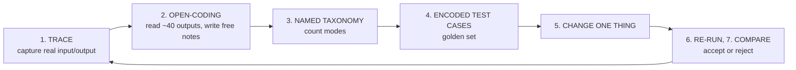
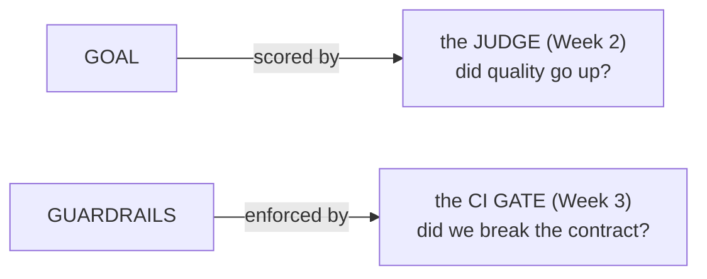

# Lecture 1: Eval-Driven Development and the Goal vs Guardrail Split

> Every LLM system you ship is a control loop, and the eval is the sensor. Without a trustworthy sensor you are flying blind: you tweak a prompt, it "looks better" on the three examples you happened to try, you ship, and you have no idea whether you improved the product or quietly broke it for the 30% of traffic you never looked at. This lecture teaches eval-driven development (EDD) as an engineering discipline — the same reflex that makes you write a failing test before a bug fix — and gives you the single most important framing device in the whole phase: the split between the *one* goal metric you are trying to move and the small set of *guardrail* metrics you must not regress. After this lecture you will be able to run the full loop (trace → error analysis → failure taxonomy → encoded tests → change one thing → re-run → compare), explain to a skeptical PM why "it looked good in the playground" is not evidence, and correctly reject a change that raises accuracy but blows a cost or latency budget.

**Prerequisites:** You can build and call at least one LLM system (a prompt, an extractor, a RAG pipeline, or an agent) from Phases 1–6. Comfort with Python, `pytest`, and JSON. · **Reading time:** ~22 min · **Part of:** Evaluation, Testing & Observability — Week 1

## The core idea (plain language)

Eval-driven development inverts the order most people work in. The intuitive order is: *have an idea → change the prompt → eyeball a few outputs → ship if it looks good.* EDD says: *build the measurement first, then change things, then let the measurement tell you if you were right.*

The reason is not academic tidiness. It is that LLM outputs are **high-variance and high-dimensional**. A prompt change can fix the three cases you're staring at while silently breaking a fourth category you forgot exists. Human eyeballing samples maybe 3–5 outputs; your production traffic is thousands. Your brain also lies to you — once you *believe* the new prompt is better, you read its outputs more charitably. This is confirmation bias with a completion endpoint attached.

An eval is just a **repeatable, automated judgment** applied to a fixed set of representative inputs. Once it exists, every change becomes an experiment with a number attached instead of a vibe. The discipline around that has two halves:

1. **The loop** — how you go from raw production reality to a test suite that catches regressions, and the iron rule that you change exactly one variable per iteration so you can attribute the result.
2. **The goal/guardrail split** — deciding, *before* you iterate, the single quantity you're trying to improve (the goal) and the handful of quantities you refuse to let get worse (the guardrails). This is what stops you from celebrating a "win" that quietly triples your bill.

## How it actually works (mechanism, from first principles)

### The eval-driven loop



**Step 1 — Trace.** You cannot evaluate what you cannot see. A trace is one structured record per call: `{id, ts, input, output, context?, meta}`. If you have production traffic, log it. If you don't, *generate* 60–80 realistic inputs that span the real distribution — easy, hard, long, adversarial, rare entities — and run them through. The output of this step is a `raw_traces.jsonl` file, not a feeling.

**Step 2 — Open-coding error analysis.** This is the step everyone skips and the step that makes everything else work. "Open coding" is a term borrowed from qualitative research: you read each trace with *no predefined categories* and write a free-text note on what's wrong (or "OK"). You are not scoring yet. You are letting the failures announce themselves. Do this for ~40 traces by hand. It is tedious and it is the highest-leverage hour in the whole phase.

**Step 3 — Named failure taxonomy.** Now cluster your free-text notes into named modes with counts:

```
hallucinated_citation : 9
wrong_field_extracted : 7
format_drift          : 4
unhelpful_refusal      : 3
truncated_answer       : 2
```

Ranked by frequency, this *is* your prioritized backlog. The counts matter: fixing `hallucinated_citation` (9 cases) buys you more than fixing `truncated_answer` (2). You now know where the pain is, in numbers.

**Step 4 — Encoded test cases.** Turn the taxonomy into a **golden set**: 50–100 cases as JSONL in git, each tagged with the failure mode it exercises and a stratum (`easy | hard | adversarial | rare`). Ensure every named mode has ≥3 cases. This file is a versioned artifact exactly like source code — `golden_v1.jsonl`, and when you change it, `golden_v2.jsonl` with a note on what changed. Editing it in place makes yesterday's scores incomparable to today's.

**Step 5 — Change exactly one thing.** Now, and only now, you optimize. And you change **one variable**: the prompt wording, *or* the model, *or* the temperature, *or* the retrieval `top_k` — never several at once.

**Steps 6–7 — Re-run and compare.** Run the golden set through the changed system, score it, and compare to baseline. Accept or reject based on the number, then loop.

### Why "change one thing" is not optional

Attribution is the whole point of an experiment. Suppose you change the prompt *and* swap `gpt-4o` → a cheaper model in the same iteration, and accuracy drops 4 points. Which change caused it? You have no idea. To find out you now have to run the two changes separately anyway — so the coupled run was pure wasted spend. Coupled changes also *hide* effects that cancel: the better prompt gained +5 points while the cheaper model lost −5, netting zero, and you wrongly conclude "the prompt did nothing" and throw away a real win.

The cost of one-variable discipline is more iterations. The cost of ignoring it is that your iterations produce no knowledge. In an engineering org, knowledge that survives to the next quarter is the asset; a green dashboard you can't explain is a liability.

### Worked before/after: two teams, one prompt change

**Team A (no eval).** A support-bot prompt sometimes answers questions it should refuse (out-of-scope legal questions). An engineer adds "Only answer questions about our product; otherwise say you can't help." They test 4 questions in the playground, all look great, they ship. Two weeks later support tickets spike: the bot now refuses *legitimate* questions that merely mention a competitor's name. Nobody noticed because nobody measured refusal rate. The "fix" traded one failure mode for a worse one, invisibly.

**Team B (eval first).** Same prompt, same bug. But first they pull 200 real traces and read 40 by hand (open coding). They discover the real failure distribution:

```
out_of_scope_answered : 6 / 40  (15%)   ← the bug they set out to fix
over_refusal          : 5 / 40  (12.5%) ← already happening, unnoticed
```

They build a 60-case golden set stratified across both modes, run the *baseline*, and record: `out_of_scope_answered = 15%`, `over_refusal = 12%`. Now they add the refusal instruction (one change) and re-run:

```
                        baseline   new prompt
out_of_scope_answered     15%    →    3%     ✅ goal moved
over_refusal              12%    →   28%     ❌ guardrail blown
```

Team B *sees* the trade-off before shipping. The refusal instruction fixed the target failure but more than doubled over-refusal. They reject the change, rewrite the instruction to be scope-based rather than keyword-based, re-run, and get `3% / 13%` — a genuine win that holds the guardrail. Team B spent one extra afternoon and shipped an actual improvement. Team A shipped a regression and found out from angry users. Same engineers, same idea; the only difference is the measurement loop.

## Worked example

Let's put numbers on the second half of the discipline. You maintain an invoice-extraction service. Your **goal metric** is field-extraction accuracy (fraction of fields correctly extracted across the golden set). Your **guardrails** are: cost per call, p95 latency, and output-format validity (is it parseable JSON matching the schema?).

Baseline over a 100-case golden set:

| Metric              | Type       | Baseline |
| ------------------- | ---------- | -------- |
| Extraction accuracy | **goal**   | 88.0%    |
| Cost / call         | guardrail  | $0.010   |
| p95 latency         | guardrail  | 2.1 s    |
| Format validity     | guardrail  | 99%      |

You try one change: switch the extraction prompt to a chain-of-thought "reason field-by-field before emitting JSON" style. Re-run:

| Metric              | Baseline | Candidate | Δ        |
| ------------------- | -------- | --------- | -------- |
| Extraction accuracy | 88.0%    | **91.0%** | **+3.0** |
| Cost / call         | $0.010   | $0.014    | +40%     |
| p95 latency         | 2.1 s    | 3.4 s     | +62%     |
| Format validity     | 99%      | 97%       | −2       |

Accuracy went up 3 points — a real gain on the goal. **This is not a win.** The CoT reasoning tripled the output tokens, so cost/call jumped 40% and p95 latency 62%. If your product SLA is p95 < 3 s, the candidate *violates the contract* regardless of accuracy. The rule is blunt and worth memorizing: **a change that improves the goal but breaches a guardrail is a rejected change, full stop.** You don't average them; you don't let a big accuracy number "buy back" a latency miss. Guardrails are pass/fail gates, not terms in a weighted sum.

What do you do? Keep the goal, attack the guardrail separately (next iteration, one variable): keep CoT but cap reasoning length, or move CoT behind a cheaper reasoning model, or apply CoT only to low-confidence extractions. Each is one change, each re-run against the same golden set with the same guardrails.

### Picking the metrics

- **Exactly one goal per iteration.** Not two. If you're chasing accuracy *and* conciseness at once you can't tell which knob moved which, and they often trade against each other. Pick the one that matters most this iteration; the other becomes a guardrail ("must not get worse") or a future iteration's goal.
- **A small, fixed set of guardrails.** The canonical five for most LLM systems: **cost/call, p95 latency, refusal rate, safety/toxicity, output-format validity.** Set a threshold on each ("cost ≤ $0.012", "p95 ≤ 3 s", "format validity ≥ 99%"). Keep the list short — every guardrail you add is a check you must maintain and a way for a good change to get blocked.

### How this framing maps to the rest of the phase

This split is the backbone of the next two weeks:

- **The judge (Week 2) is how you score the *goal*.** When the goal has no single right answer (summary quality, helpfulness), an LLM-as-judge with a rubric produces the number. You'll calibrate it against humans so you trust it.
- **The CI gate (Week 3) is where the *guardrails* are enforced.** In CI you assert `accuracy ≥ THRESHOLD` (goal) **and** `cost ≤ BUDGET and p95 ≤ SLA and format_valid ≥ 99%` (guardrails). A PR that moves the goal but breaks a guardrail exits non-zero and the merge is blocked — the discipline made mechanical.



## How it shows up in production

- **Silent regressions.** Without a golden set, a prompt tweak that helps 80% of traffic and breaks the other 20% ships clean and you learn about it from a support-ticket spike or a churn number three weeks later — the most expensive possible feedback loop.
- **Optimizing noise.** You "improve" accuracy from 82% to 84% on 50 hand-picked examples, ship, and it does nothing — because a 2-point delta on 50 cases is inside the measurement noise (Week 2's confidence intervals show this quantitatively). You spent a sprint chasing a number that wasn't real.
- **Cost blowouts disguised as wins.** The single most common production surprise: a quality improvement that quietly 2–3× the token count. Your quality dashboard is green and your finance dashboard is on fire. The goal/guardrail split catches this *before* merge; without it, you find out on the monthly invoice.
- **Un-debuggable outages.** When something breaks and every change last month was a coupled multi-variable edit, you cannot bisect. With one-variable discipline and a versioned golden set, you `git bisect` your prompts the same way you bisect code.
- **The "it looked good in the playground" standstill.** Two engineers disagree about which prompt is better and there's no eval, so the argument is settled by seniority or volume, not evidence. An eval turns a vibes debate into `84.1% [80.9, 87.0]` — a number a PM can act on.

## Common misconceptions & failure modes

- **"I'll eyeball a few outputs, that's basically an eval."** Sampling 3 outputs is not measurement; it's anecdote. The taxonomy only emerges from reading ~40, because the rare-but-severe modes don't show up in 3.
- **"I'll build the fancy metric first, skip the manual reading."** The reverse. You cannot write a good rubric or pick a good metric until you've *seen* how your system fails. Open coding comes before any automated score.
- **"More goal is always better."** No — a goal gain that violates a guardrail is rejected. Guardrails are hard gates, not soft trade-offs.
- **"Bigger golden set = better."** 50–100 well-chosen, stratified cases you actually maintain beat 5,000 random ones you never look at and that are 95% happy-path. Coverage of failure modes matters more than raw count.
- **"Happy-path cases are fine."** An all-easy golden set reads 98% forever and catches nothing. Deliberately over-sample hard and adversarial inputs — the eval exists to catch failures, so it must contain them.
- **"I can change the prompt and the model together to save time."** You save one run and lose all attribution. It's a false economy every time.
- **"Contamination doesn't matter."** If a golden-set input also lives in your few-shot exemplars, the model has effectively seen the answer key. Your score inflates and lies to you. Keep them physically separate and assert it in a test.

## Rules of thumb / cheat sheet

- **Build the eval before you optimize.** If you're editing a prompt and there's no golden set yet, stop and build it first. This is the reflex the whole phase trains.
- **Read ~40 traces by hand** before writing a single metric. Open coding first, categories second.
- **One goal metric per iteration.** Everything else is a guardrail or a later iteration.
- **Guardrails are pass/fail gates**, not terms in a weighted average. Default five: cost/call, p95 latency, refusal rate, safety/toxicity, format validity.
- **Change exactly one variable per run.** Prompt *or* model *or* temperature *or* retrieval — never a bundle.
- **A win that breaks a guardrail is a rejection.** No exceptions, no buy-backs.
- **Version the golden set like code** (`golden_v1.jsonl` → `golden_v2.jsonl`); never edit in place.
- **Decontaminate:** no golden input may appear in prompts, few-shot exemplars, or fine-tune data. Assert it.
- **Every failure mode gets ≥3 cases** in the golden set so a fix or regression is visible, not a single flaky sample.
- **Approximate heuristic (not a benchmark):** a 2–3 point delta on ~50 cases is usually noise. Treat small deltas as unproven until Week 2's confidence intervals say otherwise.

## Connect to the lab

This week's lab is the loop, hands-on: you'll wrap one Phase 1–6 system to emit `raw_traces.jsonl`, do open-coding error analysis on 40 traces, write a named+counted `failures.md` taxonomy, and build a stratified, decontaminated `golden_v1.jsonl` of 50–100 cases in git. As you build it, hold this lecture's frame: name your **one goal metric** and your **guardrails** now, in the taxonomy doc — you'll score the goal with the judge in Week 2 and enforce the guardrails in the CI gate in Week 3.

## Going deeper (optional)

- **Hamel Husain — "Your AI Product Needs Evals" and "Creating a LLM-as-a-Judge That Drives Business Value."** The canonical practitioner writing on error analysis and the look-at-your-data discipline. His blog is `hamel.dev`. Search: `Hamel Husain evals` and `Hamel Husain LLM as a judge`.
- **Chip Huyen — *AI Engineering* (O'Reilly, 2024), the Evaluation chapters.** The best mental-model framing for eval families and where they fit in a system. Search: `Chip Huyen AI Engineering evaluation`.
- **Eugene Yan — writing on evals and LLM patterns.** Practical, engineering-first. Search: `Eugene Yan evals LLM-as-judge`.
- **promptfoo docs** (`promptfoo.dev`) — assert types and CI usage; you'll use it for the Week 3 gate. Read its "assertions" and "guardrails" sections to see the goal/guardrail split as config.
- **Search queries to keep handy:** `open coding error analysis LLM`, `golden dataset LLM eval best practices`, `guardrail metrics vs goal metric ML`.

## Check yourself

1. Why must the eval exist *before* you optimize the prompt? Name two concrete things that go wrong if you optimize first.
2. You change the retrieval `top_k` and the prompt in the same iteration; accuracy drops 4 points. What can you conclude, and what does one-variable discipline buy you here?
3. A candidate raises answer accuracy by +3 points but increases p95 cost by 40% and pushes p95 latency past your 3 s SLA. Ship it or not, and why? What's your next move?
4. What is the difference between a goal metric and a guardrail metric, and why are guardrails treated as pass/fail gates rather than terms you average with the goal?
5. How does the goal/guardrail split map onto the judge (Week 2) and the CI gate (Week 3)?
6. Why does an all-happy-path golden set "read 98% forever and catch nothing," and what's the fix?

### Answer key

1. Because LLM outputs are high-variance and human eyeballing samples only a few cases, so a change can fix what you're staring at while silently breaking a category you didn't look at. Without a prior measurement you (a) can't detect regressions in unlooked-at traffic — they ship silently and surface as support tickets weeks later — and (b) can't tell a real improvement from noise, so you optimize numbers that aren't real. Confirmation bias also makes you read the new prompt's outputs more charitably.
2. You can conclude *nothing* about which change caused the drop — the effects are confounded and may even be partly canceling. One-variable discipline lets you attribute the result to a single cause, so each run produces durable knowledge; the coupled run forces you to re-run separately anyway, wasting the spend.
3. Do **not** ship: it breaches two guardrails (cost budget and the p95 latency SLA), and a guardrail breach rejects the change regardless of goal gains — guardrails don't get "bought back" by accuracy. Next move: keep the goal gain and attack the guardrail as a separate one-variable iteration — cap reasoning length, use a cheaper reasoning model, or apply CoT only to low-confidence cases — then re-run against the same golden set.
4. The goal is the single quantity you're trying to improve this iteration (e.g. accuracy, F1); guardrails are quantities you must not regress (cost, p95 latency, refusal rate, safety, format validity). Guardrails are pass/fail because a product contract (SLA, budget, safety bar) is binary — a great accuracy number does not make an out-of-budget or unsafe system acceptable — and averaging would let a big goal gain mask a contract violation.
5. The judge is how you *score the goal* — especially when quality has no single right answer, an LLM-as-judge with a calibrated rubric produces the number. The CI gate is where *guardrails are enforced* — it asserts the goal threshold plus each guardrail threshold and blocks the merge (non-zero exit) if any fails.
6. Because the eval only catches failures it contains; if every case is easy, the system passes them all and the score is high and uninformative while real (hard/adversarial) failures go unmeasured. The fix is stratification: deliberately over-sample hard, rare, and adversarial inputs and ensure every named failure mode has ≥3 cases.
