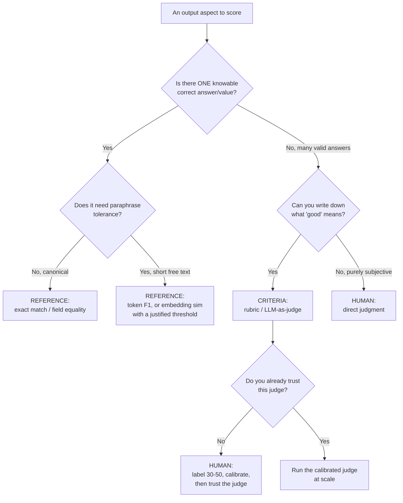

# Lecture 3: The Three Eval Families — Reference, Criteria, and Human

> Before you can score an LLM output you have to answer a prior question that most engineers skip: *what kind of thing is a "correct" output here?* Sometimes there is exactly one right answer and you can check against it. Sometimes there are a thousand right phrasings and the only sensible question is "how good is this one, per a rubric?" And sometimes the only trustworthy verdict is a human's — which is why humans are the ruler everything else is measured against. Picking the wrong family is the single most common eval mistake after skipping error analysis: teams run exact-match on a summarizer and conclude their model is 4% "accurate," or they spin up an expensive LLM judge for a task where a one-line string comparison would have been faster, cheaper, and *more* reliable. This lecture gives you a decision procedure — given a task, which family (or blend) applies — plus the failure modes, costs, and latencies that make the choice in production. After it you'll be able to look at any eval task and say, in one breath: "reference for the cited facts, criteria for helpfulness, human to calibrate the judge quarterly."

**Prerequisites:** Lecture 1 (eval-driven development; goal vs guardrail) and Lecture 2 (error analysis → taxonomy). You can build a prompt/extractor/RAG/agent from Phases 1–6 and have real or realistic outputs to score. Comfort with Python and JSON. · **Reading time:** ~25 min · **Part of:** Evaluation, Testing & Observability — Week 1

---

## The core idea (plain language)

Every automated score for an LLM output comes from exactly one of three sources of truth:

1. **Reference-based** — you have a *gold answer* for this input, and you compare the output to it. "The capital of France is Paris" is right; "Lyon" is wrong; there is a key to check against.
2. **Criteria-based (rubric)** — there is *no single right answer*, so instead you define what a good answer looks like (a rubric) and score the output against those properties. "Summarize this ticket" has a thousand acceptable summaries; you can't check against a key, but you can ask "is it faithful, concise, and does it name the customer's actual problem?"
3. **Human** — a person reads the output and judges it. This is the **ground truth** the other two families are ultimately trying to approximate cheaply. It's slow and expensive, so you don't run it on everything — you run it to *calibrate* the cheap proxies and to settle cases the proxies can't.

The whole art is matching the family to the task. The mistake that bites hardest is using reference-based scoring on open-ended generation: because there are many correct phrasings, a string comparison against one gold answer punishes correct outputs and your metric becomes noise. The mirror mistake is reaching for an LLM judge on a closed task (a fixed-label classification, a structured extraction) where a deterministic comparison is cheaper, faster, and doesn't hallucinate its own verdict.

A useful mental hook: **reference asks "does it match the key?", criteria asks "is it good, per the rubric?", human asks "is the proxy telling me the truth?"**

## How it actually works (mechanism, from first principles)

### Family 1 — Reference-based: compare to a gold answer

Reference-based eval needs a labeled dataset: each input has an `expected` output. The score is some function of "how close is the produced output to `expected`." The functions, from strictest to loosest:

- **Exact match** — string equality (usually after normalizing case/whitespace/punctuation). Binary: 1 or 0. Right for classification labels, yes/no, enum fields, canonicalized IDs.
- **Structured-field equality** — parse the output into fields (JSON, a Pydantic model) and compare per field. Right for extraction: an invoice has `total`, `date`, `vendor`; you score each field independently so "3 of 4 fields correct" is 0.75, not a flat fail.
- **Token overlap / F1** — for short free-text answers (extractive QA), measure the overlap of words between output and gold. F1 blends precision (did you add junk?) and recall (did you miss required words?). Tolerates word-order and minor phrasing differences that exact match would fail.
- **Embedding similarity** — embed output and gold, measure cosine similarity, threshold it. Tolerates *paraphrase*: "the meeting is at noon" vs "the meeting starts at 12 PM" score high. The loosest reference metric, and the one that quietly turns into a criteria-ish judgment (more on its failure below).

Worked numeric example — an extraction task, 5 fields on one invoice:

```
field       expected        produced          match?
--------    ------------    --------------    ------
vendor      "Acme Corp"     "Acme Corp"        1
date        "2026-03-01"    "2026-03-01"       1
total       "1240.00"       "1,240.00"         0  ← format drift; normalize first!
currency    "USD"           "USD"              1
po_number   "PO-8891"       "PO-8891"          1
                                    structured-field score = 4/5 = 0.80
```

Notice the `total` "failure": the value is *correct*, the formatting differs. This is the defining property of reference-based eval — **it is exactly as smart as your comparison function.** If you don't normalize `"1,240.00"` → `"1240.00"`, you'll report a false failure and go debug a model that was right. Reference-based scoring is brittle at the boundary between "wrong" and "differently phrased," and all the engineering effort goes into that boundary.

Where it's the right tool: **closed tasks with a knowable answer** — classification, extraction, closed-book/extractive QA, routing, any structured field. Strong because it's deterministic, near-free, instant, and reproducible: the same input scores the same forever, so it's a perfect CI gate.

Where it's weak-to-useless: **open-ended generation** — summaries, explanations, chat, creative text, most RAG answers. There are many correct phrasings, so one gold string can't represent "correct," and every metric in this family degrades:

```
Question: "Why did the deploy fail?"
Gold:     "The deploy failed because the database migration timed out."
Output:   "The migration didn't finish in time, so the release was rolled back."
   exact match      → 0    (nothing matches)
   token F1         → low  (few shared words: "the", "migration")
   embedding cosine → 0.78 (semantically close — but is 0.78 pass or fail?)
```

The output is *correct* and exact match scores it 0. Token F1 barely registers. Embedding similarity gets the gist but hands you a number with no obvious threshold — and that thresholding decision is where reference-based scoring starts leaking into criteria-land without admitting it.

### Family 2 — Criteria-based (rubric): score against properties, not a key

When there's no single right answer, you stop asking "does it match?" and start asking "does it have the properties a good answer must have?" You write those properties down — that's a **rubric** — and score the output against them. A rubric for a support answer:

```
[ ] Faithful    — every claim is supported by the retrieved docs (no invention)
[ ] Relevant    — actually answers the question asked
[ ] Complete    — covers the key points, doesn't omit a required step
[ ] Safe/format — no PII leak, correct tone, valid structure
```

Crucially, the rubric does **not** depend on a gold answer. It depends on the *input*, the *output*, and optionally the *retrieved context*. That's what makes it the workhorse for generative, RAG, and agent tasks — exactly the tasks where reference-based scoring collapses.

Today, "criteria-based" almost always means an **LLM-as-judge**: you hand a strong model the input, output, (optional context), and the rubric, and it returns a score plus a rationale. That's the subject of Week 2 — this lecture sets it up. The mechanical points that matter for *selection* now: a rubric score is **not deterministic** (run it twice, you can get 3 then 4), it **costs an LLM call** per evaluation, and it **inherits the judge's biases** (it can prefer longer answers, prefer its own model family, favor whichever answer came first in a comparison). You accept all of that because for open-ended output there is no cheaper trustworthy alternative — but you accept it with eyes open, and you *calibrate it against humans* before you believe it.

There are two rubric shapes you'll use:

- **Absolute / pointwise** — score one output on its own (pass/fail or 1–4). Use for gating a single system's output.
- **Pairwise** — given two outputs (A/B, e.g. old prompt vs new prompt), pick the better one. More reliable than absolute scoring because "A is better than B" is an easier judgment than "A is a 3/4," and it's the natural fit for the A/B decisions you make when iterating.

### Family 3 — Human eval: the ground truth everything calibrates against

A human reads the output and judges it. This is the **definition of correct** for subjective quality — the thing reference metrics and LLM judges are both trying to approximate. Its role in a mature pipeline is not "score everything" (you can't afford it) but:

- **Calibrate the proxies.** Label 30–50 cases by hand, run your LLM judge on the same cases, and check agreement (Week 2's Cohen's kappa). If the judge agrees with humans, you trust it on the other 10,000 cases. If it doesn't, the judge is "a random number generator with good grammar" and you fix the rubric.
- **Settle what proxies can't.** New failure modes, high-stakes edge cases, adversarial inputs, disputes between two proxy metrics.
- **Seed the golden set.** Human annotations from error analysis (Lecture 2's open coding) *become* your reference answers and your rubric criteria.

The defining property is cost and latency: human eval is **dollars and minutes-to-days per batch**, not fractions of a cent and milliseconds. That's why you spend it like a scarce budget — on calibration and hard cases — and let the calibrated proxies do the bulk scoring. One more subtlety engineers underestimate: humans are *not* perfectly consistent either. Two annotators disagree; the same annotator disagrees with themselves a week later. That inter-annotator disagreement is itself a number you measure — it sets the *ceiling* on how well any proxy can ever agree with "humans," because there's no single human answer to agree with.

### The three families at a glance

```
FAMILY        NEEDS            MEASURES               DETERMINISTIC?  COST/CALL      LATENCY
reference     a gold answer    match to key           yes             ~$0            <1 ms – ms
criteria      a rubric         quality vs properties  no (LLM)        ~$0.001–0.05   0.5 – 5 s
human         a person + time  ground-truth quality   n/a (people)    $0.10 – $5+    minutes–days
```

*(Cost/latency figures are order-of-magnitude rules of thumb for 2025–2026, not benchmarks — reference metrics like embedding similarity do cost a cheap embedding call, and human cost swings wildly with the expertise required.)*

## A decision procedure you can run in your head

Given a task, walk this once per *aspect of the output* — not once per task, because a single output often has several aspects (see the worked example).



Read the flow in plain words: **one knowable answer → reference** (add paraphrase tolerance only if the answer is free text). **Many valid answers but you can articulate "good" → criteria**, and if you haven't calibrated that judge yet, spend **human** eval to earn the right to trust it. **Can't even articulate "good" → human**, full stop. The escape hatch back to human sits under criteria permanently: a criteria layer is only as trustworthy as its last calibration.

Two failure shapes this procedure is designed to prevent: (1) answering "is there one right answer?" as *yes* for a summarizer because "there's a best summary" — no, there are many acceptable ones, that's criteria; (2) skipping the "do you trust this judge?" branch and shipping an uncalibrated judge as if it were ground truth.

## Worked example — a RAG support answer needs a blend

The clean single-family cases are easy. The real world is mixed. Take a RAG support bot: user asks a question, you retrieve docs, the model answers with citations. How do you score one answer? No single family suffices — you decompose the output into parts, and each part gets the family that fits it.

```
User: "How do I rotate my API key, and when does the old one stop working?"

Retrieved context: [docs on key rotation; old key valid 24h after rotation]

Answer: "Go to Settings → API Keys → Rotate. Your old key keeps working
         for 24 hours after rotation, then it's revoked. [doc: keys#rotate]"
```

Decompose and assign:

| Aspect of the answer | Family | Why |
| --- | --- | --- |
| **Cited fact: "old key valid 24h"** | **reference** | The docs state a specific value (24h). This is checkable against a key — treat it like extraction. If the answer says "48 hours," that's flatly wrong and a deterministic check catches it. |
| **Cited fact: the doc ID `keys#rotate`** | **reference** | Structured-field equality: does the cited doc actually exist and contain the claim? Exact, cheap, catches hallucinated citations. |
| **Faithfulness (is every claim grounded in context?)** | **criteria** | No gold string, but a rubric/judge can check each claim against the retrieved docs. This is RAGAS `faithfulness`. |
| **Helpfulness / relevance (does it answer both parts?)** | **criteria** | Many correct phrasings; a rubric judges "does it answer *both* the how and the when?" |
| **Quarterly: is the judge still right?** | **human** | Label 40 answers by hand, compare to the judge, recompute kappa. |

So the score for this one answer is a **blend**: reference-based tripwires for the hard facts and citations (cheap, deterministic, run on every request in CI), criteria-based judging for faithfulness and helpfulness (LLM call, run on the golden set and a sampled slice of prod), and periodic human calibration underneath it all. This is the normal shape of a production RAG eval — not one metric, a *portfolio*, each part in its right family.

Put rough numbers on the tradeoff for 1,000 requests. Judge every request inline on all four aspects and you pay ~1,000 × ~$0.01 ≈ **$10 and 1,000 × ~2 s of added latency per request** — in the user's hot path. Move the reference tripwires inline (≈ $0, sub-ms) and run the criteria judge only on your 80-case golden set in CI plus a sampled 3% of prod (~30 calls): now the judge bill is ~110 × $0.01 ≈ **$1.10**, off the hot path, and the user-facing latency cost is essentially zero. Same coverage of the failure modes; roughly one-tenth the cost and none of the latency tax. That reshaping *is* the practical payoff of getting the family assignment right.

Contrast with the wrong single-family choices: run pure reference (embedding similarity to one gold answer) and you can't tell a fluent hallucination from a grounded answer — both can score 0.8. Run pure criteria (judge everything) and you burn an LLM call to check a fact a `==` comparison would have nailed for free, *and* you let the judge's verbosity bias reward a padded answer over the crisp correct one.

## How it shows up in production

- **Exact match on generation → a metric that reads ~0% and everyone ignores.** A team scores their summarizer with exact match, sees 3%, correctly concludes the metric is meaningless, and then — this is the real damage — ships *without any eval* because "eval doesn't work for us." The fix was never a better model; it was the right family (criteria).
- **Embedding similarity's silent threshold problem.** Cosine 0.82 — pass or fail? Teams pick 0.8 because it "feels right," and now a paraphrase-but-wrong answer (right topic, wrong number) sails through at 0.85 while a correct-but-terse answer fails at 0.78. Embedding similarity measures *topical closeness*, not *correctness*; it cannot tell "the fee is $5" from "the fee is $50." In production this shows up as a green dashboard over a bot that confidently states wrong numbers.
- **LLM-judge cost and latency in the hot path.** A rubric judge is ~$0.001–0.05 and 0.5–5 s *per evaluation*. Judge every prod request inline and you've doubled your latency and added a second bill. Right pattern: reference-based tripwires inline/always, LLM judge on the golden set in CI and on a sampled 1–5% of prod traffic (Week 3), human eval on a periodic calibration batch.
- **The uncalibrated-judge trap.** A judge with low human agreement produces confident, well-written, *wrong* scores. You optimize your prompt to please the judge, ship, and users are unhappy because the judge was never measuring what they care about. Human eval exists precisely to catch this — skip calibration and your whole criteria layer is unmoored.
- **Human eval that doesn't scale, used where it shouldn't be.** A team hand-reviews every release's outputs; it takes two days and gates every deploy. The reference-checkable parts (labels, fields, citations) should have been automated months ago, freeing the humans for the genuinely subjective 5%.
- **F1 read as "accuracy."** A stakeholder sees "F1 = 0.71" on an extractive-QA eval and treats it like a percent-correct. It isn't — it's a token-overlap blend, and a partially-overlapping wrong answer earns partial credit. Know what your reference metric actually counts before you put it on a slide.

## Common misconceptions & failure modes

- **"Reference-based is the rigorous/objective one, so prefer it."** It's objective only when a gold answer *exists and is unique*. On open-ended tasks it's precisely *wrong* — it objectively measures the wrong thing (string match instead of quality). Rigor is matching the family to the task, not always picking the deterministic one.
- **"Embedding similarity handles open-ended output."** It handles *paraphrase*, not *correctness*. It can't distinguish a right answer from a fluent wrong one on the same topic, and its pass threshold is a guess. Treat it as a loose reference metric, not a quality judge.
- **"Criteria-based means no ground truth is needed ever."** The rubric needs no gold *answer*, but the *judge* still needs human calibration — humans are the ground truth for whether the rubric-score is trustworthy. "No gold answer" ≠ "no ground truth."
- **"Human eval is the gold standard, so more of it is always better."** Humans are inconsistent too (inter-annotator disagreement is real), slow, and expensive. Use them as a calibration ruler and tie-breaker, not a bulk scorer.
- **"One metric per task."** The most common real shape is a *blend* — reference for facts, criteria for quality — because a single output has both checkable and subjective aspects.
- **"Pick the family by the model."** You pick by the *task's answer structure*: is there one right answer (reference), many acceptable ones (criteria), or a judgment only a person can make reliably (human)? The model is irrelevant to this choice.
- **"BLEU/ROUGE are correctness metrics."** They're n-gram overlap metrics born in machine translation and summarization research. They're reference-based and famously weak on open-ended text — a correct paraphrase with different words scores low. If you see them proposed for a chat or reasoning eval, that's a family mismatch dressed up as rigor.

## Rules of thumb / cheat sheet

- **One right answer → reference. Many right phrasings → criteria. Trust question about a proxy → human.** Memorize this triage.
- **Reference for:** classification, extraction, routing, closed/extractive QA, structured fields, IDs, enums. Deterministic, ~free, instant → perfect CI gate.
- **Normalize before you compare** (case, whitespace, punctuation, number/date format). Most "reference failures" are formatting, not wrongness.
- **Escalate reference strictness only as needed:** exact match → structured-field equality → token F1 → embedding similarity. Looser tolerates more phrasing but risks false passes; embedding similarity needs a justified threshold or it's a vibe.
- **Criteria (rubric/LLM-judge) for:** summaries, chat, explanations, RAG answers, agent trajectories — anything open-ended. Expect non-determinism, per-call cost, and judge bias; **calibrate against humans before trusting it.**
- **Human eval for:** calibrating the judge (30–50 labeled cases), settling disputes/edge cases, seeding the golden set. Budget it; don't bulk-run it.
- **Blend on mixed outputs:** reference tripwires for the hard facts/citations, criteria for helpfulness/faithfulness. A RAG answer needs both.
- **Cost/latency order of magnitude (approximate):** reference ≈ $0 / sub-ms–ms · LLM judge ≈ $0.001–0.05 / 0.5–5 s · human ≈ $0.10–$5+ / minutes–days.
- **Map your tool's metrics to the family** before using it: RAGAS/DeepEval each mix all three, and knowing which is which tells you what it costs and whether it's deterministic.

### Mapping DeepEval and RAGAS onto the taxonomy

Both catalogs mix families; the win is reading each metric's family off its definition so you know its cost, determinism, and what it can catch. Tag each metric **R / C / H** in your head as you browse:

- **RAGAS** is RAG-centric. `faithfulness`, `answer_relevancy`, `context_precision`, `context_recall` are **criteria-based** (LLM-judged against the question and retrieved context — no gold answer needed; that's why RAGAS markets "reference-free" metrics). The metrics that take a `ground_truth` (e.g. answer-correctness variants) are **reference-flavored** — you supply a gold answer, so they cost less to *label-check* but require you to have that gold answer. Most of RAGAS's headline metrics are criteria (LLM calls), so they cost money and vary run-to-run.
- **DeepEval** is general-purpose. `GEval` (define a rubric in natural language, LLM scores it) and the RAG metrics (`FaithfulnessMetric`, `AnswerRelevancyMetric`, `ContextualPrecisionMetric`, hallucination, toxicity, bias) are **criteria-based**. Its exact-match / regex / JSON-schema-style assertions are **reference-based** (deterministic, cheap). DeepEval also supports human-in-the-loop review — that's your **human** family.

When you open either catalog, the C ones cost LLM calls and need calibration; the R ones are your cheap deterministic gate; the H ones are your calibration ruler. A catalog that only offers C metrics still needs an R gate and an H ruler bolted on — the tool doesn't excuse you from the taxonomy.

## Connect to the lab

This week's lab builds the golden set that makes all three families runnable. As you convert annotated traces into `golden_v1.jsonl`, put the family choice *into the schema*: give reference-scorable cases an `expected` field, give open-ended cases a `criteria` field (the rubric text), and tag which is which. That single decision — per case, reference vs criteria — is this lecture applied. The human family shows up when you hand-label 30–50 cases in Week 2 to calibrate the judge you'll build against exactly these `criteria` fields.

## Going deeper (optional)

- **RAGAS docs — metrics overview** (`docs.ragas.io`). Read the metric list and classify each as reference vs criteria; note which are marked "reference-free." Search: `RAGAS faithfulness answer relevancy metrics`.
- **DeepEval docs** (`deepeval.com` / `docs.confident-ai.com`). Read the metrics catalog and `GEval`. Search: `DeepEval GEval metrics`.
- **Chip Huyen — *AI Engineering* (O'Reilly, 2024), the Evaluation chapters.** The canonical mental model for eval families and where they fit. Search: `Chip Huyen AI Engineering evaluation`.
- **Hamel Husain — evals writing** (`hamel.dev`). Why reference metrics fail on generation and how criteria + human calibration take over. Search: `Hamel Husain evals`.
- **Search queries to keep handy:** `reference-free vs reference-based LLM eval`, `BLEU ROUGE limitations open-ended generation`, `LLM-as-a-judge vs human evaluation agreement`, `embedding similarity threshold answer correctness`.

## Check yourself

1. You're evaluating (a) an intent classifier, (b) a support-ticket summarizer, (c) whether your LLM judge can be trusted. Which family for each, and why?
2. Exact match reports your summarizer at ~3%. What's actually wrong, and what should you switch to?
3. Why is embedding similarity a *loose reference* metric rather than a real quality judge? Give a concrete case where it passes a wrong answer.
4. A single RAG answer contains a specific cited number and a paragraph of explanation. Describe the blend of families you'd use and what each part catches.
5. If the rubric needs no gold answer, in what sense does criteria-based eval still depend on a ground truth — and which family provides it?
6. Order the three families by cost/latency and state the production pattern that uses that ordering to stay affordable.

### Answer key

1. (a) **Reference** — a classifier has a fixed set of correct labels, so exact match / structured comparison is deterministic and free. (b) **Criteria** — a summary has many acceptable phrasings and no single key, so a rubric (faithful, concise, covers the key points) judged by an LLM is the workhorse. (c) **Human** — trust in a proxy is settled by comparing the proxy to human labels; humans are the ground truth you calibrate against.
2. Nothing is wrong with the *model*; the *family* is wrong. Exact match demands one gold string but summaries have many correct phrasings, so it scores near zero on correct outputs. Switch to criteria-based (rubric/LLM-judge), keeping any reference tripwires for checkable facts the summary must preserve.
3. It measures *topical/semantic closeness*, not correctness, and its pass threshold is a chosen number rather than a truth. Concrete case: gold "the fee is $5," output "the fee is $50" — same topic, high cosine (~0.9), passes your 0.8 threshold, but the answer is wrong. It can't separate a right value from a wrong value on the same subject.
4. **Reference** (structured-field / exact after normalization) for the cited number and the citation ID — deterministic, cheap, catches a hallucinated or wrong figure and a fake doc reference. **Criteria** (LLM-judge on a rubric) for faithfulness (every claim grounded in context) and helpfulness/relevance of the explanation — catches fluent-but-ungrounded or off-topic prose. Optionally **human** periodically to confirm the judge still agrees with people.
5. The rubric needs no gold *answer*, but you still need to know whether the *judge's scores* are trustworthy — that trust is a ground-truth question answered by comparing the judge to human labels (Week 2's calibration/kappa). The **human** family provides that ground truth.
6. Cheapest/fastest → most expensive/slowest: **reference** (~$0, sub-ms–ms, deterministic) < **criteria/LLM-judge** (~$0.001–0.05, 0.5–5 s, non-deterministic) < **human** ($0.10–$5+, minutes–days). Production pattern: run reference tripwires always/inline and in CI, run the LLM judge on the golden set and a sampled 1–5% of prod traffic, and spend human eval only on periodic calibration batches and hard disputes.
