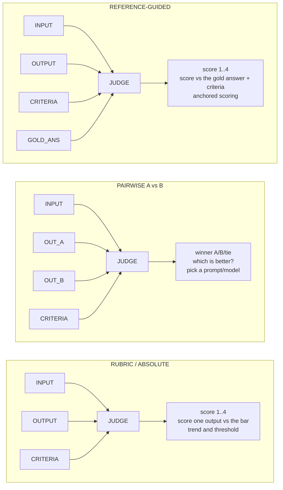
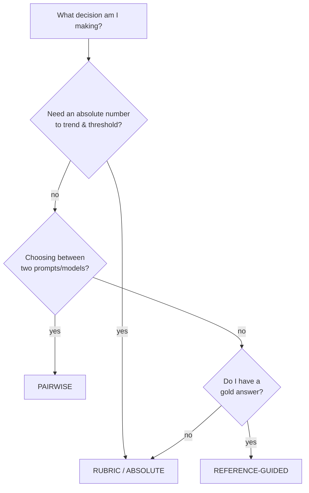

# Lecture 5: LLM-as-Judge Mechanics — Modes, CoT-First, Structured Verdicts

> When your goal metric has no single right answer — "is this summary faithful?", "is this answer helpful?", "did the agent follow the policy?" — you cannot score it with `==`. You need a judgment, and paying a human to make that judgment on every candidate change does not scale to hundreds of cases per PR. The LLM-as-judge fills the gap: a second model, prompted with your criteria, that reads an output and emits a **structured verdict** you can aggregate, threshold, and audit. Built carelessly it is a random number generator with good grammar. Built with the four engineering rules in this lecture — a strong judge model, chain-of-thought *before* the verdict, a low-cardinality scale, and structured output — it becomes a cheap, reproducible, auditable sensor. After this lecture you can pick the right judge *mode* for a decision, write a strict system prompt that names criteria and ignores length, define a Pydantic `Verdict` whose field order forces reasoning before scoring, handle parse failures and retries without corrupting your aggregate, and run the identical pipeline against a free local Ollama endpoint.

**Prerequisites:** You can build a structured-output extractor with Pydantic + `instructor` (Phase 3), you have a golden set from Week 1, and you understand the goal/guardrail split (Lecture 1). Comfort with Python and JSON. · **Reading time:** ~27 min · **Part of:** Evaluation, Testing & Observability — Week 2

## The core idea (plain language)

An LLM-as-judge is just a **prompt that asks a model to grade another model's output against explicit criteria and return a machine-readable verdict.** That's it. The entire discipline lives in the word "explicit" and in the shape of "machine-readable."

Why does it work at all? Because *recognizing* quality is a much easier task than *producing* it. A model that can't reliably write a perfectly faithful summary can still reliably tell you whether a given summary contains a claim absent from the source. Judgment is a discrimination task; generation is a search task. This asymmetry — **evaluation is easier than generation** — is the whole reason the technique is viable. It's also why pairwise ("which of these two is better?") is more reliable than absolute scoring ("rate this 1–4"): comparing two things is easier than pricing one thing in a vacuum.

There are exactly **three modes**, and picking the wrong one is the most common structural mistake:

1. **Rubric / absolute** — score *one* output against explicit written criteria. Best for **regression tracking against a threshold** ("did faithfulness stay ≥ 0.9 this week?"). You get an absolute number you can trend over time and gate CI on.
2. **Pairwise (A vs B)** — show the judge two outputs for the same input and ask which is better. Best for **choosing between two prompts or two models**. More reliable than absolute scoring because relative judgments are easier and cancel much of the judge's scale miscalibration.
3. **Reference-guided** — score an output against a *gold answer* plus criteria. Blends reference-based and criteria-based eval: the gold answer anchors the judge so it doesn't have to hold the entire notion of "correct" in its head, and the criteria tell it which kind of deviation matters.

The rest of the lecture is the four engineering rules that turn any of these modes from "looks plausible" into "trustworthy enough to block a merge."

## How it actually works (mechanism, from first principles)

### The four rules and why each exists

**Rule 1 — Use a strong judge model.** The judge is doing a harder reasoning task than it looks: hold the criteria, read the output, check each criterion, weigh them, and produce a calibrated score. A weak model does this inconsistently — its variance across identical inputs is high, so your eval score jitters run-to-run and you can't separate a real delta from judge noise. Use a frontier-class model as judge (a strong Claude, GPT-4-class, or Gemini-Pro-class model as of 2025–2026). The cost is real but bounded: you judge a 50–100-case golden set, not production traffic. A local model (Ollama) is a valid *fallback* — same pipeline, lower quality — covered at the end.

**Rule 2 — Force chain-of-thought BEFORE the verdict.** This is the rule people get wrong most often, and the mechanism is worth understanding exactly. An autoregressive model generates tokens left to right, each conditioned on everything before it. If the schema emits `score` first and `reasoning` second, the score is generated with *no* supporting computation — a snap judgment — and the "reasoning" that follows is generated *conditioned on a score that already exists*. That is textbook post-hoc rationalization: the model writes an explanation for a number it already committed to. Flip the order — `reasoning` first, then `score` — and the score is now conditioned on the analysis the model just performed. The reasoning tokens are literally the intermediate computation the score depends on. **You enforce this through Pydantic field order**, because structured-output libraries serialize fields in declaration order, so the field you declare first is the field the model must emit first.

```python
# WRONG — score is a snap judgment, reasoning is rationalization
class Verdict(BaseModel):
    score: int
    reasoning: str

# RIGHT — reasoning is the computation the score depends on
class Verdict(BaseModel):
    reasoning: str   # emitted first -> becomes context for score
    score: int
    pass_: bool
```

**Rule 3 — Use a low-cardinality scale.** Never ask for 1–100. A model cannot discriminate 100 distinct quality levels — the difference between a "72" and a "74" is not a signal it can produce consistently, and if you re-run the same input you'll get 71, 76, 73. Those extra digits are **pure noise dressed as precision.** Use `pass/fail` (2 levels) or `1–4` (4 levels — an even count with no neutral middle to hide in, forcing the judge to lean one way). Low cardinality means adjacent scores are actually distinguishable, so re-runs agree and your aggregate is stable.

Here's the noise made concrete. Suppose the judge's "true" opinion of an output is fixed, but its emitted score has run-to-run jitter. On a 1–100 scale that jitter might be ±4 points; on a 1–4 scale the model rounds to the nearest bin and the jitter mostly vanishes:

```
Same output judged 5 times:
  1-100 scale:  72, 76, 71, 74, 69   -> mean 72.4, but which is "right"? noise ±3-4
  1-4   scale:   3,  3,  3,  3,  3    -> unanimous, stable, aggregatable
```

**Rule 4 — Return structured output.** The verdict must be a parsed object (`Verdict.reasoning`, `.score`, `.pass_`), not free text you regex. You get this via `instructor` (which wraps the provider call and validates against your Pydantic model) or the provider's native `response_format` / JSON-schema mode. Structured output is what makes the verdict **aggregatable** (mean score over the golden set), **auditable** (every score ships with its reasoning, so a human can spot-check *why* case 34 failed), and **gate-able** (CI reads `.pass_` directly).

### The three modes, mechanically



- **Rubric** feeds the judge three things: `INPUT` (the original user request), `OUTPUT` (the candidate to grade), `CRITERIA` (the written rubric). It returns an absolute score. Use it when you want a number to trend and gate on.
- **Pairwise** feeds `INPUT`, `OUTPUT_A`, `OUTPUT_B`, `CRITERIA` and returns a winner. It's more reliable *per judgment* but gives a relative result, not an absolute one — you can't threshold "A won 60% of comparisons" against a fixed SLA the way you can threshold a score. It also has **position bias** (the judge favors whichever answer is shown first), which you neutralize by running both orders — covered in the next lecture on biases.
- **Reference-guided** adds `GOLD_ANSWER`. The gold answer collapses the judge's job from "know everything about correctness" to "compare against this known-good text through the lens of these criteria." Use it when you *have* a gold answer (extraction, QA with known answers) but the match isn't exact-string — paraphrases, ordering, and formatting differ, so `==` would false-fail correct answers.

A decision-first way to remember it:



### The strict judge system prompt

The prompt is where you name the criteria and defuse the biggest silent bias — **verbosity bias**, the tendency to score longer answers higher regardless of quality. A production-grade rubric-judge system prompt:

```text
You are a strict, impartial evaluator. You will be given an INPUT (the user's
request), an OUTPUT (a response to evaluate), and CRITERIA (the rubric).

Evaluate the OUTPUT ONLY against the CRITERIA. Then:
  1. Reason step by step: check the OUTPUT against EACH criterion in turn,
     quoting the specific part of the OUTPUT that satisfies or violates it.
  2. Assign a score from 1 to 4:
       4 = fully meets all criteria
       3 = meets criteria with minor issues
       2 = meaningful violation of at least one criterion
       1 = fails to meet the criteria
  3. Set pass_ = true only if score >= 3.

Rules:
- Judge correctness and adherence to the CRITERIA, NOT length or fluency.
- A longer answer is NOT better. A concise correct answer scores higher than
  a verbose one that buries errors.
- Do NOT reward confident tone. Do NOT penalize hedging that is warranted.
- If the OUTPUT is off-topic or refuses a valid request, score 1.
```

Note what the prompt does: it names the scale semantics (so "3" means the same thing every run), explicitly ties `pass_` to a score threshold (so the boolean isn't a second independent guess), and spends three lines killing verbosity and tone bias. The criteria themselves go in the *user* message, per case, because they differ across cases in your golden set.

## Worked example

Let's build and run a judge end to end, with numbers.

**The schema and call** (using `instructor`, which validates the response into `Verdict` and retries on schema violation):

```python
import instructor
from openai import OpenAI
from pydantic import BaseModel, Field

class Verdict(BaseModel):
    reasoning: str = Field(description="Step-by-step check against each criterion.")
    score: int = Field(ge=1, le=4)          # low cardinality, bounds enforced
    pass_: bool                              # true iff score >= 3

client = instructor.from_openai(OpenAI())

def judge(input_text, output_text, criteria, model="gpt-4o-2024-11-20"):
    return client.chat.completions.create(
        model=model,
        response_model=Verdict,
        max_retries=2,                       # instructor re-asks on parse/validation failure
        temperature=0,                       # determinism: same input -> same verdict
        messages=[
            {"role": "system", "content": JUDGE_PROMPT},
            {"role": "user", "content":
                f"INPUT:\n{input_text}\n\nOUTPUT:\n{output_text}\n\nCRITERIA:\n{criteria}"},
        ],
    )
```

**The case.** A support bot was asked "Does your Pro plan include SSO?" The docs say SSO is Enterprise-only. Two candidate outputs:

- **Output A:** "Yes! The Pro plan includes SSO along with priority support and advanced analytics, giving your team enterprise-grade security features to keep your data safe and your workflows smooth." (verbose, confident, **wrong** — SSO is Enterprise-only)
- **Output B:** "No — SSO is available on the Enterprise plan, not Pro." (terse, **correct**)

Criteria: `The answer must be factually correct per the product docs and must not claim features the named plan lacks.`

A well-built rubric judge returns for **Output A**:

```json
{
  "reasoning": "Criterion 1 (factual correctness): the OUTPUT claims the Pro plan
   includes SSO. Per the docs, SSO is Enterprise-only, so this is false. Criterion 2
   (no false feature claims): directly violated — it attributes SSO to Pro. The extra
   detail about analytics and security is fluent but does not offset the factual error.",
  "score": 1,
  "pass_": false
}
```

and for **Output B**:

```json
{
  "reasoning": "Criterion 1: correctly states SSO is Enterprise, not Pro — matches docs.
   Criterion 2: makes no false feature claims. The answer is short but complete for the
   question asked.",
  "score": 4,
  "pass_": true
}
```

This is the payoff of the four rules working together. **Verbosity bias** would have scored A higher (it's longer and more confident) — the prompt's "longer is NOT better" line prevents that. **CoT-first** forced the judge to check each criterion *before* committing, so it caught the factual error instead of being swept along by A's confident tone. **Low cardinality** made the gap unambiguous: 1 vs 4, not "62 vs 78." **Structured output** gives you `pass_` for the CI gate and `reasoning` for the audit trail.

**Reference-guided variant of the same case.** Suppose your golden set stores a gold answer: `"SSO is available only on the Enterprise plan."` You add it to the message and adjust the criteria to name the reference:

```python
user = (f"INPUT:\n{q}\n\nOUTPUT:\n{cand}\n\nGOLD_ANSWER:\n{gold}\n\n"
        f"CRITERIA:\nThe OUTPUT must agree with GOLD_ANSWER on which plan has SSO. "
        f"Wording may differ; only the factual claim must match.")
```

Now the judge doesn't have to *know* the plan matrix — it just checks the candidate against the anchor. Output A contradicts the gold (score 1); Output B paraphrases it faithfully (score 4) even though it's not a string match, which is exactly why you reach for a judge instead of `==`.

**Aggregating.** Run the rubric judge over your 100-case golden set and you get 100 verdicts. Your goal metric is `mean(score)` or `mean(pass_)`; you trend it across prompt versions and gate CI on it. If baseline mean-pass is 0.88 and a candidate prompt is 0.91, you *still* apply Week 2's statistical rigor (bootstrap CI, paired test) before calling it a win — the judge gives you the per-case numbers; statistics tells you whether the delta is real.

## How it shows up in production

- **Judge cost and latency, bounded correctly.** A strong-model judge call costs roughly a normal generation call — a fraction of a cent to a few cents each, depending on model and rubric length (approximate; check current pricing). Over a 100-case golden set that's cents to low dollars per full eval run — fine for a nightly run or a per-PR gate on *changed* prompts. It is **not** fine to judge 100% of production traffic — that doubles your inference bill. In production you sample (judge a random 1–5% of traffic, per Week 3). Know which regime you're in.
- **Determinism matters for reproducibility.** Set `temperature=0` on the judge. A judge at temp 0.7 gives different verdicts on re-runs, so a CI gate becomes flaky and a green run tells you nothing. Temp 0 isn't perfectly deterministic (providers have residual nondeterminism) but it slashes variance.
- **Parse failures are a real failure mode, not a hypothetical.** Even with structured output, a judge occasionally emits malformed JSON, a `5` on a 1–4 scale, or a `pass_` that contradicts its score. If you regex free text instead of using a schema, this happens constantly. Handle it explicitly (next section) — a swallowed parse failure silently drops cases from your eval and biases the aggregate.
- **A miscalibrated judge poisons every downstream decision.** If your judge disagrees with humans (low Cohen's kappa — next lecture), every score it produces is untrustworthy, so every prompt A/B, every CI gate, every trend line is built on sand. The judge is infrastructure; calibrate it before you rely on it.
- **The free-judge escape hatch.** When prototyping, offline, or handling data you can't send to a provider, a local Ollama model runs the *identical pipeline* through an OpenAI-compatible endpoint at essentially zero marginal cost. Verdicts are lower quality (weaker discrimination, more parse retries) but the code doesn't change — you swap a base URL and model name.

## Common misconceptions & failure modes

- **"Score first, then explanation — the model knows the answer anyway."** No. Autoregressively, a score emitted before reasoning is a snap judgment and the following text is rationalization. This is the single most common judge bug. Reasoning field *first*, always.
- **"A 1–100 scale is more precise."** It's more *digits*, not more *signal*. Models can't discriminate 100 levels reliably; the low-order digits are noise. 1–4 or pass/fail is more precise in the sense that matters: reproducible.
- **"Longer, more detailed answers are better, so the judge is right to score them up."** Verbosity bias. Length correlates with quality only weakly and the judge over-weights it. Instruct the rubric to ignore length explicitly, and verify with a length-controlled probe.
- **"I'll just parse the score out of the text with a regex."** Fragile. Use structured output with schema validation and retries. Regex parsing fails silently on the exact cases that matter (the weird ones).
- **"Absolute scoring and pairwise are interchangeable."** They answer different questions. Absolute gives a threshold-able number for regression tracking; pairwise gives a more-reliable relative winner for choosing between two options but no absolute anchor. Pick by the decision you're making.
- **"The judge model family doesn't matter."** It does — a model tends to rate its own family's outputs higher (self-enhancement bias). Judge with a *different* family than the one that generated the output. (Full treatment in the biases lecture.)
- **"Temperature on the judge is fine."** Set it to 0. Nonzero temperature makes verdicts irreproducible and your gate flaky.

## Rules of thumb / cheat sheet

- **Mode by decision:** regression trend / CI threshold → **rubric/absolute**; choosing between two prompts or models → **pairwise**; scoring against a known-good answer → **reference-guided**.
- **Reasoning field FIRST** in the Pydantic schema. Then `score`, then `pass_`. Field order = emission order = whether reasoning informs the score.
- **Scale: `pass/fail` or `1–4`.** Never 1–100. Bind `pass_` to a score threshold in the prompt so it isn't a second guess.
- **Strong model as judge**, temp 0, structured output via `instructor`/`response_format`, `max_retries=2`.
- **Feed exactly INPUT / OUTPUT / CRITERIA** (add GOLD_ANSWER for reference-guided). Criteria go in the user message (per-case); scale semantics and bias rules go in the system prompt.
- **Kill verbosity bias in the prompt:** "judge correctness not length; a longer answer is not better."
- **On parse failure:** retry with the validation error appended; after N retries, mark the case `judge_error` and surface it — never silently drop it.
- **Judge the golden set, sample production.** Full-set judging per relevant PR is fine; 100%-of-traffic judging is a cost mistake.
- **Ollama for free/local:** same pipeline, `base_url="http://localhost:11434/v1"`, expect lower quality and more retries.
- **G-Eval / MT-Bench** are worth reading for *intuition only* — you don't need their math to build this.

### Feeding INPUT/OUTPUT/CRITERIA and handling parse failures

`instructor` already retries schema violations by feeding the validation error back to the model (that's what `max_retries` does), but you want a *terminal* fallback that doesn't drop the case:

```python
from pydantic import ValidationError

def safe_judge(input_text, output_text, criteria):
    try:
        return judge(input_text, output_text, criteria), False   # verdict, is_error
    except (ValidationError, Exception) as e:
        # terminal fallback: do NOT drop the case — record it so the aggregate is honest
        return Verdict(reasoning=f"JUDGE_ERROR: {e}", score=1, pass_=False), True
```

The rule: a case the judge couldn't parse is not a passing case and not an absent case — it's a *flagged* case you count and investigate. Silently dropping parse failures inflates your pass rate exactly when the judge is confused, which is exactly when you most need to know. Track the `judge_error` rate as its own number: a sudden rise usually means a prompt change confused the judge or the provider changed JSON behavior.

### Ollama as a free judge

```python
# identical pipeline; only the client construction changes
client = instructor.from_openai(
    OpenAI(base_url="http://localhost:11434/v1", api_key="ollama"),  # any non-empty key
)
# then: judge(..., model="llama3.1:8b")  -- lower discrimination, more retries, $0
```

The pipeline — schema, CoT-first, low-cardinality, retries — is byte-for-byte the same. You trade quality for cost and privacy. Use it to develop and debug the harness; switch `base_url` and `model` back to a strong hosted model when you need trustworthy numbers. Expect the local judge to need `max_retries` bumped (weaker models fumble JSON more) and to show lower agreement with humans when you calibrate it next lecture.

## Connect to the lab

This maps directly onto Week 2 lab step 2 ("build a rubric judge with structured output") and sets up step 3 (pairwise). Build `src/judge.py` with the reasoning-first `Verdict`, the strict system prompt above (naming your criteria, ignoring length), and the INPUT/OUTPUT/CRITERIA user message. Run it over 20 sampled golden cases and confirm 20/20 return a valid `Verdict` — that's the lab's Definition-of-Done gate. Then point the same code at Ollama to prove the pipeline is provider-agnostic. The *next* lecture (judge biases + Cohen's kappa) is what makes you trust the numbers this one produces.

## Going deeper (optional)

- **G-Eval** — the paper that popularized CoT-scored rubric judging ("NLG Evaluation using GPT-4 with Better Human Alignment"). Read for the intuition that chain-of-thought-then-score beats direct scoring; skip the form-filling math. Search: `G-Eval NLG evaluation chain of thought`.
- **MT-Bench / "Judging LLM-as-a-Judge" (Zheng et al., 2023)** — the canonical reference for pairwise judging with strong models and the biases you'll meet next lecture. Search: `MT-Bench LLM as a judge Zheng`.
- **`instructor` docs** (`python.useinstructor.com`) — structured output, `response_model`, retries, validation. The library you'll actually use for the `Verdict`.
- **DeepEval docs** (`deepeval` on GitHub / `docs.confident-ai.com`) — G-Eval and LLM-judge metrics framed as an engineer's toolkit; good for seeing rubric metrics as reusable components.
- **Ollama docs** (`ollama.com`) — the OpenAI-compatible endpoint (`/v1`) and model pulls for the free-judge path.
- **Hamel Husain — "Creating a LLM-as-a-Judge That Drives Business Value"** (`hamel.dev`) — the practitioner take on criteria design and why low-cardinality + binary decisions win. Search: `Hamel Husain LLM as a judge`.

## Check yourself

1. You need to decide whether to ship prompt v2 in place of v1, and separately you need a number to gate CI against a fixed threshold every night. Which judge mode fits each, and why?
2. Explain, in terms of autoregressive generation, *why* putting the `reasoning` field before the `score` field changes the quality of the score. What concretely enforces that order?
3. Why is a 1–4 scale more "precise" than a 1–100 scale for an LLM judge, even though 1–100 has more possible values?
4. Your judge occasionally returns malformed JSON on hard cases. Describe the wrong way and the right way to handle this, and what the wrong way does to your aggregate pass rate.
5. When would you choose reference-guided over plain rubric mode, and what does the gold answer change about the judge's job?
6. You switch your judge's `base_url` to `http://localhost:11434/v1` and its model to `llama3.1:8b`. What changes about your pipeline, what changes about your results, and when is this the right move?

### Answer key

1. **Pairwise** for the v1-vs-v2 ship decision — relative judgments are easier and more reliable, and you're literally choosing between two options. **Rubric/absolute** for the nightly CI gate — you need an absolute, threshold-able number you can trend, which pairwise (a relative winner) can't give you.
2. A model generates tokens left to right, each conditioned on the prior tokens. If `score` comes first, it's produced with no supporting computation (a snap judgment) and the later `reasoning` is generated conditioned on an already-fixed score — post-hoc rationalization. If `reasoning` comes first, the reasoning tokens become the context the score is conditioned on, so the score reflects an actual analysis. It's enforced by **Pydantic field declaration order**, because structured-output libraries emit fields in declaration order.
3. Because a model can't reliably discriminate 100 distinct quality levels — the low-order digits vary run-to-run, so they're noise, not signal. A 1–4 scale bins quality into levels the model *can* distinguish consistently, so re-runs agree and the aggregate is stable. The "precision" that matters is reproducibility, not digit count.
4. **Wrong:** catch the parse error and skip the case (or regex-scrape a number). This silently drops exactly the confusing cases, which inflates your pass rate and hides the judge's uncertainty. **Right:** retry with the validation error fed back (instructor does this), and on terminal failure record the case as a flagged `judge_error` (counted, not dropped, treated as non-passing) so the aggregate stays honest and you can investigate.
5. Choose reference-guided when you *have* a gold answer but a string match would false-fail correct paraphrases (different wording, ordering, or formatting). The gold answer **anchors** the judge — it no longer has to hold the full notion of "correct" in its head, only compare the candidate against a known-good text through the lens of the criteria — which reduces variance and makes the judge robust on tasks where you know the answer but can't `==` it.
6. The **pipeline is unchanged** — same schema, CoT-first order, low-cardinality scale, retries; only the client's `base_url`/`model` change. The **results get worse** — weaker discrimination, more parse retries, less trustworthy verdicts — at essentially zero marginal cost. It's the right move for prototyping/debugging the harness, working offline, or handling data you can't send to a hosted provider; switch back to a strong hosted model when you need numbers you'll actually trust.
