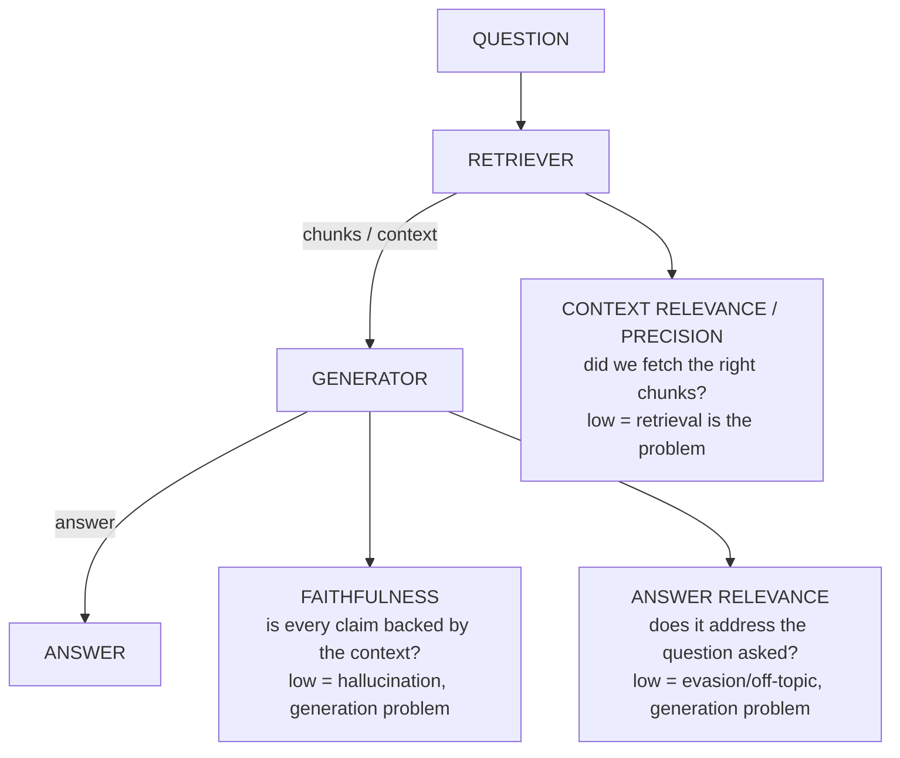
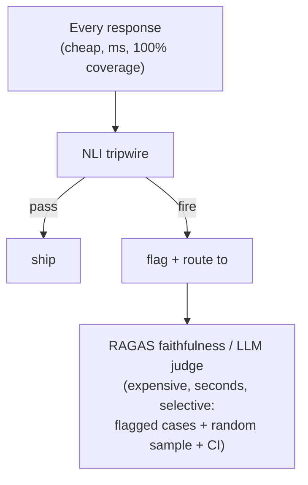

# Lecture 8: RAG Evaluation and Hallucination Detection

> A RAG system has two moving parts — a retriever that fetches context and a generator that writes an answer from it — and a single end-to-end accuracy number tells you nothing about *which* one is broken. Worse, the most dangerous failure mode of the whole stack (a fluent, on-topic answer that quietly invents a fact) is invisible to any metric that only asks "is this answer good?" This lecture gives you the component-level metric triad that decomposes RAG quality into three separable signals, shows you why they cannot be collapsed into one score, walks RAGAS end-to-end from your golden set, and then adds a defense-in-depth layer of cheap hallucination tripwires (NLI entailment, SelfCheckGPT-style consistency) that run in production where a full judge eval is too slow and too expensive. After this lecture you will be able to read a metric dashboard and say, in one sentence, *"this is a retrieval failure, not a generation failure"* — and you will have a cheap, deterministic hallucination check running on every response.

**Prerequisites:** Lecture 3 (three eval families — reference vs criteria vs human) and Lecture 4 (golden sets). You can build a RAG pipeline (Phase 4), read/write JSONL, and call an embedding model. Familiarity with the golden-set schema `{id, input, expected?, criteria?, ...}`. · **Reading time:** ~28 min · **Part of:** Evaluation, Testing & Observability — Week 2

## The core idea (plain language)

When a RAG answer is wrong, there are only three places the fault can live:

1. **Retrieval brought back the wrong stuff.** The chunks handed to the model don't contain the answer, or are cluttered with irrelevant text. The generator never had a chance.
2. **Retrieval was fine, but the generator ignored it and made something up.** The answer contains claims that the context does not support. This is *hallucination*, and it is the failure that gets companies sued.
3. **Retrieval and grounding were both fine, but the answer doesn't actually answer the question.** It's grounded and true but evasive, off-topic, or answers a different question than the one asked.

A single "is this a good answer?" score smears all three together. If it drops from 0.85 to 0.70 you have no idea whether to go fix your chunker, your prompt, or your reranker. The core move of RAG evaluation is to **measure each of the three failure surfaces with its own metric**, so a drop in one number points a finger at exactly one component. That triad is:

- **Faithfulness** — is every claim in the answer supported by the retrieved context? (catches hallucination — failure mode #2)
- **Context relevance / precision** — did retrieval return the chunks that actually matter? (catches retrieval failure — #1)
- **Answer relevance** — does the answer actually address the question that was asked? (catches evasion/off-topic — #3)

These are orthogonal on purpose. The whole reason to keep three numbers instead of one is that a high score on any of them can coexist with a catastrophic failure on another — and only by watching them separately can you diagnose the pipeline.

## How it actually works (mechanism, from first principles)

### Why the three cannot be one number

The sharpest way to internalize this: **a maximally answer-relevant answer can be maximally unfaithful.**

Question: *"What was Acme Corp's Q3 2025 revenue?"*
Answer: *"Acme Corp's Q3 2025 revenue was $4.2 billion."*

That answer is perfectly on-topic — it directly addresses the question, it's the right shape, a human skimming it would nod. **Answer relevance ≈ 1.0.** But if the retrieved context never mentioned $4.2 billion — if the model pattern-matched a plausible-sounding number from its weights — then **faithfulness = 0.0.** A single "quality" judge that leans on fluency and topicality would happily pass this. The confident, well-formed, *fabricated* answer is the single most dangerous output a RAG system produces, and it is precisely the one that a collapsed score hides.

The reverse also happens. Consider:

Question: *"What was Acme Corp's Q3 2025 revenue?"*
Answer: *"Acme Corp is a manufacturer of industrial pumps headquartered in Ohio, founded in 1971."*

Every word may be faithful to the retrieved context (**faithfulness ≈ 1.0**) — but it doesn't answer the question at all (**answer relevance ≈ 0.2**). Grounded and useless.

Two failures, opposite metric signatures, both invisible if you average everything into "quality: 0.6." You keep them separate so the *pattern of which number dropped* is your diagnosis.

Here is the map from metric to component to failure:



### Metric 1: Faithfulness — claim-level entailment

Faithfulness asks: of the factual claims the answer makes, what fraction are supported by the retrieved context? The mechanism is **claim decomposition + verification**:

1. Break the answer into atomic claims (short standalone factual statements).
2. For each claim, ask: *can this be inferred from the retrieved context?* (yes/no).
3. Faithfulness = (# claims supported) / (# total claims).

Worked numeric example. Answer: *"Acme was founded in 1971, makes industrial pumps, and reported $4.2B in Q3 2025 revenue."*

Decompose into 3 claims:
- C1: "Acme was founded in 1971." → context says "founded 1971" → **supported**
- C2: "Acme makes industrial pumps." → context says "industrial pump manufacturer" → **supported**
- C3: "Acme reported $4.2B Q3 2025 revenue." → context has no revenue figure → **not supported**

Faithfulness = 2/3 ≈ **0.67**. That single fabricated claim (C3) is the hallucination, and the claim-level breakdown tells you *exactly which sentence* to distrust — far more actionable than a holistic "kinda grounded" score.

### Metric 2: Context relevance / precision — did retrieval do its job

Retrieval hands the generator *k* chunks. Context precision asks: of those chunks, how many were actually relevant to answering the question, and are the relevant ones ranked near the top?

The precision-flavored version is a ranking metric. Suppose you retrieved 5 chunks and the ones truly relevant to the question are at ranks 1, 2, and 5 (chunks 3 and 4 are noise):

```
rank:      1     2     3     4     5
relevant:  ✓     ✓     ✗     ✗     ✓
```

Context precision rewards relevant chunks appearing *early*. A common formulation (the one RAGAS uses, `context_precision`) computes precision@k at each rank where a relevant chunk appears, then averages:

- At rank 1: 1 relevant of 1 → precision 1.00
- At rank 2: 2 relevant of 2 → precision 1.00
- At rank 5: 3 relevant of 5 → precision 0.60

Average over the relevant positions: (1.00 + 1.00 + 0.60) / 3 ≈ **0.87**. If instead the relevant chunks landed at ranks 3, 4, 5 (all the noise on top), the score collapses — which is the signal that your reranker or your `k` is wrong. Low context precision means *fix the retriever* (chunking, embedding model, reranker, `k`), not the prompt.

### Metric 3: Answer relevance — does it address the question

Answer relevance measures whether the answer is on-topic and complete *with respect to the question*, independent of whether it's true. RAGAS computes this with a clever trick: it uses an LLM to **generate N candidate questions that the given answer would be a good answer to**, embeds each generated question, and measures cosine similarity to the *original* question. If the answer is on-topic, the reverse-generated questions look like the original; if it's evasive or off-topic, they drift.

Numeric sketch: original question embedding `q`. The answer produces 3 reverse-generated questions with cosine similarities to `q` of 0.91, 0.88, 0.93. Answer relevance ≈ mean = **0.91** → on-topic. An evasive answer might yield 0.30, 0.42, 0.25 → **0.32** → the answer is talking about something else. Note this metric deliberately does *not* look at the context — it's purely question ↔ answer alignment, which is why it can be high even when faithfulness is zero.

### The metric-signature diagnosis table

Because the three are separable, the *combination* of which is low tells you the fault:

| Faithfulness | Context precision | Answer relevance | Diagnosis |
|---|---|---|---|
| low | **low** | high/low | Retrieval failure — bad chunks, fix retriever |
| **low** | high | high | Hallucination — retriever gave good context, generator ignored it; fix prompt/model |
| high | high | **low** | Evasion/off-topic — grounded but doesn't answer; fix prompt/instructions |
| high | high | high | Healthy |

Read the row, not the average. This table is the entire practical payoff of the triad.

## Worked example — RAGAS end to end

RAGAS (Retrieval-Augmented Generation Assessment) is the standard library for computing this triad. The workflow is: build a dataset in the shape RAGAS expects from your golden set, then call `evaluate()`.

**Step 1 — the dataset shape.** Each row is `{question, answer, contexts, ground_truth}`:

- `question` — the user query (your golden set's `input`).
- `answer` — what your RAG system actually produced (you run your system to get this).
- `contexts` — the list of chunk strings your retriever returned for that question (a `list[str]`, not one blob — RAGAS reasons per chunk).
- `ground_truth` — the reference answer from your golden set (`expected`). Needed by some metrics (e.g. context precision's reference-based variant, answer correctness); faithfulness and answer relevancy don't strictly need it.

You already built the golden set in Lecture 4 with `{id, input, expected, ...}`. The bridge is: `question = input`, `ground_truth = expected`, and you generate `answer` + `contexts` by running each golden question through your live pipeline.

```python
from datasets import Dataset

rows = []
for case in golden_set:                       # your golden_v1.jsonl cases
    result = rag_pipeline(case["input"])       # your Phase 4 system
    rows.append({
        "question":     case["input"],
        "answer":       result.answer,
        "contexts":     result.contexts,        # list[str], the retrieved chunks
        "ground_truth": case["expected"],
    })
dataset = Dataset.from_list(rows)
```

**Step 2 — run `evaluate()`.**

```python
from ragas import evaluate
from ragas.metrics import faithfulness, answer_relevancy, context_precision

result = evaluate(dataset, metrics=[faithfulness, answer_relevancy, context_precision])
print(result)
# {'faithfulness': 0.78, 'answer_relevancy': 0.91, 'context_precision': 0.64}
```

Note that RAGAS itself uses LLM calls under the hood (for claim decomposition, reverse-question generation, and relevance judgments) plus an embedding model — so it is **not free and not instant**. On 50 golden cases with three metrics you're looking at roughly 50 × (several LLM calls per metric) — hundreds of calls, dollars of spend, and minutes of wall-clock. Configure the judge/embedding models explicitly (RAGAS lets you pass your own LLM and embeddings) and pin them, exactly like you pin a judge model — a silent RAGAS model swap makes yesterday's 0.78 incomparable to today's.

**Step 3 — read the result with the diagnosis table.** Above: faithfulness 0.78, answer_relevancy 0.91, context_precision 0.64. Answer relevance is high (answers are on-topic), faithfulness is middling (some fabricated claims), and context precision is the clear low point. Diagnosis: **retrieval is the weak link** — the generator is doing an OK job on whatever context it gets, but too many irrelevant chunks are crowding in. Go tune `k`, add a reranker, or fix chunk size *before* you touch the prompt. Without the decomposition you'd see "quality 0.78" and might waste a day prompt-engineering a retrieval problem.

## Hallucination detection — the defense-in-depth layer

RAGAS faithfulness is the *thorough* hallucination check, but it costs LLM calls per answer and takes seconds. You cannot afford to run it on every production response in the hot path. The engineering answer is **defense in depth**: pair a cheap, fast, deterministic tripwire that runs on *every* response with the expensive semantic/judge metric that runs *selectively* (on a sample, on flagged cases, or offline in CI).

### Tripwire A: NLI / entailment with a small cross-encoder

Natural Language Inference (NLI) models classify a (premise, hypothesis) pair into **entailment / neutral / contradiction**. Reframe faithfulness as entailment: **premise = retrieved context, hypothesis = an answer claim.** If the context does not *entail* the claim, the claim is unsupported — a hallucination candidate.

Use a small cross-encoder NLI model like `cross-encoder/nli-deberta-v3-base` (via `sentence-transformers`). It's a ~180M-param encoder running locally on CPU/GPU in **milliseconds**, no API call, deterministic (temperature is irrelevant — it's a classifier, same input → same output).

```python
from sentence_transformers import CrossEncoder
nli = CrossEncoder("cross-encoder/nli-deberta-v3-base")

def unsupported_claims(context: str, claims: list[str], thresh=0.5):
    flagged = []
    for claim in claims:
        scores = nli.predict([(context, claim)])   # [contradiction, entailment, neutral]
        p_entail = softmax(scores)[1]
        if p_entail < thresh:
            flagged.append((claim, p_entail))
    return flagged                                   # non-empty => tripwire fires
```

Worked example. Context: *"Acme, an industrial pump manufacturer founded in 1971, is headquartered in Ohio."* Claims and their entailment probabilities:
- "Acme was founded in 1971." → p_entail 0.96 → OK
- "Acme makes industrial pumps." → p_entail 0.93 → OK
- "Acme reported $4.2B in Q3 2025 revenue." → p_entail 0.04 (neutral/contradiction) → **FLAG**

The tripwire fires on the fabricated claim, deterministically, in single-digit milliseconds, with no API cost. That's cheap enough to run on 100% of production traffic. Its weakness: it works claim-by-claim, so you still need to decompose the answer into claims (a regex/sentence-split heuristic is fine for the cheap tier), and a single-context premise longer than the model's window gets truncated — chunk the context or score per-chunk and take the max entailment.

### Tripwire B: SelfCheckGPT-style consistency

The NLI check needs the context. Sometimes you want a hallucination signal with **no reference at all** — the intuition behind SelfCheckGPT: *if a model actually knows a fact, it states it consistently across samples; if it's fabricating, resampling produces divergent, contradictory versions.*

Mechanism: sample the answer **N times at temperature > 0** (say N=3, temp=0.7) and measure agreement across the samples. High agreement ⇒ the model is confident/grounded; low agreement ⇒ likely fabrication.

Worked example. Question: *"What year was Acme founded?"* Sample 3 times:
- Sample 1: "1971"
- Sample 2: "1971"
- Sample 3: "1971"

All agree → consistent → trust. Now a fabricated case:
- Sample 1: "1968"
- Sample 2: "1972"
- Sample 3: "1965"

Wild disagreement → the model is guessing → **FLAG**. You can quantify agreement by pairwise similarity (embedding cosine or NLI-contradiction rate) across the N samples; a rule-of-thumb tripwire fires when the mean pairwise agreement drops below ~0.7 (approximate — calibrate on your data).

The cost tradeoff is explicit: SelfCheckGPT needs **N extra generations per answer** (3–5×), so it's *not* your always-on tripwire — reserve it for high-stakes answers or a sampled fraction of traffic. It shines exactly where NLI can't help: no retrieved context to check against (e.g. a closed-book step, or checking the model's own parametric claims).

### The tiered architecture



The cheap deterministic check runs *everywhere* and catches the blatant cases at near-zero cost. The expensive semantic metric runs *selectively* — on tripwire-flagged responses, on a random online sample (Week 3's sampled online eval), and in your offline CI eval. You get broad coverage cheaply and depth where it matters, instead of paying judge-cost on 100% of traffic (unaffordable) or shipping with no check at all (reckless).

## How it shows up in production

- **The "great answer that's a lie" incident.** Your users report a confidently wrong figure. Answer relevance was high, a holistic judge passed it, and it shipped. The postmortem always ends with "we weren't measuring faithfulness separately." The triad exists to make this failure *visible before* the incident.
- **Cost of RAGAS at scale.** RAGAS is LLM-backed. Running the full triad on every PR against a 200-case golden set can be dozens of dollars and many minutes per run — too slow for a per-PR gate. Practical pattern (matches Week 3's tiered gate): NLI tripwire + deterministic checks on every PR, full RAGAS nightly or on retrieval/prompt changes only.
- **Latency budget for the tripwire.** The NLI cross-encoder adds a few ms to p50 and is CPU-runnable, so it fits in the response hot path. SelfCheckGPT's 3–5× generation cost does *not* fit the hot path — run it async on a sample, log the score, alert on drift.
- **Diagnosis speed.** When quality dips, the metric signature (which of the three dropped) turns a multi-hour "is it retrieval or generation?" investigation into a 30-second table lookup. That's the ROI of keeping three numbers.
- **Chunk-list granularity matters.** Passing `contexts` as one concatenated blob instead of a `list[str]` degrades context-precision measurement (RAGAS can't reason per-chunk) and can silently inflate the score. Preserve the list.

## Common misconceptions & failure modes

- **"One quality score is enough."** It hides the exact failure you most need to catch (confident hallucination). A high answer-relevance answer can be 0.0 faithful. Never collapse the triad.
- **"Faithfulness measures truth."** It measures *groundedness in the retrieved context*, not truth about the world. If your retrieved context is itself wrong, a faithful answer is faithfully repeating a falsehood. Faithfulness catches *fabrication*, not bad source data — that's a corpus-quality problem upstream.
- **"High context precision means the answer is good."** No — precision only says retrieval fetched relevant chunks. The generator can still ignore them (low faithfulness) or answer the wrong question (low answer relevance). Each metric guards one surface only.
- **"The NLI tripwire replaces RAGAS."** It's the cheap first line, not the whole defense. NLI works claim-by-claim on a bounded context window and can miss multi-hop or aggregated claims. It's a tripwire, not a verdict — pair it with the semantic metric.
- **"SelfCheckGPT needs the ground truth."** The opposite — its whole value is being *reference-free*. It measures self-consistency, which is why it works where you have nothing to check against. Its cost is the N extra samples.
- **"RAGAS numbers are stable across runs."** RAGAS uses LLMs (and often temperature > 0 internally) — scores wobble run to run. Pin the judge model, and treat a small RAGAS delta with the same skepticism as any small eval delta (Lecture on statistical rigor: bootstrap the CI).
- **"Temperature matters for the NLI check."** It doesn't — the cross-encoder is a deterministic classifier. Temperature only matters for the *generation* being checked and for SelfCheckGPT's sampling.

## Rules of thumb / cheat sheet

- **Always measure the triad separately:** faithfulness (hallucination), context precision (retrieval), answer relevance (evasion). Never one score.
- **Diagnosis by signature:** low context precision → fix retriever; low faithfulness + high precision → fix prompt/model (generator ignoring context); low answer relevance → fix instructions (evasion).
- **RAGAS dataset shape:** `{question, answer, contexts, ground_truth}`; `contexts` is a `list[str]`, one entry per retrieved chunk — never concatenate.
- **Pin the RAGAS judge + embedding models** just like any judge; a silent swap invalidates historical scores.
- **Tiered hallucination defense:** cheap deterministic NLI tripwire on 100% of traffic (ms, no API cost), expensive RAGAS/judge on flagged cases + random sample + CI.
- **NLI model default:** `cross-encoder/nli-deberta-v3-base`; flag a claim when P(entailment) < ~0.5 (approximate — calibrate on your golden set).
- **SelfCheckGPT default:** N = 3–5 samples at temp ~0.7; flag when mean pairwise agreement < ~0.7 (approximate). Use it reference-free and off the hot path.
- **Decompose answers into atomic claims** before faithfulness/NLI — score per claim so you know *which sentence* is the hallucination.
- **Faithfulness ≠ truth** — it's groundedness in your context. Bad context → faithful lies. Fix the corpus separately.
- **Don't gate every PR on full RAGAS** (too slow/costly) — tripwire on every PR, full triad nightly or on retrieval/prompt changes.

## Connect to the lab

Week 2's lab step 5 builds exactly this: construct a RAGAS dataset `{question, answer, contexts, ground_truth}` from your `golden_v1.jsonl`, run `evaluate(dataset, metrics=[faithfulness, answer_relevancy, context_precision])`, and read which metric is lowest to diagnose retrieval vs generation. Then add the cheap tripwire — the `cross-encoder/nli-deberta-v3-base` entailment check per claim, or a SelfCheckGPT-style 3× consistency sample — and confirm it flags at least one known-bad (deliberately hallucinated) case. The Definition of Done wants RAGAS's three metrics reported *or* a tripwire that catches a known-bad case; do both to feel the tiered pattern.

## Going deeper (optional)

- **RAGAS documentation** — the canonical reference for the metric definitions and `evaluate()` API. Root domain `docs.ragas.io`. Search: `ragas faithfulness context precision answer relevancy`.
- **SelfCheckGPT** — the original paper (Manakul et al., 2023), "SelfCheckGPT: Zero-Resource Black-Box Hallucination Detection for Generative Large Language Models." Search: `SelfCheckGPT hallucination detection paper`.
- **NLI cross-encoders** — the `sentence-transformers` cross-encoder docs and the `cross-encoder/nli-deberta-v3-base` model card on Hugging Face (`huggingface.co`). Search: `sentence-transformers cross-encoder NLI`.
- **RAG triad framing** — TruLens's "RAG triad" (context relevance, groundedness, answer relevance) is a clear alternative articulation of the same idea. Search: `TruLens RAG triad groundedness`.
- **DeepEval's RAG metrics** — another practitioner library with faithfulness/contextual-precision/answer-relevancy metrics; useful to compare framings. Search: `DeepEval RAG metrics faithfulness`.
- **Chip Huyen, *AI Engineering* (O'Reilly, 2024)** — the evaluation chapter for the mental model of decomposing and calibrating quality metrics.

## Check yourself

1. Give a concrete question+answer pair where answer relevance is ~1.0 but faithfulness is ~0.0. Why does this prove the two metrics cannot be collapsed?
2. Your RAGAS run reports faithfulness 0.90, context_precision 0.55, answer_relevancy 0.88. Which component is broken and what do you go fix — the prompt or the retriever?
3. Why is `cross-encoder/nli-deberta-v3-base` suitable as an always-on production tripwire while full RAGAS faithfulness is not? Name the two cost dimensions.
4. SelfCheckGPT samples an answer 3× and gets "1971", "1971", "1971". What does that imply, and what would three divergent years imply? Why does this method need no retrieved context?
5. Faithfulness = 1.0 on an answer that is factually false about the real world. How is that possible, and what upstream thing is actually broken?
6. Why must the `contexts` field in a RAGAS row be a `list[str]` (one entry per chunk) rather than one concatenated string?

### Answer key

1. Q: "What was Acme's Q3 2025 revenue?" A: "Acme's Q3 2025 revenue was $4.2B." The answer is perfectly on-topic (answer relevance ≈ 1.0) but if the context never stated $4.2B the number is fabricated (faithfulness ≈ 0.0). A single collapsed "quality" score, which leans on fluency and topicality, would pass this confident lie — the exact failure the triad exists to expose. So the two must stay separate.
2. Context precision (0.55) is the outlier low; faithfulness and answer relevance are both high. Signature = retrieval failure: the generator is grounding and answering well on whatever it gets, but too many irrelevant chunks are being retrieved/ranked high. Fix the **retriever** (chunk size, embedding model, reranker, `k`) — do *not* prompt-engineer.
3. NLI is a ~180M-param cross-encoder that runs locally in milliseconds with no API call and is deterministic — cheap on both **latency** (fits the response hot path) and **cost** ($0 per call), so it can run on 100% of traffic. RAGAS faithfulness makes several LLM API calls per answer, costing seconds of latency and real dollars, so it can only run selectively (sampled/flagged/CI).
4. Three identical "1971"s imply the model is consistent and confident — likely grounded, trust it. Three divergent years imply the model is guessing/fabricating (resampling reveals it has no stable answer) — flag it. It needs no context because it measures *self-consistency across samples*, not agreement with a reference; that's why it works reference-free where NLI (which needs a premise) can't.
5. Faithfulness measures groundedness in the *retrieved context*, not truth about the world. If the retrieved chunk itself contains a false statement, an answer that faithfully repeats it scores 1.0. What's broken is upstream **corpus/source quality**, not the generator — faithfulness catches fabrication, not bad source data.
6. RAGAS reasons per chunk (e.g. context precision ranks chunk relevance position-by-position). Concatenating into one blob destroys the per-chunk boundaries, so precision can't be computed correctly and the score can be silently inflated. Preserve the list so each chunk is evaluated at its retrieved rank.
