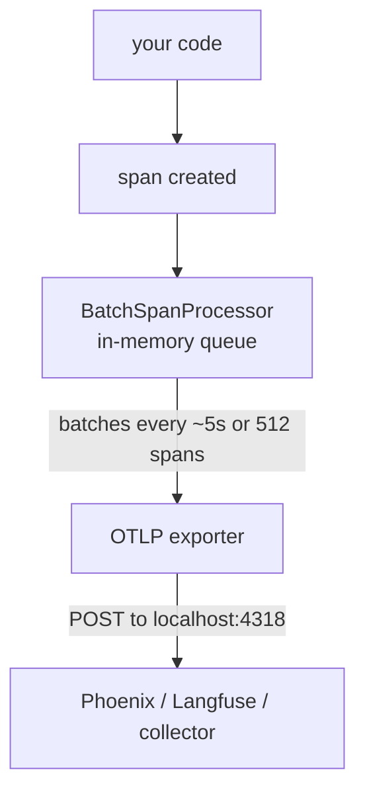

# Lecture 10: OpenTelemetry GenAI Tracing with OpenLLMetry

> Your golden set and calibrated judge tell you whether a change is *good*. They say nothing about what a single production request actually *did* — which of the four LLM calls burned 90% of the latency, where the 12,000 input tokens came from, or why last Tuesday's bill was double the week before. To answer those questions you need to see the request as a **structured tree of timed, attributed operations**, not a wall of `print` statements. This lecture teaches you to instrument an LLM/RAG/agent app with OpenTelemetry (OTel) — the same portable, vendor-neutral tracing standard the rest of your stack already uses — using the GenAI semantic conventions and the OpenLLMetry (Traceloop) SDK. After this lecture you will be able to read a span tree to find where tokens, latency, and cost go; explain why standardized attribute names make traces portable across Langfuse, Phoenix, Datadog, or Honeycomb without a rewrite; auto-instrument OpenAI/Anthropic calls in one line; hand-instrument your retrieval and tool steps with decorators; configure OTLP export and sampling sanely; and stand up the exact p50/p95-latency, total-cost, and token-per-request views the Week 3 dashboard depends on.

**Prerequisites:** You can build a RAG pipeline or a tool-using agent (Phases 4/6), you're comfortable with Python decorators and context managers, and you've seen JSON key/value attributes. No prior OpenTelemetry knowledge assumed. · **Reading time:** ~30 min · **Part of:** Evaluation, Testing & Observability — Week 3

## The core idea (plain language)

A **trace** is the complete story of one request. A **span** is one unit of work inside that request — a single LLM call, one vector search, one tool invocation — with a start time, an end time, and a bag of key/value **attributes** describing what happened. Spans nest: the whole request is a root span, and every operation it triggers is a child span underneath it. The result is a tree, and the tree's shape *is* the answer to "what did this request do."

Here is the mental model in one picture — a RAG request that answers a user's question:

```
[root: chat_request]  ................................  1,840 ms   $0.0121
 ├─ [retrieval: vector_search]  .......................    120 ms
 ├─ [llm: embed query]  ...............................     40 ms   1,200 tok
 ├─ [tool: fetch_order_status]  ......................    260 ms
 └─ [llm: chat.completions gpt-4o]  ..................  1,410 ms   $0.0119  (9,800 in / 240 out)
```

Read that tree top to bottom and you can already answer engineering questions with your eyes: the final LLM call dominates latency (1,410 of 1,840 ms) *and* cost (basically all of it), the retrieval is cheap, and 9,800 input tokens is suspiciously large — someone is stuffing the whole context window. No dashboard needed; the tree told you.

The second half of the core idea is **why OpenTelemetry specifically**, and not a bespoke logging scheme. OTel is a CNCF standard that virtually every observability backend already speaks. If you emit spans in OTel format with **standardized attribute names**, you can point them at Phoenix today, Langfuse next month, and Datadog when your company standardizes on it — *without changing a line of instrumentation code*. The GenAI **semantic conventions** are the agreed-upon vocabulary for the AI-specific attributes: everyone names the model `gen_ai.request.model`, everyone names the input token count `gen_ai.usage.input_tokens`. Because the names are shared, the dashboards, cost calculators, and alerts built on top of them are portable too. The alternative — inventing your own `my_model_name` field — locks every downstream tool to your private schema and to whichever vendor you first built against.

OpenLLMetry (the Traceloop SDK) is the piece that makes this practically free: one `Traceloop.init(...)` call monkey-patches your OpenAI/Anthropic/Bedrock client so every model call automatically emits a correctly-named GenAI span with tokens, latency, and cost. You then add spans by hand for the non-LLM steps (retrieval, tools) that no library can auto-detect.

## How it actually works (mechanism, from first principles)

### Spans, IDs, and how the tree gets built

A span is a record with, at minimum: a `trace_id` (shared by every span in the request), a `span_id` (unique to this span), a `parent_span_id` (the span that spawned it — empty for the root), a name, a start timestamp, an end timestamp, and an attributes map. That's the whole data model. The tree is *reconstructed* by the backend purely from `parent_span_id` pointers — the SDK doesn't ship a tree, it ships a flat list of spans that happen to reference each other.

How does the SDK know which span is the parent? **Context propagation.** OTel keeps a "current span" in a thread-local (or async-context) variable. When you open a new span, it reads the current span, sets that as its parent, and installs itself as the new current span until it closes. This is why decorators and context managers matter: entering the block pushes a span onto the context; exiting pops it. Get the nesting wrong (e.g. close a parent before its children) and the tree comes out flat or misattributed — a real failure mode covered below.

```
Wall-clock timeline (what "child" means):

  root  ├──────────────────────────────────────────────┤   1,840 ms
        │                                                │
  retr    ├────┤ 120ms                                   │
  embed        ├─┤ 40ms                                   │
  tool           ├──────┤ 260ms                           │
  llm                    ├────────────────────────────┤  │ 1,410ms
        └── children nested in time; parent spans the whole request ──┘
```

The parent's duration is wall-clock time from its start to its end — it is **not** the sum of its children. If two children run concurrently the parent can be shorter than their sum; if there's un-instrumented glue code between children the parent is *longer* than the sum. That gap is itself a signal ("300 ms unaccounted for → look at your orchestration code").

### The GenAI semantic conventions (the vocabulary)

The convention is just a list of standardized attribute keys. The ones you will actually use every day:

| Attribute | Meaning | Why you care |
|---|---|---|
| `gen_ai.system` | provider, e.g. `openai`, `anthropic` | filter cost by vendor |
| `gen_ai.request.model` | model requested, e.g. `gpt-4o-2024-11-20` | **silent-swap detection**, per-model cost |
| `gen_ai.response.model` | model the provider *actually* served | catches alias drift (`gpt-4o` → new snapshot) |
| `gen_ai.usage.input_tokens` | prompt tokens billed | the bigger half of most bills |
| `gen_ai.usage.output_tokens` | completion tokens billed | priced 3–5× higher than input |
| `gen_ai.request.temperature`, `.max_tokens` | sampling params | reproduce a bad request |
| `gen_ai.prompt.{n}.role` / `.content` | captured prompt messages | debug *what was actually sent* |
| `gen_ai.completion.{n}.content` | captured model output | debug what came back |

Two notes an engineer must internalize. First, **cost is not in the convention as a first-class field** — the spec standardizes tokens, and backends *compute* cost from `tokens × your price table`. That's deliberate: prices change weekly and vary by contract, so cost is a derived view, not raw telemetry. OpenLLMetry attaches a `gen_ai.usage.cost` (or `llm.usage.total_cost`)-style attribute using its built-in price table, but you should treat any auto-cost as approximate and reconcile against your provider invoice. Second, **prompt/completion capture is opt-in and dangerous** — those fields hold raw user data (PII), so many teams disable content capture (`TRACELOOP_TRACE_CONTENT=false`) in production and keep only tokens/latency/model. The convention has been evolving through 2024–2026 (attribute names around `gen_ai.*` and the newer `gen_ai.usage.input_tokens` naming stabilized relatively recently), so pin your SDK version and don't be surprised if an older backend shows a legacy `llm.*` prefix.

### Why standardized names = portability (the load-bearing point)

Imagine two worlds. In the **bespoke** world you log `{"model": "...", "in_tok": 9800, "price": 0.0119}`. Your Phoenix dashboard's cost panel is a SQL query hard-coded to `price`; your alert reads `in_tok`. Switch to Datadog and every panel, alert, and query breaks — the field names don't exist there. In the **conventions** world you emit `gen_ai.request.model` and `gen_ai.usage.input_tokens`. Phoenix, Langfuse, Datadog, Honeycomb, and Grafana all ship *pre-built* GenAI views keyed on those exact names. You change one environment variable (the OTLP endpoint) and every view lights up on the new backend with zero code changes. That is the entire economic argument for OTel: **instrument once, render anywhere, never rewrite when you switch vendors.**

### OTLP export: how spans leave your process

OTLP (OpenTelemetry Protocol) is the wire format spans travel over — gRPC (port 4317) or HTTP/protobuf (port 4318). The flow:



Export is **batched and asynchronous** by design: your request thread does *not* block on the network. A span is created, dropped into an in-memory queue, and a background thread flushes batches to the collector. Consequences you must know: (1) if your process exits abruptly, un-flushed spans are **lost** — always let the SDK shut down cleanly (or call `force_flush()` in short-lived scripts); (2) if the collector is down, the queue fills and eventually drops spans rather than crash your app (fail-open, good) — but you get silent gaps, so monitor exporter health. Point the SDK at your backend with `OTEL_EXPORTER_OTLP_ENDPOINT`.

### Sampling: keeping only some traces

At scale you cannot store every trace — a million requests/day at a few KB each is real money and storage. **Sampling** decides which traces to keep. Two flavors:

- **Head sampling** — decide at the root, before the request runs, using a fixed probability (`TraceIdRatioBased(0.1)` = keep 10%). Cheap and simple, but you might drop the one trace that errored. The decision propagates down the tree so a trace is kept or dropped *whole* (you never get half a tree).
- **Tail sampling** — buffer the whole trace, then decide after it finishes based on outcome ("keep 100% of errors and slow requests, 5% of the boring fast ones"). Smarter, but requires a collector to buffer and costs more infra.

For learning and for most single-app deployments: **sample at 100% until volume hurts**, then head-sample to a rate that keeps a few hundred traces/day while forcing 100% capture of errors. The GenAI-specific wrinkle: because you also want *cost and token totals* to be accurate, remember that if you sample 10% you must multiply sampled cost by 10 to estimate true spend — or keep an unsampled counter/metric for billing and only sample the detailed traces.

### The incremental instrumentation strategy

Do **not** try to instrument everything on day one — you'll drown in half-wired spans and never see the dashboard. The proven order:

1. **LLM-call spans first (free).** `Traceloop.init()` auto-instruments every OpenAI/Anthropic call. This alone gives you tokens, cost, latency, and model per call — which answers "what did this cost?" and "which model?" immediately.
2. **A root/workflow span next.** Wrap your top-level handler in `@workflow` so all the auto LLM spans nest under one request instead of floating as orphans. Now you have trees, not a pile of leaves.
3. **Retrieval spans.** Hand-instrument your vector search / reranker to record `k`, number of hits, and retrieval latency. This is the second-biggest latency contributor after generation.
4. **Tool spans last.** Wrap each tool/function the agent calls. These matter most for agents, least for plain RAG.

Each layer is independently useful and shippable. You can stop after layer 1 and still have answered the most expensive question (cost).

### OpenLLMetry in practice

```python
from traceloop.sdk import Traceloop

# One line. Reads OTEL_EXPORTER_OTLP_ENDPOINT from env (Phoenix/Langfuse/collector).
Traceloop.init(app_name="llm-evals")
# From here, every openai/anthropic call emits a GenAI span automatically.
```

Add structure with decorators for the parts no library can see:

```python
from traceloop.sdk.decorators import workflow, task

@workflow(name="rag_chat_request")     # the ROOT span for one request
def answer(question: str) -> str:
    ctx = retrieve(question)           # child span (below)
    return generate(question, ctx)     # auto LLM span nests here

@task(name="retrieval")                # a child span for the non-LLM step
def retrieve(question: str) -> list[str]:
    hits = vector_store.search(question, k=5)
    # attach attributes so the span answers questions later:
    from opentelemetry import trace
    span = trace.get_current_span()
    span.set_attribute("retrieval.k", 5)
    span.set_attribute("retrieval.hits", len(hits))
    return [h.text for h in hits]
```

`@workflow` marks the request root; `@task` marks a step within it. The auto-instrumented LLM call inside `generate()` becomes a child of the workflow because of context propagation — you never wire the parent by hand.

## Worked example

A customer-support RAG agent handles one question: *"Where is my order #4471 and can I still change the shipping address?"* Here is the captured trace, with real arithmetic.

```
[root: rag_chat_request]  ─────────────────────────────  total 2,010 ms
 ├─ [task: retrieval]  ..............................  140 ms   k=5, hits=5
 ├─ [llm: text-embedding-3-small]  .................   35 ms   in=18   out=0
 ├─ [tool: get_order_status(4471)]  ...............   410 ms   (external API)
 └─ [llm: chat.completions gpt-4o-2024-11-20]  ....  1,390 ms  in=9,830 out=205
```

**Where are the tokens going?** The chat call sent 9,830 input tokens. Retrieval returned 5 chunks; if each chunk is ~700 tokens that's ~3,500 tokens of context. The system prompt plus tool-result plus history account for the other ~6,300 — a red flag worth investigating (are we re-sending the whole conversation every turn?). Output was a lean 205 tokens.

**Which call dominates latency?** Sum of children ≈ 140 + 35 + 410 + 1,390 = 1,975 ms, but the root is 2,010 ms → ~35 ms of un-instrumented glue (fine). The generation call is 1,390 / 2,010 = **69% of wall-clock time**. The tool call (410 ms, an external shipping API) is the second contributor at 20%. Retrieval is noise. Optimization priority is unambiguous: shrink the generation call (fewer input tokens, streaming, or a faster model) before touching anything else.

**What did this one request cost?** Using illustrative gpt-4o list prices of \$2.50 per 1M input tokens and \$10.00 per 1M output tokens (check current pricing — these move):

```
input : 9,830  tok × $2.50 / 1,000,000 = $0.024575
output:   205  tok × $10.00 / 1,000,000 = $0.002050
embed :    18  tok × ~$0.02 / 1,000,000 ≈ $0.0000004  (negligible)
                                        --------------
                              per request ≈ $0.0266
```

Input tokens are 92% of this request's cost despite being priced *lower* per token — because there are 48× more of them. That is the single most common cost lesson traces teach: **you optimize cost by cutting input tokens (context), not by trimming the answer.** Now multiply: 50,000 requests/day × \$0.0266 ≈ **\$1,330/day ≈ \$40k/month**. If you cut input tokens in half (better retrieval, drop stale history) you save ~\$18k/month — a number you could only *see* because the span carried `gen_ai.usage.input_tokens`.

### Building the Week 3 dashboard views

Every backend computes these from the span attributes above; here's the logic so you understand what the panels mean.

- **Total cost** = sum of per-span cost over the time window. Break down by `gen_ai.request.model` to see which model dominates spend.
- **Tokens per request** = for each root trace, sum `input_tokens + output_tokens` across its LLM child spans; chart the distribution. A rising median means context bloat.
- **p50 / p95 latency** = collect every root span's duration, sort, take the value at the 50th and 95th percentile. p95 (not the mean) is what your slowest 1-in-20 users feel; a mean of 1.4 s can hide a p95 of 8 s when a few requests do 6 tool calls. **Always chart p95, never rely on the average.**

```
Latency percentiles from 500 root spans (durations sorted):
  p50 = value at index 250  → 1,400 ms   (typical request)
  p95 = value at index 475  → 4,900 ms   (the tail users complain about)
  mean= 1,900 ms                          ← hides the tail; don't trust it alone
```

## How it shows up in production

- **The surprise bill.** Finance flags a 2× spend jump. The cost-by-model panel shows a new `gpt-4o` snapshot serving; the tokens-per-request chart shows the median doubled. Root cause in five minutes: someone stopped truncating chat history, so every turn re-sends the whole conversation. Without token attributes on spans this is a multi-day forensic slog through logs.
- **The p95 cliff.** Mean latency looks fine at 1.4 s, but users churn. p95 is 9 s. The span tree for slow traces shows 4–6 sequential tool calls; the fix is to parallelize independent tools — visible only because tool calls are separate timed spans.
- **Silent model swap.** `gen_ai.request.model` says `gpt-4o` (alias) but `gen_ai.response.model` shows the provider quietly rolled a new snapshot. Quality dipped the same day. Tagging both request and response model on every span turns a mysterious regression into a one-line alert (`request.model != pinned_snapshot`).
- **The unaccounted gap.** Root span is 2.0 s but children sum to 1.2 s. The 800 ms of dark time is un-instrumented orchestration (JSON parsing, a synchronous DB write). Traces don't fix it, but they *localize* it — which is 90% of debugging.
- **PII in traces.** Six months in, security asks what user data lives in your observability backend. If you left `TRACELOOP_TRACE_CONTENT` on, the answer is "every prompt and completion, verbatim." Traces are a data-governance surface; treat content capture as a deliberate, redacted, often-disabled choice.

## Common misconceptions & failure modes

- **"OpenLLMetry is a backend."** No — it's an *instrumentation* SDK that produces OTLP spans. It needs a backend (Phoenix, Langfuse, a collector, Datadog) to receive them. `Traceloop.init()` with no endpoint configured sends spans nowhere useful.
- **"The parent span's duration is the sum of its children."** Wrong — it's wall-clock start-to-end. Concurrency makes it shorter than the sum; un-instrumented glue makes it longer. The difference is a diagnostic, not a bug.
- **"Auto-instrumentation captures everything."** It captures *LLM client calls* only. Your retrieval, reranking, tool calls, DB queries, and business logic are invisible until you add spans by hand. A trace that's just one flat LLM span means you forgot the workflow/task decorators.
- **"Cost is raw telemetry."** Cost is *derived* from tokens × a price table that changes. Auto-computed cost is an estimate; reconcile against the invoice, and never hard-code prices you'll forget to update.
- **"Sampling loses my cost totals."** Only if you compute cost from sampled traces. Keep an unsampled metric/counter for billing-grade totals and sample the *detailed* traces for debugging.
- **Broken trees from bad async context.** In async code, spans opened in one task and closed in another (or across an `await` that switches context) come out orphaned or mis-parented. Use the SDK's decorators/context managers rather than manually juggling span handles.
- **Blocking on export.** Using a `SimpleSpanProcessor` (synchronous, one HTTP call per span) in a hot path adds network latency to every request. Use the batching processor (the default) in production.
- **Instrumenting everything at once.** You wire 20 span types, half are mis-nested, the dashboard is a mess, and you give up. Ship LLM spans first; add layers incrementally.

## Rules of thumb / cheat sheet

- **Start here:** `Traceloop.init(app_name=...)` + one `@workflow` on your request handler. That alone gives cost, tokens, latency, and model per call. (approximate effort: 15 minutes)
- **Attribute names to know cold:** `gen_ai.request.model`, `gen_ai.response.model`, `gen_ai.usage.input_tokens`, `gen_ai.usage.output_tokens`, `gen_ai.system`.
- **Cost lever:** input tokens usually dominate spend (more of them, even at a lower unit price). Cut context before trimming answers.
- **Latency:** chart **p95**, never the mean. The mean hides the tail your users feel.
- **Export:** OTLP over HTTP = port 4318, gRPC = port 4317. Set `OTEL_EXPORTER_OTLP_ENDPOINT`. Let the SDK flush on shutdown or you lose the last batch.
- **Sampling:** 100% until it hurts; then head-sample the boring traffic, keep 100% of errors, and track cost via an unsampled metric.
- **PII:** default to `TRACELOOP_TRACE_CONTENT=false` in prod; enable content capture only with redaction and a data-governance sign-off.
- **Incremental order:** LLM spans → workflow root → retrieval → tools. Ship each layer.
- **Portability check:** if a panel query references a name that isn't `gen_ai.*` (or a documented convention), you've created vendor lock-in.

## Connect to the lab

Week 3's lab step 2 has you run `Traceloop.init(app_name="llm-evals")` pointed at a self-hosted Phoenix or Langfuse OTLP endpoint, push 30+ requests through your Phase 4/6 system, and confirm a span tree with per-call tokens and latency. This lecture is the *why* behind that one line: what the tree means, which attributes to read, and how the p50/p95-latency, total-cost, and token-per-request panels the milestone dashboard requires are computed. When you get to the drift/silent-swap alert (lab step 4), the `gen_ai.request.model` vs `gen_ai.response.model` distinction from this lecture is exactly what your check compares.

## Going deeper (optional)

- **OpenTelemetry GenAI semantic conventions** — the canonical spec. Root docs: `opentelemetry.io` (look under Specification → Semantic Conventions → Gen AI). Search: `OpenTelemetry generative AI semantic conventions`.
- **OpenLLMetry / Traceloop SDK** — the auto-instrumentation library. GitHub: `github.com/traceloop/openllmetry`; docs at `traceloop.com/docs`. Search: `OpenLLMetry Traceloop SDK getting started`.
- **OpenTelemetry Python** — the underlying tracing API/SDK, exporters, samplers. Root docs: `opentelemetry.io/docs/languages/python`. Search: `opentelemetry python SDK BatchSpanProcessor OTLP exporter`.
- **Arize Phoenix** — OTel-native OSS backend, excellent for local dev. Root docs: `docs.arize.com/phoenix`. Search: `Arize Phoenix OpenTelemetry LLM tracing`.
- **Langfuse tracing via OpenTelemetry** — self-hostable backend that ingests OTLP. Root docs: `langfuse.com/docs`. Search: `Langfuse OpenTelemetry OTLP ingestion`.
- **Sampling** — background on head vs tail sampling and the OTel Collector's tail-sampling processor. Search: `OpenTelemetry tail sampling processor collector`.
- Concept talk: search `OpenTelemetry distributed tracing spans context propagation talk` for a KubeCon/observability-conference intro to the span/context model if the tree mechanics still feel abstract.

## Check yourself

1. A root span reports 2,000 ms, but its child spans sum to 1,300 ms. Give two different explanations for the 700 ms gap, and say which one would make the *parent* shorter than the sum of children instead.
2. Why does the GenAI convention standardize `gen_ai.usage.input_tokens` but *not* a raw dollar cost field? What does a backend need to turn tokens into cost?
3. You switch observability backends from Phoenix to Datadog. Why does using the `gen_ai.*` conventions mean you change ~one line instead of rewriting your dashboards?
4. A request has 9,800 input tokens and 200 output tokens. Output is priced 4× higher per token than input. Which contributes more to this request's cost, and by roughly what ratio?
5. Your mean latency is 1.4 s and looks healthy, but users complain the app is slow. What single metric do you check, and why can the mean hide the problem?
6. You head-sample at 10% to save storage. Your cost dashboard now reads one-tenth of the real spend. What are two correct ways to keep billing-grade cost totals while still sampling detailed traces?

### Answer key

1. **(a)** Un-instrumented glue code between children (JSON parsing, a synchronous DB write, orchestration) — this makes the parent *longer* than the sum, which is the case here (2,000 > 1,300). **(b)** Concurrency: if two children run in parallel their durations overlap, so the parent's wall-clock time can be *shorter* than the sum of children. The gap in the question (parent longer) is explanation (a); explanation (b) is what makes a parent shorter than the sum.

2. Tokens are objective, stable telemetry emitted by the provider; **cost is derived** from `tokens × a price table` that changes weekly and varies by contract/region, so baking it into the wire format would rot. A backend needs your current per-model input/output prices to compute cost — which is why auto-computed cost is an estimate to reconcile against the invoice.

3. Every backend ships pre-built GenAI panels/alerts keyed on the *shared* attribute names (`gen_ai.request.model`, `gen_ai.usage.input_tokens`, …). Because your spans already carry those exact names, the new backend's views light up automatically; you only change `OTEL_EXPORTER_OTLP_ENDPOINT` to point at the new collector. Bespoke field names would break every query on the new tool.

4. **Input** contributes more. Input cost ∝ 9,800 × 1 = 9,800 units; output cost ∝ 200 × 4 = 800 units. Ratio ≈ 9,800 : 800 ≈ **12 : 1** in favor of input. The lesson: sheer token *count* usually beats the higher unit price, so cut context to cut cost.

5. Check **p95 latency** (or higher percentiles). The mean averages the fast majority with the slow tail, so a few 8–9 s requests (e.g. traces with 5–6 sequential tool calls) barely move a mean dominated by 1 s requests — but they're exactly what the complaining 1-in-20 users experience. p95 surfaces the tail the mean smooths away.

6. **(a)** Keep an *unsampled* metric/counter (e.g. sum of `input_tokens`/`output_tokens` or cost) recorded for 100% of requests, and reserve sampling only for the detailed span *traces* used in debugging. **(b)** Scale the sampled total by the inverse sampling rate (multiply 10%-sampled cost by 10) to estimate true spend — acceptable for rough dashboards but noisier than a true unsampled counter. Best practice combines: unsampled counters for billing, sampled traces for forensics.
