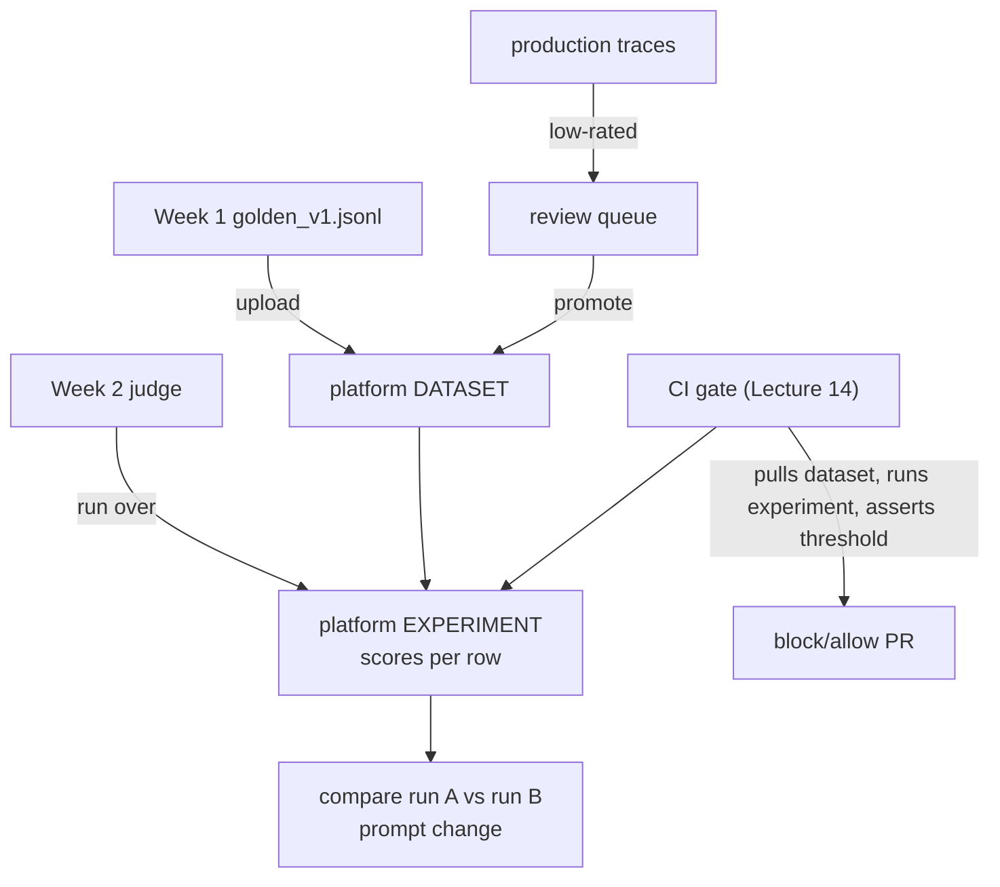

# Lecture 11: Observability Platforms — Langfuse, Phoenix, and Hosted Options

> Lecture 10 taught you to *emit* OpenTelemetry spans; those spans have to land somewhere that stores, indexes, and renders them. That "somewhere" is an observability backend, and picking one is a real engineering decision with cost, privacy, and operational consequences — not a coin flip. This is a buyer's-guide lecture: it compares the four platforms you'll actually consider in 2025–2026 (Langfuse, Arize Phoenix, LangSmith, Braintrust) on the axes that matter, gives you an opinionated default, and walks the concrete standup for the two self-hosted options — `docker compose` for Langfuse (localhost:3000) and a single `pip`/`uv` container for Phoenix (localhost:6006), each with the OTLP exporter pointed at it. After this lecture you can choose a backend for a given situation and defend the choice, stand up either self-hosted option in under 15 minutes, read what each dashboard actually shows you, connect a platform's prompt-management and dataset features to your golden set and CI gate, and reason about the ongoing operational cost of running one yourself.

**Prerequisites:** Lecture 10 (OTel GenAI tracing, OTLP export, `gen_ai.*` attributes), basic Docker / `docker compose`, comfort with `pip`/`uv`, and you have a Week 1 golden set and a Week 2 judge in mind. · **Reading time:** ~28 min · **Part of:** Evaluation, Testing & Observability — Week 3

## The core idea (plain language)

An observability backend does four jobs: **ingest** spans (over OTLP or a native SDK), **store** them (a database plus blob storage for large prompts), **index** them so you can search and aggregate, and **render** them as trace trees, cost/latency charts, and eval tables. Lecture 10's whole argument — instrument once in OTel, render anywhere — means the *ingest* side is a solved, portable interface. What differs between platforms is everything after ingest: how good the UI is, whether it also manages prompts and datasets and experiments, whether it runs on your laptop or someone else's cloud, and who can see your users' data.

The single most important fact for reducing the stakes of this choice: **all four platforms ingest OpenTelemetry.** Langfuse and Phoenix are OTLP-native; LangSmith and Braintrust both accept OTel traces (in addition to their own SDKs). So the instrumentation you wrote in lecture 10 is portable, and **the choice is reversible** — you can start on self-hosted Phoenix this week, move to Braintrust when your team grows, and change roughly one environment variable (the OTLP endpoint plus auth headers). This is why you should not agonize: pick a sensible default, ship, and re-decide later with real usage data.

The **opinionated default** for this course and for most solo/small-team learning:

- **Self-host Langfuse or Phoenix** for learning, local development, and any situation where data privacy matters (regulated data, PII, or you simply don't want prompts leaving your machine). Zero per-trace cost, full data control, and you learn how the plumbing works.
- **Reach for Braintrust or LangSmith** when a *team* needs polished hosted experiment tracking and collaboration — shared eval dashboards, PR-style experiment comparisons, and no one on the hook for running Postgres. You trade money and some privacy control for zero ops and a more refined eval UI.

Between the two self-hosted options: **Phoenix** is the lighter-weight, get-started-in-one-command choice (a single container, OTel-native, superb for local dev and notebooks). **Langfuse** is the heavier but more complete choice (multi-container, but adds first-class **prompt management**, **datasets/experiments**, and user-feedback capture that connect directly to your golden set and CI gate). If you want the smallest thing that shows a trace tree, Phoenix; if you want the thing you can grow into a production eval + prompt-versioning workflow, Langfuse.

## How it actually works (mechanism, from first principles)

### The four platforms on the axes that matter

| Axis | Langfuse | Arize Phoenix | LangSmith | Braintrust |
|---|---|---|---|---|
| License / model | OSS (self-host) + cloud | OSS (self-host) + cloud (Arize AX) | Hosted (self-host on enterprise tier) | Hosted (self-host on enterprise tier) |
| Where data lives | **your infra** or their cloud | **your infra** or their cloud | vendor cloud (mostly) | vendor cloud (mostly) |
| OTel ingest | native (OTLP) | native (OTLP) | yes (also native SDK) | yes (also native SDK) |
| Standup effort | `docker compose` (multi-container) | one container (`pip`/`uv`) | sign up, get API key | sign up, get API key |
| Prompt management | **strong** (versioned, labels) | basic | yes | yes |
| Datasets + experiments | **strong** | yes (OSS) | **strong** | **strong** (a headline feature) |
| Eval UI polish | good | good, dev-focused | polished | **very polished** |
| Cost | infra only (self-host) | infra only (self-host) | per-seat + usage | per-seat + usage |
| Best for | complete self-hosted eval stack | local dev, notebooks, quick tracing | LangChain-heavy teams, hosted | team experiment tracking + eval-heavy workflows |

Read the table as a decision tree, not a scoreboard. The first branch is **privacy / who runs it**: if prompts must not leave your control, you are in the left two columns (self-host Langfuse/Phoenix). Only if hosted-is-fine do the right two columns open up. The second branch inside self-hosting is **how much you want beyond tracing**: Phoenix if "just show me traces," Langfuse if "traces *and* prompt versions *and* datasets *and* feedback in one place."

A note on the vendor relationships so the landscape isn't confusing: Phoenix is the open-source project from **Arize**, whose larger commercial product is **Arize AX** — Phoenix is the piece you self-host for free. **LangSmith** is from the LangChain team but works with any stack (not just LangChain). **Braintrust** is an independent company whose product centers on evals and experiment tracking. All four converged on OTel ingest during 2024–2026, which is exactly what makes them interchangeable at the wire level.

### Why "OTel makes it reversible" is load-bearing (and its one caveat)

Because lecture 10's spans are standard OTLP with `gen_ai.*` attributes, switching backends is mostly a matter of changing where you point the exporter:

```
# Phoenix (local)
OTEL_EXPORTER_OTLP_ENDPOINT=http://localhost:6006
# Langfuse (local) — OTLP endpoint under /api/public/otel, plus auth headers
OTEL_EXPORTER_OTLP_ENDPOINT=http://localhost:3000/api/public/otel
OTEL_EXPORTER_OTLP_HEADERS="Authorization=Basic <base64(pk:sk)>"
# Braintrust / LangSmith (hosted) — vendor endpoint + API-key header
OTEL_EXPORTER_OTLP_ENDPOINT=https://<vendor-otel-endpoint>
OTEL_EXPORTER_OTLP_HEADERS="Authorization=Bearer <api-key>"
```

The caveat: **tracing is portable; the value-added features are not.** Your OTLP spans move for free, but a prompt you versioned in Langfuse's prompt manager, a dataset you built in Braintrust, or an experiment history in LangSmith are stored in *that platform's* schema. Migrating those means exporting and re-importing (all four have export APIs, but there's no universal format). So treat the trace stream as fully portable and the prompt/dataset/experiment artifacts as a softer lock-in — real enough to factor in, not so hard you can't leave.

### What each dashboard actually shows you

Every one of these platforms renders the same core objects from your spans; the vocabulary differs slightly but the mental model from lecture 10 carries over exactly.

- **Trace tree.** The nested span view: root request span with retrieval / tool / LLM child spans, each with duration and attributes. This is the "what did this one request do" view. All four have it.
- **Token / cost / latency panels.** Aggregations over `gen_ai.usage.*` and span durations: total cost over a window, cost broken down by model, tokens-per-request distribution, and the **p50/p95 latency** curve you learned to trust over the mean. This is the "what is my system costing and how slow is the tail" view.
- **Prompt versions** (Langfuse strongest; LangSmith/Braintrust have it; Phoenix basic). A registry where each prompt is a versioned artifact with labels like `production` / `staging`. You fetch the prompt by label at runtime, so you can change a prompt without a code deploy and every trace records which prompt *version* produced it.
- **Datasets & experiments.** A dataset is a stored collection of `{input, expected/criteria}` rows — i.e. **your golden set, living in the platform**. An experiment is one run of your system + judge over that dataset, stored with its scores so you can compare run-to-run (prompt A vs prompt B) in a table with score deltas. This is the same paired-comparison idea from Week 2, with a UI on top.

Here's how those objects connect to the artifacts you built in Weeks 1–2:



The platform is not a separate universe from your JSONL golden set — it's where that golden set becomes a queryable, comparable, UI-backed object, and where the **data flywheel** (Lecture 12) deposits new cases mined from production feedback.

### Standing up Langfuse (docker compose, localhost:3000)

Langfuse is several services — a Next.js web app, a worker, **Postgres** (metadata, traces), **ClickHouse** (high-volume analytics in current versions), Redis (queue/cache), and object storage (blobs). You do not wire these by hand; the repo ships a compose file.

```bash
git clone https://github.com/langfuse/langfuse
cd langfuse
docker compose up -d          # brings up web + worker + postgres + clickhouse + redis + storage
# wait ~30-60s, then open:
open http://localhost:3000    # create an account (local), a project, and API keys
```

You then create a project in the UI and copy its **public key** (`pk-...`) and **secret key** (`sk-...`). Point lecture 10's exporter at Langfuse's OTLP endpoint:

```bash
export OTEL_EXPORTER_OTLP_ENDPOINT="http://localhost:3000/api/public/otel"
# Langfuse authenticates OTLP with Basic auth = base64("pk-...:sk-..."):
export OTEL_EXPORTER_OTLP_HEADERS="Authorization=Basic $(printf 'pk-xxx:sk-xxx' | base64)"
# now Traceloop.init(app_name="llm-evals") from Lecture 10 sends spans to Langfuse
```

Run 30 requests through your system and the traces appear under the project, with the trace tree, token/cost/latency, and (if you adopt them) prompt versions and datasets.

### Standing up Phoenix (single container, localhost:6006)

Phoenix's headline is that it's *one* thing. Two equivalent ways:

```bash
# In-process / local, no Docker needed:
uv add arize-phoenix
python -m phoenix.server.main serve      # UI + collector at http://localhost:6006

# OR as a container:
docker run -p 6006:6006 arizephoenix/phoenix:latest
```

Phoenix listens for OTLP on the same host (HTTP on 6006; it also exposes the gRPC collector). Point the exporter at it:

```bash
export OTEL_EXPORTER_OTLP_ENDPOINT="http://localhost:6006"
# no auth needed for a local Phoenix; Traceloop.init(...) now streams spans here
```

Open `http://localhost:6006` and you get the trace tree and token/latency views immediately — no account, no keys, no Postgres. That minimal-friction property is exactly why Phoenix is the recommended *first* backend when you just want to confirm lecture 10's instrumentation is emitting correct spans.

### The self-hosting operational bill (what "free" actually costs)

Self-hosting has no per-trace license fee, but it is not free — you are now the operator. The recurring costs:

- **Postgres (and ClickHouse for Langfuse).** A real database you must back up, monitor, and occasionally tune. Phoenix can run on SQLite for local dev (trivial) or Postgres for anything shared; Langfuse always wants Postgres + ClickHouse. Losing this database loses your traces and datasets.
- **Storage growth.** Traces are *big* when you capture prompt/completion content. A rough order-of-magnitude: capturing full content, a chatty RAG trace can be **5–50 KB**. At 50,000 requests/day that's ~0.25–2.5 GB/day → **tens of GB/month** and climbing. Storage is the cost that sneaks up on you.
- **Retention policy.** Because storage grows without bound, you must set a retention window (e.g. keep detailed traces 30–90 days, keep aggregate cost/latency metrics longer). No retention policy = an ever-growing disk and an eventual outage. This ties back to lecture 10's sampling: sample detailed traces, keep unsampled counters for billing.
- **PII / data governance.** Self-hosting is *chosen* partly for privacy, but the traces still contain whatever you captured. If content capture is on, redact PII at write time (Presidio / regex), and know that your backend is now a data-governance surface subject to the same deletion/GDPR obligations as any user-data store.

The honest tradeoff: hosted platforms fold all of the above (backups, scaling, retention plumbing) into their per-seat/usage price. Self-hosting trades that dollar cost for your operational attention. For learning and privacy, that trade is worth it; for a busy team that would rather ship features than babysit ClickHouse, it may not be.

## Worked example

You're choosing a backend for a customer-support RAG bot handling **50,000 requests/day**, prompts contain customer PII, you're a solo engineer building toward a small team, and you want a CI eval gate. Walk the decision.

**Privacy branch.** Prompts contain PII → data must stay under your control → **self-host**. This eliminates hosted-only workflows on LangSmith/Braintrust cloud for the raw traces. (You could still use a hosted tool if you aggressively redact before sending, but why add that risk while learning?)

**Which self-hosted.** You want prompt versioning (to change the support prompt without a deploy) and datasets/experiments (to grow the golden set and run the CI gate against it) → **Langfuse** over Phoenix. Phoenix would be the pick if you only needed trace inspection during development.

**Cost sanity check (self-hosting).** Using illustrative content-on trace sizes:

```
traces/day        = 50,000
avg trace size    ≈ 10 KB   (content captured, redacted)
raw ingest/day    = 50,000 × 10 KB = 500 MB/day
per month (30d)   ≈ 15 GB/month of trace data
with 60-day retention, steady state ≈ 30 GB resident
```

30 GB of Postgres/ClickHouse + object storage is small — a modest managed database or a single VM handles it. The lesson: at 50k/day self-hosting is cheap on *infra*; the real cost is your time keeping it healthy and setting the 60-day retention so it doesn't become 300 GB by next year.

**Compare to hosted.** A hosted platform at, say, a per-seat + usage model would remove all ops but (a) send PII to a vendor unless you redact and (b) add a monthly bill that scales with traces/seats. For a solo learner, self-hosted Langfuse wins clearly. **Re-decide when the team hits ~4–5 engineers** who all need to share eval dashboards and compare experiments daily — at that point Braintrust/LangSmith's collaboration polish may be worth the money and the redaction discipline. Because everything is OTel, that later migration is an endpoint change plus a dataset export/import, not a rewrite.

**How the golden set flows in.** Upload `golden_v1.jsonl` as a Langfuse dataset. Your Week 2 judge runs over it as an "experiment," storing per-row scores. The CI gate (Lecture 14) pulls that dataset, runs the experiment, and asserts the aggregate score clears threshold — blocking a bad-prompt PR. Low-rated production traces (Lecture 12) get promoted into the same dataset as `golden_v2`. One platform, one dataset object, the whole flywheel.

## How it shows up in production

- **The "we can't send prompts to a vendor" meeting.** Legal/security vetoes a hosted tool three weeks into a pilot because prompts carry customer records. If you started self-hosted (Langfuse/Phoenix), you keep working; if you built everything on hosted LangSmith cloud, you're now migrating under pressure. Choosing self-host up-front for PII workloads avoids the fire drill — and OTel means even a forced migration is an endpoint swap, not a rewrite.
- **Storage surprise.** Six months in, the Langfuse Postgres/ClickHouse volume is 400 GB and queries are slow because nobody set retention. Fix: a retention policy (30–90 days detailed, longer for aggregates) and, ideally, sampling of detailed traces. This is the self-hosting cost that always arrives late.
- **The reversible bet paying off.** You prototyped on Phoenix (one container) to validate instrumentation in a day, then moved to Langfuse for prompt management once the app was real. Total migration cost: change the OTLP endpoint and re-upload the golden set as a dataset. The OTel portability from lecture 10 is what made a "wrong" first choice cheap.
- **Prompt change without a deploy.** Support team wants to soften the bot's refusal language. With Langfuse prompt management, you edit the `production`-labeled prompt version in the UI; the app fetches by label at runtime; every subsequent trace records the new prompt version. No code deploy, and you can compare experiment scores across versions to prove the change didn't regress accuracy — the versioning turns a risky edit into a measured one.
- **Team outgrows self-host.** Five engineers are Slacking screenshots of trace trees because the self-hosted UI has thin sharing/permissions. This is the signal to evaluate Braintrust/LangSmith — the collaboration and experiment-comparison UX is where hosted tools earn their price.

## Common misconceptions & failure modes

- **"I have to pick the perfect platform now."** No — OTel ingest makes the trace stream portable and the choice reversible. Pick a sensible default, ship, re-decide with real data. Agonizing is the mistake.
- **"Self-hosted means free."** It means no license fee. You pay in Postgres/ClickHouse ops, storage growth, backups, retention tuning, and your attention. Budget the *operational* cost, not just the (zero) software cost.
- **"Phoenix and Langfuse are basically the same."** Both self-host and speak OTel, but Phoenix optimizes for *one-container local-dev tracing* while Langfuse adds a fuller prompt-management + datasets + feedback stack across multiple services. Pick by how much beyond tracing you need.
- **"OTel portability means everything migrates for free."** Only the *traces* move for free. Prompt versions, datasets, and experiment histories live in each platform's own schema and require export/import to move — a softer but real lock-in.
- **"Hosted platforms are strictly better because they're polished."** They're better at *collaboration and eval UI polish* and at *not doing ops*. They're worse at *data control and cost* at scale. The right answer depends on team size and data sensitivity, not on which UI looks nicest.
- **"LangSmith only works with LangChain."** It's from the LangChain team but is stack-agnostic and ingests OTel; you don't need LangChain to use it.
- **Capturing full content and never redacting.** Whether self-hosted or not, prompt/completion content is PII. Redact at write time and set retention. Your backend is a data-governance surface (this is the same lesson as lecture 10, and it doesn't go away just because the box is yours).
- **No retention policy.** The single most common self-hosting failure: storage grows unbounded until the disk fills. Set retention on day one.

## Rules of thumb / cheat sheet

- **Default:** self-host **Phoenix** to validate instrumentation fast (one container, localhost:6006, no auth); self-host **Langfuse** when you want prompt management + datasets + feedback (`docker compose`, localhost:3000).
- **Go hosted (Braintrust / LangSmith)** when a *team* needs shared eval dashboards, experiment comparison, and zero ops — and the data sensitivity allows it (or you redact).
- **Privacy first branch:** PII in prompts → self-host (or aggressively redact before any hosted send).
- **Beyond-tracing branch:** just traces → Phoenix; traces + prompts + datasets + feedback → Langfuse.
- **Everything ingests OTel** → the choice is reversible; migrating traces is an endpoint + headers change. Don't over-invest in the first pick.
- **What migrates for free:** trace spans. **What doesn't:** prompt versions, datasets, experiment history (export/import).
- **Ports to memorize:** Langfuse **3000**, Phoenix **6006**. OTLP HTTP 4318 / gRPC 4317 still apply under the hood.
- **Self-hosting bill:** Postgres (+ ClickHouse for Langfuse) to back up, storage that grows ~tens of GB/month at 50k req/day with content on, a retention policy (30–90 days), and PII redaction. (All figures approximate — measure yours.)
- **The golden set lives as a platform *dataset*; a judge run is an *experiment*; the CI gate asserts the experiment score.** Same artifacts as Weeks 1–2, now queryable.

## Connect to the lab

Week 3's lab step 1 asks you to stand up *one* backend: Langfuse via `git clone && docker compose up -d` at localhost:3000, **or** Arize Phoenix via `uv add arize-phoenix && python -m phoenix.server.main serve` at localhost:6006. This lecture is how you choose between them (Phoenix to start fast, Langfuse for the fuller stack) and how you point lecture 10's `Traceloop.init(...)` exporter at whichever you picked. When the lab has you build the p50/p95-latency, cost, and token views (step 2) and later grow the golden set from feedback (steps 3–5), you're using this lecture's dashboard objects — trace tree, cost/latency panels, datasets — and the dataset/experiment plumbing that the Lecture 14 CI gate asserts against.

## Going deeper (optional)

- **Langfuse** — self-hostable OSS observability + prompt management + datasets. Root docs: `langfuse.com/docs`; repo: `github.com/langfuse/langfuse`. Search: `Langfuse self-host docker compose OpenTelemetry OTLP`.
- **Arize Phoenix** — OSS, OTel-native, single-container local dev. Root docs: `docs.arize.com/phoenix`; repo: `github.com/Arize-ai/phoenix`. Search: `Arize Phoenix quickstart OpenTelemetry tracing localhost 6006`.
- **LangSmith** — hosted (self-host on enterprise) tracing + experiment tracking. Root docs: `docs.smith.langchain.com`. Search: `LangSmith OpenTelemetry ingest datasets experiments`.
- **Braintrust** — hosted eval + experiment-tracking platform. Root docs: `braintrust.dev/docs`. Search: `Braintrust evals experiments OpenTelemetry`.
- **Prompt management concept** — search `Langfuse prompt management versioning labels production` for the fetch-by-label pattern.
- **Self-hosting operational guidance** — search `Langfuse self-hosting infrastructure clickhouse postgres retention` for the real production topology and retention/scaling notes.
- **Comparison framing** — vendor comparison posts go stale fast; search `LLM observability platform comparison 2026 Langfuse Phoenix LangSmith Braintrust` and weight primary docs over marketing pages.

## Check yourself

1. Your prompts contain customer PII and you're a solo engineer building toward a small team. Which branch of the decision do you take first, and which of the four platforms does it point you to?
2. You picked Phoenix to start but now need versioned prompts and a datasets/experiments workflow tied to your golden set. What do you switch to, and roughly what does the migration cost — given everything ingests OTel?
3. Name two things that migrate for *free* between platforms and two things that do *not*. What makes the difference?
4. A teammate says "self-hosting Langfuse is free, so it's obviously cheaper than Braintrust." Give three concrete recurring costs they're ignoring.
5. What is the difference between a platform **dataset** and a platform **experiment**, and how does each map to an artifact you built in Weeks 1–2?
6. Six months into self-hosting, the trace database is 400 GB and queries crawl. What single policy did the team most likely fail to set, and what's the fix?

### Answer key

1. Take the **privacy / who-runs-it branch first**: PII in prompts means data must stay under your control → **self-host**. Between the self-hosted options, "toward a small team" plus wanting prompt management and datasets points to **Langfuse** (Phoenix if you only needed trace inspection during dev). Hosted LangSmith/Braintrust cloud are ruled out for raw PII traces unless you aggressively redact.

2. Switch to **Langfuse**. Because all platforms ingest OTel, migrating the **trace stream** is essentially changing `OTEL_EXPORTER_OTLP_ENDPOINT` (plus Langfuse's auth headers). The extra work is re-uploading your golden set as a Langfuse **dataset** and re-running the judge as an experiment — export/import, not a rewrite. Cheap, which is the point of the reversible bet.

3. **Free to migrate:** the OTLP **trace spans** and the standardized `gen_ai.*` attributes / dashboard views built on them (both are portable by the OTel convention). **Not free:** **prompt versions**, **datasets**, and **experiment histories** — they live in each platform's own schema and need export/import. The difference is that traces ride a shared open standard, while the value-added artifacts use proprietary schemas.

4. (a) **Database ops** — Postgres (and ClickHouse for Langfuse) that must be backed up, monitored, and tuned; (b) **storage growth** — tens of GB/month at moderate volume with content capture on, requiring retention management; (c) **your operational time / PII governance** — redaction, retention policy, GDPR/deletion obligations. "No license fee" is not "no cost."

5. A **dataset** is a stored collection of `{input, expected/criteria}` rows — i.e. your **Week 1 golden set** living in the platform. An **experiment** is one run of your system + judge over that dataset with per-row scores stored for comparison — i.e. running your **Week 2 judge** and comparing prompt A vs B, which is the paired-comparison idea with a UI on top.

6. They failed to set a **retention policy**. Traces (especially with content captured) grow storage without bound; with no window they accumulate until the disk fills and queries slow. Fix: set retention (e.g. 30–90 days for detailed traces, longer for aggregate cost/latency metrics) and consider sampling detailed traces while keeping unsampled counters for billing-grade totals.
