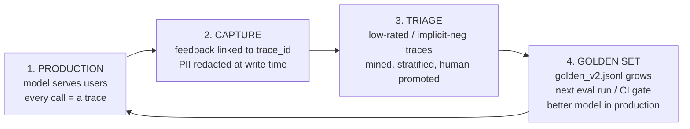

# Lecture 12: Feedback Capture and the Data Flywheel

> Every span, every token count, every cost attribute you instrumented in the last three lectures is dead weight unless it feeds a loop that makes your evals better. That loop is the data flywheel: production emits signal (a thumbs-down, a regeneration, an edit), you join that signal back to the exact trace that produced it, you triage the bad ones, and you promote the instructive failures into your golden set — which is exactly the artifact your CI gate and judge run against. This lecture builds that loop end to end. You will learn which feedback signals are trustworthy quality proxies and which are noisy or actively biased; you will build a `/feedback` endpoint that stores a rating *linked to a trace ID* (the single most important design decision in the whole system); you will redact PII at write time because traces and feedback are a data-governance surface an auditor will ask about; and you will write the flywheel query that routes low-rated traces into a review queue, plus the human triage step that promotes them into `golden_v2.jsonl`. The uncomfortable thesis you must internalize: **a flywheel that captures feedback but never schedules the promotion step is not a flywheel — it's a landfill.**

**Prerequisites:** Lecture 4 (golden sets — stratification, versioning, the `{id, input, expected?, criteria?, stratum, source}` schema), Lecture 11 (OpenTelemetry tracing — you have `trace_id`s flowing and a span tree). You can write a FastAPI endpoint, read/write JSONL, and run a scheduled job. · **Reading time:** ~30 min · **Part of:** Evaluation, Testing & Observability — Week 3

## The core idea (plain language)

You spent Week 1 hand-building a golden set of 50–100 cases mined from traces you read manually. That was the bootstrap. It does not scale, and it goes stale the moment production traffic drifts away from the inputs you sampled. The only sustainable way to keep an eval suite honest is to let production *tell you* where the model fails — continuously, cheaply, at the scale of real traffic — and to convert those failures into new eval cases on a schedule.

That is the flywheel. Four stations, turning forever:



The flywheel metaphor is precise: each turn takes energy (someone must triage), but a well-built loop accumulates momentum — every real failure you promote makes the next regression easier to catch, which makes the model better, which surfaces subtler failures, and so on. The metaphor also warns you about the failure mode: a flywheel with a disconnected axle spins the input side (you collect thousands of thumbs-downs) while the output side (the golden set) never moves. All the energy is lost to heat.

Two things make or break the loop, and both are engineering decisions you get exactly one chance to make right at capture time:

1. **The join.** A rating with no `trace_id` is a number with no referent. "3.2 average stars" tells you morale; it does not tell you *which prompt, which retrieved context, which output* earned the 1-star. The trace ID is the foreign key that turns an opinion into a reproducible eval case.
2. **Redaction at write time.** Traces already contain user prompts (often PII); feedback comments contain more. The moment you persist that to a queue that humans will read and that may live for months, you have created a governance surface. Redact *before* the bytes hit disk, not "later, before we look at it."

## How it actually works (mechanism, from first principles)

### Explicit vs implicit signal — and why you need both

Feedback comes in two families, and confusing their reliability is where teams go wrong.

**Explicit feedback** is signal the user *deliberately* produces to tell you about quality: a thumbs up/down, a star rating, a "regenerate," a written correction, or an *edit* to the model's output before they use it. The user has consciously judged the output.

**Implicit feedback** is signal you *infer* from behavior the user produced for their own reasons, not to inform you: they copied the answer, they dwelled on it for 40 seconds, they immediately regenerated, they closed the tab, or the text they finally kept differs from what you showed them (edit distance).

Here is the core tension. Explicit feedback is **high-precision but low-volume and biased in who leaves it**. Implicit feedback is **high-volume but low-precision and confounded**. You need both because neither alone is sufficient: explicit gives you a trickle of clear signal, implicit gives you a flood of murky signal, and the flywheel wants volume *and* clarity.

Let's quantify the volume gap, because it's larger than intuition suggests.

### The explicit-feedback response rate is brutal

Rule of thumb (approximate, varies wildly by product and how hard you nudge): **1–5% of interactions get any explicit rating**, and of those, the distribution is bimodal — people rate when delighted or furious, rarely when the answer was merely fine. On 10,000 daily interactions you might see 100–500 ratings, skewed toward extremes.

That skew is **selection bias**, and it's not a rounding error — it structurally distorts what you learn:

- **Squeaky-wheel bias.** Angry users rate at higher rates than satisfied ones. Your thumbs-down pile over-represents a vocal minority. A raw "18% thumbs-down" does *not* mean 18% of outputs are bad.
- **Silent majority.** The user who got a perfect answer, copied it, and moved on left you nothing. Your explicit signal is blind to the successes, which is fine for mining failures (that's what you want) but fatal if you try to compute an *absolute* quality rate from it.
- **Grief-clicking / mis-clicks.** Some fraction of thumbs-downs are fat-fingers, rage at the topic rather than the answer, or "this is correct but I don't like the answer" (asking for a refund, the model correctly says no, thumbs-down). Expect single-digit-percent noise in the explicit channel.

The engineering consequence: explicit feedback is a **fantastic failure-mining stream** (each thumbs-down is a candidate hard case) and a **terrible absolute-quality metric** (never report "user satisfaction = 1 − thumbs_down_rate" to a PM as if it were calibrated). Use it to find cases, not to grade the system.

### Ranking implicit signals by reliability

Not all implicit signals are equal. Here's the engineering-honest ranking, most-reliable proxy first, with the confound that degrades each:

| Signal | What it (weakly) proxies | Primary confound / bias |
|---|---|---|
| **Edit-distance** (shown answer vs what user kept) | Answer was close-but-wrong; the diff *is* the correction | User edits for tone/personalization, not just correctness |
| **Regeneration** (user hits "try again") | Output was unsatisfactory | Curiosity ("what else could it say?"), non-determinism fishing |
| **Copy** (user copies the answer) | Answer was useful enough to take | People copy to *inspect/paste-and-fix* too; copy ≠ correct |
| **Explicit correction in next turn** | Prior turn was wrong ("no, I meant X") | Ambiguous whether model or user's first prompt was at fault |
| **Dwell time** | Long dwell = engaged reading… or confusion | Utterly confounded: long = careful read OR baffled; short = skim OR instant reject. The **weakest** proxy. |
| **Abandonment** (close tab, no action) | Gave up | Could be "done, satisfied" or "meeting ended." Nearly useless alone. |

The standout is **edit-distance between the answer you showed and the text the user actually kept/submitted**. This is the closest thing to a free labeled example in the entire stack: if you showed "The refund window is 14 days" and the user edited it to "The refund window is 30 days" before sending, you have (a) a strong negative signal *and* (b) the corrected reference answer, handed to you for free. That's a golden-set case that writes itself.

**Regeneration** is the workhorse implicit-negative for the flywheel because it's unambiguous *enough* and easy to capture: a user who regenerates was, at minimum, not satisfied with what they saw. It's the signal the Week 3 lab uses to route "implicit-negative traces" into the review queue.

**Dwell time** is where naive teams get burned. It feels quantitative and objective, so it's tempting to build "low dwell = bad answer" alerts. But dwell is bidirectionally confounded — a 2-second dwell might be an instant confident copy (good) or an instant "garbage, closing this" (bad); a 90-second dwell might be careful study (good) or bewildered re-reading (bad). Do not treat dwell as a quality proxy without pairing it with a directional signal (copy vs regenerate). On its own it's noise dressed as data.

### The join: why every signal must carry a trace ID

This is the mechanical heart of the lecture. When a user rates an output, the rating is worthless for evals unless you can answer: *"What exact prompt, system message, retrieved context, model snapshot, and parameters produced the thing they rated?"* That question is answerable **only** if the rating carries the `trace_id` of the generating call, and your tracing backend (Lecture 11) stored the full span tree under that ID.

Picture the two worlds:

```
WITHOUT the join:                    WITH the join:
{rating: 1, comment: "wrong date"}   {trace_id: "abc123", rating: 1, comment: "wrong date"}
        │                                     │
        ▼                                     ▼  join on trace_id
  "some answer, somewhere,           span tree "abc123":
   was wrong about a date"             ├─ input: "when is the refund window?"
   → un-actionable                     ├─ system_prompt: v3.2
                                       ├─ retrieved_context: [chunk_17, chunk_4]
                                       ├─ model: gpt-4o-2024-11-20
                                       ├─ output: "14 days"
                                       └─ → a complete, reproducible eval case
```

The right column is a golden-set case: you have the input, the expected (corrected) output, and — critically — the *context that led the model astray* (maybe `chunk_17` had stale policy text; now your failure is a retrieval bug, not a prompt bug, and you can only see that because you kept the context). The trace ID is the difference between "customers are unhappy" and "chunk 17 in the refunds namespace is outdated; here are 6 cases proving it."

The frontend contract is therefore: **the trace ID must round-trip.** When your app renders an answer, it must remember the `trace_id` that produced it (in component state, a data attribute, whatever) so that when the user clicks thumbs-down 30 seconds later, the feedback call carries that exact ID. If your UI throws the trace ID away after rendering, the entire flywheel is impossible to build later without re-architecting. Design this in from the first render.

### Why redact at *write* time, not read time

Traces contain prompts. Prompts contain whatever users type: names, emails, phone numbers, account numbers, health details. Feedback comments contain more ("this is wrong, my SSN is actually…"). The instant that lands in `review_queue.jsonl` — a file humans will open, that may be committed, backed up, shared with a labeling vendor, and retained for months — you have a data-governance liability whose blast radius grows with time.

"Redact at read time" (store raw, clean it up before a human looks) fails for a simple reason: **the raw bytes existed on disk, in backups, in the DB WAL, in your logs.** A breach or a subpoena reaches the raw store, not your good intentions. The only defensible design is to **redact before persistence** so the sensitive bytes never touch durable storage in the first place. This is the same principle as hashing passwords before writing them — you don't store the secret and promise to be careful.

Two implementation tiers:

- **Regex pass (cheap, fast, deterministic, incomplete).** Catches structured PII with reliable shapes: emails, phone numbers, credit-card/SSN patterns, IPs. Runs in microseconds, no dependencies. Misses names, addresses, and anything unstructured.
- **Microsoft Presidio (heavier, NER-based, catches unstructured PII).** Uses named-entity recognition plus recognizers to catch person names, locations, and context-dependent identifiers a regex can't. Costs a model load and tens of milliseconds per call. The standard open-source choice for this.

The pragmatic stance: run the regex pass *always* (it's free and catches the highest-risk structured identifiers), and add Presidio when your governance requirements demand name/location redaction or you handle regulated data. Redaction is lossy and imperfect — treat it as risk-reduction, not a guarantee, and pair it with access controls and retention limits on the queue file.

## Worked example — the endpoint, the flywheel query, the promotion

### Step 1 — the `/feedback` endpoint (the join + redaction)

```python
# src/feedback_api.py
import re, json, time, pathlib
from fastapi import FastAPI
from pydantic import BaseModel

app = FastAPI()
FEEDBACK_LOG = pathlib.Path("evals/feedback/feedback.jsonl")

# --- cheap regex redaction pass (always on) -------------------------------
_PATTERNS = {
    "EMAIL":  re.compile(r"[\w.+-]+@[\w-]+\.[\w.-]+"),
    "PHONE":  re.compile(r"\+?\d[\d\-\s().]{7,}\d"),
    "SSN":    re.compile(r"\b\d{3}-\d{2}-\d{4}\b"),
    "CARD":   re.compile(r"\b(?:\d[ -]?){13,16}\b"),
}
def redact(text: str) -> str:
    for label, pat in _PATTERNS.items():
        text = pat.sub(f"[{label}]", text)
    return text
    # For names/addresses, swap in Presidio here:
    #   AnalyzerEngine().analyze(...) -> AnonymizerEngine().anonymize(...)

class Feedback(BaseModel):
    trace_id: str          # THE JOIN KEY — non-optional on purpose
    rating: int            # 1..5 (or -1/+1 for thumbs) — low cardinality
    comment: str = ""
    signal: str = "explicit"   # "explicit" | "regenerate" | "edit" | "copy"

@app.post("/feedback")
def feedback(fb: Feedback):
    row = {
        "trace_id": fb.trace_id,
        "rating":   fb.rating,
        "comment":  redact(fb.comment),   # REDACT AT WRITE TIME
        "signal":   fb.signal,
        "ts":       time.time(),
    }
    with FEEDBACK_LOG.open("a") as f:
        f.write(json.dumps(row) + "\n")
    return {"ok": True}
```

Three design decisions worth calling out. `trace_id` is a required field with no default — a feedback row that can't join back is a bug, so make it structurally impossible to submit one. The comment is redacted *inside* the handler before the write, not in a downstream job. And `signal` lets the *same* endpoint absorb implicit events (the frontend posts `{trace_id, rating: 1, signal: "regenerate"}` when a user hits regenerate), so explicit and implicit signal land in one joinable store.

### Step 2 — the flywheel query (mining candidates)

Now the nightly-style job. It selects negative traces — explicit low ratings *or* implicit-negative signals — joins each back to its trace to recover input/context/output, redacts (again, defensively, in case the trace store wasn't redacted), tags/stratifies on entry, and appends to the review queue.

```python
# evals/flywheel.py  — run on a schedule (cron / GitHub Actions / Airflow)
import json, pathlib
from src.feedback_api import redact
from src.tracing import get_trace          # your Lecture 11 backend client

FEEDBACK = pathlib.Path("evals/feedback/feedback.jsonl")
QUEUE    = pathlib.Path("evals/data/review_queue.jsonl")

def is_negative(fb) -> bool:
    if fb["signal"] == "explicit":
        return fb["rating"] <= 2                    # 1–2 stars = negative
    return fb["signal"] in {"regenerate", "edit"}   # implicit negatives

def stratum_for(trace) -> str:
    # tag on ENTRY so the golden set stays balanced (see below)
    inp = trace["input"].lower()
    if trace.get("retrieved_context"):    return "rag"
    if any(t in inp for t in ("refund", "cancel", "billing")): return "billing"
    if len(inp) > 400:                    return "long_input"
    return "general"

def mine():
    seen = {json.loads(l)["trace_id"] for l in QUEUE.read_text().splitlines()} \
           if QUEUE.exists() else set()
    out = []
    for line in FEEDBACK.read_text().splitlines():
        fb = json.loads(line)
        if not is_negative(fb) or fb["trace_id"] in seen:
            continue
        trace = get_trace(fb["trace_id"])          # THE JOIN
        out.append({
            "trace_id": fb["trace_id"],
            "input":    redact(trace["input"]),
            "context":  [redact(c) for c in trace.get("retrieved_context", [])],
            "output":   redact(trace["output"]),
            "model":    trace.get("model"),
            "rating":   fb["rating"],
            "signal":   fb["signal"],
            "comment":  fb["comment"],              # already redacted at write
            "stratum":  stratum_for(trace),         # STRATIFY ON ENTRY
            "status":   "needs_triage",             # human step required
        })
        seen.add(fb["trace_id"])
    with QUEUE.open("a") as f:
        for r in out:
            f.write(json.dumps(r) + "\n")
    print(f"appended {len(out)} candidates to {QUEUE}")

if __name__ == "__main__":
    mine()
```

Numeric walk-through. Say last night's feedback log has 300 rows over 10,000 interactions (a 3% response rate). Of those 300: 210 are `rating >= 4` (ignore — you're mining failures, not successes), 60 are `rating <= 2`, and 30 are `signal: regenerate`. The `is_negative` filter keeps 90 candidates. Dedup against the existing queue removes, say, 15 already-seen trace IDs. You append **75 candidates**, each already tagged with a `stratum`. That's the raw ore. It is *not* yet golden — that's the next step, and skipping it is the cardinal sin.

### Step 3 — the human triage / promotion step (where the loop actually closes)

The queue is candidates, not eval cases. A human (you, on a weekly cadence) reads each candidate and decides its fate. Promotion is deliberate because most candidates are *not* worth promoting:

- **Genuine model failure, generalizable** → promote. Write the corrected `expected`, keep the `stratum`, bump into `golden_v2.jsonl`.
- **Duplicate of an existing failure mode** → skip (you already have ≥3 cases for it; don't flood the set with near-identical cases and unbalance it).
- **User error / mis-click / off-topic rage** → discard.
- **Correct answer the user disliked** (asked for a refund, got a correct "no") → discard, or promote as a *positive* anchor case so a future model doesn't "fix" it by caving.

```python
# evals/promote.py — the SCHEDULED human step (this is what closes the loop)
import json, pathlib
QUEUE  = pathlib.Path("evals/data/review_queue.jsonl")
GOLDEN = pathlib.Path("evals/data/golden_v2.jsonl")

rows = [json.loads(l) for l in QUEUE.read_text().splitlines()]
for r in rows:
    if r["status"] != "needs_triage":
        continue
    print(f"\n[{r['stratum']}] rating={r['rating']} signal={r['signal']}")
    print("INPUT: ", r["input"][:300])
    print("OUTPUT:", r["output"][:300])
    action = input("promote / skip / discard: ").strip()
    if action == "promote":
        expected = input("corrected expected answer (or blank for criteria): ")
        with GOLDEN.open("a") as g:
            g.write(json.dumps({
                "id":       r["trace_id"],
                "input":    r["input"],
                "expected": expected or None,
                "criteria": None if expected else input("criteria: "),
                "stratum":  r["stratum"],          # preserve balance tag
                "source":   "prod_mined",           # provenance for weighting
            }) + "\n")
        r["status"] = "promoted"
    else:
        r["status"] = action                        # skip | discard
QUEUE.write_text("\n".join(json.dumps(r) for r in rows))
```

From 75 candidates a typical triage might promote 12, skip 40 (duplicates of known modes), and discard 23 (user error, correct-but-disliked). Twelve new hard cases per week, mined from real failures, is a golden set that stays honest against drift. Note the loop just closed back to **Week 1's golden set** — `golden_v2.jsonl` is the same artifact your judge (Lecture 5) and CI gate (Lecture 13) run against. Provenance is stamped (`source: "prod_mined"`) so you can later weight or filter by origin, exactly as Lecture 4 prescribed.

### Why stratify on entry — the balance-drift failure

Here's the subtle trap that stratification-on-entry prevents. Suppose your billing prompt has a bug this month, so 70% of your thumbs-downs are billing questions. If you promote candidates blindly, `golden_v2` becomes 70% billing cases. Next month you fix billing — and now your eval suite is dominated by a solved problem, over-weights billing accuracy in every future score, and is blind to the RAG and long-input cases that are only 5% of the set. Your "golden set" has quietly become a billing-regression test.

Tagging each candidate with a `stratum` *on entry* lets the triage step enforce a cap ("no more than N new cases per stratum per cycle" / "keep each stratum at ≥3 and ≤ some ceiling"). The mined stream is bursty and correlated with whatever's broken *right now*; stratification is the counterweight that keeps the golden set a balanced sample of the *input distribution*, not a snapshot of this week's incident.

## How it shows up in production

- **The disconnected-axle team.** The most common real outcome: a team ships a slick thumbs-up/down widget, accumulates 50,000 ratings over six months, and has promoted exactly zero into evals because "triage" was never on anyone's calendar. The dashboard shows a satisfaction trend line; the golden set is still `v1`. All that captured signal is pure cost (storage, a governance surface, engineering time) with zero eval value. **Schedule the promotion step or don't build the capture.**
- **The missing trace ID discovered too late.** A team builds feedback capture in month 1, decides to build the flywheel in month 6, and discovers the frontend never round-tripped the trace ID — so six months of ratings can't be joined to anything. Rebuilding the frontend contract and back-filling is expensive-to-impossible. The trace ID must be designed in at first render.
- **The PII incident.** Raw prompts with customer emails and account numbers sit in `review_queue.jsonl`, which got committed to the repo / shared with a labeling contractor / included in a backup that was breached. Now it's a reportable data incident. Redact-at-write-time is the control that would have prevented it; "we were going to clean it before labeling" is not a defense.
- **Dwell-time false alarms.** A team wires "median dwell < 5s → quality alert" and pages on-call every time users get fast, confident, *correct* answers they copy instantly. Dwell without a directional pair (copy vs regenerate) generates noise, erodes trust in the alerting, and gets muted — taking the real alerts down with it.
- **Squeaky-wheel over-correction.** A PM reads "22% thumbs-down this week" as "22% of answers are broken" and triggers a fire drill. The real bad-output rate (measured properly on a random sampled eval, Lecture 13) is 4%; the thumbs-down pile just over-represents angry users. Explicit-rate is a mining stream, never an absolute quality metric.
- **Queue growth outpacing triage.** Mining appends faster than humans promote, the queue balloons to tens of thousands of rows, and triage becomes hopeless. Fix by sampling the mined candidates (triage a random N per cycle) and prioritizing by stratum-need, not by trying to review everything.

## Common misconceptions & failure modes

- **"More feedback is always better."** Volume without the promotion step is negative value — it's cost and governance risk with no eval payoff. The bottleneck is triage throughput, not capture volume.
- **"Thumbs-down rate is our quality metric."** No. It's selection-biased toward angry users and mis-clicks. It's a great *failure-mining stream* and a terrible *absolute-quality gauge*. Measure real quality with a sampled judge eval on random traffic, not with self-selected ratings.
- **"Dwell time tells us if the answer was good."** Dwell is bidirectionally confounded (careful read vs baffled re-read; instant copy vs instant reject). Never use it as a standalone proxy; pair it with a directional signal.
- **"We'll add the trace ID later."** The join key must round-trip from the moment you render an answer. Retrofitting it means rebuilding the frontend contract and losing all prior feedback's joinability.
- **"We'll redact before a human looks."** The raw bytes already existed on disk/backups/WAL. Redact *before* persistence or you have a durable liability. Redaction later protects nothing that already leaked.
- **"Promote every thumbs-down."** Most candidates are duplicates, user errors, or correct-but-disliked. Blind promotion floods the golden set with noise and unbalances strata. Triage is a filter, not a rubber stamp.
- **"The mined stream is a balanced sample."** It's the opposite — it's correlated with whatever is most broken right now (bursty, skewed). Stratify on entry and cap per-stratum promotions or your golden set becomes a regression test for last month's incident.
- **"Regeneration means the answer was wrong."** It means *unsatisfactory-enough-to-retry*, which includes curiosity and non-determinism fishing. It's a decent implicit-negative but noisier than an edit-distance correction.
- **"Redaction makes the data safe."** Redaction is lossy risk-reduction, not a guarantee (regex misses names; even Presidio misses context-dependent identifiers). Pair it with access controls and retention limits.

## Rules of thumb / cheat sheet

- **The join is non-negotiable:** every feedback signal carries a `trace_id`; make the field required so a non-joinable row is impossible to submit.
- **Round-trip the trace ID from first render** — the frontend must remember which trace produced the answer so a later click can attach it.
- **Redact at write time, always:** regex pass (email/phone/SSN/card/IP) unconditionally; add Presidio for names/addresses/regulated data. Never "redact before we look."
- **Explicit feedback = failure-mining stream, not a quality metric.** Expect ~1–5% response rate (approximate), heavily skewed to extremes and ~single-digit-% mis-clicks.
- **Implicit reliability ranking (best→worst):** edit-distance-to-kept-text > regeneration > copy > next-turn-correction > dwell > abandonment. Dwell alone is noise.
- **Edit-distance is the goldmine:** the diff between shown and kept text is both a negative signal *and* a free corrected reference.
- **Mine `rating <= 2` OR implicit-negatives** (regenerate/edit) into `review_queue.jsonl`; dedup by `trace_id`.
- **Tag `stratum` on entry** and cap promotions per stratum so the golden set stays balanced against the input distribution, not this week's incident.
- **Schedule the promotion step** (weekly cadence). Unscheduled = dead flywheel. This is the one rule that most often gets violated.
- **Stamp `source: "prod_mined"`** on promoted cases for later weighting/filtering, and keep versioning the golden set (`golden_v2`, `v3`, …).
- **Triage is a filter:** promote generalizable failures, skip duplicates, discard user-error / correct-but-disliked. Typical yield is a fraction (e.g. ~15%) of candidates promoted.

## Connect to the lab

Week 3's lab step 3 is exactly this loop. Build the FastAPI `/feedback` endpoint that stores `{trace_id, rating, comment, ts}` with PII redaction at write time; write `evals/flywheel.py` to query traces with `rating <= 2` (or implicit regenerate signals), redact, and append to `evals/data/review_queue.jsonl`; then manually promote a few candidates into `golden_v2.jsonl` — proving the loop closes back to Week 1. The Definition of Done requires at least one trace to travel feedback → review queue → golden set, so run the whole chain end to end at least once and confirm the promoted case is a genuine, stratified failure — not a mis-click.

## Going deeper (optional)

- **Microsoft Presidio** — the canonical open-source PII detection/anonymization library (analyzer + anonymizer, custom recognizers). Root domain `microsoft.github.io/presidio`. Search: `Microsoft Presidio PII anonymization`.
- **Langfuse feedback / scores docs** — how a production observability backend models user feedback as `scores` attached to traces (the trace-ID join, done for you). Root domain `langfuse.com`. Search: `Langfuse user feedback scores trace`.
- **Arize Phoenix annotations / feedback** — the OTel-native alternative's take on attaching human feedback to spans. Search: `Arize Phoenix annotations feedback spans`.
- **Hamel Husain, "Your AI Product Needs Evals"** — the practitioner canon on mining production data into evals; the flywheel is his mental model made concrete. Blog `hamel.dev`. Search: `Hamel Husain evals data flywheel`.
- **FastAPI docs** — request-body models with Pydantic (the `/feedback` endpoint pattern). Root domain `fastapi.tiangolo.com`. Search: `FastAPI request body pydantic`.
- **Chip Huyen, *AI Engineering* (O'Reilly, 2024)** — the sections on user feedback and continual learning frame the flywheel as the engine of iteration.

## Check yourself

1. A teammate proposes reporting "user satisfaction = 1 − thumbs_down_rate" as the headline quality metric on the exec dashboard. Give two distinct reasons this number is misleading, and say what explicit feedback *is* good for.
2. Why is the `trace_id` field on the `/feedback` endpoint required (no default), and what specifically becomes impossible if the frontend fails to round-trip it?
3. Rank these implicit signals from most to least reliable as a quality proxy, and name the confound that degrades the weakest: edit-distance-to-kept-text, dwell time, regeneration, copy.
4. Explain concretely why redacting PII "before a human reviews the queue" is insufficient, and what redact-at-write-time changes about the risk.
5. Your flywheel mines 80 candidates this cycle, 60 of which are billing questions (there's a billing-prompt bug this month). Why is promoting all 60 into `golden_v2.jsonl` a mistake, and what mechanism prevents it?
6. What is the single scheduling decision that most often turns a well-built capture pipeline into "dead weight," and why does the flywheel produce zero value without it?

### Answer key

1. (a) **Selection bias / squeaky-wheel:** angry users rate at far higher rates than satisfied ones, so the thumbs-down pile over-represents a vocal minority — 18% thumbs-down does not mean 18% of outputs are bad. (b) **Mis-clicks and correct-but-disliked:** some fraction of downs are fat-fingers or "the answer was correct but I didn't like it" (e.g. a correctly-denied refund). Explicit feedback is a great *failure-mining stream* (each down is a candidate hard case) but a terrible *absolute-quality metric* — measure real quality with a sampled judge eval on random traffic instead.
2. The rating is only useful for evals if you can recover the exact prompt/system-message/retrieved-context/model/output that produced it — that reproduction is possible only via the trace ID joining to the stored span tree. Making the field required makes a non-joinable (worthless-for-evals) row structurally impossible to submit. If the frontend doesn't round-trip the trace ID, feedback can't be joined to any trace, so it can never become a reproducible eval case — and retrofitting means rebuilding the frontend contract and losing all prior feedback's joinability.
3. Most→least: **edit-distance-to-kept-text > regeneration > copy > dwell time.** Edit-distance is best because the diff is both a negative signal and a free corrected reference; regeneration is a fairly unambiguous "unsatisfactory"; copy is weaker (people copy to inspect/fix, not only when correct); dwell is weakest. Dwell's confound is that it's **bidirectional** — long dwell can be careful reading *or* baffled re-reading, short dwell can be instant confident copy *or* instant reject — so it carries no directional quality information on its own.
4. The raw (unredacted) bytes already existed in durable storage — the queue file, DB write-ahead log, backups, and logs — the moment you persisted them. A breach, subpoena, or accidental share reaches that raw store regardless of your intent to clean it later; "we were going to redact before labeling" protects nothing already written. Redact-at-write-time ensures the sensitive bytes never touch durable storage at all (same principle as hashing a password before storing it), shrinking the blast radius to zero for the data that never landed.
5. The mined stream is correlated with whatever is most broken *right now* (bursty, skewed), not a balanced sample of the input distribution. Promoting all 60 makes `golden_v2` ~75% billing; once you fix the billing bug next month, your eval suite is dominated by a solved problem, over-weights billing in every future score, and is blind to under-represented strata (RAG, long-input). The mechanism that prevents it: **tag `stratum` on entry** and have the triage step **cap promotions per stratum** so the set stays a balanced sample.
6. **Failing to schedule the human promotion/triage step.** Capture, redaction, and the mining query can all be perfect, but if no one is on the calendar to promote candidates into the golden set, the review queue just grows while the golden set stays frozen — the loop's output side never moves. All captured feedback then costs storage, engineering time, and governance risk while producing zero new eval cases: the flywheel spins on the input side but the axle is disconnected, so no momentum (better evals → better model) ever accumulates.
