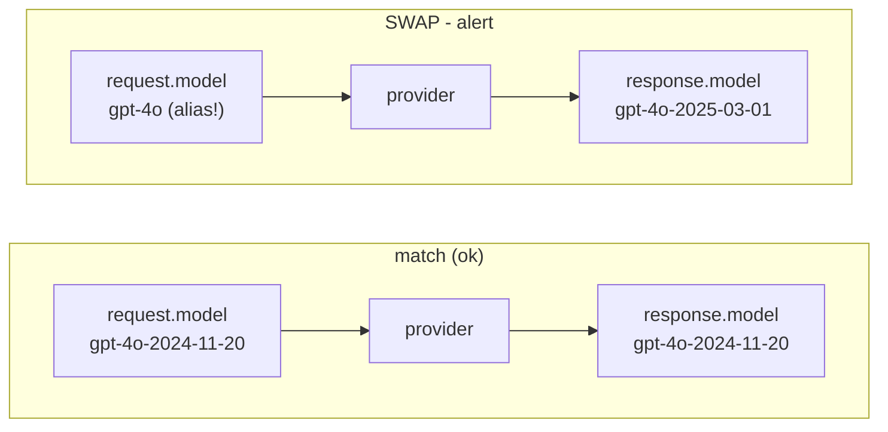
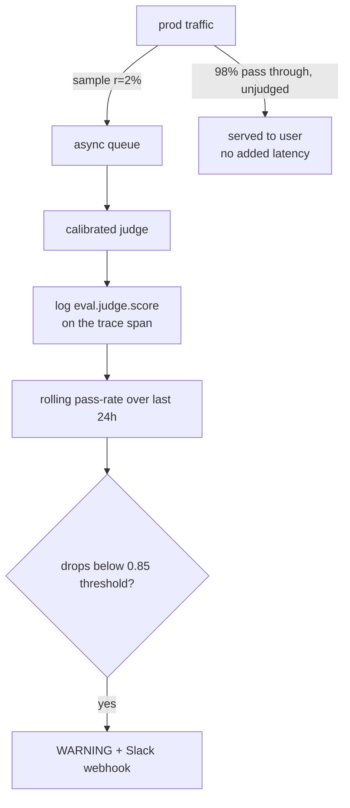

# Lecture 13: Drift, Silent Model Swaps, and Sampled Online Evals

> Your offline eval suite is green. Your CI gate passed. You shipped a week ago and haven't touched a line of code. And quality is quietly rotting anyway — because the model behind your `gpt-4o` alias got swapped for a new snapshot overnight, or because the questions real users type in March look nothing like the golden set you froze in January. Offline evals measure a *fixed* system against a *fixed* dataset; production is two moving targets. This lecture is about the class of decay that no pre-merge gate can ever catch, because the change happens *after* merge, in the world, underneath a codebase that never changed. You will learn the two threats — **silent model swaps** and **input/distribution drift** — the cheap deterministic detector for the first (pin dated snapshots, tag the resolved model, diff them on every trace), and the sampled-online-eval machinery for the second (run your calibrated judge on 1–5% of live traffic, track a rolling quality/cost metric, alert before users file the ticket). After this you can stand up a production quality tripwire that turns "we found out from an angry customer three weeks later" into "PagerDuty woke us up the same afternoon the snapshot rolled."

**Prerequisites:** Lecture 5 & 7 (you have an LLM-as-judge calibrated against humans, kappa ≥ 0.6). Lecture 8 (tiered cheap/expensive checks). Familiarity with OpenTelemetry GenAI spans and a backend (Langfuse or Phoenix) from this week's earlier material. You can read a JSONL golden set and call your provider SDK. · **Reading time:** ~30 min · **Part of:** Evaluation, Testing & Observability — Week 3

## The core idea (plain language)

Offline evaluation answers one question: *"Given this exact code, prompt, and model, how well does it do on this exact frozen dataset?"* That is exactly the question a CI gate should answer, and it's a good question. But it has three things nailed down that production nails down for you — the code, the model, and the input distribution — and in production, two of the three come loose.

**Threat 1 — the model changes underneath you.** You wrote `model="gpt-4o"` or `model="claude-3-5-sonnet-latest"`. That is not a model; it's a *pointer*. The provider is free to re-point it at a newer snapshot whenever they like, and they do. Or a teammate edits a config file, or a feature flag flips the default model, and now half your traffic runs on something you never evaluated. Your code diff is empty. Your git blame shows nothing. But the thing actually answering your users is different from the thing your golden set blessed. This is a **silent model swap**: the behavior shifts and there is no code change to point at.

**Threat 2 — the inputs change underneath you.** You mined your golden set from January traffic. Then marketing runs a campaign that brings a new user segment, a competitor launches and users start asking comparison questions, a new product ships and the vocabulary shifts, or it's simply tax season and the questions are all about deductions now. Your model and code are byte-for-byte identical, your golden set still scores 94%, and yet real-world quality is falling — because the golden set is now a museum piece that no longer resembles what people actually type. This is **input/distribution drift**: the system didn't change, the world did, and your frozen eval can't see it because it's frozen.

The unifying insight: **offline evals are necessary but structurally blind to post-merge decay.** The only way to catch decay in a live system is to *measure the live system* — sample real production traffic, judge it with the same calibrated judge you trust offline, and watch the number over time. That's the whole game: pin what you can (the model), and continuously measure what you can't pin (the traffic).

## How it actually works (mechanism, from first principles)

### Silent-swap detection: pin, tag, diff

The detector is almost embarrassingly simple, which is exactly why it works and why teams skip it. Three moves:

**1. Pin a dated snapshot in code — never a bare alias.** Providers expose two kinds of identifiers:

- **Aliases** that float: `gpt-4o`, `claude-3-5-sonnet-latest`, `gemini-1.5-pro`. These resolve to *whatever the provider currently points them at*.
- **Dated snapshots** that are (meant to be) immutable: `gpt-4o-2024-11-20`, `claude-3-5-sonnet-20241022`. These pin a specific frozen weights + config.

Rule: your code sends a dated snapshot. The alias is for the playground, never for the code path your eval blessed.

**2. Tag the *resolved* model on every trace.** Here's the subtlety that makes this a real detector and not just a coding convention: the model you *requested* and the model that *actually ran* are two different facts, and the gap between them is the bug. Every major provider returns the resolved model in the response body — OpenAI and Anthropic both echo back a `model` field on the completion. The OpenTelemetry GenAI conventions give you two attributes for exactly this reason:

- `gen_ai.request.model` — what you asked for.
- `gen_ai.response.model` — what the provider says actually answered.

Record both on the span. Now every trace carries ground truth about what ran.

**3. Diff the resolved model against your pinned constant, and alert on mismatch.** Keep the pinned snapshot as a single source of truth in code. On each trace (or on a rolling check over recent traces), compare:

```
if span["gen_ai.response.model"] != PINNED_SNAPSHOT:
    alert("SILENT MODEL SWAP", requested=PINNED_SNAPSHOT,
          resolved=span["gen_ai.response.model"])
```

That one comparison *is* your silent-swap detector. It fires in three real situations: (a) the provider silently re-pointed an alias you were still using somewhere; (b) a snapshot you pinned got deprecated and the provider fell back to a successor; (c) a config/env change swapped the model and nobody updated the pin. All three are invisible to git and invisible to offline evals. This check is the only thing standing between them and your users.



### Distribution drift: why the golden set goes stale

Drift is harder because there's no single field to diff — the "change" is a slow statistical shift in a stream of text. You detect it by watching **proxies** rather than measuring the abstract distribution directly:

- **Input-feature drift.** Track cheap features of incoming prompts over time: mean token length, language mix, embedding-cluster membership, topic tags, retrieval hit-rate. A sudden shift in any of these ("40% of queries now cluster near a centroid that barely existed last month") is a drift alarm. This is the classic ML-monitoring move — population stability index, KL divergence between last-week and this-week feature histograms — but you rarely need the fancy statistic; a plotted 7-day rolling mean of token length or top-topic share usually screams before any test does.
- **The definitive proxy: online quality itself.** The most honest drift signal is your judge score on live traffic trending down while your offline golden-set score stays flat. That divergence *is* drift: the system is unchanged (offline flat) but real-world quality is falling (online down). Which brings us to the main machinery.

### Sampled online evals: judging a slice of live traffic

You cannot judge 100% of production. Do the arithmetic. Suppose you serve 1,000,000 requests/day and your judge is one LLM call at ~$0.005 (a cheap judge model, one call, a few hundred tokens). Judging every request = 1,000,000 × $0.005 = **$5,000/day = ~$150k/month**, plus you've now *doubled* your LLM call volume and added the judge's latency to some path. That is absurd — you'd spend more evaluating the product than running it. Worse, it buys you almost nothing over sampling, because you don't need every data point to estimate a rate; you need enough to estimate it *tightly enough to act*.

So you **sample**: judge a random `r` fraction of traffic. Pick `r` by asking "how many judged samples per hour/day do I need for the rolling metric to be stable enough to alert on?" — a statistics question, not a "judge everything" reflex.

The mechanism:

1. **Sample.** For each production trace, with probability `r` (say 0.02 = 2%), enqueue it for judging. Use a random draw, not "every 50th request" (periodic sampling can alias with periodic traffic patterns). Do this **asynchronously, off the hot path** — the user's response already shipped; the judge runs in a background worker so it adds *zero* user-facing latency.
2. **Judge.** Run your Week-2 calibrated judge (the same rubric, same pinned judge model, kappa ≥ 0.6) on the sampled trace's input+output.
3. **Log the score as a span attribute.** Attach `eval.judge.score` (and `eval.judge.pass`) to the trace in Langfuse/Phoenix. Now the score lives next to the tokens, cost, and latency for that same request.
4. **Maintain a rolling metric.** Aggregate judged scores into a rolling window — e.g. pass-rate over the last 1,000 judged samples, or last 24h. This is the number you watch.
5. **Alert on threshold breach.** When the rolling pass-rate drops below a threshold (or cost/latency rises above one), fire a WARNING log and/or a Slack webhook.



### How much sampling is enough? A little probability

Your rolling pass-rate is an estimate of the true pass-rate `p` from `n` judged samples. The standard error is roughly `sqrt(p(1-p)/n)`. At a healthy `p ≈ 0.9`:

- `n = 100` judged samples → SE ≈ `sqrt(0.09/100)` ≈ **0.03** (±3 points). Noisy — a real 2-point drop hides in this.
- `n = 400` → SE ≈ **0.015** (±1.5 points). Usable.
- `n = 1,000` → SE ≈ **0.0095** (±~1 point). Tight enough to alert on a 3-point drop confidently.

So you don't need a *percentage* of traffic; you need an *absolute count* of judged samples per window. At 1M req/day, `r = 0.1%` already gives you 1,000 judged samples/day — plenty. At 1,000 req/day, even `r = 5%` gives you only 50/day, so you widen the window to a week or bump `r`. **The right sampling rate is the one that yields "enough judged samples per alerting window," and that's driven by your volume, not a magic percentage.** High-volume systems can afford a *tiny* `r`; low-volume systems need a larger `r` or a longer window.

## Worked example — a snapshot deprecation and a drift, both caught

**Setup.** A support-RAG bot. Code pins `PINNED = "gpt-4o-2024-11-20"`. Traffic ~20,000 req/day. Online eval samples `r = 5%` → 1,000 judged/day with the calibrated judge (kappa 0.71, pass = score ≥ 3 on the 1–4 rubric). Judge cost ≈ $0.004/call → 1,000 × $0.004 = **$4/day ≈ $120/month** for continuous quality monitoring. Rolling metric: 24h pass-rate. Alert threshold: pass-rate < 0.85 (baseline runs ~0.91) OR mean cost/req up >25% OR p95 latency up >30%.

**Day 1–14 (baseline).** Rolling pass-rate wobbles 0.89–0.92, comfortably above 0.85. Every trace's `gen_ai.response.model` reads `gpt-4o-2024-11-20`, matching the pin. Silent-swap check silent. All green.

**Day 15 — silent swap.** The provider deprecates `gpt-4o-2024-11-20` and transparently routes requests to `gpt-4o-2025-xx-xx`. Your code is unchanged; your git log is empty. But on the *first* trace after the rollover, `gen_ai.response.model` != `PINNED` → the diff check fires a WARNING and posts to Slack: *"SILENT MODEL SWAP: requested gpt-4o-2024-11-20, resolved gpt-4o-2025-xx-xx."* You know within minutes, before quality has even had time to visibly move — because you're diffing an exact string, not waiting on a noisy rolling average. You now decide deliberately: re-pin to the new snapshot after re-running your offline gate against it, or negotiate a longer deprecation window.

**Day 30 — distribution drift.** No swap this time — `gen_ai.response.model` still matches. But a product launch floods the bot with questions about a new feature the golden set never covered and the docs barely index. Offline golden-set score: still 0.94 (frozen museum). Online rolling pass-rate: slides 0.90 → 0.87 → 0.84 over four days, crosses 0.85 → WARNING. The *divergence* between flat-offline and falling-online is the drift fingerprint. You pull the low-scoring sampled traces (they're already logged with `eval.judge.score`), see they cluster on the new feature, and route them into the review queue → golden set v-next. The flywheel just turned.

Note what each detector caught that the other couldn't: the string-diff caught the swap *instantly and unambiguously* but says nothing about drift; the rolling judge caught the drift *statistically* but lags by days and would've been confused by the swap. **You need both.**

## How it shows up in production

- **The "nothing changed but everything's worse" ticket.** Support escalates that answers got vague this week. Eng swears no deploy went out — and they're right. It was a snapshot rollover. Without the resolved-model tag, this is a multi-day forensic nightmare ("was it us? the retriever? the data?"); with it, it's a one-line log entry timestamped to the minute the swap happened.
- **Cost drift riding alongside a swap.** A new snapshot often changes *pricing and verbosity*, not just quality. The swap that "improved" answers also made them 30% longer → output tokens up → cost/req up 30% silently. This is why your online monitor tracks **cost and latency next to quality**, not quality alone — a swap can hold quality flat while blowing your token budget, and only the cost line moves.
- **Alert fatigue kills the whole system.** If your threshold is too tight or your window too short, the rolling metric's natural noise (±3 points at n=100) trips the alert constantly, everyone mutes the channel, and the *real* drop three weeks later gets ignored. A muted alert is worse than no alert — it's false confidence. Set the threshold *below* normal noise-band variation, alert on *sustained* breach (e.g. below threshold for 2 consecutive windows, not one spike), and widen the window until the metric is stable.
- **Latency of detection is a design parameter, not an accident.** String-diff swap detection: seconds. Rolling-judge drift detection: hours to days (bounded by how fast you accumulate enough judged samples). Know which threats you can catch fast (swaps) and which are inherently laggy (drift), and don't expect the slow detector to catch the fast threat.
- **The judge itself can silently swap.** Painful irony: your *judge* is an LLM call too. If you left the judge on a bare alias, a judge-model swap moves your quality metric with zero change to the product — a phantom drift. Pin the judge snapshot as religiously as the product model, and version it in the logged score.

## Common misconceptions & failure modes

- **"Our CI gate passed, so production quality is fine."** The gate proves the *frozen* system is fine on the *frozen* set. It says nothing about the live model or live traffic, both of which move after merge. Offline green + online red is the exact signature this lecture exists to catch.
- **"`latest` is convenient and basically the same model."** It's a floating pointer the provider re-aims without telling you. Convenient until the morning behavior shifts under an empty git diff. Pin dated snapshots in code, full stop.
- **"We should just eval 100% of traffic to be safe."** You'd double your LLM spend and volume for a rate estimate that 0.1–5% sampling already gives you tightly. It's not "safer," it's wasteful — the marginal sample past ~1,000/window barely tightens the CI.
- **"Tag the requested model."** The requested model is what you *wanted*; it can't reveal a swap because it's just your own constant echoed back. You must tag `gen_ai.response.model` — the *resolved* one — or the diff is a tautology comparing a string to itself.
- **"A rolling-average dip will catch the swap."** Too slow and too noisy for a discrete event. The dedicated string-diff catches a swap in one trace; leaning on the judge average to notice loses you days and conflates it with drift.
- **"Set the alert threshold right at the baseline."** Then you page on every normal fluctuation and train everyone to ignore the channel. Threshold goes *below* the noise band, and you require a sustained breach.
- **"Online eval replaces offline evals."** No — they're complementary. Offline is your pre-merge gate on hard, curated, labeled cases; online is your post-merge canary on live, unlabeled, drifting traffic. Online failures *feed* the offline set; they don't replace it.

## Rules of thumb / cheat sheet

- **Pin dated snapshots in code, always** (`gpt-4o-2024-11-20`, `claude-3-5-sonnet-20241022`) — never `latest` or a bare family alias. Aliases are for the playground.
- **Tag both `gen_ai.request.model` and `gen_ai.response.model`** on every span. The *diff between them* is your silent-swap detector; alert on any mismatch.
- **Pin your judge model too** — a judge swap is a phantom drift. Version the judge snapshot in the logged score.
- **Sample 1–5% of prod for online judging** as a starting point; the real target is **~500–1,000 judged samples per alerting window**. High volume → tiny `r`; low volume → bigger `r` or a longer window.
- **Run the judge async, off the hot path.** The user's response already shipped; online eval must add zero user-facing latency.
- **Log `eval.judge.score` as a span attribute** so quality sits next to cost/tokens/latency on the same trace.
- **Monitor cost and p95 latency alongside quality** — a swap can hold quality flat while inflating tokens/cost/latency.
- **Threshold below the noise band; alert on sustained breach** (2+ consecutive windows), not a single spike. This is your anti-alert-fatigue rule.
- **Random sampling, not every-Nth** — periodic sampling can alias with periodic traffic.
- **Estimate noise before you set a threshold:** SE ≈ `sqrt(p(1-p)/n)`. At p≈0.9, n=1,000 → ±~1 point; n=100 → ±3 points.
- **Route low-scoring online traces into the review queue → golden set.** Online failures are the freshest, realest eval cases you have.

## Connect to the lab

Week 3's lab step 4 is this lecture made concrete: add the hook that judges a random ~5% of production traces with your Week-2 judge, logs `eval.judge.score` as a span attribute, and fires a WARNING (or Slack webhook) when the rolling online score drops below threshold *or* when the resolved `gen_ai.request.model` differs from the pinned snapshot. Test the swap detector deliberately by changing the pinned model constant and watching the alert fire — that's the Definition-of-Done check. The step-5 CI gate already pins the snapshot (`openai:gpt-4o-2024-11-20`); this lecture is why that pin matters at *runtime*, not just in CI.

## Going deeper (optional)

- **OpenTelemetry GenAI semantic conventions** — the source of truth for `gen_ai.request.model` / `gen_ai.response.model` and span structure. Root domain `opentelemetry.io`. Search: `opentelemetry semantic conventions gen ai spans`.
- **Langfuse docs** — scores/evaluation, dashboards, and alerting surface; how to attach a score to a trace and build a metrics dashboard. Root domain `langfuse.com`. Search: `langfuse scores online evaluation dashboard alerts`.
- **Arize Phoenix docs** — OTel-native tracing, online evals, and drift monitoring in local dev. Root domain `arize.com` (Phoenix docs). Search: `arize phoenix online evals drift monitoring`.
- **Provider model-deprecation pages** — OpenAI and Anthropic both publish snapshot/deprecation schedules; read them so a deprecation never surprises you. Search: `openai model deprecations` and `anthropic model deprecations`.
- **Population Stability Index / drift monitoring** — classic ML-monitoring technique for input-feature drift, directly transferable to prompt features. Search: `population stability index drift detection` and `evidently ai data drift`.
- **Chip Huyen, *AI Engineering* (O'Reilly, 2024)** — the monitoring/observability chapter for the production-decay mental model and the offline-vs-online distinction.

## Check yourself

1. Your code hasn't changed in three weeks and offline evals are green, yet users report worse answers. Name the two distinct causes this lecture covers and how each is invisible to a CI gate.
2. Why must you tag `gen_ai.response.model` (resolved) rather than `gen_ai.request.model` (requested) to detect a silent swap? What would tagging only the requested model give you?
3. You serve 2,000,000 requests/day. Your judge costs $0.005/call. Estimate the monthly cost of judging 100% vs judging a 0.5% sample, and explain why the sample buys you nearly the same alerting power.
4. At a true pass-rate of ~0.85, roughly how many judged samples do you need for a standard error of ~1 point (±0.01)? Show the arithmetic with SE ≈ sqrt(p(1−p)/n).
5. Give a concrete scenario where the silent-swap detector fires but the rolling-judge metric stays flat, and one where the rolling-judge metric drops but the swap detector stays silent. Why do you need both?
6. Your online alert has fired eight times this week and the team has muted the channel. Name two specific configuration changes that reduce this false-alarm rate without hiding a real regression.

### Answer key

1. **Silent model swap** (the provider re-points an alias, a snapshot is deprecated, or a config edit changes the model — behavior shifts with no code diff) and **input/distribution drift** (real traffic diverges from the frozen golden set — the world changed, the system didn't). A CI gate evaluates a *fixed* code+model against a *fixed* dataset before merge; both causes act *after* merge, on things the gate holds constant, so neither is visible to it.
2. The requested model is your own constant echoed back — comparing it to your pin is a tautology (string equals itself), so it can never reveal a swap. The *resolved* `gen_ai.response.model` is what the provider says actually ran; when it differs from your pin you have caught a swap. Tagging only the requested model tells you what you *asked for* and nothing about what executed.
3. 100%: 2,000,000 × $0.005 = $10,000/day ≈ **$300k/month** (and doubled call volume). 0.5% sample: 10,000 judged/day × $0.005 = $50/day ≈ **$1,500/month**. The sample yields ~10,000 judged samples/day — far past the ~1,000 needed for a ±1-point estimate — so its alerting power is essentially identical; the other 99.5% of judgments are wasted spend that barely tighten the CI.
4. SE ≈ sqrt(0.85 × 0.15 / n) = sqrt(0.1275 / n). Set = 0.01 → 0.0001 = 0.1275/n → n = 0.1275 / 0.0001 = **1,275 judged samples**. So roughly ~1,300 samples per alerting window gives a ±1-point standard error.
5. **Swap fires, judge flat:** a snapshot deprecation reroutes to a successor with near-identical quality but the resolved string changed — the diff catches it in one trace while the pass-rate never moves. **Judge drops, swap silent:** a product launch shifts the input distribution; the model string is unchanged (no swap) but online quality slides over days. You need both because they catch orthogonal, differently-timed threats — a discrete instant event (string-diff, seconds) and a slow statistical shift (rolling judge, days).
6. Any two of: (a) move the threshold *below* the normal noise band instead of at the baseline; (b) require a *sustained* breach (below threshold for 2+ consecutive windows) rather than a single-window spike; (c) widen the rolling window / increase samples per window so the metric's standard error shrinks (fewer noise-driven crossings). Each cuts false alarms driven by natural sampling noise while still catching a real, sustained drop.
