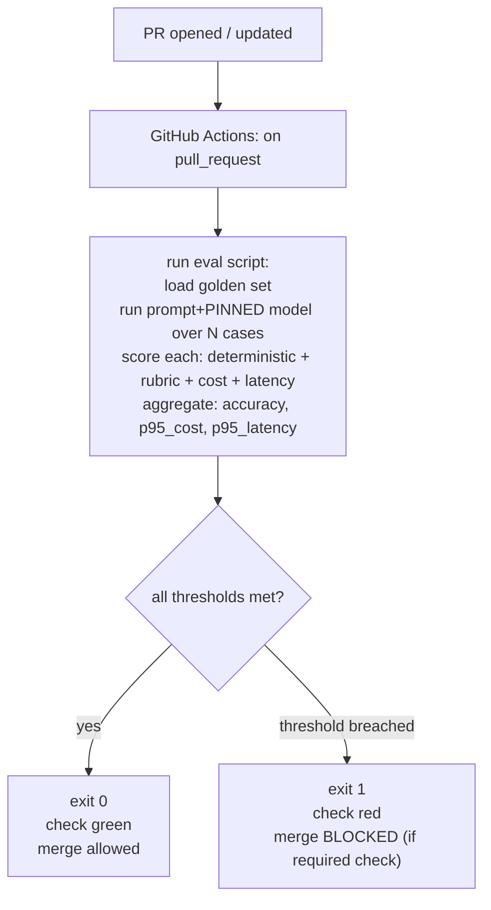

# Lecture 14: CI Eval Gates with promptfoo and pytest

> You have a golden set, a calibrated judge, and the numeracy to know a 2%-on-50 delta is noise. None of that stops a teammate from merging a prompt edit at 5pm on a Friday that quietly drops the "say I don't know" rule and starts hallucinating citations on Monday. This lecture closes that hole. You will learn to treat a prompt and its pinned model as a **versioned artifact with a pass threshold enforced in CI, exactly like a unit test** — so that a regression *cannot* reach `main` without a human overriding a red check on purpose. You'll build it two ways: the batteries-included **promptfoo** path (a YAML config that runs your golden set, asserts quality/cost/latency, and exits non-zero on failure) and the **pure-Python pytest** path (load golden set → run judge → assert `accuracy >= THRESHOLD and p95_cost <= BUDGET`). You'll wire either into GitHub Actions on `pull_request`, and you'll finish by opening a deliberately-broken PR and watching the merge get blocked — the milestone's proof-of-life.

**Prerequisites:** A versioned golden set (Week 1), an LLM-as-judge with structured output (Lectures 5–7), bootstrap CIs (Lecture 9), a GitHub repo with Actions enabled, and a provider key. Comfort with `pytest`, YAML, and basic GitHub Actions. · **Reading time:** ~30 min · **Part of:** Evaluation, Testing & Observability — Week 3

## The core idea (plain language)

A unit test asserts `add(2, 2) == 4`. If someone breaks `add`, CI turns red and the PR can't merge. An **eval gate** does the same thing for an LLM system, with two differences that make it harder:

1. **The output is non-deterministic and open-ended.** You can't assert string equality against a golden answer for a summarizer. So instead of `==`, you assert against a *rubric* ("is the answer grounded and correct per the criteria?") judged by an LLM, or against a deterministic check (contains a citation, is valid JSON, refuses when it should).
2. **Quality is not the only axis that can regress.** A prompt change can raise accuracy while *tripling* per-call cost or blowing p95 latency. A gate that only checks accuracy is a gate with a hole in it.

So the eval gate is a script that: loads your golden set, runs the current prompt+model against every case, scores each case (deterministic checks + LLM-rubric + cost + latency), aggregates into pass/fail, and **exits with a non-zero status code when the thresholds aren't met.** GitHub Actions runs that script on every pull request. A non-zero exit = a red check = a blocked merge (if you've made the check required in branch protection).

The whole lecture is three commitments you make and never break:

- **Pin the model snapshot** (`openai:gpt-4o-2024-11-20`, not `openai:gpt-4o`) so the gate measures *your* change, not a silent model swap on the provider's side.
- **Always assert cost and latency guardrails**, not just accuracy — because accuracy and cost move independently and you must catch both.
- **Tier the gate** so you don't pay for a 100-case LLM-judge run on every trivial PR: cheap deterministic checks on every push, expensive judge only on changed prompts or nightly.

## How it actually works (mechanism, from first principles)

### The exit code is the entire mechanism

CI is dumber than people think. GitHub Actions runs your steps; if any step's process exits non-zero, the job fails; if the job is a *required status check* in branch protection, the merge button is disabled until it's green. That's the whole enforcement model. Everything else — rubrics, thresholds, dashboards — exists to decide **what number to compare against a threshold and whether to `exit(1)`.**



Both promptfoo and pytest are just two ways to produce that exit code. promptfoo does it for you (it exits non-zero when any assertion fails). In pytest, a failed `assert` raises, the test fails, `pytest` exits non-zero — same outcome.

### Path A: promptfoo — declarative asserts over the golden set

promptfoo is a config-first eval runner. You describe *what* to test in `promptfooconfig.yaml`; it handles calling the provider, running assertions, and setting the exit code. A gate-ready config:

```yaml
# promptfooconfig.yaml
prompts:
  - file://prompts/current.txt          # the artifact under test
providers:
  - id: openai:gpt-4o-2024-11-20        # PINNED dated snapshot — non-negotiable
    config:
      temperature: 0                     # determinism where you can get it
tests: file://evals/data/golden.yaml     # your golden set, in promptfoo test format
defaultTest:                             # asserts applied to EVERY test case
  assert:
    - type: llm-rubric
      value: "{{criteria}}"              # per-case criteria field from the golden set
      provider: openai:gpt-4o-2024-11-20 # judge model, also pinned
    - type: cost
      threshold: 0.01                    # fail if a single call costs > $0.01
    - type: latency
      threshold: 5000                    # fail if a call takes > 5000 ms
```

Three assert types are doing the work:

- **`llm-rubric`** sends the model's output plus the `value` criteria to a judge model and asks for a pass/fail (this is your Lecture 5 judge, wrapped). Using `{{criteria}}` pulls the per-case criteria straight from each golden-set row, so every case is judged against *its own* rubric, not one global one.
- **`cost`** uses promptfoo's built-in token accounting (it knows the model's per-token price) to compute the dollar cost of the call and fails if it exceeds `threshold`.
- **`latency`** fails if wall-clock time for the call exceeds the threshold in milliseconds. Note: latency asserts are inherently noisy on shared CI runners — treat the threshold as generous (catch a 10x blowup, not a 20% wiggle).

Your golden set in promptfoo test format looks like:

```yaml
# evals/data/golden.yaml
- vars:
    question: "What is the return policy for opened electronics?"
    criteria: "States 30-day window AND that opened electronics incur a 15% restocking fee. Says 'I don't know' if unsupported."
- vars:
    question: "Do you ship to Canada?"
    criteria: "Answers yes/no grounded in policy; does not invent shipping costs."
```

Run it locally, then in CI:

```bash
npx promptfoo@latest eval -c promptfooconfig.yaml --no-cache
echo "exit code: $?"    # 0 if all asserts pass, non-zero if any fail
```

The `--no-cache` matters in CI: promptfoo caches provider responses by default, and you want the gate to reflect the *current* prompt+model, not a stale cached answer.

### Path B: pytest — full control, statistics included

When you want bootstrap CIs, custom aggregation (per-stratum accuracy), or a judge you've already built and calibrated, write the gate as a pytest. This is just your Lecture 9 stats harness with `assert` statements at the end:

```python
# tests/test_eval_gate.py
import json, pathlib
from src.system_under_test import run          # your prompt+PINNED model
from src.judge import judge_pass                # calibrated rubric judge
from evals.stats import bootstrap_ci

THRESHOLD = 0.85          # accuracy floor
BUDGET    = 0.01          # p95 per-case cost ceiling, USD
GOLDEN    = "evals/data/golden_v1.jsonl"

def load():
    return [json.loads(l) for l in pathlib.Path(GOLDEN).read_text().splitlines()]

def test_accuracy_and_cost_gate():
    cases = load()
    passes, costs = [], []
    for c in cases:
        out = run(c["input"])                    # returns {text, cost_usd, latency_ms}
        passes.append(1 if judge_pass(c, out["text"]) else 0)
        costs.append(out["cost_usd"])

    accuracy = sum(passes) / len(passes)
    _, lo, hi = bootstrap_ci(passes)             # 95% CI for context in the log
    p95_cost = sorted(costs)[int(0.95 * len(costs)) - 1]

    print(f"accuracy={accuracy:.3f} CI=[{lo:.3f},{hi:.3f}]  p95_cost=${p95_cost:.4f}")

    assert accuracy >= THRESHOLD, f"accuracy {accuracy:.3f} < {THRESHOLD}"
    assert p95_cost <= BUDGET,   f"p95 cost ${p95_cost:.4f} > ${BUDGET}"
```

Two design notes with production teeth. **Assert on p95 cost, not mean cost** — one runaway 8000-token answer is exactly the failure you want to catch, and the mean hides it. **Print the CI even though you assert on the point estimate** — when the gate fails, the log tells the reviewer whether they're `0.83 [0.71, 0.92]` (probably noise, re-run) or `0.62 [0.50, 0.73]` (genuinely broken).

### GitHub Actions wiring

The workflow is thin — it exists to run one of the above on `pull_request`:

```yaml
# .github/workflows/eval-gate.yml
name: eval-gate
on:
  pull_request:
    paths:                                    # tiering, part 1: only run when it matters
      - "prompts/**"
      - "src/**"
      - "evals/**"
      - "promptfooconfig.yaml"
jobs:
  eval:
    runs-on: ubuntu-latest
    steps:
      - uses: actions/checkout@v4
      - uses: actions/setup-node@v4
        with: { node-version: "20" }
      - name: promptfoo eval gate
        env:
          OPENAI_API_KEY: ${{ secrets.OPENAI_API_KEY }}
        run: npx promptfoo@latest eval -c promptfooconfig.yaml --no-cache --output results.json
      - uses: actions/upload-artifact@v4       # keep results as evidence
        if: always()
        with: { name: eval-results, path: results.json }
```

For the pytest path, swap the `setup-node` + promptfoo steps for `setup-python`, `uv sync`, and `uv run pytest tests/test_eval_gate.py`. The provider key comes from a repo secret (`secrets.OPENAI_API_KEY`), never from the config file.

**Critical last step, outside the YAML:** in GitHub → Settings → Branches → branch protection for `main`, mark `eval-gate` as a **required status check**. Without this, the check runs and goes red but the merge button still works — a green-checkmark theater with no enforcement. The required-check setting is what converts "we run evals" into "you cannot merge a regression."

## Worked example

Concrete numbers on a 60-case customer-support RAG golden set. Baseline prompt includes an output-format block and the rule *"If the policy documents don't cover it, say 'I don't know.'"*

**Baseline run (the PR that should pass):**

| Metric | Value | Threshold | Verdict |
|---|---|---|---|
| accuracy (rubric pass rate) | 0.90 (54/60) | ≥ 0.85 | ✓ |
| accuracy 95% CI | [0.80, 0.97] | — | context |
| p95 per-case cost | $0.006 | ≤ $0.01 | ✓ |
| p95 latency | 2100 ms | ≤ 5000 ms | ✓ |

All three thresholds met → `exit 0` → green → merge allowed.

**Regression PR (strip the "say I don't know" rule):** the diff is a one-line deletion — the kind that sails through review because it "looks like a cleanup":

```diff
  # prompts/current.txt
  You are a support assistant. Answer using ONLY the retrieved policy documents.
  Format: a one-sentence answer, then a bullet list of the exact policy clauses cited.
- If the policy documents don't cover the question, reply exactly: "I don't know."
```

With that rule gone the model now answers *everything*, inventing policy on the 9 cases whose correct answer was a refusal. Those 9 flip from pass to fail.

| Metric | Value | Threshold | Verdict |
|---|---|---|---|
| accuracy | 0.75 (45/60) | ≥ 0.85 | ✗ |
| accuracy 95% CI | [0.63, 0.85] | — | clearly below floor |
| p95 cost | $0.007 | ≤ $0.01 | ✓ |

Accuracy `0.75 < 0.85` → the `assert` fails → `pytest` exits non-zero → red check → **merge blocked.** The reviewer opens the artifact, sees the 9 newly-failing cases are all "should have refused," and immediately knows *what* broke.

**The subtle case that motivates the cost guardrail.** Suppose instead someone "improves" the prompt by appending *"Think step by step and show all reasoning before answering."* Accuracy nudges to 0.92 — a "win." But the reasoning dump pushes average completion length from ~200 to ~1400 tokens:

```
cost per call ≈ output_tokens × price_per_token
  before:  200  × $0.000010 = $0.0020
  after:  1400  × $0.000010 = $0.0140   → p95 now ~$0.015
```

p95 cost `$0.015 > $0.01` → gate fails **on the cost assert even though accuracy went up.** Multiply $0.013 extra × 2M calls/month = ~$26k/month you'd have shipped silently. This is the entire argument for guardrail asserts in one example.

## How it shows up in production

- **The un-pinned gate that flakes on Fridays.** Team pins nothing (`openai:gpt-4o`). The provider rolls the alias to a new snapshot mid-week; accuracy drops 4 points overnight with *zero code change*. CI goes red on an innocent PR, everyone assumes the eval is "flaky," and within two weeks someone removes the required-check enforcement "because it keeps failing for no reason." The gate is now decorative. Pinning the snapshot is what keeps the gate *trusted enough to stay enforced.*
- **Judge cost sneaks into the CI bill.** An LLM-rubric run over 100 cases with a strong judge is ~100 judge calls per PR. At 20 PRs/day that's 2,000 judge calls/day just for CI. Teams that don't tier this get a surprising eval line item and slow PRs (LLM calls are seconds each; 100 of them serially is minutes of CI). Tiering (below) fixes both.
- **Accuracy up, p95 latency up, users churn.** A retrieval tweak improves grounding but adds a re-ranking hop. Accuracy gate passes; nobody added a latency assert; p95 goes 2s → 6s; support-chat abandonment climbs. The regression was real and shippable-looking on the one metric they gated. Guardrails are not optional.
- **The gate that never blocked anything.** A gate you've never seen fail is a gate you can't trust — maybe the threshold is set below your worst case, maybe the required-check box is unchecked, maybe the judge always passes. The proof step (open a deliberately-worse PR and confirm it blocks) is not ceremony; it's the only evidence the gate works.

### Tiering: the cost-control pattern

Run cheap checks always; run the expensive judge selectively.

```
Every PR / every push:
  ├─ deterministic asserts (regex, JSON-schema, contains-citation,
  │  refuses-when-should)  — milliseconds, $0, no LLM calls
  └─ block on these

Only when prompts/** changed  OR  nightly cron:
  └─ full LLM-rubric run over the golden set  — the expensive tier
```

In GitHub Actions this is two jobs (or two workflows): a fast deterministic job with no `paths` filter, and the judge job gated by `paths: [prompts/**]` plus a nightly `schedule:` trigger. In promptfoo, split the config: deterministic assert types (`contains`, `is-json`, `regex`, `javascript`) in the always-run config; `llm-rubric` in the prompts-changed config. The nightly run catches drift the per-PR filter would miss (e.g., a model snapshot deprecation) without taxing every push.

## Common misconceptions & failure modes

- **"The gate makes CI deterministic."** No. Even at `temperature: 0`, LLMs and judges have residual non-determinism, and judges disagree with themselves ~5–15% of the time on borderline cases (approximate — measure yours). Set thresholds with *margin* below your baseline (if baseline is 0.90, gate at 0.85, not 0.89) so normal jitter doesn't cause false-red. Your Lecture 9 CI width tells you how much margin.
- **"llm-rubric replaces deterministic checks."** It complements them. If the answer must be valid JSON or must contain a citation, assert that *deterministically* — it's free, instant, and 100% reliable. Reserve the judge for the fuzzy quality question no regex can answer.
- **"Pin the model = safe forever."** Pinned snapshots get *deprecated* by providers. Your nightly run is also your early-warning that `gpt-4o-2024-11-20` is about to be retired, giving you weeks to re-pin and re-baseline instead of a surprise CI outage.
- **"A green gate means the change is good."** It means the change didn't regress *what you measured*. New failure modes outside your golden set sail through. The gate is a floor, not a ceiling — pair it with the flywheel (Week 3) that keeps growing the golden set from production failures.
- **Threshold set to the baseline exactly.** Gating at 0.90 when baseline is 0.90 means half your innocent re-runs go red on noise. Gate with margin.
- **Non-required check.** The single most common real-world failure: the workflow runs, shows red, and the merge goes through anyway because nobody ticked the branch-protection box. Verify enforcement, don't assume it.

## Rules of thumb / cheat sheet

- **Pin every model** (generator *and* judge) to a dated snapshot. `2024-11-20`, never `latest`.
- **Three asserts minimum:** quality (rubric or deterministic), **cost**, **latency**. Never accuracy alone.
- **Assert p95, not mean**, for cost and latency — you're hunting tail blowups.
- **Set thresholds with margin** below baseline (~1 CI half-width, from Lecture 9). Baseline 0.90 → gate 0.85.
- **Tier:** deterministic checks on every PR; LLM-judge only on `prompts/**` changes + nightly.
- **`--no-cache` in CI** (promptfoo) so the gate reflects the current artifact.
- **Make the check required** in branch protection — otherwise it's decorative.
- **Keys in `secrets.*`**, never in the committed config.
- **Save `results.json` as an artifact** every run — it's your merge-decision audit trail.
- **Prove it blocks** at least once with a deliberately-worse prompt; keep the failing-run link as milestone evidence.

## Connect to the lab

This lecture is the milestone core of Week 3, Lab step 5–6. You'll write `promptfooconfig.yaml` (pinned provider, golden-set tests, `defaultTest` asserts for llm-rubric + cost + latency) **and/or** the pytest gate (`accuracy >= THRESHOLD and p95_cost <= BUDGET` with a bootstrap CI in the log), then wire `.github/workflows/eval-gate.yml` to run on `pull_request`. The Definition of Done is behavioral: open a PR that strips the format instructions or the "say I don't know" rule, watch the Action go red and block the merge, confirm the baseline PR passes — screenshot both as evidence.

## Going deeper (optional)

- **promptfoo docs** — `promptfoo.dev` (docs cover assert types, `providers`, `defaultTest`, and CI usage). The canonical reference for Path A.
- **promptfoo GitHub repo** — search `promptfoo github` for example configs and the `assert` type catalog.
- **GitHub Actions docs** — `docs.github.com/actions` for `on: pull_request`, `paths` filters, `schedule:` cron, and secrets.
- **GitHub branch protection / required status checks** — in the same docs; search `github required status checks branch protection`.
- **pytest docs** — `docs.pytest.org` for parametrization (turn each golden case into its own reported test with `@pytest.mark.parametrize`, so CI shows *which* cases failed).
- **Hamel Husain, "Your AI Product Needs Evals"** — `hamel.dev`; the practitioner framing for why gates and golden sets beat vibes.
- **Chip Huyen, *AI Engineering* (O'Reilly, 2024)** — the evaluation chapters for the artifact-and-threshold mental model.
- Search queries: `promptfoo ci github actions`, `promptfoo llm-rubric assertion`, `pytest parametrize llm eval gate`, `github actions required status check block merge`.

## Check yourself

1. Mechanically, what single thing does GitHub Actions look at to decide whether to block a merge, and how do both promptfoo and pytest produce it?
2. You pin `openai:gpt-4o` (the alias, not a dated snapshot). Describe the concrete failure mode this causes weeks later, and who gets blamed.
3. A PR raises accuracy from 0.88 to 0.91 but your gate still fails. Give a realistic reason and the assert that caught it.
4. Your baseline accuracy is 0.90 with a 95% CI of ±0.06. Where should you set the gate threshold, and why not 0.90?
5. Explain the tiered gate: what runs on every PR, what runs only sometimes, and what problem does tiering solve?
6. Your `eval-gate` workflow runs on every PR and correctly goes red on a bad prompt, but the bad PR still got merged. What's the most likely cause?

### Answer key

1. **The process exit code.** A non-zero exit fails the CI job; if that job is a *required status check*, the merge is blocked. promptfoo exits non-zero automatically when any assertion fails; in pytest a failed `assert` raises, the test fails, and `pytest` returns a non-zero code. Everything else just decides *what to compare against a threshold*.
2. The provider silently rolls the `gpt-4o` alias to a newer snapshot with no code change on your side. Accuracy shifts (often down) overnight; CI goes red on innocent PRs; the team decides the eval is "flaky," stops trusting it, and eventually removes the required-check enforcement — so the gate is now decorative. Pinning a dated snapshot keeps the gate reproducible and trusted.
3. The prompt added a "show all reasoning" instruction that inflated output tokens; accuracy rose but **p95 cost (or p95 latency) breached its threshold**. The `cost` (or `latency`) assert caught it. This is exactly why accuracy-only gates are unsafe.
4. Around **0.84–0.85** — roughly one CI half-width (~0.06) below baseline. Gating at 0.90 means normal run-to-run judge/model jitter frequently dips below 0.90 and turns the check red on changes that didn't actually regress, training the team to ignore it. Margin absorbs noise while still catching a real drop.
5. **Every PR:** cheap deterministic checks (regex, JSON-schema, contains-citation, refuses-when-should) — milliseconds, $0, no LLM calls. **Only when `prompts/**` changed or on a nightly cron:** the full LLM-rubric run over the golden set (the expensive tier). Tiering controls **judge cost and CI latency** — you don't pay for 100 judge calls on a PR that only touched a README — while nightly still catches drift the per-PR path filter would miss.
6. The `eval-gate` check is **not marked as a required status check** in branch protection. It runs and shows red, but GitHub still allows the merge because nothing enforces the red check. Fix: Settings → Branches → require `eval-gate` to pass before merging.
