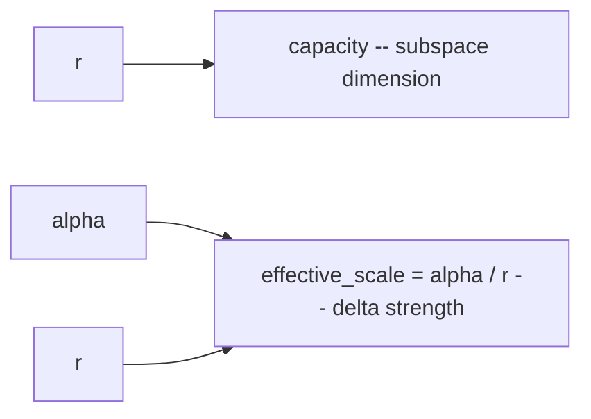

# Lecture 4: LoRA — Ranks, Targets, and the Adapter Lifecycle

> The Week 2 spine gives you four knobs (`r`, `alpha`, `target_modules`, `dropout`) and two verbs (hot-swap, merge) in a single paragraph. That paragraph hides an entire operational model. This lecture turns it into something you can *reason and debug* at 2am when your fine-tune underfits, your VRAM blows up on the last optimizer step, or your merged model produces garbage. After it you will be able to: set `r` and `alpha` deliberately (and predict what happens when you get their ratio wrong), choose `target_modules` from symptoms rather than superstition, size a LoRA adapter's parameter count in your head, and run the full adapter lifecycle — train tiny adapters, hot-swap them at inference, and merge them back into an fp16/bf16 base without corrupting it. You will also know why you *never* merge into a 4-bit base, and where rsLoRA and DoRA fit.

**Prerequisites:** Week 1 SFT mechanics (loss masking, chat templates, EOS), Phase 0 VRAM math (params × bytes + KV cache), basic matrix-shape arithmetic · **Reading time:** ~28 min · **Part of:** Phase 08 — Model Adaptation & Fine-Tuning, Week 2

---

## The core idea (plain language)

A 7B model has seven billion weights arranged as thousands of big matrices. **Full fine-tuning** rewrites all of them: it needs a gradient for every weight and an optimizer state for every weight, which is why it costs 12–20× the model's size in VRAM (you'll do that math next lecture). For almost every practical task that is absurd overkill — you are not trying to teach the model a new language, you're nudging its *behavior*: "always answer as strict JSON," "adopt this support-desk tone," "route this ticket to the right queue."

LoRA (Low-Rank Adaptation) makes a bet that turns out to be true: **the change you need to apply to each weight matrix is "small" in a specific, exploitable sense.** Instead of learning a full update matrix `ΔW` the same enormous size as the original weight `W`, you learn `ΔW` as the product of two skinny matrices, `A` and `B`, whose shared inner dimension `r` (the *rank*) is tiny — 8, 16, 32. You **freeze the entire base model** and train only `A` and `B`. At inference the layer computes `W·x + (B·A)·x` — the original frozen output, plus a small learned correction.

Three consequences fall straight out of this, and they are the whole reason LoRA dominates industry practice:

1. **Training is cheap.** You compute gradients and optimizer states for `A` and `B` only — typically **well under 1%** of the model's parameters. That's what lets a 7–8B model fine-tune on a free 15GB GPU.
2. **The result is tiny and portable.** The trained artifact is just `A` and `B` for each targeted layer — **a few megabytes to low tens of megabytes**, not gigabytes. You can email it.
3. **It's composable.** Because the base is untouched, you can load the base *once* and snap different adapters on and off (**hot-swapping**), or fold an adapter permanently into the base weights (**merging**) when you want zero inference overhead.

Everything else — the four knobs, the lifecycle rules, the failure modes — is refinement on top of that one substitution: *replace a huge learned matrix with the product of two small ones, and freeze everything else.*

---

## How it actually works (mechanism, from first principles)

### The injection

Pick a linear layer in the model — say the query projection `q_proj` in an attention block. It's a weight matrix `W` of shape `[d_out, d_in]`. In a Llama-3-8B-shaped model, `d_in = d_out = 4096`, so `W` holds `4096 × 4096 ≈ 16.8M` parameters. Normally the layer computes:

```
y = W · x
```

LoRA leaves `W` frozen and adds a parallel path built from two new matrices:

```
       A: [r, d_in]        B: [d_out, r]
       (down-projection)   (up-projection)

y = W·x  +  (alpha/r) · B·(A·x)
   └────┘    └──────┘  └──────┘
   frozen     scale    the learned low-rank delta
```

`A` squeezes the input from `d_in` down to `r` dimensions; `B` expands it back up to `d_out`. The product `B·A` has the same shape as `W` (`[d_out, d_in]`) but is *rank-limited* to `r` — it can only express corrections that live in an `r`-dimensional subspace. That constraint is the point: it's what keeps the parameter count and the capacity small.

**Parameter count of one adapter.** `A` has `r × d_in` params, `B` has `d_out × r`. For our 4096×4096 layer at `r=16`:

```
A: 16 × 4096 = 65,536
B: 4096 × 16 = 65,536
total = 131,072 params  ≈ 0.13M
```

The frozen layer had 16.8M. The adapter is **0.78%** of it. Multiply across all targeted layers and you land around **0.1–1% of total model params** trained — the headline number.

**Initialization matters and explains a subtle safety property.** `A` is initialized to small random values; `B` is initialized to **zero**. So at step 0, `B·A = 0`, the added path contributes nothing, and the model behaves *exactly* like the untouched base. Training then gently moves `B` away from zero. This is why LoRA fine-tunes start stable — you begin from the base model's exact behavior and drift, rather than jolting the model on the first step.

### The scaling factor and why `alpha/r` is the knob that surprises people

Notice the `alpha/r` coefficient on the LoRA path. This is the single most misunderstood thing in LoRA, so slow down here.

The **effective scale** applied to your learned delta is:

```
effective_scale = alpha / r
```

`alpha` is a fixed number you set; `r` is the rank. The library multiplies the low-rank output by `alpha/r` before adding it to the frozen path. The design intent: as you change `r`, `alpha/r` lets you keep the *magnitude* of the injected update roughly stable, so you don't have to re-tune your learning rate every time you change capacity.

Here's the trap. Suppose you run a good experiment at `r=16, alpha=32` → effective scale `32/16 = 2.0`. It works. Now a teammate says "let's add capacity, bump `r` to 64" and changes *only* `r`:

```
r=16, alpha=32  →  scale = 2.0     (your tuned run)
r=64, alpha=32  →  scale = 0.5     (4× weaker delta — silently!)
```

You didn't touch `alpha`, but the effective strength of your adapter dropped 4×. The model now underfits and you'll blame the rank ("more capacity made it *worse*?") when the real cause is that the update got quieter. The two common conventions exist precisely to avoid this:

- **`alpha = r`** → effective scale is always `1.0`, regardless of rank. Simple, predictable. Change `r` freely.
- **`alpha = 2r`** → effective scale is always `2.0`. A common, slightly "hotter" default.

If you follow one of these conventions and scale `alpha` *with* `r`, the surprise disappears. The failure mode is setting `alpha` to a magic constant once and then sweeping `r` underneath it. **Rule: treat `alpha/r` as the thing you actually control, not `alpha` alone.**



### Where the adapters go: `target_modules`

You don't put LoRA on every layer — you choose which linear projections get an adapter. The candidates in a transformer block:

**Attention projections** (start here):
- `q_proj`, `k_proj`, `v_proj` — build the queries/keys/values.
- `o_proj` — the output projection after attention.

**MLP / feed-forward projections** (add for more capacity):
- `gate_proj`, `up_proj`, `down_proj` — the big feed-forward matrices. In modern models these hold **most** of the parameters (the MLP is typically ~2/3 of a block's weights), so targeting them gives the biggest capacity jump — and the biggest VRAM cost.

The mental model:

```
too narrow  ──────────────────────────────  too wide
q,v only        q,k,v,o        + gate,up,down       all linears
   │                │                │                  │
underfit       balanced         high capacity       overfit /
(can't learn   default          (complex tasks,      VRAM blowup /
 the task)                       style transfer)      slow, wasteful
```

- **Too narrow** (e.g. only `q_proj, v_proj`, low `r`): the classic underfit. Train loss plateaus high, the model only half-learns your format, JSON-valid rate stays mediocre no matter how many epochs. The adapter simply doesn't have enough reach into the network to change behavior much.
- **Too wide** (all projections, high `r`, small dataset): overfitting and VRAM blowup. Train loss dives, eval loss turns *up*, the model memorizes your 400 examples and parrots them. And every added target module adds parameters, gradients, optimizer states, and activation memory — this is a leading cause of "it OOM'd and I don't know why."

The modern practical default, and what the Week 2 lab uses, is **attention + MLP** (`q,k,v,o,gate,up,down`) at a moderate rank. Attention-only is the conservative starting point when you're VRAM-constrained or the task is simple formatting; expand to MLP when the model underfits despite clean data and enough epochs.

### Dropout

`lora_dropout` applies standard dropout to the *input of the LoRA path* during training — it randomly zeros some activations feeding `A`, forcing the adapter not to rely on any single feature. It's a regularizer against overfitting, and it matters most on small datasets (exactly the LoRA regime). Typical values: **0.05–0.1**. Set it to `0.0` on large, diverse datasets where overfitting isn't the risk and you'd rather use all the signal. It costs nothing at inference (dropout is training-only).

---

## Worked example

You're fine-tuning **Qwen2.5-7B-Instruct** to emit strict ticket-routing JSON, on ~500 clean examples (the Week 1 dataset). Let's set every knob with reasoning, then size the adapter.

**Architecture facts** (7B-class): hidden size `d = 3584`, 28 layers, MLP intermediate `≈ 18944`. (Exact numbers vary by model; the point is the method.)

**Step 1 — rank.** 500 examples is a small dataset and the task (fixed output schema) is not that complex. Start at **`r = 16`**. High rank on small data is an overfit magnet; 16 is plenty of capacity for "learn a JSON shape and a routing policy."

**Step 2 — alpha.** Follow the `alpha = 2r` convention → **`alpha = 32`**, effective scale `32/16 = 2.0`. Now if you later sweep `r`, you'll scale `alpha` with it and keep the delta strength constant.

**Step 3 — target_modules.** Formatting/classification is a behavior task, not deep reasoning. Start with attention + MLP (`q,k,v,o,gate,up,down`) — the lab default — because underfitting a clean 500-example set is more annoying than a little extra VRAM here. If VRAM were tight you'd drop to attention-only first.

**Step 4 — dropout.** Small dataset → overfit risk → **`0.05`**.

```python
from peft import LoraConfig
cfg = LoraConfig(
    r=16,
    lora_alpha=32,                     # alpha = 2r  → effective scale 2.0
    target_modules=["q_proj","k_proj","v_proj","o_proj",
                    "gate_proj","up_proj","down_proj"],
    lora_dropout=0.05,
    bias="none",
    task_type="CAUSAL_LM",
)
```

**Step 5 — size the adapter (do this in your head).** Per targeted layer, adapter params `= r × (d_in + d_out)`.

- Attention `q/k/v/o` (each `3584 × 3584`): `16 × (3584 + 3584) = 114,688` params each × 4 = ~459K per layer.
- MLP: `gate` and `up` are `3584 → 18944`; `down` is `18944 → 3584`. Each: `16 × (3584 + 18944) = 360,448`. × 3 = ~1.08M per layer.
- Per layer total ≈ `459K + 1.08M ≈ 1.54M`. Across 28 layers ≈ **43M trainable params.**

Against 7B that's **~0.6%** — right in the expected band. Saved to disk in bf16, `43M × 2 bytes ≈ 86 MB`. That's your entire fine-tune: an ~86 MB file you can version, ship, and hot-swap. Compare to the 14 GB fp16 base it modifies.

**What you'd change on symptoms:**
- Eval loss won't drop, JSON-valid rate stuck at 80% after 3 clean epochs → *underfit* → bump `r` to 32 (and `alpha` to 64 to hold scale), confirm MLP is targeted.
- Train loss dives, eval loss climbs after epoch 1 → *overfit* → drop `r` to 8, raise dropout to 0.1, cut epochs, or get more data.

---

## How it shows up in production

- **Fleets of adapters over one base.** The killer operational pattern: you serve **one** fp16 base model in VRAM and keep dozens of task-specific adapters (each a few MB) on disk. A request for "tone: legal" attaches the legal adapter; the next request attaches "tone: support." Serving stacks like vLLM support multi-LoRA serving so different requests in the *same batch* use different adapters against a shared base. You pay for one big model's weights, not N. This is impossible with full fine-tunes (N full copies = N × 14 GB).

- **Storage and deployment cost collapse.** Ten specialized behaviors as full 7B fine-tunes = ~140 GB of artifacts to store, transfer, and load. As LoRA adapters = ~1 GB total, often much less. CI/CD for models becomes tractable: an adapter is a small file you can attach to a PR.

- **Hot-swap vs merge is a latency decision.** An *attached* adapter adds a small amount of compute per token (the extra `B·(A·x)` path) — usually negligible but nonzero, and it complicates batching. **Merging** folds `B·A · (alpha/r)` directly into `W` (`W_new = W + (alpha/r)·B·A`), producing a plain model with *zero* LoRA overhead at inference and no PEFT dependency. Rule of thumb: **hot-swap during development and for multi-tenant serving** (many adapters, one base); **merge for a single-purpose production endpoint** where you want the simplest, fastest artifact.

- **The merge-precision rule that will bite you.** You often *train* with a 4-bit quantized base (QLoRA — next lecture) to fit on a small GPU. But you must **merge into an fp16/bf16 base, never a 4-bit base.** Merging means adding your bf16 delta into the base weights; if the base is 4-bit, those weights are coarse, rounded approximations, and folding a precise delta into them compounds quantization error — you get a measurably worse or outright garbage model, silently. The correct pipeline: train adapter (4-bit base ok) → load the adapter against the **fp16/bf16** base → `merge_and_unload()` → *then* quantize the merged result for serving (Week 3). Never merge-then-worry; merge into full precision, quantize afterward.

- **Reproducibility and rollback.** Because the base is frozen and the adapter is small and named, "which model is in prod" becomes "base X + adapter v7." Rolling back a bad fine-tune is swapping an 86 MB file, not redeploying 14 GB. Incident response gets dramatically easier.

- **Catastrophic forgetting is *softened*, not solved.** Because LoRA localizes change to a low-rank delta on chosen layers, it damages general capability less than full FT — but it still can (Week 4). Adapters make forgetting cheaper to *test* (swap the adapter off, the base capability returns instantly for comparison), which is itself operationally valuable.

---

## Common misconceptions & failure modes

- **"Bigger `r` is always better."** No. Higher rank = more capacity = more VRAM *and* more overfitting risk on small data. On a few hundred examples, `r=64` frequently does *worse* than `r=16` — it memorizes. Rank is a capacity dial you match to data size and task complexity, not a quality slider you crank.

- **"`alpha` is the strength knob."** The strength knob is **`alpha/r`**. Setting `alpha` to a constant and then changing `r` silently rescales your update (the 4× surprise above). Always think in terms of the ratio; pin `alpha = r` or `alpha = 2r` and scale it with rank.

- **"More `target_modules` = strictly better."** Wider targeting adds capacity but also VRAM, training time, and overfit risk. Attention-only can underfit; all-linears-at-high-rank can overfit and OOM. Choose from symptoms: underfitting → widen/raise rank; overfitting/OOM → narrow/lower rank.

- **"I'll just merge my QLoRA adapter into the 4-bit base I trained on."** This is *the* classic corruption. Merging into a 4-bit base compounds quantization error and produces a degraded model. Merge into fp16/bf16, then quantize the merged model separately. (Called out explicitly in the Week 2 pitfalls.)

- **"The adapter didn't do anything — outputs look the same as the base."** Two usual causes: (1) effective scale collapsed because you changed `r` without `alpha`; (2) you underfit (too few epochs / too narrow targets / rank too low). Diagnose by generating with the adapter *attached* vs *detached* on the same inputs — if they're identical, the adapter is contributing nothing and it's a training problem, not a merge problem.

- **"Merged model gives different answers than the attached adapter did."** Merging should reproduce the attached-adapter outputs closely (small floating-point differences are fine; the Week 2 DoD asks for ≥18/20 identical). Large divergence usually means you merged into the wrong-precision base or a different base revision than you trained against. Base model version must match exactly.

- **"LoRA teaches the model new facts."** LoRA is still fine-tuning — it changes behavior/format/style, not knowledge (that's the whole phase's thesis). A low-rank delta is if anything *less* able to stuff in new facts than full FT. Use RAG for knowledge.

- **"Dropout will save an overfitting run on its own."** Dropout helps at the margin, but if `r` is too high for your data or you're running too many epochs, dropout won't rescue it. Fix capacity and epochs first.

---

## Rules of thumb / cheat sheet

- **Mechanism in one line:** freeze `W`, learn `ΔW = B·A` (rank `r`), inject as `y = W·x + (alpha/r)·B·A·x`. `B` starts at zero, so step 0 == base model.
- **`r` (capacity):** start **16**. Range **8–64**. Small data / simple task → 8–16. More capacity needed → 32–64, but watch overfit + VRAM. Higher `r` is *not* automatically better.
- **`alpha` (scale):** pin the ratio. **`alpha = r`** (scale 1.0) or **`alpha = 2r`** (scale 2.0). The number that matters is **`effective_scale = alpha/r`**. Scale `alpha` *with* `r` when you sweep rank.
- **`target_modules`:** start attention `q,k,v,o`. Add MLP `gate,up,down` for more capacity (this is where most params are). Symptom-driven: underfit → widen; overfit/OOM → narrow. Lab default = attention + MLP.
- **`lora_dropout`:** **0.05–0.1** on small data; **0.0** on large diverse data.
- **Adapter size:** per targeted layer, params `= r × (d_in + d_out)`. Typically **0.1–1% of model params**, a few MB to tens of MB on disk.
- **Hot-swap** for dev + multi-adapter serving (one base, many adapters). **Merge** (`merge_and_unload`) for single-purpose endpoints wanting zero overhead.
- **HARD RULE:** merge into an **fp16/bf16** base, **never a 4-bit base**. Train on 4-bit if you must; merge in full precision; quantize *after* merging.
- **Variants (awareness):** **rsLoRA** (rank-stabilized — rescales by `alpha/√r` so high ranks behave better) and **DoRA** (weight-decomposed — separates magnitude/direction, often better quality at similar cost). Know they exist; reach for them if vanilla LoRA plateaus. All approximate — measure on your eval.
- **Sanity check every run:** generate with adapter attached vs detached on the same 20 inputs. Identical → adapter is doing nothing (scale collapse or underfit).

---

## Connect to the lab

This lecture is the theory behind **Week 2, Lab tasks 3–5**. In **task 3** you'll set exactly these knobs (`r=16, alpha=32, dropout=0.05`, attention+MLP targets) for a QLoRA run and save the adapter — that's the config you just reasoned through above. In **task 4** you'll *hot-swap*: load the base, generate, attach the adapter, generate again, and diff to prove the adapter changes outputs (the "attached vs detached" sanity check). In **task 5** you'll *merge* with `merge_and_unload()` into a **bf16** base and confirm the merged model reproduces the adapter's outputs on the same 20 inputs — living proof of the merge-precision rule. The 4-bit base you train against comes from the next lecture (QLoRA); the merge-into-fp16-then-quantize pipeline previews Week 3.

---

## Going deeper (optional)

- **Hugging Face PEFT docs** (huggingface.co/docs/peft) — the canonical reference for `LoraConfig`, `get_peft_model`, `merge_and_unload`, adapter loading/saving, and the rsLoRA/DoRA flags (`use_rslora=True`, `use_dora=True`). Read the *LoRA* conceptual guide and the `LoraConfig` API page.
- **LoRA paper** — *"LoRA: Low-Rank Adaptation of Large Language Models"* (Hu et al., 2021). Read the *intuition* (low-rank deltas, which modules to adapt) — skip the heavy math. Search that exact title.
- **QLoRA paper** — *"QLoRA: Efficient Finetuning of Quantized LLMs"* (Dettmers et al., 2023) — for the 4-bit-base training story that motivates the merge-precision rule. Search the title.
- **DoRA paper** — *"DoRA: Weight-Decomposed Low-Rank Adaptation."* **rsLoRA** — *"A Rank-Stabilized Scaling Factor for Fine-Tuning with LoRA."* Search those titles; don't guess URLs.
- **Unsloth** GitHub repo and docs (`unslothai/unsloth`) — the fastest/lowest-VRAM way to run LoRA/QLoRA, with ready Colab notebooks and `save_pretrained_merged`. This is the Week 2 lab's recommended stack.
- **vLLM docs** (docs.vllm.ai) — the *multi-LoRA serving* pages, for the "one base, many hot-swapped adapters in a batch" production pattern.
- Search queries for hands-on depth: *"PEFT merge_and_unload example"*, *"QLoRA Unsloth Colab notebook"*, *"LoRA alpha rank ratio explained"*, *"vLLM multi-LoRA serving"*.

---

## Check yourself

1. At `r=8` on a `4096 × 4096` layer, how many parameters does the LoRA adapter add, and roughly what fraction of the original layer is that?
2. You had a good run at `r=16, alpha=32`. A teammate bumps `r` to 64 and leaves `alpha=32`. What is the new effective scale, and what symptom will you likely see?
3. Your fine-tune underfits: train loss plateaus high and JSON-valid rate is stuck despite clean data and 3 epochs. Name two knob changes and explain why each could help.
4. Why is `B` initialized to zero, and what nice property does that give you at the start of training?
5. State the hard rule about merge precision and explain *why* merging into a 4-bit base corrupts the model.
6. When would you hot-swap an adapter at inference versus merge it, and what's the trade-off?

### Answer key

1. `A` = `8 × 4096 = 32,768`; `B` = `4096 × 8 = 32,768`; total **65,536** params. The original layer is `4096 × 4096 ≈ 16.8M`, so the adapter is `65,536 / 16.8M ≈ **0.39%**` of it. (General formula: `r × (d_in + d_out)`.)

2. Effective scale = `alpha/r = 32/64 = **0.5**`, down from `32/16 = 2.0` — a **4× weaker** delta, even though nothing about `alpha` changed. Likely symptom: the model **underfits** and behaves closer to the base than your good run did; someone will wrongly conclude "more rank made it worse" when the real cause is the silently rescaled update. Fix: set `alpha` to 128 (to hold scale at 2.0) or pin `alpha = 2r` as a convention.

3. Two good moves: (a) **raise `r`** (e.g. 16 → 32) and scale `alpha` with it — more capacity in the low-rank subspace so the adapter can actually represent the needed change; (b) **widen `target_modules`** to include the MLP (`gate/up/down_proj`) if you were attention-only — the MLP holds most of the block's parameters, so adapting it gives the adapter far more reach into the network's behavior. (Also valid: confirm effective scale isn't collapsed, add epochs cautiously.)

4. `B` starts at **zero** so the LoRA path `B·A` outputs zero at step 0, meaning the model's output is *identical to the frozen base* before any training. Property: training **starts from the base model's exact behavior and drifts smoothly**, rather than jolting the model with a random delta on the first step — this makes LoRA runs stable and well-behaved from the start.

5. **Rule:** merge an adapter into an **fp16/bf16** base, **never a 4-bit base**; quantize *after* merging. **Why:** merging computes `W_new = W + (alpha/r)·B·A` — it adds your (precise, bf16) learned delta into the base weights. If `W` is 4-bit, those weights are coarse rounded approximations; folding a fine-grained delta into coarse values compounds the quantization error, degrading the model silently or producing garbage. Merge in full precision so the addition is accurate, then quantize the finished merged model for serving.

6. **Hot-swap** when you serve many tasks from one base (multi-tenant / multi-adapter serving) or during development — load the base once, attach/detach tiny adapters; cost is a small per-token compute overhead and more complex batching. **Merge** for a single-purpose production endpoint where you want the simplest artifact and **zero inference overhead** (a plain model, no PEFT dependency); cost is you bake in one adapter and lose the swap-ability. Trade-off: flexibility (hot-swap) vs. minimal latency and operational simplicity (merge).
