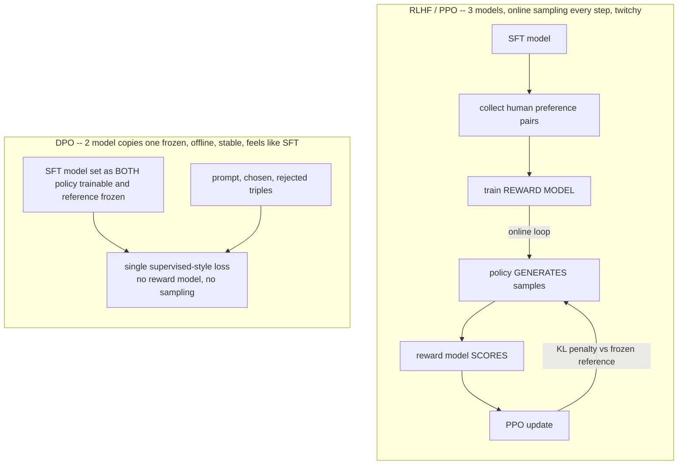

# Lecture 8: DPO — Preference Tuning After SFT

> SFT gets your model to produce *a* good answer. But "good" is not one thing — of two answers that are both correct, one is terser, safer, better-formatted, less likely to drift into a hallucinated tangent. SFT can't express that ranking; it only ever shows the model a single target per prompt and says "imitate this." Direct Preference Optimization (DPO) is how you teach the model *comparative* judgement — "this answer is better than that one" — cheaply, without a reward model and without an online reinforcement-learning loop. This lecture takes you from "DPO sharpens style" to being able to build the `(prompt, chosen, rejected)` data, reason about the one knob that matters (`beta`), read the DPO loss and reward-margin curves TRL prints, and — most importantly — anticipate the trap where DPO *wins on style while silently losing task accuracy*. After this you'll be able to run a DPO stage on top of your SFT adapter and know whether it actually helped or just felt like it did.

**Prerequisites:** Lecture 2 (SFT mechanics, chat templates, response-only loss), LoRA/QLoRA basics (Week 2), a working LLM-judge eval harness (Phase 7), simple probability (log-probabilities, sigmoid) · **Reading time:** ~24 min · **Part of:** Phase 08 — Model Adaptation & Fine-Tuning, Week 3

## The core idea (plain language)

SFT is imitation. For each prompt you hand the model one gold completion and minimize the cross-entropy of reproducing it. That's perfect for teaching *format* and *task shape* ("emit this JSON schema"), but it has a blind spot: it can't tell the model which of two *plausible* answers is preferable. Every alternative that isn't your single gold target is treated identically — as "not the target" — even the ones that are almost as good, and even the ones that are subtly toxic, verbose, or off-tone.

Preference tuning fixes exactly that blind spot. Instead of one target per prompt, you give the model a **pair**: a `chosen` response and a `rejected` response for the *same* prompt. The training objective is no longer "reproduce this string" but "make the chosen response more likely than the rejected one." That comparative signal is what sharpens the things SFT leaves fuzzy: tone, concision, safety refusals, strict formatting adherence, and — crucially — the suppression of **bad-but-plausible** outputs (the confident, well-formed answer that happens to be wrong or off-policy).

Historically you got this comparative signal via **RLHF**: train a separate reward model on human preferences, then use PPO (an online reinforcement-learning algorithm) to push the policy toward high-reward outputs while a KL penalty keeps it from drifting too far from the SFT model. It works, but it's three models, an online generation loop, and a stack of hyperparameters that are notoriously twitchy.

**DPO's insight:** you can skip the reward model *and* the RL loop entirely. There's a mathematical identity that lets you fold the reward model into a single supervised-style loss computed directly on preference pairs. No reward model to train, no online sampling, no PPO. It looks and runs almost exactly like SFT — same trainer ergonomics, same LoRA setup — which is why **DPO is the practical default** for preference tuning in 2025-2026. It covers something like 90% of industry preference needs at a fraction of the operational cost of PPO.

## How it actually works (mechanism, from first principles)

### What DPO optimizes

DPO needs two models: a **policy** (the one you're training, `π_θ`) and a frozen **reference** (`π_ref`, almost always your SFT model, weights frozen). For any response `y` to a prompt `x`, define an *implicit reward*:

```
r(x, y) = beta * log( π_θ(y | x) / π_ref(y | x) )
```

Read that in English: the reward for a response is how much *more likely the policy makes it than the reference does*, scaled by `beta`. If the policy hasn't moved yet (`π_θ == π_ref`), the ratio is 1, the log is 0, and every response has reward 0. As training makes some responses more likely (relative to the frozen reference) their implicit reward goes up; making others less likely drives their reward negative.

The DPO loss for one `(x, chosen y_w, rejected y_l)` triple is then just: push the chosen response's implicit reward *above* the rejected response's, through a sigmoid:

```
loss = -log σ( r(x, y_w) - r(x, y_l) )
     = -log σ( beta * [ logratio(y_w) - logratio(y_l) ] )
```

where `logratio(y) = log π_θ(y|x) - log π_ref(y|x)` and `σ` is the logistic sigmoid. That's the whole objective. No reward model — the reference model plays the role of the reward baseline. Minimizing this loss simultaneously does two things: it **raises** the chosen response's log-probability relative to the reference and **lowers** the rejected one's. The `π_ref` in the denominator is the anchor: it's what stops the model from just cranking up *every* probability and calling it a day.

### The reference model and the KL leash

Why is the frozen reference there at all? Because without it, DPO would happily shove the chosen response's probability toward 1.0 and wreck everything else the model knew — including the formatting and task competence SFT gave it. The reference model is a **leash**: the loss only rewards *relative* movement away from the reference, and `beta` sets how tight the leash is.

This is the KL-divergence penalty from RLHF, smuggled in through the denominator. `beta` is the coefficient on that penalty:

- **High `beta` (e.g. 0.3-0.5):** tight leash. Small log-prob margins already produce a large `beta * margin`, so the loss drops without the model moving far from the reference. Formatting and task accuracy are well-preserved, but the preference effect is gentle — you might barely shift behavior.
- **Low `beta` (e.g. 0.01-0.05):** loose leash. To drive the loss down, the model must create a *large* raw margin between chosen and rejected log-probs, which means moving *far* from the reference. This is where DPO "works" most dramatically on style — and also where it **breaks formatting, forgets the JSON schema, and tanks task accuracy** because it's drifted off the SFT distribution.

`beta ~ 0.1` is the standard starting point precisely because it's the middle of that trade-off.

### Contrast with RLHF/PPO (at a high level)



The operational difference is the whole reason DPO won as the default: no reward-model training run to babysit, no online generation (which is slow and where PPO instability lives), and a loss you can watch converge like any other supervised job.

### Reading the curves TRL prints

TRL's `DPOTrainer` logs a handful of metrics you *must* learn to read, because unlike SFT the loss value alone tells you almost nothing:

- **`loss`** starts at `-log σ(0) = -log(0.5) ≈ 0.693` (ln 2). That's your anchor: at step 0, policy == reference, margin == 0. If your DPO loss doesn't start near ~0.69, something is wrong (usually the reference isn't actually equal to the policy init).
- **`rewards/chosen`** and **`rewards/rejected`**: the average implicit rewards `beta * logratio`. You want chosen to climb, rejected to fall.
- **`rewards/margins`** = chosen − rejected. This should grow steadily. This is the real "is DPO learning" signal.
- **`rewards/accuracies`**: fraction of the batch where chosen reward > rejected reward. Climbs toward 1.0. Getting *close to* 1.0 fast on training data often means your pairs are too easy — see failure modes.

## Worked example

One triple. Prompt `x` = a support ticket. `chosen y_w` = clean JSON with a polite refusal; `rejected y_l` = the flawed SFT output (correct-ish but verbose and missing a field). Suppose the summed log-probabilities (log of the whole-sequence probability) are:

**Reference (frozen SFT) model:**
- `log π_ref(y_w | x) = -12.0`
- `log π_ref(y_l | x) = -10.0`   ← note: the reference actually finds the *flawed* answer more likely. That's exactly why we're doing DPO.

**Step 0 — policy == reference.** Both logratios are 0, margin = 0, `beta*margin = 0`, `loss = -log σ(0) = 0.693`. Rewards: chosen = 0, rejected = 0, margin = 0.

**After some training — policy has shifted:**
- `log π_θ(y_w | x) = -9.0`   → logratio(y_w) = −9.0 − (−12.0) = **+3.0**
- `log π_θ(y_l | x) = -13.0`  → logratio(y_l) = −13.0 − (−10.0) = **−3.0**

With `beta = 0.1`:
- `rewards/chosen  = 0.1 * (+3.0) = +0.30`
- `rewards/rejected = 0.1 * (−3.0) = −0.30`
- `rewards/margins = 0.30 − (−0.30) = 0.60`
- `loss = -log σ(0.60) = -log(0.6457) ≈ 0.437`

The loss fell from 0.693 to 0.437, the margin is a healthy +0.6, and accuracy on this example is 1 (chosen reward > rejected). Good.

**Now the cautionary version — same margins, `beta = 0.02`:** to hit the *same* loss of 0.437 the sigmoid argument must again be 0.60, so `margin` must now be `0.60 / 0.02 = 30` in raw log-prob units instead of 6. That means the policy has to move the chosen/rejected log-probs *five times further* from the reference to make the same loss progress. That much drift is how you end up with a model that aces the "which is nicer" comparison but has quietly forgotten how to close its JSON braces. Same target loss, radically different distance traveled from the SFT model. **That distance is the risk, and `beta` is your control over it.**

## How it shows up in production

- **The style win that's an accuracy loss.** This is *the* DPO production story. Your win-rate judge says the DPO model is preferred 68% of the time — ship it! Then next week's task-accuracy dashboard shows category accuracy dropped from 91% to 84% and JSON-valid rate slipped 3 points. What happened: `beta` was too low (or LR too high, or too many epochs), the model drifted off the SFT distribution chasing "nicer" tone, and eroded the schema discipline SFT had installed. The judge doesn't grade correctness harshly, so the regression was invisible in the win-rate. **You must re-run the task metrics after DPO, every time.** DPO can win on style while silently losing on the thing that actually matters.
- **Data-sourcing cost.** DPO's real expense isn't compute (a 1-epoch DPO run on a few hundred pairs is cheap — often cheaper than the SFT that preceded it). It's *pairs*. Good preference data is the bottleneck. The cheap recipe below turns your existing SFT model's failures into pairs for near-zero cost, which is why DPO is affordable in practice.
- **Memory footprint.** DPO holds *two* forward passes (policy + reference) in play, so it needs more VRAM than SFT at the same batch size. With LoRA there's a nice trick (below) that lets one set of base weights serve as both policy and reference, cutting that cost.
- **Debuggability.** Because DPO is offline and supervised-shaped, when it misbehaves you have real curves to read (`rewards/margins`, `rewards/accuracies`) rather than PPO's opaque reward-hacking failure modes. This is a genuine operational advantage: a stuck DPO run announces itself in the margin curve.

## The data contract: `(prompt, chosen, rejected)`

Every DPO row is a triple: one prompt, one preferred completion, one dispreferred completion. The single most important property:

**`chosen` and `rejected` must differ *meaningfully*.** The loss learns from the *gap* between them. If the two completions are near-identical (differ by a comma, or say the same thing in slightly different words), their log-ratios are nearly equal, the margin is ~0, and there is **no gradient signal** — you burn compute and learn nothing. Worse, near-identical pairs can inject noise: the judge/rule that picked "chosen" was essentially flipping a coin, so you're teaching the model arbitrary preferences.

Equally, the difference should be about the axis you *care* about. If your `chosen` is always longer than `rejected`, DPO will happily learn "longer = better" and give you a verbose model — a classic DPO artifact. Control for confounds: don't let length, or the presence of a greeting, be the accidental signal.

### A cheap sourcing recipe

You already have the ingredients after Week 2. This produces meaningfully-different pairs for almost nothing:

1. **Find prompts where your SFT model was imperfect.** Run your held-out (or a fresh) set of prompts through the SFT model. Keep the ones where the output was flawed — wrong field, too verbose, wrong tone, an almost-right classification. These flawed outputs become your **`rejected`** — and they're on-distribution flaws, which is exactly what you want to correct.
2. **Generate a better `chosen`.** Two options: (a) a *stronger model* (a bigger/frontier model) rewrites or answers the same prompt correctly, or (b) a *rule/template* produces the correct answer (e.g. you know the right JSON from labels, so you emit canonical clean JSON). Rule-based `chosen` is ideal when you have ground truth — it's free and unambiguous.
3. **Pair them.** `(prompt, chosen=better, rejected=the flawed SFT output)`. Assert `chosen != rejected` in code, and ideally check they differ by more than trivial whitespace.

This is powerful because the `rejected` side is *your own model's actual failure mode*, so DPO is directly suppressing the bad-but-plausible outputs you observed in production, not some synthetic strawman.

### Practical config

```python
# start from your SFT LoRA model; it is BOTH policy and reference
from trl import DPOConfig, DPOTrainer

cfg = DPOConfig(
    beta=0.1,                 # KL strength; the knob that matters
    learning_rate=5e-6,       # ~5e-6 to 5e-5; LOWER than SFT
    num_train_epochs=1,       # 1 epoch is usually enough; more overfits prefs
    per_device_train_batch_size=2,
    gradient_accumulation_steps=8,
    # loss_type="sigmoid" is standard DPO; "ipo"/"cpo" are variants
)
```

Key choices, and why:
- **Reference = your frozen SFT model.** With LoRA there's an elegant shortcut: keep the base weights frozen and shared; the *reference* forward pass disables the adapter, the *policy* pass enables it. One copy of base weights serves both roles (TRL does this automatically when you pass a PEFT model and no separate `ref_model`). Big VRAM saving.
- **`beta = 0.1`** to start. Raise it (0.2-0.3) if formatting/accuracy degrade; lower it (0.05) only if the preference effect is too weak *and* your task metrics can absorb the drift.
- **LR `5e-6` to `5e-5`** — noticeably lower than SFT's `1e-4`-`2e-4`. DPO is a gentle nudge on an already-competent model; high LR is the fastest way to drift off-distribution.
- **1 epoch.** Preference data overfits fast. More epochs sharpen the margin on your specific pairs while eroding generalization and task accuracy.

## Common misconceptions & failure modes

- **"DPO replaces SFT."** No. DPO *refines* an already-competent model. Its reference is your SFT model, and its gradients assume the model already produces reasonable completions. Run DPO on a base or under-trained model and it flails — there's no good behavior to sharpen and the reference leash is anchored to something bad. **SFT first, always.**
- **"Higher win-rate means a better model."** The headline trap. Win-rate measures *preference*, usually judged loosely on style. It does not measure task correctness. A model can win 68% of pairwise judgments while its JSON-valid rate and category accuracy regress. **Re-check task metrics after DPO or you will ship a prettier, dumber model.**
- **"Lower `beta` is just 'stronger training.'"** Low `beta` means *more drift from the reference*, which is a double-edged sword: stronger style effect, weaker task/format retention. It's not a "learn harder" dial; it's a "how far are you willing to wander" dial.
- **"Any chosen/rejected pair works."** Near-identical pairs give ~0 gradient (no signal) and inject label noise. Pairs that differ mainly in length teach "longer is better." The *difference* must be meaningful and about the axis you care about.
- **"DPO teaches facts."** Same limit as SFT — preference tuning shapes *behavior and preference*, not knowledge. If the model doesn't know something, ranking two wrong answers won't fix it; that's a RAG problem.
- **"Loss going down means it's working."** DPO loss falling just means the margin is growing on your *training pairs*. Watch `rewards/margins` and `rewards/accuracies`, but treat them as "is it learning the preference," not "is the model better." The verdict is the held-out win-rate **plus** the task-metric regression check.
- **Reward-margin collapse / runaway.** If `rewards/margins` shoots up and `rewards/accuracies` hits ~1.0 in a few steps, your pairs are too easy or too different in a trivial way — you're not learning the subtle preference you wanted. If margins never move, `chosen`/`rejected` are too similar (no signal) or LR is too low.

## Rules of thumb / cheat sheet

- **SFT first, then DPO.** DPO refines; it does not bootstrap.
- **Reference model = your frozen SFT model.** With LoRA, share base weights (adapter off = reference, on = policy) to save VRAM.
- **`beta = 0.1` to start.** ↑ `beta` (0.2-0.3) if formatting/accuracy break; ↓ (0.05) only if the effect is too weak and metrics can absorb it.
- **LR `5e-6`-`5e-5`, 1 epoch.** Lower and shorter than SFT. DPO overfits preferences fast.
- **DPO loss starts at ~0.693** (ln 2). If it doesn't, your reference ≠ policy init — investigate.
- **Watch `rewards/margins` (should climb steadily) and `rewards/accuracies`** (climbs toward 1; *too fast* = pairs too easy).
- **`chosen` must differ meaningfully from `rejected`.** Assert `chosen != rejected`; guard against length being the only difference.
- **Cheap pairs:** rejected = your SFT model's actual flawed output; chosen = a stronger model's or a rule's correct answer.
- **ALWAYS re-run task metrics after DPO.** Win-rate up + task accuracy down = do not ship. This is the non-negotiable check.
- **Know the neighbors (one line each):** *KTO* — binary good/bad labels, no pairs needed (easier data); *ORPO* — folds SFT + preference into one stage, no reference model; *GRPO* — RL for verifiable-reward/reasoning tasks (powers reasoning models). DPO is the default for ~90% of preference work.

## Connect to the lab

This lecture is the theory behind Week 3's `train_dpo.py`. In the lab you'll build ~300-1000 `(prompt, chosen, rejected)` triples using the cheap recipe (flawed Week-2 outputs as `rejected`, a stronger model or rule for `chosen`), assert `chosen != rejected`, then run TRL's `DPOTrainer` starting from your SFT LoRA adapter as both policy and reference with `beta=0.1`. The payoff step is the **win-rate eval**: generate from SFT-only and SFT+DPO on 50 held-out prompts and let a position-swapped LLM judge (Phase 7) pick winners. But the discipline this lecture drills is the follow-up: re-run your JSON-valid rate and category accuracy on the held-out 100 *after* DPO, and only accept the DPO model if it wins on style *without* regressing on task. That win-rate methodology (pairwise, position-swapped, de-biased) is the subject of the next lecture.

## Going deeper (optional)

- **Hugging Face TRL docs — `DPOTrainer` / `DPOConfig`** (huggingface.co/docs/trl). The authoritative reference for the metrics, `loss_type` variants (sigmoid/IPO/etc.), and the shared-reference LoRA behavior in *your* installed version.
- **"Direct Preference Optimization: Your Language Model is Secretly a Reward Model"** — Rafailov et al., 2023 (the original DPO paper). Read the intro and Figure 1 for the RLHF-vs-DPO framing; skip the derivation unless curious.
- **Hugging Face blog: "Preference Tuning LLMs with Direct Preference Optimization Methods"** (search that exact title) — practical comparison of DPO/IPO/KTO with TRL.
- **KTO paper / ORPO paper** — read the one-paragraph abstracts to know when binary labels (KTO) or single-stage tuning (ORPO) beat DPO.
- **Unsloth DPO notebooks** (github.com/unslothai/unsloth) — correct-by-default, low-VRAM DPO examples you can diff against your pipeline.
- **Search queries:** "TRL DPOTrainer rewards/margins interpretation", "DPO beta too low formatting broken", "DPO win rate up accuracy down", "DPO vs KTO vs ORPO when to use", "DPO length bias verbose".

## Check yourself

1. In one sentence each, what does SFT teach that DPO cannot, and what does DPO teach that SFT cannot?
2. Why does DPO not need a separate reward model, and what plays the reward model's role instead?
3. Your DPO loss starts at 0.52 instead of ~0.693 on step 0. What is almost certainly misconfigured?
4. You set `beta = 0.02` and the model now writes beautifully but emits invalid JSON 12% of the time (SFT was 2%). Explain the mechanism, and give two fixes.
5. A colleague built preference pairs where `chosen` is always the longer of two model outputs. What will DPO likely learn, and why is that a data bug not a training bug?
6. Your SFT+DPO model wins 65% of pairwise judgments against SFT-only. Is it safe to ship? What must you check first, and why can the win-rate hide the problem?

### Answer key

1. **SFT** teaches how to produce a single good answer of the right shape/format/tone by imitation, but can't rank two plausible answers. **DPO** teaches that one answer is *better than another* — the comparative signal that sharpens tone, safety, formatting, and suppresses bad-but-plausible outputs — but can't teach the basic task from scratch.
2. The DPO loss folds the reward model into the objective analytically: the **frozen reference model** (your SFT model) in the log-ratio denominator serves as the reward baseline. The implicit reward `beta * log(π_θ/π_ref)` is measured relative to the reference, so no separately-trained reward model and no online RL loop are needed.
3. At step 0 the policy should equal the reference, giving margin 0 and `loss = -log σ(0) = ln 2 ≈ 0.693`. A different starting loss means the policy and reference are **not the same model at init** — e.g. the reference isn't your SFT model, an adapter is already applied to one side, or the models were loaded differently.
4. Low `beta` loosens the KL leash, so to reduce the loss the model creates a large raw log-prob margin, which requires **drifting far from the SFT distribution** — eroding the formatting/schema discipline SFT installed. Fixes: **raise `beta`** (e.g. to 0.1-0.3) to tighten the leash, and/or **lower the LR / fewer steps**; also ensure `chosen`/`rejected` differ on *quality*, not incidental features.
5. DPO will learn **"longer = better"** and produce a verbose model, because the only consistent difference between chosen and rejected is length, so that's the axis the margin optimizes. It's a **data bug**: the pairs encode length as the preference signal. Fix the data (control for length; make the difference about quality) — no amount of `beta`/LR tuning removes a signal that's baked into the pairs.
6. **Not yet.** You must re-run task metrics (JSON-valid rate, category accuracy, F1) on the held-out set, because win-rate measures *stylistic preference* (judged loosely) and does not grade task correctness. DPO can drift off-distribution to look "nicer" while regressing accuracy/format; the judge won't penalize that, so the regression is invisible in the win-rate. Ship only if it wins on style **and** holds task accuracy.
