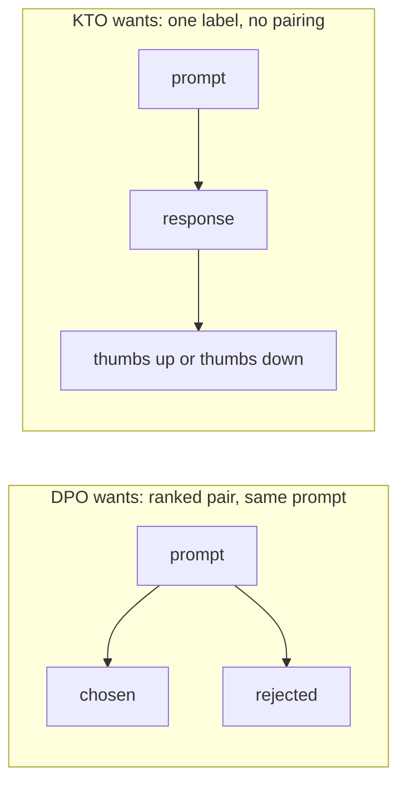
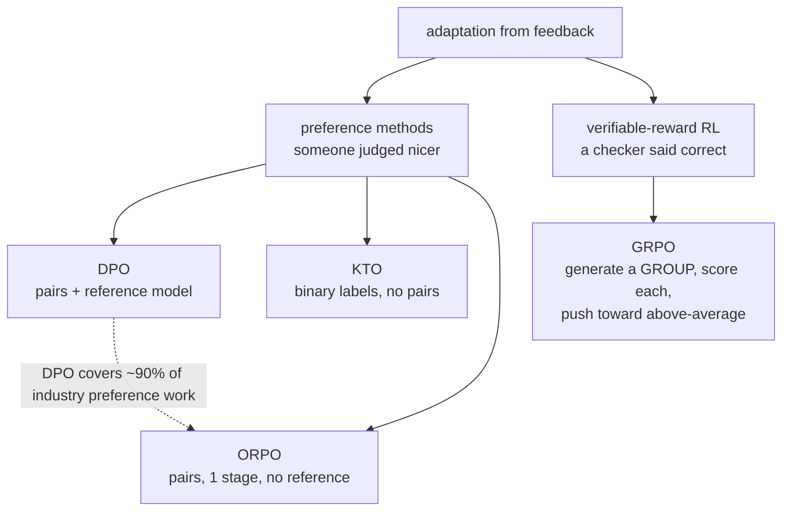
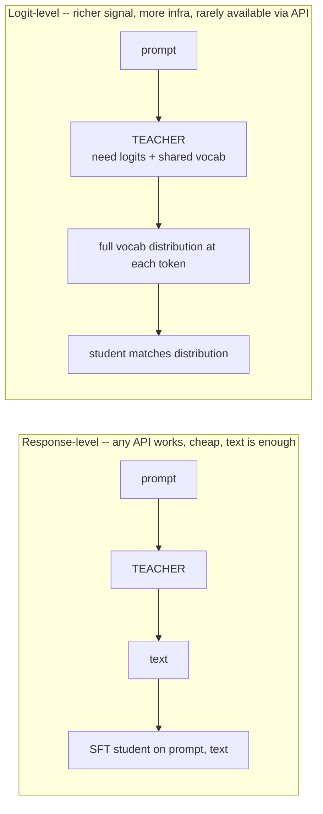

# Lecture 9: The Preference-Method Zoo and Response-Level Distillation

> The last lecture gave you DPO — the workhorse that covers roughly 90% of preference tuning in industry. This lecture is deliberately different: it makes you *conversant*, not *operational*, in two areas an expert engineer must reason about at the whiteboard without ever running a training job. First, the **preference-method zoo** — KTO, ORPO, GRPO — each of which exists because DPO has a specific, nameable limitation, and each of which you should be able to invoke by *decision trigger*, not by memorized algorithm. Second, **distillation as an adaptation strategy** — the "generate from a big teacher, SFT a small student" move that closes the loop back to Week 1's "distill big into small" motivation, plus the licensing landmine that has ended more distillation projects than any technical problem. After this you'll be able to sit in a design review, hear "we can't collect paired preference data" or "we want the quality of the 70B in a 3B we can serve," and name the right tool *and* the trap that comes with it — without writing a line of training code.

**Prerequisites:** Lecture 2 (SFT mechanics, response-only loss, EOS), Lecture 8 (DPO, `beta`/KL, the reference model, the win-rate trap), Week 1's "distill big into small" motivation, basic probability (log-probs, sigmoid) · **Reading time:** ~26 min · **Part of:** Phase 08 — Model Adaptation & Fine-Tuning, Week 3

## The core idea (plain language)

There are two separate ideas in this lecture, and they only share a home because both are "awareness-level" — things you must *reason about* correctly without necessarily *implementing*.

**Idea one: the preference-method zoo.** DPO is not the only way to teach a model comparative judgement, but it *is* the default, and the honest framing is that you should reach past it only when you hit one of DPO's specific pain points. DPO's cost isn't compute — it's the **paired data**: for every prompt you need a `chosen` *and* a `rejected` completion, and those pairs must differ meaningfully. The zoo exists because that requirement, and DPO's two-model / reference-model machinery, are sometimes the wrong shape for the problem:

- **KTO** exists because sometimes you *can't* produce pairs — you just have a pile of outputs each labeled thumbs-up or thumbs-down. KTO learns from those **binary** labels directly.
- **ORPO** exists because running SFT and then DPO is *two* stages with *two* runs, and DPO needs a reference model. ORPO folds preference into the SFT stage itself — **one stage, no reference model**.
- **GRPO** exists because DPO can't optimize a *verifiable reward* (did the code pass the tests? is the math answer correct?). GRPO is the lightweight **reinforcement-learning** method that powers reasoning models.

**Idea two: distillation as adaptation.** Everything so far assumed you're improving a model against human-ish preferences. Distillation is a different lever entirely: you use a *big, capable teacher model* to manufacture training data (or training signal) for a *small, cheap student*. The common, cheap version — **response-level distillation** — is embarrassingly simple: prompt the teacher, collect its outputs, and SFT the student on `(prompt, teacher_output)` pairs. That's it. It's the practical realization of Week 1's promise that fine-tuning can "distill a big model into a small one." The catch has nothing to do with math: it's the **licensing terms** of the teacher, which frequently forbid using its outputs to train a competing model.

## How it actually works (mechanism, from first principles)

### The zoo, one mechanism at a time

**DPO recap (the baseline you're comparing against).** DPO needs `(prompt, chosen, rejected)` triples and a frozen reference model. Its loss pushes the *chosen* response's log-probability above the *rejected* one's, leashed by `beta` to the reference so the model doesn't drift off the SFT distribution. Two model copies (one frozen), offline, stable. Remember its cost is **paired data** and **a reference model** — those two costs are exactly what the cousins attack.

**KTO — Kahneman-Tversky Optimization.** The decision trigger is: *you can label individual outputs good/bad but you cannot cheaply produce matched chosen/rejected pairs for the same prompt.* This is the common real-world situation — a product logs thumbs-up/thumbs-down on responses, but nobody generated two answers to the same prompt and ranked them. KTO consumes exactly that: a dataset of `(prompt, response, label∈{good,bad})` where the good and bad examples need not share prompts. Mechanically it borrows an idea from prospect theory — it models the *utility* of a response relative to a reference point, with a built-in asymmetry (losses loom larger than gains, just like in human decision-making). The engineering payoff you care about: **unpaired binary data is dramatically cheaper to collect** than pairs, and you often already have it sitting in your product telemetry.

**ORPO — Odds Ratio Preference Optimization.** The decision trigger is: *you want preference behavior but resent the two-stage SFT→DPO pipeline and the reference model it drags along.* ORPO's insight is that you can attach a small preference penalty *directly to the SFT loss*. It trains on `(prompt, chosen, rejected)` like DPO, but the objective is roughly `SFT-loss(chosen) + λ · odds-ratio-penalty(chosen vs rejected)` — a single loss, in a single training run, with **no separate reference model** to hold in memory. You go from base → aligned in one pass. The trade-off: it's less battle-tested than the SFT-then-DPO pipeline, and folding two objectives into one means less independent control over each. But for a simpler pipeline with lower VRAM (no reference-model forward pass), ORPO is the lever.

**GRPO — Group Relative Policy Optimization.** The decision trigger is completely different from the other two: *your reward is programmatically verifiable* — a unit test passes or fails, a math answer is right or wrong, a JSON schema validates or doesn't. DPO/KTO/ORPO all learn from *preferences* (someone, or some model, judged one output nicer). GRPO is genuine **online reinforcement learning**: for each prompt the model generates a *group* of candidate outputs (say 8–16), each is scored by the verifiable reward function, and the policy is pushed toward the above-average outputs in the group and away from the below-average ones. The "group relative" part is the trick that made it cheap — it uses the *group's own mean reward as the baseline*, so it needs **no separate value/critic model** (that's the expensive machinery PPO required). This is the method behind modern reasoning-model training (DeepSeek's R1 work popularized it): let the model try a problem many ways, reward the attempts that reach a verified-correct answer, repeat. It is far more infrastructure than DPO — an online generation loop, many samples per prompt, and a reward function you must build and trust — which is exactly why it's *awareness-level* for most engineers.

**When you actually reach past DPO.** Be honest and specific: DPO first, always, for ordinary preference work. Reach for **KTO** when pairing data is the blocker and you have thumbs-up/down telemetry. Reach for **ORPO** when pipeline simplicity — one run, no reference model — matters more than fine-grained control. Reach for **GRPO** only when you have a *verifiable* reward and you're actually training reasoning/agentic behavior — not to make a support-ticket router nicer. If you can't articulate which of those three triggers you've hit, the answer is DPO.

### Distillation as adaptation

Distillation transfers capability from a **teacher** (large, expensive, capable) to a **student** (small, cheap, fast). There are two levels, and the gap between them is almost entirely about *infrastructure*, not idea.

**Response-level distillation (the cheap default).** You never touch the teacher's internals. The recipe:

1. Take a set of prompts representative of your task.
2. Run them through the teacher (a frontier API model, or a local 70B) and collect its full text outputs.
3. Optionally filter/verify those outputs — reject the ones the teacher got wrong, using a rule, a test, or a stronger judge.
4. **SFT the student** on `(prompt, teacher_output)` exactly like any other supervised fine-tune — same chat template, same EOS, same response-only loss masking from Lecture 2.

That's the whole thing. The teacher's outputs *are* your gold completions. It's cheap because it's just data generation plus a normal SFT run, and it's effective because you're narrowing a small model onto the exact distribution of a task the big model already does well. This is the concrete mechanism behind Week 1's "distillation of a big model into a small one" — that bullet in the decision framework was pointing at *this*.

**Logit-level distillation (more infra, awareness only).** Instead of training the student to reproduce the teacher's *chosen tokens*, you train it to match the teacher's *full probability distribution over the vocabulary* at each step — the soft "the teacher thought 'refund' 60%, 'return' 25%, 'exchange' 10%..." signal. This is richer: the student learns the teacher's uncertainty and near-misses, not just its final answer, and it typically needs less data to reach the same quality. The cost is real: you need access to the **teacher's logits** at every position (impossible with most closed APIs, which return text or at best top-k logprobs), the teacher and student generally must share a **tokenizer/vocabulary** for the distributions to align, and you need infrastructure to run the teacher in-loop or cache logits at scale. For an engineer, the one-liner is: *logit-level is better when you can get it, but response-level is what you'll actually do, because you usually only have the teacher's text.*

## Worked example

**The distillation decision, with numbers.** You're serving a support-ticket classifier. Your options:

- **Frontier teacher via API:** ~95% task accuracy, but ~$3 per 1,000 requests and p95 latency ~2.5 s. At 2M requests/month that's ~$6,000/month just for this one endpoint.
- **A raw small model (3B) prompted:** ~78% accuracy — not good enough.

Response-level distillation plan: send **20,000** representative tickets through the teacher (one-time cost ≈ 20,000 / 1,000 × $3 = **$60**), filter out the ~5% where the teacher's JSON was invalid or the label was checkably wrong (leaving ~19,000 clean pairs), and QLoRA-SFT the 3B student on them. Suppose the distilled 3B lands at ~90% accuracy — below the teacher's 95%, but *well* above the 78% raw-prompted baseline, and now servable locally at ~$0.05 per 1,000 requests and p95 ~200 ms. *(All numbers illustrative — your eval harness produces the real ones.)*

The arithmetic that sells it: **$60 one-time** to generate data, plus a few dollars of GPU for the QLoRA run, buys a permanent ~60× drop in per-request cost and a ~12× latency improvement, at the price of ~5 accuracy points. That 5-point gap is the "distillation gap" — the student rarely fully matches the teacher — and whether it's acceptable is a *product* decision you make with your eval harness, not a training decision.

**The preference-method decision, with a data audit.** Same team wants to sharpen the model's *tone* on the small fraction of tickets that are angry customers. Audit the data you actually have:

- You have **12,000 thumbs-up/thumbs-down** events from the existing product, each on a single response. You have **zero** matched pairs.
- Producing 1,000 quality `(chosen, rejected)` pairs would take an annotator ~2 weeks.

Decision: this is the textbook **KTO** trigger. The 12,000 binary labels are already sitting in your telemetry; forcing them into DPO's pairwise mold would mean throwing away the data you have to manufacture data you don't. You'd note in the design doc: "Binary label data available at zero collection cost → KTO; DPO would require a ~2-week pairing effort for no obvious quality gain." That sentence is the entire deliverable — you don't implement it this week.

## How it shows up in production

- **The licensing landmine (this is the big one).** Response-level distillation from a *commercial* teacher runs straight into the provider's terms of service. Several major providers' terms explicitly **prohibit using their model's outputs to develop or train a model that competes with them.** This is not hypothetical — it has been the stated basis of high-profile disputes between AI companies. Before you distill from *any* teacher, an engineer must read that specific provider's current terms and, for anything shipping, get it in front of legal. "Competing model" is often defined broadly. Open-weight teachers have their *own* licenses (some permissive, some with output/use restrictions), so "it's open source" does not mean "outputs are free to train on." **Check the terms before you generate a single teacher output** — retrofitting a compliance problem after you've trained and shipped is far more expensive than a five-minute pre-check.
- **The student inherits the teacher's flaws.** Response-level distillation copies the teacher's *behavior*, including its hallucinations, biases, verbosity, and refusal quirks. If the teacher confidently invents a policy detail, your student learns to invent it too — often *more* confidently, because it has less capacity to hedge. Filtering/verifying teacher outputs before training is not optional polish; it's how you avoid laundering the teacher's mistakes into a model you can't easily debug.
- **GRPO's reward function is the whole ballgame.** If a team does go the GRPO route, the failure mode isn't the RL — it's **reward hacking**. The model finds outputs that satisfy your verifiable checker without actually being good (passes the test by hard-coding the expected output; "solves" the math by emitting the answer format without the reasoning). Every hour saved on the RL loop gets spent hardening the reward function. This is why GRPO is expert territory.
- **KTO/ORPO are "less-traveled roads."** DPO has by far the most tooling maturity, worked examples, and community debugging knowledge. When you pick KTO or ORPO you accept thinner documentation and fewer people who've hit your bug. That's a real operational cost, and it's why the trigger to leave DPO has to be a *concrete data or pipeline constraint*, not novelty-seeking.
- **Distillation's cost profile is front-loaded and permanent.** Unlike calling a teacher API per-request forever, distillation pays the teacher cost *once* (data generation) and then serves cheap forever. The break-even is fast at any real volume — but you re-pay it whenever the task drifts and you need fresh teacher data. Budget for periodic re-distillation, not a one-and-done.

## Common misconceptions & failure modes

- **"KTO/ORPO/GRPO are upgrades over DPO."** No — they're *alternatives for specific constraints*. DPO is the default and covers ~90% of preference work. The others win only when you hit their trigger (no pairs → KTO; want one-stage/no-reference → ORPO; verifiable reward → GRPO). Reaching for them without a trigger buys you thinner tooling for no benefit.
- **"GRPO is how you make any model nicer."** GRPO needs a *verifiable, programmatic* reward. Tone, helpfulness, and "niceness" are not verifiable — they're preferences, which is DPO/KTO/ORPO territory. GRPO is for math/code/reasoning where correctness is checkable.
- **"Distillation teaches the student new facts the teacher knows."** Same limit as all SFT: you're teaching a *style of answering* and narrowing the task distribution, not reliably transferring the teacher's knowledge. If the student is too small to hold the knowledge, distillation won't magic it in — and for facts, RAG is still the answer.
- **"The distilled student will match the teacher."** Expect a gap. A 3B student distilled from a 70B teacher captures a lot of the *task-specific* behavior but rarely the full general capability. Measure the gap on your eval harness; decide if the cost/latency win is worth it.
- **"Open weights means I can train on the outputs freely."** The model's *weight license* and the *terms governing use of its outputs* are different things, and either can restrict training competitors. Read both. "Open" is not a legal conclusion.
- **"More teacher data is always better."** Unfiltered teacher output injects the teacher's errors. 19,000 verified-clean pairs beat 20,000 raw ones. Verification is part of the recipe, not an afterthought.
- **"Logit-level is just a better DPO."** They're unrelated axes. Logit-level distillation is a *distillation* technique (student mimics teacher distributions); DPO is *preference* tuning. Don't conflate them: preference vs. distillation is *what signal you use*; response- vs. logit-level is *how much of the teacher you can see*.

## Rules of thumb / cheat sheet

- **DPO is the default.** ~90% of preference work. Only leave it for a named constraint.
- **KTO** ← *you have binary good/bad labels, not matched pairs.* Cheaper data collection; often already in telemetry.
- **ORPO** ← *you want one stage (SFT+preference fused) and no reference model.* Simpler, lower-VRAM pipeline; less battle-tested.
- **GRPO** ← *your reward is programmatically verifiable* (tests pass, math correct). Online RL, powers reasoning models, expert-level infra, watch for reward hacking.
- **Response-level distillation** = generate outputs from a big teacher → SFT a small student on them. Cheap, effective for narrowing a small model onto a task. This *is* Week 1's "distill big into small."
- **Logit-level distillation** exists (student matches teacher's full token distribution). Richer signal, but needs teacher **logits** + shared vocab + more infra. Rarely available via closed APIs.
- **Filter teacher outputs before training.** The student inherits everything you don't remove.
- **Expect a distillation gap.** Student < teacher on general capability; measure it on your harness.
- **LICENSING FIRST.** Many provider terms forbid using outputs to train a competing model. Check the specific teacher's current terms *before* generating data. Open weights ≠ free-to-train-on.
- **If you can't name your trigger, use DPO** — and if you're distilling, de-risk licensing by choosing a teacher whose terms clearly permit output-based training.

## Connect to the lab

Week 3's lab has you *implement* DPO (`train_dpo.py`) — that's Lecture 8. This lecture is the theory behind the two *awareness* bullets in the Week 3 theory list: naming KTO/ORPO/GRPO in one line each with their triggers, and explaining response-level distillation with its licensing caveat. You won't run KTO/ORPO/GRPO or a distillation job in the lab — but when you write your milestone **decision memo**, add a paragraph: "we chose DPO because our constraint is X; we'd have used KTO/ORPO/GRPO if instead Y," and "if we needed the frontier model's quality at our latency budget, we'd distill — after clearing the teacher's output-use terms." That reasoning is exactly what an interviewer probes for.

## Going deeper (optional)

- **Hugging Face TRL docs** (huggingface.co/docs/trl) — `KTOTrainer`, `ORPOTrainer`, and `GRPOTrainer` each have a page with the data format and a minimal example. The fastest way to see the *data shape* each method demands, which is the real decision driver.
- **KTO paper** — "KTO: Model Alignment as Prospect Theoretic Optimization" (Ethayarajh et al., 2024). Read the abstract and the "unpaired data" motivation.
- **ORPO paper** — "ORPO: Monolithic Preference Optimization without Reference Model" (Hong et al., 2024). The title *is* the pitch; read the abstract.
- **GRPO** — introduced in the DeepSeekMath paper and central to the **DeepSeek-R1** report (2025). Read the R1 report's training-pipeline section for how verifiable-reward RL produces reasoning behavior.
- **Knowledge distillation** — Hinton, Vinyals, Dean, "Distilling the Knowledge in a Neural Network" (2015) — the origin of *logit-level* (soft-target) distillation. Short and readable.
- **Licensing** — read the *current* terms of service / acceptable-use policy of whatever teacher you're considering (Anthropic, OpenAI, Google, the Meta Llama license, etc.) directly on the provider's own site; terms change, so don't trust a summary. When in doubt, involve legal.
- **Search queries:** "TRL KTOTrainer data format", "ORPO vs DPO when to use", "GRPO reward hacking reasoning", "DeepSeek R1 GRPO training", "response level distillation SFT recipe", "can I use model outputs to train competing model terms of service", "knowledge distillation logits vs response".

## Check yourself

1. Your product has 15,000 logged thumbs-up/thumbs-down events on individual model responses, but no matched pairs, and pairing them would take weeks. Which preference method fits, and why is it a better fit than DPO here?
2. In one sentence each, give the decision trigger for ORPO and for GRPO.
3. Why is GRPO the right tool for training a math-reasoning model but the *wrong* tool for making a chatbot's tone friendlier?
4. Describe the four steps of response-level distillation, and say which Week 1 idea it implements.
5. What is the practical difference between response-level and logit-level distillation, and why do you almost always end up doing response-level in practice?
6. You want to distill a frontier commercial model's outputs into a small in-house model you'll ship to customers. What is the single most important thing to check *before* generating any teacher data, and why is checking it *after* training a bad idea?

### Answer key

1. **KTO.** It learns directly from **unpaired binary** good/bad labels, which is exactly the data you already have at zero collection cost. DPO requires matched `(chosen, rejected)` pairs for the same prompt; forcing your binary telemetry into that mold would mean discarding usable data and spending weeks manufacturing pairs for no clear quality gain.
2. **ORPO:** you want to fuse SFT and preference into a *single stage with no reference model* (simpler, lower-VRAM pipeline). **GRPO:** your reward is *programmatically verifiable* (tests pass, math answer correct) and you're training reasoning/agentic behavior.
3. Math-reasoning has a **verifiable reward** — the answer is checkably right or wrong — which is exactly what GRPO's group-scored RL optimizes. "Friendlier tone" is a *preference*, not verifiable by any checker, so there's no reward function to drive GRPO; that's DPO/KTO/ORPO territory. Point GRPO at an unverifiable target and you either can't define the reward or you invite reward hacking.
4. (1) Gather representative prompts; (2) run them through the big **teacher** and collect its text outputs; (3) **filter/verify** those outputs, dropping the wrong ones; (4) **SFT the small student** on `(prompt, teacher_output)` pairs with the normal chat template / EOS / response-only masking. It implements Week 1's "**distill a big model into a small one**" motivation.
5. **Response-level** trains the student to reproduce the teacher's *text outputs* (works with any teacher, even a text-only API). **Logit-level** trains the student to match the teacher's *full probability distribution over the vocabulary* at each token — a richer signal that usually needs less data, but requires access to teacher **logits** and a shared tokenizer/vocabulary plus more infrastructure. You almost always do response-level because closed APIs return text (not full logits), so the richer signal simply isn't available.
6. Check the **teacher provider's terms of use for its outputs** — many explicitly forbid using outputs to train a *competing* model, and "competing" is often defined broadly. Checking after training is bad because you may have already built and shipped a model you have no legal right to distribute, turning a five-minute pre-check into a costly retraining, product pull, or legal dispute. Read the specific current terms first; involve legal for anything customer-facing.
