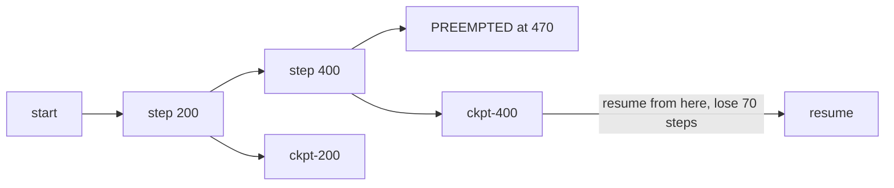

# Lecture 11: GPU Planning and Choosing a Training Venue

> You built a VRAM estimator in Week 2. It answers "will this fit?" — but shipping a fine-tune needs the next three questions answered too: *which GPU class do I need, how many hours will the run take, and what will it cost me in dollars?* And once you can answer those, a bigger fork appears: do you rent a raw GPU and drive it yourself, or hand your JSONL to a managed fine-tuning API and never touch infrastructure? This lecture turns your fit-check into a full venue-and-cost decision. After it you can take a model size + dataset size, walk it to a GPU class, to hours, to dollars; pick between free Colab, per-second GPU rental, and managed FT APIs with the tradeoffs stated out loud; and set up checkpointing so a preemption or a Colab disconnect costs you minutes, not the whole run.

**Prerequisites:** The QLoRA lecture (VRAM math, Week 2), the LoRA lecture (adapters), basic comfort with `nvidia-smi` and reading a cloud pricing page · **Reading time:** ~30 min · **Part of:** Phase 08 (Model Adaptation & Fine-Tuning) Week 4

---

## The core idea (plain language)

Your Week-2 estimator produces one number: peak training VRAM. That number is a *filter*, not a *decision*. It tells you which GPUs are even in the running — a QLoRA 8B at ~14GB rules out nothing modern; a full fine-tune at 120GB rules out everything with one card. But "it fits on a T4" and "you should train it on a T4" are different claims. The second one depends on how long the run takes, how much that GPU costs per hour, how likely the machine is to vanish mid-run, and how much of your own time you're willing to spend babysitting it.

So the real workflow is a short pipeline, and every stage feeds the next:

```
VRAM estimate  →  GPU class that fits  →  throughput (tokens/sec)
     →  hours = total tokens / throughput  →  dollars = hours × $/hr
     →  overlay: preemption risk, session limits, your infra appetite
     →  VENUE
```

The venue landscape has three tiers, and they trade the same currency in different amounts: **money, control, and your time.**

- **Free Colab (T4/L4).** Zero dollars, decent for small QLoRA, but you rent it on the platform's terms — session time limits, idle disconnects, no guarantee the GPU is even available. You pay in reliability and babysitting.
- **Per-second GPU rental (Modal / RunPod / Lambda).** You get a raw A10/L4/A100 billed by the second. Cheap, scriptable, fast when you need speed, full control of the stack. You pay in setup and ops — it's *your* Dockerfile, *your* driver versions, *your* checkpointing.
- **Managed FT APIs (OpenAI / Vertex / Bedrock / Together / Predibase).** Upload JSONL, get a fine-tuned model back. Zero infrastructure. You pay in dollars-per-token, model lock-in, and reduced data portability — you often can't take the weights and leave.

There is no universally correct tier. The whole skill is matching the tier to the job, and being honest about which currency you're spending.

---

## How it actually works (mechanism, from first principles)

### Stage 1 — VRAM estimate → GPU class

You already have peak VRAM from the Week-2 estimator. Turn it into a shortlist. The rule is **fit with headroom** — never size a GPU to your point estimate, because activation spikes, fragmentation, and a longer-than-expected sequence in the batch will OOM you at 90% of an epoch. Target the GPU whose VRAM is roughly **1.3–1.5×** your estimate.

Approximate 2025-2026 single-GPU classes you'll actually see on the menu (VRAM is the headline number; treat throughput as relative, not absolute):

```
GPU     VRAM     ballpark rent $/hr   relative training throughput
T4      16 GB    free (Colab) / ~0.35 1×   (baseline, slow, no bf16)
L4      24 GB    ~0.40–0.80           ~1.5–2×
A10/A10G 24 GB   ~0.60–1.20           ~2–3×
A100-40  40 GB   ~1.10–2.00           ~6–8×
A100-80  80 GB   ~1.40–2.50           ~7–10×
H100-80  80 GB   ~2.50–4.00           ~15–25× (fp8, big batches)
```

*(All prices approximate and provider-dependent; always read the live pricing page. Throughput multipliers are rough rules of thumb, not benchmarks.)*

So the mapping is mechanical:

- **QLoRA 7-8B (~11-14GB):** fits a **T4 16GB** (free Colab) or an **L4/A10 24GB** (rented, ~2× faster). This is the Week-2 default.
- **QLoRA 13B (~18-22GB):** T4 is too tight; go **L4/A10 24GB**.
- **QLoRA 70B (~40-48GB) or LoRA 13B full-precision base:** **A100-80** territory.
- **Full fine-tune 7B (~120GB):** single-card is out; you're renting a **multi-GPU A100/H100 node** with FSDP/DeepSpeed — usually a sign you should be doing PEFT instead.

The T4 has one sharp gotcha: **no bf16.** It only does fp16, which is more prone to overflow/NaN during training. If your run NaNs on a T4 but trains clean on an L4, that's often it — the L4/A10/A100 all support bf16, which has fp32's exponent range and rarely overflows. This alone pushes many people off free Colab onto a cheap L4.

### Stage 2 — dataset + epochs → hours

Throughput for training is measured in **tokens per second** — how fast the GPU can push examples through a forward+backward step. The total work is total tokens seen, which is:

```
total_tokens = num_examples × avg_tokens_per_example × epochs
hours        = total_tokens / (throughput_tok_per_sec × 3600)
```

You need a throughput number. Two ways to get one:

1. **Measure it (best).** Run 20-50 steps, read the steps/sec your trainer logs (TRL, Unsloth, and Axolotl all print `it/s` or samples/sec), multiply by tokens-per-step. Ten minutes of measurement beats an hour of guessing.
2. **Estimate it (rough).** As an order-of-magnitude anchor for **QLoRA on a single mid-tier GPU**, expect very roughly **1,000–4,000 training tokens/sec** on an L4/A10, less on a T4, several times more on an A100. Label this what it is: a back-of-envelope number to size a wallet, not a benchmark. *Always* replace it with a measured rate before committing to a long run.

The lever people forget: **sequence length dominates.** Attention cost scales with sequence length, and — more importantly for your bill — padding every example to a fixed `max_seq_len` means short examples waste GPU cycles on padding tokens. Sizing `max_seq_len` to the 95th-percentile of your actual data (not 4096 "to be safe") and using **example packing** can cut hours by 2-4× on datasets of short examples. Cost estimation that ignores padding will be wildly optimistic.

### Stage 3 — hours → dollars

Trivial arithmetic, and that's the point — once you have hours and $/hr, the dollar figure is one multiply:

```
dollars = hours × $/hr(GPU class)  + a fudge for startup/download/idle
```

The fudge matters more than beginners expect. On per-second rental you pay for: pulling the container image, downloading the base model weights (an 8B model is ~16GB — minutes of transfer you're billed for), and any time the box sits idle while you stare at logs. Budget **10-20 minutes of overhead per run** on top of pure training time, and *shut the box down* the instant the run ends. The classic cloud-GPU horror story isn't an expensive run — it's a $1.50/hr A10 left running over a weekend because nobody killed it. That's ~$70 for zero training.

### Checkpointing — the thing that makes all of this survivable

Every venue can take your machine away: Colab disconnects on idle or hits a session cap, spot/preemptible rentals get reclaimed when the provider wants the hardware back, and your own laptop's SSH session dies. The defense is the same everywhere: **write checkpoints periodically and be able to resume from the last one.**



Two knobs in every trainer (HF `TrainingArguments`, TRL `SFTConfig`, Axolotl YAML):

- `save_steps` / `save_strategy` — how often to checkpoint. Set it so you lose **at most ~10-15 minutes** of compute if the box dies. On a 2-hour run, checkpoint every ~10-15 min. Adapters are tiny (MBs), so for QLoRA the write is cheap — err toward frequent.
- `resume_from_checkpoint=True` — on restart, reload optimizer state + step count and continue. Test this *once* deliberately (kill a run, resume it) so you trust it before you need it at 2am.

Write checkpoints to **durable storage that outlives the GPU**: a mounted cloud bucket / volume (Modal volumes, RunPod network storage, `gcsfuse`), or Google Drive on Colab. A checkpoint on the ephemeral local disk of a preemptible box dies *with* the box — useless. This one detail is what separates "spot instance saved me 60%" from "spot instance ate my afternoon."

---

## Worked example

Task: QLoRA fine-tune **Qwen2.5-7B-Instruct** on a support-ticket dataset. **4,000 examples, avg ~350 tokens each, 3 epochs.** Let's walk the full pipeline and price three venues.

**Stage 1 — VRAM → class.** Week-2 estimator says ~13GB peak for QLoRA 8B. With 1.4× headroom that's ~18GB → fits a **24GB L4/A10** comfortably, or a **free T4 16GB** tightly (13GB leaves ~3GB of headroom — workable but one long sequence from OOM). Shortlist: T4 (free), L4 (rented).

**Stage 2 — hours.** Total tokens:

```
4,000 examples × 350 tokens × 3 epochs = 4,200,000 tokens
```

Measured throughput on the L4 after a 30-step warmup: **~2,500 tok/sec** (packing on, `max_seq_len=512`).

```
hours = 4,200,000 / (2,500 × 3600) ≈ 0.47 hr ≈ 28 minutes
```

Add ~15 min overhead (image + weight download) → **~45 min wall-clock**.

**Stage 3 — dollars, three venues:**

| Venue | GPU | Rate | Wall-clock | Dollars | Notes |
|---|---|---|---|---|---|
| **Free Colab** | T4 | $0 | ~60 min (T4 ~1.5× slower) | **$0** | risk of disconnect; babysit it |
| **Modal/RunPod** | L4 | ~$0.60/hr | ~45 min incl. overhead | **~$0.45** | scriptable, reliable, fast |
| **RunPod spot** | L4 | ~$0.25/hr | ~45 min | **~$0.19** | needs checkpointing; may preempt |
| **OpenAI FT API** | — | ~$25/1M tok (illustrative) | managed | **~$105** | zero infra; hosted; locked in* |

*\*Managed-API pricing is per-token and varies enormously by base model and provider; the number above is illustrative only. Read the live pricing page — do not quote this figure.*

The lesson jumps out: **for a standard QLoRA on an open model, self-hosted rental costs cents.** The managed API costs ~200× more *in raw dollars* for this run — but that comparison is dishonest unless you also price the hours you'd spend building and debugging the rental pipeline. If this is your first fine-tune ever and the rental setup takes you a frustrating afternoon, the $105 API that "just works" may be the rational choice. If it's your fiftieth and you have a working Modal script, the $0.45 rental is obviously right. **The dollar delta is real, but it's not the whole cost.**

---

## How it shows up in production

**The idle-box bill.** The single most common cloud-GPU mistake is leaving a rented instance running. Per-second billing is a blessing when you're disciplined and a slow leak when you're not. Production teams wrap training in a script that provisions → trains → **tears down**, with no human in the "shut it off" loop. On Modal this is automatic (functions spin down after the call); on RunPod/Lambda you must build it. Set a billing alert regardless.

**Preemption is normal, not exceptional.** Spot/preemptible GPUs are 50-70% cheaper because the provider can reclaim them. If your run is longer than ~30 minutes and not checkpointed to durable storage, spot pricing is a trap — you'll lose runs faster than you save money. Checkpointed properly, spot is free money for anything restartable. This is a pure ops decision: cheap-but-interruptible vs. expensive-but-guaranteed, resolved entirely by whether your checkpointing works.

**Colab's ceiling.** Free Colab is excellent for the *first* small QLoRA and for teaching, but it has hard edges in production practice: session limits (hours, not days), idle disconnects that kill an unattended run, GPU-availability roulette (you may get a T4, an L4, or "no GPU available right now"), and no bf16 on the T4. The moment a run needs to be reliable or longer than a session, you've outgrown free Colab. Colab Pro/Pro+ raises the ceiling for a monthly fee but doesn't remove the "someone else's platform, someone else's rules" reality.

**Data portability and lock-in with managed APIs.** This is the tradeoff people under-weigh. When OpenAI or Bedrock fine-tunes for you, you generally **cannot download the weights** — the model lives on their platform, served through their API, priced per token forever. Your fine-tune is only as portable as their export policy, which is often "no export." Vertex and Bedrock tie you to their base models. Together and Predibase are more open (Predibase is built around serving your own LoRA adapters, and Together lets you retrieve fine-tuned weights for many models) — which is exactly why they're the reference to study if portability matters to you. If your data is sensitive, uploading it to a third-party FT API is a compliance question, not just a cost one: where does the data live, who can see it, is it retained, does it train their base models?

**Inference cost is a separate bill.** A managed FT API charges you to *train* and then charges you (usually a premium over the base model) to *serve*. A self-hosted fine-tune costs cents to train but then you own the serving infrastructure. Don't compare training costs in isolation — a cheap self-hosted train that you then can't serve efficiently is a false economy, and an expensive managed train with dead-simple hosted inference may win on total cost of ownership for low-volume workloads.

---

## Common misconceptions & failure modes

- **"It fits, so I should train it there."** Fitting is necessary, not sufficient. A T4 fits your 8B QLoRA and trains it in 60 minutes; an L4 fits it too and trains in 28. If your time is worth anything, "fits" is the start of the analysis, not the end.
- **"The managed API is expensive, so self-host."** True on training dollars, often false on total cost. You're not pricing your own hours, the serving stack, or the reliability. For a one-off standard task with no infra team, the API's dollar premium buys away a real pile of work.
- **"Spot instances are risky."** Only if you haven't checkpointed. With checkpointing to durable storage, preemption costs you the minutes since the last save. Un-checkpointed, spot is genuinely dangerous. The risk lives entirely in your ops, not the pricing.
- **Sizing the GPU to the point estimate.** OOM at epoch 0.9 is the signature. Activation spikes and long sequences push you over a tight budget. Always leave 30-50% headroom.
- **Padding to `max_seq_len=4096` "to be safe."** You just multiplied your token count (and bill) by the ratio of 4096 to your real median length. Size sequence length to your data and pack short examples.
- **Checkpointing to ephemeral local disk on a spot box.** The checkpoint dies with the box. Durable storage or it doesn't count.
- **Forgetting to shut the box down.** The $70-weekend classic. Automate teardown; set billing alerts.
- **Uploading sensitive data to a managed FT API without checking the data-handling terms.** A compliance incident, not a cost line. Read the retention and training-on-your-data policy first.

---

## Rules of thumb / cheat sheet

- **Fit rule:** target GPU VRAM ≈ **1.3–1.5×** your estimated peak. Never size to the point estimate.
- **Default QLoRA venue:** free **Colab T4** for the first small run; **rented L4/A10 (~$0.40-1.00/hr)** the moment you want speed or reliability.
- **T4 caveat:** no bf16 → NaN-prone. If a run NaNs on T4 but not elsewhere, move to L4/A10/A100.
- **Cost pipeline:** `tokens = examples × avg_len × epochs`; `hours = tokens / (tok_per_sec × 3600)`; `$ = hours × rate + 10-20 min overhead`. **Measure `tok_per_sec`, don't guess.**
- **Sequence length is the cost lever.** Size `max_seq_len` to your data's ~95th percentile; turn on packing. Halving effective length roughly halves the bill.
- **Checkpoint cadence:** lose at most ~10-15 min of compute. `save_steps` + `resume_from_checkpoint=True`. Write to **durable** storage.
- **Spot/preemptible:** great **iff** checkpointed to durable storage; a trap otherwise.
- **Managed API when:** no infra appetite, standard task (classification, extraction, style), small team, one-off, you're fine with hosted-only serving and per-token pricing.
- **Self-hosted PEFT when:** cost at scale, custom methods (DPO/GRPO/odd architectures), data sensitivity/compliance, you need the **weights** (portability), or you already have a rental script.
- **Portability ranking (rough):** self-hosted (you own weights) > Together/Predibase (retrievable adapters/weights) > OpenAI/Vertex/Bedrock (hosted-only, usually no export).
- **Always:** shut the box down; set a billing alert; test resume-from-checkpoint once before you rely on it.

---

## Connect to the lab

This lecture is the planning front-end for **Week 4's ops work**: before you rent anything, run `scripts/vram_estimate.py` from Week 2, then extend the exercise to walk that number through **class → hours → dollars** for your ticket-router 7-8B QLoRA. Pick a venue with the cost written down and justified (Colab vs. a rented L4 vs. a managed API), and — this is the part that pays off — deliberately configure `save_steps` + `resume_from_checkpoint`, kill a run mid-epoch, and prove you can resume. That resilience is what makes the deliberate-overtrain-then-recover experiment later in the week cheap to iterate on.

---

## Going deeper (optional)

- **Modal fine-tuning example.** Modal's docs include an end-to-end LLM fine-tuning example (LoRA/QLoRA on rented GPUs, with volumes for checkpoints) — the reference for scriptable per-second training. Root: `modal.com/docs`. Search: *"Modal fine-tune LLM example"* and *"Modal volumes checkpoint"*.
- **Together fine-tuning docs.** Managed FT with the ability to retrieve fine-tuned weights for many models. Root: `docs.together.ai`. Search: *"Together AI fine-tuning docs"*.
- **Predibase docs.** Managed FT and LoRA-adapter serving (LoRAX); the reference for "managed but you keep adapter portability." Search: *"Predibase fine-tuning docs"* and *"LoRAX Predibase"*.
- **OpenAI fine-tuning guide.** The canonical zero-infra managed FT flow and its per-token pricing model. Root: `platform.openai.com/docs`. Search: *"OpenAI fine-tuning guide"*.
- **Vertex AI / Amazon Bedrock model customization.** The hyperscaler managed-FT options with their lock-in and data-residency stories. Roots: `cloud.google.com/vertex-ai/docs`, `docs.aws.amazon.com/bedrock`. Search: *"Vertex AI tuning"*, *"Bedrock model customization"*.
- **RunPod / Lambda / Vast.ai pricing.** Live per-second/-hour GPU pricing to calibrate your dollar math. Roots: `runpod.io`, `lambdalabs.com`, `vast.ai`.
- **Hugging Face Accelerate "Model Memory" utility & Unsloth VRAM tables.** To calibrate the VRAM half of the pipeline. Search: *"Hugging Face model memory estimator"*, *"Unsloth VRAM requirements"*.

---

## Check yourself

1. Your estimator says a run needs 13GB peak VRAM. Why is "great, a 16GB T4 fits" not automatically the right venue choice? Name at least two follow-on factors.
2. Write the pipeline that turns *4,000 examples × 300 tokens × 2 epochs* into a dollar estimate on a $0.60/hr GPU, given a measured throughput of 2,000 tok/sec. Show the arithmetic.
3. A colleague says "spot instances are too risky for training." Under what single condition is that true, and what one practice makes spot safe?
4. Give two concrete reasons to choose a managed FT API over renting a GPU, and two concrete reasons to do the opposite.
5. You checkpoint every 200 steps to the rented box's local `/tmp`, then the spot instance gets preempted. What happens, and what was the mistake?
6. Why does padding all examples to `max_seq_len=4096` on a dataset of ~300-token examples wreck your cost estimate?

### Answer key

1. Fitting is a filter, not a decision. Follow-on factors: **throughput/hours** (a T4 is ~1.5× slower than an L4, so wall-clock and babysitting time differ), **reliability** (Colab disconnects/session limits vs. a paid rental), **bf16 support** (T4 has none → NaN risk), **headroom** (13GB on a 16GB card leaves only ~3GB — one long sequence from OOM), and **your time** vs. the cheap L4's dollars.

2. `tokens = 4,000 × 300 × 2 = 2,400,000`. `hours = 2,400,000 / (2,000 × 3600) = 2,400,000 / 7,200,000 ≈ 0.33 hr ≈ 20 min`. `dollars ≈ 0.33 × $0.60 ≈ $0.20`, plus ~10-20 min startup/download overhead → call it **~$0.30 all-in**.

3. It's true **only if the run isn't checkpointed to durable storage** — then a preemption loses the whole run. The one practice that makes spot safe: **checkpoint periodically to storage that outlives the box** (cloud volume/bucket) plus `resume_from_checkpoint`, so preemption costs only the minutes since the last save.

4. **Managed API:** no infra appetite / small or no ops team; standard task (classification, extraction, style) where custom methods aren't needed; want it to "just work" for a one-off; fine with hosted-only serving. **Self-host:** cost at scale (cents vs. per-token premiums), custom training methods (DPO/GRPO/unusual architectures), data sensitivity/compliance, or you need the **weights** for portability/offline serving.

5. On preemption the box — including its local `/tmp` — is destroyed, so **every checkpoint dies with it** and you lose the entire run. The mistake: checkpointing to **ephemeral local disk** instead of durable storage (a mounted volume/bucket). Frequent saves are worthless if they don't outlive the machine.

6. Cost scales with **total tokens processed**, and padding forces every ~300-token example up to 4,096 — you now pay to compute on ~3,800 padding tokens per example, roughly a **13× inflation** in tokens seen (and thus hours and dollars). Sizing `max_seq_len` to the data's ~95th percentile and packing short examples removes almost all of that waste.
