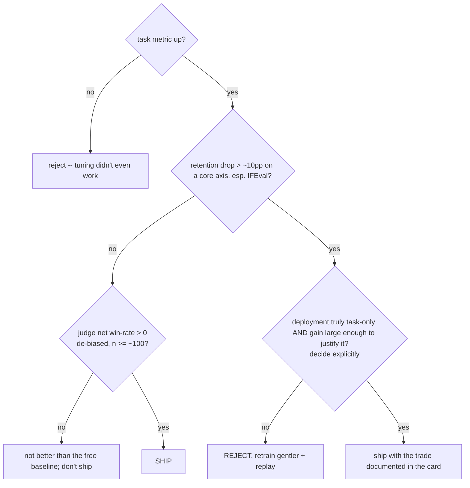

# Lecture 12: Evaluating a Fine-Tune — Task Metrics, Judge Win-Rate, and Retention

> The most dangerous number in all of fine-tuning is a falling loss curve, because it *feels* like proof and it is not. Loss going down means the model got better at predicting the next token on your training distribution — nothing more. It says nothing about whether your JSON still parses, whether the model beats the base you started from, or whether it quietly forgot how to follow instructions on everything that isn't your task. This lecture builds the discipline that separates engineers who ship reliable fine-tunes from engineers who ship confident regressions: the three-legged evaluation. After this you will be able to build a held-out task-metric scorecard (accuracy, JSON-valid rate, per-field F1), run a position-swap-debiased LLM-judge win-rate against the base model, and wire EleutherAI's `lm-evaluation-harness` for a fast capability-retention regression that catches catastrophic forgetting before your users do — and you'll know the reject rule that ties them together.

**Prerequisites:** SFT/QLoRA training (Lectures 2–6), a locked eval holdout and the contamination assert (Lecture 7), a working LLM-judge from Phase 7, comfort with precision/recall/F1 and basic probability · **Reading time:** ~30 min · **Part of:** Phase 08 — Model Adaptation & Fine-Tuning, Week 4

## The core idea (plain language)

You just spent a GPU-day fine-tuning a 7B model. The train loss dropped from 1.8 to 0.4, the eval loss dropped too, the curves are smooth and beautiful. Is the model good?

You have no idea. You measured the wrong thing.

> **Loss down does not mean better.** Loss measures token-prediction fit on your data. "Better" is a claim about three separate things that loss cannot see.

Here's the trap in one concrete failure. Your ticket-router's eval loss dropped nicely. You ship it. Monday, three things are true at once and loss told you about none of them: (1) 6% of outputs now wrap the JSON in a markdown code fence, so your parser throws; (2) the fine-tune is actually *worse* than the base `-Instruct` model you started from on the borderline tickets, because it overfit the majority class; and (3) the model can no longer follow a simple "answer in exactly two sentences" instruction outside the ticket domain, because you tuned it hard on one narrow format and it forgot general instruction-following.

Each of those failures is invisible to loss and each is caught by a different leg of a proper evaluation:

1. **Task metrics on a held-out set** — the direct measure of the thing you tuned for. JSON-valid rate catches (1). Per-field F1 and accuracy catch the quality of the actual routing.
2. **LLM-judge win-rate vs the baseline** — a pairwise comparison against the base-instruct model that catches (2): "you got *worse* than where you started" is only visible if you actually compare against where you started.
3. **Capability-retention regression** — a fixed suite of *general* capabilities run before and after tuning, catching (3): catastrophic forgetting, where the model gets great at your task and worse at everything else.

Three legs, three different questions. Task metrics: *is it good at the job?* Judge win-rate: *is it better than the free baseline?* Retention: *did it get dumber at everything else?* A fine-tune is only shippable when all three say yes. This lecture builds each leg as a script and gives you the reject rule that arbitrates when they disagree.

## How it actually works (mechanism, from first principles)

### Why loss is necessary but not sufficient

Cross-entropy loss is `-log P(correct next token)` averaged over your assistant tokens. It is a smooth, differentiable proxy — that's why we optimize it. But three gaps separate it from "quality":

- **It's an average over tokens, not a pass/fail on outputs.** A single wrong token — a `}` that became a `]`, a `"Billing"` that should have been `"billing"` — barely moves loss but breaks 100% of the requests that hit it. Loss is continuous; production correctness is often binary (does it parse? is the category right?).
- **It only measures your distribution.** Loss on your ticket data is silent about MMLU, IFEval, or safety. The model can drive your task loss to near-zero while its general capabilities rot.
- **It has no baseline.** Loss of 0.4 is meaningless in isolation. Better than *what*? The base-instruct model doesn't even have a comparable loss on your format. Loss can't answer "did tuning help versus not tuning at all."

So loss is your *training* signal (it tells you optimization is progressing and warns you about overfitting when eval loss turns up). It is not your *evaluation* signal. Keep watching it during training; never report it as evidence of quality.

### Leg 1 — Task metrics on the held-out set

This is the most direct and cheapest leg. Run your locked, never-trained holdout (Lecture 7) through the fine-tuned model, parse each output, and compute metrics that mirror what production actually cares about. For the ticket-router — output shape `{"category", "priority", "needs_human"}` — the metrics stack in layers:

```
Layer 0  JSON-valid rate     % of outputs that json.loads() cleanly to the schema
Layer 1  category accuracy   of the valid ones, % with the right category
Layer 1  priority F1 (macro) per-class precision/recall/F1, then averaged
Layer 1  needs_human F1      binary flag correctness
Layer 2  exact-match rate    all three fields correct simultaneously
```

**Why JSON-valid rate is Layer 0 and gates everything.** If the output doesn't parse, there is no category to score. You must decide the accounting rule *before* you look at numbers: an unparseable output is a *task failure*, so it counts as wrong for every downstream field. If you silently drop unparseable outputs and compute accuracy only over the parseable ones, you get a flattering lie — a model that emits perfect JSON 70% of the time and garbage 30% of the time can show "96% category accuracy" on the 70% while failing nearly a third of real traffic.

**Why per-field F1, not just accuracy.** Accuracy is a single number over a possibly-skewed distribution. Recall the ticket data: 1% of tickets are P0 outages. A model that *never* predicts P0 still scores ~99% priority accuracy — and misses every outage. F1 per class exposes this because P0 recall would be 0.

Quick F1 refresher (the only math you need here):

```
precision = TP / (TP + FP)   "when it said P0, how often was it right"
recall    = TP / (TP + FN)   "of the real P0s, how many did it catch"
F1        = 2 * P * R / (P + R)   harmonic mean; punishes ignoring a class
macro-F1  = unweighted mean of per-class F1  (treats rare classes as equals)
```

Report **macro-F1** for priority, not micro/weighted, precisely because you want the rare, high-stakes classes to count as much as the common ones. Micro-F1 would let the giant `P3` class hide a broken `P0`.

### Leg 2 — LLM-judge win-rate, and why position-swap is mandatory

Task metrics need a ground-truth label. But much of what a fine-tune changes — tone, formatting cleanliness, helpfulness, refusal appropriateness — has no single labeled answer. For those you compare two models head-to-head and ask a stronger model to judge which response is better. This is the Phase 7 judge, reused.

The mechanism: for each held-out prompt, generate a response from **A = fine-tuned** and **B = base-instruct**, show both to the judge, ask it to pick the better one (or tie). Tally wins.

The catch that makes naive win-rates *noise*: **position bias.** LLM judges have a systematic, well-documented preference for whichever response is shown *first* (some judges/prompts prefer the second; the point is it's not neutral). If you always put your fine-tune in slot A, a judge with a first-position bias hands you free wins that have nothing to do with quality. Your "70% win-rate" might be 50% real quality + 20% seating chart.

The fix is **position-swap de-biasing**: judge every pair twice, once with the fine-tune first and once with it second, and only count results that survive both orders.

```
For each prompt:
  Round 1:  judge sees [FT, BASE]  -> verdict_1
  Round 2:  judge sees [BASE, FT]  -> verdict_2   (order flipped)

  Resolve:
    both rounds pick FT      -> WIN   (consistent, position-independent)
    both rounds pick BASE    -> LOSS  (consistent)
    rounds disagree          -> TIE   (the "win" was position bias -> discard as signal)
    either round says tie    -> TIE
```

A disagreement between the two orders *is the position bias made visible* — you throw it into the tie bucket instead of letting it inflate a win. Report the full breakdown, never a bare percentage:

```
net win-rate = (wins - losses) / n        # n = number of pairs judged
report:  wins / ties / losses, n, and net win-rate with the sign
```

Reporting `n` is not optional. A "+18% net win-rate" on n=20 is within noise; the same margin on n=200 is a real signal. Rule of thumb (approximate): you need n in the low hundreds before a single-digit net win-rate means anything, because the standard error of a proportion shrinks like `1/sqrt(n)` — at n=25 the noise band is roughly ±10 points, at n=400 it's roughly ±2.5.

### Leg 3 — Capability-retention regression (catching catastrophic forgetting)

The first two legs only look at your task. Catastrophic forgetting is the failure that lives *outside* your task: the model becomes a ticket-routing savant and forgets how to follow instructions, do basic reasoning, or stay safe. Fine-tuning moves weights toward your narrow distribution; that same motion can degrade capabilities the base model had.

You catch it by running a **fixed, identical suite** of general benchmarks on the model **before and after** tuning and diffing the scores. "Fixed and identical" is the whole game — retention is a *regression test*, and a regression test that changes between runs measures nothing.

The tool is EleutherAI's **`lm-evaluation-harness`** (`lm-eval`), the de facto standard for reproducible LLM benchmarking. You wire a *small slice* covering three distinct capability axes:

```
Axis                What it catches                     Task in lm-eval
--------------------------------------------------------------------------
Knowledge/reasoning general world knowledge decay        mmlu (subset of subjects)
Instruction-following did it forget to obey formats?     ifeval
Safety/toxicity       did tuning strip safety behavior?  a toxicity/safety probe
```

Why these three specifically: MMLU is the broad knowledge canary; **IFEval** is the one that most directly detects the classic fine-tune injury (you tuned it to always emit ticket-JSON, and now it can't follow "reply in French, no punctuation"); and a safety probe catches the case where fine-tuning on task data eroded refusal behavior — a real liability.

**The critical operational warning: do NOT run full MMLU in the loop.** Full MMLU is 57 subjects and ~14,000 questions; on a single GPU that's hours per run. You will iterate a dozen times this week. Running full MMLU every iteration turns a 20-minute feedback loop into a day. Instead:

- **In the loop:** a subset of ~4–6 MMLU subjects (e.g. `mmlu_high_school_mathematics`, `mmlu_professional_law`, `mmlu_college_biology`, `mmlu_philosophy`) + IFEval + one safety task. Minutes, not hours.
- **Final report only:** full MMLU for the model card, once.

The subset is a *smoke detector*, not a certification. It won't give you a publishable MMLU number, but it will reliably tell you "capabilities dropped" — which is all the loop needs.

The scorecard is a JSON diff:

```
             base-instruct   fine-tuned   delta
mmlu(subset)     0.612         0.588      -2.4pp   (within noise, OK)
ifeval           0.741         0.542     -19.9pp   (RED — forgot instructions)
safety           0.970         0.930      -4.0pp   (watch)
```

### The reject rule — arbitrating the three legs

The three legs don't just inform; they *gate*. The rule you internalize:

> **A fine-tune that gains 15% on your task but loses ~20% on IFEval is often a reject.**

Why "often a reject" and not "always"? Because it's a trade-off you must make *consciously with numbers*, not stumble into blindly. A large retention loss means you traded away general capability for task performance. Sometimes that's fine (a pure classification endpoint that will *only* ever see tickets and hand JSON to a parser may not care about IFEval). Usually it's not (anything conversational, anything where the task boundary is fuzzy, anything that shares a deployment with other prompts). The default posture is **reject and retrain** — with lower LR, fewer epochs, and replay data (next lecture's territory) — because a 20-point instruction-following drop almost always signals the tuning was too aggressive and *also* hurt your task's robustness in ways your narrow eval didn't sample.



## Worked example

You fine-tuned `Qwen2.5-7B-Instruct` into `ticket-router-v2`. Run all three legs.

**Leg 1 — task metrics on the 500-row locked holdout.**

```
Outputs generated: 500
JSON-valid:        482 / 500 = 96.4%     (18 wrapped in ```json fences -> count as wrong)

Scoring over all 500 (unparseable = wrong on every field):
category accuracy:        451 / 500 = 90.2%
priority macro-F1:        0.71
  per-class:  P0 F1=0.40  P1 F1=0.68  P2 F1=0.82  P3 F1=0.94
needs_human F1:           0.88
exact-match (all 3):      417 / 500 = 83.4%
```

Read it like an engineer: the headline 90% category accuracy looks fine, but **P0 F1 = 0.40** is the story — the model is weak exactly on the 1%-but-critical outage class, and the 18 code-fence outputs are a schema-drift bug to fix in prep, not the model's fault to excuse.

**Leg 2 — judge win-rate vs base `Qwen2.5-7B-Instruct`, position-swapped, n=150.**

```
                 count   share
WIN  (both orders FT)      93    62%
TIE  (disagreed/tie)       34    23%
LOSS (both orders base)    23    15%
------------------------------------
net win-rate = (93 - 23)/150 = +46.7%   at n=150
```

Note the 34 ties — a chunk of those are pairs where the judge flipped its vote when we swapped order. If we had *not* swapped and just put FT first, several of those would have been counted as wins and the number would be inflated. +46.7% net at n=150 (noise band ≈ ±8pp) is a solid, real improvement over the baseline.

**Leg 3 — retention scorecard (subset, in-loop).**

```
             base    v2      delta
mmlu(5subj)  0.618   0.601   -1.7pp   OK
ifeval       0.735   0.712   -2.3pp   OK
safety       0.965   0.958   -0.7pp   OK
```

**Verdict via the reject rule:** task metric up (fix the P0 recall and the code-fence bug), judge net win-rate strongly positive at adequate n, retention essentially flat. **Ship** — after addressing P0 recall (more/better P0 examples) and the JSON fence regression.

Now the contrast case — `ticket-router-overtrained` (5 epochs, LR 5e-4):

```
Leg 1:  category accuracy 93.1% (+2.9pp vs v2)   <- task got BETTER
Leg 3:  ifeval 0.735 -> 0.548  = -18.7pp          <- but forgot instructions
```

Task metric up 3 points, IFEval down ~19. This is the reject rule's headline example: **reject**, retrain gentler with replay. The task gain is a mirage bought with general capability.

## How it shows up in production

- **The parser is the real acceptance test.** Your downstream code is `json.loads(out)["category"]`. JSON-valid rate *is* your uptime for that endpoint — a 96% valid rate is a 4% error rate on every request, which at 100k requests/day is 4,000 exceptions. Task metrics that count unparseable output as "wrong" are the only honest ones; the "drop the bad ones" variant hides an outage.
- **"We improved the model" is unfalsifiable without a baseline.** Teams routinely ship a fine-tune that is *worse* than the base-instruct model they already had for free, because they never ran the head-to-head. The judge win-rate is the check that a fine-tune earned its keep versus doing nothing.
- **Forgetting ships silently and surfaces as unrelated bug reports.** The model forgets instruction-following; three weeks later, support notices the assistant ignores "keep it under 50 words" in a totally different feature that shares the model. Nobody connects it to the ticket-router fine-tune because loss looked great. The before/after retention diff is what turns that into a caught regression instead of a mystery.
- **Judge cost and flakiness.** Each pair is 2 judge calls (swapped), so n=200 is 400 API calls per model comparison — budget for it, and cache. Judges are also non-deterministic; set temperature 0 and pin the judge model version, or your win-rate wobbles between runs for no reason.
- **The full-MMLU-in-the-loop mistake burns days.** An engineer wires `lm-eval` with the full `mmlu` task into their iteration script; each eval takes 3 hours; they do 8 iterations; that's a lost work-week measuring something a 6-subject subset would have flagged in 15 minutes. Subset for iteration, full only for the final card.
- **Retention is a safety and compliance surface.** If tuning erodes refusal behavior, you've shipped a model that will now comply with requests the base model refused. The safety probe in the retention suite is not box-ticking; it's the difference between "we checked" and a headline.

## Common misconceptions & failure modes

- **"Eval loss went down, so it's better."** Loss is a training signal, not an evaluation. It's an average over tokens on *your* distribution with no baseline and no view of general capability. Necessary to watch, never sufficient to ship on.
- **"Accuracy is enough."** Aggregate accuracy hides rare-class collapse (P0 outages) and treats an unparseable output the same as a parseable-but-wrong one only if you're careful. Report JSON-valid rate as a gate and per-class macro-F1 alongside accuracy.
- **"The judge is objective, so one ordering is fine."** No. Position bias is systematic. An un-swapped win-rate is a mix of quality and seating order — literal noise. Swap every pair and discard order-disagreements as ties.
- **"Higher win-rate percentage always means better."** Not without `n`. +18% at n=20 is inside the noise band. Always report win/tie/loss and n.
- **"We ran MMLU, retention is fine."** If you ran a *different* subset before and after, you measured nothing. Retention is a regression test — the suite must be byte-for-byte identical across runs (same tasks, same few-shot count, same harness version).
- **"Task got better, ship it."** Not if IFEval dropped 20 points. The reject rule exists precisely for the case where the task metric and retention disagree. A conscious trade with numbers, or a reject — never an automatic ship on the task number alone.
- **"Retention only matters for chatbots."** Even a pure-classification endpoint benefits from the check: a model that forgot general reasoning is often *also* more brittle on the out-of-distribution tickets your holdout under-sampled. Forgetting correlates with fragility on your own task's tail.

## Rules of thumb / cheat sheet

- **Never report loss as quality.** Watch it during training (overfitting canary); evaluate with the three legs.
- **Three legs, three questions:** task metrics (*good at the job?*), judge win-rate (*better than the free baseline?*), retention (*dumber at everything else?*). Ship only when all three pass.
- **JSON-valid rate is Layer 0 and a gate.** Unparseable output = wrong on every field. No "drop the bad ones."
- **Report macro-F1 per field, not just accuracy** — it's the only thing that exposes rare-class (P0) collapse.
- **Always position-swap the judge.** Judge each pair in both orders; order-disagreement → tie. Report wins/ties/losses + net win-rate + **n**.
- **Judge n in the low hundreds** before a single-digit net win-rate means anything (noise ≈ ±10pp at n≈25, ≈ ±2.5pp at n≈400; approximate). Temperature 0, pinned judge version.
- **Retention = fixed regression suite, before vs after.** Same tasks, same few-shot, same `lm-eval` version, every run.
- **Subset MMLU in the loop (4–6 subjects) + IFEval + a safety probe.** Full 57-subject MMLU only for the final model card. Full = hours; subset = minutes.
- **Reject rule (approximate):** big task gain + ~≥10–20pp drop on a core retention axis (esp. IFEval) → default **reject**, retrain gentler + replay, unless the deployment is provably task-only and the trade is documented.
- **Emit a JSON scorecard** so runs are diffable and CI-gateable.

## Connect to the lab

This lecture is the theory behind the week-4 lab's `eval/task_eval.py` (JSON-valid rate, category accuracy, priority F1, plus the reused pairwise judge) and `eval/retention.py` (wire `lm-eval` for an MMLU subset + IFEval + a safety probe, emitting a JSON scorecard). Build both, then run all three legs on your QLoRA fine-tune from weeks 2–3 versus its base-instruct model. The lab's "show forgetting, then recover it" step is the reject rule in action: deliberately over-train to make retention crater, confirm the three legs catch it, then retrain gentler — the before/after/recovered scorecard is the headline of your model card.

## Going deeper (optional)

- **EleutherAI `lm-evaluation-harness`** — the canonical benchmarking tool; read the README and task docs for `mmlu`, `ifeval`, and available safety/toxicity tasks, plus how few-shot and `--tasks` subsetting work. Root: github.com/EleutherAI/lm-evaluation-harness.
- **IFEval** — "Instruction-Following Eval" (Zhou et al., Google). Read the paper's intuition for verifiable instruction constraints. Search: "IFEval instruction following evaluation paper".
- **MMLU** — "Measuring Massive Multitask Language Understanding" (Hendrycks et al.); understand the 57-subject structure so your subset choice is deliberate. Search: "MMLU measuring massive multitask language understanding".
- **LLM-as-a-judge & position bias** — "Judging LLM-as-a-Judge with MT-Bench and Chatbot Arena" (Zheng et al.) documents position/verbosity bias and the swap mitigation. Search: "MT-Bench LLM as a judge position bias".
- **Catastrophic forgetting in fine-tuning** — search: "catastrophic forgetting instruction tuning LLM" and "fine-tuning degrades safety alignment" for current engineering write-ups (2024–2026).
- **Hugging Face `evaluate`** — library of metric implementations (F1, accuracy) if you'd rather not hand-roll. Root: huggingface.co/docs/evaluate. (Confirm task names against the installed harness version; don't trust a memorized flag.)

## Check yourself

1. Your eval loss dropped from 1.6 to 0.5. A colleague says "great, ship it." Give three distinct things this number cannot tell you, each mapped to one of the three evaluation legs.
2. Why is JSON-valid rate treated as Layer 0 / a gate rather than just another metric? What specifically goes wrong if you compute category accuracy only over the outputs that parsed?
3. Explain position-swap de-biasing mechanically. When the two orders disagree, why is the correct move to score it a tie rather than pick one?
4. You report a "+22% win-rate" against the base model. What two pieces of information must accompany that number for it to mean anything, and why?
5. Your fine-tune gains 15% category accuracy but IFEval drops 20 points. Walk the reject rule: what's your default decision, what single question could flip it to "ship," and what do you do on a reject?
6. Why must the retention suite be byte-for-byte identical before and after tuning, and why do you use a 5-subject MMLU subset in the iteration loop but full MMLU only for the final report?

### Answer key

1. Loss is (a) an average over tokens on *your* distribution — it can't tell you the **task metrics** (does the JSON parse, is the category right); (b) baseline-free — it can't tell you the **judge win-rate**, i.e. whether you beat the free base-instruct model; (c) blind to general capability — it can't tell you **retention**, whether IFEval/MMLU/safety dropped. Falling loss is consistent with a model that emits broken JSON, is worse than the baseline, and forgot instruction-following.
2. If the output doesn't parse there's no category to score, so an unparseable output is a full task failure and must count as wrong on every field. Computing accuracy only over the parseable subset flatters the model: one that emits valid JSON 70% of the time and garbage 30% can show "96% accuracy" on the 70% while failing ~30% of real traffic. The gate forces the denominator to be *all* outputs.
3. Judge every pair twice — once with the fine-tune in slot A, once in slot B — because judges have a systematic preference for a position. Count a WIN only if the fine-tune wins in *both* orders (position-independent), a LOSS if it loses both. If the orders disagree, the "win" was created by the seating, not quality — that's exactly the bias made visible, so scoring it a tie discards the position artifact instead of letting it inflate the win-rate.
4. **n** (the number of pairs judged) and the **win/tie/loss breakdown**. Without n you can't tell signal from noise — the standard error of a proportion shrinks like 1/√n, so +22% at n=15 is inside the noise band while at n=300 it's real. The breakdown reveals how many ties came from order-disagreements (position bias) versus genuine ties.
5. Default decision: **reject** and retrain gentler (lower LR, fewer epochs, add replay data). The single question that could flip it to ship: *is the deployment provably task-only (this model will only ever see tickets and hand JSON to a parser, sharing no surface with general prompts) AND is the 15% gain large enough to justify the trade?* If yes, ship with the trade explicitly documented in the model card. On a reject you retrain with reduced learning rate, fewer epochs, and ~10–20% general-instruction replay data mixed back in, then re-run all three legs.
6. Retention is a **regression test**; a regression test whose inputs change between runs measures nothing — you couldn't attribute a score change to the tuning versus the suite change. So same tasks, same few-shot count, same harness version, before and after. You subset MMLU (4–6 subjects) in the loop because full MMLU is 57 subjects / ~14k questions / hours per run, and you iterate many times a week; the subset is a fast smoke detector that reliably flags "capabilities dropped" in minutes. Full MMLU is run once for the model card because that's the only place you need a defensible, complete number.
