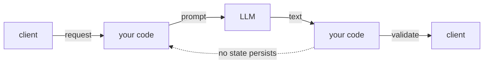
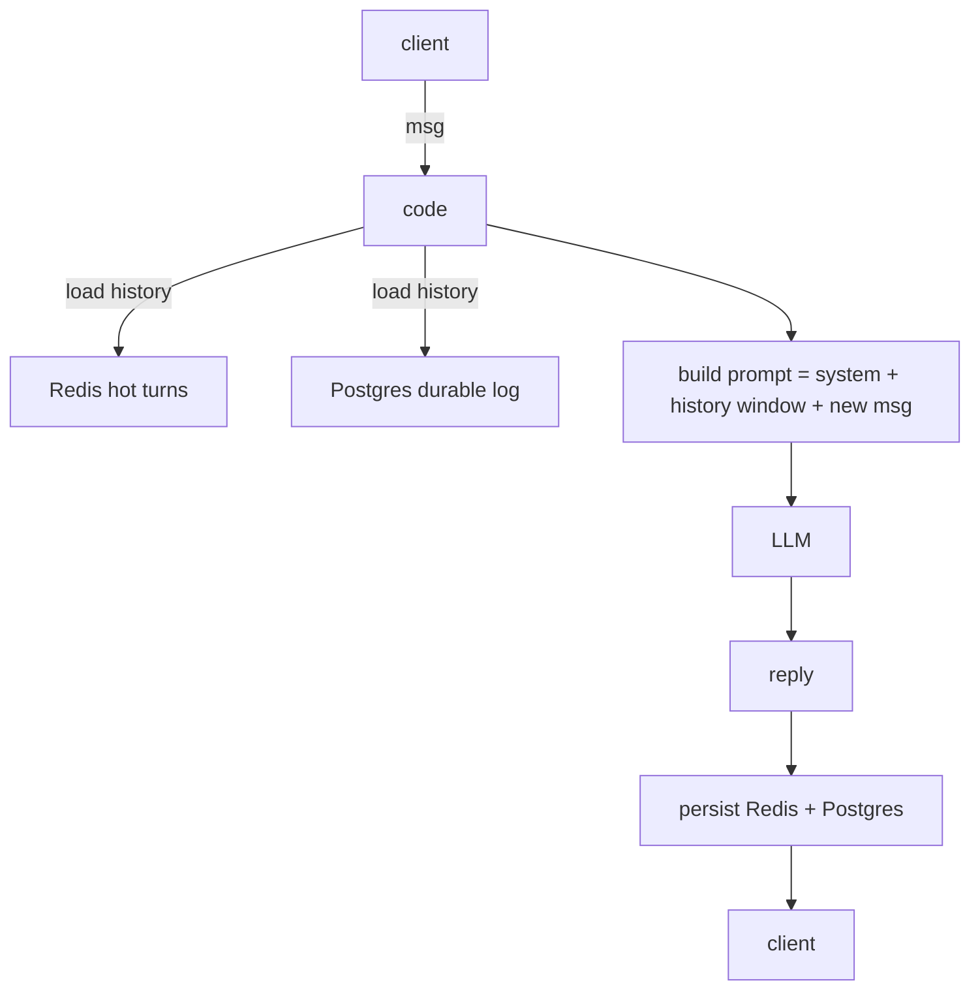
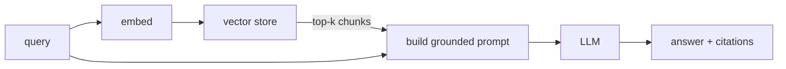
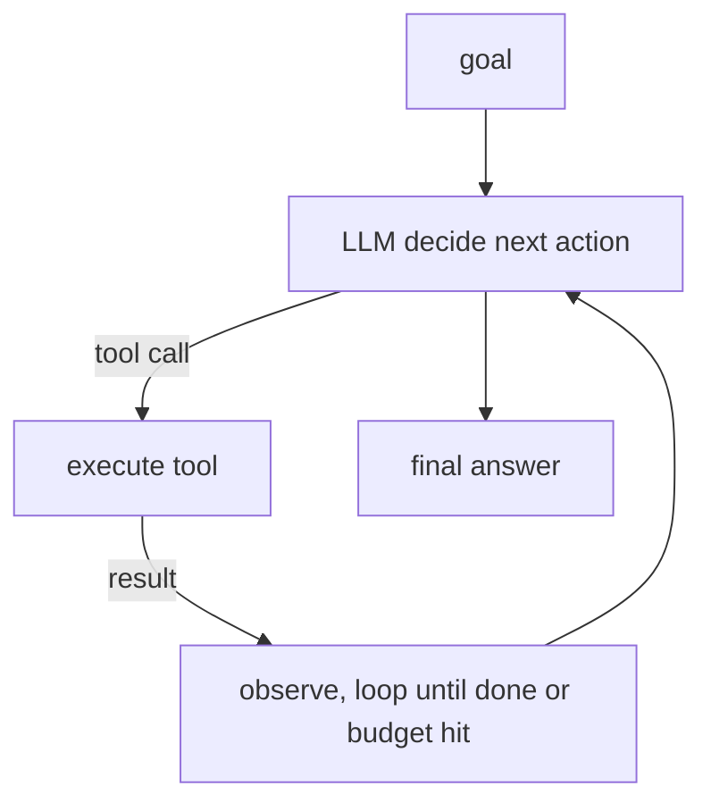
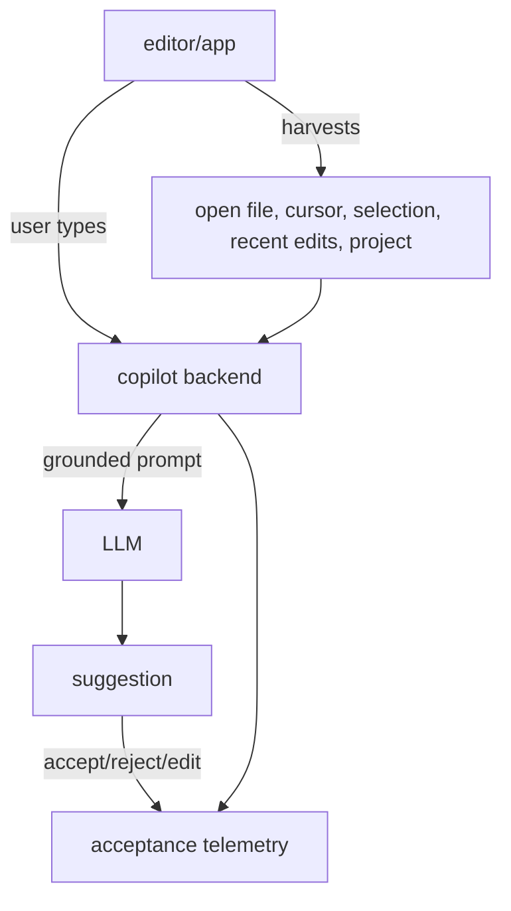

# Lecture 1: The Five Reference Architectures and the Escalation Ladder

> Almost every LLM product you will ever build is one of five shapes, or a composition of them. If you can draw those five shapes from memory — knowing exactly what state each keeps, where that state lives, and which failure modes it drags in — you can size, debug, and cost any system in an interview or a design review. This lecture teaches those shapes as *architecture* (boxes, arrows, state ownership), then teaches the single most important discipline in the field: **climb the escalation ladder from the bottom, and stop on the lowest rung that meets the requirement.** After this you will be able to look at a feature request and say, in thirty seconds, "that's a stateful chatbot with a cache, not an agent — here's why," and defend it.

**Prerequisites:** HTTP request/response, async basics, "treat model output as untrusted input" (Phase 2), a working RAG mental model (Phase 3-4) · **Reading time:** ~22 min · **Part of:** Phase 09 — Architecture & System Design, Week 1

---

## The core idea (plain language)

An LLM is a **stateless text function**: tokens in, tokens out, no memory of the last call. Every product feeling of "it remembers me," "it knows our docs," "it can take actions," or "it lives inside my editor" is *architecture wrapped around that stateless function* — state stores, retrieval layers, control loops, and telemetry that you build and own. The model is the leaf; the interesting engineering is the tree.

There are five canonical trees. They form a **ladder** because each rung adds one capability by adding one category of state and, unavoidably, one new class of failure:

```
        capability ↑           state added              new failure class
5  in-product copilot     harvested editor/app context  wrong-context, acceptance-gaming
4  tool-using agent       plan + scratchpad + loop       runaway loops, bad tool calls
3  RAG app                retrieval index + citations    retrieval miss, stale/poisoned docs
2  stateful chatbot       conversation history           context overflow, memory drift
1  single-turn feature    (none)                          just the model's own errors
```

The governing discipline, straight from Anthropic's *Building effective agents*: **use the lowest rung that meets the requirement.** Agents are the last resort, not the default. Every rung you climb multiplies your latency, your cost variance, and — critically — the number of things that can go wrong non-deterministically. You climb only when the rung below provably cannot do the job.

---

## How it actually works (mechanism, from first principles)

### Rung 1 — Single-turn feature (stateless request/response)



**State it keeps:** none. Each request is independent. "Summarize this ticket," "classify this email," "extract JSON from this PDF page." The prompt is fully constructed from the incoming request.

**Where state lives:** nowhere persistent. Maybe a response cache keyed on the input hash, but that's an optimization, not architecture.

**New failure modes:** only the model's own — hallucination, format drift, refusal. There is no conversation to corrupt, no index to go stale, no loop to run away. This is the *safest* rung and you should be slightly suspicious every time you leave it.

**Latency/cost profile:** one model call. Predictable. If input is ~800 tokens and output ~200, you pay for ~1000 tokens, one round trip, TTFT dominated by the provider. Cost per request is a *constant* you can multiply by QPS with confidence.

**Testability sacrificed:** almost none. This is a pure-ish function — same input, (nearly) same output at temperature 0. You can build a golden set of (input → expected) pairs and assert against it. This is the most testable LLM architecture that exists.

### Rung 2 — Stateful chatbot (conversation state + context-window management)



**State it keeps:** the conversation. Every turn must be replayed to the model because the model itself is stateless — "memory" is *you re-sending the transcript on every call.*

**Where state lives:** the four-tier layout from the spine — Redis for the hot turn buffer (ms reads, TTL'd), Postgres as durable source of truth, object storage for attachments, and later a vector store for long-term semantic memory. The hot buffer is an optimization over the durable log; on a cache miss you rehydrate from Postgres.

**The core mechanism — context-window management.** A model has a fixed context window (e.g. ~200K tokens for current Claude, ~128K for many others). A conversation grows without bound; the window does not. So you *manage* it:

- **Sliding window:** keep the last N turns verbatim. Simple, but you silently forget turn 1.
- **Rolling summarization (compaction):** when buffered tokens cross a threshold, summarize old turns into a compact synopsis — but **copy entities, IDs, dates, and amounts verbatim.** A summary that turns "order #A-4471 for $312.50" into "a recent order" is a *bug*, not a compression.
- **Retrieval memory:** embed old turns, retrieve only the relevant ones per new message.

Trigger compaction on a **token threshold, not a turn count** — one turn can be a 50-token "ok" or a 4000-token pasted stack trace.

**Numeric example:** window budget 8000 tokens for history. Turns average 250 tokens. You fit ~32 turns. At turn 33 you must act: sliding window drops turn 1; compaction squeezes turns 1–20 into a 400-token summary, freeing ~4600 tokens.

**New failure modes:** context overflow (hard error or silent truncation), *memory drift* (the summary loses a fact the user relies on three turns later), and idempotency bugs — a client retry double-writes history and, if you also bill, double-charges. This is why the spine's `/chat` demands an idempotency key.

**Latency/cost profile:** cost grows with conversation length because you re-send history every turn. A 30-turn chat can send 8000+ input tokens *per turn* — 10x the single-turn cost even though the user typed one line. Compaction and windowing exist largely to cap this.

**Testability sacrificed:** you can no longer test a single call in isolation — behavior depends on accumulated state. You test *conversations* (scripted turn sequences) and must assert invariants like "the order number survives compaction."

### Rung 3 — RAG app (retrieval + grounding + citation)



**State it keeps:** an external knowledge corpus, chunked, embedded, and indexed. This state is *not the conversation* — it's your documents, and it lives in a vector store (pgvector/Qdrant) plus usually a keyword index for hybrid search.

**Mechanism:** at query time you retrieve the top-k relevant chunks and inject them into the prompt as grounding, instructing the model to answer *only* from them and to cite. The model's job shrinks from "know everything" to "read these five paragraphs and answer." That's what kills hallucination on private/current facts.

**New failure modes** — and these are retrieval failures, not model failures:
- **Retrieval miss:** the right chunk exists but ranks 11th; k=10; the model confidently answers from wrong context.
- **Stale index:** a doc changed; the embedding didn't reindex; you cite yesterday's price.
- **Poisoned/conflated context:** two tenants' docs in one index → a cross-tenant leak (a *security* incident, echoing the tenant-keying iron rule you'll enforce on caches in Week 2).
- **Citation drift:** the model cites chunk 3 but actually used its parametric memory.

**Latency/cost profile:** now two subsystems on the critical path — an embedding call + a vector search (typically 10–50 ms) *before* the LLM call. Input tokens balloon: 5 chunks × ~400 tokens = 2000 grounding tokens added to every request. TTFT rises; cost per request rises with k.

**Testability sacrificed:** you now have two things to evaluate separately — **retrieval quality** (did we fetch the right chunks? recall@k) and **generation quality** (given good chunks, was the answer faithful?). A bad answer could be either subsystem. You need a golden set of (question → relevant-doc-ids) *and* (question+context → good-answer).

### Rung 4 — Tool-using agent (plan / act / observe loop)



**State it keeps:** a running **scratchpad** — the goal, the plan, and the growing transcript of (action → observation) pairs — plus the tool schemas. The distinguishing feature: **the model decides control flow.** It chooses which tool to call and when to stop.

**Mechanism:** you expose tools as typed schemas. Each turn the model emits either a tool call (which your code executes and feeds back as an observation) or a final answer. The loop repeats until done or a budget is exhausted. Crucially, "LLM proposes, code disposes": the model *proposes* a tool call; your deterministic code *validates and executes* it, and enforces the budget and guardrails.

**New failure modes** — the scariest set:
- **Runaway loops:** the model calls tools forever, never converging. You *must* cap iterations (e.g. max 10) and total token/dollar budget.
- **Bad tool calls:** malformed args, wrong tool, destructive action (a `delete` when it meant `read`). This is why write-actions get human-in-the-loop approval.
- **Compounding error:** each step is ~95% reliable; ten steps chain to 0.95^10 ≈ 60% end-to-end success. Reliability *decays multiplicatively* with loop length — the single most important number to internalize about agents.
- **Non-reproducibility:** the same goal can take a different path each run.

**Latency/cost profile:** *unbounded and variable* unless you cap it. N loop iterations = N model calls, each re-sending the growing scratchpad. A 6-step agent can cost 15–30x a single-turn feature and take 20+ seconds. Cost is now a *distribution*, not a constant — plan for the p95, not the mean.

**Testability sacrificed:** the most of any rung. Non-deterministic control flow means you can't assert "it will take these exact steps." You test *outcomes* (did the final state satisfy the goal?) and *trajectories* (did it stay within budget, never call a forbidden tool?), and you lean hard on tracing to reconstruct what happened.

### Rung 5 — In-product copilot (embedded, context-harvesting, low-latency)



**State it keeps:** two special kinds. (1) **Harvested context** — the copilot silently gathers the surrounding application state (the open file, cursor position, selected text, recent edits, adjacent files) to build the prompt *without the user typing it*. (2) **Acceptance telemetry** — did the user accept, reject, or edit the suggestion? This is the product's core quality signal and its data flywheel.

**Mechanism:** it's often a single-turn or short-RAG call *underneath*, but the architecture is dominated by two constraints. **Latency is a hard product requirement** — a code-completion copilot that takes 2 seconds is useless because the user has typed past it; you're targeting sub-few-hundred-ms TTFT, which forces small/fast models, aggressive caching, and speculative prefetching. And **context harvesting is the hard part** — choosing *what* of the app state to include, within a latency and token budget.

**New failure modes:**
- **Wrong-context harvesting:** you grabbed the wrong file / stale buffer → a confident, irrelevant suggestion.
- **Latency-quality tension:** the model fast enough to be useful may be too weak to be right.
- **Acceptance-metric gaming:** optimizing "acceptance rate" can reward short, safe, low-value suggestions; a high accept rate with low retained-code rate is a trap.
- **Privacy surface:** harvesting means source code / documents leave the client — a data-flow and compliance concern (ties back to Week 1 GDPR and Week 3 privacy boundaries).

**Latency/cost profile:** extreme latency pressure, very high call volume (fires on keystrokes/pauses), so cost is dominated by *volume × caching efficiency*. This rung lives or dies on cache hit rate and model size.

**Testability sacrificed:** offline eval is weak because quality is defined by *in-context human acceptance*, which you can only measure in production via telemetry. You design *for* evaluability (log the resolved context, model version, and the accept/reject outcome per suggestion) because that online signal is most of your ground truth.

---

## Worked example — the same feature at three rungs

A support team wants: *"answer customer questions about our refund policy."*

- **Rung 1 (single-turn):** paste the (short, static) policy into the system prompt; classify+answer in one call. ~1200 input + 150 output tokens, one round trip, ~700 ms, fully golden-testable. **If the policy fits in the prompt and rarely changes, stop here.**
- **Rung 3 (RAG):** policy is 40 pages across 12 documents that change monthly → you can't fit it and can't redeploy on every edit. Add retrieval: embed the question, fetch top-5 chunks, ground+cite. Now ~2500 input tokens, +30 ms retrieval, and you own reindexing. Justified — Rung 1 *provably* can't hold 40 changing pages.
- **Rung 4 (agent):** now they want it to *issue the refund* — look up the order, check eligibility, call the payments API, email the customer. The model must decide a sequence of actions against live systems. Only *now* do you climb to an agent — and you immediately add a max-iteration cap, tool schemas with validation, and human approval on the actual refund write.

The discipline: each climb was forced by a concrete requirement the rung below could not meet. Nobody started at Rung 4 because "agents are cool." A naive team that builds the refund agent first spends 20x the tokens and ships a system that fails ~40% of the time on 10-step tasks, when 80% of tickets were answerable by Rung 1.

---

## How it shows up in production

**Cost scales with the rung, super-linearly.** Rough, approximate multipliers vs a single-turn call: chatbot 3–10x (history resent every turn), RAG +1x per retrieval round with fat input, agent 10–30x (loop × growing scratchpad). Your finance dashboard will show agent features as the runaway line item.

**Latency compounds down the stack.** Every rung adds a serial dependency: retrieval before generation, loop iterations in series. A copilot cannot afford any of this, which is *why* copilots are architecturally constrained to the fast path.

**Debugging difficulty tracks non-determinism.** A single-turn bug is reproducible from the input. An agent bug ("it did the wrong thing once, on Tuesday") is only debuggable if you *traced* the full trajectory — which is why Phase 7's tracing mindset is a prerequisite here. The higher the rung, the more your observability is the only thing standing between you and "cannot reproduce."

**Workflows vs agents — the fork that decides your on-call life.** Anthropic draws a sharp line:
- A **workflow** = LLM calls orchestrated through **fixed, predefined code paths.** *You* wrote the control flow; the model fills in fuzzy language steps at the leaves. Deterministic, testable, cheap, debuggable.
- An **agent** = the **model dynamically directs its own control flow** and tool use. Flexible, but non-deterministic, variable-cost, and hard to test.

Most problems that *look* like they need an agent are actually a workflow: prompt chaining, routing (classify then dispatch to a specialized path), or parallelization. Reach for a true agent only when the task genuinely requires the model to decide *how many* steps and *which* order at runtime — and you can't enumerate the paths in advance. In production, a workflow that fails is a bug you can fix; an agent that fails is an incident you have to reconstruct.

---

## Common misconceptions & failure modes

- **"We need an agent."** Usually false. You need a *workflow* — fixed code paths with LLM leaves. Agents are the last resort. This is the single most common (and expensive) architectural mistake in 2025-2026.
- **"The chatbot remembers the conversation."** It doesn't. *You* re-send the transcript every call. "Memory" is your storage tier plus context management; the model is amnesiac.
- **"RAG failures are model failures."** Most are *retrieval* failures — wrong chunks, stale index, bad k. Debug retrieval first; only blame generation once you've confirmed the context was good.
- **"Higher acceptance rate = better copilot."** Not necessarily — short, safe suggestions inflate acceptance while adding little value. Measure retained/edited-and-kept code, not raw accepts.
- **Letting the LLM own control flow (Rung 4 creep).** The moment your business logic branches *inside* the model call rather than in deterministic code, you've lost testability. Keep the boundary: LLM proposes, code disposes.
- **No loop budget on an agent.** A runaway loop burns real dollars in minutes. Cap iterations *and* total spend, always.
- **Ignoring compounding error.** 95% per-step reliability feels great until the 10th step, where end-to-end is ~60%. Shorter loops, checkpoints, and human gates exist to fight this decay.

---

## Rules of thumb / cheat sheet

- **Start at Rung 1. Climb only when forced by a concrete requirement the rung below provably can't meet.**
- Fits in the prompt and rarely changes → **Rung 1**, done.
- Needs to remember the conversation → **Rung 2**; compact on a *token* threshold; copy IDs/amounts verbatim.
- Needs current/private facts too big to prompt → **Rung 3**; ground + cite; evaluate retrieval and generation *separately*.
- Needs to *take actions* in an order the model must decide at runtime → **Rung 4**; cap iterations + budget, validate every tool call, human-approve writes.
- Lives inside another app with a hard latency SLA → **Rung 5**; small fast model, harvest context, log acceptance.
- **Workflow (fixed code paths) beats agent (model-decided flow)** whenever you can enumerate the paths. Prefer prompt-chaining / routing / parallelization before autonomy.
- Cost multiplier vs single-turn (approximate): chatbot 3–10x · RAG +fat input · agent 10–30x. Budget the **p95**, not the mean.
- End-to-end reliability ≈ (per-step reliability)^(steps). Keep loops short.
- Every rung: know **what state it keeps, where that state lives, what new failure it adds, and what it costs to test.**

---

## Connect to the lab

This week's lab builds **Rung 2 for real**: a stateful `/chat` on the four-tier store (Redis hot buffer + Postgres durable log + object storage + pgvector memory), with idempotent writes and token-threshold compaction that preserves entities verbatim. You'll enforce the "LLM proposes, code disposes" boundary by keeping `llm.py` a single leaf-only `complete()` call with zero business logic — the architectural discipline this lecture argues for, made concrete and testable. The GDPR cascade-delete you build is the flip side of "know where your state lives": you can only prove erasure across every store because you drew the state map first.

## Going deeper (optional)

- **Anthropic — *Building effective agents*** (the workflow-vs-agent spine, escalation discipline, and the agent patterns). Search: "Anthropic building effective agents". Root: `anthropic.com`.
- **Anthropic docs — tool use / agents** on `docs.anthropic.com`. Search: "Anthropic tool use documentation".
- **OpenAI Cookbook** — assistant/RAG/tool examples. Root: `cookbook.openai.com`.
- **LangGraph docs** — for when a workflow/agent genuinely needs an orchestration graph. Search: "LangGraph documentation".
- **Chip Huyen — *AI Engineering* (2024/2025 book)** — reference-architecture and system-design framing for LLM apps.
- **Martin Fowler — "CircuitBreaker" pattern** (background for Week 2 resilience). Search: "Martin Fowler CircuitBreaker".
- Search queries: "RAG retrieval vs generation evaluation", "LLM agent compounding error reliability", "context window compaction summarization entities".

## Check yourself

1. The model is stateless, yet a chatbot "remembers" the conversation. Where does that memory actually live, and what happens at every single turn to create the illusion?
2. Give one concrete requirement that forces you from Rung 3 (RAG) up to Rung 4 (agent) — and name the first two guardrails you'd add on arrival.
3. A RAG app returns a confidently wrong answer. Name the two subsystems that could be at fault and how you'd tell them apart.
4. Define "workflow" vs "agent" in one sentence each, using the phrase "control flow." Which is the default and why?
5. An agent step is 95% reliable. Estimate end-to-end reliability for a 10-step task, and state the design lesson.
6. Why is a copilot architecturally forced onto the "fast path" (small model, heavy caching) in a way a batch summarizer is not?

### Answer key

1. The memory lives in *your* storage tiers (hot Redis buffer over a durable Postgres log). At every turn you rebuild the prompt by re-sending the system prompt plus a managed window of prior turns plus the new message — the model re-reads the transcript each call because it retains nothing itself.
2. Any requirement to *take actions in a runtime-decided order* — e.g. "look up the order, check eligibility, then issue the refund." First guardrails: a max-iteration/budget cap and per-tool-call validation (plus human approval on the write action). Answering questions never needs Rung 4; *acting* on live systems does.
3. **Retrieval** (wrong/stale/missing chunks — the right context never reached the model) or **generation** (good context, but the model ignored it or hallucinated). Distinguish by inspecting the retrieved chunks: if the answer isn't supported by *any* retrieved chunk, it's generation; if the supporting chunk was never retrieved, it's retrieval.
4. A **workflow** orchestrates LLM calls through fixed, predefined *control flow* that you wrote. An **agent** lets the model dynamically direct its own *control flow* and tool use at runtime. Workflow is the default because fixed control flow is deterministic, testable, cheaper, and debuggable; agents trade all of that for flexibility you should only buy when you can't enumerate the paths.
5. 0.95^10 ≈ 0.60, so ~60% end-to-end. Lesson: reliability decays multiplicatively with loop length — keep loops short, add checkpoints/validation between steps, and gate risky actions with humans.
6. A copilot fires inside another app under a hard latency budget (the user types past a slow suggestion), so it must minimize TTFT — forcing small/fast models, aggressive caching, and prefetching. A batch summarizer has no interactive latency SLA, so it can use a large slow model and pay for quality with time.
