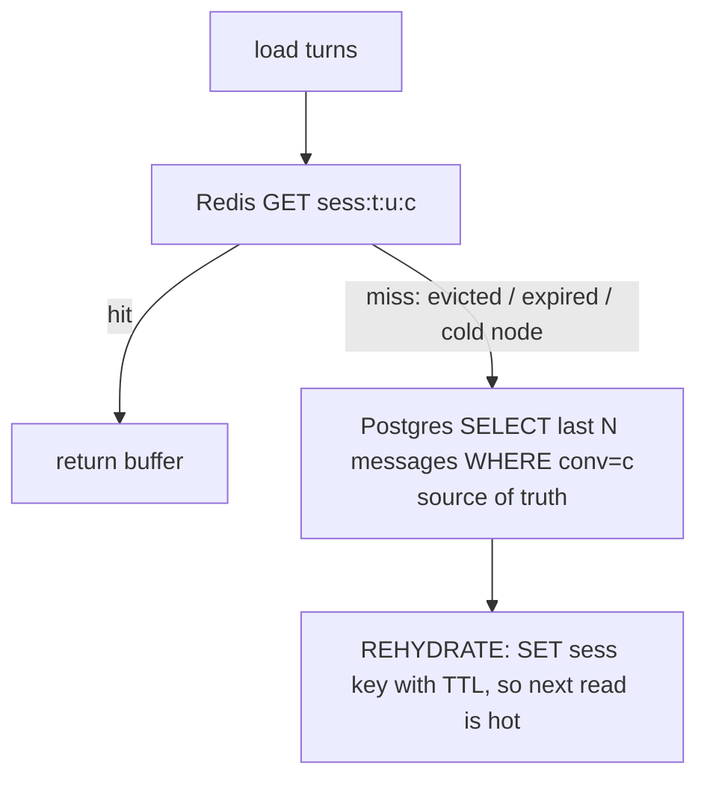

# Lecture 3: Four-Tier State — Redis, Postgres, Object Storage, Vector

> Every conversational-AI system that survives contact with production ends up with the same four stores, and every one that *dies* in production got there by trying to use fewer. The seductive mistake is "just put it all in Postgres" (or all in Redis, or all in the vector DB) — one store, one client, one mental model. It feels clean for a week and then the session buffer melts your write throughput, or a Redis restart wipes conversations users paid for, or your GDPR-delete misses the semantic cache and you're legally exposed. This lecture exists because the *shape* of your state — what lives where, how long, and who is allowed to be the source of truth — is the load-bearing decision of the whole phase. Get it right and Week 1's GDPR cascade delete and Week 2's per-tenant cache isolation both become mechanical. Get it wrong and both become impossible to bolt on later. After this lecture you will be able to draw the four-tier layout from memory, place any piece of conversational state in exactly one tier and justify it with latency/durability/TTL, write Redis keys that a `SCAN`-based delete can find, order the read and write paths correctly, and name the single bug that kills more of these systems than any other.

**Prerequisites:** Basic Redis (`GET`/`SET`/`EXPIRE`), Postgres (transactions, indexes), and S3-style object storage; the idea of a vector embedding as a fixed-length float array; comfort reading Python · **Reading time:** ~30 min · **Part of:** Phase 9 (AI Application Architecture & System Design) Week 1

---

## The core idea (plain language)

A conversational-AI request touches four fundamentally different *kinds* of data, and those kinds have incompatible requirements. Trying to serve all four from one store means picking one store's trade-offs and forcing the other three kinds to live with them. That never ends well, so you split the data along the seams where the requirements diverge:

- **Hot, ephemeral, read-on-every-turn** — the last few turns of the current conversation, a dedup key for the in-flight request, a rate-limit counter, a cached answer. You read these on the critical path of *every* request, so they must be **sub-millisecond**. They can be *rebuilt* if lost. → **Redis.**
- **Durable, transactional, must-survive-anything** — the user and tenant records, the full message history, the spend ledger you bill against. If you lose these you have lost the business. They must survive a power cut, be queryable with joins, and update atomically. → **Postgres.**
- **Large, opaque, write-once-read-rarely** — a 40 MB uploaded PDF, the raw request/response JSON you archive for audit, an image the user sent. Storing these as rows would bloat your database and blow up backups. → **Object storage (S3/MinIO).**
- **Semantic, similarity-searched, dimensional** — the embeddings that power long-term memory and RAG retrieval. You don't query these by key or by `WHERE` clause; you query them by "what's *near* this vector." → **Vector store (pgvector/Qdrant).**

The single most important sentence in this lecture, the one that the classic bug violates:

> **Redis is volatile and is never the source of truth. Postgres is durable and is always the source of truth. Everything else is a specialization.**

Redis holds a *copy* of state that also lives, authoritatively, in Postgres. If Redis vanishes, you reload from Postgres and lose nothing but latency. The moment you write something to Redis that exists *nowhere else* — a conversation turn, a spend increment, a user's consent flag — you have built a system that silently loses data on every restart, eviction, or failover. Hold that. It is the spine of everything below.

---

## How it actually works (mechanism, from first principles)

### The four tiers, side by side

This is the table the Definition of Done asks you to write for your README. Learn to reproduce it from memory — it *is* the mental model.

```
TIER            LATENCY    DURABILITY            TTL POLICY           SOURCE OF   WHAT LIVES THERE
                CLASS      GUARANTEE                                  TRUTH?
------------------------------------------------------------------------------------------------------------
Redis           ~0.1-1 ms  VOLATILE (RAM;        Aggressive TTL on    NEVER       Recent-turn buffer,
                           optional AOF/RDB but   everything: sessions             rate-limit counters,
                           treat as losable)      1h, dedup keys 24h,             idempotency/dedup keys,
                                                   cache 5-60 min                  exact + semantic cache
------------------------------------------------------------------------------------------------------------
Postgres        ~1-10 ms   DURABLE (WAL +         NO TTL. Rows live    ALWAYS      users, tenants,
                           fsync; survives        until deleted by                conversations, messages,
                           restart; ACID)         business logic /                spend_ledger, config,
                                                   GDPR delete                     consent flags
------------------------------------------------------------------------------------------------------------
Object store    ~20-200 ms DURABLE (11 nines on   Lifecycle rules      For blobs   uploaded files, big
(S3/MinIO)      first byte 3 S3; MinIO = your     (e.g. archive->cold  only        attachments, raw
                           disk redundancy)       after 90d, expire                request/response
                                                   raw logs after 1y)              archives, exports
------------------------------------------------------------------------------------------------------------
Vector store    ~5-50 ms   DURABLE (pgvector =    NO TTL; pruned by    For         long-term semantic
(pgvector/      per query  Postgres durability;   business/GDPR logic  embeddings  memory, RAG chunk
Qdrant)                    Qdrant = its own                            + their     index, per-user
                           persistence)                                metadata    "remember that I..."
------------------------------------------------------------------------------------------------------------
```

Read the table as a set of *why-not-one-store* arguments:

- **Why not all-Postgres?** You *could* store the session buffer in Postgres. But you read it on every single turn, and a chatty product does thousands of turns/second. Each read is a disk-backed, MVCC, index-lookup query at ~1–10 ms; Redis does the same read from RAM at ~0.1–1 ms — 10–100× faster — and absorbs the read load that would otherwise pin your primary's CPU. Postgres is where the data must *end up*; Redis is what keeps Postgres from being hammered on the hot path.
- **Why not all-Redis?** Redis lives in RAM. A restart, an OOM eviction, or a failover to a replica that lagged can vaporize keys. That is *fine* for a cache and *catastrophic* for a spend ledger. Redis persistence (RDB snapshots, AOF) reduces the window but does not make Redis a database — replication is asynchronous, AOF can lose the last fsync-interval of writes, and eviction policies will *delete your data to make room* under memory pressure. Designing as if Redis is durable is the bug we name at the end.
- **Why not put blobs in Postgres?** A 40 MB PDF as a `bytea` column bloats every backup, every replication stream, and every `SELECT *` that forgets to exclude the column. Object storage is built for exactly this: cheap per-GB, streamed, lifecycle-managed. You store the *pointer* (an S3 key) in Postgres and the *bytes* in the object store.
- **Why not query embeddings with `WHERE`?** A vector query is "find the 10 rows whose 768-dim embedding is closest (cosine) to this one." That is not a B-tree lookup; it needs an approximate-nearest-neighbor index (HNSW/IVFFlat). `pgvector` bolts this onto Postgres so you keep one database; Qdrant is a dedicated engine when you outgrow it. Either way it is a *different query model*, which is why it's its own tier even when it physically shares Postgres.

### Redis key-namespacing discipline (learn this before you write one key)

Everything downstream — the GDPR delete in Week 1, the cache isolation in Week 2 — depends on your Redis keys being *structured so you can find and scope them by tenant and user*. Decide the scheme **before** you write the first `SET`, because retrofitting a key scheme onto a live system means migrating every key.

The convention: colon-delimited, most-general prefix first, tenant and user near the front so a prefix scan isolates them.

```
{tenant}:{user}:{kind}:{id}

sess:t_42:u_1007:conv:c_88          # session buffer for one conversation
dedup:t_42:u_1007:idem:9f3a...      # idempotency key (dedup an in-flight request)
rl:t_42:u_1007:tokens               # token-bucket rate-limit counter
cache:t_42:exact:sha256(...)        # exact-match response cache (tenant-scoped, not user)
cache:t_42:sem:...                  # semantic cache (tenant-scoped)
```

Two rules make or break this:

1. **Tenant prefix is mandatory on every key.** Week 2's iron law is "never serve a cache hit across a tenant boundary." If `cache:` keys carry `t_42`, tenant 43 *cannot* even name tenant 42's key, let alone read it. Isolation becomes a property of the key layout, not a runtime check you might forget.
2. **User prefix on everything user-scoped.** GDPR erasure for user `u_1007` must delete *all* their Redis keys. If every session, dedup, and rate-limit key is prefixed `t_42:u_1007:`, the delete is a single prefix scan. Keys that omit the user (like `cache:t_42:exact:...`, which is tenant- but not user-scoped) need a different erasure strategy — usually "let TTL expire it" plus "the cached *content* had no PII because you cache-keyed on a hash, not the raw text" — which is exactly why you think about this now, not during an incident.

### `KEYS` will page you at 3 a.m. — use `SCAN`

To find "all keys for user u_1007" the naive command is `KEYS t_42:u_1007:*`. **Do not.** `KEYS` is O(N) over the *entire keyspace* and Redis is single-threaded: while it walks millions of keys, every other command — every session read, every rate-limit check, for every tenant — blocks behind it. On a keyspace of a few million, a single `KEYS` can stall the server for hundreds of milliseconds to seconds. You have just turned a maintenance operation into a site-wide latency spike.

`SCAN` is the cursor-based, non-blocking alternative. It returns a chunk of keys plus a cursor; you loop until the cursor comes back `0`. Each call does bounded work, so other commands interleave.

```python
async def scan_keys(redis, pattern: str, count: int = 500):
    cursor = 0
    while True:
        cursor, keys = await redis.scan(cursor, match=pattern, count=count)
        for k in keys:
            yield k
        if cursor == 0:
            break
```

Caveats that bite: `SCAN` guarantees keys present for the whole scan are returned *at least once* (you may see duplicates, and keys added/removed mid-scan may or may not appear) — fine for a best-effort delete, and you re-scan to verify zero afterward. `count` is a *hint*, not a page size. And even `SCAN` with a broad `match` still *touches* keys server-side, so scope the pattern with your tenant/user prefix to keep the walk small.

### EXPIRE / TTL semantics

`EXPIRE key seconds` (or `SET key val EX 3600`) attaches a time-to-live; when it elapses the key is deleted. Mechanics worth internalizing:

- **Deletion is lazy + sampled, not instant.** Redis deletes an expired key when it's next *accessed*, and separately a background job samples a few keys ~10×/second and evicts the expired ones. So an expired key can occupy memory briefly after its TTL — usually irrelevant, occasionally the reason your memory graph lags your TTL math.
- **Writes can reset TTL — know which.** `SET` without `KEEPTTL` **clears** the TTL (key becomes persistent). This is a classic leak: you `SET` a session, `EXPIRE` it 1h, then later `SET` it again to append a turn and *silently drop the expiry* — now it lives forever. Use `SET ... KEEPTTL`, or `EXPIRE`/`HSET`+`EXPIRE` deliberately on each write.
- **TTL is your safety net, not your delete.** Even a perfect GDPR delete benefits from every user-scoped key also carrying a TTL: if a delete misses a key (bug, race), TTL bounds how long the residue can live. TTL is defense in depth, not the primary erasure mechanism.

TTL policy per key kind (approximate, tune to your traffic):

```
sess:*    session/turn buffer   30-60 min   (rehydrated from PG on miss)
dedup:*   idempotency keys       6-24 h     (long enough to cover client retries)
rl:*      rate-limit counters    window len (1 min for a per-minute bucket)
cache:*   response cache         5-60 min   (staleness budget; shorter for volatile answers)
```

### The read path: Redis hit → Postgres fallback → rehydrate

Reading recent conversation turns follows the cache-aside pattern:



The miss is *normal*, not an error — TTL expiry, an evicted key, or a request landing on a fresh node all cause it. Because Postgres is the source of truth, the fallback is always correct; Redis only ever makes it *faster*. This is why "Redis is a cache, not a database" is operationally true: you can flush Redis entirely and the system self-heals on the next read, one rehydration at a time.

### The write path: durable to Postgres FIRST, then hot-push to Redis

The ordering is the whole ballgame, and it's the same crash-safety logic as idempotent ingestion:

```
WRONG (hot-first):
  1. push turn to Redis   ──▶ user sees it, downstream reads it
  2. *** crash ***
  3. Postgres write never happens
  Result: turn exists ONLY in volatile Redis. Redis restarts -> turn GONE.
          Source of truth never learned about it. Silent data loss.

RIGHT (durable-first):
  1. BEGIN; INSERT message ...; UPDATE spend_ledger ...; COMMIT;   (durable, atomic)
  2. *** crash here? ***  -> data is safe in PG; Redis just misses next read
                             and rehydrates from PG. No loss.
  3. SET sess:t:u:c ... EX 3600   (best-effort hot push; if it fails, who cares —
                                   the next read rehydrates)
```

Write to the durable source of truth first, in a transaction; only then update the volatile copy. A crash between the two costs you a cache miss, never a lost turn. Note the spend-ledger increment lives *inside the Postgres transaction* — money must be transactional and durable, so a rate-limit/spend counter you keep in Redis for *speed* is a fast approximation that you reconcile against the ledger, never the ledger itself.

---

## Worked example

A user sends one chat turn. Tenant `t_42`, user `u_1007`, conversation `c_88`, idempotency key `9f3a`. Trace the four tiers.

**1. Dedup (Redis).** `SET dedup:t_42:u_1007:idem:9f3a "in-progress" NX EX 86400`. `NX` = set only if absent; it returns nil, meaning we've seen this key — a retry. We fetch and return the stored prior response, skip the model call, and do **not** double-write the message or double-charge. First time through, `NX` succeeds and we proceed. (This is why a client retry after a timeout is safe.)

**2. Load context (Redis → Postgres).** `GET sess:t_42:u_1007:conv:c_88`. Suppose the TTL lapsed 40 minutes into an idle chat → **miss**. Fall back: `SELECT role, content FROM messages WHERE conversation_id='c_88' ORDER BY seq DESC LIMIT 12`. Postgres returns the last 12 turns in ~3 ms. **Rehydrate**: `SET sess:... <12 turns> EX 3600`. Next turn this reads from RAM in ~0.4 ms.

**3. Rate-limit check (Redis).** Token bucket `rl:t_42:u_1007:tokens`. Estimated request cost ~1,500 tokens; bucket has 8,000; allow, decrement to 6,500. If it had been empty → HTTP 429, no model call. (Fast, approximate; the authoritative spend number is the ledger in step 6.)

**4. The one LLM call.** With context assembled, call the model. This is the *only* non-deterministic step. If the user had uploaded a 12 MB PDF referenced in this turn, its bytes are in **object storage** at `s3://uploads/t_42/u_1007/c_88/doc.pdf`; Postgres holds the *pointer* row, and we stream the file from S3 only if the turn needs it.

**5. Semantic memory (vector).** The user said "remember I'm allergic to penicillin." We embed that sentence → a 768-dim vector → `INSERT INTO memories (user_id, tenant_id, embedding, text) VALUES (...)`. Three weeks later, "can I take amoxicillin?" embeds to a nearby vector; an ANN search over `memories` filtered to `user_id='u_1007'` retrieves the allergy note and injects it into context. That retrieval is the vector tier earning its place — no `WHERE text LIKE` could find "penicillin" from "amoxicillin."

**6. Durable write + hot push.** `BEGIN; INSERT INTO messages (conv, role, content, seq); UPDATE spend_ledger SET tokens = tokens + 1500, usd = usd + 0.003 WHERE tenant='t_42'; COMMIT;` — atomic and durable. **Then** `SET sess:t_42:u_1007:conv:c_88 <updated buffer> KEEPTTL` (note `KEEPTTL` so appending the turn doesn't wipe the 1h expiry). Also `SET dedup:...:9f3a <final response> EX 86400` so a retry returns the real answer.

**Now the GDPR delete for `u_1007`.** This is why namespacing was non-negotiable:
- Postgres: `DELETE FROM messages/conversations/memories/spend_ledger WHERE user_id='u_1007'` (in a transaction).
- Redis: `SCAN match=t_42:u_1007:* ` → `DEL` every hit (sessions, dedup, rate-limit). No `KEYS`. Then re-scan and assert **0**.
- Vector: `DELETE FROM memories WHERE user_id='u_1007'` (same as PG here since pgvector) *or* Qdrant filtered delete on `user_id`; then a semantic search for their content must return **0 rows**.
- Object storage: delete the `t_42/u_1007/` prefix.
- Tenant-scoped `cache:t_42:*` keys aren't user-addressable — but because you cache-keyed on a hash and never stored raw user text there, and they carry a short TTL, they self-expire. Return a receipt with per-store counts.

Every step above is *mechanical* precisely because the key scheme, the source-of-truth rule, and the tier boundaries were decided up front.

---

## How it shows up in production

- **The Redis-restart amnesia (the classic bug).** A team stores conversation turns *only* in Redis "because it's fast," planning to "add Postgres later." A routine `redis` upgrade restarts the node; AOF was on `everysec` so it lost the last second — but worse, the *replica they failed over to* had lagged, and thousands of in-flight conversations lost their most recent turns. Users see the assistant "forget" what they just said. There is no recovery because the source of truth never existed. Cost: an incident, lost user trust, and a frantic migration under pressure. This is the bug this entire lecture is built to prevent.
- **`KEYS` in the GDPR endpoint.** The delete works fine in staging (10k keys). In prod (8M keys) the first real erasure request runs `KEYS t_42:u_1007:*`, blocks the single Redis thread for ~1.2 s, and every tenant's p99 latency spikes into timeouts. The fix (`SCAN`) is a two-line change you should have made on day one.
- **The TTL that never was.** A refactor changes a session append from `HSET`+preserved-TTL to a plain `SET`, silently clearing the expiry. Sessions now live forever. Redis memory climbs for weeks, hits `maxmemory`, and the eviction policy starts deleting *other* tenants' keys to make room — including rate-limit counters, briefly disabling your spend protection. Root cause: one `SET` without `KEEPTTL`.
- **Blobs in the database.** Uploaded PDFs stored as `bytea` grow the primary to 400 GB. Nightly `pg_dump` now takes 6 hours and the replication stream saturates the network on every upload. Moving bytes to S3 and keeping only pointers shrinks the DB by 95% and makes backups fast again.
- **The cache that leaked across tenants.** A cache key was `sha256(model + messages)` with no tenant prefix. Two tenants ask the same generic question; tenant B gets tenant A's cached answer — which happened to contain A's internal data echoed from a prior turn. That's a data-leak incident, not a bug. A `t_{id}:` prefix on the key would have made it impossible.
- **Vector rows outliving their user.** GDPR delete removed the Postgres message rows but not the `memories` embeddings. Weeks later a RAG query retrieves the deleted user's "penicillin allergy" note and surfaces it. Deleting the row isn't enough; the *derived* embedding is a copy that must be erased too — the #1 real GDPR bug in AI systems.

---

## Common misconceptions & failure modes

- **"Redis has AOF/RDB, so it's durable enough to be the source of truth."** No. AOF `everysec` can lose ~1 s of writes; replication is async so a failover can lose more; and eviction will *delete your data* under memory pressure regardless of persistence. Persistence narrows the loss window; it does not make Redis a system of record. Postgres is the source of truth; Redis holds copies.
- **"One store is simpler, split later."** Splitting later means migrating live data and retrofitting a key scheme onto keys that don't have one — far harder than starting with four thin clients. The four tiers *are* the simple design; collapsing them is the complex one wearing a disguise.
- **"`KEYS` is fine, our keyspace is small."** It's small until it isn't, and the failure mode is a site-wide stall, not a slow query you'd notice early. Use `SCAN` from the first line of code; there is no reason to ever ship `KEYS` in an application path.
- **"A cache miss is an error to alert on."** Misses are the *normal* mechanism that keeps Redis honest — TTL expiry, eviction, cold nodes. Alert on miss *rate* trending abnormally (a sign of undersized memory or a TTL bug), never on individual misses.
- **"Put the spend counter only in Redis for speed."** Redis is fine as a *fast approximation* for rate limiting, but the billable, kill-switch-triggering number must be the durable, transactional `spend_ledger` in Postgres. A volatile counter that resets on restart is a free-money bug.
- **"Semantic cache and RAG index are the same thing, one vector store."** They serve different queries (cache: "have I answered *this exact-ish* prompt for *this tenant*?" vs memory: "what do I know about *this user*?") and have different TTL/erasure rules. Keep them logically separate even if they share an engine.
- **"Deleting the Postgres row satisfies GDPR."** Only if nothing else holds a copy. Embeddings, semantic-cache entries, object-storage archives, and log copies are all *derived data* that must be erased too. The vector index is the most-missed.

---

## Rules of thumb / cheat sheet

- **Source of truth is Postgres. Always.** Redis holds *copies*; if it can't be rebuilt from Postgres, it doesn't belong in Redis alone.
- **Latency ladder (approximate):** Redis ~0.1–1 ms · Postgres ~1–10 ms · vector ANN ~5–50 ms · object store first-byte ~20–200 ms. Put on the hot path only what needs the top rung.
- **Key scheme first, keys second.** `{tenant}:{user}:{kind}:{id}`. Tenant prefix on *every* key; user prefix on everything user-scoped. Decide before the first `SET`.
- **`SCAN`, never `KEYS`, in any code path.** `KEYS` blocks the single-threaded server; `SCAN` is cursored and interleaves.
- **TTL everything volatile.** Sessions 30–60 min, dedup 6–24 h, rate-limit = window, cache 5–60 min. TTL is your defense-in-depth against a missed delete.
- **`SET` clears TTL — use `KEEPTTL` on appends.** The silent immortal-key leak.
- **Write path: durable-first.** Postgres transaction (message + ledger) → *then* best-effort Redis push. Crash between them = a cache miss, never lost data.
- **Read path: cache-aside.** Redis hit → Postgres fallback → rehydrate with TTL. Misses are normal.
- **Blobs to object storage, pointers to Postgres.** Never store multi-MB bytes as DB columns.
- **Embeddings are copies too.** Any GDPR delete must hit the vector index and the semantic cache, then *verify* zero via a re-scan and a semantic search.
- *(Latency and TTL figures are order-of-magnitude engineering defaults, not measured benchmarks — profile your own workload.)*

---

## Connect to the lab

This is the theory spine under **Week 1's `deps.py`, `chat.py`, `memory.py`, and `gdpr.py`.** In `deps.py` you stand up one thin client per tier (redis, psycopg pool, boto3/MinIO, pgvector/Qdrant) and `GET /health` pings each. `chat.py` implements the exact read path (Redis→PG→rehydrate) and write path (durable PG transaction with the `spend_ledger` update, then hot Redis push with `KEEPTTL`) from this lecture, with the idempotency `dedup:` key gating the single `llm.complete` call. `gdpr.py` is where the namespacing pays off: it `SCAN`s `{tenant}:{user}:*` (never `KEYS`), deletes the pgvector rows, wipes the object-storage prefix, and returns a per-store receipt — and `tests/test_gdpr_delete.py` re-scans to assert **0 keys, 0 vector rows, 0 semantic-search hits** for the deleted user. Write the tier-justification paragraph in your README straight from the table above.

---

## Going deeper (optional)

- **Redis documentation — "Key eviction", "EXPIRE", and "SCAN"** (redis.io/docs). The precise, authoritative behavior of TTL, `maxmemory` eviction policies, and why `SCAN` exists instead of `KEYS`. Read the eviction page especially — it's where "Redis deleted my data" is explained.
- **PostgreSQL documentation — "Transactions" and "MVCC"** (postgresql.org/docs). Why the durable-first write is genuinely atomic and what `COMMIT` guarantees.
- **pgvector README** (github.com/pgvector/pgvector). The canonical intro to storing/querying embeddings in Postgres, HNSW vs IVFFlat indexes, and cosine/inner-product operators.
- **Qdrant documentation — "Filtering" and "Delete points"** (qdrant.tech/documentation). When you outgrow pgvector; the filtered-delete you need for per-user GDPR erasure.
- **AWS S3 — "Object lifecycle management"** and **MinIO docs** (docs.aws.amazon.com/s3, min.io). Lifecycle/expiry rules for raw-log and archive tiers.
- **GDPR Article 17 — "Right to erasure"** (search: *"GDPR Article 17 right to erasure"*). Engineering-relevant intuition for why derived copies (embeddings, caches) must be erased, not just the primary row.
- *Designing Data-Intensive Applications* by Martin Kleppmann — Chapters 1–3 on storage engines, replication, and the durability/latency trade-offs that justify the four-tier split.
- Search queries: *"redis KEYS vs SCAN production blocking"*, *"redis SET KEEPTTL expire reset"*, *"cache-aside pattern read-through write-through"*, *"pgvector HNSW index cosine distance"*, *"GDPR delete vector embeddings right to be forgotten"*.

---

## Check yourself

1. State the one-sentence rule that separates Redis from Postgres, and name the classic bug that violates it.
2. For each of the four tiers, name one thing that belongs there and one thing that must *not*.
3. Your teammate proposes `KEYS user:{id}:*` in the GDPR delete endpoint. What breaks in production, and what's the fix?
4. Give the correct order of the durable Postgres write and the Redis hot-push, and explain what a crash *between* the two costs in each ordering.
5. A refactor changes a session append from an `EXPIRE`-preserving write to a plain `SET`. What silently goes wrong, and how does it eventually take down rate limiting?
6. Why is deleting the Postgres user row insufficient for GDPR, and which store is most often missed?

### Answer key

1. **Redis is volatile and never the source of truth; Postgres is durable and always the source of truth — Redis holds only copies rebuildable from Postgres.** The classic bug is treating Redis as durable (storing turns/spend/consent *only* in Redis), so a restart, eviction, or lagged failover silently loses data that never existed anywhere authoritative.
2. Redis: *belongs* — session buffer, rate-limit counters, dedup keys, cache; *must not* — spend ledger, user records, anything with no durable copy. Postgres: *belongs* — users/tenants/messages/spend ledger; *must not* — multi-MB blobs (bloats backups), sub-ms hot-path reads it can't serve fast enough alone. Object storage: *belongs* — uploaded files, raw request/response archives; *must not* — data you query by field/join. Vector: *belongs* — embeddings for memory/RAG; *must not* — data you look up by exact key or `WHERE` (that's Postgres).
3. `KEYS` is O(N) over the whole keyspace on a single-threaded server; on a multi-million-key prod instance it blocks *every* command for hundreds of ms to seconds, spiking latency for all tenants. Fix: `SCAN` with a cursor and the tenant/user-scoped `match` prefix, looping until the cursor returns 0, then re-scan to verify zero.
4. **Durable Postgres transaction first (message + ledger), then best-effort Redis push.** Right order: a crash between them leaves data safe in Postgres and only causes a cache miss that rehydrates — no loss. Wrong order (Redis first): a crash before the Postgres write leaves the turn *only* in volatile Redis; a restart loses it and the source of truth never learned it existed — silent data loss.
5. A plain `SET` (without `KEEPTTL`) clears the key's expiry, so sessions become immortal. Redis memory climbs until it hits `maxmemory`; the eviction policy then deletes *other* keys — including rate-limit counters — to reclaim space, briefly disabling spend/limit protection. Fix: `SET ... KEEPTTL` or a deliberate `EXPIRE` on every append.
6. Because *derived copies* of the user's data live outside that row — embeddings in the vector index, entries in the semantic cache, archives in object storage, log copies — and GDPR erasure must cascade to all of them. The **vector index** (embeddings) is the most-often-missed, so a RAG query can still surface a "deleted" user's information; a compliant delete re-verifies with a semantic search returning zero hits.
