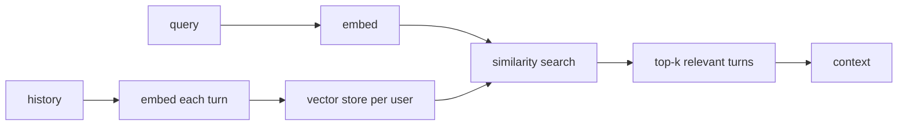

# Lecture 4: Context-Window Management — Windowing, Compaction, and Retrieval Memory

> A chatbot has no memory. Every turn, your code re-sends the entire conversation so the stateless model can "remember" it. That works for turn 3 and detonates at turn 300: the history outgrows the context window, the bill grows quadratically with conversation length, and latency creeps up on every single reply. This lecture exists because the naive fix ("just summarize the old stuff") quietly introduces a *correctness* bug — it drops the order number, the dollar amount, the account ID — and correctness bugs in memory are the worst kind, because they surface three turns later as a confidently wrong answer. After this lecture you will be able to choose between sliding window, rolling compaction, and retrieval memory for a given feature; trigger compaction on a *token* threshold rather than a turn count; structure a compacted context that provably preserves every required identifier; and write the Definition-of-Done assertion that proves your summarizer never lost an ID.

**Prerequisites:** the context-window & KV-cache lecture (input + output share one budget; cost scales with input tokens), tokenization (tokens ≠ words), basic embeddings/cosine similarity, and the idempotency lecture from Phase 5 · **Reading time:** ~24 min · **Part of:** Phase 9 Week 1

---

## The core idea (plain language)

The model is a pure function: `response = f(messages)`. It keeps nothing between calls. The *illusion* of memory is entirely your infrastructure re-sending prior turns on every request. So "context-window management" is really the answer to one operational question:

> **Given that I cannot resend the full history forever, what subset (or transformation) of history do I send on each turn — and what does that cost me in tokens, latency, and correctness?**

There are exactly three strategies, and mature systems combine them:

1. **Sliding window** — keep the last N turns, drop the rest. Dead simple, zero extra model calls. Loses old facts permanently the moment they scroll off.
2. **Rolling summarization (compaction)** — periodically fold old turns into a running summary, keep recent turns verbatim. Preserves the *gist* of the whole conversation in a fixed budget. The trap: a summary is lossy by design, and if the loss includes an identifier, that is a bug, not a feature.
3. **Retrieval memory** — embed every old turn, store the vectors, and at query time retrieve only the handful of turns relevant to the current question. Scales to effectively unbounded history, but only surfaces what the retriever finds.

The governing discipline that ties them together: **compact at a token threshold, not a turn count.** One turn can be "ok" (1 token) or a pasted 4,000-token stack trace. Counting turns to decide when to compact is like sizing a truck by counting boxes instead of weighing them.

---

## How it actually works (mechanism, from first principles)

### Why you can't just resend everything

Each turn appends a user message and an assistant reply to `messages`. Send the whole array every time and the input grows linearly with turn count. Two things break:

- **The hard wall:** input + output share one context window (from the KV-cache lecture). A 128k window filled with 126k tokens of history leaves 2k to answer — then it errors mid-conversation.
- **The soft wall (the one that bankrupts you first):** you pay for *input tokens on every call*. If turn `k` carries `k` turns of history and each turn is ~`t` tokens, the cumulative input tokens over an `N`-turn conversation is roughly `t × (1 + 2 + … + N) = t × N(N+1)/2` — **quadratic in conversation length.** A 100-turn chat at ~200 tokens/turn re-sends on the order of `200 × 100·101/2 ≈ 1,010,000` input tokens across the session, versus the ~20,000 tokens of actual content. That ~50× multiplier is why long chats get expensive and slow long before they hit the context wall.

Context management is the lever that flattens that curve — from quadratic toward linear.

### Strategy 1: Sliding window

Keep the most recent `N` turns (or most recent `M` tokens); discard older ones.

```
turns:  [1][2][3][4][5][6][7][8]   window = last 4
send:            [5][6][7][8]  ──► model
                  ▲ 1–4 gone forever
```

Cost per turn is bounded and constant. Latency is stable. But there is no memory beyond the window: if the user gave you their account ID in turn 2 and asks about it in turn 9, it's simply gone. Fine for a stateless Q&A helper or a "rephrase this" tool; wrong for anything that must remember facts stated early.

### Strategy 2: Rolling summarization (compaction)

Keep recent turns verbatim; fold everything older into a running **summary** that travels with the conversation. When the buffer crosses a token threshold, you compact again — summary + oldest verbatim turns → new summary.

```
BEFORE compaction (buffer over threshold):
  [summary_v1] [t5][t6][t7][t8][t9][t10]      ← 6 verbatim turns, getting heavy

AFTER compaction (fold t5–t8 into the summary, keep t9–t10 raw):
  [summary_v2] [t9][t10]
      ▲ now covers turns 1–8
```

The context you actually send is a **three-part structure**, and the ordering matters:

```
┌─────────────────────────────────────────────┐
│ 1. ENTITY LEDGER  (verbatim, structured)      │  ← never paraphrased
│    order_id: ORD-4471-A                        │
│    refund_amount: $128.40                      │
│    ship_by: 2026-07-14                          │
│    account: acct_9930                           │
├─────────────────────────────────────────────┤
│ 2. PROSE SUMMARY  (lossy, human-readable)      │  ← "user reported a damaged
│    item and requested a refund; agent          │
│    confirmed eligibility and…"                  │
├─────────────────────────────────────────────┤
│ 3. RECENT TURNS   (verbatim, last few)         │  ← exact wording preserved
│    user: "actually make it store credit"        │
│    assistant: "…"                               │
└─────────────────────────────────────────────┘
```

The key design decision — and the one every naive implementation gets wrong — is the split between the **ledger** and the **prose**. Prose summarization is fuzzy language work; it's allowed to lose adjectives, merge sentences, drop pleasantries. The ledger is **structured extraction copied verbatim**: order numbers, monetary amounts, dates, account IDs, SKUs, ticket numbers, legal names. These are *identifiers*, and identifiers have no "close enough." `ORD-4471-A` summarized as "the order" is not a lossy compression — it's a data-loss bug that makes the next tool call fail or, worse, act on the wrong record.

> **Rule:** the summary may lose *prose*; it must never lose an *identifier*. Extract identifiers into the ledger with code (regex/structured extraction) and carry them byte-for-byte. Treat the prose summary as untrusted for anything you'd put in a `WHERE` clause.

### Strategy 3: Retrieval memory

Embed each turn (or each fact) into a vector and store it keyed by `user_id`/`conversation_id`. At query time, embed the current user message, retrieve the top-`k` most similar past turns, and inject only those.



Memory is now effectively unbounded and cost per turn is bounded (you always inject ~`k` turns, not the whole history). The trade: you only see what the retriever surfaces. If the current question doesn't lexically/semantically resemble the turn that holds the answer, you miss it — the classic retrieval recall problem. Retrieval also adds an embedding call and a vector query to every turn's latency budget.

### The trigger: token threshold, never turn count

Compaction (and window eviction) must be driven by **counted tokens**, because turn sizes vary by orders of magnitude:

```
turn A: "yes please"                    → 2 tokens
turn B: <pasted 300-line log>           → 4,000 tokens
```

A "compact every 10 turns" rule lets ten pasted logs (40k tokens) sail straight past your budget, while ten one-word turns compact pointlessly early. Count real tokens and compact when the buffer crosses, say, 60–70% of your working budget.

**How to count tokens.** Use the model's real tokenizer, not `len(text.split())` or `len(text)/4` for the trigger decision:

```python
# OpenAI family
import tiktoken
enc = tiktoken.encoding_for_model("gpt-4o-mini")
n = len(enc.encode(text))

# Anthropic: the SDK exposes a count-tokens endpoint (authoritative, no local guess)
# client.messages.count_tokens(model=..., messages=[...]) -> .input_tokens

# Local / HF models
from transformers import AutoTokenizer
tok = AutoTokenizer.from_pretrained("meta-llama/Llama-3.1-8B-Instruct")
n = len(tok.encode(text))
```

`chars/4` is fine for a rough cost estimate; it is **not** fine as the trigger, because it can be off by 2–3× on code, JSON, or non-English text and push you over the real window. Reserve headroom too: budget `context_window − max_output_tokens − safety_margin` as the number you compare against, not the raw window.

### Idempotency interaction (the subtle one)

From Phase 5: your chat endpoint dedupes on an idempotency key so a client retry doesn't double-write history or double-charge. Compaction interacts with this. If compaction is **non-deterministic** — the summarizer runs at a high temperature, or fires at slightly different buffer states on replay — then replaying "the same" conversation produces a *different* compacted context, and therefore a different downstream response. Your "idempotent" replay is no longer idempotent.

Two defenses:
- **Persist the compaction output, don't recompute it on read.** Store `summary_v2` and the ledger as durable rows tied to the conversation. Replay reads the stored artifact; it never re-summarizes.
- **Make the summarizer as deterministic as you can** where it must run: temperature 0, a pinned model version, a fixed prompt, and a fixed token trigger. It won't be bit-identical across model versions, but within a version it should be stable enough not to corrupt replay.

The mental model: **compaction is a write, not a pure read.** Give it an identity and store its result like any other state.

---

## Worked example

A support bot. Context budget: a 32k window, `max_output_tokens = 1,000`, safety margin 1,000 → **working budget ≈ 30,000 tokens.** Compaction trigger set at 65% → **~19,500 tokens.**

**Turns 1–8** accumulate normally. Average turn ~350 tokens, but turn 6 was a pasted error log at 3,800 tokens. Running total after turn 8:

```
turns 1–5:  5 × 350           = 1,750
turn 6 (log):                  = 3,800
turns 7–8:  2 × 350           =   700
system prompt + tools schema  = 1,200
                          total ≈ 7,450 tokens   → under 19,500, no compaction
```

A turn-count rule ("compact every 5 turns") would have compacted after turn 5 for no reason and *not* reacted to the 3,800-token log spike. The token trigger correctly does nothing yet.

**Turns 9–20:** the user pastes two more logs (turn 12: 4,100 tokens; turn 17: 3,600 tokens) and negotiates a refund. Somewhere around turn 18 the buffer crosses 19,500. Compaction fires:

1. **Extract the ledger with code** from turns 1–15 (keep 16–18 verbatim):
   ```
   order_id: ORD-4471-A
   refund_amount: $128.40
   original_charge: $142.90
   ship_date: 2026-06-30
   account: acct_9930
   resolution: store_credit
   ```
2. **Summarize the prose** of turns 1–15 at temperature 0 into ~180 tokens ("Customer reported a damaged blender, provided order and account details, was found refund-eligible; after discussion elected store credit over card refund…").
3. **Drop the raw log bodies** — the 8,000+ tokens of stack traces become one ledger line: `error_signature: NPE in checkout-svc v2.3 (see ticket TCK-882)`.

New sent context:

```
system (1,200) + ledger (~90) + summary (~180) + turns 16–18 verbatim (~1,050)
≈ 2,520 tokens   ← down from ~20k, and every ID survived
```

**Turn 21:** user asks "can you email me the receipt for that refund?" The bot needs `refund_amount` ($128.40) and `order_id` (ORD-4471-A) to call the receipt tool. Those live in the **ledger, verbatim** — so the tool call is correct. Had the summarizer paraphrased them into "the refund," the tool call would fail or, worse, fetch the wrong order. That single difference is the whole point of the ledger/prose split.

**The DoD assertion.** Before shipping, prove the property with a test, not a vibe:

```python
def test_compaction_preserves_all_ids():
    convo = seed_conversation_with_ids(
        ids=["ORD-4471-A", "acct_9930", "$128.40", "2026-06-30", "TCK-882"]
    )
    ctx = compact(convo)                      # runs real compaction
    rendered = render_context(ctx)            # ledger + summary + recent turns, as sent
    for required_id in convo.required_ids:
        assert required_id in rendered, f"compaction dropped {required_id!r}"
```

This is the Week 1 Definition-of-Done line "turn 11 triggers compaction and the summary still contains every ID/amount." Note what it asserts: not "the summary is good" (unmeasurable) but "no required identifier disappeared" (a hard, cheap, deterministic check). Correctness properties you can assert beat quality properties you can only eyeball.

---

## How it shows up in production

- **The quadratic bill.** The single biggest cost lever in a chat product is history size per call. A team that never compacts sees per-conversation cost climb turn over turn; the invoice traces the `N(N+1)/2` curve. Compaction flattens it to roughly constant-per-turn. This is usually a bigger win than switching to a cheaper model.
- **Latency creeps up mid-conversation.** TTFT is dominated by prefill, which scales with input length. Without management, turn 40 is visibly slower to start than turn 4 — same feature, degrading UX, and users notice. Bounded context = bounded, predictable TTFT.
- **The mid-conversation context overflow.** The classic incident: a long chat plus a large `max_tokens` overflows the window and every reply starts 500ing at turn ~60. Root cause is always "we tracked turns, not tokens" or "we didn't reserve output headroom." The fix is the token-threshold trigger and the `window − max_out − margin` budget.
- **The dropped-ID support ticket.** "The bot forgot my order number and cancelled the wrong order." This is a compaction correctness bug reaching a customer. It's why the ledger is extracted by code and asserted by a test, not left to the summarizer's discretion.
- **Retrieval-memory recall misses.** With retrieval memory, the failure mode isn't cost — it's "the bot doesn't remember something I told it," because the current phrasing didn't retrieve the turn that held it. Shows up as inconsistent memory that's hard to reproduce. Mitigate with hybrid retrieval (keyword + vector) and by promoting durable facts into a structured profile rather than relying on turn similarity.
- **Replay corruption from non-deterministic compaction.** A retried request re-summarizes at a different buffer state, produces a different context, returns a different answer — and now your idempotency test flakes or your audit log disagrees with production. Fix: persist the compaction artifact; treat it as state.

---

## Common misconceptions & failure modes

- **"Summarization is lossy, so a dropped order number is just expected loss."** No. Prose loss is acceptable; identifier loss is a **correctness bug**. The two live in different parts of the structure precisely so you can hold them to different standards.
- **"Compact every N turns."** Turns vary from 1 token to thousands. Turn-count triggers under-react to pasted logs and over-react to one-word turns. Count tokens.
- **"`len(text)/4` is close enough to decide when to compact."** Good enough for a cost estimate, not for the trigger — it drifts 2–3× on code/JSON/non-English and lets you sail past the real window. Use the real tokenizer (or the provider's count-tokens endpoint) for the decision.
- **"Retrieval memory strictly beats compaction because it scales."** They solve different problems. Compaction preserves *continuity* (the running state of one conversation); retrieval surfaces *relevance* (the right needle from a huge haystack). A bot that must always know the current refund state wants compaction; a bot answering "what did we decide about X three weeks ago?" wants retrieval. Big systems use both — compaction for the live thread, retrieval for long-term recall.
- **"Just use the 1M-token window and skip all this."** You still pay per input token every turn (the quadratic bill), still eat prefill latency on a huge prompt, and still hit "lost in the middle" — buried facts in a giant context are retrieved unreliably. A big window raises the ceiling; it doesn't repeal the economics.
- **"Recompute the summary on every read."** That makes compaction non-deterministic w.r.t. replay and re-pays for summarization constantly. Compaction is a write: run it once at the trigger, persist the result, read it thereafter.
- **"The summary should also hold the raw logs so nothing is lost."** Then it isn't compaction. Replace bulk blobs with a pointer (`ticket TCK-882`, an object-storage key) in the ledger and drop the body.

---

## Rules of thumb / cheat sheet

- **Pick the strategy by need:** stateless helper → **sliding window**; a conversation with evolving state → **compaction**; unbounded history where relevance matters → **retrieval memory**; serious product → **compaction (live thread) + retrieval (long-term)**.
- **Trigger on tokens, not turns.** Compact when the buffer crosses ~60–70% of your *working* budget (approximate default).
- **Working budget = context_window − max_output_tokens − safety_margin.** Compare counted tokens against *this*, never the raw window.
- **Count with the real tokenizer** (`tiktoken` / provider count-tokens / HF `AutoTokenizer`) for triggers. `chars/4` only for rough cost math.
- **Three-part context, in order:** verbatim entity ledger → prose summary → recent verbatim turns.
- **Ledger = code-extracted, byte-for-byte:** order IDs, amounts, dates, account/SKU/ticket numbers, legal names. Never let the summarizer paraphrase an identifier.
- **Assert the property:** a test that seeds required IDs and asserts every one survives compaction. This is a DoD gate.
- **Summarizer determinism:** temperature 0, pinned model version, fixed prompt, fixed trigger — and **persist the output** so replay reads it instead of recomputing.
- **Replace blobs with pointers:** a 4k-token log becomes one ledger line naming the ticket/object key.
- **Keep the last ~2–4 turns verbatim always** — recent exact wording is where the user's live intent lives; never summarize the turn you're about to answer.

---

## Connect to the lab

This lecture is the deep version of the Week 1 "Context-window management" theory bullet and directly drives `memory.py` in the lab: the session buffer, the token-threshold compaction, and the verbatim ID preservation. It powers step 3(c) of `POST /chat` ("if buffered tokens > threshold, compact old turns … keeping IDs/amounts verbatim") and the Definition-of-Done line "turn 11 triggers compaction and the summary still contains every ID/amount from earlier turns (assert in a test)" — that assertion is the `test_compaction_preserves_all_ids` pattern above. It also connects to the idempotency test: keep compaction deterministic and persisted so replaying the same `idempotency_key` yields the same context and the same single model call.

## Going deeper (optional)

- **Anthropic — "Building effective agents"** and the Anthropic docs on **context management / memory** at docs.anthropic.com. Search: *"Anthropic building effective agents context"*. Good for the compaction-vs-retrieval framing in real agent loops.
- **Anthropic token counting** — the `count_tokens` messages endpoint (authoritative token counts). Read the "Token counting" page at docs.anthropic.com.
- **OpenAI `tiktoken`** — the canonical repo for OpenAI-family tokenization. Search: *"tiktoken github"*; read the README's counting examples.
- **LangChain / LlamaIndex memory modules** — reference implementations of conversation buffer, summary-buffer, and vector-backed memory. Search: *"LangChain conversation summary buffer memory"* and *"LlamaIndex chat memory buffer"*. Read them for patterns, not as prescriptions.
- **"Lost in the Middle: How Language Models Use Long Contexts"** (Liu et al.) — why a bigger window doesn't repeal the need for management. Search that exact title.
- **MemGPT / "LLM as Operating System"** (Packer et al.) — a research framing of paging memory in and out of the context window; useful mental model for tiered memory. Search: *"MemGPT paper"*.
- Search queries to go deeper: *"rolling summarization LLM chat memory"*, *"token budget context window management production"*, *"structured extraction entities from conversation LLM"*, *"vector memory per-user retrieval chatbot"*.

## Check yourself

1. Why does re-sending full history make cost grow quadratically with conversation length, and what does compaction change it to?
2. Give a concrete case where "compact every 10 turns" fails, and state the rule that fixes it.
3. What exactly goes in the entity ledger vs the prose summary, and why is dropping an order number from the summary called a correctness bug rather than lossy compression?
4. You must decide between rolling compaction and retrieval memory for two features: (a) a refund bot that tracks one evolving case, (b) a bot answering "what did we agree about pricing last quarter?" across years of chats. Pick one strategy per feature and justify.
5. Compaction runs a summarizer LLM. How can that break idempotent replay, and what two things do you do about it?
6. Your working budget is a 16k window with `max_output_tokens = 2,000` and a 1,000-token safety margin. At what counted-token buffer size do you fire compaction if your trigger is 65%?

### Answer key

1. Turn `k` re-sends ~`k` turns of history, so cumulative input tokens over `N` turns ≈ `t × N(N+1)/2` — quadratic. Compaction bounds the per-turn context to a fixed size (ledger + short summary + a few recent turns), flattening cumulative cost toward linear in `N`.
2. Ten pasted 4,000-token logs (40k tokens) blow past a 32k window while the turn-count rule sits idle; conversely ten one-word turns trigger a pointless compaction. Fix: **trigger on counted tokens** (real tokenizer) crossing a fraction of the working budget, not on turn count.
3. Ledger = code-extracted identifiers copied **byte-for-byte** (order IDs, amounts, dates, account/SKU/ticket numbers, legal names); prose summary = the fuzzy narrative, allowed to lose wording. Dropping an order number is a correctness bug because identifiers have no "close enough" — the next tool call/`WHERE` clause acts on the wrong record or fails, unlike losing an adjective which changes nothing downstream.
4. (a) **Rolling compaction** — one evolving case whose current state (amount, resolution) must always be present; continuity matters more than search. (b) **Retrieval memory** — the answer is a specific needle in years of history; you inject only the relevant past turns rather than carrying everything, and relevance/scale is the constraint.
5. If the summarizer is non-deterministic (temperature > 0, unpinned model, different trigger state on replay), a retried request produces a different compacted context and thus a different response — breaking replay/audit consistency. Fixes: (1) **persist** the compaction output and read it on replay instead of recomputing; (2) make the summarizer as deterministic as possible — temperature 0, pinned model version, fixed prompt, fixed token trigger.
6. Working budget = `16,000 − 2,000 − 1,000 = 13,000`. Trigger at 65% → `0.65 × 13,000 = 8,450` counted tokens.
