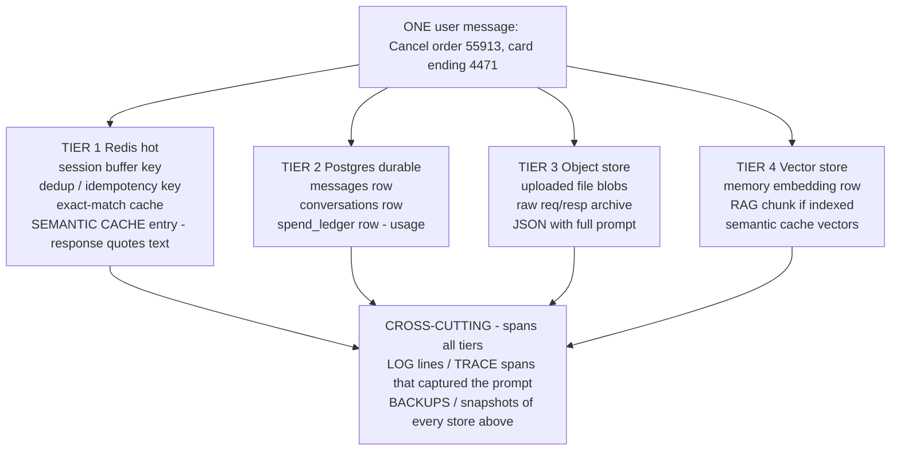

# Lecture 5: Right-to-Erasure as an Architecture Constraint — Provable Cascade Delete

> Someone emails your company: "Delete all my data." You run `DELETE FROM users WHERE id = 42`, reply "done," and move on. Six weeks later a journalist types that user's name into your product's search box and their old private messages come back — verbatim — out of the vector index nobody remembered to purge. That is not a bug you patch after launch; it is a shape your whole system either has or doesn't. This lecture treats GDPR Article 17 (the "right to be forgotten") as a **design constraint that reaches into every store you own**, the same way "must be idempotent" or "must be multi-tenant" does. After this you will be able to enumerate every derived copy a user's data leaks into, design your key namespaces and schemas up front so a delete can *find* all of it, order the deletion so nothing dangles, and — the part that separates hobbyists from engineers — write an automated test that **proves zero residue**, including a semantic search that returns none of the deleted user's vectors.

**Prerequisites:** the four-tier storage model (Lecture 3), a working RAG/vector stack (Phase 3-4), basic Redis + Postgres + object storage, "treat model output and stored text as data" · **Reading time:** ~26 min · **Part of:** Phase 09 — Architecture & System Design, Week 1

---

## The core idea (plain language)

Erasure is not "delete the row." It is **delete every copy the row spawned.**

An LLM application is a copy machine. A single user message enters your system and, before it ever leaves, it has been *forked* into half a dozen places for perfectly good engineering reasons:

- The **primary row** in Postgres (source of truth).
- A **hot copy** in Redis (the session buffer, so you don't hit Postgres every turn).
- An **embedding** in your vector store (so semantic memory / RAG can retrieve it).
- A **cached response** that may quote the user's text back (semantic cache, exact-match cache).
- **Object storage** blobs (uploaded files, raw request/response archives).
- **Log and trace archives** (that helpful line where you logged the full prompt for debugging).
- **Backups** (nightly snapshots of all of the above).

Article 17 doesn't care that these are "derived." From the user's standpoint, their text is retrievable, therefore it is retained. The legal obligation attaches to *the data*, not to your table. So the engineering reframing is blunt:

> **Every place a user's bytes can come to rest is a place your delete must reach. If your delete can't reach it, your architecture is non-compliant — and you find out when it leaks, not when you ship.**

This is why erasure is an *architecture* constraint, not a feature. You cannot bolt a correct cascade delete onto a system whose Redis keys are un-namespaced, whose vector rows carry no `user_id`, and whose object keys are a flat UUID soup. The delete's ability to *find* the data is decided months earlier, in how you chose to *store* it. Design for the delete on day one or pay for it in an incident.

The single most-missed spot, every time: **the vector index and the semantic cache.** They are the #1 real GDPR bug in LLM apps, and they deserve their own section.

---

## How it actually works (mechanism, from first principles)

### Step 1 — Map where the data leaks: the four tiers, exhaustively

Take one turn of one conversation and trace where its bytes land. Here is the leak map across the four storage tiers from Lecture 3:



Notice how a *single* message becomes 8-10 physical artifacts. The naive delete hits exactly one of them (the Postgres `messages` row) and leaves the other nine. Let's count the residue that survives a naive delete for a modestly active user — say 200 messages over three months:

| Store | Artifacts left by a naive `DELETE FROM users` | Retrievable? |
|---|---|---|
| Postgres `messages` | 0 (if you cascade FKs) — or 200 (if you didn't) | maybe |
| Redis session buffer | ~last 20 turns, until TTL expires (1h) | yes, briefly |
| Redis semantic cache | ~5-30 cached responses **quoting user text** | **yes, until evicted** |
| Vector `memories` | ~200 embeddings + original text column | **yes, forever** |
| Vector RAG chunks | however many chunks their docs produced | **yes, forever** |
| Object storage | every uploaded file + every raw archive | **yes, forever** |
| Log/trace archive | every logged prompt | yes, until retention |
| Backups | full copy of all of the above | yes, until rotation |

The two rows in bold that say "**forever**" are the vector store. That's the headline.

### Step 2 — Why the vector index + semantic cache are the #1 missed spots

Three reasons, and they compound:

**(a) The text is *inside* the vector store, not just referenced by it.** A vector row is almost never just a float array. It's `(id, embedding vector(768), text, user_id, metadata)`. You store the original `text` alongside the embedding because you need to return it on retrieval — the embedding alone is not human-readable. So the user's literal words live in your vector DB. Delete Postgres and the words are still sitting in pgvector's `memories.text`.

**(b) It's *semantically* retrievable, which is worse than exactly retrievable.** A user doesn't need to know the exact phrasing to pull the data back. After the delete "succeeded," someone searches "what did user 42 say about their refund" — a nearest-neighbor query embeds that and returns the orphaned vectors by cosine similarity. The data resurfaces without anyone typing the original text. Semantic memory is a retrieval *engine* pointed at the exact thing you were supposed to erase.

**(c) The semantic cache quietly quotes the user back.** Your two-layer cache stores responses keyed by query embedding. If the assistant's cached answer was "Sure — I've cancelled order 55913 on the card ending 4471," then the *cache value* contains the user's PII, indexed by *meaning*. A later similar question ("cancel my order") hits that cache entry and replays the deleted user's data to someone else. This is both a GDPR residue *and* a cross-tenant leak in one artifact.

Engineers miss these because the vector store and cache feel like "just an index / just a performance layer" — derived, disposable, not the real data. That intuition is exactly backwards for erasure: derived copies are *first-class copies of PII*.

### Step 3 — The three design decisions that make erasure *findable*

A delete can only remove what it can *find*. Findability is designed in. Three decisions, one per tricky store:

**Decision A — Per-user key namespacing in Redis.** Redis is a flat keyspace with no "delete where user = X." So you encode the user into the key structure up front:

```
u:{user_id}:sess:{conversation_id}        # session buffer
u:{user_id}:dedup:{idempotency_key}       # idempotency
u:{user_id}:cache:{sha256(...)}           # per-user cache entries
```

Now "find everything for user 42" is `SCAN 0 MATCH u:42:* COUNT 500` in a loop, then `UNLINK` the batch. Note two production-critical choices: use **`SCAN`, never `KEYS`** (`KEYS u:42:*` blocks the single-threaded Redis server for the full scan — a latency spike for every other tenant), and prefer **`UNLINK` over `DEL`** for large batches (`UNLINK` reclaims memory on a background thread). If you *didn't* namespace by user — say you keyed cache entries only by `sha256(prompt)` — there is no scan pattern that finds them. The data is unfindable by design, and your only options are a full keyspace scan (unacceptable) or leaving it to TTL (non-compliant). Namespacing is the whole ballgame.

**Decision B — A `user_id` column/filter on every vector row.** Every vector you write — memory, RAG chunk, cached response — carries `user_id` (and `tenant_id`). Then deletion is a filtered delete:

```sql
-- pgvector
DELETE FROM memories WHERE user_id = 42;
```

```python
# Qdrant
client.delete(collection_name="memories",
    points_selector=Filter(must=[FieldCondition(key="user_id", match=MatchValue(value=42))]))
```

Without that column you would have to embed a probe query, do a similarity search, and delete the top-k hits — which is *unbounded and unsound*: you can never prove you got them all, because similarity search returns a ranked slice, not a complete set. The `user_id` filter turns an unprovable fuzzy operation into an exact, complete `WHERE`.

**Decision C — Per-user object-storage prefixes.** S3/MinIO has no "delete where owner = X" either; it deletes by key or key-prefix. So you shape keys as:

```
tenants/{tenant_id}/users/{user_id}/uploads/{file_id}
tenants/{tenant_id}/users/{user_id}/archives/{request_id}.json
```

Erasure becomes: list objects under prefix `tenants/{t}/users/{u}/`, page through, batch-delete (1000 keys per `DeleteObjects` call). A flat `blobs/{uuid}` layout with owner tracked only in a Postgres table means: delete the table row and you've *lost the map* to the object — it's now unfindable orphaned PII. Prefix-by-owner keeps the filesystem itself a queryable index.

### Step 4 — Deletion order: avoid dangling references

Order matters because stores reference each other. The safe rule: **delete leaves before roots — derived/dependent copies first, the source-of-truth row last.** Concretely:

```
1. Redis      (hot copies, caches, dedup)      # ephemeral, no one references it
2. Vector     (memories, RAG chunks, cache vecs)
3. Object     (uploads, archives)
4. Postgres child rows (messages, memories-meta, spend_ledger)
5. Postgres users row (the anchor) LAST
```

Why last for the `users` row? If you delete the anchor first and then crash at step 3, you've lost the `user_id` you needed to build the object prefix and the vector filter — you've orphaned everything and can't retry cleanly. Deleting the anchor last means every earlier step still has a live `user_id` to key on, and the operation is **restartable**: re-run it and the already-deleted stores return zero, the rest get cleaned, idempotently. Wrap each store's deletion so a failure is logged and retried, not swallowed — a partial delete that reports success is the dangerous outcome.

---

## Worked example — seed, delete, prove zero residue

This is the automated proof from the Week 1 lab, with numbers. We seed one user across all four tiers, delete, then assert nothing survives.

**Seed (user_id = 42, tenant_id = "acme"):**

```
Postgres:  1 conversation, 12 messages, 12 spend_ledger rows
Redis:     u:42:sess:c1  (buffer of last 8 turns, quoting "order 55913")
           u:42:cache:{h}  (cached response: "cancelled order 55913, card ...4471")
           u:42:dedup:{k1}, u:42:dedup:{k2}
Vector:    5 memory embeddings (each with text + user_id=42), 3 RAG chunks
Object:    tenants/acme/users/42/uploads/receipt.pdf
           tenants/acme/users/42/archives/req-abc.json  (full prompt logged)
```

**Delete — `DELETE /users/42` returns a receipt:**

```json
{
  "user_id": 42,
  "tenant_id": "acme",
  "deleted": {
    "redis_keys":        4,
    "vector_memories":   5,
    "vector_rag_chunks": 3,
    "vector_cache":      1,
    "object_keys":       2,
    "pg_messages":       12,
    "pg_spend_ledger":   12,
    "pg_conversations":  1,
    "pg_user":           1
  },
  "completed_at": "2026-07-09T10:14:22Z",
  "receipt_id": "del_9f2a..."
}
```

The **deletion receipt** is not decoration. It is your evidence and your regression signal. Per-store counts mean: (1) you can hand an auditor proof of what was purged and when; (2) a future run that finds residue where the receipt claimed zero is an immediate red flag; (3) `assert receipt["deleted"]["vector_memories"] == 5` is a test that catches "the vector delete silently no-op'd because the collection name changed."

**Prove — the test asserts zero across every store, including a semantic search:**

```python
async def test_gdpr_delete_leaves_zero_residue(seeded_user):
    await delete_user(user_id=42, tenant_id="acme")

    # Postgres: no rows anywhere
    assert await pg.count("messages", user_id=42) == 0
    assert await pg.count("spend_ledger", user_id=42) == 0

    # Redis: SCAN (never KEYS) finds nothing
    assert list(redis.scan_iter(match="u:42:*", count=500)) == []

    # Vector: exact filter count is zero...
    assert await vec.count(filter={"user_id": 42}) == 0

    # ...AND the killer assertion: a SEMANTIC search returns no user-42 vectors.
    # Embed a query aimed straight at the deleted content:
    q = await embed("what did the user say about cancelling order 55913")
    hits = await vec.search(q, top_k=50)          # broad net, no filter
    assert all(h.metadata["user_id"] != 42 for h in hits)

    # Object storage: no keys under the user prefix
    assert await s3.list("tenants/acme/users/42/") == []
```

That semantic-search assertion is the one people skip and the one that actually proves erasure. Counting rows can pass while the data is still retrievable if you counted the wrong collection or forgot the cache vectors. Searching for the content the way an attacker or a curious employee would — by meaning, with a wide net — is the test that mirrors the real threat.

---

## How it shows up in production

- **The "successful" delete that leaked.** The single most common incident: `DELETE` returns 200, the ticket closes, and months later the user's text surfaces via semantic search or a replayed cache answer. There is no error log — the naive delete *did* succeed at what it did. You only catch this with the semantic-search assertion in CI, running on every deploy.
- **`KEYS *` took the site down.** An engineer implements the Redis cleanup with `KEYS u:42:*` because it's one line. On a 50M-key Redis, that command blocks the event loop for hundreds of milliseconds to seconds; every other tenant's request stalls. Erasure code that isn't `SCAN`-based is a self-inflicted latency incident waiting for its first big user.
- **Unfindable orphans from flat keys.** A team stored objects as `blobs/{uuid}` with ownership only in Postgres. A cascade FK delete wiped the mapping table first; now millions of blobs have no owner record and cannot be attributed to *anyone* for deletion. The only remediation is a full-bucket scan cross-referenced against a backup of the deleted table — days of work and a compliance disclosure.
- **The delete that dangled.** Deleting the `users` row first, then crashing on the object step, leaves object PII with no `user_id` to rebuild the prefix. The retry can't find what to delete. Leaf-first ordering makes the whole thing restartable.
- **SLA pressure.** GDPR expects erasure "without undue delay" (commonly operationalized as ~30 days). If your delete is a manual, multi-team ritual, you will miss it at volume. A one-call `DELETE /users/{id}` with a receipt is what lets you meet the clock and prove you did.
- **The trace tool is a second database of PII.** Whatever you logged for debugging — full prompts into Langfuse/Phoenix/Datadog — is now a store your delete must reach or a store you must never have populated. Most teams choose the latter: redact PII *before* the span, so the log archive was never a residue problem. Cheaper than solving deletion in a third-party tool you don't fully control.

---

## Common misconceptions & failure modes

- **"The vector store is just an index, it doesn't hold real data."** It holds the `text` column and is a *retrieval engine*. It is the most retrievable copy you have. Treat it as primary PII.
- **"TTL will clean it up."** TTL is best-effort eventual expiry, not erasure. A 1-hour session TTL doesn't cover the 90-day cache entry, and "it'll expire eventually" is not a defensible answer to "delete my data now." Namespace and actively delete; let TTL be a backstop, not the plan.
- **"Similarity-search-and-delete top-k handles the vectors."** It doesn't — top-k returns a ranked slice, so you can never prove completeness. Only a `user_id` filter gives an exact, complete delete. If you find yourself deleting by similarity, your schema is missing a column.
- **"We deleted from the primary; the cache will just miss and refill."** The cache *value* may quote the user's text and be keyed by *meaning*, so it can be served to a different user before it's evicted. That's a leak *and* a correctness bug. Delete cache entries explicitly.
- **Confusing anonymization with erasure.** Nulling a name but keeping the message body ("I live at 12 Elm St, order 55913") is not erasure — free text is PII. Either delete the row or genuinely scrub the content.
- **Forgetting backups is a *policy*, not a free pass.** You generally can't (and shouldn't) surgically edit last night's snapshot. The honest engineering answer is one of two policies, below — silently ignoring backups is the failure mode.

### Backups and log archives — the honest policy (no legal depth)

You usually cannot reach into an immutable nightly snapshot and delete one user's rows without restoring, editing, and re-snapshotting the entire thing — operationally absurd at scale. Two accepted engineering patterns:

- **Tombstone + suppression-on-restore.** Record the erasure request (a "tombstone": `user_id, deleted_at, receipt_id`) in a durable list that is *itself* never rolled back by a restore. If you ever restore a backup, a restore-time step replays the tombstones and re-deletes those users before the data is served. The backup still physically contains the bytes until it rotates out, but they can never re-enter the live system. This is the common default.
- **Re-scrub on rotation / expiry-bounded.** Rely on backup retention windows (e.g., 30-90 days) so the copy ages out naturally, and document that window as the erasure horizon for backups. If you must actively purge, you restore-scrub-resnapshot on a schedule — expensive, reserved for high-sensitivity data.

Same reasoning for log/trace archives: either they have a bounded retention that ages the data out, or you tombstone/suppress, or — best — you never logged the PII in the first place (redact before the span). Pick a policy, write it down, and make sure your live-store delete is *immediate* and *complete* even while backups age out on their own clock.

---

## Rules of thumb / cheat sheet

- **Design the delete before the write.** If a store can hold user bytes, decide *now* how the delete finds them (key namespace, `user_id` column, or owner prefix).
- **Namespace Redis keys by user:** `u:{user_id}:{kind}:{...}`. Cleanup = `SCAN MATCH u:{id}:*` + `UNLINK`. **Never `KEYS`.**
- **Every vector row carries `user_id` and `tenant_id`.** Delete by filter, never by similarity.
- **Object keys are owner-prefixed:** `tenants/{t}/users/{u}/...`. Delete by prefix, batch 1000/call.
- **Deletion order: leaves first, anchor (`users` row) last.** Makes it restartable and dangle-free.
- **Return a receipt with per-store counts.** It's your audit evidence *and* your regression alarm.
- **The proof test must include a semantic search with a wide net** (top_k ~50, no filter) asserting zero deleted-user hits. Counting rows is not enough.
- **Redact PII before logs/traces** so the observability stack was never a residue problem.
- **Backups: pick tombstone-on-restore or bounded-retention, and write it down.** Never pretend they don't exist.
- **Cache values can contain PII.** Delete them explicitly; don't rely on eviction.
- Approximate SLA target to design toward: erasure completes in the live stores in **minutes**, backups age out within your documented retention (commonly ~30 days).

---

## Connect to the lab

Week 1's `gdpr.py` is exactly this lecture in code: `DELETE /users/{user_id}` deletes in the safe order (Redis `SCAN`+`UNLINK` → vector filtered delete → object prefix delete → Postgres child rows → `users` last) and returns the per-store receipt. `test_gdpr_delete.py` is the proof: seed a user with messages, a **cached response containing their text**, and **N vector memories**, delete, then assert zero residue in every store — *including the semantic search that must return no user-owned vectors.* If that one assertion isn't in your test, you haven't proven erasure; you've proven you can count rows.

## Going deeper (optional)

- **GDPR Article 17** — the primary text. Read the official consolidated regulation on `eur-lex.europa.eu`, and for plain-English engineering intuition search: `"GDPR Article 17 right to erasure summary"`. Engineering intuition only — this lecture is not legal advice.
- **Redis docs** — `SCAN`, `UNLINK`, and keyspace design on `redis.io`. Search: `"redis SCAN cursor UNLINK vs DEL"`.
- **pgvector** — the canonical repo (`github.com/pgvector/pgvector`) for schema and filtered `DELETE` patterns; **Qdrant** filtered delete in the Qdrant docs (search: `"Qdrant delete points by filter"`).
- **AWS S3** — `DeleteObjects` batch API and prefix listing in the S3 developer guide on `docs.aws.amazon.com`. Same shape for MinIO.
- **Data-deletion patterns at scale** — search: `"right to be forgotten backups tombstone pattern"` and `"crypto-shredding GDPR"` (per-user encryption keys you throw away — an advanced alternative to physical deletion worth knowing).
- **OpenTelemetry GenAI semantic conventions** — to see what people log (and therefore what becomes residue). Search: `"OpenTelemetry GenAI semantic conventions"`.

## Check yourself

1. A teammate says "we ran `DELETE FROM users WHERE id=42` and it returned success, so we're GDPR-compliant." Name three stores where the user's data is likely still retrievable, and which one is retrievable *by meaning* rather than by exact text.
2. Why does deleting vectors by "embed a probe query, similarity-search, delete top-k" fail to prove complete erasure, and what schema decision fixes it?
3. Why must the Redis cleanup use `SCAN` instead of `KEYS`, and what property of the key names makes `SCAN MATCH` able to find everything?
4. In what order do you delete across the four tiers, and specifically why is the Postgres `users` row deleted *last*?
5. Your semantic cache stored the answer "Cancelled order 55913 on card ending 4471." Explain the *two distinct* problems that single cache entry causes after user 42 is deleted.
6. You can't surgically edit last night's backup snapshot. Describe one honest engineering policy that keeps you compliant anyway, and why the live-store delete still has to be immediate and complete.

### Answer key

1. **Vector store** (the `text` column lives there — retrievable *by meaning* via semantic search, the worst case), **Redis semantic/exact cache** (values may quote the user's text), and **object storage** (uploaded files + raw request/response archives). Also log/trace archives and backups. The by-meaning one is the vector index.
2. Top-k similarity returns a *ranked slice*, not the complete set of that user's vectors — you can't bound how many you missed, so you can't prove zero remain. Adding a **`user_id` column/payload field** turns it into an exact, complete `DELETE ... WHERE user_id = 42`.
3. `KEYS` blocks single-threaded Redis for the full scan, stalling every other tenant; `SCAN` iterates in bounded chunks without blocking. It works because keys are **namespaced by user up front** (`u:{user_id}:...`), so `MATCH u:42:*` deterministically enumerates all of that user's keys.
4. Leaves before roots: **Redis → vector → object → Postgres child rows → `users` row last.** The anchor row goes last so every earlier step still has a live `user_id` to build filters/prefixes from, and so the whole operation is **restartable** after a crash (re-run cleans the rest; already-deleted stores return zero) rather than orphaning data.
5. (a) **GDPR residue** — the deleted user's PII is still stored in the cache value and retrievable. (b) **Cross-tenant leak** — the entry is keyed by query *meaning*, so a *different* user asking a similar question ("cancel my order") can be served user 42's data. One artifact, two failures; delete cache entries explicitly rather than waiting for eviction.
6. **Tombstone + suppression-on-restore**: durably record the erasure (`user_id, deleted_at`) in a list not rolled back by restores; any backup restore replays tombstones to re-delete those users before serving. (Alternatively, rely on a documented bounded retention window so the backup ages out.) The live-store delete must still be immediate and complete because that's what stops the data from being served *now* — backups only need to guarantee the data can never *re-enter* the live system.
