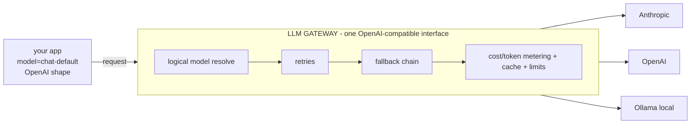

# Lecture 6: The LLM Gateway — Unified Router, Provider Abstraction, and Leaky Seams

> The moment your app calls a second model provider, you have a choice: sprinkle `if provider == "anthropic"` branches through your codebase, or build one **gateway** that every model call flows through. This lecture argues hard for the gateway — a single choke point that gives you an OpenAI-compatible interface, provider abstraction, retries, fallbacks, and cost/token tracking for free — and then spends most of its length on the part nobody tells you: **the abstraction leaks.** Providers are *not* interchangeable, and the exact seams where they differ (token counting, prompt-cache semantics, tool-call formats, streaming chunk shapes, stop/max-token quirks, error taxonomies) are where your "provider-agnostic" system quietly breaks in production. After this you'll be able to stand up a LiteLLM Router that maps a logical model name to an ordered provider list, and — more importantly — know precisely which per-provider behaviors you must *not* pretend are uniform.

**Prerequisites:** HTTP/async fundamentals, the five reference architectures (Lecture 1), "treat model output as untrusted input" (Phase 2), basic cost/token intuition · **Reading time:** ~24 min · **Part of:** Phase 09 — Architecture & System Design, Week 2

---

## The core idea (plain language)

You will call more than one model provider. Not because you love complexity — because you have no choice: your primary provider will have an outage, a price change, a rate-limit wall, a capability gap, or a compliance requirement that forces a second (or local) model. The naive way to support two providers is to let your application code know about both. That way lies ruin — provider-specific request shapes, response parsing, and error handling metastasize across every feature.

The **gateway** (also called an LLM proxy or router) is the fix. It's a thin layer that sits between your application and *N* providers and presents **one interface** — conventionally the OpenAI Chat Completions shape, because it's the de facto lingua franca. Your app speaks that one dialect; the gateway translates to whatever the chosen provider actually wants and translates the response back.



Because *every* model call funnels through this one point, the gateway is the natural home for the cross-cutting concerns that are miserable to implement per-feature:

- **Provider abstraction** — app code never imports `anthropic` or `openai`; it targets a logical name.
- **Retries** — transient 429/5xx handled once, centrally, with backoff.
- **Fallbacks** — provider A down → try B → try local, without app code knowing.
- **Cost & token tracking** — one place records input/output tokens and dollars per request, per tenant.
- **A single choke point** for rate limits, caching, and observability — you instrument *one* layer, not fifty call sites.

The single most important design move is the **logical-model indirection layer**: your app asks for `"chat-default"`, not `"claude-opus-4-8"`. The mapping from logical name to a concrete, ordered list of providers lives in gateway config. Swap providers by editing config; app code never changes. That indirection is what makes everything else in Week 2 (fallback in Lecture 7, cascade routing later) a *behavior layered on the router* rather than a rewrite.

---

## How it actually works (mechanism, from first principles)

### The logical-model indirection layer

The core data structure is a **model list**: a mapping from a logical name your app uses to an ordered list of concrete deployments. In LiteLLM this is literally the `model_list`:

```python
from litellm import Router

router = Router(
    model_list=[
        # logical name "chat-default" -> primary
        {"model_name": "chat-default",
         "litellm_params": {"model": "anthropic/claude-opus-4-8", "api_key": os.environ["ANTHROPIC_API_KEY"]}},
        # same logical name -> secondary (a *different* physical deployment)
        {"model_name": "chat-default",
         "litellm_params": {"model": "openai/gpt-4o", "api_key": os.environ["OPENAI_API_KEY"]}},
        # same logical name -> local fallback
        {"model_name": "chat-default",
         "litellm_params": {"model": "ollama/llama3.1", "api_base": "http://localhost:11434"}},
    ],
    routing_strategy="simple-shuffle",   # how to pick among deployments of one logical name
    num_retries=2,                        # transient-error retries before giving up on a deployment
    fallbacks=[{"chat-default": ["chat-default"]}],  # cross-deployment fallback (Lecture 7)
)

resp = router.completion(model="chat-default",
                         messages=[{"role": "user", "content": "hi"}])
```

Three logical `"chat-default"` entries map to three *physical* deployments. Your app calls `model="chat-default"` and never learns which one served it. To move traffic from Anthropic to OpenAI, you reorder or reweight entries — no code deploy.

**Routing strategy** decides which deployment of a logical name to try *first* when several are healthy. The ones you'll actually reason about:

- `simple-shuffle` — random pick, optionally weighted (`weight`, or `rpm`/`tpm` capacity). Good default; spreads load and dodges a single provider's rate wall.
- `least-busy` — fewest in-flight requests.
- `latency-based-routing` — pick the deployment with the lowest recent latency (great when one provider is degraded but not down).
- `usage-based-routing-v2` — route by remaining TPM/RPM headroom, so you fill provider A's quota before spilling to B.

**`num_retries`** is the *within-attempt* transient-error budget (retry the same deployment on a 429/5xx with backoff). **`fallbacks`** is the *cross-deployment* escape hatch (Lecture 7 makes this a first-class behavior with circuit breakers). Keep them mentally separate: retries fight flakiness on one provider; fallbacks fight one provider being *out*.

### The translation layer (and why it's most of the work)

When your app sends an OpenAI-shaped request for a logical name that resolves to Anthropic, the gateway must rewrite it: `messages` → Anthropic's `messages` + hoist any `system` message to the top-level `system` field; map `max_tokens`; convert OpenAI `tools`/`tool_calls` into Anthropic `tools` + `tool_use`/`tool_result` content blocks; and on the way back, convert Anthropic's `stop_reason`/content-block response into OpenAI's `choices[].finish_reason`/`message` shape. LiteLLM (and the buy-side products) ship this translation for dozens of providers. **That translation is exactly where the abstraction leaks** — it can normalize the *shape* but not the *semantics*. Which brings us to the heart of the lecture.

### Build vs buy — a 30-second survey

You don't have to build the gateway. The buy-side is real and worth knowing so you can defend your choice:

- **LiteLLM** (open-source; SDK `Router` + a self-hostable proxy server) — the default "thin self-hosted gateway." You own it, it's in your VPC, and it's what this week's lab uses. Cost is your ops time.
- **Portkey** — a managed (or self-hostable) AI gateway with routing, retries, semantic caching, budgets, and an observability dashboard baked in. Buy this when you want the dashboard and guardrails without building them.
- **Cloudflare AI Gateway** — sits at the edge, adds caching, rate limiting, retries, and analytics with near-zero infra on your side; you point your provider calls at their endpoint.

The pragmatic default (from the spine's build-vs-buy rubric): **thin self-hosted LiteLLM gateway + buy observability**, chosen for control, data residency, and *ejectability* — but write the tradeoff down. The gateway is load-bearing; you want to be able to leave any vendor.

---

## Where the abstraction leaks (the part that bites you)

The gateway sells you "providers are interchangeable." They are not. Here are the seams, each with the production symptom.

**1. Token counting differs per provider.** Every provider has its own tokenizer. The *same string* tokenizes to different counts on Anthropic vs OpenAI vs a Llama model — commonly a 10–30% spread (approximate; measure your own corpus), and much larger on code or non-English text. Consequences: (a) you cannot reuse one provider's token count to budget another's request or context window; (b) `tiktoken` is OpenAI's tokenizer and **undercounts Claude** — using it for Anthropic budgeting is a bug; (c) your cost math and your rate-limit accounting must be *per provider*. The right move is to count with the provider you'll actually call (Anthropic exposes a `count_tokens` endpoint; the gateway should surface per-provider `usage`). A gateway that reports one unified "token count" is lying to you about at least one provider.

**2. Prompt-cache semantics are fundamentally different — this is the biggest leak.** Two providers, two incompatible mental models:

- **Anthropic — explicit `cache_control`.** *You* mark cache breakpoints (`"cache_control": {"type": "ephemeral"}`) on up to 4 content blocks. Caching is a **prefix match**: any byte change before a breakpoint invalidates everything after it. Cache **writes cost more** (~1.25× for 5-min TTL, ~2× for 1-hour), reads cost ~0.1×, and the prefix must clear a minimum size (roughly 1024–4096 tokens depending on model) or it silently won't cache. You control placement, so you can (and must) architect the prompt: frozen system prompt first, volatile content last.
- **OpenAI — automatic prefix cache.** No knobs. The platform automatically caches long prompt prefixes and discounts the cached portion; you neither request it nor place breakpoints. You just structure your prompt with the stable part first and hope the prefix matches.

A "provider-agnostic" gateway **cannot** unify these. If your app blindly emits Anthropic `cache_control` blocks and the request falls back to OpenAI, those fields are meaningless (or rejected). If you rely on OpenAI's automatic caching and fall back to Anthropic, you get *zero* caching because you never placed a breakpoint. Cache strategy is provider-specific and must live in the provider-specific translation layer — not in your app, and not assumed uniform.

**3. Tool-call / function-calling formats differ.** OpenAI returns tool calls as a `tool_calls` array where `function.arguments` is a **JSON string you must parse**. Anthropic returns `tool_use` **content blocks** where `input` is **already a parsed object**, and you reply with `tool_result` content blocks (matched by `tool_use_id`) — not OpenAI's `role: "tool"` messages. The gateway normalizes the wire shape, but escaping and structure differ enough that raw-string-matching a serialized tool input breaks across providers. Always parse tool inputs as JSON; never pattern-match the serialized form.

**4. Streaming chunk shapes differ.** Anthropic streams typed SSE events: `message_start`, `content_block_start`, `content_block_delta` (with `text_delta` / `thinking_delta` / `input_json_delta`), `content_block_stop`, `message_delta` (carries `stop_reason` + usage), `message_stop`. OpenAI streams `choices[].delta.content` fragments with `finish_reason` on the last chunk. If your app parses one shape directly, a provider swap breaks your stream handler. The gateway's OpenAI-compatible streaming smooths this, but token-usage-in-stream, thinking blocks, and tool-call deltas are where the smoothing gets lossy — verify per provider.

**5. Stop-sequence and max-token quirks.** The stop-reason vocabularies don't line up. Anthropic: `end_turn`, `max_tokens`, `stop_sequence`, `tool_use`, `pause_turn`, `refusal`. OpenAI: `stop`, `length`, `tool_calls`, `content_filter`. A gateway maps these, but the mapping is lossy — Anthropic's `refusal` and `pause_turn` have no clean OpenAI equivalent, so code that only handles `stop`/`length` silently mishandles them. `max_tokens` counts *output* tokens on both, but the interaction with reasoning/thinking tokens and the exact truncation behavior differ; hitting the cap truncates mid-thought and you must detect the stop reason to retry. Stop-sequence handling (inclusive vs exclusive of the matched string, max count) also varies.

**6. Error-code taxonomies differ.** HTTP status overlaps (401/429/500/529) but the JSON error bodies, the `type` strings, and the retry signals do not. Anthropic uses `529 overloaded_error` and a `retry-after` header; OpenAI has its own overload/quota distinctions. A gateway that collapses everything to "an error occurred" destroys your ability to decide *retry vs fall back vs fail fast*. You want the gateway to preserve enough of the original taxonomy that your retry policy can tell a retryable 429/5xx from a non-retryable 400/404.

The through-line: **the gateway normalizes shape, not semantics.** Treat every item above as provider-specific behavior that must live behind the gateway's per-provider adapter — never as something your app may assume is uniform.

---

## Worked example — one logical name, real numbers

Your app calls `model="chat-default"` for a support summarizer. Config maps it to `anthropic/claude-opus-4-8` (primary) → `openai/gpt-4o` (secondary) → `ollama/llama3.1` (local fallback), `routing_strategy="usage-based-routing-v2"`, `num_retries=2`.

A request comes in: ~3,000 input tokens (system prompt + ticket), ~300 output tokens.

- **Token counting leak:** you *estimated* 3,000 tokens with `tiktoken`. The request routes to Anthropic, whose tokenizer counts ~3,300 for the same text (approximate). Your rate-limit accounting keyed on the tiktoken number under-counts by ~10%, and near a TPM ceiling that's the difference between a clean request and a surprise 429. Lesson: count per provider.
- **Cache leak:** your 2,600-token system prompt is stable. On Anthropic you placed a `cache_control` breakpoint after it — the first call writes the cache (~1.25× on those 2,600 tokens), and the next hundred calls read it at ~0.1×, so a repeated system prefix drops from full price to roughly a tenth on the cached span. Then Anthropic 529s, the gateway falls back to OpenAI — where your `cache_control` field does nothing and you rely on OpenAI's automatic prefix cache instead. **Same logical call, two entirely different caching mechanisms.** If you'd hard-coded Anthropic cache assumptions into app code, the fallback path would silently pay full price and you'd never know without per-provider cost tracking.
- **Cost tracking payoff:** because every call funnels through the gateway, one metering hook records `{tenant, logical_model, physical_model, input_tokens, output_tokens, cache_read_tokens, usd}` per request. When finance asks "why did cost spike Tuesday," you can answer "Anthropic was 529-ing, we fell back to OpenAI, cache hit rate went to zero on the fallback path" — a sentence you can only say because the choke point recorded it.

The discipline this illustrates: the *only* thing your app committed to was the string `"chat-default"`. Everything else — which provider, how it caches, how it's billed — is config and per-provider adapter behavior the gateway owns.

---

## How it shows up in production

**A missing gateway shows up as sprawl.** Without one, provider SDK imports, response parsing, and error handling appear in dozens of files. The first outage forces an emergency "add fallback" PR that touches all of them. With a gateway, that same outage is a config change (or already handled by the fallback chain).

**Cost tracking is only as good as your choke point.** If some calls bypass the gateway (a "quick" direct SDK call in one service), your cost dashboard is wrong and your spend kill-switch (later this week) has a hole. Enforce that *all* model traffic goes through the gateway — it's the same discipline as "know where your state lives" from Week 1.

**Fallback that masks outages is its own failure.** If the gateway silently falls back on every Anthropic blip, you never notice Anthropic is degraded — and you're quietly paying OpenAI prices with no caching. Alert on *breaker-open / fallback-fired*, not just on total failure. (Lecture 7 builds the circuit breaker that makes this observable.)

**The leaks surface as "it worked in dev, broke on fallback."** The classic incident: everything's fine on the primary; the primary has a bad hour; traffic spills to the secondary; and now tool calls parse differently, caching evaporates, and a `refusal`/`content_filter` stop reason your code never handled slips through. You find the leaks *on the fallback path, under load* — which is the worst time. Test the fallback path explicitly (point the primary at a bad key and run your suite against the secondary).

---

## Common misconceptions & failure modes

- **"The gateway makes providers interchangeable."** It makes the *interface* uniform. Semantics (tokens, cache, tools, streaming, stop reasons, errors) still leak. Design for the leaks.
- **"One token count works everywhere."** No. Tokenizers differ per provider; `tiktoken` undercounts Claude. Count with the provider you'll call.
- **"Prompt caching is a gateway feature."** It's a *provider* feature with two incompatible models (Anthropic explicit `cache_control` vs OpenAI automatic prefix cache). The gateway can't unify them; cache strategy belongs in the per-provider adapter.
- **"Just parse `finish_reason == 'stop'`."** That silently mishandles Anthropic's `refusal`, `pause_turn`, and `tool_use`. Handle the full stop-reason set of every provider you route to.
- **"Retries and fallbacks are the same thing."** Retries fight transient flakiness on one deployment (`num_retries`); fallbacks move to a different deployment when one is out. Different budgets, different triggers.
- **"Silent fallback is a feature."** Silent fallback hides outages and blows up cost/caching invisibly. Fall back *and* alert.
- **"We'll route in application code."** That's the anti-pattern the gateway exists to kill. App code targets a *logical* name; routing lives in config behind the choke point.
- **Bypassing the gateway "just this once."** Every bypass is a hole in your cost tracking, rate limiting, and kill-switch. All model traffic, one door.

---

## Rules of thumb / cheat sheet

- **App code targets a *logical* model name (`chat-default`), never a physical provider.** Routing lives in gateway config.
- Centralize at the gateway: OpenAI-compatible interface, provider abstraction, retries, fallbacks, cost/token metering, caching, rate limits, observability. One choke point, one place to instrument.
- **`num_retries`** = transient errors on one deployment (backoff). **`fallbacks`** = move to another deployment when one is out. Keep them distinct.
- Routing strategy defaults: `simple-shuffle` (spread load) or `usage-based-routing-v2` (fill quota before spilling). Reach for `latency-based-routing` when a provider is degraded-but-up.
- **Count tokens per provider.** Never reuse one provider's count for another; never use `tiktoken` for Anthropic.
- **Prompt caching is provider-specific:** Anthropic = explicit `cache_control` prefix breakpoints (writes cost ~1.25–2×, reads ~0.1×, min prefix ~1–4K tokens); OpenAI = automatic prefix cache (no knobs). Put stable content first either way.
- Parse tool inputs as JSON; never string-match the serialized form. Anthropic gives parsed `input`; OpenAI gives a JSON *string* in `function.arguments`.
- Handle the *full* stop-reason vocabulary of every provider you route to — including Anthropic `refusal`/`pause_turn`, which have no OpenAI twin.
- Preserve enough of each provider's error taxonomy that your retry policy can tell retryable (429/5xx) from non-retryable (400/404).
- **Alert on breaker-open / fallback-fired**, not just on total failure.
- Build-vs-buy default: thin self-hosted LiteLLM + buy observability; optimize for control, data residency, and *ejectability* — and write the tradeoff down.

---

## Connect to the lab

This week's lab (`gateway.py`) builds exactly this: a `litellm.Router` whose `model_list` maps `chat-default` to an ordered list — primary provider → secondary provider → local Ollama — with `fallbacks` and `num_retries` configured. You'll then layer Lecture 7's circuit breaker on top (track per-provider failures in Redis, open the breaker after N failures, expose state at `GET /gateway/health`). The leaks in this lecture are why the lab's fallback test matters: kill the primary (bad key), route to the secondary, and confirm your code still parses tool calls and handles the stop reasons correctly on the *other* provider — the failure you'd otherwise only find in a real outage.

## Going deeper (optional)

- **LiteLLM docs** — Router, `model_list`, routing strategies, `num_retries`, `fallbacks`, budgets, and the proxy server. Root: `docs.litellm.ai`. Search: "LiteLLM Router fallbacks".
- **Portkey docs** — managed AI gateway: routing, retries, semantic caching, budgets, observability. Root: `portkey.ai`. Search: "Portkey AI gateway".
- **Cloudflare AI Gateway docs** — edge gateway: caching, rate limiting, retries, analytics. Root: `developers.cloudflare.com`. Search: "Cloudflare AI Gateway".
- **Anthropic docs — prompt caching** (`cache_control`, prefix match, TTL, minimums) and **token counting** (`count_tokens`). Root: `docs.anthropic.com`. Search: "Anthropic prompt caching cache_control", "Anthropic token counting".
- **OpenAI docs — prompt caching** (automatic prefix cache) and the Chat Completions tool-call / streaming shapes. Root: `platform.openai.com`. Search: "OpenAI prompt caching automatic".
- **Martin Fowler — "CircuitBreaker"** (sets up Lecture 7). Search: "Martin Fowler CircuitBreaker".
- Search queries: "LiteLLM routing strategy usage-based", "Anthropic vs OpenAI tool calling format differences", "OpenAI finish_reason vs Anthropic stop_reason".

## Check yourself

1. Your app calls `model="chat-default"`. Explain the logical-model indirection layer and why it lets you swap providers without touching application code.
2. Name three things the gateway centralizes that would otherwise be duplicated across every feature, and say why centralizing each is a win.
3. Distinguish `num_retries` from `fallbacks`. Which fights transient flakiness and which fights a provider being out?
4. Anthropic and OpenAI prompt caching are "the same feature," right? Explain how they differ and why a provider-agnostic gateway can't unify them.
5. Give two concrete ways the "providers are interchangeable" abstraction leaks, and the production symptom of each.
6. Why must you count tokens with the specific provider you're about to call, rather than once at the gateway?

### Answer key

1. The gateway holds a mapping from the logical name (`chat-default`) to an *ordered list of concrete deployments* (Anthropic → OpenAI → local). The app commits only to the string; which physical provider serves it, and in what order they're tried, is gateway config. Changing providers is a config edit, so no application code changes — the app never imports a provider SDK or knows which one answered.
2. Any three of: **retries** (transient 429/5xx handled once with backoff, not re-implemented per call site), **fallbacks** (provider-out handling in one place), **cost/token metering** (one hook records tokens+dollars per tenant, so the cost dashboard and spend kill-switch are complete), **caching / rate limits / observability** (one layer to instrument). Centralizing wins because these are cross-cutting concerns; duplicated across features they drift, leave gaps, and turn every outage into a multi-file emergency PR.
3. `num_retries` retries the *same* deployment on transient errors (429/5xx) with backoff — it fights flakiness on one provider. `fallbacks` moves to a *different* deployment when one is out — it fights a provider being down. Retries = flakiness; fallbacks = outage.
4. No. Anthropic caching is **explicit**: you place up to 4 `cache_control` breakpoints, it's a prefix match, writes cost ~1.25–2× and reads ~0.1×, and the prefix must clear a size minimum. OpenAI caching is **automatic**: no knobs, the platform caches long prefixes and discounts them. A gateway can normalize request *shape* but not these *mechanisms* — `cache_control` fields are meaningless on OpenAI, and OpenAI-style reliance on automatic caching yields zero caching on Anthropic (no breakpoint placed). So cache strategy must live in the per-provider adapter, not be assumed uniform.
5. Any two: **token counting** (same text tokenizes differently per provider; `tiktoken` undercounts Claude → wrong rate-limit accounting and surprise 429s near a TPM ceiling); **tool-call format** (OpenAI `function.arguments` is a JSON string, Anthropic `input` is a parsed object → string-matching serialized inputs breaks on swap); **streaming chunk shape** (typed Anthropic SSE events vs OpenAI `delta.content` → a stream parser tied to one shape breaks on the other); **stop reasons** (Anthropic `refusal`/`pause_turn` have no OpenAI equivalent → code handling only `stop`/`length` mishandles them); **error taxonomies** (collapsing them destroys retry-vs-fallback decisions). Symptom in every case: it works on the primary and breaks on the fallback path under load.
6. Because each provider has its own tokenizer, so the token count for the same string differs by provider (commonly 10–30%, larger on code/non-English). A single gateway-level count is correct for at most one provider; using it to budget context windows, rate limits, or cost for a *different* provider under-/over-counts and can trip quotas or misprice requests. Count with the provider that will actually serve the request.
