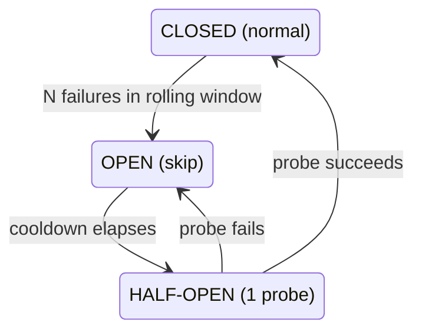

# Lecture 7: Resilience — Fallback Chains and Circuit Breakers

> Providers fail. Not "might fail" — *will* fail, on a Tuesday, in the middle of your launch, for twenty minutes, with 503s and 45-second timeouts, and there is nothing you can do to prevent it because the failing machine is in someone else's data center. Your job is not to prevent provider failure; it is to make your gateway *degrade gracefully* when it happens. Two mechanisms do the heavy lifting, and engineers constantly conflate them: a **fallback chain** reroutes a single failed request to the next provider, and a **circuit breaker** stops sending requests to a provider that is *persistently* failing so you fail fast instead of piling up latency and cost. This lecture teaches both precisely — the breaker state machine to the transition, a Redis rolling-counter implementation, exactly what counts as a "failure," and the operational trap that turns resilience into a silent outage. After this you will be able to build a gateway that survives a provider outage *and still tells you it happened.*

**Prerequisites:** Lecture 6 (gateway/router pattern), async/await + timeouts, Redis basics (`INCR`, `EXPIRE`, sorted sets), HTTP status codes · **Reading time:** ~26 min · **Part of:** Phase 09 — Architecture & System Design, Week 2

---

## The core idea (plain language)

Imagine you dial a friend and it rings out. You hang up and dial their *other* number — that's a **fallback**. Now imagine that number has rung out ten times in the last minute. Only a fool keeps dialing it and waiting 30 seconds each time; you *stop calling it* for a while and go straight to the backup. That "stop calling the dead number" reflex is a **circuit breaker**. They solve different problems and you need both.

- **Fallback chain** = *per-request* rerouting. One request errors or times out on the primary provider, so you retry the *same request* on the next provider in an ordered list: `primary → secondary → local Ollama`. It handles **transient** and **provider-specific** failures (a single 503, a one-off timeout, a content-filter quirk on one vendor). It is reactive and request-scoped.

- **Circuit breaker** = *cross-request* protection. It watches the *aggregate* health of a provider over a rolling window, and when that provider is *persistently* failing it **stops sending requests to it entirely** for a cooldown period — skipping straight to the fallback without wasting a timeout on the known-dead path. It handles **sustained** outages. It is stateful and provider-scoped.

The relationship is a subset one: **the breaker decides whether a provider is even eligible; the fallback chain decides where a request goes among eligible providers.** A fallback chain *without* a breaker still "works" — every request tries the dead primary first, eats a 30-second timeout, then falls back. It's correct but catastrophically slow and expensive. The breaker is what makes the fallback *fast*.

And the sting in the tail, which the rest of the lecture builds toward: a fallback that works *too* smoothly hides the fact that your primary is down. If you only alert on total failure, you will run for weeks on your expensive backup provider, paying double, and never know. **You must alert on breaker-open, not on total failure.**

---

## How it actually works (mechanism, from first principles)

### Part 1 — The fallback chain

A fallback chain is an ordered list of *deployments* for one logical model name, plus a rule for when to advance to the next one.

```
logical model: "chat-default"
  1. openai/gpt-4o           (primary)
  2. anthropic/claude-3-5-sonnet   (secondary)
  3. ollama/llama3.1         (local, always-up, lower quality)
```

The control loop, in deterministic code (the model never decides this — Lecture 2's boundary):

```
for provider in chain:
    if breaker_is_open(provider):        # circuit breaker gate
        continue                          # skip known-dead provider
    try:
        return call(provider, request, timeout=T)
    except RetryableError:                # 5xx, timeout, 429-with-backoff
        record_failure(provider)          # feeds the breaker
        continue                          # advance to next provider
    except NonRetryableError:             # 400, 401, content policy
        record_success(provider)          # provider is HEALTHY; YOUR request is bad
        raise                             # do NOT fall back — same error everywhere
raise AllProvidersFailed
```

Three things in that loop are load-bearing and routinely gotten wrong:

1. **A timeout is a failure.** If you don't set an explicit per-attempt timeout, a hung primary makes the whole request hang — the fallback never fires because you never *give up* on the primary. Set `T` (e.g. 20–30s for a full completion, or a TTFT deadline for streaming) and treat exceeding it as a retryable failure.

2. **Not every error should fall back.** A `400 Bad Request` (malformed prompt) or `401 Unauthorized` (bad key) will fail *identically* on every provider — falling back just burns three providers' worth of latency to return the same error. Worse, a `400` from a *bad request of yours* is not the provider's fault, so it must **not** count against the provider's health (see Part 3). Distinguish *provider-fault* errors (retry elsewhere) from *client-fault* errors (fail immediately, don't blame the provider).

3. **Quality degrades down the chain.** Your fallback to local Ollama keeps you *up*, but the answer is worse. This is a deliberate trade: availability over quality. Which means you also need to *know* when you're serving degraded answers — again, the alerting point.

### Part 2 — Why you need the breaker: the "timeout tax"

Suppose your primary provider is hard-down (every request times out at 30s) and your fallback (secondary) is healthy at 2s. **Without** a breaker, every single request pays:

```
30s (primary timeout) + 2s (secondary success) = 32s  per request
```

At 50 requests/second in flight, you now have thousands of requests each holding a connection open for 30 seconds waiting on a corpse. Your own server runs out of worker threads / connection-pool slots / event-loop capacity long before the provider recovers. **The dead provider takes *you* down** — this is the classic cascading failure the Circuit Breaker pattern was invented to stop.

**With** a breaker, after the first N failures the breaker *opens*, and every subsequent request sees `breaker_is_open(primary) == True`, skips it in microseconds, and goes straight to the 2s secondary:

```
~0ms (skip open breaker) + 2s (secondary) = 2s  per request
```

You've turned a 32s self-inflicted outage into a 2s degraded-but-healthy mode. That is the entire point of the breaker: **fail fast on the known-bad path.**

### Part 3 — The breaker state machine (precisely)

A circuit breaker is a three-state machine, one instance **per provider** (never one global breaker — a dead OpenAI must not lock you out of a healthy Anthropic).



- **CLOSED (normal).** Requests flow to the provider. You *count failures in a rolling window*. If failures cross a threshold — e.g. **≥ 5 failures in the last 60 seconds**, or **≥ 50% of the last 20 requests** — you **trip** to OPEN. (Count-in-window is the simplest correct policy; a rate-based policy needs a minimum-volume floor so that 1-out-of-1 doesn't trip a low-traffic provider.)

- **OPEN (skip entirely).** For the cooldown duration (e.g. **30 seconds**), the breaker short-circuits: `breaker_is_open()` returns `True`, the fallback loop skips this provider without making a call. No latency, no cost, no load on the dying provider (giving it room to recover). **This is the state you alert on.**

- **HALF-OPEN (one probe).** When the cooldown elapses, the breaker allows **exactly one** trial request through (or a small number, e.g. 1–3). This is the "is it back yet?" probe. If the probe **succeeds**, close the breaker (back to normal). If it **fails**, re-open and restart the cooldown. The half-open state is what prevents you from *slamming* a just-recovering provider with the full backlog the instant the cooldown ends — you test the water with one toe before jumping back in.

The transition table, memorize it:

| From | Event | To |
|---|---|---|
| CLOSED | failure count crosses threshold in window | OPEN |
| CLOSED | success / sub-threshold failures | CLOSED |
| OPEN | cooldown timer elapses | HALF-OPEN |
| HALF-OPEN | probe request succeeds | CLOSED |
| HALF-OPEN | probe request fails | OPEN (reset cooldown) |

### Part 4 — Implementing the breaker with Redis

Your gateway runs as *multiple* stateless workers (uvicorn processes, pods). If each worker keeps the failure count in local memory, worker A can trip its breaker while worker B keeps hammering the dead provider — you get an inconsistent, partially-open breaker. **Shared state must live in Redis** so all workers agree on provider health.

The cleanest rolling-window counter uses a Redis **sorted set** per provider, scored by timestamp, so you can count only failures inside the window and let old ones age out:

```python
import time, redis.asyncio as redis

WINDOW_S   = 60        # rolling window
THRESHOLD  = 5         # failures in window to trip
COOLDOWN_S = 30        # open duration before half-open probe

async def record_failure(r: redis.Redis, provider: str):
    now = time.time()
    key = f"cb:fails:{provider}"
    pipe = r.pipeline()
    pipe.zadd(key, {f"{now}:{id(now)}": now})   # add this failure
    pipe.zremrangebyscore(key, 0, now - WINDOW_S)  # evict outside window
    pipe.zcard(key)                                # count in-window
    pipe.expire(key, WINDOW_S * 2)                 # self-cleaning key
    _, _, count, _ = await pipe.execute()
    if count >= THRESHOLD:
        # trip: set OPEN with a TTL == cooldown; expiry == move to half-open
        await r.set(f"cb:open:{provider}", "1", ex=COOLDOWN_S)

async def breaker_is_open(r: redis.Redis, provider: str) -> bool:
    return await r.exists(f"cb:open:{provider}") == 1
```

Half-open falls out of this design almost for free: when `cb:open:{provider}` **expires**, the breaker is no longer "open," so the next request goes through — that request *is* the probe. To make it a *single* probe (not a thundering herd of all queued requests at once), gate it with a short-lived lock:

```python
async def try_acquire_probe(r: redis.Redis, provider: str) -> bool:
    # only one worker wins the probe slot; others keep skipping
    return await r.set(f"cb:probe:{provider}", "1", nx=True, ex=COOLDOWN_S)
```

On probe success, delete `cb:probe:{provider}` and clear the failure set (`zremrangebyscore` all) so you start CLOSED with a clean slate. On probe failure, re-`set` `cb:open` with the cooldown TTL again. **Note:** LiteLLM's `Router` ships a cooldown mechanism that implements essentially this (it "cools down" a deployment after N failures); you'll often configure that rather than hand-roll — but you must understand the machine underneath to tune `allowed_fails` / `cooldown_time` sensibly and to expose state.

### Part 5 — Exposing breaker state at a health endpoint

The breaker's state is *the* operational signal for provider health. Surface it:

```python
@app.get("/gateway/health")
async def gateway_health(r = Depends(get_redis)):
    providers = ["openai/gpt-4o", "anthropic/claude-3-5-sonnet", "ollama/llama3.1"]
    out = {}
    for p in providers:
        is_open = await r.exists(f"cb:open:{p}") == 1
        fails   = await r.zcard(f"cb:fails:{p}")
        out[p] = {
            "state": "open" if is_open else "closed",
            "failures_in_window": fails,
        }
    any_open = any(v["state"] == "open" for v in out.values())
    return {"providers": out, "degraded": any_open}
```

This endpoint feeds three consumers: your **dashboard** (a red tile when a breaker is open), your **load balancer / k8s readiness probe** (careful — a degraded-but-serving gateway should stay `ready`; only report `not ready` if *all* providers are open and you can't serve at all), and — most importantly — your **alerting**.

---

## Worked example

Let's put numbers on a realistic 20-minute OpenAI incident. Gateway config: chain `openai/gpt-4o → anthropic/claude-3-5-sonnet → ollama/llama3.1`; per-attempt timeout 30s; breaker threshold 5 failures / 60s window; cooldown 30s. Steady traffic: **10 requests/second**. OpenAI is hard-down for 20 minutes (every call times out at 30s), then recovers instantly.

**Without a breaker (fallback chain only):**

- Every request tries OpenAI first, waits the full 30s timeout, then succeeds on Anthropic in ~2s → **32s per request**.
- At 10 req/s, requests arrive faster than they drain; with 32s latency you accumulate ~320 concurrent in-flight requests *just waiting on the dead primary*. Your worker pool (say 200 workers) saturates in ~20 seconds. New requests queue or get rejected. **You have a full outage — caused by the fallback, not the provider.**
- Cost angle: you don't pay OpenAI for timeouts, but you pay Anthropic for everything, at ~32s latency the users mostly abandon.

**With a breaker:**

- First 5 requests hit OpenAI, each times out at 30s, each calls `record_failure`. By ~request 5 (within the first ~1s of arrival, since they're concurrent) the count hits 5 → breaker **trips to OPEN**.
- Requests 6 onward see the open breaker, **skip OpenAI in microseconds**, land on Anthropic → **~2s per request**. Concurrency stays at a healthy ~20 in-flight. No self-inflicted outage.
- Every 30s, one probe request tries OpenAI (half-open). For 20 minutes those probes fail and re-open the breaker. Cost of probing: 1 request / 30s × 40 windows = **~40 wasted timeouts total**, versus 12,000 timeouts (10/s × 1200s) without the breaker.
- At minute 20, a probe **succeeds** → breaker closes → traffic flows back to the cheaper/preferred primary automatically.

**The tax, quantified:** the breaker converted `12,000 × 30s = 100 hours` of wasted, load-generating timeout-time into `40 × 30s = 20 minutes`. And it kept your gateway *up* the entire time.

**The trap, quantified:** during those 20 minutes, *every request succeeded* (via Anthropic). Total error rate to the user: **~0%**. If your only alert is "error rate > 1%," **it never fired.** You served 20 minutes on the wrong provider — say Anthropic is 1.5× the price — and the only record that anything was wrong is the breaker-open state you (hopefully) alerted on. This is why the next-to-last section exists.

---

## How it shows up in production

- **The "why is our bill double this month" investigation.** Silent fallback ran for days. The primary had a partial outage (elevated 5xx) that tripped the breaker intermittently, traffic drifted to the pricier secondary, and nobody noticed because *nothing errored*. The fix is not a code fix — it's an **alert on breaker-open** and a dashboard tile. Resilience without observability is just a slower way to be blind.

- **The retry storm that made the outage worse.** Provider gets slow (not down — *slow*). Every request times out and retries. Each retry adds load to the already-struggling provider, making it slower, causing more timeouts, causing more retries. This positive-feedback loop is a **retry storm** (a.k.a. retry amplification). If each request retries 3×, a provider hiccup instantly triples the load hitting it at its weakest moment. You prevent this with (a) the circuit breaker (stop retrying a dying provider at all), (b) a **retry budget** (cap retries as a *fraction* of total traffic — e.g. "retries may not exceed 10% of requests"; when the budget is exhausted, fail fast instead of retrying), and (c) **exponential backoff with jitter** so retries don't synchronize into thundering waves.

- **The synchronized-recovery stampede.** Breaker opens for all workers at once; cooldown is a fixed 30s; at exactly T+30s *every* worker's breaker closes simultaneously and the entire backlog slams the just-recovering provider, knocking it back down. Half-open (one probe) and **jittered cooldowns** prevent this. If you hand-roll, add ±20% jitter to the cooldown.

- **The 429 you treated wrong.** A `429 Too Many Requests` means "slow down," not "I'm broken." If you fall back to another provider on 429, you might just move your overload to the secondary and trip *its* limit too. If you count 429 as a breaker failure, you can trip the breaker on a provider that's perfectly healthy — it just wants you to back off. Handle 429 with **backoff + `Retry-After`** first; only escalate to fallback/breaker if backoff doesn't clear it. (More below.)

- **The breaker that never resets because your window is wrong.** Set the rolling window too long (e.g. 10 minutes) and a burst of failures early keeps the count above threshold long after the provider recovered, so the breaker stays flapping open. Set it too short and one bad second trips it needlessly. Windows of 30–120s with thresholds of 5–20 failures are the usual sane range — but *measure your own traffic*.

- **In-memory breaker in a multi-pod deployment.** Each of your 10 pods learns independently that the provider is dead, so you eat ~10× the trip-threshold in timeouts before all pods converge, and a pod that just started has a fresh CLOSED breaker and cheerfully hammers the corpse. Shared Redis state fixes it. This is the single most common breaker bug in horizontally-scaled gateways.

---

## Common misconceptions & failure modes

- **"Fallback and circuit breaker are the same thing."** No. Fallback is *per-request routing* to the next provider; the breaker is *cross-request state* that decides whether a provider is eligible at all. You can have a fallback chain with no breaker (correct but slow under sustained failure) or a breaker with no chain (fail-fast with no alternative — you just 503 faster). Production needs both: the breaker makes the fallback *fast*.

- **"More retries = more reliable."** Only for *transient* failures, and only up to a point. Against a *sustained* outage, retries do nothing but multiply load and latency — that's what the breaker is for. Uncapped retries cause retry storms. Reliability comes from *fast, bounded* retries + a breaker + a *different* provider to fall back to, not from retrying the same dead endpoint harder.

- **"429 is a failure, count it against the provider."** Usually wrong. A 429 means *you* exceeded a quota; the provider is healthy. Tripping the breaker on 429 penalizes a working provider and can cascade your overload to the fallback. Treat 429 as a backpressure signal: honor `Retry-After`, back off, and only after sustained 429s consider it a capacity problem (which is a *rate-limit* concern — Lecture 8 — not a breaker one). The nuance: a 429 that *never clears* despite backoff is effectively "this provider has no capacity for you right now," and *then* falling back is reasonable — but that's a deliberate policy, not the default.

- **"A 400/401 should fall back to the next provider."** No — a `400` (bad request) or `401` (bad key) is a **client-fault** error that will reproduce identically everywhere. Falling back wastes latency and returns the same error; worse, counting it against provider health trips breakers on healthy providers because *your* code is broken. Client-fault errors fail fast and do **not** touch the breaker.

- **"If everything succeeds, we're healthy."** The trap. Success *via fallback* is not the same as health. Your primary can be 100% down while your user-facing error rate is 0%. Health = "requests succeed on the *intended* provider." Alert on breaker-open and on fallback-rate, not just on end-user errors.

- **"One global breaker is simpler."** A single breaker across all providers means a dead OpenAI opens the breaker and locks you out of a *healthy* Anthropic — the exact opposite of resilience. One breaker instance **per provider** (per deployment), always.

- **"The breaker should also open on the fallback failing."** Careful — each provider gets its *own* breaker. If OpenAI is open and Anthropic starts failing too, Anthropic's *own* breaker trips independently. When *all* breakers are open, that's your cue for **degradation mode** (serve cache / local model / queued response — Week 3), not for a 500.

- **"Timeouts don't need to be explicit; the client will give up."** If you don't set a server-side per-attempt timeout, a hung provider connection can hang *forever* (or until an OS-level socket timeout minutes later), your fallback never fires, and one dead provider exhausts your connection pool. Explicit, aggressive per-attempt timeouts are what *make* fallback and the breaker work at all.

---

## Rules of thumb / cheat sheet

- **Fallback = per request; breaker = per provider over time.** Chain reroutes one request; breaker gates whether a provider is even tried. Use both.
- **Counts as a failure (trip the breaker, retry elsewhere):** 5xx (500/502/503/504), connection errors, **per-attempt timeouts**, and 429 *only after* backoff fails to clear it.
- **Does NOT count as a provider failure (fail fast, don't blame the provider):** 400 (bad request), 401/403 (auth), 404, content-policy refusals, and plain 429 handled by backoff.
- **Breaker defaults (approximate — tune to your traffic):** trip at **5 failures in a 60s window** *or* **≥50% of last ≥20 requests**; **cooldown 30s** with **±20% jitter**; **1–3 probe requests** in half-open.
- **One breaker instance per provider/deployment.** Never one global breaker.
- **Shared state in Redis**, not per-worker memory, or your breaker is inconsistent across pods.
- **Set an explicit per-attempt timeout** (full completion) *and* a TTFT deadline for streaming. No timeout = no fallback.
- **Retry budget:** cap retries at ~10% of total traffic; exhausted budget → fail fast. Backoff **with jitter**, never fixed intervals.
- **Rate-based tripping needs a minimum-volume floor** (e.g. ≥20 requests) so 1-of-1 doesn't trip a low-traffic provider.
- **ALERT ON BREAKER-OPEN**, not just on end-user error rate. Silent fallback is a silent outage. Also alert on elevated fallback-rate.
- **Ordered chain, quality descending:** primary (best) → secondary → local (always-up, lower quality). Availability over quality is the trade — know when you've made it.
- **All-breakers-open → degradation mode** (cache → cheap-local → queued), never a raw 500.

---

## Connect to the lab

This maps directly onto **Week 2, Lab step 2** ("Circuit breaker") and step 1 ("Router + fallback") in `app/gateway.py`. Build the fallback chain with `litellm.Router` (`fallbacks` + `num_retries`) first, then add the Redis rolling-failure counter keyed per provider (`cb:fails:{provider}`), the OPEN flag with a cooldown TTL, and the half-open single-probe lock exactly as shown above. Wire the state into `GET /gateway/health` so the Definition-of-Done check ("killing the primary opens the breaker and `/gateway/health` shows it") passes. Crucially, satisfy the spine's own pitfall — *"Fallback masking a real outage… Alert on breaker-open, not just on total failure"* — by making your health endpoint emit a `degraded: true` signal you can alert on, which you'll wire to real alerting in Week 3's observability lab.

## Going deeper (optional)

- **Martin Fowler — "CircuitBreaker"** (`martinfowler.com`). The canonical pattern write-up with the closed/open/half-open diagram. Search: `Martin Fowler CircuitBreaker`.
- **Michael Nygard — *Release It!* (2nd ed.)**, Pragmatic Bookshelf. The book that popularized circuit breakers, bulkheads, and the "stability patterns"; chapters on Circuit Breaker, Timeouts, and Cascading Failure are directly on point.
- **Google SRE Book — "Handling Overload" and "Addressing Cascading Failures"** (`sre.google/books`). Retry budgets, jittered backoff, and why retries amplify outages. Search: `Google SRE handling overload retry budget`.
- **AWS Builders' Library — "Timeouts, retries, and backoff with jitter"** (`aws.amazon.com/builders-library`). The definitive short read on jittered exponential backoff and retry storms.
- **LiteLLM docs — Router: fallbacks, retries, and cooldowns** (`docs.litellm.ai`). The `fallbacks`, `num_retries`, `allowed_fails`, and `cooldown_time` config — the buy-side of this lecture. Search: `litellm router fallbacks cooldown`.
- **Resilience4j** (`resilience4j.readme.io`) and **Polly** (`pollydocs.org`) — mature circuit-breaker libraries (JVM / .NET). Even if you're in Python, their docs are a masterclass in breaker configuration (sliding-window type, failure-rate threshold, permitted-calls-in-half-open).
- **Search queries:** `circuit breaker half-open probe`, `retry storm amplification`, `exponential backoff jitter`, `redis sliding window failure counter`, `alert on circuit breaker open`.

## Check yourself

1. In one sentence each, state the distinct problem a fallback chain solves and the distinct problem a circuit breaker solves. Why does a fallback chain *without* a breaker still "work" but perform terribly under a sustained outage?
2. Walk the breaker state machine: name the three states, the event that moves between each pair, and what happens on a half-open probe success vs. failure. Why allow only *one* probe in half-open?
3. Classify each of these as "trip the breaker / retry elsewhere" or "fail fast / don't blame the provider": (a) HTTP 503, (b) a 30s timeout with no response, (c) HTTP 400 malformed JSON body, (d) HTTP 401 bad API key, (e) HTTP 429 rate limit. Justify the 429 answer specifically.
4. Your gateway runs on 8 pods, each with an in-memory failure counter and a trip threshold of 5. A provider goes hard-down. Roughly how many wasted timeouts do you eat before *all* pods stop calling it, and what's the fix?
5. Every request in the last hour succeeded (0% user-facing errors), yet your monthly bill just doubled. Explain the most likely cause and the *one* alert that would have caught it.
6. Define a "retry storm" and give two mechanisms that prevent it.

### Answer key

1. **Fallback chain:** reroutes a *single* failed request to the next provider — handles transient/provider-specific failures. **Circuit breaker:** stops sending requests to a *persistently* failing provider so you fail fast — handles sustained outages. Without a breaker, every request still tries the dead primary first, eats a full timeout (e.g. 30s), *then* falls back; it's correct but each request pays the "timeout tax," and under load those hung requests exhaust your worker/connection pool and take your gateway down — a self-inflicted cascading failure.
2. States: **CLOSED** (normal, counting failures), **OPEN** (skip the provider entirely for a cooldown), **HALF-OPEN** (allow a trial probe). CLOSED→OPEN when failures cross the threshold in the rolling window; OPEN→HALF-OPEN when the cooldown timer elapses; HALF-OPEN→CLOSED on probe **success**; HALF-OPEN→OPEN on probe **failure** (resetting the cooldown). Only one probe because if you released the whole backlog at once the instant the cooldown ended, you'd slam a just-recovering provider and likely knock it back down — the single probe tests recovery without the stampede.
3. (a) 503 → **trip/retry elsewhere** (provider fault). (b) timeout → **trip/retry elsewhere** (treated as a failure; and it must be, or fallback never fires). (c) 400 → **fail fast** (client fault, reproduces everywhere, don't blame provider). (d) 401 → **fail fast** (bad key, client/config fault). (e) 429 → **fail fast / don't trip by default**: a 429 means *you* hit a quota, the provider is healthy; honor `Retry-After` and back off. Counting it as a breaker failure would trip a healthy provider, and blindly falling back can cascade your overload to the secondary. Only if backoff repeatedly fails to clear it do you treat it as a capacity problem and consider falling back.
4. Each pod independently needs ~5 failures to trip, so ~`8 × 5 = 40` wasted timeouts before all pods converge — and worse, a newly-started or restarted pod has a fresh CLOSED breaker and resumes hammering the dead provider. The fix is **shared breaker state in Redis** (a per-provider rolling counter + OPEN flag) so all pods agree on provider health from a single source of truth.
5. Most likely a **silent fallback**: the primary provider had a sustained (possibly partial/intermittent) failure that tripped the breaker, so traffic drifted to a more expensive secondary — every request still *succeeded*, so error-rate alerts never fired, but you paid the pricier provider for hours/days. The one alert that catches it: **alert on breaker-open** (and/or elevated fallback-rate), not on end-user error rate. Success-via-fallback is not health.
6. A **retry storm** (retry amplification) is a positive-feedback loop where a struggling provider causes timeouts, timeouts trigger retries, retries add load, the added load makes the provider slower, causing more timeouts — the retries make the outage worse rather than better. Prevent it with: (i) a **circuit breaker** (stop retrying a dying provider at all), (ii) a **retry budget** (cap retries as a fraction of total traffic, then fail fast), and/or (iii) **exponential backoff with jitter** (so retries spread out and don't synchronize into waves). Any two suffice.
