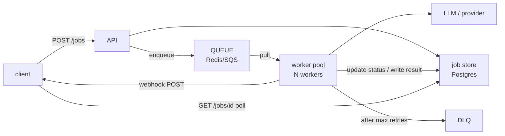

# Lecture 9: Async and Queue-Based Inference for Long and Batch Jobs

> Some work simply does not fit inside one HTTP request. A 40-page document summarized section by section, a nightly re-embedding of 200k support tickets, a "generate 500 product descriptions" button — hold the socket open for these and you will hit gateway timeouts, blow your provider's concurrency, and turn one slow user into an outage for everyone. This lecture teaches the escape hatch: **accept, enqueue, return a job id, process asynchronously, poll or webhook.** You will learn the queue building blocks (Celery/Redis, SQS, BullMQ), the four operational must-haves that separate a toy queue from a production one (idempotent workers, dead-letter queues, retry-with-backoff, delivery-semantics tradeoffs), when this pattern beats synchronous streaming, and how provider **Batch APIs** turn "we can wait" into a 50% discount. After this you can look at a feature and say, in thirty seconds, "that's async with a DLQ and idempotent workers — here's the job-id contract," and defend it.

**Prerequisites:** HTTP status codes + async basics, idempotency keys (Week 1), the LLM gateway mental model (Week 2 Lectures 5–8), Redis at a basic level · **Reading time:** ~24 min · **Part of:** Phase 09 — Architecture & System Design, Week 2

---

## The core idea (plain language)

The synchronous request/response model has an invisible contract: **the client holds a connection open, and you promise to answer before it times out.** That contract works when "the work" is bounded and short — a chat reply, a classification, a single generation you can stream. It breaks the moment the work is *long* (a 90-second multi-step generation), *bulk* (10,000 items to process), or *spiky* (a burst that exceeds your provider's rate limit). Holding the socket open then does three bad things at once: it ties up a server worker for the whole duration, it exposes you to every timeout between client and origin (browser ~30–60s, load balancer 60s, CDN 100s), and it gives you nowhere to put the work when the provider says "429, slow down."

The async pattern breaks that contract on purpose and replaces it with a **two-phase** one:

```
Phase 1 (fast, synchronous):   POST /jobs  --> validate, write a job row, enqueue,
                                              return 202 Accepted + {job_id, status: "queued"}
Phase 2 (slow, out-of-band):   worker pulls the job, does the slow work, writes the result;
                               client learns via  GET /jobs/{id}  (poll)  or  a webhook (push)
```

The request that used to *be* the work is now just an **acknowledgement that the work was accepted.** You return `202 Accepted` — literally "I have accepted this for processing, but processing is not complete" — hand back a `job_id`, and the client comes back later. The slow part runs on a pool of **workers** you control, decoupled by a **queue** (a durable list of pending jobs). This is the same shape as a print spooler, a CI pipeline, or an email-sending backend; LLM inference is just an unusually slow, unusually expensive, unusually rate-limited unit of work living inside it.

The queue buys you three things you cannot get synchronously: **buffering** (a burst piles up in the queue instead of overwhelming the provider), **retry** (a failed job goes back on the queue instead of vanishing into a 500), and **isolation** (a slow job occupies a worker, not a request handler, so it can't starve your fast interactive traffic).

---

## How it actually works (mechanism, from first principles)

### The moving parts



- **The job store (Postgres).** The durable source of truth for each job: `id`, `tenant_id`, `status` (`queued → running → succeeded | failed`), `idempotency_key`, `attempts`, `result_ref`, `created_at`, timestamps. The queue holds *pointers* to work; the job store holds *state*. Never make the queue your database — most queues can't answer "what's the status of job X?" efficiently.
- **The queue.** A durable, ordered-ish list of messages. Redis lists/streams (via Celery or BullMQ), or AWS SQS. Its job is to hand each message to exactly one worker at a time and hold it until that worker confirms completion (**acknowledges**, or *acks*).
- **The worker pool.** N processes that loop: pull a message, load the job, do the work (the actual LLM call), write the result, ack. Scale throughput by adding workers — up to your provider's rate limit, which is the real ceiling (Week 3).
- **The dead-letter queue (DLQ).** A side queue where messages go after they've failed `maxRetries` times, so one *poison message* (a job that crashes the worker every time) doesn't loop forever, block the queue, or burn money on retries.

### The visibility-timeout mechanism (the heart of it)

The single most important mechanism to understand is **how a queue guarantees a message isn't lost if a worker dies mid-job.** It does *not* delete the message when a worker picks it up. Instead:

1. Worker calls "receive" → the queue hands over the message **and makes it invisible** to other workers for a **visibility timeout** (SQS default 30s; Celery/Redis has an analogous *visibility timeout*, default 1 hour).
2. Worker does the work. If it finishes, it calls **delete/ack** → message is gone for good.
3. If the worker **crashes or the timeout expires before ack**, the message becomes **visible again** and another worker picks it up.

This is what makes queues resilient — and it is *exactly* why you need idempotent workers. Consider the arithmetic: your job takes **45 seconds** of LLM generation, but the visibility timeout is **30 seconds**. At t=30s the queue thinks the worker died and **redelivers the message to a second worker.** Now two workers are generating the same 500-item batch, you pay twice, and you may write the result twice. The bug isn't the queue — the queue did its job. The bug is (a) a visibility timeout shorter than your worst-case job, and (b) a non-idempotent worker. **Set the visibility timeout above your p99 job duration** (here, ≥60s), and make the work safe to repeat.

### At-least-once vs exactly-once

Standard queues (SQS standard, Redis-backed Celery/BullMQ) give you **at-least-once delivery**: every message is delivered one *or more* times. Duplicates happen from the redelivery mechanism above, from network partitions during ack, and from retries. **Exactly-once delivery does not exist in a distributed system in any practical, cheap form** — SQS FIFO offers exactly-once *within a 5-minute dedup window* at reduced throughput, and even that is delivery, not *processing*, semantics.

The engineering resolution is the important part: **stop trying to achieve exactly-once *delivery*, and instead build exactly-once *effect* via idempotency.** If processing the same message twice produces the same result and the same side effects as processing it once, at-least-once delivery is *fine*. This is why idempotency is not a nice-to-have here; it is the load-bearing wall.

### Idempotent worker design

An idempotent worker produces the same observable outcome whether it runs a job once or five times. The Week 1 **idempotency key** flows straight through the queue to make this real:

```python
async def process_job(msg):
    job = await db.get_job(msg["job_id"])          # load state from the durable store
    if job.status in ("succeeded", "failed"):       # 1) terminal? someone already finished it
        return ack(msg)                             #    ack and move on — do NOT redo the work
    # 2) claim it atomically so two redelivered copies can't both run
    claimed = await db.compare_and_set_status(job.id, expect="queued", to="running")
    if not claimed:
        return ack(msg)                             #    another worker owns it; drop this copy
    try:
        result = await llm.complete(job.payload)    # 3) the expensive step
        # 4) write result keyed by idempotency_key — a UNIQUE constraint makes the write itself safe
        await db.upsert_result(job.idempotency_key, result)
        await db.set_status(job.id, "succeeded")
        await maybe_webhook(job, result)
    except Exception as e:
        await db.increment_attempts(job.id)
        raise                                       # 5) do NOT ack — let it redeliver/retry
    ack(msg)
```

Three defenses, layered: (1) a **terminal-status check** so finished work is never redone, (2) an **atomic claim** (compare-and-set) so two redelivered copies can't both enter the expensive step, and (3) a **unique constraint on the idempotency key** in the result table so even a race that slips through can't double-write. Defense in depth, because at-least-once *will* deliver duplicates.

### Retry with backoff

When a job fails transiently (provider 503, timeout, rate-limit 429), you retry — but **not immediately and not forever.** Immediate retries during a provider brownout are a stampede that makes the outage worse. Use **exponential backoff with jitter**:

```
attempt 1 fails → wait ~1s   (base 1s)
attempt 2 fails → wait ~2s
attempt 3 fails → wait ~4s
attempt 4 fails → wait ~8s
attempt 5 fails → move to DLQ
delay = min(cap, base * 2**attempt) * random(0.5, 1.5)   # jitter spreads the herd
```

The **jitter** matters more than engineers expect: without it, 1,000 jobs that all failed at the same instant all retry at *exactly* t+1s, t+2s, … — synchronized thundering herds. Jitter smears them across the window. Distinguish **retryable** errors (5xx, timeout, 429) from **non-retryable** ones (400 malformed request, 401 bad key, content-policy refusal) — retrying a 400 five times just wastes five attempts before the DLQ. Cap total attempts (3–5 is typical) and send exhausted jobs to the **DLQ**, not into an infinite loop.

---

## Worked example

**A "summarize this 120-page contract" feature.** Full-document analysis: chunk into ~40 sections, summarize each, then synthesize. Each section is ~2.5k input + ~400 output tokens; the whole job is ~40 LLM calls and takes **70–110 seconds** wall-clock. Synchronous is impossible — your load balancer's 60s idle timeout kills it first.

**Async design:**

- `POST /summaries` with `{tenant_id, document_id, idempotency_key}` → API validates, inserts a job row (`status=queued`), pushes `{job_id}` to the queue, returns **`202`** + `{"job_id": "sum_9f3", "status": "queued", "poll_after_ms": 5000}`. This handler returns in **~15ms**.
- A worker pulls `sum_9f3`, claims it, runs the 40 calls (with its own inner retry per call), writes the result to object storage, sets `status=succeeded`, and if the tenant registered one, POSTs a webhook.
- Client either polls `GET /jobs/sum_9f3` every 5s (sees `queued → running → succeeded`, then fetches the result) or receives the webhook.

**Now the numbers that justify the pattern.** Suppose a burst of **200** contracts arrives in one minute. Synchronously, that's 200 concurrent 90-second requests — 200 tied-up server workers and 200 × 40 = **8,000** near-simultaneous provider calls, instantly blowing a 5,000-RPM limit. Async: 200 job rows written in ~3s, then a pool of, say, **10 workers** drains the queue. Throughput = 10 workers ÷ 90s/job ≈ **6.7 jobs/min**, so the burst drains in ~30 minutes — *smoothly*, under the rate limit, with no dropped work. The queue **absorbed a 200× spike** and metered it to a rate the provider tolerates. That reshaping is the entire point: same total work, spread over time you control.

**Batch API twist.** These summaries aren't interactive — nobody's watching a spinner. So route them through the provider's **Batch API** instead: submit the 8,000 calls as one batch file, get results within the batch SLA (commonly up to 24h), at roughly **half the per-token price.** If the 200-contract run costs \$40 synchronously, the batch run costs ~\$20. The *queue is what lets you exploit this* — because the work is already decoupled from a live request, "results in a few hours" is a scheduling detail, not a UX regression.

---

## How it shows up in production

- **The gateway timeout you can't out-code.** A long generation that "works on my machine" dies at 60s the moment it's behind an ALB/nginx/Cloudflare. No amount of `keepalive` tuning fixes work that genuinely takes 90s — you must go async. The 60s number is the most common hard wall.
- **Duplicate charges and duplicate results.** The classic incident: visibility timeout (30s) < job duration (45s) → every job runs twice → the provider bill doubles and users see two identical outputs (or two emails sent). The fix is boring and total: raise the timeout above p99 duration *and* make workers idempotent. If you only do one, do idempotency.
- **The poison message that ate the queue.** One job with a malformed payload crashes the worker on every attempt. Without a DLQ and a retry cap, it redelivers forever, occupying a worker, blocking newer jobs behind it, and — if it reaches the LLM before crashing — burning money on every loop. The DLQ is what turns "outage" into "one row to inspect later."
- **Rate-limit smoothing as a feature.** During a marketing spike, the queue is why you degrade to "slower" instead of "down." Backpressure (Week 3) makes this explicit: when the queue depth crosses a threshold, you can shed load or return the **`202 queued`** degradation response instead of a 500 — the queue *is* your degradation buffer.
- **Cost you only find in the batch line item.** Teams running non-interactive bulk work (nightly re-embeddings, eval runs, dataset generation) synchronously at full price are leaving ~50% on the table. Moving offline work to a Batch API is often the single biggest LLM cost win available, and it's purely an architecture change — same prompts, same models.
- **The orphaned job.** A worker sets `status=running`, then the pod is OOM-killed. Without a **reaper** (a sweep that resets `running` jobs older than a timeout back to `queued`, or relies on visibility-timeout redelivery), that job is stuck at `running` forever and the user polls into the void. Every async system needs a stuck-job sweeper.

---

## Common misconceptions & failure modes

- **"We'll use a FIFO/exactly-once queue so we don't need idempotency."** No. Exactly-once *delivery* (even where it exists, like SQS FIFO's 5-min window) is not exactly-once *processing* — a worker can ack, then crash before its DB commit lands, and the effect is lost or, on redelivery, doubled. Idempotency at the *effect* layer is mandatory regardless of queue guarantees. Build for at-least-once and duplicates become harmless.
- **"The queue is my job database."** Queues answer "give me the next message," not "what's the status of job 9f3?" or "list this tenant's failed jobs." Keep durable state in Postgres; keep only pointers in the queue. Querying a queue for status is a design smell.
- **"202 means it's done."** `202 Accepted` means *accepted for processing*, explicitly **not** completed. The response must carry a `job_id` and ideally a poll hint; the client must have a second step. Returning `200` with a fake result here is the bug that trains clients to ignore status.
- **"Retries make it reliable."** Retrying **non-retryable** errors (400, 401, policy refusals) just wastes attempts and delays the DLQ. And retries *without* backoff+jitter turn a provider brownout into a self-inflicted DDoS. Classify errors; back off; cap attempts.
- **"Poll every second, it's fine."** Aggressive polling from thousands of clients is its own load problem and a cost (each poll is a DB read). Give clients a `poll_after` / `Retry-After` hint, use webhooks for push where you can, and consider exponential poll backoff on the client.
- **"Async is always better for slow work."** No — if a *single user is actively waiting* and you can produce tokens incrementally, **synchronous SSE streaming** (Lecture 7) gives better perceived latency: they see output at TTFT and read as it generates. Async is for work that's *too long to stream* (multi-minute pipelines), *bulk/offline* (no human waiting), or *needs smoothing* (bursts over the rate limit). Streaming vs queueing is a UX-and-duration decision, not a speed one.

---

## Rules of thumb / cheat sheet

- **Go async when:** job can exceed ~30–60s, OR it's bulk/offline (no human waiting), OR you must smooth bursts under a provider rate limit. **Stay synchronous (stream)** when a human is waiting and output can stream incrementally.
- **The contract:** `POST` → validate + write job row + enqueue → **`202` + `{job_id, status:"queued"}`**. Then `GET /jobs/{id}` (poll) or webhook (push). Never block the accepting request on the work.
- **Delivery model:** assume **at-least-once**. Duplicates *will* happen. Don't chase exactly-once delivery; build exactly-once *effect* with idempotency.
- **Idempotent worker, three layers:** terminal-status check → atomic claim (compare-and-set) → **unique constraint on the idempotency key** at the result write. The Week 1 idempotency key rides the message end to end.
- **Visibility timeout > p99 job duration.** If jobs take 45s, don't leave it at 30s. Redelivery mid-job is the #1 duplicate-work cause.
- **Retry:** exponential backoff **with jitter**, cap 3–5 attempts, only on **retryable** errors (5xx/timeout/429), then **DLQ**. Never retry 400/401/policy refusals.
- **Always have a DLQ** and a **stuck-`running` reaper**. A queue without a DLQ has an infinite-loop failure mode built in.
- **Batch APIs** for non-interactive bulk work: ~50% cheaper (approximate), SLA often up to 24h. The queue is what lets you route offline work there.
- **Scale workers up to the provider's rate limit, not past it** — the provider TPM/RPM wall is your real ceiling (Week 3), not your CPU.
- **Tooling defaults:** Python → **Celery + Redis** (or RQ for simple) / SQS on AWS; Node → **BullMQ + Redis**; cloud-native → **SQS + Lambda/workers** with a configured DLQ + `maxReceiveCount`.

## Connect to the lab

Week 2's lab is the gateway; this pattern is the seed of Week 3's **degradation mode** (Lab step 4): when the circuit breaker is open for all providers, `/chat` finally **enqueues the request and returns a `202` with a job id** rather than a 500 — the exact accept-enqueue-return contract from this lecture, used as a graceful-degradation fallback. Build the pieces here so they're ready there: a `jobs` table (`status`, `idempotency_key`, `attempts`), a worker loop that claims-then-processes idempotently reusing your Week 1 idempotency key, and a DLQ path after N failed attempts. If you add a bulk endpoint, wire it to a provider Batch API and record the price delta in the capacity sheet.

## Going deeper (optional)

- **AWS SQS Developer Guide** (`docs.aws.amazon.com`) — read the sections on *visibility timeout*, *dead-letter queues* (`maxReceiveCount`/redrive), and *standard vs FIFO*. The canonical mental model for at-least-once queues.
- **Celery documentation** (`docs.celeryq.dev`) — tasks, `acks_late`, `task_acks_on_failure_or_timeout`, retries/backoff, and the Redis broker's visibility-timeout caveat. Search: `Celery acks_late idempotency`.
- **BullMQ docs** (`docs.bullmq.io`) — the Node/Redis standard; read *Jobs*, *Retrying failing jobs* (backoff strategies), and *Flows*.
- **OpenAI Batch API** and **Anthropic Message Batches API** (`platform.openai.com/docs`, `docs.anthropic.com`) — read the pricing/discount and turnaround sections before you assume synchronous is fine for offline work.
- **Enterprise Integration Patterns** (Hohpe & Woolf) — the timeless catalog: *Dead Letter Channel*, *Guaranteed Delivery*, *Idempotent Receiver*, *Competing Consumers*. Search: `Enterprise Integration Patterns dead letter channel`.
- **Search queries to keep handy:** `at-least-once vs exactly-once delivery idempotent consumer`, `exponential backoff with jitter AWS blog`, `SQS visibility timeout duplicate processing`, `202 Accepted async job pattern REST polling webhook`, `LLM batch API cost discount`.

## Check yourself

1. A client `POST`s a job and gets `202 {job_id, status:"queued"}`. Name the two mechanisms the client can use to eventually get the result, and one tradeoff of each.
2. Your jobs take 45s; the SQS visibility timeout is the default 30s. Describe exactly what goes wrong, and give the two independent fixes.
3. "We switched to a FIFO exactly-once queue, so we can delete all the idempotency logic." Why is this wrong? What guarantee do you actually need and how do you get it?
4. Write the retry policy for a worker that hits (a) an HTTP 503, (b) an HTTP 400 malformed-request, (c) an HTTP 429. Include backoff and what happens after the cap.
5. Give three concrete signals that a workload should be async/queued rather than synchronously streamed, and one signal that it should stay a synchronous stream.
6. What is a dead-letter queue, and name two distinct failures it prevents.

### Answer key

1. **Polling** (`GET /jobs/{id}` on an interval) — simple and firewall-friendly, but wastes reads and adds latency between completion and discovery; mitigate with a `Retry-After`/`poll_after` hint and client-side backoff. **Webhook** (server POSTs the result to a client URL when done) — push, near-zero latency and no wasted reads, but the client must expose an endpoint, and you need retries/signing on the webhook itself (it's another at-least-once delivery). Many systems offer both.
2. At t=30s the queue assumes the worker died (no ack yet, since the job needs 45s) and **redelivers the message to a second worker**. Both now generate the same job → you pay twice and may write/emit the result twice. Two independent fixes: (i) **raise the visibility timeout above p99 job duration** (e.g. ≥60s) so a healthy worker acks first; (ii) make the **worker idempotent** (terminal-status check + atomic claim + unique constraint) so a duplicate is a no-op. Do both; if only one, do idempotency.
3. Exactly-once *delivery* (even SQS FIFO's 5-minute dedup window) is not exactly-once *processing*: a worker can ack then crash before committing, or commit then crash before acking — so the *effect* can still be lost or doubled. What you need is **exactly-once effect** via an **idempotent consumer**: assume at-least-once and make reprocessing produce identical state/side-effects (atomic claim, writes keyed by idempotency key with a unique constraint). Deleting that logic reintroduces double-charge/double-write on the next redelivery.
4. (a) **503** — retryable: exponential backoff with jitter (~1s, 2s, 4s, 8s), cap 3–5 attempts, then **DLQ**. (b) **400 malformed** — non-retryable: mark `failed` (or DLQ immediately); retrying just wastes attempts. (c) **429** — retryable; honor the provider's `Retry-After` header, else backoff+jitter, cap attempts, then DLQ. Jitter throughout so failed jobs don't retry in a synchronized herd.
5. **Async/queue** if: (i) the job can exceed the ~30–60s gateway/LB timeout; (ii) it's bulk/offline with no human waiting — then use a **Batch API** for ~50% savings; (iii) you must smooth a burst under a rate limit. **Stay a synchronous stream** if a human is actively waiting and output can be produced incrementally (chat, code completion) — SSE gives better perceived latency because they read at TTFT.
6. A **dead-letter queue** is a side queue that receives messages after they've failed processing a configured number of times (`maxReceiveCount`), removing them from the main flow for later inspection. It prevents (i) a **poison message** from redelivering forever — blocking the queue, occupying a worker, and repeatedly burning money on the LLM call — and (ii) **silent data loss**: instead of a repeatedly-failing job vanishing into 500s, it's parked durably where you can inspect, fix, and redrive it.
