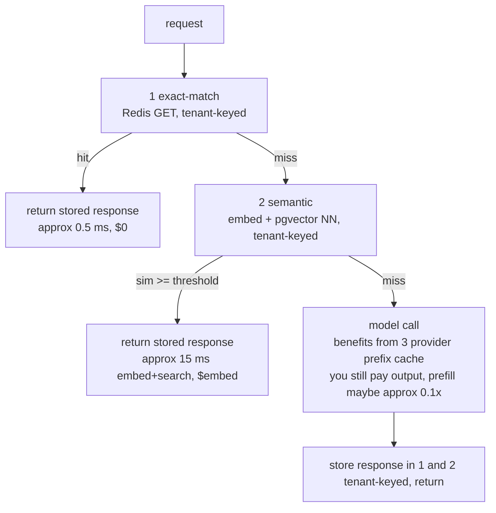

# Lecture 10: Three Caching Layers and the Tenant-Isolation Iron Rule

> LLM calls are the slowest, most expensive thing your gateway does — a cache hit turns a 2-second, 3-cent call into a 5-millisecond, free one. But caching in front of a model is a minefield: the three caches people casually lump together cache *completely different things*, tune differently, and go stale differently. Worse, one wrong cache key leaks tenant A's private answer to tenant B — a data breach, not a bug. After this lecture you can stack an exact-match cache, a semantic cache, and provider prompt caching correctly; reason about each one's hit rate, TTL, and staleness; tune a semantic threshold with eval evidence instead of vibes; and write the test that proves your cache never crosses a tenant boundary.

**Prerequisites:** the LLM gateway shape (routing, fallback, streaming) from Week 2 Theory; hashing and cosine similarity at an arithmetic level; Redis and pgvector at a basic level. · **Reading time:** ~22 min · **Part of:** AI Application Architecture & System Design, Week 2.

## The core idea (plain language)

There is no such thing as "the cache" for an LLM app. There are three, and they answer three different questions:

1. **Exact-match cache** — "Have I seen *this exact request* before?" Key = a hash of the normalized prompt. Hit ⇒ return the stored response byte-for-byte. Handles retries, refreshes, and genuinely repeated calls (the same FAQ, the same nightly report prompt).
2. **Semantic cache** — "Have I seen a request that *means the same thing*?" Embed the query, look for a stored answer whose query embedding is close enough (cosine similarity above a threshold). Handles paraphrases — "reset my password" vs "how do I change my password."
3. **Provider prompt caching** — "Has the *provider* already processed this prefix?" Anthropic's `cache_control` and OpenAI's automatic prefix cache store the model's internal *prefill* state server-side, so a long, unchanging system prompt or document isn't re-processed on every call. You don't store a response — the provider caches the expensive part of computing one.

The first two live in *your* infrastructure and cache *responses*. The third lives in the *provider's* infrastructure and caches *computation*. They stack: a request checks exact-match, then semantic, then — on a true miss that goes to the model — benefits from provider prefix caching. Getting them confused ("why isn't my semantic cache saving prefill cost?") is the single most common conceptual error in this space.

And running through all three: **the iron rule**. Every cache entry is keyed by `tenant_id`. A cache that ignores tenancy will, the first time two tenants ask a similar question, hand one tenant the other's answer. Treat that as a security control, not a performance optimization.

## How it actually works (mechanism, from first principles)

### Layer 1 — Exact-match: hash the normalized prompt

The mechanism is a dictionary lookup. You compute a deterministic key from the request and use it as a Redis key:

```python
import hashlib, json

def exact_key(tenant_id: str, model: str, messages: list[dict]) -> str:
    normalized = normalize(messages)              # see normalization below
    blob = json.dumps(
        {"t": tenant_id, "m": model, "msgs": normalized},
        sort_keys=True, separators=(",", ":"),
    )
    return "cache:exact:" + hashlib.sha256(blob.encode()).hexdigest()
```

Note what is *inside* the hash: `tenant_id`, the `model`, and the normalized messages. All three matter. Two tenants sending identical text must produce different keys (the iron rule). Two different models must produce different keys — `gpt-4o-mini` and `claude-sonnet-4-6` give different answers to the same prompt, so a shared key would serve the wrong model's output. And the messages must be *normalized* before hashing, or trivial formatting differences cause misses (covered below).

On a hit you return the stored response and never call the model. Latency drops from provider round-trip (often 300 ms to first token, seconds to completion) to a Redis GET (sub-millisecond). Cost drops to zero. The catch: exact-match only fires on *byte-identical* (post-normalization) requests. In an interactive chatbot where every user types something slightly different, the hit rate is near zero. In a system with repeated structured calls — classification, a fixed daily summarization prompt, retried idempotent requests — it can be very high.

**Worked hit-rate intuition.** Suppose 100k requests/day, and 30% are exact repeats of something seen in the last hour. With a 1-hour TTL you serve 30k from cache: 30k model calls saved. If each call costs $0.004 and takes 1.5 s, that's $120/day and ~12.5 compute-hours of latency removed — for a Redis instance that costs cents. That 30% "repeat rate" is the number to actually measure in your traffic; don't assume it.

### Layer 2 — Semantic: embed, then nearest-neighbor above a threshold

Exact-match misses on "How do I reset my password?" vs "I forgot my password, help." Semantic caching catches these. Mechanism:

1. On a request, embed the (normalized, tenant-scoped) query into a vector — e.g. a 1536- or 768-dimension float array.
2. Search a per-tenant vector index (pgvector, or a purpose-built cache like GPTCache) for the nearest stored query vector.
3. Compute cosine similarity. If it exceeds a threshold τ, return that entry's stored answer. Otherwise, miss → call the model → store `(query_vector, answer)`.

Cosine similarity ranges from -1 to 1; for text embeddings, near-duplicates typically land in the 0.9–0.99 range and unrelated text in the 0.3–0.7 range. The **threshold τ is the entire ballgame**, and it is a *precision/recall knob*:

```
τ too HIGH (0.99): almost nothing matches → behaves like exact-match, low hit rate, but safe
τ too LOW  (0.85): loose matches → high hit rate, but you start returning
                   CONFIDENTLY WRONG answers to similar-but-different questions
```

```
        query: "What is the refund window for Pro plan?"
 cached query: "What is the refund window for Enterprise plan?"
        cosine: ~0.94   ← these MEAN different things but embed close
```

At τ = 0.90 you'd serve the Enterprise refund policy to a Pro customer. That is the defining failure mode of semantic caching: it fails *silently and confidently*. The model is never called, so there's no signal — just a wrong answer delivered fast. **Start strict (0.95+) and only loosen with eval evidence** (a labeled set of query pairs where you know the "should hit / should miss" ground truth). We'll build that eval below.

### Layer 3 — Provider prompt caching: caching the prefill, not the answer

This layer is fundamentally different. When you send a prompt to a model, the provider must *process* every input token before it can generate the first output token — this is the "prefill." For a 20k-token system prompt plus a large document, prefill dominates latency and cost. Provider prompt caching lets the provider store the internal state for a **prefix** of your input and reuse it across calls.

- **Anthropic**: explicit — you mark a breakpoint with `cache_control: {"type": "ephemeral"}` on the last content block of the stable prefix. Render order is `tools` → `system` → `messages`, so a breakpoint on the last system block caches tools + system together.
- **OpenAI**: automatic — it caches long prompt prefixes without you asking, keyed on the prefix content.

The governing invariant is **prefix match**: caching keys on the exact bytes from the start of the prompt up to the breakpoint. *Any* byte change anywhere in the prefix invalidates everything after it. Put a `datetime.now()` or a per-request UUID early in your system prompt and you will never get a cache hit — the prefix differs every call.

Crucially, **you do not control this layer's contents and it does not store your response.** It reduces the cost/latency of a model call you're still making. So it stacks *underneath* layers 1 and 2: an exact-match or semantic hit skips the model entirely (and thus skips prefill caching); only a true miss that hits the provider benefits from it.

**The pricing that makes it worth it (Anthropic, as of 2025–2026 — treat as approximate and verify):**

| Operation | Cost relative to base input |
|---|---|
| Cache **write** (5-minute TTL) | ~1.25× |
| Cache **write** (1-hour TTL) | ~2× |
| Cache **read** | ~0.1× |
| Uncached input | 1× |

So a cached prefix costs ~1.25× the first time (the write) and ~0.1× on every subsequent read. **Break-even math:** with the 5-min TTL, two requests already win — 1.25× + 0.1× = 1.35× versus 2× uncached. With the 1-hour TTL, you need at least three requests (2× + 0.2× = 2.2× vs 3×) because the write premium is doubled. The 1-hour TTL earns its keep only for bursty traffic with gaps longer than 5 minutes.

**Minimum cacheable prefix (Anthropic — model-dependent, silently no-ops below the floor):**

| Model | Minimum tokens to cache |
|---|---|
| Opus 4.x, Haiku 4.5 | 4096 |
| Sonnet 4.6, Haiku 3.5 | 2048 |
| Sonnet 4.5 / 4 / 3.7 | 1024 |

Below the floor there's no error — `cache_creation_input_tokens` just comes back 0. Verify hits by reading `usage.cache_read_input_tokens`; if it's zero across repeated identical-prefix requests, a silent invalidator (timestamp, unsorted JSON, a varying tool set) is corrupting your prefix.

### How they stack — the request path



## Worked example

A multi-tenant support assistant. Tenant `acme` and tenant `globex` share one gateway. Traffic: 50k requests/day, ~25% exact repeats, ~15% paraphrase-of-something-seen. System prompt is a fixed 6k-token policy doc.

- **Layer 3 (provider prefix cache):** the 6k-token system prompt is above the 4096 floor, so mark it with a cache breakpoint. Prefill for it drops from 1× to ~0.1× on every call after the first within the TTL window. On 50k calls, that's ~50k × 6k = 300M input tokens that mostly bill at 0.1× instead of 1×. This helps *every* miss.
- **Layer 1 (exact):** 25% × 50k = 12,500 calls served from Redis. Zero model cost, sub-ms latency.
- **Layer 2 (semantic, τ = 0.96):** of the remaining 37,500, 15% are paraphrases → ~5,600 more served without a model call, at the cost of one embedding call each (cheap and fast).

Net: ~18,100 of 50k requests (36%) never reach the model. The remaining ~32k that do still get cheap prefill via layer 3.

Now the danger. `acme` asks "What's our SLA for Sev-1 incidents?" and it's cached. `globex` asks the near-identical question. At cosine 0.97 the semantic cache matches — and if the key ignored `tenant_id`, `globex` receives **acme's SLA**, which may be contractually confidential. This is exactly the leak the iron rule prevents.

## How it shows up in production

- **Cost line goes down, then a bad answer goes out.** Semantic caching's savings are visible on the dashboard; its failures are invisible until a user complains that the bot told them the wrong plan's pricing. The cost win tempts you to lower τ; the silent-failure risk is why you must not, absent eval evidence.
- **"The cache never hits" on the provider layer.** Nine times out of ten it's a silent invalidator in the prefix — a timestamp in the system prompt, `json.dumps()` without `sort_keys=True`, or a tool list that reorders per request. Diff the raw bytes of two consecutive requests; the first differing byte is your culprit. Confirm with `usage.cache_read_input_tokens`.
- **Stale answers after a knowledge update.** You publish a new refund policy. Exact and semantic caches still serve yesterday's answer until their TTL expires or you invalidate. Caches make your app faster *and* slower to reflect truth — this is the staleness tax, and it's why TTLs and explicit invalidation on content change matter.
- **GDPR delete must purge caches too.** A "delete this user" request that clears Postgres but leaves the user's question-and-answer in the semantic cache and the vector index is a compliance failure. Your cascade delete has to `SCAN`+`DEL` the tenant/user-namespaced cache keys and delete the user's cache vectors — the same discipline as the Week 1 GDPR lab.
- **A cross-tenant leak is an incident, not a ticket.** If your test suite doesn't *prove* isolation, you will eventually ship a refactor that drops `tenant_id` from a key, and you'll find out from a customer. This is why the isolation test is non-negotiable.

## Common misconceptions & failure modes

- **"Semantic caching replaces exact-match."** No — they compose. Exact-match is free and exact; run it first as a cheap gate before you pay for an embedding + vector search.
- **"Provider prompt caching caches my answers."** It caches *prefill computation*, server-side, for a prefix. It never returns a stored answer; you still generate output tokens every call. It reduces the cost of the calls the other two layers *didn't* absorb.
- **"A higher hit rate is better."** For the semantic cache, a higher hit rate driven by a lower threshold means more *wrong* hits. The metric that matters is hit rate *at acceptable precision*, measured on an eval set.
- **"TTL is just a performance dial."** TTL is also your staleness bound. A 24-hour TTL means up to 24 hours of serving outdated answers after a content change. Pick TTLs against how fast your ground truth changes, and invalidate explicitly when you can.
- **Cache-key normalization pitfalls.** The exact-match key must normalize *only* things that don't change meaning: trim trailing whitespace, apply a consistent Unicode normalization (NFC), serialize JSON with sorted keys and no incidental spacing. Do **not** lowercase blindly (case can be semantic — "US" vs "us"), do **not** strip fields that affect output (`temperature`, `system`, tool definitions, `model`), and do **not** forget that a changed system prompt or tool list must change the key. Over-normalize and you serve the wrong answer; under-normalize and you never hit. And every normalization you do to the exact key, do consistently before embedding for the semantic key too.
- **Forgetting the model in the key.** Same prompt, different model → different answer. If you route across a cheap-first cascade, the model that answered must be part of both cache keys, or a cache hit will return an answer the current model wouldn't have produced.
- **Caching non-deterministic or personalized content.** If a prompt includes the current time, the user's name, or per-request retrieved documents, caching the *response* is wrong — those responses aren't reusable. Cache only what's genuinely reusable; push volatile content out of the cached prefix.

## Rules of thumb / cheat sheet

- **Order:** exact-match → semantic → model (with provider prefix cache underneath). Cheapest gate first.
- **Every key starts with `tenant_id`.** No exceptions. Include `model` too. This is the iron rule.
- **Semantic threshold:** start at **0.95–0.97**. Only lower it with eval evidence showing precision holds. A wrong fast answer is worse than a right slow one.
- **Exact-match TTL:** minutes to a few hours for volatile data; longer for stable reference answers. TTL = your staleness tolerance.
- **Provider prefix cache:** put stable content first (frozen system prompt, sorted tool list), volatile content last. Verify with `cache_read_input_tokens > 0`. Use 1-hour TTL only when reads clearly clear the 3-request break-even.
- **Minimum prefix (Anthropic):** ~4096 tokens on Opus/Haiku-4.5, ~2048 on Sonnet 4.6, ~1024 on older Sonnet. Below the floor, caching silently no-ops.
- **Pricing (Anthropic, approximate):** read ~0.1×, write ~1.25× (5-min) / ~2× (1-hour) of base input. Break-even: 2 reqs (5-min), 3 reqs (1-hour).
- **On content change:** invalidate the affected cache entries explicitly; don't wait for TTL if correctness matters.
- **On GDPR delete:** purge the user's exact-match keys and semantic vectors along with everything else.

## Connect to the lab

This is Week 2 Lab step 4 (`cache.py`): exact-match key = `sha256(tenant_id + model + normalized_messages)`, then a per-tenant semantic cache in pgvector or GPTCache with a starting cosine threshold of 0.95, responses stored with a TTL. The Definition of Done requires you to report a hit rate over a repeated workload *and* ship `test_cache_tenant_isolation.py` proving tenant A never receives tenant B's cached answer — write that test first, before the cache is even fast, because it's the one that catches a data leak.

## Going deeper (optional)

- **Anthropic prompt caching docs** — the authoritative source for `cache_control`, TTLs, minimum prefixes, and the `cache_read_input_tokens` field. Root: `platform.claude.com/docs` (search: "Anthropic prompt caching").
- **OpenAI prompt caching guide** — how automatic prefix caching works and what invalidates it (search: "OpenAI prompt caching").
- **GPTCache** — the canonical open-source semantic cache; its README documents the embedder → vector store → similarity-evaluator pipeline (search: "GPTCache GitHub").
- **pgvector** — the Postgres extension for the semantic-cache index; README covers `<=>` cosine distance operators and index types (search: "pgvector README").
- **Redis EXPIRE / TTL docs** — for the exact-match layer's expiry semantics (search: "Redis EXPIRE command").
- Search query for the tuning discipline: "semantic cache threshold false positive eval."

## Check yourself

1. A teammate says "let's just use the semantic cache and drop exact-match — it's a superset." What's wrong with that?
2. Your provider prompt cache shows `cache_read_input_tokens: 0` on every request even though the system prompt is identical each call. Name two likely causes.
3. Why does lowering the semantic threshold from 0.97 to 0.90 *increase* the risk of a confidently-wrong answer, and how would you decide whether 0.90 is safe?
4. Write the assertion at the heart of the tenant-isolation test.
5. Anthropic charges ~1.25× for a 5-minute cache write and ~0.1× per read. After how many total requests hitting the same prefix do you come out ahead versus not caching, and why is the 1-hour TTL's break-even higher?
6. You update your refund policy. Which of the three caches can serve a stale answer, and what are your two levers to stop it?

### Answer key

1. They cache different things at different costs. Exact-match is a free, exact dictionary lookup with no false positives; the semantic cache costs an embedding + vector search per lookup and *can* return a wrong answer above the threshold. You want exact-match as the cheap, safe first gate; the semantic layer only earns the extra cost/risk for the paraphrases exact-match misses.
2. (a) A silent invalidator in the prefix — a `datetime.now()`/UUID/varying value early in the system prompt, or `json.dumps()` without `sort_keys=True`, or a tool list that reorders — so the prefix bytes differ every call. (b) The prefix is below the model's minimum cacheable size (e.g. under 4096 tokens on Opus), so caching silently no-ops. (Also possible: the breakpoint isn't placed on the stable prefix, or TTL expired between calls.)
3. Lower τ accepts matches between queries that are *close in embedding space but different in meaning* ("refund window for Pro" vs "for Enterprise" embed at ~0.94). The model is never called, so the wrong answer is delivered fast and silently with no error signal. To decide if 0.90 is safe, run a labeled eval set of query pairs marked should-hit / should-miss, measure precision (fraction of hits that were correct matches) at 0.90, and only adopt it if precision stays acceptable — never on hit-rate alone.
4. Roughly: seed tenant A with a cached response; issue the *same* request as tenant B; assert tenant B gets a cache **miss** (or its own answer), never tenant A's stored response — e.g. `assert cache.get(key_for("B", msgs)) is None` and/or `assert response_for_B != tenant_A_cached_response`.
5. Two requests: the first pays 1.25× (write), the second pays 0.1× (read) → 1.35× total vs 2× uncached, so you're ahead at request 2. The 1-hour TTL doubles the write premium to 2×, so 2× + 0.1× = 2.1× only beats 3× uncached at the third request — you need at least 3 reads within the window to justify it.
6. The two caches that store *responses* — exact-match and semantic — can serve the stale policy; the provider prefix cache only caches prefill computation, not answers, so it can't. Levers: (a) explicitly invalidate/evict the affected cache entries on the content change rather than waiting; (b) set TTLs short enough that the staleness window is acceptable for policy-type content.
