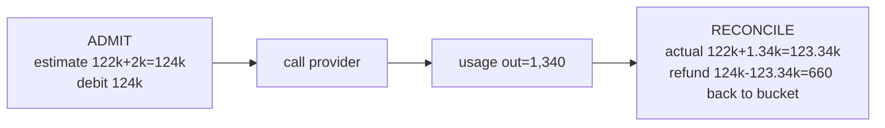

# Lecture 11: Token-Aware Rate Limiting and the Hard Spend Kill-Switch

> Every LLM gateway is one runaway loop away from a five-figure surprise on the monthly invoice. A client bug retries a 30k-token prompt in a tight loop; a single tenant scripts a batch job that hammers you at 400 requests a second; a prompt-injection turns your agent into an infinite self-conversation. The naive defense — "100 requests per minute" — does *nothing* against any of these, because in LLM land the unit of cost is not the request, it's the **token**, and one request can carry 100,000 of them. This lecture builds the two governors every serious gateway needs: a **token-aware rate limiter** (a per-tenant Redis token bucket that throttles *token throughput*, returning 429 when a tenant is going too fast) and a **hard monthly spend kill-switch** (a per-tenant spend ledger with a cap that returns 402 and flips a flag when the money runs out). After this you will be able to pick the right limiting algorithm, key it per tenant so one abuser can't starve everyone else, reconcile the fact that you don't know the output-token count until *after* the call, and explain to anyone why 429 and 402 are two different answers to two different questions.

**Prerequisites:** Lecture 3 (Redis as the hot counter store), Lecture 6 (the gateway sits in front of all providers), Lecture 10 (cache — limits and cache share the request path), basic HTTP status codes, arithmetic and simple rates · **Reading time:** ~30 min · **Part of:** Phase 09 — AI Application Architecture & System Design, Week 2

---

## The core idea (plain language)

Your gateway is a shared resource in front of a metered, expensive backend. Two things can go wrong with a shared metered resource, and they are genuinely different problems:

1. **Rate** — someone is consuming *too fast*. Not necessarily too much in total, just faster than their fair share right now. This is a *flow* problem, measured in tokens-per-minute. The fix is **backpressure**: slow them down, tell them to retry shortly. HTTP **429 Too Many Requests**.
2. **Budget** — someone has consumed *too much in total* this billing period. They may be going slowly and politely, but they've spent their allotted $500 for the month and the 501st dollar is not authorized. This is a *stock* problem, measured in dollars accumulated. The fix is a **hard stop**: refuse until the period rolls over or someone raises the cap. HTTP **402 Payment Required**.

The single most important mistake this lecture exists to kill is **limiting by request count**. A limit of "100 requests/minute" treats a 200-token autocomplete and a 128k-token document analysis as identical units. They are not: the second costs ~640× more and takes ~640× the provider capacity. A tenant who sends one hundred 100k-token requests in a minute is inside your "100 req/min" limit and has just consumed **10 million tokens** — enough to blow your provider's TPM quota and a chunk of the monthly budget in sixty seconds. Request-count limiting is measuring the wrong thing. **You must limit tokens.**

The second most important idea is **per-tenant, not global**. A global token bucket protects your *provider quota* but provides zero *fairness*: one abusive tenant drains the shared bucket and every other tenant gets 429s for a burst they didn't cause. Fairness is a per-tenant property — each tenant gets its own bucket, its own ledger, its own cap — and it is exactly the property Week 3's load test proves: hammer tenant A into throttling while tenant B sails through healthy.

---

## How it actually works (mechanism, from first principles)

### Why request-count limiting is wrong (the arithmetic)

Take the number the spine warns about. Your policy is "100 requests/minute per tenant." Two tenants:

- **Tenant A** — an autocomplete feature: ~150 input + 50 output = **200 tokens/request**. At 100 req/min that's **20,000 tokens/min**.
- **Tenant B** — a "summarize this contract" feature: ~120,000 input + 2,000 output = **122,000 tokens/request**. At 100 req/min that's **12,200,000 tokens/min**.

Same request-rate limit, a **610× difference** in what actually hits the provider and the bill. If your provider gives you 2,000,000 TPM, Tenant B blows through it at request #17 of the minute while sitting comfortably inside "100 req/min." The limiter reports "all good, 83 requests to spare" while the provider is returning 429s to *you*. Request counting measures a proxy for load that is uncorrelated with load. The only unit that tracks provider cost, provider capacity, and your dollars is the **token**.

### The three classic algorithms

All rate limiting answers one question: *given past traffic, is this request allowed right now?* Three standard mechanisms, in increasing quality:

**1. Fixed window.** Divide time into fixed buckets (e.g. each clock-minute). Keep a counter per window; increment on each request (or by token count); reject when it exceeds the limit; the counter resets to zero at the window boundary.

```
minute 12:00:00–12:00:59   tokens used: [============      ] 1.2M / 2M
minute 12:01:00–12:01:59   tokens used: [                  ] 0   / 2M   <- hard reset
```

Dead simple (`INCRBY` + `EXPIRE` in Redis), but it has the **boundary burst** flaw: a tenant can spend the full 2M in the last second of 12:00 and another full 2M in the first second of 12:01 — **4M tokens in ~2 seconds**, double the intended rate, because the window reset is a cliff.

**2. Sliding window.** Fix the burst flaw by making the window *move* with the current time. The precise form (a sorted set of timestamps, sum over the trailing 60s) is exact but stores every event. The common approximation is the **sliding-window counter**: blend the current and previous fixed windows by how far you are into the current one.

```
estimate = current_window_count
         + previous_window_count * (fraction of window still "in view")
```

If at 12:00:15 (25% into the current minute) the previous minute used 2M and the current used 0.5M, the estimate is `0.5M + 2M * 0.75 = 2.0M` — so you correctly throttle instead of letting the boundary burst through. Cheap, smooth, good enough for most gateways. It smooths *rate* but doesn't naturally model *bursts you want to allow*.

**3. Token bucket.** The one you'll actually deploy. Model the allowance as a **bucket of capacity `C` tokens that refills at a steady rate `r` tokens per second**. Every request tries to *remove* its token cost from the bucket; if enough is present, it's allowed and the amount is deducted; if not, it's rejected (429). The bucket never exceeds `C`.

```
              refill at r tokens/sec (up to capacity C)
                        |
                        v
        ┌───────────────────────────────┐
        │  bucket:  850,000 / 1,000,000  │  <- current allowance
        └───────────────────────────────┘
                        |
   request wants 122,000 tokens -> 850k >= 122k -> ALLOW, bucket = 728,000
   request wants 122,000 tokens -> 728k ... allow ... draining
   request wants 122,000 tokens -> 40,000 left  -> 40k < 122k -> REJECT 429
```

Why the token bucket wins for LLM traffic:

- **It's naturally token-denominated.** The "tokens" in the bucket *are* LLM tokens. A big request removes a lot; a small one removes a little. This is the whole point.
- **It allows controlled bursts.** Capacity `C` is a burst budget. A tenant that's been quiet has a full bucket and can fire a burst up to `C`, then is limited to the sustained refill rate `r`. Real traffic is bursty (a user opens a page, five calls fire at once); the bucket absorbs that without punishing it, while still capping the *sustained* rate. Fixed/sliding windows don't separate "burst" from "sustained."
- **Two independent knobs.** `r` sets the *long-run* rate (tokens/minute the tenant is entitled to); `C` sets how much *slack* they can bank. Tune them separately.

The refill is **lazy** — you don't run a timer. You store `(tokens_remaining, last_refill_timestamp)` and, on each request, compute how much has refilled since you last looked:

```
now       = current time (seconds)
elapsed   = now - last_refill_ts
refilled  = min(C, tokens_remaining + elapsed * r)
```

Then check `refilled >= cost`. If yes: `tokens = refilled - cost`; if no: reject and tell them how long until enough refills (`(cost - refilled) / r` seconds → `Retry-After`).

### Keying the bucket per tenant (in Redis)

The bucket lives in Redis because it must be shared across all your gateway instances — three FastAPI workers behind a load balancer must debit the *same* bucket, or each enforces 1/3 of the limit and the tenant gets 3× their share. The key is the tenant:

```
ratelimit:tokens:{tenant_id}   -> hash { tokens, ts }
```

Because check-and-deduct must be **atomic** (two concurrent requests must not both see 850k and both deduct 122k from it — a classic read-modify-write race that lets a tenant overspend), you do it in a single Redis round trip with a Lua script or `MULTI/EXEC`. A minimal Lua token bucket:

```lua
-- KEYS[1] = ratelimit:tokens:{tenant}
-- ARGV = capacity, refill_rate_per_sec, now, cost
local b = redis.call('HMGET', KEYS[1], 'tokens', 'ts')
local tokens = tonumber(b[1]) or tonumber(ARGV[1])   -- start full
local ts     = tonumber(b[2]) or tonumber(ARGV[3])
local cap, rate, now, cost = tonumber(ARGV[1]), tonumber(ARGV[2]),
                             tonumber(ARGV[3]), tonumber(ARGV[4])
tokens = math.min(cap, tokens + (now - ts) * rate)   -- lazy refill
local allowed = tokens >= cost
if allowed then tokens = tokens - cost end
redis.call('HMSET', KEYS[1], 'tokens', tokens, 'ts', now)
redis.call('EXPIRE', KEYS[1], 3600)                  -- idle keys self-clean
return { allowed and 1 or 0, tokens }
```

Atomicity is not optional: without it, concurrency *is* a limit-bypass vulnerability.

### The chicken-and-egg problem: you don't know the cost yet

Here is the mechanism unique to LLMs and the part engineers get wrong. To debit the bucket *before* the call you need the token cost. But **the output token count doesn't exist until the call is done** — the model decides how much to generate. You can count input tokens exactly (tokenize the prompt), but output is unknown at admission time.

The resolution is **pre-charge estimation + post-charge reconciliation**, a two-phase debit:

1. **Pre-charge (admission).** Before the call, estimate: `cost_est = input_tokens_exact + max_output_estimate`. Use the request's `max_tokens` cap as the output estimate (it's the ceiling the model literally cannot exceed), or a historical average per route if `max_tokens` is huge/unset. Debit `cost_est` from the bucket. If the bucket can't cover it, reject 429 *before* spending a cent. This is conservative on purpose: you'd rather occasionally throttle slightly early than admit a request you can't afford.
2. **Post-charge (reconciliation).** After the call, you get the provider's `usage` block with the *actual* `completion_tokens`. Compute `cost_actual = input_tokens + output_tokens`. Reconcile the difference: `refund = cost_est - cost_actual` back into the bucket (usually a small positive — you over-estimated output). If `cost_actual > cost_est` (model hit the cap and you under-estimated — rare if you used `max_tokens`), debit the extra.



The same two-phase discipline applies to the **spend ledger** below — estimate to admit, reconcile to bill. The ledger is where dollars accumulate; the bucket is where throughput is metered. Both need the real usage number, and both get it from the provider's response.

### The monthly spend ledger and the hard kill-switch

The rate limiter answers "too fast right now?" The kill-switch answers "too much this month?" It needs a running total of dollars per tenant per billing period.

**Price config table** — never hard-code prices; models and prices change monthly:

```
model                 input_per_1k   output_per_1k
gpt-4o                0.0025         0.010
claude-sonnet         0.003          0.015
claude-haiku          0.00080        0.004
gpt-4o-mini           0.00015        0.0006
ollama/llama3.1       0.0            0.0        <- local, free
```

(Illustrative rates — always read live pricing from the provider; treat any number in a lecture as approximate.)

**Cost of one call** (arithmetic, nothing more):

```
cost = (input_tokens  / 1000) * input_price
     + (output_tokens / 1000) * output_price
```

Example, Claude Sonnet, 120,000 in + 1,340 out:
`= (120000/1000)*0.003 + (1340/1000)*0.015 = 120*0.003 + 1.34*0.015 = 0.360 + 0.0201 = $0.3801`.

**The ledger** — a Postgres row per (tenant, month) is the durable source of truth; a Redis mirror (`spend:{tenant}:{yyyymm}`) is the hot counter you read on the request path so you're not hitting Postgres every call. Postgres is authoritative (survives restarts, is auditable); Redis is the fast cache you reconcile back to Postgres.

```
spend_ledger(tenant_id, period='2026-07', spent_usd, cap_usd, killed bool)
```

**The kill-switch flow:**

```
on request:
  read spent, cap, killed  for (tenant, this month)
  if killed:                      -> 402 immediately (fast path, no estimation)
  est_cost = price(model, input_exact + max_output_est)
  if spent + est_cost > cap:      -> 402  AND set killed = true   (flip the flag)
  ... admit, call provider ...
  actual_cost = price(model, input, output_actual)
  spent += actual_cost            (reconcile: add the real number)
  if spent >= cap: set killed = true
```

Two design choices matter:

- **The flag (`killed`) is the point.** Once flipped, subsequent requests short-circuit to 402 *without* estimating or calling anything — the cheapest possible rejection. You don't want to re-run the cap arithmetic (or worse, a partial call) thousands of times a minute once a tenant is over. The flag turns "over budget" into an O(1) lookup. It resets when the billing period rolls (a scheduled job zeroes `spent` and clears `killed` for the new month) or when a human raises `cap_usd`.
- **Hard vs soft.** A *hard* kill-switch refuses (402). A *soft* one warns (email at 80%, 90%) but keeps serving. Production wants both: soft alerts on the way up so nobody is surprised, hard stop at 100% so a runaway loop can't run past the cap. The kill-switch is your circuit breaker for *money*.

### How limits interact with the cheap-first cascade

The cascade (routing lecture) sends a request to a cheap model first, escalating to an expensive one only if a validation/confidence check fails. This interacts with both governors, and the ordering matters:

- **Estimate against the tier you're about to call.** When you pre-charge for the cheap tier, use the cheap tier's price and token profile. If you escalate, that's a *second* debit against the strong tier's cost — reconcile each hop. A request that runs cheap→strong pays for both prefills; the ledger must reflect both.
- **The cascade is a cost *reducer*, so it moves the cap math.** If 70% of traffic is satisfied by a model that's ~15× cheaper, your effective blended price drops sharply, and a fixed monthly cap buys far more requests. When you set caps, set them against the *blended* expected cost, not the worst-case all-strong cost, or you'll cap tenants far below what they actually use.
- **Rate-limit at the gateway edge, once, in tokens** — before the cascade decides anything — for the *admission* decision, then reconcile per hop. Don't run a separate bucket per tier; run one token bucket per tenant and debit it for whatever tokens actually flow, cheap or strong.

---

## Worked example

**Setup.** Tenant `acme`. Token bucket: capacity `C = 500,000` tokens, refill `r = 200,000 tokens/min` (≈3,333/sec). Monthly cap `$50.00`, currently `spent = $49.60`. Model = Claude Sonnet (`0.003` in / `0.015` out per 1k). Bucket currently full (acme has been idle).

**Request 1** — a 120k-input document summary, `max_tokens = 2000`.

- Pre-charge estimate: `120,000 + 2,000 = 122,000` tokens. Bucket has 500k ≥ 122k → **admit**, bucket → `378,000`.
- Spend estimate: `(120000/1000)*0.003 + (2000/1000)*0.015 = 0.360 + 0.030 = $0.390`. `spent + est = 49.60 + 0.39 = $49.99 ≤ 50.00` → **admit** (barely).
- Call returns `output = 1,340`. Reconcile bucket: actual 121,340, refund `660` → bucket `378,660`. Reconcile spend: actual `0.360 + 0.0201 = $0.3801`, so `spent = 49.60 + 0.3801 = $49.9801`.

**Request 2** — arrives 3 seconds later, another 120k summary.

- Refill in 3s: `3 * 3,333 ≈ 10,000`; bucket `≈388,660`. Estimate 122k ≤ 388k → **rate: admit**.
- Spend: `49.9801 + 0.390 (est) = $50.37 > $50.00` → **402 Payment Required, set `killed = true`.** The request is refused *for budget*, even though the rate limiter would have allowed it. Two governors, two verdicts — budget wins.

**Request 3** — arrives immediately after.

- `killed` is true → **402 on the fast path**, no estimation, no bucket touch, no provider call. O(1) rejection until August rolls over or a human raises the cap.

**Meanwhile, tenant `globex`** has its own bucket and its own ledger row at `spent = $2.10 / cap $50`. `acme` being killed and throttled has **zero effect** on `globex` — different keys, different buckets. That is the fairness property, made mechanical: isolation by key.

**Now the abuse scenario** (Week 3's load test). `acme` scripts 400 req/sec of 120k-token requests. Per second that's `400 * 122,000 = 48.8M` tokens of *demand* against a bucket refilling at 3,333/sec. The bucket drains in well under a second; from then on nearly every `acme` request gets **429** (bucket empty) — and once the ledger crosses $50, **402** (killed). `globex`, on its own bucket, never sees a 429 and its p95 latency stays flat. One abusive tenant throttled, another healthy: the guarantee the load test is designed to prove.

---

## How it shows up in production

- **The invoice is the alarm.** Without a kill-switch, the first signal of a runaway is the bill, weeks later. With it, the tenant hits 402 in minutes and you get a "cap reached" alert. This single feature is the difference between a $50 overrun and a $50,000 one.
- **429 with `Retry-After` shapes client behavior.** Return `Retry-After: <seconds>` computed from the refill deficit. Well-behaved clients back off; without it they hot-loop and make the burst worse. A 429 without guidance is a 429 that gets retried instantly.
- **Provider TPM is the *upstream* wall your bucket protects.** Your per-tenant buckets exist partly so the *sum* of tenant traffic stays under the provider's account-level TPM/RPM. Size the buckets so `sum(r_tenant)` plus headroom ≤ provider TPM, or you'll enforce fairness among tenants and still get 429'd by the provider as a whole. (Capacity math for this is the Week 3 lecture.)
- **Reconciliation drift.** If you only ever pre-charge and never reconcile, the ledger slowly diverges from reality — you over-bill (never refunding the output over-estimate) and under-use the bucket. Over a month that's a real accuracy gap. The reconcile step is not optional bookkeeping; it's what keeps the numbers true.
- **Cold-start fairness.** A brand-new tenant with no ledger row: default them to a conservative cap, not "unlimited until the row exists." The missing-row case is the one an attacker probes first.
- **The kill-switch flag must be *durable*.** If `killed` lives only in Redis and Redis restarts, an over-budget tenant is suddenly un-killed. Postgres is the source of truth; Redis is the fast mirror; on a Redis miss, re-derive from Postgres.

---

## Common misconceptions & failure modes

- **"429 and 402 are basically the same."** No. **429 = slow down, come back in seconds** (transient, self-healing on refill). **402 = you're out of money, don't come back until the cap changes** (sticky, needs human/period action). A client that treats 402 like 429 will hammer you forever; one that treats 429 like 402 will give up on a request it could have made a second later. Different status, different `Retry-After` (429 has one; 402 does not).
- **"Limit requests, it's simpler."** The whole first section. One 100k-token request = 500 autocompletes. Request counting is blind to the only dimension that costs money.
- **"One global limiter is fine."** A global bucket has no fairness: one tenant drains it and everyone eats 429s. Fairness *requires* per-tenant keys. Global limits still have a place — protecting the provider TPM ceiling — but they sit *above* the per-tenant buckets, not instead of them.
- **"Pre-charge the exact cost."** You *can't* — output tokens don't exist until after the call. Estimate high (use `max_tokens`), then reconcile. Anyone claiming exact pre-charge is either ignoring output or has already made the call.
- **Read-modify-write races.** Checking the bucket and deducting in two round trips lets two concurrent requests both pass on the same allowance. Use Lua/`MULTI` — atomic check-and-debit. This is a genuine bypass, not a rounding error.
- **Resetting the ledger on deploy.** If "current spend" is derived from an in-memory counter that resets when the app restarts, a tenant near the cap gets a fresh $0 every deploy. The period total must be persisted and keyed by billing period, not process lifetime.
- **`Retry-After` computed wrong or absent.** Guessing "retry in 60s" when the bucket refills enough in 4s wastes capacity; omitting it entirely invites hot-loops. Compute it from `(cost - available) / r`.
- **Estimating output as zero.** Debiting only input tokens means a request that generates 4k output slips through a bucket that had room for input only — you admit calls you can't afford and reconcile into a negative bucket. Always reserve for output.

---

## Rules of thumb / cheat sheet

- **Limit tokens, never request count.** The unit of cost is the token.
- **Per-tenant everything** — bucket, ledger, cap, kill-flag. Global limits only for the provider-TPM ceiling, layered above.
- **Default algorithm: Redis token bucket, keyed by `tenant_id`, atomic (Lua).** `r` = sustained tokens/min entitlement; `C` = burst allowance (start `C ≈ 2–3 × per-minute r` unless you have a reason).
- **Two-phase cost:** pre-charge `input_exact + max_tokens` (estimate high) → call → reconcile with real `usage`. Refund the difference to both bucket and ledger.
- **429 = rate** (transient; include `Retry-After`). **402 = budget** (sticky; flip `killed`; no `Retry-After`).
- **Kill-switch = a persisted flag.** Once over cap, short-circuit to 402 in O(1). Reset on period rollover or manual cap raise.
- **Prices live in a config table**, never in code. Read live provider pricing; treat any hard-coded number as stale.
- **Soft alert at 80/90%, hard stop at 100%.** Nobody should be surprised by a 402.
- **Size `sum(tenant r)` + headroom ≤ provider TPM.** Fairness among tenants doesn't help if the whole account is over the provider's ceiling.
- **Ledger source of truth = Postgres; hot counter = Redis;** reconcile Redis→Postgres, re-derive on Redis miss.

---

## Connect to the lab

This is Week 2, Lab step 6 (`app/limits.py`). Build the Redis token bucket keyed by `tenant_id` refilling at a tokens/min rate that returns **429** when empty, and the monthly `spend_ledger` (input+output tokens × per-model price from a config table) with a **hard cap that returns 402 and flips a kill-switch flag** when crossed. Your tests are `test_rate_limit_fairness.py` (burst from one tenant → 429 while a second tenant is unaffected) and `test_spend_killswitch.py` (cross a small test cap → 402 with a ledger explanation). Week 3's `load/locustfile.py` then *proves the fairness guarantee at scale* — abusive vs normal tenant on the dashboard.

---

## Going deeper (optional)

- **Redis rate-limiting patterns** — the official Redis docs and Redis University material cover fixed/sliding window and token bucket with `INCR`/`EXPIRE` and Lua. Root domain: `redis.io/docs`. Search: *"Redis rate limiting patterns token bucket Lua"*.
- **Stripe's rate-limiter design** — the canonical engineering writeup on token buckets and multiple limiter tiers in production. Search: *"Stripe scaling your API with rate limiters"* (Stripe engineering blog).
- **Cloudflare / sliding-window-counter approximation** — the widely-cited approach to smoothing the fixed-window boundary burst. Search: *"Cloudflare sliding window rate limiting"*.
- **LiteLLM budgets & rate limits** — how the gateway you're likely wrapping does per-key/per-tenant budgets, TPM/RPM limits, and max-budget kill behavior. Root domain: `docs.litellm.ai`. Search: *"LiteLLM proxy budget rate limit per key"*.
- **Provider pricing & token counting** — always the source of truth for the config table. Anthropic: `docs.anthropic.com` (token-counting endpoint + pricing). OpenAI: `platform.openai.com/docs`. Search: *"Anthropic token counting API"*, *"OpenAI rate limits TPM RPM"*.
- **HTTP semantics** — RFC 9110 for the precise meaning of 429 and 402 (402 is reserved/experimental but conventionally used for budget). Search: *"RFC 9110 402 429 status codes"*.

---

## Check yourself

1. Your gateway enforces "100 requests/minute/tenant." A tenant sends one hundred 100k-token requests in a minute and stays "within limit." Roughly how many tokens did they consume, and what did the limit actually protect?
2. Why can't you debit the *exact* cost of an LLM call from the token bucket before making the call, and what is the two-step scheme that resolves it?
3. A client gets a 429, waits, retries, succeeds; another gets a 402 and retries in a loop forever. Which client is behaving correctly, and what's the semantic difference between the two codes?
4. Explain why the kill-switch is a persisted *flag* and not just a "recompute spent vs cap on every request" check. What does the flag buy you once a tenant is over budget?
5. You run one global token bucket instead of per-tenant buckets. Describe the exact failure that shows up in Week 3's load test.
6. Two concurrent requests from the same tenant both read a bucket balance of 122,000 and both need 122,000 tokens. Without a mitigation, what happens, and what's the fix?

### Answer key

1. `100 × 100,000 = 10,000,000` tokens — ten million, in a minute. The "100 req/min" limit protected *nothing* relevant: it capped request *count* while the tenant blew through your provider's TPM quota and a large slice of the monthly budget. The lesson: the unit of cost is the token, so limit tokens, not requests.
2. Because **output token count doesn't exist until after the model generates** — the model decides how long its answer is. Scheme: **pre-charge** an estimate (`input_tokens_exact + max_tokens` as the output ceiling) to admit or 429; then **reconcile** after the call using the provider's real `usage`, refunding the over-estimate (or debiting an under-estimate) to both the bucket and the ledger.
3. The **429 client is correct** — 429 means "too fast, transient, retry after a short backoff," and the bucket refills, so the retry succeeds. The **402 client is wrong** — 402 means "out of budget, sticky," which won't clear until the billing period rolls over or a human raises the cap; retrying in a loop just burns cycles. 429 = *rate* (self-healing, include `Retry-After`); 402 = *budget* (needs external action, no `Retry-After`).
4. Once a tenant crosses the cap you'll get thousands more requests before the period rolls; recomputing `spent + est vs cap` (and possibly re-estimating tokens) on each is wasted work. The persisted `killed` flag turns "over budget" into an **O(1) lookup that short-circuits to 402** with no estimation and no provider call. Persisted (in Postgres, mirrored in Redis) so a restart can't accidentally un-kill an over-budget tenant. It resets on period rollover or a manual cap raise.
5. A **global bucket has no fairness**: the abusive tenant drains the shared allowance, and *every* tenant — including the well-behaved one — starts getting 429s. The load test's whole point ("one tenant can't starve another") fails: the normal tenant's p95 spikes because it's being throttled for traffic it never sent. Fairness requires per-tenant keys.
6. Both requests pass the check and both deduct 122,000 — a read-modify-write race that lets the tenant spend **244,000** against a 122,000 allowance, driving the bucket negative and **bypassing the limit**. Fix: make check-and-debit **atomic** — a single Redis Lua script (or `MULTI/EXEC`) so the second request sees the first's deduction before deciding.
