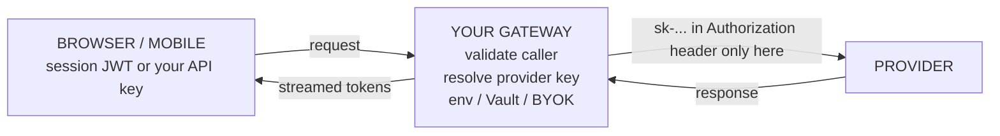
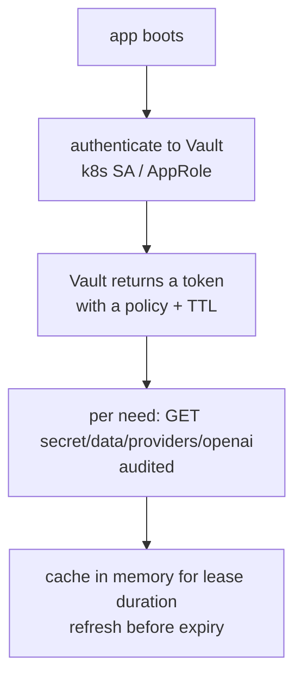
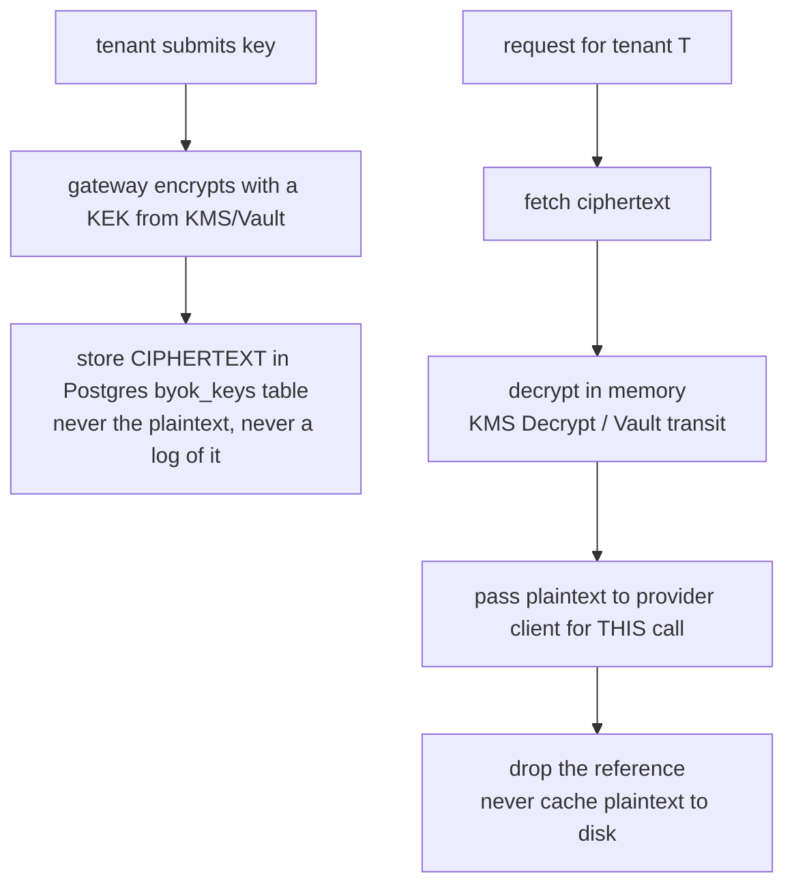
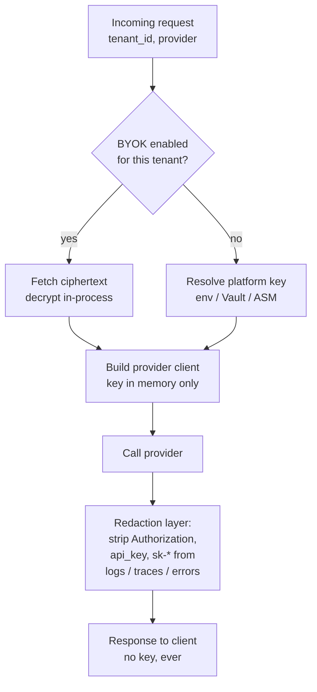

# Lecture 12: Secrets, Provider Keys, and Per-Tenant BYOK

> A support engineer pastes a customer's failing request into a ticket. Buried in the copied stack trace is `Authorization: Bearer sk-proj-9f2a...`. That key now lives in Zendesk, in the email that mirrored the ticket, in the Slack channel where someone linked it, and in your log aggregator's 90-day retention. Within an hour a bot scraping public paste sites (they scrape private ones too, via leaked tokens) is burning $40/minute against your account on a crypto-mining prompt farm. Nobody *decided* to leak the key. The architecture leaked it, because the key was allowed to exist somewhere a human or a log could copy it. This lecture is about the one rule that prevents this — *a provider key never appears client-side, in a response body, or in a log line* — and everything that rule forces you to build: server-side key resolution from env/Vault/Secrets Manager, rotation without downtime, least-privilege scoping, and per-tenant BYOK. After this you'll be able to design the secret-resolution seam in a gateway, decide platform-key vs tenant-key per request, redact keys from traces and errors, and — the part that separates it from hand-waving — write a test that greps your own logs and responses to *prove* no key leaked.

**Prerequisites:** the gateway/router pattern (Lecture 8), multi-tenancy and tenant-keyed caching (Lecture 10), structured logging/tracing basics, comfort with env vars and HTTP headers · **Reading time:** ~30 min · **Part of:** Phase 09 — Architecture & System Design, Week 2

---

## The core idea (plain language)

A provider key (`sk-...`, an AWS access key, a Vertex service-account JSON) is a **bearer credential**: whoever holds the bytes can spend your money and read your data. There is no second factor, no "but they're not logged in" — the string *is* the authorization. That single fact drives every decision in this lecture.

So the whole discipline reduces to one sentence:

> **The key exists in exactly two kinds of places: a secrets store (at rest, encrypted, access-controlled) and process memory during the milliseconds of an outbound call. Everywhere else — client bundles, response bodies, logs, traces, error messages, tickets, screenshots — it must be impossible for the key to appear.**

Notice the word *impossible*, not *discouraged*. "We told people not to log the key" is not a control; it's a wish. The control is a redaction layer the key physically cannot get past, plus a test that fails your CI if a key ever shows up in a log or response. You engineer the *absence* of the key the same way you engineer the presence of a feature.

There are two flavors of key in a multi-tenant gateway, and confusing them is a real bug:

- **Platform key** — *your* provider account. You pay, you own the rate limits, you eat the cost. Used for tenants who don't bring their own.
- **Tenant BYOK (bring-your-own-key)** — the *tenant's* provider account. They supply their key; their calls bill *them*; their data flows through *their* provider contract. You store it encrypted, decrypt it only in-process for their requests, and never log it.

The gateway has a **secret-resolution seam**: for every request it must decide *which key to use* — platform or this tenant's BYOK — resolve it from the right store, use it, and drop it. Get that seam right and BYOK, rotation, cost attribution, and data residency all fall out of it. Get it wrong and you cross-bill tenants or leak one tenant's key into another's trace.

---

## How it actually works (mechanism, from first principles)

### The threat model, concretely

Before mechanisms, name what you're defending against. A key leaks through one of these channels, roughly in order of how often it actually happens:

1. **Logs and traces** — someone logs the whole request/headers/config object "for debugging." #1 by a mile.
2. **Error messages** — an exception stringifies the client object, which holds the key; the 500 body or the stack trace carries it out.
3. **Client-side exposure** — the key is shipped in a mobile app binary, a SPA bundle, or returned to the browser "so the frontend can call the provider directly." Fatal and common in prototypes.
4. **Over-broad access** — the key can do far more than the app needs (admin scope, all models, billing), so a small leak becomes a large blast radius.
5. **Long-lived static keys** — a key from 2023 that nobody rotated; when it leaks you don't even know when it was compromised.

Each mechanism below kills one or more of these channels.

### Step 1 — Never client-side (the non-negotiable)

If your architecture ever needs the browser or mobile app to hold the provider key, the architecture is wrong. The client talks to *your* gateway with *your* session token (a short-lived JWT, an API key you issued and can revoke); the gateway holds the provider key and makes the upstream call server-to-server.



Why absolute: a key in a client is *published*. Decompile the APK, open devtools, read the JS bundle — it's right there, and you cannot rotate fast enough to matter. The only safe place for the provider key is behind a trust boundary the client never crosses.

### Step 2 — Resolve the key server-side, from a real store

Three tiers, in increasing order of operational maturity:

**Environment variables** — the key is injected into the process env at deploy (from a `.env` never committed, or a CI secret). Fine for a single-service app or local dev. Weaknesses: env is visible to anything that can read `/proc/<pid>/environ` or a crash dump; rotation means a redeploy; no audit of *who read the secret when*.

**HashiCorp Vault** — the app authenticates to Vault (via a Kubernetes service-account token, AppRole, or cloud IAM), then *reads* the secret at runtime over an authenticated, TLS'd API. Vault gives you: a full **audit log** of every secret read, **dynamic/leased secrets** (short-TTL credentials Vault mints and auto-revokes), and centralized rotation. The app never has the key on disk.



**Cloud Secrets Manager** (AWS Secrets Manager, GCP Secret Manager, Azure Key Vault) — the same idea, managed by your cloud, with IAM as the access-control layer and built-in rotation hooks (e.g. AWS Secrets Manager can invoke a Lambda to rotate on a schedule). Less flexible than Vault for dynamic secrets across many backends, but zero servers to run and it's already wired into your IAM.

The resolution code should be one function with a clean seam, so the *source* is swappable and testable:

```python
# secrets.py — one resolver, source behind an interface
class SecretsBackend(Protocol):
    async def get(self, name: str) -> str: ...

async def provider_key(tenant_id: str, provider: str) -> str:
    # 1. tenant BYOK takes precedence if present and enabled
    byok = await tenant_byok(tenant_id, provider)   # decrypts in-process
    if byok:
        return byok
    # 2. otherwise the platform key from the configured backend
    return await backend.get(f"providers/{provider}")   # env | vault | asm
```

Two rules for this function: it returns the key **only as an in-memory value passed straight into the provider client**, and it is **the only place** keys enter the process. If keys are fetched in five places you have five places to leak.

### Step 3 — Rotation without downtime

Keys must rotate: on a schedule (least-privilege hygiene), and *immediately* on suspected compromise. The failure mode to avoid is a rotation that breaks live traffic because there's a window where the old key is revoked but the new one isn't deployed yet.

The pattern is **overlap, then retire** — support two valid keys at once:

```
  t0   only KEY_A valid                       app uses KEY_A
  t1   create KEY_B at provider (both valid)  app still uses KEY_A
  t2   deploy: app prefers KEY_B, KEY_A fallback   ← zero-downtime window
  t3   confirm 0 traffic on KEY_A (metrics)   app uses KEY_B
  t4   revoke KEY_A at provider               done
```

The key insight: **provider APIs let multiple keys be valid simultaneously.** You create the new key while the old one still works, roll your fleet to the new one, verify no traffic uses the old one (watch per-key request metrics — this is why you tag which key served each request, *by key id, never by value*), then revoke. No request ever hits a moment where its key is invalid.

Vault and cloud Secrets Manager formalize this with versioned secrets and staged labels (AWS uses `AWSCURRENT` / `AWSPENDING` / `AWSPREVIOUS`). Your app reads the "current" alias; rotation promotes `PENDING`→`CURRENT` only after the new key is validated. If you cache resolved keys in memory (you should, to avoid a Vault round-trip per request), cache with a **short TTL (e.g. 300 s)** so a rotation propagates in minutes without a redeploy.

### Step 4 — Least-privilege scoping

A leaked key's blast radius = whatever that key is allowed to do. Shrink it:

- Use **provider-scoped/project keys** where offered (OpenAI project keys, Anthropic workspaces) so a key can hit only the models/endpoints one service needs, with its own spend limit.
- For cloud provider access (Bedrock/Vertex), use an **IAM role with a tight policy** (invoke *these* model ARNs only), not a root/admin key.
- Give each *service* its own key, not one shared key across the fleet — so you can revoke one without taking everything down, and per-key metrics tell you who leaked.
- Cap spend at the provider (per-key monthly limit) as a backstop *in addition to* your gateway kill-switch (Lecture 11). Defense in depth: your ledger might have a bug; the provider cap won't.

### Step 5 — Per-tenant BYOK: the encryption/access model

Tenants want BYOK for two concrete reasons, both of which you should be able to state to a customer:

1. **Data residency & contractual control.** An enterprise has its own zero-retention/DPA agreement with OpenAI/Anthropic and a specific data region. Routing their prompts through *their* key means the data flows under *their* provider contract and region, not yours — often a hard procurement requirement.
2. **Cost attribution.** Their LLM spend lands on *their* provider bill directly, transparent and audited by their finance team, instead of being repackaged inside your invoice. No markup argument, no reconciliation.

The storage model: **encrypt at rest, decrypt only in-process, per call.**



Use **envelope encryption**: a per-tenant (or per-secret) data key encrypts the BYOK value; a master key (KEK) in KMS/Vault encrypts the data key. You store the ciphertext + the wrapped data key; the KEK never leaves KMS. This means a Postgres dump alone is useless without KMS access — and KMS access is audited. (Vault's *transit* secrets engine does this for you: it encrypts/decrypts on demand and never gives you the key material.)

Access model rules:

- The plaintext BYOK value lives in memory *only* during the tenant's own request, and is **never** written to logs, traces, caches, or object storage.
- BYOK is strictly tenant-scoped: the resolver keys on `tenant_id`, and a test must prove tenant A's request can never resolve tenant B's key.
- Store metadata you *can* show (key id, last-4, provider, added-at, last-used) so the tenant can manage it — never the value.

### Step 6 — The secret-resolution seam and redaction

Every request flows through one decision point:



The **redaction layer** is not optional garnish — it's the enforcement of the core rule. Concretely:

- A structured-logging processor that **drops known secret fields** (`authorization`, `api_key`, `x-api-key`) and **regex-masks anything matching key shapes** (`sk-[A-Za-z0-9-]+`, AWS `AKIA…`, long base64 blobs) before the line is emitted.
- Exceptions from the provider SDK often stringify config objects that hold the key. **Never let a raw provider exception reach the client or the log verbatim** — catch, extract a safe message + status, and log *that*. Set the provider client to not echo the key in its `repr`.
- Traces (OpenTelemetry spans) must not attach headers or the resolved key as attributes. Allowlist span attributes; never dump the whole request.

Then the proof: a test that runs a real request path and **greps captured logs and the response body** for key patterns, failing if any match. That test is your contract that the rule holds — and it keeps holding as the code changes.

---

## Worked example

A tenant, `acme`, is BYOK; a tenant, `beta`, uses the platform key. Trace one request each.

**Request 1 — `acme` (BYOK), model `gpt-4o`:**

1. Gateway authenticates the caller by *your* issued API key `ak_live_...` (revocable, yours). Never the provider key.
2. Resolver: `tenant_byok("acme", "openai")` → row exists. Fetch ciphertext `gAAAAAB...` from `byok_keys`.
3. Decrypt via KMS: `kms.decrypt(ciphertext) → "sk-acme-REAL"`. Held in a local variable for ~40 ms.
4. Build `AsyncOpenAI(api_key="sk-acme-REAL")`, call, stream tokens back.
5. Cost lands on **Acme's** OpenAI bill. Your spend ledger records tokens for *reporting*, but you don't bill them for API cost.
6. Log line emitted: `{"tenant":"acme","provider":"openai","key_id":"byok_acme_01","model":"gpt-4o","in_tok":812,"out_tok":240}`. **No `sk-`.** The `key_id` is a handle, not the secret.
7. Local variable goes out of scope; plaintext is gone.

**Request 2 — `beta` (platform), model `gpt-4o`:**

1. Same caller auth via your API key.
2. Resolver: no BYOK for `beta` → `backend.get("providers/openai")`. Backend is Vault; the resolved value is cached in-memory with a 300 s TTL, so this is a memory read, not a Vault round-trip.
3. Build client with the **platform** key, call.
4. Cost lands on **your** account; your ledger + kill-switch enforce Beta's monthly cap (Lecture 11) and you bill Beta per your pricing.
5. Log line carries `key_id":"platform_openai_v7"` — again a handle.

**Now a rotation, mid-day, on the platform key:**

- t0: `platform_openai_v7` is `AWSCURRENT`.
- t1: ops creates `v8` at OpenAI (both valid), writes it to Vault as a new version.
- t2: Vault promotes `v8`. Within ≤300 s every app instance's in-memory cache expires and re-reads → now serving `v8`. **Zero redeploys, zero dropped requests.**
- t3: per-key metrics show 0 requests on `v7` for 10 minutes.
- t4: ops revokes `v7` at OpenAI. If a leaked copy of `v7` existed, it's now dead.

Numbers that make the "why bother" concrete: an unscoped, un-rotated key leaked to a paste site has been observed to rack up **thousands of dollars in hours** before the provider's fraud detection or your billing alert catches it. A *scoped* key (one model, $50/mo provider cap) caps that at $50. A *rotated* key (compromised copy already dead) caps it at $0. Scoping and rotation are not hygiene theater; they are the difference between a $50 incident and a $20,000 one.

---

## How it shows up in production

- **The log-leak incident.** The single most common real event: someone adds `logger.info(f"calling with {config}")` where `config` holds the key, ships it, and now the key is in your log store with 90-day retention and read access for half the company. The fix is structural (redaction processor + grep test in CI), not a code-review reminder.
- **Rotation that pages you at 2 a.m.** A key gets revoked before the fleet rolls to the new one; every LLM request 401s; the whole product is down until someone redeploys. Overlap-then-retire + short-TTL in-memory cache is what turns this into a non-event.
- **Cross-billing a BYOK tenant.** A seam bug routes an `acme` request through the platform key: Acme's traffic hits *your* bill and *your* rate limits, and Acme's data flowed through the *wrong* provider contract — a data-residency violation, not just an accounting error. Test the seam per tenant.
- **The BYOK key that shows up in a trace.** You added OpenTelemetry, dumped request attributes to debug latency, and the tenant's `sk-` is now in your APM vendor's cloud — a third party, unencrypted, outside the tenant's DPA. This is exactly the privacy-boundary failure Week 3 formalizes.
- **Debugging blindness from over-redaction.** The opposite failure: you redact so aggressively you can't tell *which* key or provider a failing request used. The answer is handles — log `key_id`, `provider`, last-4 — never the value. You keep debuggability without keeping the secret.

## Common misconceptions & failure modes

- **"It's fine, the key's only in an internal log."** Internal logs get shipped to third-party aggregators, exported to data lakes, read by contractors, and included in support bundles. "Internal" is not a security boundary for a bearer token.
- **"We env-var the key, so we're good."** Env vars are a *source*, not a *control*. They're readable from crash dumps, `/proc`, and any child process; rotation means redeploy; there's no read-audit. Fine to start, but graduate to Vault/Secrets Manager as you scale or take enterprise customers.
- **"BYOK means we just pass the tenant's key through."** No — you *store* it, and storage is where the crypto and access model matter. Plaintext at rest in Postgres is the whole ballgame lost. Envelope-encrypt, decrypt only in-process.
- **"Redaction is a logging concern."** It's an *everything-outbound* concern: logs, traces, error responses, exception messages, metrics labels, and support exports. One un-redacted channel is a full leak.
- **"Prefix caching / prompt caching touches the key."** It doesn't — provider prompt caches key on prompt content, not your API key. But your *own* semantic cache must still never store the key, and (Lecture 10) must never cross tenant boundaries.
- **Assuming the grep test is redundant with code review.** Reviewers miss things; the test doesn't. The grep-the-logs-and-responses test is the only control that keeps holding as the codebase churns for months. It is required, not nice-to-have.

## Rules of thumb / cheat sheet

- **The one rule:** provider key never client-side, never in a response body, never in a log line. Enforce with a redaction layer + a grep test, not a policy doc.
- **Two places only:** secrets store (at rest, encrypted, audited) and process memory (during the call). Nowhere else.
- **Auth the caller with your credential, auth the provider with the provider's** — never hand the provider key to the client.
- **Resolve keys in exactly one function**; make the source (env/Vault/ASM) swappable behind an interface.
- **Rotate overlap-then-retire:** new key valid → roll fleet → verify 0 traffic on old → revoke. Cache resolved keys in-memory with a **300 s TTL** so rotation propagates without redeploy.
- **Least privilege:** per-service scoped keys, provider spend cap per key, tight IAM policies. Blast radius = key scope.
- **BYOK:** envelope-encrypt at rest (KEK in KMS/Vault), decrypt in-process per call, tenant-scoped resolver, store only handles (key_id, last-4, provider) for display.
- **Log handles, not values:** `key_id`, `provider`, last-4 — enough to debug, impossible to abuse.
- **Never let a raw provider exception reach a client or a log** — it may stringify the key. Catch, sanitize, re-log.
- Approximate, but directionally right: **scoped + rotated turns a five-figure leak into a two-figure (or zero) one.**

## Connect to the lab

This maps directly to `app/secrets.py` in the Week 2 gateway lab. Build the single `provider_key(tenant_id, provider)` resolver with env/Vault behind a swappable backend, add BYOK with envelope encryption in a `byok_keys` table, and wire the redaction processor into your logger and OTel spans. The Definition-of-Done line "No secret appears in any response body or log line (grep the logs in a test)" is the deliverable that matters most here — write `test_no_key_leak.py` first and let it drive the design: it fires a real BYOK request and a platform request, captures all logs and both response bodies, and asserts nothing matches `sk-`, `AKIA`, or your Authorization header shape.

## Going deeper (optional)

- **HashiCorp Vault docs** (vaultproject.io) — start with the KV v2 secrets engine, then the *transit* engine (encrypt/decrypt without exposing key material) and *dynamic secrets*. Search: "Vault transit secrets engine", "Vault dynamic secrets".
- **AWS Secrets Manager docs** (docs.aws.amazon.com) — rotation with Lambda, `AWSCURRENT`/`AWSPENDING` staging labels. Search: "AWS Secrets Manager rotate secret", "AWS KMS envelope encryption".
- **OpenAI project keys** and **Anthropic workspaces** — provider-native scoping and per-key spend limits. Search: "OpenAI project API keys", "Anthropic workspaces API keys".
- **OWASP** — "Secrets Management Cheat Sheet" and "Logging Cheat Sheet" (do-not-log lists) on cheatsheetseries.owasp.org.
- **git-secrets / trufflehog / gitleaks** — pre-commit scanners that stop keys reaching your repo in the first place; complements the runtime grep test. Search each name.
- **The 12-Factor App**, factor III (Config) — the canonical argument for keys-in-environment-not-code, and its limits. Search: "12 factor config".

## Check yourself

1. Why is "the key is only in an internal log" not an acceptable state, and what is the *structural* control that prevents it (versus a policy)?
2. Describe overlap-then-retire rotation. What provider capability makes zero-downtime rotation possible, and why do you cache resolved keys with a short TTL?
3. A tenant is BYOK. Walk the key's life for one of their requests — where it's stored, when it's decrypted, where it must *never* appear, and where the cost lands.
4. What is the secret-resolution seam, and name one bug that a wrong seam causes for a BYOK tenant.
5. You need to debug which key served a failing request without leaking the key. What do you log?
6. Give two concrete reasons an enterprise tenant demands BYOK, and connect each to a Week 3 privacy-boundary concern.

### Answer key

1. Internal logs get shipped to third-party aggregators, exported, read by many people, and bundled into support tickets — "internal" isn't a security boundary for a bearer token. The structural control is a redaction layer the key physically can't pass (drop known secret fields + regex-mask key shapes) *plus* a CI test that greps logs and responses for key patterns and fails the build. A policy ("please don't log keys") is a wish, not a control.
2. Create the new key at the provider while the old one is still valid (both work simultaneously — that's the enabling capability); deploy the fleet to prefer the new key; confirm via per-key metrics that no traffic hits the old key; then revoke the old key. No request ever meets a moment where its key is invalid. Short-TTL (≈300 s) in-memory caching of the resolved key lets a rotation in Vault/Secrets Manager propagate to every instance within minutes without a redeploy, while still avoiding a secrets-store round-trip on every request.
3. Stored: ciphertext in Postgres (envelope-encrypted, KEK in KMS/Vault) — never plaintext. Decrypted: in memory only, at request time, via KMS/Vault, held for the milliseconds of the outbound call, then dropped. Never appears: in logs, traces, error messages, caches, object storage, or any response. Cost: on the *tenant's* own provider bill (that's a primary reason they use BYOK); your ledger records tokens for reporting but you don't charge them for API cost.
4. The seam is the single per-request decision point that resolves *which* key to use — this tenant's BYOK if enabled, otherwise the platform key — and returns it only as an in-memory value. A wrong seam that routes a BYOK tenant through the platform key cross-bills them (their traffic hits your account and rate limits) and violates data residency (their data flowed through the wrong provider contract/region).
5. Log *handles*, never the value: the key id (`byok_acme_01` / `platform_openai_v7`), the provider, and optionally the last-4 of the key. That's enough to identify exactly which credential served the request while being useless to an attacker.
6. (a) Data residency / contractual control — their prompts flow under their own DPA/zero-retention terms and region, which Week 3's privacy boundaries formalize as "what leaves your VPC and under whose contract." (b) Cost attribution — spend lands directly on their provider bill. Both connect to Week 3's trust-boundary diagram: BYOK moves the provider trust boundary to the tenant's account, and the same discipline (don't leak the key into traces/logs shipped to third parties) is exactly the "redact before logs/traces" rule that privacy boundaries enforce.
