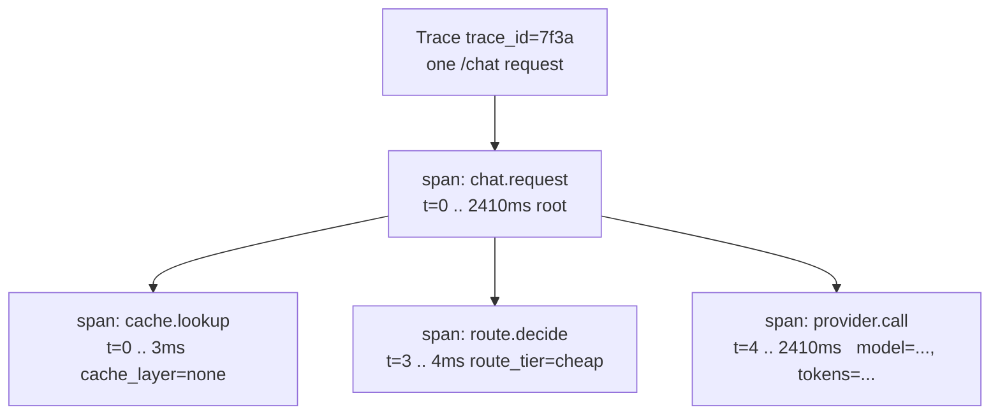
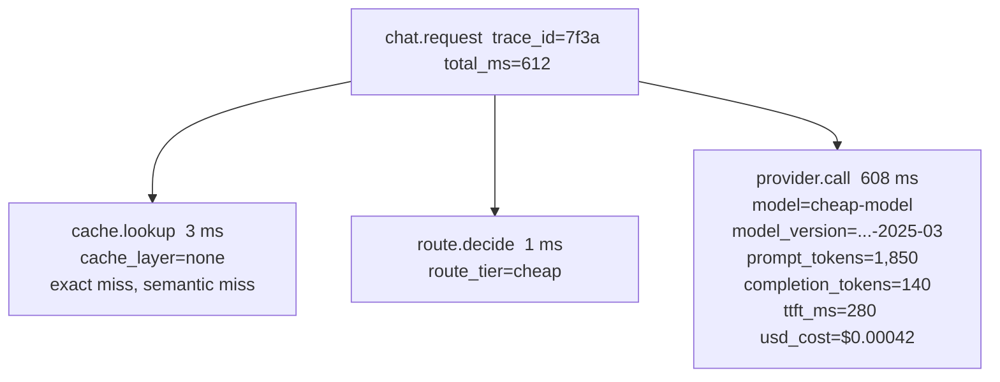

# Lecture 13: Designing for Evaluability — Tracing, Versioning, and the Feedback Flywheel

> You shipped a gateway that routes, caches, falls back, and streams. It works — until the day a tenant emails "the answers got worse this week" and your bill is up 30% with no idea why. Without instrumentation, that email is unanswerable: you can't see which request was slow, which model answered, what the *actual* prompt was, or whether a cache served a stale wrong answer. This lecture makes quality and cost **debuggable**. You will learn the exact attribute set every request trace MUST carry, how to wrap spans around each gateway step so one request yields one coherent trace with per-step timing, how to version prompts and models as first-class artifacts so a regression maps to a *specific change*, and how to capture user feedback linked to trace IDs so your system gets better from its own traffic. After this lecture you can instrument a gateway that answers "why is this slow / expensive / wrong?" in under a minute, and turn every thumbs-down into training signal.

**Prerequisites:** Week 2's gateway (routing, caching, fallback, streaming with TTFT); Phase 7's tracing/eval mindset (you know what a span and a golden set are); comfort with OpenTelemetry concepts (trace, span, attribute) at a beginner level; the redaction discipline from Week 1's GDPR work. · **Reading time:** ~32 min · **Part of:** AI Application Architecture & System Design — Week 3

## The core idea (plain language)

A normal web service is *observable* almost by accident: a 500 shows up in logs, a slow endpoint shows up in a latency histogram, and the request either worked or it didn't. LLM systems break that comfort in three ways:

1. **"Worked" is a spectrum, not a boolean.** A request can return HTTP 200 with a fluent, confident, *wrong* answer. Your existing monitoring is blind to it.
2. **The same input can cost 5× more one day than the next** — a cache miss, a fallback to a pricier provider, a longer retrieved context. Cost is per-request and variable, not a fixed capacity number.
3. **The thing that produced the output — the prompt — is assembled at runtime** from a template, retrieved chunks, conversation history, and tenant config. When quality regresses, the first question is "what exactly did we send the model?" and if you didn't record it, you're guessing.

**Evaluability** is the property that, for any request, you can reconstruct *what happened and why*: the resolved prompt, which model version answered, what it cost, how long each step took, whether a cache served it, which tier handled it, and — later — whether the user liked it. You design *for* this the way you design for testability: it's not a feature you bolt on after an incident, it's a shape you build into the gateway from the first span.

Three disciplines make it real, and this lecture is structured around them:

- **Tracing** — every request emits one trace, with one span per gateway step, carrying a fixed attribute set. This is *how you see* what happened.
- **Versioning** — prompt templates and model choices are stored artifacts with versions, and every trace is tagged with the versions it used. This is *how you attribute* a change to a cause.
- **Feedback capture** — thumbs, regenerate, and edits are linked back to trace IDs. This is *how you improve* — the data flywheel.

## How it actually works (mechanism, from first principles)

### A trace is a tree of spans; a span is a timed operation with attributes

OpenTelemetry (OTel) gives you three primitives you need here:

- **Trace** — the whole journey of one request, identified by a `trace_id` (a 128-bit value). Everything about one `/chat` call lives under one trace.
- **Span** — one unit of work within the trace: "cache lookup," "routing decision," "provider call." A span has a name, a start and end timestamp (so its duration is free), a parent span, and a bag of **attributes** (key/value pairs).
- **Attribute** — a typed key/value on a span. This is where `usd_cost`, `prompt_tokens`, `model` live.

Spans nest. The `/chat` request opens a **root span**; each gateway step opens a **child span** under it. Because each child records its own start/end, you get **per-step timing for free** — you can see that cache lookup took 3 ms, routing took 1 ms, and the provider call took 2,400 ms, all within one 2,410 ms request. That decomposition is the entire point: "the request was slow" becomes "the provider call was slow, and here's the model and token count that explain it."



One request → one coherent trace → per-step timing. If you send this to Langfuse or Phoenix, you get a flame-graph-like waterfall you can click into. If you don't want a backend yet, you emit the same structure as one structured-JSON log line per span (or one fat line per request with a nested object) — the *data model* is what matters, not the viewer.

### The attribute set every request trace MUST carry

This is the load-bearing list. OTel's **GenAI semantic conventions** standardize names for many of these (under the `gen_ai.*` namespace — e.g. `gen_ai.request.model`, `gen_ai.usage.input_tokens`, `gen_ai.usage.output_tokens`). Use the standard names where they exist so your traces are portable across Langfuse/Phoenix/Datadog; add your gateway-specific ones (cost, cache layer, tier, tenant) as your own keys. The *semantics* below are non-negotiable regardless of the exact key string:

| Attribute | Type | Why it's mandatory / what it debugs |
|---|---|---|
| **resolved/rendered prompt** | string (redacted) | The *actual* text sent to the model after template + retrieval + history were assembled. Without it you cannot reproduce a bad answer. Redact PII first (see below). |
| **model** | string | Which model family/name answered (`gpt-4o-mini`, `claude-sonnet-...`). Routing and fallback mean this varies request to request. |
| **model_version** | string | The pinned version/snapshot (`gpt-4o-mini-2024-07-18`). A silent provider model update is a top cause of "it got worse for no reason." |
| **prompt_tokens** | int | Input tokens billed. Drives cost and TTFT (prefill scales with prompt size). |
| **completion_tokens** | int | Output tokens billed. Usually the pricier side. |
| **usd_cost** | float | Computed cost for *this* request. The single most useful attribute for the cost dashboard. |
| **ttft_ms** | int | Time to first token — the felt latency. High p95 here = prefill/queue/routing. |
| **total_ms** | int | End-to-end request time. Diverges from ttft for long answers. |
| **cache_layer** | enum: none/exact/semantic | Which cache (if any) served this. Explains a 3 ms request and validates hit rate. |
| **route_tier** | enum: cheap/strong/... | Which tier of the cascade answered. Lets you measure quality-per-tier and cost mix. |
| **tenant_id** | string | Who this was for. Every dashboard slices by tenant; every cost attribution needs it. |
| **prompt_version** | string (versioning) | Which prompt-template version rendered this (see below). |
| **trace_id** | string | The join key for feedback (see below). |

Two of these — `resolved prompt` and `usd_cost` — are the ones engineers most often skip and most regret skipping. The resolved prompt is what makes a bug *reproducible*; the per-request cost is what makes the bill *attributable*.

### Wiring spans around each gateway step

The pattern is a context manager per step. In Python with the OTel SDK:

```python
from opentelemetry import trace
tracer = trace.get_tracer("llm-gateway")

async def handle_chat(req):
    with tracer.start_as_current_span("chat.request") as root:
        root.set_attribute("tenant_id", req.tenant_id)

        # --- step 1: cache lookup ---
        with tracer.start_as_current_span("cache.lookup") as s:
            hit, layer = await cache.get(req)          # layer in {none, exact, semantic}
            s.set_attribute("cache_layer", layer)
        if hit:
            root.set_attribute("cache_layer", layer)
            root.set_attribute("usd_cost", 0.0)        # a cache hit costs nothing
            return hit

        # --- step 2: routing decision ---
        with tracer.start_as_current_span("route.decide") as s:
            tier, model, model_version, prompt_version = router.pick(req)
            s.set_attribute("route_tier", tier)

        # --- step 3: provider call ---
        with tracer.start_as_current_span("provider.call") as s:
            rendered = render_prompt(prompt_version, req)     # the resolved prompt
            resp = await provider.complete(model, rendered)
            cost = price(model, resp.prompt_tokens, resp.completion_tokens)
            s.set_attributes({
                "model": model,
                "model_version": model_version,
                "prompt_tokens": resp.prompt_tokens,
                "completion_tokens": resp.completion_tokens,
                "usd_cost": cost,
                "ttft_ms": resp.ttft_ms,
            })
        # promote the summary attrs onto the root span for easy querying
        root.set_attributes({
            "model": model, "model_version": model_version,
            "cache_layer": "none", "route_tier": tier,
            "prompt_version": prompt_version, "usd_cost": cost,
        })
        return resp
```

Key mechanics:

- **`start_as_current_span` sets the parent automatically** via OTel's context — the child span inherits the current span as parent, so nesting is implicit. You don't thread `trace_id` by hand.
- **Duration is automatic.** The `with` block's enter/exit are the start/end timestamps. You never compute step timing manually.
- **Promote summary attributes to the root** (`model`, `usd_cost`, `route_tier`, `tenant_id`) so a dashboard query can `GROUP BY tenant_id` on the root span without walking children. Detail lives on children; summary lives on the root.
- **A cache hit short-circuits** and records `usd_cost=0.0`, `cache_layer=exact|semantic`. This is what makes your cache hit rate and its cost savings *visible* rather than asserted.

If you don't run a backend, replace `set_attribute` bookkeeping with one structured log line per request assembled from the same fields — same schema, `print(json.dumps(record))` to stdout, ship to whatever log store you already have.

### Versioning: making quality attributable

Here is the failure this discipline prevents. You tweak a system prompt on Tuesday — "be more concise" — and deploy. On Thursday a tenant reports the assistant now drops order numbers. Which change caused it? If your prompt lives as a string literal in code, your only record is git blame across everything that shipped Tue–Thu, and you can't correlate it with *which requests* used the new prompt because your traces don't say.

The fix: **prompt templates are stored artifacts with versions, and every trace records the version it used.**

- Store templates in a table or a prompt registry: `prompt_templates(name, version, body, created_at, created_by)`. Version can be a monotonic integer, a content hash, or a semver-ish tag — pick one and keep it immutable (a new edit is a new row, never an in-place update).
- At request time, the router resolves `name → active version`, renders it, and the trace records `prompt_version` (and the resolved prompt itself).
- **Also record `model_version`.** The serving model is half of "what produced this output." A provider silently rolling `gpt-4o-mini` from one snapshot to another has changed your system without a single line of your code changing. Pin and record the snapshot so you can prove it.

Now the regression is attributable by a single query: *"quality of requests with `prompt_version=17` vs `prompt_version=16`, holding `model_version` constant."* Because feedback (next section) is joined by trace, you can compute the thumbs-down rate per prompt version and see the regression land exactly at v17. This is why the roadmap's pitfall says **versioning prompts in code comments is not versioning** — a comment isn't queryable and isn't joined to traffic.

A minimal registry read:

```sql
-- resolve the active prompt version for a name (e.g. "support_reply")
SELECT version, body FROM prompt_templates
WHERE name = $1 AND active = true
ORDER BY version DESC LIMIT 1;
```

### Feedback capture: the data flywheel

Every trace has a `trace_id`. Surface it to the client (return it in the response body or an SSE `meta` event), and when the user clicks thumbs-up/down, hits **regenerate**, or **edits** the answer, `POST /feedback` sends `{trace_id, signal, edited_text?}`. Store it joined to the trace:

```
feedback(trace_id, signal, edited_text, created_at)
   signal ∈ {up, down, regenerate, edit}
```

Why this is a *flywheel*, not just a metrics feed:

- **Attribution:** join `feedback` to traces → thumbs-down rate per `prompt_version`, per `model`, per `route_tier`, per `cache_layer`. You now measure quality on *live traffic*, not just an offline golden set.
- **Regeneration and edits are gold.** A "regenerate" is an implicit "that was bad." An **edit** gives you the *corrected* output for that exact input — a labeled (bad → good) pair, tied to the resolved prompt. That is precisely the shape of a fine-tuning example or a new golden-set entry.
- **The loop:** traffic → traces + feedback → identify weak prompts/tiers → fix the versioned artifact → deploy → new traces show whether the thumbs-down rate dropped. Each turn of the wheel is measurable *because* everything is joined by trace ID and tagged by version.

Without trace IDs on feedback, a thumbs-down is a number with no referent — you know *that* something was bad, never *what* or *why*.

### The redaction rule (reiterated, because it bites hardest here)

**Strip PII before the span, exactly as you strip it before the model.** The resolved prompt is the most valuable trace attribute and the most dangerous: it often contains the user's raw text, names, emails, account numbers, uploaded document content. If you write it to a span unredacted, that PII now lives in your observability backend (Langfuse/Phoenix/Datadog) — a *second copy* outside your primary stores, frequently with laxer access controls and its own retention. That copy also must be reachable by your Week 1 GDPR cascade delete, or it becomes the store everyone forgets.

The rule is symmetric: the same redaction pass you run before sending text to the provider runs before you `set_attribute("resolved_prompt", ...)`. Redact once, early, and feed the redacted text to both the model *and* the trace. Never redact for the model but log the raw version "for debugging" — that's the classic leak.

## Worked example

A multi-tenant support gateway. One `/chat` request from `tenant_id=acme`, prompt template `support_reply` v17, routed to the cheap tier. Timeline and trace:



Cost math (illustrative prices): cheap model at $0.15 / 1M input, $0.60 / 1M output.
- Input: 1,850 × $0.15/1e6 = $0.000278
- Output: 140 × $0.60/1e6 = $0.000084
- **usd_cost ≈ $0.00036** written onto the span.

Now the debugging payoff. A week later `acme` says quality dropped. You query traces for `tenant_id=acme` joined to feedback:

- thumbs-down rate on `prompt_version=17`: **9%**
- thumbs-down rate on `prompt_version=16` (prior week): **2%**
- `model_version` unchanged across both.

The regression is attributable to **prompt v17**, not the model, not the cache. You pull three thumbs-down traces, read the *resolved prompt* (redacted), and see v17's "be concise" instruction is truncating a required disclaimer. You revert to v16 (or ship v18), and next week's traces show the down-rate back at ~2%. **The whole diagnosis took one query and three trace reads** — because the attributes, the version tag, and the feedback join were all there.

Contrast the cache-hit path for the *same* request repeated: `cache.lookup` returns `cache_layer=exact`, the trace records `usd_cost=0.0` and `total_ms=4`, and no `provider.call` span exists. Your dashboard's cache hit rate and its dollar savings are now real numbers you can point at, not a hopeful assertion.

## How it shows up in production

- **"It got worse and nothing changed on our side."** Usually a silent provider model update (your `model_version` moved) or a prompt edit nobody correlated. If you recorded both versions, this is a five-minute query. If you didn't, it's a week of speculation.
- **The cost mystery.** Bill up 30%, request count flat. With `usd_cost` and `cache_layer` per trace, you see cache hit rate fell from 40% to 5% (someone changed the normalization and every request now misses) or fallback is silently routing everyone to the expensive provider (`model` shifted). Without per-request cost, you're staring at a provider invoice with no breakdown.
- **The PII leak in the observability tool.** An auditor finds customer emails in Langfuse because someone logged the raw prompt. This is a reportable data incident, not a bug. Redact before the span; make the trace store part of GDPR delete.
- **Feedback with no referent.** A team ships thumbs-up/down but doesn't attach trace IDs. Six months later they have a pile of down-votes and no way to know which prompts or models earned them. The flywheel never spun.
- **The trace that stops at the edge.** You instrument the HTTP handler but not the cache/route/provider steps, so every trace is one opaque span that says "612 ms." You can see requests are slow; you can't see *which step*. Per-step spans are what turn observability into diagnosis.
- **Attributes on the wrong span.** `usd_cost` only on the `provider.call` child means your `GROUP BY tenant_id` on root spans returns nulls. Promote summary attributes to the root.

## Common misconceptions & failure modes

- **"Logging is enough; I don't need tracing."** Flat logs lose the *tree*. You can't see that cache lookup was 3 ms of a 612 ms request, or reconstruct one request's steps out of interleaved concurrent log lines, without a shared `trace_id` and parent/child structure. A trace *is* structured logging with a causal tree — adopt the model even if your backend is just JSON logs.
- **"I'll add the resolved prompt later if I need it."** You need it exactly when a user reports a bad answer — which is *after* the request is gone. If you didn't capture it live, the evidence is unrecoverable. Capture it (redacted) from day one.
- **"Versioning prompts means git."** Git versions your *code*, not which version *served a given request*. You need the version tag *on the trace*, joined to traffic and feedback. Git blame can't tell you the thumbs-down rate of prompt v17.
- **"Pinning `model` is enough; the version is cosmetic."** Providers ship new snapshots under the same alias. `model=gpt-4o-mini` with no snapshot means a silent behavior change is invisible. Record the dated `model_version`.
- **"Redaction slows things down, I'll skip it for traces."** The trace is a *durable second copy* in a different system. Unredacted PII there is often a worse exposure than the transient provider call. Same redaction, both paths, no exceptions.
- **"A thumbs-up rate is the same as an eval."** Feedback is biased (most users never click; the ones who do skew negative) and noisy. It's a live signal that *complements* your golden-set evals from Phase 7 — it tells you *where* to look, and edits give you new labeled examples, but it doesn't replace a controlled eval.
- **"Cache hits don't need a trace."** They do — a cache hit is a request outcome. Recording `cache_layer` and `usd_cost=0` is how you prove the cache's value and catch a hit-rate collapse.

## Rules of thumb / cheat sheet

- **One request = one trace = one root span; one gateway step = one child span.** Cache lookup, routing, provider call each get their own span so you get per-step timing free.
- **The mandatory attribute set:** resolved/rendered prompt (redacted), `model`, `model_version`, `prompt_tokens`, `completion_tokens`, `usd_cost`, `ttft_ms`, `total_ms`, `cache_layer` (none/exact/semantic), `route_tier`, `tenant_id`, `prompt_version`, `trace_id`.
- **Use OTel GenAI semantic-convention names** (`gen_ai.request.model`, `gen_ai.usage.input_tokens`, …) where they exist so traces are portable; add gateway-specific keys for cost/cache/tier/tenant.
- **Promote summary attributes to the root span** (`tenant_id`, `model`, `usd_cost`, `route_tier`, `cache_layer`, `prompt_version`) so dashboards can group without walking children.
- **Compute and store `usd_cost` per request.** A cache hit records `usd_cost=0`. This is the single most useful cost attribute.
- **Prompts are immutable versioned rows**, not string literals. Every edit is a new version; every trace records the version it used.
- **Record `model_version` (the dated snapshot),** not just the model alias — providers change models under you.
- **Attach `trace_id` to every feedback event.** Thumbs/regenerate/edit → `POST /feedback {trace_id, signal, edited_text?}`. Edits are labeled bad→good pairs; keep them.
- **Redact PII before the span, same pass as before the model.** Make the trace/observability store part of your GDPR cascade delete.
- **Local backend defaults:** Langfuse or Arize Phoenix for a clickable waterfall; structured JSON logs if you want zero infra. Same schema either way.

## Connect to the lab

This lecture powers **Week 3, Lab steps 1–3**. Step 1 (`app/tracing.py`) is the span-wrapping and attribute set above — verify a single request produces one coherent trace with per-step timing, sent to a local Phoenix/Langfuse or emitted as structured JSON. Step 3 is the versioning + feedback discipline: store prompt-template versions in a table, tag each trace with `prompt_version` + `model_version`, and wire `POST /feedback` to link thumbs/edits to `trace_id`. The Definition of Done gate — "a single request produces one trace with per-step tokens, cost, TTFT, cache layer, tier, and tenant attributes" — is exactly the attribute table here; the pitfall "tracing that logs the raw prompt with PII" is the redaction rule.

## Going deeper (optional)

- **OpenTelemetry — GenAI semantic conventions** (`opentelemetry.io`, under semantic conventions → Gen AI). The canonical `gen_ai.*` attribute names and span conventions. Search: "OpenTelemetry GenAI semantic conventions".
- **OpenTelemetry — Traces / Spans concepts and the language SDKs** (`opentelemetry.io/docs`). How spans, context propagation, and attributes actually work. Search: "OpenTelemetry Python start_as_current_span".
- **Langfuse docs** (`langfuse.com/docs`) — self-hostable LLM tracing/observability with prompt management and feedback/scores. Look specifically at their prompt-versioning and "scores" (feedback) features.
- **Arize Phoenix** (`docs.arize.com/phoenix`) — open-source, local-first LLM tracing and evals; OTel-native. Good if you want a clickable waterfall with no cloud dependency.
- **Anthropic and OpenAI API references** for the exact `usage` fields (input/output/cached tokens) and dated model snapshot names you'll record as `model_version`. Search: "Anthropic messages usage tokens", "OpenAI model snapshots dated".
- **Book/talk:** *Observability Engineering* (Majors, Fong-Jones, Miranda) for the trace/span mental model and high-cardinality attributes (tenant_id, model_version are exactly that). Search: "high cardinality observability wide events".

## Check yourself

1. List the attribute set every request trace must carry, and for two of them explain a specific production question they answer that the others cannot.
2. Why does "one request = one trace with one span per step" give you per-step timing "for free," and what breaks if you instrument only the outer HTTP handler?
3. A tenant reports quality regressed this week. Walk the exact query/steps that make this attributable to a specific change — and name the two version attributes that make it possible.
4. Why is a thumbs-down useless without a trace ID, and what makes an *edit* more valuable than a thumbs-down for the data flywheel?
5. The resolved prompt is the most useful trace attribute. Why is it also the most dangerous, and what's the precise rule that resolves the tension?
6. A cache hit returns in 4 ms. What must its trace still record, and why does skipping it hurt you later?

### Answer key

1. Set: resolved/rendered prompt (redacted), `model`, `model_version`, `prompt_tokens`, `completion_tokens`, `usd_cost`, `ttft_ms`, `total_ms`, `cache_layer`, `route_tier`, `tenant_id`, `prompt_version`, `trace_id`. Examples: the **resolved prompt** answers "what exactly did we send, so I can reproduce this bad answer?" — no other attribute can reconstruct the input. **`usd_cost` per request** answers "which tenant/model/tier is driving the 30% bill increase?" — the provider invoice alone can't attribute it, and token counts without prices don't give dollars.
2. Each step is wrapped in its own span whose enter/exit are its start/end timestamps, so duration is recorded automatically and nesting comes from OTel's current-span context — you never compute timing by hand. If you instrument only the outer handler, the trace is one opaque span ("612 ms") and you can see requests are slow but not *which* step (cache vs route vs provider), so you've lost the diagnosis, keeping only the symptom.
3. Query traces for that tenant joined to the feedback table; compute thumbs-down rate grouped by `prompt_version` (and by `model_version`), comparing this week to last. If down-rate jumps at `prompt_version=17` while `model_version` is constant, the regression is attributed to that prompt version; pull a few v17 down-vote traces and read their resolved prompts to find the cause. The two enabling attributes are **`prompt_version`** and **`model_version`** — recorded on the trace, joined to traffic and feedback.
4. A thumbs-down without a `trace_id` has no referent — you know something was bad but not which input, prompt version, model, or resolved text, so you can't fix or even locate it. An **edit** gives you the *corrected* output for that exact (recorded) input — a labeled bad→good pair tied to the resolved prompt, which is directly usable as a golden-set entry or fine-tuning example; a thumbs-down only tells you the sign, not the correction.
5. It's the most useful because it makes any bad answer reproducible; most dangerous because it typically contains raw user PII and, once written to a span, becomes a durable second copy in your observability backend (often laxer access/retention and easy to forget in GDPR delete). The rule: **redact PII before the span, in the same pass you redact before the model** — one redaction, feed the redacted text to both the model and the trace; never log a raw version "for debugging."
6. It must still record `cache_layer` (exact or semantic), `usd_cost=0.0`, `total_ms`, `tenant_id`, and `trace_id` (with no `provider.call` child). Skipping it makes cache hits invisible, so you can't measure or trust your hit rate, can't quantify the dollar savings, and won't notice when a normalization change collapses the hit rate and your bill quietly climbs.
