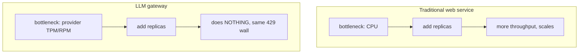
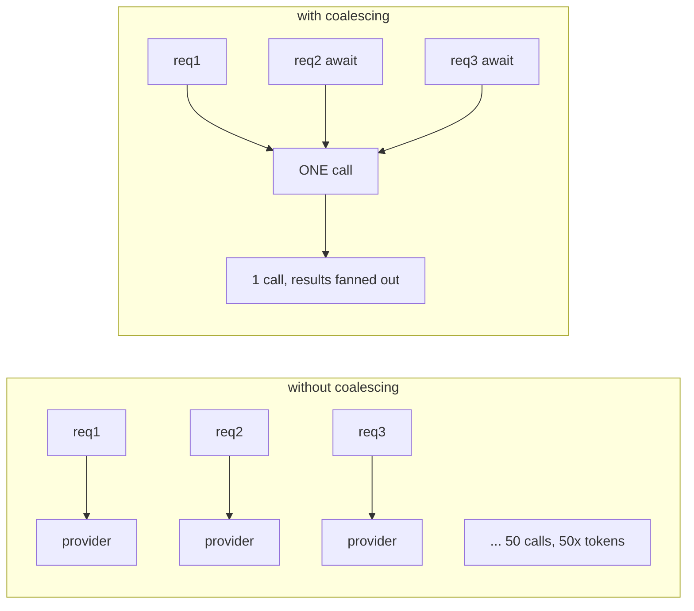
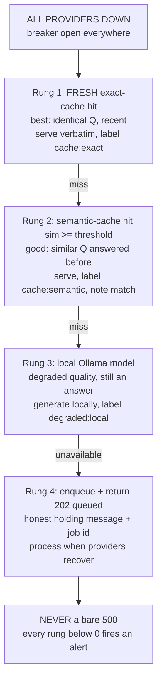

# Lecture 14: Capacity Planning, Provider Quota, and Graceful Degradation

> Every engineer who has scaled a normal web service arrives at LLM systems with the wrong mental model of "the bottleneck." You spend a decade learning to profile CPU, tune the connection pool, and add replicas — and then your LLM gateway falls over at a QPS your laptop could handle, because the wall you hit is not *yours*. It's the provider's **tokens-per-minute** quota. This lecture teaches you to model that wall with arithmetic you can do on a napkin: turn a target QPS + token estimate into required concurrency, a quota verdict, and a monthly dollar figure — then show how a cache hit rate and a cheap-tier cascade move all three. The second half is the flip side: when every provider is unreachable, what do you serve? We design the **degradation ladder** — exact cache → semantic cache → local model → 202 queued → *anything but a 500* — with the SRE rule that binds it together: **degrade AND alert.** After this you can fill in a capacity sheet from a blank page and defend a degradation story in a system-design interview.

**Prerequisites:** the LLM gateway (Lecture 6), circuit breakers & fallback (Lecture 7), two-layer caching + semantic cache (Week 2), token/cost intuition, basic probability and big-O · **Reading time:** ~28 min · **Part of:** Phase 09 — Architecture & System Design, Week 3

---

## The core idea (plain language)

Two linked ideas, and the link is the whole lecture.

**Idea one: your bottleneck is the provider's quota, not your compute.** A traditional service scales when you add CPU, memory, or replicas. An LLM app is mostly *waiting* — your process holds an open connection while a GPU farm you don't own generates tokens. Your CPU is nearly idle. What actually limits you is the contract with your provider, expressed as two numbers on your account dashboard: **TPM** (tokens per minute) and **RPM** (requests per minute). Blow past either and you get `429 Too Many Requests` — no matter how many replicas you run. So capacity planning for LLM systems is *quota planning*. You must model TPM/RPM explicitly, before launch, with arithmetic.

**Idea two: when you run out of quota — or every provider is down — you degrade, you don't die.** A normal service under overload returns 503 and sheds load. An LLM gateway has richer options because it has *caches* and *cheaper backends*. When the circuit breaker is open for all providers, you don't have to return a 500. You can serve a cached answer, a semantically-similar cached answer, a smaller local model's answer, or a "we've queued your request" 202. This is **graceful degradation** — the SRE discipline of shedding *quality* to preserve *availability*. The ladder is ordered from best-effort-still-good to honest-holding-message, and the operational rule that keeps it from becoming a silent trap is: **degrade AND alert.** A stale cache served with no signal to ops is a landmine, not a feature.

The link: quota is *why* you degrade. You degrade because you hit the TPM wall, or because the providers behind that quota went down. Capacity math tells you *how often* you'll be in degradation, and the ladder tells you *what you serve* when you are.

---

## How it actually works (mechanism, from first principles)

### Why quota, not CPU, is the wall

Picture one LLM request. Your server does maybe a millisecond of real work: hash the prompt, check the cache, assemble the payload. Then it opens an HTTPS connection to the provider and **waits** — 2, 5, sometimes 30 seconds — while a remote GPU cluster runs prefill and decode. Your process is parked on I/O the entire time. One box with an async event loop can hold *thousands* of these open connections at once because each costs almost no CPU.

So what stops you from serving 10,000 QPS from one box? The provider does. Your account has a **TPM** budget (say 2,000,000 tokens/minute for a mid-tier account) and an **RPM** budget (say 10,000 requests/minute). Every request you send burns both `input_tokens + output_tokens` against TPM and 1 against RPM. Cross either ceiling within the rolling window and the provider returns `429`. Adding replicas does **nothing** — the quota is per-account (sometimes per-project/per-key), shared across all your replicas.



### The back-of-envelope method

Here is the whole method as a sequence of arithmetic steps. Memorize the shape; the numbers are yours to plug in.

**Inputs you need:**
- `QPS` — target requests per second (peak, not average — you size for peak).
- `T_in`, `T_out` — average input and output tokens per request.
- `L` — average request latency in seconds (how long a call is "in flight").
- Provider `TPM` and `RPM` limits.
- `price_in`, `price_out` — dollars per token (usually quoted per 1M tokens).

**Step 1 — Token throughput you demand.**
```
tokens_per_request = T_in + T_out
tokens_per_minute  = QPS × 60 × tokens_per_request
requests_per_minute = QPS × 60
```

**Step 2 — Quota verdict.** Compare demand to ceiling on *both* axes:
```
TPM headroom = TPM_limit / tokens_per_minute      (want ≥ 1.0, prefer ≥ 1.3)
RPM headroom = RPM_limit / requests_per_minute
```
The **binding constraint** is whichever headroom is *smaller*. If either is < 1.0 you hit the wall — you will be throttled at peak. (Aim for ≥ 1.3, i.e. ~30% headroom, because traffic is bursty and the rolling window punishes spikes.)

**Step 3 — Required concurrency (Little's Law).** How many requests are in flight at once?
```
concurrency = QPS × L        (Little's Law: L_system = λ × W)
```
This sizes your connection pool, your semaphore limit, and your worker count — *not* your CPU. If `concurrency` is 400, you need a pool that allows ~400 simultaneous upstream calls (plus headroom), and a semaphore that caps you there so you fail fast instead of piling up unbounded.

**Step 4 — Monthly dollars.**
```
cost_per_request = T_in × price_in + T_out × price_out
monthly_cost     = cost_per_request × QPS × 60 × 60 × 24 × 30
```
(2.592M seconds/month if running flat-out at peak; use your real average QPS × seconds for a realistic bill, peak QPS only for the quota check.)

### The two levers that move the numbers

Two architectural moves change every number above. Model them explicitly.

**Cache hit rate `h`.** A cache hit costs ~0 provider tokens and ~0 dollars and doesn't touch quota. If a fraction `h` of requests are served from cache, the provider only sees `(1 − h)` of them:
```
effective_QPS_to_provider = QPS × (1 − h)
effective_TPM             = tokens_per_minute × (1 − h)
effective_cost            = monthly_cost × (1 − h)
```
A 30% hit rate directly cuts your quota demand and bill by 30%. It also *raises effective headroom* — the same TPM limit now covers 1/(1−0.30) ≈ 1.43× more user traffic.

**Cheap-tier cascade fraction `c`.** In a cheap-first cascade, a fraction `c` of requests are fully answered by a cheap model at price `price_cheap`, and only `(1 − c)` escalate to the expensive model. This doesn't reduce *token* count (both tiers spend tokens) but it slashes *dollars*, and if the cheap tier is a *different provider or a local model*, it also offloads quota:
```
blended_price_per_token = c × price_cheap + (1 − c) × price_expensive
```
The subtlety: a cascade where the cheap tier *fails and escalates* costs you **both** tiers' tokens for that request (you paid the cheap model to be wrong, then paid the expensive one). So `c` in the cost formula is the fraction *successfully resolved cheap*, not merely *attempted cheap*. Track that resolution rate — it's what makes the cascade pay.

### The quota-relief levers (beyond caching)

Caching and cascade shrink demand. Three more levers reshape *how* demand hits the quota:

- **Request coalescing (in-flight dedupe).** If 50 users ask the identical question in the same 3-second window, a naive gateway fires 50 provider calls. Coalescing keeps a map of `in_flight[request_hash] → Future`; the first request starts the upstream call, the other 49 `await` the *same* Future. One call, 50 answers. This is distinct from caching — it dedupes requests that overlap *in time* before any of them has completed, so there's nothing in the cache yet. It's the single cheapest defense against a thundering herd (a celebrity tweet, a retry storm, a cron job that fans out).



- **Queueing + backpressure.** When demand exceeds quota, you have two choices: reject (429 to your user) or queue. A bounded queue with backpressure lets you *smooth bursts* — absorb a spike into a buffer and drain it at your sustainable TPM rate. The word "bounded" is load-bearing: an unbounded queue just moves the failure from "429 now" to "OOM and 30-second latencies later." Set a max depth; when full, shed load explicitly (429 with `Retry-After`).

- **Multi-provider spread.** Quotas are per-account. Two providers = two independent TPM/RPM budgets. Splitting traffic 60/40 across Anthropic and OpenAI (via the gateway's logical-model list from Lecture 6) roughly doubles your effective ceiling and means one provider's outage or throttle doesn't take you fully down. The cost is complexity (the abstraction leaks — token counting and prompt-cache semantics differ) and reconciling two bills.

- **Input trimming + provider prompt caching.** Look again at the worked example: `T_in = 1,500` vs `T_out = 400` — the *input* is what blows your TPM budget, and it's the cheapest thing to attack. Two moves: (1) **trim the input** — a bloated system prompt, over-fetched RAG context (top-20 chunks when top-4 would do), or an uncompacted history are pure quota waste; cutting `T_in` from 1,500 to 800 nearly halves your token demand with zero quality loss if the trimmed tokens weren't earning their keep. (2) **Provider prompt caching** — Anthropic `cache_control` and OpenAI's automatic prefix cache store the *prefill* of a stable prefix (system prompt + long shared context) server-side, so repeated calls with the same prefix bill cached input tokens at a steep discount (often ~10% of list, as of 2025–2026 — check current pricing). This does **not** reduce your TPM *count* (the tokens still flow), but it slashes the *dollar* side of the sheet for any workload with a big shared prefix — exactly the RAG/agent shape where `T_in` dominates. Structure prompts prefix-stable (constant content first, variable user content last) so the cache actually hits.

---

## Worked example

Let's fill in a capacity sheet end to end. A support-triage assistant, sizing for peak.

**Inputs:**
- Target peak `QPS = 50`
- `T_in = 1,500` tokens (system prompt + retrieved context + user message)
- `T_out = 400` tokens
- Average latency `L = 4 s`
- Provider limits: `TPM = 2,000,000`, `RPM = 10,000`
- Price: `price_in = $3 / 1M`, `price_out = $15 / 1M`

**Step 1 — demand.**
```
tokens_per_request  = 1,500 + 400 = 1,900
tokens_per_minute   = 50 × 60 × 1,900 = 5,700,000 tokens/min
requests_per_minute = 50 × 60 = 3,000 req/min
```

**Step 2 — quota verdict.**
```
TPM headroom = 2,000,000 / 5,700,000 = 0.35   ← WALL. You need 2.85× your TPM.
RPM headroom = 10,000 / 3,000 = 3.33          ← fine
```
Binding constraint = **TPM**, and you're at 0.35 — you'd be throttled hard at peak. RPM is comfortable; the problem is purely tokens. This is the classic surprise: you have plenty of "request" budget but you're drowning in *tokens*, mostly from that 1,500-token input.

**Step 3 — concurrency.**
```
concurrency = QPS × L = 50 × 4 = 200 requests in flight
```
Size the semaphore/pool for ~200 (plus ~30% headroom → 260). One or two async boxes handle this trivially — again, not a compute problem.

**Step 4 — monthly cost (at sustained peak, worst case).**
```
cost_per_request = 1,500 × $3/1e6 + 400 × $15/1e6
                 = $0.0045 + $0.0060 = $0.0105
monthly (flat-out) = $0.0105 × 50 × 2,592,000 s = $1,360,800 / month
```
That's the pessimistic ceiling (running at peak 24/7). Even at a realistic average of, say, 15 QPS it's ~$408k/month. Either way: eye-watering, and you're *also* over quota. Two things must change.

**Now apply the levers.**

*Cache at h = 30%.* Provider sees `(1 − 0.30) = 70%` of traffic:
```
effective TPM demand = 5,700,000 × 0.70 = 3,990,000 tokens/min
TPM headroom = 2,000,000 / 3,990,000 = 0.50   ← better, still a wall
effective cost = $1,360,800 × 0.70 = $952,560 / month
```
Caching alone isn't enough — headroom is still < 1.0. You need more.

*Add a cascade: c = 70% resolved by a cheap tier* at `price_cheap_in = $0.15/1M`, `price_cheap_out = $0.60/1M`. Route the cheap tier to a *second provider* (independent quota) or local model. Of the 70% cache-missed traffic, 70% goes cheap:
```
blended cost_per_request:
  cheap:     1,500 × $0.15/1e6 + 400 × $0.60/1e6 = $0.000225 + $0.00024 = $0.000465
  expensive: $0.0105 (as before)
  blended = 0.70 × $0.000465 + 0.30 × $0.0105 = $0.000326 + $0.00315 = $0.003476

Apply cache (30%) on top:
  effective cost/request = $0.003476 × 0.70 = $0.002433
  monthly (flat-out peak) = $0.002433 × 50 × 2,592,000 = $315,360 / month
```
And the *quota* picture, if the cheap tier lives on a separate account: the expensive provider now only sees `0.70 (cache miss) × 0.30 (escalated) = 21%` of original traffic:
```
expensive-provider TPM demand = 5,700,000 × 0.21 = 1,197,000 tokens/min
TPM headroom = 2,000,000 / 1,197,000 = 1.67   ← comfortably clear of the wall
```

**Summary of the sheet:**

| Scenario | TPM headroom (expensive) | Monthly $ (peak) |
|---|---|---|
| Naive | 0.35 (throttled) | $1,360,800 |
| + 30% cache | 0.50 (throttled) | $952,560 |
| + cache + 70% cheap cascade (separate quota) | 1.67 (clears wall) | $315,360 |

Same user-facing QPS. Architecture — not more compute — turned an over-quota, seven-figure design into an under-quota, ~4.3×-cheaper one. *That* is the capacity sheet's job: to show, in arithmetic, that the levers are the answer.

---

## How it shows up in production

- **The launch that dies at 5% of projected load.** Marketing drives a spike, your dashboard shows CPU at 8%, and yet everything is `429`. Ops adds replicas — no change, because the quota is per-account. The fix was a capacity sheet done *before* launch: you'd have seen TPM headroom at 0.35 and requested a limit increase (which providers grant on request, but often with days of lead time) or spread across providers.

- **The bill that's 3× the estimate — traced to missing coalescing.** A downstream retry storm or a viral identical query fans out into hundreds of duplicate in-flight calls. Each is billed. Coalescing would have collapsed them to one. You spot it by comparing *distinct* prompt hashes to *total* provider calls in a window — a big gap is uncoalesced duplication.

- **The "we're at 90% of quota" alert that never fires.** Most teams alert on error rate. But TPM exhaustion isn't an error until you're *over* — and then it's a cliff. You want a **leading** metric: track `tokens_per_minute` as a rolling gauge and alert at 80% of your limit, so you request an increase before the wall, not after.

- **The cascade that costs *more* than no cascade.** If the cheap tier resolves only 20% of the time and escalates 80%, you're paying the cheap model to be wrong on most requests *plus* the full expensive call. Below a break-even resolution rate the cascade is a net loss. Always measure the *resolution* rate (Lecture on cheap-first cascade), not the *attempt* rate.

- **The silent stale-cache serve.** Providers go down, degradation kicks in, users get cached answers from six hours ago — and *nobody knows*, because the endpoint returns 200 and no alert fired. Days later someone notices the "assistant" has been repeating itself. This is the trap the "degrade AND alert" rule exists to prevent: every degraded serve must (a) be labeled in the response metadata and (b) increment a metric that pages ops when it crosses a rate.

- **Little's Law surprises in the pool.** You sized a connection pool of 50 but `concurrency = QPS × L = 30 × 4 = 120`. Requests queue behind the pool, latency balloons, and it looks like the provider is slow when it's actually your own pool starving. Size the pool from Little's Law, not from a guess.

---

## The degradation ladder (the second half)

When the circuit breaker (Lecture 7) is open for **all** providers — every upstream is failing fast — a naive gateway returns 500. Graceful degradation says: descend a ladder of decreasing quality, each rung still better than an error. Order matters; serve the highest rung that's available.



**Rung 1 — fresh exact-cache hit.** The prompt hash matches a cached response *within its freshness TTL*. Serve it verbatim. "Fresh" is the operative word: during an outage you may choose to serve *stale* exact hits too (rung 1b), but you must label them stale and never let a stale serve be silent. A support answer from 20 minutes ago is usually fine; a "current account balance" from 20 minutes ago may not be — freshness policy is per-endpoint.

**Rung 2 — semantic-cache hit.** No exact match, but the embedded query is within cosine threshold of a previously-answered one (Week 2's semantic cache). Serve that answer, and record the similarity score in the trace — a 0.97 match is trustworthy, a barely-over-threshold 0.91 during an outage is a judgment call you want to be able to audit later. Keep the threshold *strict* here; a wrong-but-confident answer during an outage compounds the incident.

**Rung 3 — local model (Ollama).** Providers are the ones down, not your own hardware. A local `llama3.1` gives a lower-quality but *real, fresh* answer with zero external quota. This is why Week 1 insisted you keep Ollama wired in — it's your always-available floor. Label the response `degraded:local` so downstream (and evals) know the quality tier changed.

**Rung 4 — enqueue and 202.** Nothing cached, local model unavailable or unsuitable. Accept the request, put it on a bounded queue, and return **HTTP 202 Accepted** with a job id and a "we've queued this, check back / we'll notify you" message. When a provider's breaker half-opens and recovers, workers drain the queue idempotently. A 202 is an honest promise; a 500 is a dead end.

**The rule that binds it: degrade AND alert.** Every rung below "normal provider serve" must do two things atomically: (1) attach degradation metadata to the response (`x-degradation-tier: cache:semantic`) so clients and traces know quality dropped, and (2) emit a metric/event that, above a threshold rate, pages ops. Silent degradation is indistinguishable from a slow-motion outage. The whole point of degrading is to *buy time while someone fixes the real problem* — and no one fixes what no one is paged about.

```python
async def serve_with_degradation(req) -> Response:
    if not breaker.all_open():
        return await gateway.call(req)          # normal path

    # --- degradation ladder; all providers down ---
    if (hit := cache.exact(req)) and hit.fresh:
        emit_degradation("cache:exact"); return respond(hit, tier="cache:exact")
    if (hit := cache.exact(req)):               # stale, but honest
        emit_degradation("cache:exact-stale", alert=True)
        return respond(hit, tier="cache:exact-stale", stale=True)
    if (hit := cache.semantic(req, threshold=0.95)):
        emit_degradation("cache:semantic", alert=True)
        return respond(hit, tier="cache:semantic", score=hit.score)
    if ollama.available():
        emit_degradation("degraded:local", alert=True)
        return respond(await ollama.call(req), tier="degraded:local")
    job = await queue.enqueue(req)              # bounded queue
    emit_degradation("queued", alert=True)
    return Response(status=202, body={"job_id": job.id, "status": "queued"})
    # note: no branch returns 500
```

---

## Common misconceptions & failure modes

- **"We'll just add more servers when we scale."** For LLM traffic, more servers change nothing about the TPM/RPM wall — the quota is per-account, shared across replicas. Servers scale your *own* work, which is nearly free here. Scale by raising quota, spreading providers, caching, and cascading.

- **"RPM is the limit that matters."** Usually it's **TPM** — a single request can be 200 tokens or 200,000. Long inputs (big RAG context, long histories) blow the token budget while you're nowhere near the request-count ceiling. Always check *both*; the binding constraint is the smaller headroom.

- **"Caching and coalescing are the same thing."** Caching serves a *completed* past response to a *later* request. Coalescing dedupes requests that are *in flight simultaneously* — before any has completed, so the cache is still empty. You need both: coalescing for the thundering herd, caching for the long-tail repeat.

- **"A cascade always saves money."** Only if the cheap tier's *resolution* rate is high enough. Escalations pay for both tiers. Below break-even, the cascade is pure overhead. Measure resolution, not attempts.

- **"Degradation mode means returning a friendly 500 page."** No — the point is to return *useful content*: a cached answer, a local answer, or a queued-job promise. A 500 (even a pretty one) is a failed request. The ladder exists precisely so 5xx is never the outcome.

- **"Silent stale cache during an outage is fine — users get *an* answer."** This is the single most dangerous anti-pattern here. Unlabeled, un-alerted stale serves hide the outage from ops and mislead users. Degrade *and* alert, always. Label the tier in the response.

- **"An unbounded queue gives us infinite burst absorption."** It gives you infinite *latency* and eventually OOM. Bounded queues with explicit load-shedding (429 + `Retry-After` when full) fail predictably; unbounded queues fail catastrophically and late.

- **"Little's Law is academic."** It's the most practical formula here: `concurrency = QPS × latency` sizes your pool and semaphore. Ignore it and you either starve (pool too small, self-inflicted latency) or over-allocate connections the provider will 429 anyway.

---

## Rules of thumb / cheat sheet

- **Model quota before launch.** Fill the sheet: `TPM_demand = QPS × 60 × (T_in + T_out)`; `headroom = limit / demand`; want **≥ 1.3**. Binding constraint = smaller of TPM/RPM headroom. (Approximate; traffic is bursty.)
- **Concurrency = QPS × latency** (Little's Law). Size pools/semaphores from this, not from CPU.
- **TPM usually binds, not RPM.** Big inputs (RAG context, long history) are the usual culprit; **trimming `T_in`** (leaner system prompt, fewer RAG chunks, compacted history) is often the cheapest quota win, and **provider prompt caching** (Anthropic `cache_control` / OpenAI prefix cache) cuts the *cost* of a stable prefix — structure prompts prefix-stable so it hits.
- **Cache hit rate `h` multiplies everything down by `(1 − h)`** — demand, cost, and effective headroom all improve. 20–40% is a realistic starting band for chatty workloads (approximate — measure yours).
- **Cascade cost = `c × price_cheap + (1 − c) × price_expensive`,** where `c` is the *resolution* rate. Put the cheap tier on a separate provider/local model to also offload quota.
- **Coalesce identical in-flight requests** (`in_flight[hash] → Future`) — the cheapest thundering-herd defense; distinct from caching.
- **Bounded queue + backpressure** to smooth bursts; shed load explicitly (429 + `Retry-After`) when full. Never unbounded.
- **Alert at 80% of TPM/RPM** as a leading indicator — quota exhaustion is a cliff, not a slope.
- **Degradation ladder:** fresh exact → (stale exact, labeled) → semantic (strict threshold) → local model → 202 queued. **Never a 500.**
- **Degrade AND alert.** Every degraded serve: label the tier in the response *and* emit a metric that pages above a rate. Silent stale cache is a trap.
- **Multi-provider spread doubles your ceiling** and survives one provider's outage; the price is a leaky abstraction and two bills.

## Connect to the lab

This lecture is the theory behind **Week 3, Lab steps 4 and 6**. Step 6 is the **capacity math sheet** in `README.md` — write the formula and the worked QPS → tokens → quota → $ example above, then show the cache (30%) and cascade (70% cheap) rows exactly as in the summary table. Step 4 is the **degradation mode** in `/chat`: implement the ladder (fresh exact → semantic → local Ollama → 202 queued) so a simulated total outage (bad keys everywhere) returns useful responses, never 5xx — the `serve_with_degradation` sketch above is your skeleton, and the "degrade AND alert" rule is what makes the Definition-of-Done "demonstrated" line honest rather than a silent stale serve.

## Going deeper (optional)

- **Google SRE Book — "Handling Overload" and "Addressing Cascading Failures"** (`sre.google/books`). The canonical treatment of load shedding, graceful degradation, and why bounded queues beat unbounded ones. Search: "Google SRE handling overload graceful degradation".
- **Little's Law** — any queueing-theory primer; the one-line result `L = λW` is all you need. Search: "Little's Law capacity planning".
- **Provider rate-limit docs** — read your actual provider's limits page for TPM/RPM semantics and how to request increases: OpenAI ("rate limits"), Anthropic ("rate limits"), and the relevant cloud endpoint (Bedrock/Vertex/Azure OpenAI) quotas. These differ in *windowing* (rolling vs fixed) — search: "OpenAI rate limits", "Anthropic rate limits".
- **LiteLLM Router docs** (`docs.litellm.ai`) — routing strategies, fallbacks, and the multi-deployment model list that implements multi-provider spread and cascade. Search: "LiteLLM Router fallbacks load balancing".
- **GPTCache** (`github.com/zilliztech/GPTCache`) — reference implementation of the semantic-cache rung. Search: "GPTCache semantic cache threshold".
- **Marc Brooker's blog** on queues, backpressure, and timeouts (`brooker.co.za/blog`) — sharp, practitioner-grade essays on why bounded queues and load-shedding matter. Search: "Marc Brooker backpressure timeouts".
- Search queries: "LLM TPM RPM capacity planning", "request coalescing single-flight in-flight dedupe", "circuit breaker degradation ladder LLM", "backpressure bounded queue load shedding".

## Check yourself

1. Your dashboard shows CPU at 6% but the gateway is returning `429` at peak. Explain, from first principles, why adding replicas won't help and name the two provider numbers you must check.
2. Target `QPS = 40`, `T_in = 1,000`, `T_out = 500`, `TPM_limit = 3,000,000`, `RPM_limit = 6,000`. Compute TPM and RPM headroom. Which is the binding constraint, and are you over the wall?
3. Average latency is 5 s and you're serving 30 QPS. How many requests are in flight, and what does that number size?
4. Distinguish **caching** from **request coalescing** with a concrete scenario each. Why do you need both?
5. A cheap-first cascade sends 100% of traffic to a cheap model that resolves 25% of the time and escalates the rest. Why might this cost *more* than sending everything straight to the expensive model? What single number decides it?
6. All providers are down. Write the degradation ladder in order, and state the one operational rule that prevents the ladder from becoming a silent outage.

### Answer key

1. Your process spends nearly all its time waiting on I/O (the remote GPU generating tokens), so one box holds thousands of connections at trivial CPU cost — your compute is not the bottleneck. The wall is the **provider quota**, which is per-account and shared across all replicas, so more replicas hit the *same* 429. The two numbers: **TPM** (tokens/minute) and **RPM** (requests/minute).
2. `tokens_per_request = 1,500`; `TPM_demand = 40 × 60 × 1,500 = 3,600,000`; TPM headroom = `3,000,000 / 3,600,000 = 0.83`. `RPM_demand = 40 × 60 = 2,400`; RPM headroom = `6,000 / 2,400 = 2.5`. **TPM binds** (0.83 < 2.5) and you're **over the wall** (< 1.0) at peak — you'll be throttled. Trim input tokens or spread/cache.
3. `concurrency = QPS × L = 30 × 5 = 150` requests in flight. It sizes your **connection pool / semaphore / worker count** (add ~30% headroom → ~195), not your CPU.
4. **Caching:** the same FAQ was answered an hour ago; a new identical request gets the stored answer — reuses a *completed past* response. **Coalescing:** 50 users ask the identical question in the same 3-second window; the first fires one upstream call and the other 49 `await` the same Future — dedupes requests *in flight simultaneously*, before any has completed (cache is still empty). You need both: coalescing kills the thundering herd, caching serves the long-tail repeat.
5. Every escalation pays for **both** the cheap call (that failed) and the expensive call. At a 25% resolution rate, 75% of requests pay both tiers — so you've added the cheap tier's cost to nearly all traffic with little offsetting benefit. The deciding number is the **resolution rate** (`c`, fraction fully resolved cheap): below a break-even `c`, `blended = c×cheap + (1−c)×(cheap+expensive)` exceeds the expensive-only cost. Measure resolution, not attempts.
6. Order: **(1) fresh exact-cache hit → (1b, optional) stale exact, labeled → (2) semantic-cache hit at a strict threshold → (3) local Ollama model → (4) enqueue and return 202 "queued" with a job id — never a bare 500.** The binding rule: **degrade AND alert** — every degraded serve must label its quality tier in the response *and* emit a metric that pages ops above a rate, so degradation buys time for a fix instead of silently hiding the outage.
