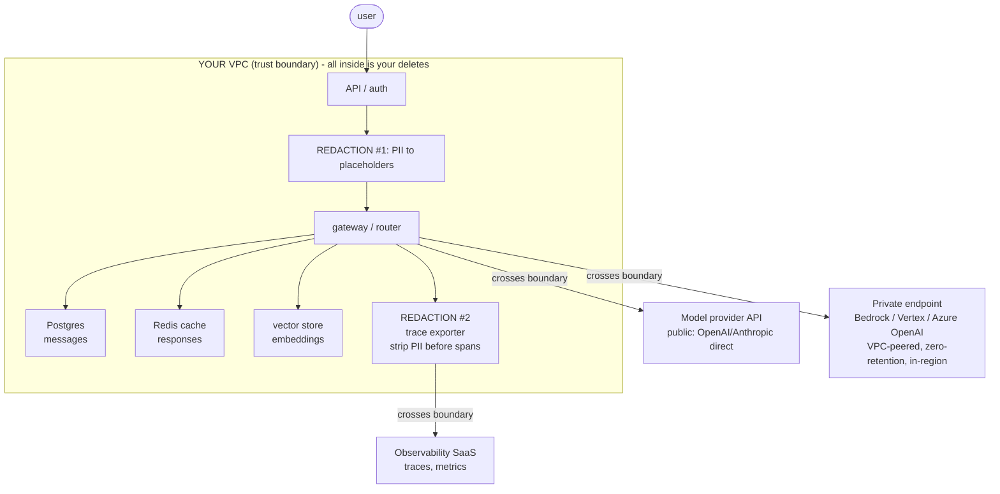

# Lecture 15: Build-vs-Buy and Compliance-Architecture Trust Boundaries

> You have built a gateway. Now two decisions decide whether it survives contact with a real company: *how much of it should you actually run yourself*, and *where does user data physically go*. These sound like different problems — one is a procurement call, one is a security-review call — but they are the same problem viewed from two angles, because both are answered by drawing one diagram: the trust-boundary data-flow. Draw it well and it tells you which gateway pieces to build, which to buy, which providers you can legally send data to, where to redact PII (two places, not one), and — the payoff that ties the whole phase together — *every* place a user's bytes came to rest, which is exactly the set your GDPR cascade delete must purge. This lecture gives you a rubric you can defend in a design review and a diagram you can defend in a security review, with no legal depth beyond what an engineer needs to reason.

**Prerequisites:** Lecture 6 (gateway/router pattern), Lecture 5 (GDPR erasure as architecture), basic VPC/networking (private vs public endpoints), and the idea of a DPA as "the contract that says what a vendor may do with your data" · **Reading time:** ~30 min · **Part of:** Phase 09 — Architecture & System Design, Week 3

---

## The core idea (plain language)

There are two decisions here and one artifact that answers both.

**Decision 1 — Build vs buy the gateway stack.** You already know *what* a gateway does (routing, fallback, caching, limits, tracing). The question now is who operates it. You have four postures, from most-you to least-you:

1. **Thin self-hosted gateway** (you run LiteLLM/an OpenAI-compatible proxy in your own VPC).
2. **Managed gateway** (Portkey, Cloudflare AI Gateway, LiteLLM Cloud — someone else runs the proxy; your traffic flows through their edge).
3. **Buy only observability** (you build the gateway, but pay for Langfuse Cloud / Helicone / Datadog to store traces).
4. **Buy nothing / build everything** (hand-roll the proxy *and* the observability store).

**Decision 2 — Compliance architecture.** Independent of who runs the box, *where does the data go?* Which bytes leave your VPC, to which providers, under what retention terms, and where do you strip PII before it lands somewhere you can't fully control.

The single artifact that answers both is a **trust-boundary data-flow diagram**: boxes for every place data rests or is processed, and a dotted line — the *trust boundary* — around the part you control (your VPC). Every arrow that crosses that line is a decision: is this vendor contractually safe, does it retain the data, and is the PII redacted before it crosses?

The sensible **default** for a small-to-mid team is opinionated and worth memorizing: **run a thin self-hosted gateway (LiteLLM) and buy your observability.** You keep control of the request path and the key material; you don't reinvent a trace store and dashboards. But the default is only defensible if you *wrote down why* — the rubric below is the written-tradeoff discipline, and it is the thing that turns "we felt like it" into an engineering decision.

---

## How it actually works (mechanism, from first principles)

### The build-vs-buy rubric — five axes

Score each axis for *your* situation. Do not average them into a single number; the axes are not fungible — one hard constraint (data residency, say) can override four soft preferences.

**1. Control needed.** How much do you need to customize the request path? A thin self-hosted proxy lets you inject arbitrary middleware (custom PII redaction, a bespoke cascade router, a spend ledger tied to your billing system). A managed gateway gives you *their* feature set — excellent, but you route around its gaps, you don't patch them. Ask: *is there a transformation I need in the hot path that a config toggle can't express?* If yes, lean build.

**2. Data-residency / privacy.** Where is data legally allowed to be, and who is contractually allowed to touch it? A managed gateway means your prompts (which may contain PII) transit a *third* company's infrastructure — now you need a DPA with them *and* with the model provider. If you're under EU data-residency rules or handling health/financial data, adding a vendor in the request path adds a vendor to your compliance surface. This axis alone frequently forces self-hosting.

**3. Cost at YOUR volume.** Not at hyperscaler volume — yours. Managed gateways typically price per-request or per-seat; self-hosting costs a container plus your time. The crossover is real and computable (worked example below). The trap is paying a per-request fee on millions of cheap requests when a $30/month container would do, *or* the opposite — burning three engineer-weeks building what a $200/month product does better.

**4. Team size.** A two-person team that self-hosts *everything* is now on-call for their own observability database at 3am. Buying observability converts an operational liability into a line item. The smaller the team, the more you should buy the *undifferentiated* parts (trace storage, dashboards) and build only the *differentiated* part (your request path). Gateways are cheap to run; trace stores are annoying to run.

**5. Ejectability — can you leave?** The most-overlooked axis. If this vendor triples its price or gets acquired, how many days to migrate off? A thin LiteLLM proxy speaking the OpenAI wire format is maximally ejectable — you can swap it or self-host in an afternoon because everything downstream already speaks that format. A managed gateway that owns your prompt registry, your semantic cache, and your virtual keys is *sticky* — leaving means re-homing all of that. Prefer designs where the vendor sits *beside* the hot path (observability: you can stop sending traces and lose only history) over designs where the vendor sits *in* the hot path (managed proxy: leaving means a migration).

A compact way to hold it:

```
Axis                 Lean BUILD (self-host)          Lean BUY (managed)
------------------   -----------------------------   ----------------------------
Control needed       custom hot-path logic           stock features are enough
Data residency       strict / regulated / EU-only    permissive; vendor has DPA + region
Cost at your volume  high request count, low $/req   low volume, or eng time is the scarce resource
Team size            you have platform capacity       tiny team, no on-call for infra
Ejectability         want swap-in-an-afternoon        accept lock-in for speed now
```

### Why the default is "thin self-hosted gateway + bought observability"

Split the stack by whether a piece is *differentiated* (specific to your product, in the hot path, touches secrets and PII) or *undifferentiated* (every LLM app needs it, sits beside the path, is annoying to operate):

```
                     DIFFERENTIATED — BUILD           UNDIFFERENTIATED — BUY
                     (in hot path, touches secrets)   (beside path, annoying to run)
  gateway proxy      ✔ thin LiteLLM in your VPC
  routing / cascade  ✔ your logic
  PII redaction      ✔ your rules, before it leaves
  key material       ✔ never leaves your VPC
  trace storage                                       ✔ Langfuse Cloud / Helicone
  dashboards                                          ✔ their UI
  alerting                                            ✔ Datadog / Grafana Cloud
```

The gateway is differentiated and cheap to run, so build it. Observability is undifferentiated and a genuine operational burden (a time-series/trace database is a real system to keep alive), so buy it. This split maximizes control and ejectability where they matter (the request path, the keys) and minimizes operational load where it doesn't (storing traces).

### The compliance architecture: one trust-boundary diagram

Now the second decision. Draw the data flow and put a dotted box — the **trust boundary** — around everything you operate. Everything inside is yours to secure and to delete. Every arrow *crossing* the boundary is a data-egress decision.



Read the diagram as a checklist. Three things must be true for every boundary-crossing arrow:

- **The vendor is contractually safe.** You have a DPA and, ideally, **zero-retention** terms — the provider does not persist your prompts/completions or use them for training. As of 2025–2026, the major API providers offer zero-retention / no-training options on their business tiers, and the cloud-hosted variants (Amazon Bedrock, Google Vertex AI, Azure OpenAI) contractually do not use your data to train their models and let you pin a region. *Verify the current terms yourself — do not trust a lecture's snapshot for a compliance decision.*
- **PII is redacted appropriately.** The prompt that crosses to a public provider goes through **Redaction #1** first.
- **Sensitive data uses a private endpoint.** For regulated data, don't send it to a public API over the internet at all — route it through Bedrock / Vertex / Azure OpenAI on a VPC-peered / PrivateLink connection so the bytes never traverse the public internet and stay in your chosen region.

### The two redaction points (this is the part everyone gets half-right)

There are **two** independent places PII can leak, and they need **two** redaction steps. Redacting in only one place is the classic half-fix.

**Redaction #1 — before the prompt leaves your VPC.** You strip or tokenize PII (names, emails, SSNs, card numbers, account IDs) *before* the text is sent to the model provider. Replace with placeholders (`[EMAIL_1]`, `[PERSON_1]`) and keep the mapping inside your VPC if you need to rehydrate the answer. This protects data at the *provider* boundary.

**Redaction #2 — before logs / traces leave your VPC.** Your tracing exporter sends spans (which include the *resolved prompt*, the completion, token counts) to your observability SaaS. That is a **second boundary crossing**, to a **different vendor**, and it is the one teams forget. If you redact before the model call but log the *original* prompt into your trace, you just shipped the PII to Langfuse/Datadog instead of OpenAI — same leak, different door. Redaction #2 runs on the span attributes right before export.

Why two points and not one shared step? Because the two flows can diverge: you might send a *less*-redacted prompt to a private Bedrock endpoint you trust, but still want a *more*-redacted version in traces that a wide audience of engineers can read. And a trace often contains things the prompt doesn't — internal IDs, retrieved document snippets, tool arguments. The redaction *rules* may differ by destination, so the code paths must be separate.

A minimal shape:

```python
# Redaction #1 — on the request path, before the provider call
clean_messages, pii_map = redact(messages, mode="provider")
resp = await gateway.complete(clean_messages, model="chat-default")

# Redaction #2 — on the tracing path, before export (a DIFFERENT rule set)
span.set_attribute("prompt", redact_for_traces(clean_messages))   # not `messages`!
span.set_attribute("completion", redact_for_traces(resp))
```

### Tie-back to Week 1: the diagram *is* your delete manifest

Here is the payoff that connects this lecture to the GDPR cascade delete from Week 1. The trust-boundary diagram enumerates **every place a user's data landed inside your boundary**:

- Postgres (`messages`, `conversations`, `memories`, `spend_ledger`)
- Redis (session buffers, exact + semantic cache entries, dedup/idempotency keys)
- Vector store (embeddings of their turns and documents)
- Object storage (uploaded files, raw request/response archives)
- **And the one people miss: the observability store**, if traces contain user text.

Your cascade delete must purge *exactly this set*. The diagram is not just a compliance artifact; it is the **specification for your delete function**. If a box is inside your boundary, your `DELETE /users/{id}` must reach it. If a box is *outside* (a model provider under zero-retention), you rely on the *contract* — which is why zero-retention matters: it's the difference between "we deleted it" and "we deleted our copies and the vendor contractually doesn't keep one." The two redaction points shrink this problem: data that was never PII-bearing when it crossed a boundary is data you don't have to chase down to delete.

---

## Worked example

**Scenario.** A 4-engineer B2B startup builds a support assistant. Volume: **2 million requests/month**, average ~800 tokens each. Handles customer account data (emails, order IDs) — PII, but not health/financial-regulated. EU customers exist but data-residency is "preferred," not contractually mandated yet.

**Cost axis, computed.** Suppose a managed gateway prices at **$0.001/request** past its free tier.

```
Managed gateway:  2,000,000 req × $0.001 = $2,000 / month
Self-hosted LiteLLM: 1 small container (~2 vCPU) ≈ $30–60 / month
                     + ~0.2 eng maintenance ≈ negligible once stable
```

At 2M req/month the managed proxy costs ~$2,000/mo *on top of* model spend, versus ~$50/mo self-hosted. The cost axis screams **build the gateway**. (At 20k req/month the same math flips: $20 managed vs the fixed cost of running and patching a box — then **buy** makes sense.)

**Observability axis.** A trace store for 2M spans/month is a real database with retention, indexing, and a dashboard. The 4-person team has no appetite to run it. **Buy** Langfuse Cloud / Helicone — a line item, not an on-call rotation.

**Residency axis.** "Preferred" not "mandated," and no regulated data → public provider APIs with a signed DPA + zero-retention are acceptable *today*. Flag it: if a health-sector customer signs next quarter, you pre-plan a swap to **Bedrock/Vertex/Azure OpenAI private endpoints in-region** for that tenant. Because the gateway is thin and speaks OpenAI-compatible wire format, that swap is a routing-config change, not a rewrite — **ejectability paid off before you even ejected.**

**The written decision (the deliverable):**

> Build: thin LiteLLM gateway in our VPC (control over cascade routing + spend ledger; $50/mo vs $2,000/mo managed at our volume; maximally ejectable). Buy: Langfuse Cloud for traces (undifferentiated, not worth an on-call rotation for 4 people). Public provider APIs under DPA + zero-retention for now; **trigger to revisit** = first regulated-data customer, at which point sensitive tenants route to Vertex private endpoints. Two redaction points: Presidio-based PII strip before the provider call, and a separate trace-scrub before span export.

That paragraph — axes named, numbers shown, trigger-to-revisit stated — is what "written-tradeoff discipline" means. It's three sentences and it survives a design review.

---

## How it shows up in production

- **The $2k/month invoice nobody decided on.** A team drops in a managed gateway "to move fast," never revisits, and a year later is paying five figures/month for a proxy they could run for $50 — because nobody wrote the cost axis down or set a trigger to revisit. The written tradeoff *with a revisit trigger* is the fix.
- **The PII-in-traces incident.** Redaction #1 ships on day one; everyone feels safe. Six months later a security audit greps the trace store and finds customer emails in span attributes — Redaction #2 was never built. Now it's an incident with a disclosure question, not a code review comment. **Two redaction points, always.**
- **The GDPR delete that missed the trace store.** The Week-1 cascade delete purges Postgres, Redis, vectors, and S3 — and leaves the user's text sitting in Langfuse for the 90-day retention window. The delete function was written from the *code*, not from the *trust-boundary diagram*, so it missed a box the diagram would have shown. Delete from the diagram, not from memory.
- **The un-ejectable managed gateway.** A team adopts a managed gateway's prompt registry, virtual keys, and semantic cache. Two years later the vendor 3x's the price. Leaving now means re-homing three subsystems — weeks of work — so they pay. The teams that stayed ejectable kept the vendor *beside* the hot path (observability only) and the wire format standard.
- **Latency of the extra hop.** A managed gateway is a network hop your self-hosted proxy inside the same VPC/region doesn't have. Usually tens of ms — often fine, but for a low-latency copilot it competes directly with your TTFT budget, and it's a reason the coding-copilot design tends to favor an in-VPC proxy.

---

## Common misconceptions & failure modes

- **"Redact once and you're safe."** No — two boundary crossings (provider *and* observability vendor), two redaction points, potentially two rule sets. Redacting only before the model call still ships PII to your trace store.
- **"Zero-retention means we don't have to delete anything."** Zero-retention covers the *provider's* copy. It says nothing about the copies *inside your boundary* — Postgres, Redis, vectors, S3, traces. Those are still yours to cascade-delete. Zero-retention shrinks the *external* surface; it doesn't touch the internal one.
- **"Private endpoint = encrypted."** Different guarantees. TLS gives you encryption in transit to a *public* endpoint. A private endpoint (PrivateLink / VPC peering) means the traffic never traverses the public internet *and* pins the region — a network/residency property, not just encryption. You often want both.
- **"Buy the gateway to save engineering time."** Sometimes — but the gateway is the *cheap, differentiated* part. Buying it trades away control and ejectability where you most want them (the hot path, the keys). If you're going to buy something to save time, buy the *observability store*, which is genuinely expensive to operate.
- **"Managed gateway, so compliance is their problem."** Adding a vendor to the request path *adds* to your compliance surface — you now need a DPA with them too, and their region/retention terms become yours to verify. It doesn't outsource the problem; it multiplies the parties.
- **"We'll decide build-vs-buy once, at the start."** It's a re-decision as volume and team size change. Bake a **revisit trigger** (a volume number, a new-customer type) into the written decision.

---

## Rules of thumb / cheat sheet

- **Default posture:** thin self-hosted LiteLLM gateway **+** bought observability. Deviate only with a written reason.
- **Build the differentiated, cheap, hot-path parts** (proxy, routing, redaction, keys). **Buy the undifferentiated, annoying-to-run parts** (trace store, dashboards, alerting).
- **Five axes, no averaging:** control, data-residency, cost-at-your-volume, team-size, ejectability. Any single hard constraint can override the rest.
- **Cost crossover (approximate):** per-request managed pricing loses badly at high volume; wins at low volume where your scarce resource is engineer-time. *Compute it with your real numbers.*
- **Ejectability test:** "If this vendor 3x'd the price tomorrow, how many days to leave?" Keep vendors *beside* the hot path, not *in* it. Standardize on the OpenAI-compatible wire format so downstream swaps are config, not rewrites.
- **Two redaction points, always:** #1 before the prompt leaves the VPC; #2 before spans/logs leave the VPC. Different destinations, possibly different rules.
- **Sensitive/regulated data → private endpoint** (Bedrock / Vertex / Azure OpenAI), VPC-peered, in-region, zero-retention. Don't send it to a public API.
- **Verify DPA + zero-retention terms yourself, current-dated.** Provider terms change; a lecture snapshot is not a compliance basis.
- **Your trust-boundary diagram is your delete manifest.** Every box inside the boundary is a target for the GDPR cascade delete — including the observability store.
- **Write the decision down** with the axes named, the numbers shown, and a *revisit trigger*. Three sentences beats a gut feeling in a design review.

---

## Connect to the lab

This lecture is the theory behind two Week-3 lab deliverables. First, the **build-vs-buy note in `README.md`** (Definition of Done: "defend a build-vs-buy decision for each layer of the stack") — write it using the five axes and your own volume/cost math, with a revisit trigger. Second, the **failure/privacy section of your three timed mock designs** (`designs/`) — each must include a trust-boundary data-flow diagram showing what leaves the VPC, where the two redaction points sit, and how GDPR delete works, which is now literally "purge every box inside the boundary the diagram drew." Wire Redaction #2 into your `tracing.py` span export from Week 3's observability lab.

---

## Going deeper (optional)

- **LiteLLM docs** (docs.litellm.ai) — Proxy Server, Router, virtual keys, budgets. The canonical thin self-hosted gateway. Repo: `github.com/BerriAI/litellm`.
- **Portkey** (portkey.ai) and **Cloudflare AI Gateway** (developers.cloudflare.com) and **Helicone** (helicone.ai) — read their feature/pricing pages to see the buy-side and where they sit relative to the hot path.
- **Langfuse** (langfuse.com) and **Arize Phoenix** (arize.com/phoenix) — the observability you buy; check retention and PII-handling settings.
- **Provider trust pages** — search "OpenAI enterprise privacy zero data retention", "Anthropic commercial terms data usage", "Amazon Bedrock data protection", "Google Vertex AI data governance", "Azure OpenAI data privacy". Read the *current* terms; they change.
- **Microsoft Presidio** (`github.com/microsoft/presidio`) — an open-source PII detection/redaction engine for both redaction points.
- **GDPR Article 17** — search "GDPR Article 17 right to erasure" for the erasure-must-cascade intuition (engineering-relevant, not legal depth).
- Concept searches: "data residency vs data sovereignty", "AWS PrivateLink vs VPC peering", "DPA data processing agreement explained for engineers".

---

## Check yourself

1. Name the five build-vs-buy axes, and give one scenario where a single axis overrides the other four.
2. Why is the default "thin self-hosted gateway + bought observability" rather than "buy the gateway, build observability"? Argue it from the differentiated/undifferentiated split.
3. There are two PII redaction points. Where does each sit, why can't one redaction step cover both, and what's the classic leak when a team builds only #1?
4. A provider offers zero-retention. Which parts of your GDPR delete does that eliminate, and which does it not touch?
5. What does "ejectability" mean concretely, and what design choice makes a gateway maximally ejectable?
6. How is the trust-boundary diagram the specification for your cascade delete? Which box is most often missing from both the diagram and the delete?

### Answer key

1. **Control, data-residency/privacy, cost-at-your-volume, team-size, ejectability.** Override example: a strict EU data-residency or regulated-data (health/financial) requirement forces self-hosting + private endpoints regardless of cost, team size, or how nice a managed vendor's features are — a hard legal/contractual constraint beats soft preferences.

2. The gateway is **differentiated** (product-specific hot-path logic, touches keys and PII) but **cheap to run** (one small container), so building it keeps control and ejectability exactly where they matter for little operational cost. Observability is **undifferentiated** (every LLM app needs the same trace-store/dashboard) but **expensive to operate** (a real time-series/trace database with retention and indexing), so buying it converts an on-call liability into a line item. The split puts your effort on the part that's both yours-alone and cheap.

3. **#1** sits on the request path, before the prompt leaves the VPC to the model provider. **#2** sits on the tracing path, before spans/logs leave the VPC to the observability vendor. One step can't cover both because they cross to **different vendors** and often carry different content (a trace has internal IDs, retrieved snippets, tool args the prompt lacks) and may need different rules (more aggressive scrub for a broad-audience trace than for a trusted private endpoint). The classic leak: build only #1, feel safe, and log the original (or resolved-but-unscrubbed) prompt into traces — shipping the same PII to Langfuse/Datadog that you carefully kept from OpenAI.

4. Zero-retention eliminates the need to chase the *provider's* copy of prompts/completions — you rely on the contract that they don't persist or train on it. It does **not** touch any copy **inside your trust boundary**: Postgres, Redis (caches, sessions, dedup keys), the vector store, object storage, and your observability/trace store. Those are still fully your responsibility to cascade-delete.

5. Ejectability = how quickly you can leave a vendor if price/terms change ("if they 3x'd tomorrow, how many days to migrate?"). A gateway is maximally ejectable when the vendor sits *beside* the hot path (or you self-host) and everything speaks the **OpenAI-compatible wire format**, so swapping the proxy is a config change, not a rewrite of everything downstream. Lock-in comes from letting a vendor own your prompt registry, virtual keys, and semantic cache — subsystems you'd have to re-home to leave.

6. The diagram enumerates **every box inside your trust boundary** — i.e., every place a user's bytes came to rest that *you* control — so the set of boxes inside the boundary is precisely the set your `DELETE /users/{id}` must purge. The most-often-missing box in both is the **observability / trace store**, because the delete gets written from the application code (which knows about Postgres/Redis/vectors/S3) rather than from the data-flow diagram (which also shows traces crossing to a SaaS with its own retention).
