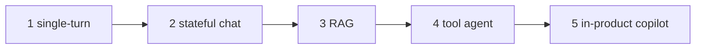
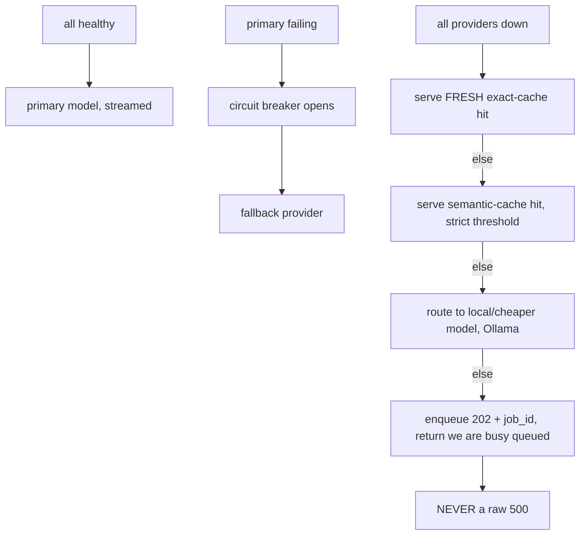

# Lecture 16: The 45-Minute LLM System-Design Method

> An LLM system-design interview is not a test of whether you can name Redis. It is a test of whether you own a **repeatable procedure** — one you can run under a timer, out loud, while a skeptical senior interrupts you. The candidates who fail rarely lack knowledge; they lack a loop. They draw a beautiful box diagram, run out of time, and never reach the token math or the failure story — which is *exactly* where the signal is. This lecture hands you that loop as an executable seven-step procedure with a per-step time budget, so that 45 minutes after "design an LLM support agent" you have covered requirements, architecture, data model, the LLM layer, cost math, degradation, and privacy — in that order, narrating tradeoffs the whole way. After this you can walk into any LLM design prompt and run the same clock.

**Prerequisites:** Lecture 01 (five reference architectures + escalation ladder), the QPS→tokens→quota→$ math (Lecture 14), the gateway stack (Lectures 06–12), GDPR erasure as an architecture constraint (Lecture 05) · **Reading time:** ~26 min · **Part of:** Phase 09 — Architecture & System Design, Week 3

---

## The core idea (plain language)

A system-design interview feels open-ended, so nervous candidates treat it as improvisation. It is the opposite. It rewards the same discipline you apply to your code (Lecture 02): a **fixed control flow with fuzzy leaves.** The *loop* is deterministic and you run it every single time; only the *content* at each step changes with the prompt. Internalize the loop and you stop burning your first five minutes panicking about "where do I start" and start spending your scarce minutes on the parts that carry signal.

The loop has seven steps and a budget. The budget is the entire point — an interview is a **resource-allocation problem under a hard deadline**, and the classic failure is spending 20 minutes drawing boxes and 0 minutes on math:

```
STEP                                    BUDGET   why it carries signal
1  Clarify requirements & scale          5 min   NEVER skip. Wrong assumptions void everything below.
2  Pick & sketch reference architecture   6 min   Shows you climb the ladder, don't cargo-cult agents.
3  Data model — the four stores           5 min   "What lives where + TTL" separates seniors from juniors.
4  The LLM-specific layer                 8 min   Routing/cache/fallback/stream/limits — your actual craft.
5  Back-of-envelope QPS→tokens→quota→$    9 min   PROBED HARDEST. Provider quota is the real wall.
6  Failure & degradation story            7 min   Breaker → fallback → degradation ladder. On-call reality.
7  Privacy / security / GDPR delete       5 min   "How does erasure work in THIS design?" Most skip it.
                                         ─────
                                          45 min  (leave a ~2-min buffer; interviewers interrupt)
```

Two rules govern the whole loop. **First: never skip Step 1.** Every number and box below it is derived from the requirements; assume 10 QPS when they meant 10,000 and your entire design is wrong — and you won't find out until the math step, with no time to recover. **Second: narrate tradeoffs, not boxes.** "I'll use Redis here" is a junior answer. "I'll use Redis for the hot turn buffer because I need single-digit-ms reads and I can afford to lose it on restart since Postgres is the source of truth — the tradeoff is I now own a cache-invalidation and rehydrate path" is a senior answer. The words *because* and *the tradeoff is* are where you earn the level.

---

## How it actually works (mechanism, from first principles)

### Step 1 — Clarify requirements & scale (5 min, never skip)

You are pinning down **four numbers and one class.** Say them out loud and write them in a corner of the board so you can point back to them during the math:

- **QPS** — requests per second, and its *shape*. "1M requests/day" is meaningless until you convert: 1,000,000 ÷ 86,400 s ≈ **11.6 QPS average** — but interactive traffic peaks 3–5× the mean, so you design for **~40–60 QPS peak.** Ask: average vs peak, diurnal or spiky, retry storms?
- **Tenancy** — one org or many? Multi-tenant forces tenant-keyed *everything* (caches, rate limits, retrieval filters) and turns "no cross-tenant leak" from a nice-to-have into a hard invariant.
- **Latency SLO** — what does the user actually feel? For streaming, the number that matters is **TTFT (time to first token)**, not total time. A copilot needs sub-few-hundred-ms TTFT; a research summarizer can take 30 s. This one number decides your model size and how aggressively you cache.
- **Privacy class** — public, business-confidential, or regulated PII/PHI? This decides whether you can hit a public API at all or need a private endpoint (Bedrock/Vertex/Azure OpenAI) with a zero-retention DPA, and it drives all of Step 7.
- **Quality bar & task type** — extraction? open-ended chat? code generation? This decides eval strategy and whether a cheap model suffices.

The move that signals seniority: **state your assumptions explicitly and get a nod.** "I'll assume ~40 QPS peak, multi-tenant B2B, a 300 ms TTFT target, and business-confidential docs — no consumer PII. Does that match?" Now everything downstream is anchored to *agreed* numbers, and if the interviewer corrects one, you adjust before you've wasted a minute.

### Step 2 — Pick & sketch the reference architecture (6 min)

Map the prompt onto the escalation ladder from Lecture 01 and **stop on the lowest rung that meets the requirement.** Say which rung and *why the rung below can't do it*:



Sketch boxes and arrows fast: `client → gateway → (retrieval?) → model → response`, with the state stores hanging off it. Do **not** draw an agent loop unless the task genuinely requires the model to decide *how many* steps and *in what order* at runtime. The interviewer is watching for cargo-culting: a candidate who slaps a multi-agent swarm on "classify support tickets" has failed the judgment test before drawing a single store. Over-engineering signals inexperience, not sophistication.

### Step 3 — Data model: the four stores (5 min)

Name the four stores and, for each, say *what lives there, why that store, and its TTL.* This is the fastest way to show you've built one of these before:

```
Redis        hot turn buffer, rate-limit counters, exact-cache, dedup keys   TTL 1h–24h, volatile
Postgres     users, tenants, messages (source of truth), spend ledger        durable, queryable
Object store PDFs/uploads, raw request/response archives, large blobs        lifecycle policy
Vector store chunked+embedded docs (RAG), long-term semantic memory          reindex on doc change
```

The tradeoff narration here: "Redis is the hot buffer *over* Postgres — on a cache miss I rehydrate from Postgres, so losing Redis costs latency, not data. The vector store is *derived* from the object store, which matters in Step 7 because deletion has to cascade **downhill** through every derived copy." Naming the derived-copy relationship now sets up your GDPR answer later — a small move that makes the whole design feel coherent.

### Step 4 — The LLM-specific layer (8 min)

This is your actual craft, and it's what a generic web-systems candidate cannot do. Cover five sub-topics, each with a tradeoff:

- **Routing / cascade.** A cheap-first cascade sends easy requests to a small model and escalates on a validation failure (bad JSON, low self-rated confidence). Tradeoff: cascades cut cost 3–5× but add tail latency on the escalation path, and you *must* measure the per-tier *resolution* rate or you're flying blind — a cascade that escalates 80% of the time costs *more* than no cascade (Lecture 14).
- **Caching (two layers, tenant-keyed).** An exact-match cache (hash of normalized prompt) catches identical repeats; a per-tenant semantic cache (embed the query, return a hit above cosine ~0.95) catches near-duplicates. **Iron rule: every cache key includes `tenant_id`** — a cross-tenant cache hit is a data leak, not a bug. Tradeoff: a loose semantic threshold serves confidently-wrong answers to similar-but-different questions; start strict and only loosen with eval evidence.
- **Fallback + circuit breaker.** An ordered provider chain (primary → secondary → local) with a breaker that trips after N failures in a window so you fail fast instead of piling up latency. Tradeoff: silent fallback masks outages — **alert on breaker-open,** don't just recover quietly.
- **Streaming.** SSE by default (simpler, proxy-friendly, auto-reconnect); WebSocket only for bidirectional (voice, live collab). The correctness bug to name *unprompted*: **on client disconnect you must abort the upstream provider call,** or you keep paying for tokens nobody reads. Also flag proxy buffering killing TTFT.
- **Limits.** Token-aware rate limits (a token bucket, not a request counter — one 100k-token request must not sail through a "100 req/min" cap) plus a hard monthly spend kill-switch per tenant (return 402 when the cap trips).

### Step 5 — Back-of-envelope QPS → tokens → quota → $ (9 min, probed hardest)

This is where interviews are won and lost. The chain is always the same shape (Lecture 14):

```
QPS × (tokens/request) = tokens/sec  →  ×60 → tokens/min → compare to provider TPM → find the wall
concurrency = QPS × latency  (Little's Law) → sizes your pool/semaphore, NOT your CPU
tokens/month × price = $/month → apply cache (×(1−h)) & cascade (blended price) → the real bill
```

The counter-intuitive punchline you must deliver: **the bottleneck is almost never your CPU — it's the provider's TPM/RPM quota,** which is per-account and shared across every replica. Model it explicitly. Show where a 30% cache hit rate and a cascade (say 70% served by the cheap tier on a *separate* quota) move both the quota wall and the dollar figure. Round aggressively and say so — "call it ~2000 tokens/request, order-of-magnitude" — interviewers want to see you *reason*, not that you memorized a price sheet. Refusing to do the arithmetic is the single strongest negative signal in the loop. The worked example below runs this end to end.

### Step 6 — Failure & degradation story (7 min)

Walk the **degradation ladder**: what does the user get as things fail, top to bottom?



Name the invariant: **degrade *and* alert** — a degradation mode that silently serves stale cache with no ops signal is its own incident, indistinguishable from a slow-motion outage. Also cover the per-tenant **fairness guarantee**: one abusive tenant hits 429/402 while a normal tenant's p95 stays inside SLO ("no tenant starves another"). That fairness proof is a favorite follow-up.

### Step 7 — Privacy / security / GDPR delete (5 min)

Two parts. **Data-flow with trust boundaries:** what leaves your VPC, which providers carry zero-retention/DPA terms, where PII is redacted (before the prompt *and* before logs/traces), and private endpoints for regulated data. **And the question interviewers love because everyone skips it: "walk me through a GDPR delete in *this* design."** The answer must cascade to every *derived* copy (Lecture 05): Postgres rows, all Redis keys under the user's prefix (SCAN, never KEYS), the vector-index rows, and object-storage prefixes — returning a receipt with per-store counts. The classic bug you name to prove you've hit it in production: deleting the Postgres row but leaving the user's text in the **semantic cache** and the **vector index**, where it's still retrievable on a search.

---

## Worked example

**Prompt: "Design a customer-support assistant for a B2B SaaS company."** Here's the loop, compressed to what you'd actually say out loud.

**Step 1 (clarify).** "I'll assume: 2M support queries/month → 2M / 2.6M s ≈ 0.77 QPS average, peak ~3 QPS during business hours. Multi-tenant — a few hundred customer orgs, strict isolation. TTFT target 800 ms (users tolerate a beat for support). Business-confidential — tenants' internal docs plus some customer PII in tickets, so I need redaction and a DPA'd provider or private endpoint. Task: answer from the tenant's knowledge base, escalate to a human on low confidence. Agree?"

**Step 2 (architecture).** "This is **Rung 3, RAG** — not an agent. It needs current, private, per-tenant facts too large to prompt, but it does *not* need to take runtime-decided actions, so I stop at RAG plus a human-handoff branch. `Client → gateway → per-tenant retrieval → grounded prompt → model → answer+citations`, with a confidence gate routing low-confidence answers to a human queue."

**Step 3 (stores).** "Postgres: tenants, tickets, messages, spend ledger. Vector store: per-tenant chunked KB, filtered by `tenant_id` at query time. Redis: hot session + tenant-keyed caches + rate counters, TTL 1h. Object store: original KB docs and raw request archives."

**Step 4 (LLM layer).** "Two-layer tenant-keyed cache — support questions repeat heavily, so I'd expect a healthy hit rate. Cheap-first cascade: a small model answers routine FAQs, escalate to the strong model when retrieval confidence or answer self-score is low. SSE streaming with upstream cancel. Fallback chain primary→secondary→local; breaker on repeated failure. Token-bucket rate limit + monthly spend cap per tenant."

**Step 5 (the math — slow down here).**

```
Peak 3 QPS. Per request: ~2000 input tokens (system + 5 retrieved chunks + question)
            + ~300 output = ~2300 tokens.
tokens/sec at peak = 3 × 2300 = 6,900 tokens/sec = ~414,000 tokens/min.

Provider quota check: a typical paid tier might give, say, ~1–2M TPM (verify per provider —
   order-of-magnitude assumption). 414k TPM sits under a 1M wall with headroom,
   BUT a 3× traffic spike (~1.2M TPM) starts scraping it → quota is the near-term wall, not CPU.
Concurrency (Little's Law) at L≈4s: 3 × 4 = 12 in flight → trivial for one async box.

Cost: 2M req/month × 2300 tokens = 4.6B tokens/month.
   At an assumed blended ~$1 / 1M input + ~$3 / 1M output (verify current prices):
   input  4B  × $1/M = ~$4,000
   output 0.6B × $3/M = ~$1,800   → ~$5,800/month at full price.

Now apply the LLM layer:
   30% cache hit  → provider sees 70% of traffic       → ~$4,060
   cascade: 70% of the remaining on a ~10× cheaper small model
      → strong-model paid volume drops toward ~30%
      → order-of-magnitude, monthly bill lands roughly ~$1,500–2,000.
```

"So caching and the cascade together take the bill from ~$5.8k to roughly ~$1.5–2k — about a 3× cut — *and* pull me clear of the TPM wall. If you push on the spike, I add request coalescing for duplicate in-flight questions and a second provider to spread quota." That paragraph — real arithmetic, the quota wall called out, the levers quantified, prices labeled as assumptions — is what interviewers mean by "the signal is in the math."

**Step 6 (degradation).** "Provider down → breaker opens → fallback provider → then exact cache → semantic cache → local model → else enqueue the ticket to the human queue with a '202, an agent will follow up' message. Never a 500. Alert on breaker-open so we know the primary's down even though users don't feel it. Fairness: a token bucket per tenant means one org blasting the API hits 429 without touching another tenant's p95."

**Step 7 (privacy/GDPR).** "PII in tickets gets redacted before the prompt and before any trace/log. Provider is DPA'd zero-retention, or a private endpoint for regulated tenants. GDPR delete for an end user: cascade-delete Postgres messages/tickets, SCAN+DEL their Redis keys, DELETE their rows from the vector index (memory embeddings *and* any per-user KB), and drop their object-store prefix — return a receipt with counts. The trap I'd avoid is leaving their text in the semantic cache or vector index after clearing the Postgres row."

---

## How it shows up in production

**The interview loop *is* the design-review loop.** This isn't interview theater — the same seven steps are what a real design doc must answer before you build. Teams that skip Step 1 build for 10 QPS and get paged when marketing sends the launch email. Teams that skip Step 5 discover the provider quota wall in production, at 2 a.m., as a wave of 429s while CPU sits at 8%. Teams that skip Step 7 ship a GDPR bug that becomes a legal incident. The clock forces the same prioritization production forces: cover the load-bearing decisions first.

**The math step predicts your actual bill and your actual outage.** "QPS → tokens → TPM → $" is not a trick; it's the capacity plan. The number it produces — *provider quota is the wall, not your CPU* — is the single most common surprise for teams new to LLM systems, because every other backend they've built was CPU- or DB-bound. Model the quota explicitly, alert at ~80% of the TPM limit, and you pre-empt the cliff.

**Narrating tradeoffs is how design reviews actually go.** In a real review, "why Redis and not just Postgres?" *will* be asked. If your only answer is "it's faster," you lose the room. The interview is rehearsal for defending decisions to your future teammates, and the muscle is identical: every box comes with a *because* and a *the tradeoff is*.

**The degradation ladder is your on-call runbook.** The Step 6 ladder — breaker → fallback → cache → local → queue — is literally what your service does at 3 a.m. when a provider has an outage. Designing it in the interview is designing the thing that decides whether the incident is "users saw slightly staler answers" or "total outage, 500s everywhere."

---

## Common misconceptions & failure modes

- **"I'll clarify as I go."** No — you'll build on wrong numbers and only discover it at the math step, with no time to redo the design. Spend the first 5 minutes pinning QPS/tenancy/SLO/privacy *before* drawing anything.
- **"Draw the whole architecture in detail first."** The classic time sink. You'll produce a gorgeous diagram and never reach cost math or the failure story — the two highest-signal steps. Timebox the diagram to ~6 minutes and move on.
- **"Bigger design = better."** Reaching for a multi-agent system on a classification task fails the judgment test. Interviewers reward the *lowest* rung that meets the requirement; over-engineering signals inexperience.
- **"The math is optional / I'll hand-wave it."** This is the step probed hardest and the one most candidates fumble. You don't need exact prices — you need to *run the chain* and land on "quota is the wall, cache+cascade are the levers." Refusing to do arithmetic is the strongest negative signal in the loop.
- **"Cache hits are free wins with no downside."** A cross-tenant cache hit is a data leak; a loose semantic threshold serves confidently-wrong answers. Always say "tenant-keyed" and "start the threshold strict."
- **"Fallback means we're resilient."** Silent fallback that never alerts means you never notice the primary is down until the fallback *also* fails. Degrade *and* alert.
- **"GDPR delete = delete the user row."** The #1 real erasure bug: the user's text survives in the semantic cache and vector index. Erasure must cascade to every *derived* copy, or it isn't erasure.
- **Boxes without tradeoffs.** A diagram with no *because* is a junior answer no matter how many boxes it has. The signal is in the justification, not the drawing.

---

## Rules of thumb / cheat sheet

- **Run the loop every time, in order:** clarify → architecture → data model → LLM layer → math → failure → privacy. Budget ≈ 5/6/5/8/9/7/5 min; keep a 2-min buffer for interruptions.
- **Never skip Step 1.** Pin QPS (average *and* peak — peak ≈ 3–5× mean for interactive), tenancy, TTFT SLO, privacy class, task type. State assumptions and get a nod.
- **Climb the ladder from the bottom.** Stop on the lowest rung that meets the requirement; justify why the rung below can't.
- **Four stores, each with what/why/TTL:** Redis (hot, volatile, TTL'd), Postgres (durable truth), object store (blobs/archives), vector store (RAG + memory, *derived*). Deletion cascades downhill.
- **LLM layer = routing + cache + fallback + streaming + limits.** Tenant-key every cache. Token-bucket, not request-count, limits. Abort upstream on client disconnect.
- **Math chain:** `QPS × tokens/req = tokens/sec → ×60 vs provider TPM → the wall`; `concurrency = QPS × latency`; `tokens/mo × price → $ → ×(1−h) cache, blended cascade price`. **Provider quota is the bottleneck, not CPU.** Round aggressively; label prices as approximate.
- **Degradation ladder:** breaker → fallback → fresh exact cache → semantic cache → local model → queue (202). Never a raw 500. **Degrade *and* alert.**
- **GDPR delete cascades to every derived copy** — Postgres, Redis (SCAN by prefix), vector index, object store — and returns a receipt. Name the semantic-cache/vector-index trap.
- **Every box gets a *because* and a *the tradeoff is*.** That sentence is the level.

---

## Connect to the lab

This lecture *is* the rubric for Week 3's capstone: the **three timed 45-minute mock designs** in `designs/`. Run this exact loop, on a real timer, for the **enterprise RAG assistant** (distinctive constraint: *access-controlled retrieval* — per-tenant, per-user document filters enforced at query time, so Step 4's cache and Step 7's delete both hinge on identity), the **coding copilot** (constraint: *low-latency context harvesting + acceptance telemetry* — Step 1's TTFT budget dominates, forcing a small model plus heavy caching, and Step 6 must never stall the editor), and the **high-volume support-triage agent** (constraint: *async queue + cheap-first cascade + human-in-the-loop* on actions — Step 4 leans on Lecture 09's accept-enqueue-return contract and Step 6's ladder ends at the human queue). Each deliverable must show the architecture diagram, data model, LLM-layer plan, the QPS→tokens→quota→$ math, and a failure+privacy section — timestamped as done inside 45 minutes.

## Going deeper (optional)

- **Chip Huyen — *AI Engineering* (2024/2025)** — the reference-architecture and capacity-planning framing for LLM apps; the best single book for this loop.
- **Anthropic — *Building effective agents*** — the workflow-vs-agent spine that governs Step 2's escalation discipline. Search: "Anthropic building effective agents". Root: `anthropic.com`.
- **Google SRE Book — *Handling Overload* / graceful degradation** (`sre.google/books`) — the canonical treatment of degradation ladders and load shedding behind Step 6.
- **Provider pricing & rate-limit docs** — check *current* numbers before quoting them: `platform.openai.com/docs` (rate limits, pricing), `docs.anthropic.com` (rate limits, Message Batches, prompt caching). Never quote a price from memory in a real design.
- **System-design interview canon** — Alex Xu's *System Design Interview* volumes for the general loop (QPS/estimation/tradeoff-narration) that this lecture specializes to LLMs. Search: "system design interview capacity estimation back of the envelope".
- **Search queries to keep handy:** "LLM system design interview tokens per second TPM", "back of the envelope LLM cost estimation", "GDPR right to erasure vector database delete", "circuit breaker fallback LLM gateway", "graceful degradation LLM outage cache".

## Check yourself

1. You're given "1 million requests per day" for an interactive chat product. What peak QPS do you design for, and why isn't the average the right number?
2. An interviewer says "just get to the interesting part, skip the requirements." Why do you (politely) refuse, and what specifically do you pin down first?
3. In the math step you compute 6,900 tokens/sec at peak. What do you compare that against to find the real bottleneck, and why is it usually *not* your server capacity?
4. Give the full degradation ladder for a RAG assistant when all providers are down, and name the one operational rule that must accompany it.
5. "Our GDPR delete removes the user's Postgres row." What's the bug, and which two stores are most commonly missed?
6. What's the difference between a junior and a senior answer to "why Redis here?" — express it as a sentence template.

### Answer key

1. Convert: 1,000,000 ÷ 86,400 ≈ **11.6 QPS average**, but interactive traffic peaks ~3–5× the mean (diurnal + bursty), so design for **~35–60 QPS peak**. The average under-provisions you for the busy hour — exactly when you'd get paged; capacity is sized to peak, not mean.
2. Because every number and box below Step 1 is *derived* from the requirements — wrong assumptions void the entire design, and you won't discover it until the math step with no time to recover. Pin the four numbers and one class: **QPS (avg + peak), tenancy, TTFT/latency SLO, privacy class** (plus quality bar/task type). State them as assumptions and get agreement before drawing.
3. Compare 6,900 tokens/sec (≈ 414k tokens/min) against the **provider's TPM (tokens-per-minute) quota**, and RPM against your QPS. It's usually not server capacity because a gateway forwarding requests is I/O-bound and cheap to scale horizontally, whereas the provider imposes a hard TPM/RPM ceiling on your account — you hit *their* wall long before *your* CPU.
4. Breaker opens → **fallback provider** → **fresh exact-cache hit** → **semantic-cache hit (strict threshold)** → **local/cheaper model (Ollama)** → **enqueue (202 + job_id, "we're busy/queued")** — never a raw 5xx. The rule that must accompany it: **degrade *and* alert** — silently serving stale cache with no ops signal is its own incident; alert on breaker-open so you know the primary is down even though users don't feel it.
5. The bug: erasure must cascade to every *derived* copy of the user's text, not just the row of record. Deleting only Postgres leaves retrievable copies behind. The two most commonly missed: the **vector index** (embedded memories/docs) and the **semantic cache** (cached responses containing their text) — both still return the user's data on a search/lookup. Also sweep Redis (SCAN by prefix) and object-store prefixes; return a receipt with per-store counts.
6. Junior: states the choice ("Redis, it's fast"). Senior: states the choice **with a reason and its cost** — template: *"I'll use X **because** \<requirement it satisfies>, and **the tradeoff is** \<what it costs / what I now maintain>."* E.g. "Redis for the hot turn buffer because I need single-digit-ms reads, and the tradeoff is it's volatile, so I maintain a rehydrate-from-Postgres path on cache miss."
