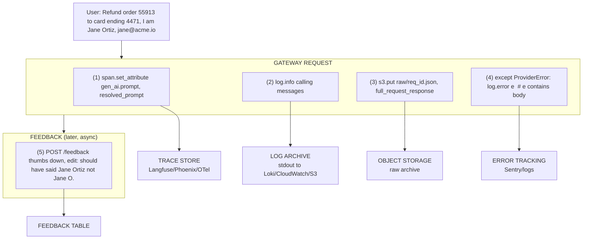
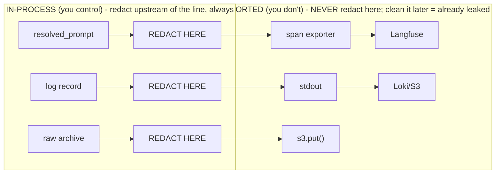

# Lecture 17: PII Redaction Across the Observability and Feedback Pipeline

> You spent Week 1 building a bulletproof GDPR cascade delete: Postgres, Redis, the vector index, object storage — all purged, proven by a test. Then in Week 3 you added tracing, and in one afternoon you quietly re-created the exact leak you worked so hard to kill. Every span now carries the *resolved prompt* — the one with the user's real name, order number, and card tail baked in — and it's sitting in Langfuse, in your log archive, in the error stack traces, and in the feedback table, none of which your delete knows about. The observability stack is the sneakiest PII leak in the whole system precisely because it's the part you added *to be responsible*. This lecture teaches you where PII enters traces, logs, archives, and feedback; how to redact at each entry point (and why "clean it later in the sink" is a trap); how to choose between tokenization, masking, and allow-list capture; and how to make every observability sink either PII-free or delete-addressable — because those are the only two states that are compliant.

**Prerequisites:** Lecture 5 (GDPR cascade delete), the four-tier storage model (Lecture 3), OpenTelemetry span basics, "treat stored text as data not decoration" · **Reading time:** ~28 min · **Part of:** Phase 09 — Architecture & System Design, Week 3

---

## The core idea (plain language)

Observability is a **second copy machine bolted onto the first one.** Lecture 5 taught you that a user message forks into Postgres, Redis, the vector index, and object storage. Observability forks it *again* — into spans, structured logs, raw request/response archives, error messages, and feedback records. And it does so with a fatal twist: these copies are created by code whose entire job is to **capture everything faithfully for debugging.** Faithful capture and PII minimization are in direct tension, and by default faithful capture wins.

The reframing that makes this tractable:

> **Every observability sink is a derived store. It is subject to the exact same two-part obligation as any other store: either it contains no PII, or it is indexed by `user_id` so your erasure can reach it. There is no third option. "It's just logs" is not a third option.**

That is the whole lecture in one sentence. Everything below is (a) *where* the PII sneaks in, (b) *how* to strip it or key it, and (c) *when* — which turns out to be the part everyone gets wrong.

The "when" has a name: **redact at the source, before the copy is made.** Not in the sink. Not in a nightly scrubber job. The moment a span is exported or a log line is flushed, that PII has left your process and landed in a system (Langfuse, Datadog, S3, an APM vendor) that you no longer fully control — replicated, indexed, backed up, and possibly sitting on someone else's infrastructure under a data-processing agreement you didn't read carefully. Redaction is only trustworthy if it happens *upstream of the export boundary.*

---

## How it actually works (mechanism, from first principles)

### The five entry points

Trace one request through your Week-2 gateway and mark every place user bytes get copied into observability:



Five sinks, five PII entry points. Let's take each on its own terms, because the right redaction strategy differs per sink.

#### (1) The resolved-prompt span attribute — the worst offender

The OpenTelemetry GenAI semantic conventions define attributes like `gen_ai.prompt` and `gen_ai.completion`. The whole *value* of a trace for debugging is that it captures the **resolved** prompt — after your template variables (`{user_name}`, `{order_id}`, retrieved RAG chunks) are substituted in. That resolved string is, by construction, maximally full of PII. A template like `"You are helping {user_name} ({email}) with order {order_id}."` is harmless; its resolved form is a PII bomb.

This is *the* trap called out in the Week 3 spine: **tracing that logs the raw prompt with PII into your observability tool.** The fix is to redact the string *before* `span.set_attribute` is called — inside your `tracing.py` wrapper, not in Langfuse's UI settings (which are best-effort and vendor-specific).

#### (2) Logs — the accidental sink

Nobody *decides* to log PII. It arrives through:
- `log.info(f"request payload: {messages}")` during a 2am debugging session that never gets removed.
- Framework loggers (SQLAlchemy echo, HTTP client debug logs) dumping request bodies at `DEBUG`.
- Exception formatters that pretty-print the offending object — which is the full request.

Logs are the sneakiest because they're *unstructured* and *ubiquitous*. You cannot enumerate every log call. This is why for logs the correct posture is **allow-list, not deny-list**: log structured fields you explicitly chose (`request_id`, `tenant_id`, `model`, `token_count`), and make it *hard* to log free text.

#### (3) Raw request/response archives — the deliberate copy

Sometimes you genuinely want the raw bytes: replaying failures, building eval sets, debugging a "the model said something insane" report. Teams write these to object storage keyed by request id. This is the highest-fidelity PII copy in your system — it's the *entire* request and response, verbatim. Two disciplines apply: redact before the `put`, **and** key the object path by `user_id` so erasure can find it (`raw/{user_id}/{req_id}.json`, never `raw/{req_id}.json`).

#### (4) Error messages — PII smuggled in exception payloads

`ProviderError("400 Bad Request: {\"messages\":[{\"content\":\"Refund order 55913...\"}]}")` — the provider echoed your request body back in the error, and now your `except` block logs the whole exception, PII and all. Error trackers (Sentry) then **group and store** these, sometimes indefinitely, and index them for search. Error text needs the same redaction pass as prompts, and error tracker retention needs to be finite.

#### (5) Feedback text and edits — user-authored PII

Feedback is uniquely dangerous because the PII is **fresh and unpredictable.** A thumbs-down is fine. But the free-text comment ("this is wrong, my actual account is 88123 and my name is spelled Ortíz") and especially the **suggested edit** (where the user rewrites the model's answer, often pasting in their real details) are new PII you never saw in the prompt. And feedback is the one store you're *most* tempted to keep forever — it's your training data flywheel. Keep it, but redact the free text and key it by `user_id`.

### The redaction-strategy menu

Three strategies, with different tradeoffs. Choose per-field, not globally.

| Strategy | What it does | Example | Reversible? | Preserves debuggability? |
|---|---|---|---|---|
| **Masking** | Replace match with a fixed token | `4471` → `[CARD]` | No | Low — you lose the value entirely |
| **Deterministic tokenization** | Replace match with a stable pseudonym (same input → same token) | `jane@acme.io` → `EMAIL_a3f9` | Yes, if you keep a vault (else no) | Medium — you can correlate "same user across traces" without knowing who |
| **Allow-list field capture** | Never capture free text; emit only pre-approved structured fields | Emit `{order_id_present: true, tenant: "acme"}` | N/A | High for *what you chose*, zero for the rest |

**Masking** is the simplest and the safest default for free text you can't structure. `[EMAIL]`, `[PHONE]`, `[CARD]`, `[PERSON]`. You lose the value, which is fine for logs and prompts where you mostly need shape, not content.

**Deterministic tokenization** is the clever middle. Because the *same* email always maps to the *same* token, you can still answer "did this same user hit the error twice?" and "which traces belong to one session?" — analytics that need *correlation* but not *identity*. The cost: if you keep a reverse map (token → real value) you've just created *another* PII store to delete from; if you don't, it's irreversible like masking but correlatable. Format-preserving/keyed hashing (HMAC with a per-deployment secret) is the usual implementation. **Rotate the key and the correlation breaks — sometimes that's the point (limits linkability window), sometimes it's a footgun (breaks your longitudinal analysis).** Decide deliberately.

**Allow-list field capture** is the strongest and the one experts reach for on the hot path. Instead of capturing the prompt and trying to scrub it (deny-list — you'll always miss a pattern), you flip the default: capture *nothing* free-form, and emit only a curated set of structured attributes. The span carries `prompt_tokens: 812`, `template_version: "v7"`, `rag_chunk_ids: [...]`, `pii_types_detected: ["email","order_id"]` — enough to debug cost, latency, routing, and *shape* — but never the resolved string itself. When you truly need the content, you fetch it from the source-of-truth store (Postgres, already access-controlled and delete-addressable) via the `request_id`, rather than duplicating it into the trace.

> **Deny-list (regex scrub the prompt) fails open: the one PII pattern you didn't write a regex for sails straight through. Allow-list (only emit approved fields) fails closed: a field you forgot to add is simply absent, not leaked. On the hot path, prefer fail-closed.**

### Where to run redaction: the export boundary is the line



The rule: **redaction must run before the byte crosses the export boundary** — the point where the data leaves your process's memory and enters a system that persists, replicates, and indexes it. Concretely:

- **Traces:** redact inside an OpenTelemetry `SpanProcessor` (`on_start`/`on_end`) or your `tracing.py` helper, *before* the batch exporter fires. Not in Langfuse's masking config — that's a fallback, not a control, and it's specific to one vendor.
- **Logs:** install a redaction `logging.Filter` on the root logger so *every* handler gets scrubbed output, before it's written to stdout/file.
- **Archives:** redact in the function that builds the archive dict, before `s3.put`.
- **Errors:** redact in a global exception hook / `before_send` (Sentry has exactly this) before the event is transmitted.

Why not "clean it later in the sink"? Because the instant it's exported: (1) it's replicated to the vendor's storage and backups you can't reach; (2) it's indexed and searchable by anyone with dashboard access; (3) your GDPR clock is already running against a copy you don't control; (4) the vendor's retention, not yours, now governs it. A nightly scrubber is racing against replication it will always lose.

### The GDPR intersection: derived copies, again

Here's where this lecture snaps back onto Lecture 5. Your trace store, log archive, and feedback table are **derived copies** — exactly the category Article 17 erasure must cascade to. So each observability sink faces a binary choice, and you must pick one *per sink, deliberately*:

**Option A — Redact PII out entirely.** If the sink genuinely contains zero PII (allow-list fields only, everything masked), then erasure doesn't need to touch it. This is the cleanest — the sink drops out of your cascade-delete scope. Best for high-volume, low-value-per-record sinks like traces and logs, where you don't need the content and the volume makes per-user deletion expensive anyway.

**Option B — Index by `user_id` for deletion.** If you *must* keep PII (raw archives for eval, feedback edits for training), then every record must carry `user_id` so your Lecture-5 cascade delete can `DELETE ... WHERE user_id = ?` or scan-and-purge the prefix. Best for low-volume, high-value sinks.

> **The failure mode is picking *neither*: a trace store full of resolved prompts (PII) with no `user_id` attribute (not delete-addressable). Now you're non-compliant *and* you can't fix it without a full re-index. Every sink must be assigned A or B, in writing, on day one.**

Note that traces are often *technically* keyed by `trace_id`, and `trace_id` maps to `request_id` maps to `user_id` in Postgres. That's a valid Option B path — *if* you can enumerate a user's `trace_id`s at delete time and *if* your trace vendor supports deletion by attribute. Many don't support bulk delete-by-attribute well, which is exactly why Option A (redact so you never have to delete) is the pragmatic default for traces.

---

## Worked example

One request through the gateway. User message:

```
"Refund order 55913 to the card ending 4471. I'm Jane Ortiz, jane@acme.io, +1-415-555-0132."
```

Resolved prompt sent to the model (template + RAG context):

```
System: You are a support agent for AcmeCorp. Customer: Jane Ortiz (jane@acme.io,
+1-415-555-0132). Prior orders: 55913 ($240, card *4471), 55801 ($90).
User: Refund order 55913 to the card ending 4471.
```

**Naive tracing (the trap):**

```python
span.set_attribute("gen_ai.prompt", resolved_prompt)   # ← 5 PII items exported to Langfuse
log.info(f"prompt: {resolved_prompt}")                  # ← same 5 items to log archive
s3.put_object(Key=f"raw/{req_id}.json", Body=raw)       # ← full copy, no user_id in key
```

PII count leaked, per request: **1 name + 1 email + 1 phone + 1 card tail + 2 order ids ≈ 6 items × 3 sinks = 18 exposures**, none delete-addressable. At 50 QPS that's ~2.6M PII exposures/day into systems your erasure can't reach.

**Fixed with allow-list on the span + masking on any retained free text:**

```python
# tracing.py — allow-list what the span carries; content is NOT one of the fields
span.set_attribute("gen_ai.request.model", model)
span.set_attribute("gen_ai.usage.input_tokens", 812)
span.set_attribute("template_version", "v7")
span.set_attribute("rag_chunk_ids", ["ord-55913", "ord-55801"])  # ids, not contents
span.set_attribute("pii_types_present", ["person","email","phone","card","order_id"])
span.set_attribute("request_id", req_id)   # ← fetch content from Postgres if ever needed
# NOTE: no gen_ai.prompt / gen_ai.completion free text on the span at all.
```

```python
# redact.py — masking pass for anything that MUST retain free text (feedback, archives)
import re
PATTERNS = {
    "EMAIL":  r"[\w.+-]+@[\w-]+\.[\w.-]+",
    "PHONE":  r"\+?\d[\d\-\s()]{7,}\d",
    "CARD":   r"\b(?:\d[ -]*?){13,16}\b",
}
def mask(text: str) -> str:
    for tag, pat in PATTERNS.items():
        text = re.sub(pat, f"[{tag}]", text)
    return text
# "jane@acme.io, +1-415-555-0132" -> "[EMAIL], [PHONE]"
```

```python
# archive: key by user_id (Option B — we keep it for eval, so it must be deletable)
s3.put_object(Key=f"raw/{user_id}/{req_id}.json", Body=mask_json(raw))
```

Result per request: span carries **0** free-text PII items (Option A — falls out of delete scope). Archive is masked *and* keyed by `user_id` (Option B — in delete scope, `DELETE raw/{user_id}/*`). Feedback text is masked before insert and the row carries `user_id`. Erasure now has a defined, reachable target for every sink, and the highest-volume sink (traces) needs no per-user deletion at all.

A note on **regex limits**: the masking above catches structured PII (email/phone/card) reliably but will *miss* free-form names ("I'm Jane Ortiz") — regex can't reliably find names. That's precisely why names should be handled by allow-list (never capture the free text) or an NER-based redactor (Microsoft Presidio) rather than pretending a regex covers it. Deny-list masking is a backstop, not the primary control.

---

## How it shows up in production

- **The compliance-audit surprise.** Six months in, a customer exercises their right to erasure. Your Lecture-5 cascade delete passes its test — Postgres, Redis, vectors, object storage all clean. Then someone searches Langfuse for the user's email and their full conversation history appears. The delete test never covered the trace store because nobody classified it as a derived copy. This is the single most common way "we're GDPR compliant" turns out false.

- **Latency of the redaction pass.** Redaction runs on the hot path, per request. Regex over an 800-token prompt (~4KB) is ~sub-millisecond; NER (Presidio/spaCy) can be **10–50ms** — real money at 50 QPS. Mitigations: allow-list capture (no scanning needed — you never touch the content), run heavy NER only on the async archive/feedback path (not the synchronous trace path), or cache compiled patterns. *(Numbers approximate — measure your own.)*

- **Vendor retention outlives your intent.** Datadog, Sentry, and APM tools have their own retention (often 15–90 days, sometimes configurable, sometimes not on your plan). If PII reached them, *their* retention governs it, and their backups may outlive even that. This is why "redact before export" is non-negotiable: once it's at the vendor, your delete is at their mercy.

- **Sampling gives false comfort.** Trace sampling (keep 1%) does not make you compliant — 1% of PII is still PII, and now it's *unpredictable which* users leaked, which is worse for audit. Sample for cost, redact for compliance; they're orthogonal.

- **The feedback goldmine turns radioactive.** The team wants to fine-tune on thumbs-down + edits. Great data — except the edits are stuffed with users' real corrected details, unredacted, and now sitting in a training set that will be *memorized by a model* and potentially regurgitated. Redaction of feedback text is not optional if that data ever touches training.

- **Debugging with masked traces still works — mostly.** Engineers panic that redaction destroys debuggability. In practice, `pii_types_present`, token counts, `template_version`, `rag_chunk_ids`, and timing tell you 90% of what you need. For the other 10% you fetch the (access-controlled, delete-addressable) source record by `request_id`. The rare "I need the exact bytes" case is a *privileged, audited* lookup, not a default in every dashboard.

---

## Common misconceptions & failure modes

- **"It's just logs / traces, not the database."** Legally and practically identical. A retrievable copy is a retained copy. Observability sinks are derived stores, full stop.

- **"We'll scrub it in the sink / with a nightly job."** You're racing replication you can't win. Once exported, it's replicated, indexed, backed up, and possibly off your infra within seconds. Redact upstream of export or don't bother.

- **"Regex redaction covers PII."** Regex handles *structured* PII (email/card/phone) decently and *unstructured* PII (names, addresses, free-form account references) barely at all. Deny-list regex fails open. Use allow-list as the primary control; regex/NER as backstops.

- **"We masked the prompt, so we're done."** You forgot the *completion* (the model may echo PII back), the *error messages* (provider echoes your body), and the *feedback edits* (fresh user PII). All five entry points, not just the prompt.

- **"Tokenization means we can keep everything."** Only if you accept either a reverse-map vault (now another store to secure and delete from) or irreversibility. And a token store keyed to real identities is itself PII under most readings. Tokenization buys correlation, not a compliance exemption.

- **"The trace has a trace_id, so delete can find it."** Only if you can enumerate a user's trace_ids *and* your vendor supports bulk delete-by-attribute. Many don't. Verify the deletion path exists before you rely on Option B for traces.

- **Provider echo in errors.** A 4xx from the provider often contains your request body verbatim. `log.error(exception)` then leaks it. Redact exception payloads too.

- **The un-keyed archive.** `raw/{req_id}.json` with no `user_id` in the path is PII you cannot delete without a full scan. Design the key namespace for erasure the same way Lecture 5 designed Redis key prefixes.

---

## Rules of thumb / cheat sheet

- **Every observability sink is either PII-free (Option A) or `user_id`-keyed (Option B). Assign one, in writing, per sink. "Neither" = non-compliant and unfixable.**
- **Redact before the export boundary.** SpanProcessor before exporter; logging.Filter on root logger; before `s3.put`; Sentry `before_send`. Never "later in the sink."
- **Hot path → allow-list capture (fail-closed). Free text you must keep → masking. Correlation without identity → deterministic tokenization.**
- **Never put `gen_ai.prompt`/`gen_ai.completion` *content* on a span by default.** Emit shape (tokens, `pii_types_present`, `template_version`, `request_id`); fetch content from the source store on demand.
- **Redact all five entry points:** resolved prompt, completion, raw archive, error/exception text, feedback text + edits. The completion and the edits are the two everyone forgets.
- **Key raw archives `raw/{user_id}/{req_id}.json`**, never flat by req_id.
- **Regex for structured PII (email/card/phone); NER (Presidio) or allow-list for names/addresses.** Regex alone fails open on names.
- **Run heavy NER on async paths (archive/feedback), keep the synchronous trace path allow-list-only** to protect TTFT.
- **Sampling ≠ redaction.** Sample for cost; redact for compliance. Independent knobs.
- **Add the trace/log/feedback stores to your Lecture-5 delete test.** If the erasure test doesn't assert zero residue in observability, it's incomplete.
- **Finite retention on error trackers and log archives.** PII half-life should be bounded even in Option B sinks.

---

## Connect to the lab

This is the correctness spine of Week 3's Lab step 1 (tracing) and step 3 (feedback + versioning). When you add OpenTelemetry/Langfuse spans, wire redaction into `tracing.py` *before* the exporter — emit allow-listed attributes (`model`, tokens, cost, TTFT, `cache_layer`, `route_tier`, `tenant_id`, `pii_types_present`) and **not** the resolved prompt content. When you build `POST /feedback`, mask the free-text comment and edit before insert and store `user_id` on the row. Then go back to Lecture 5's `test_gdpr_delete.py` and extend it: after delete, assert the trace store, log archive, and feedback table return zero for the user (or, for Option-A sinks, assert they never contained PII to begin with). A green cascade-delete test that ignores observability is a false green.

---

## Going deeper (optional)

- **OpenTelemetry GenAI semantic conventions** — the source of `gen_ai.prompt`/`gen_ai.completion` and the guidance on content capture being opt-in/sensitive. Search: "OpenTelemetry GenAI semantic conventions" (opentelemetry.io).
- **Microsoft Presidio** — open-source PII detection + anonymization (NER + regex + custom recognizers), the standard build-your-own redactor. Repo: github.com/microsoft/presidio.
- **Langfuse masking docs** — vendor-side masking hook; useful as a *backstop*, and a good model for where the redaction seam goes. Search: "Langfuse masking data".
- **Sentry `before_send` / data scrubbing** — the canonical "redact before transmit" hook for error trackers. Search: "Sentry before_send scrubbing sensitive data".
- **GDPR Article 17 (right to erasure)** and **Article 5(1)(c) data minimisation** — the two obligations this lecture serves. Search: "GDPR Article 17 right to erasure", "GDPR data minimisation".
- **NIST tokenization / pseudonymization guidance** — for the deterministic-tokenization tradeoffs (reversible vault vs irreversible). Search: "NIST pseudonymization tokenization guidance".
- Search queries: "PII redaction observability pipeline", "OpenTelemetry span attribute redaction processor", "log scrubbing filter python PII", "fail-closed allow-list logging".

---

## Check yourself

1. Why is redacting "later in the sink" (e.g., a nightly scrubber on the trace store) fundamentally unreliable, and where must redaction run instead?
2. You have two sinks: a 50-QPS trace stream and a low-volume feedback table you want for training. Which redaction strategy and which GDPR option (A: redact-out, B: index-by-user_id) fits each, and why?
3. Deny-list regex vs allow-list field capture: which fails open, which fails closed, and why does that make allow-list the better hot-path default?
4. Deterministic tokenization lets you correlate a user across traces without storing their identity. What's the hidden cost, and what does rotating the tokenization key do?
5. Name three PII entry points into observability beyond the resolved prompt attribute.
6. Your Lecture-5 cascade-delete test is green. Give a concrete scenario where the user's PII is still retrievable, and how you'd close it.

### Answer key

1. Once a record is exported it's replicated, indexed, backed up, and often on a vendor's infrastructure within seconds — a scrubber races replication it can't win, and vendor retention (not yours) now governs the copy. Redaction must run **before the export boundary**: in a SpanProcessor before the exporter, a logging.Filter on the root logger, before `s3.put`, or in Sentry's `before_send`.

2. Trace stream → **Option A + allow-list capture**: emit shape (tokens, `pii_types_present`, `template_version`, `request_id`) and no free-text content, so it holds zero PII and drops out of delete scope; per-user deletion at that volume would be expensive and many vendors don't support delete-by-attribute anyway. Feedback table → **Option B + masking**: you must keep the content for training, so mask free text (backstop) and key every row by `user_id` so erasure can `DELETE WHERE user_id = ?`.

3. Deny-list (regex-scrub the prompt) **fails open** — any pattern you didn't anticipate passes through as raw PII. Allow-list (emit only approved fields) **fails closed** — a field you forgot is simply absent, never leaked. On the hot path you want the failure mode that leaks nothing, so allow-list is the default; regex/NER are backstops for text you must retain.

4. Hidden cost: if you keep a reverse map (token → real value) you've created *another* PII store to secure and delete from; if you don't, it's irreversible like masking. Rotating the key **breaks correlation** — the same user now maps to a different token — which bounds linkability (good for privacy) but destroys longitudinal analysis across the rotation (bad if you needed it). Decide deliberately.

5. Any three of: the model **completion/response** (may echo PII back), **raw request/response archives** in object storage, **error/exception messages** (providers echo your request body in 4xx errors), and **feedback free-text comments and edits** (fresh user-authored PII).

6. Scenario: the delete purged Postgres, Redis, vectors, and object storage, but the **trace store** was never classified as a derived copy — so resolved prompts containing the user's email are still searchable in Langfuse, and/or the **feedback edits** with their corrected details are still in a table with no `user_id` filter applied. Close it by assigning every observability sink Option A (redact-out) or Option B (index-by-`user_id`), and extending `test_gdpr_delete.py` to assert zero residue in the trace/log/feedback stores (or that they never held PII).
