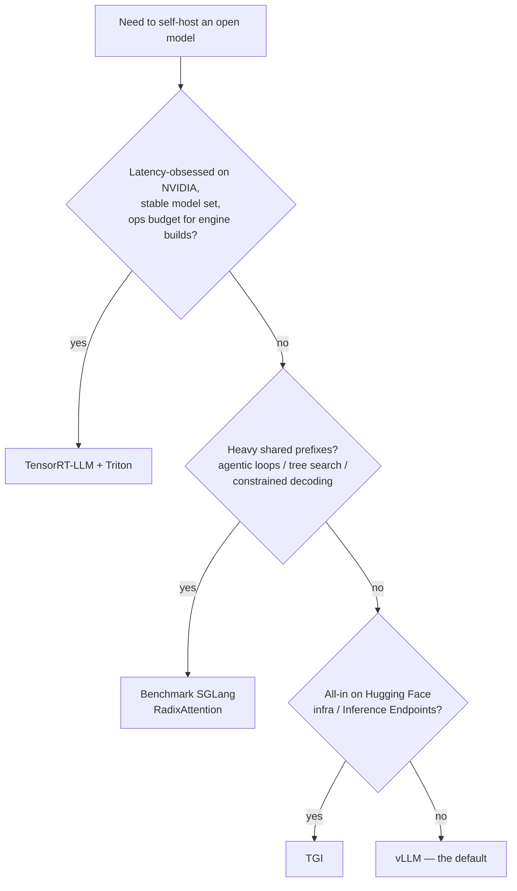

# Lecture 1: The inference engine landscape — why vLLM (and when it isn't)

> You already know how to *call* an LLM. This lecture is about *serving* one — the moment you stop renting somebody's HTTP endpoint and put a GPU under your own desk. The first instinct of every competent engineer is wrong here: wrapping Hugging Face `model.generate()` in a Flask route and calling it a server. That design leaves 80–95% of your very expensive GPU idle. This lecture explains *why* naive serving wastes the card, surveys the four inference engines actually worth deploying in 2025–2026, and hands you a crisp buy-decision for each so you never have to relitigate the choice. After this you can walk into any team, name the right engine for their workload in one sentence, and defend it — and you'll know why picking wrong is cheap to undo.

**Prerequisites:** comfort with `docker run`, `curl` against `/v1/chat/completions`, the OpenAI Python client, and rough GPU/VRAM literacy (a 7B model in fp16 ≈ 14GB). · **Reading time:** ~22 min · **Part of:** Phase 10 (LLMOps) Week 1

## The core idea (plain language)

An LLM inference engine is a piece of infrastructure whose entire job is to keep a GPU that costs $1–$40/hour as busy as physically possible while serving many users at once. That's it. Everything an engine does — batching, KV-cache management, prefix reuse, quantization — is in service of one number: **tokens per second per dollar**, without blowing your latency SLO.

The naive approach fails because a single generation request cannot fill a GPU. Decoding one token at a time is *memory-bandwidth-bound*: the GPU spends most of its time reading weights out of VRAM, and its arithmetic units sit mostly idle. If you serve one request at a time, you pay for a Ferrari and drive it at walking pace. The fix is to run many sequences through the model *simultaneously* — but doing that well is surprisingly hard, and that difficulty is exactly why dedicated engines exist.

The good news, and the thread running through this whole lecture: **all four serious engines speak the OpenAI wire format.** They expose `/v1/chat/completions` and friends, so your app code, your LiteLLM gateway, and your eval harness don't care which one is behind the socket. That makes the engine choice a *reversible* decision. You will pick vLLM as your default, and you will sleep fine knowing that if you're wrong, switching is a `base_url` change and a redeploy — not a rewrite.

## How it actually works (mechanism, from first principles)

### Why naive `generate()` in a loop wastes the GPU

Consider the obvious server: a request comes in, you call `model.generate()`, you return the text, repeat. Two things kill you.

**Problem 1 — static batching.** Suppose you *do* try to batch. You collect, say, 8 requests, run them together, and return when all 8 finish. The problem is that requests finish at wildly different times. One user asked for a 5-token "yes/no"; another asked for a 2,000-token essay. In static batching, the short request's slot in the batch is *held hostage* until the longest request in the batch completes.

```
Static batching (batch of 4). Each column = one decode step. ▓ = doing useful work, · = idle but occupying a slot.

seq A (needs 3 tokens):  ▓ ▓ ▓ · · · · · · ·   <- done at step 3, wastes steps 4-10
seq B (needs 5 tokens):  ▓ ▓ ▓ ▓ ▓ · · · · ·   <- done at step 5, wastes steps 6-10
seq C (needs 10 tokens): ▓ ▓ ▓ ▓ ▓ ▓ ▓ ▓ ▓ ▓
seq D (needs 2 tokens):  ▓ ▓ · · · · · · · ·   <- done at step 2, wastes steps 3-10

Useful work = 3+5+10+2 = 20 token-slots.  Reserved = 4 seqs × 10 steps = 40.  Utilization = 50%.
```

And a new request that arrives at step 1 can't join — it waits for the whole batch to drain. That's *queueing latency* stacked on top of *wasted compute*.

**Problem 2 — one contiguous KV cache buffer per sequence.** As the model generates, it caches the key/value tensors for every token it has seen (the "KV cache") so it doesn't recompute attention over the whole prefix each step. Naive engines allocate that cache as **one contiguous block sized for the maximum possible sequence length**, up front, per sequence. If your model supports 8,192 tokens of context, every in-flight request reserves 8,192 tokens' worth of KV memory even if it only ends up using 50. You run out of VRAM at maybe 4–8 concurrent sequences — while most of the reserved memory is never touched. This is *internal fragmentation*, and it's the concurrency killer.

### The two mechanisms that fix it

**Continuous batching (iteration-level scheduling).** Instead of scheduling a whole batch and waiting for it to finish, the engine makes a scheduling decision *every single decode step*. When a sequence emits its end-of-sequence token, its slot is freed *that step* and a waiting request drops in. There is no "batch boundary" to wait for.

```
Continuous batching. New requests join and finished ones leave every step.

slot 1: A A A [E E E E E ...]   A finishes at step 3, E immediately takes the slot
slot 2: B B B B B [F F F ...]   B finishes at step 5, F joins
slot 3: C C C C C C C C C C
slot 4: D D [G G G G G G G G]   D finishes at step 2, G joins

The GPU is doing useful work in ~every slot, every step. Utilization approaches 100%.
```

This one change is the biggest single lever over a request-per-call loop, and it's why continuous-batching engines routinely hit **5–20× the throughput** of naive HF serving on the same hardware (approximate, workload-dependent).

**Paged KV cache (PagedAttention).** Borrow the trick operating systems use for RAM: don't demand one big contiguous buffer, hand out small fixed-size *blocks* (pages) on demand, and keep a lookup table mapping each sequence's logical token positions to physical blocks. A sequence that generates 50 tokens uses ~4 blocks; it never reserves space for 8,192. Fragmentation collapses from ~60–80% waste to a few percent, and you pack *far* more concurrent sequences into the same VRAM. This is what vLLM introduced and what everyone else now has a version of.

A useful corollary falls out for free: because the KV cache is paged, **identical prompt prefixes can share physical blocks.** If 500 chat requests all start with the same 1,000-token system prompt, you compute and store that prefix's KV *once*. That's *automatic prefix caching*, and it's the seed of the SGLang story below.

## Worked example

Take a 7B model on a single 24GB card (an A10 or L4). Model weights in fp16 ≈ 14GB. That leaves ~10GB for KV cache after you reserve headroom for activations and CUDA graphs (this is what `--gpu-memory-utilization 0.90` controls — it's a *fraction of the card*, not gigabytes).

Say this model's KV cache costs roughly **0.5 MB per token** (a rough figure — the real number comes from `2 × n_layers × n_kv_heads × head_dim × 2 bytes`, which you'll compute by hand in Week 2). Then 10GB of KV budget ÷ 0.5 MB ≈ **20,000 token-slots** of cache.

- **Naive contiguous allocation, max_model_len = 8,192:** every sequence reserves 8,192 slots regardless of use. 20,000 ÷ 8,192 ≈ **2 concurrent sequences.** Your $0.40/hr card serves two users. If your average completion is 200 tokens, ~97.5% of each reserved buffer is dead weight.
- **Paged allocation, average real usage ~500 tokens/sequence:** 20,000 ÷ 500 ≈ **40 concurrent sequences.** Same card, same model, **20× the concurrency** — purely from not reserving space you don't use.

Now layer prefix caching on top. Those 40 sequences share a 1,000-token system prompt. Without sharing that's 40 × 1,000 = 40,000 token-slots of duplicated prefix cache you can't afford. With sharing it's 1,000 slots, computed once — and the *prefill* work for that prefix happens once instead of 40 times, which slashes time-to-first-token for every request after the first. This is the exact mechanism you'll measure in the Week 1 lab's prefix-caching experiment.

The takeaway to burn in: **KV cache, not weights, usually caps your concurrency**, and the engine's job is to manage that cache without waste.

## The four engines and the buy-decision

All four do continuous batching and paged KV cache. They differ in adoption, ergonomics, format support, and where they're fastest. Here's the honest field guide. The decision, boiled down to a flowchart:



Note the shape: you start at vLLM and only leave it for a *specific, nameable* reason. If no branch fires, you land on vLLM. That's the point.

### vLLM — the default

Widest adoption by a large margin, OpenAI-compatible out of the box, the best docs and the fastest-moving community. It supports the formats you'll actually reach for (AWQ, GPTQ, fp8, and a growing GGUF story), multi-LoRA serving (one base model + many hot-swappable adapters — your per-tenant fine-tune economics), tensor and pipeline parallelism for models that don't fit on one card, speculative decoding, chunked prefill, and automatic prefix caching. New model architectures usually land in vLLM first or within days. The `vllm/vllm-openai` Docker image gives you a production endpoint in one command.

**Reach for vLLM when…** you're serving open models in production and don't have a reason to do otherwise. It is the default, and "we standardized on vLLM" is a defensible answer 90% of the time.

### TGI (Text Generation Inference) — the HF-native option

Hugging Face's own serving stack. Solid, production-grade, continuous batching, good quantization support, and it integrates cleanly with the rest of the HF ecosystem (the Hub, `transformers` conventions, Inference Endpoints). Historically it went through a restrictive-license phase and then returned to Apache 2.0; its feature velocity and community mindshare trail vLLM's today.

**Reach for TGI when…** your org is already all-in on Hugging Face infrastructure (HF Inference Endpoints, HF Hub as your model registry) and you want the path of least resistance inside that ecosystem.

### SGLang — the prefix-reuse specialist

Built around **RadixAttention**, which generalizes prefix caching into a *radix tree* of shared prefixes across all in-flight and recent requests — not just the exact-match, first-token-aligned sharing that basic prefix caching does. When your workload has heavy shared structure — agentic loops that replay a long system prompt and tool history every turn, tree-of-thought / branching generation, structured decoding with a fixed grammar, many requests fanning out from a common context — SGLang can win meaningfully on throughput and latency. It's OpenAI-compatible and increasingly mature.

**Reach for SGLang when…** your workload is structured or agentic with heavy shared prefixes (long reused system prompts, tool/RAG context replayed every turn, branching or constrained decoding).

### TensorRT-LLM — the lowest-latency, highest-effort option

NVIDIA's engine. When you compile your specific model for your specific GPU into an optimized engine, it can deliver the **lowest per-token latency and highest single-GPU throughput** on NVIDIA hardware — nobody beats it when it's tuned. The price is real: you *build* an engine artifact ahead of time (a compile step tied to model, precision, batch size, and GPU), the workflow is rigid, iteration is slow, and swapping models or shapes means rebuilding. It's usually driven behind NVIDIA Triton Inference Server. This is a "we have a fixed, high-volume workload and squeezing 20% more out of the H100 fleet is worth a dedicated engineer" tool.

**Reach for TensorRT-LLM when…** you're latency-obsessed on NVIDIA at scale, your model set is stable, and you'll invest engineering time in engine builds and Triton ops.

### The selection axes engineers actually weigh

| Axis | vLLM | TGI | SGLang | TensorRT-LLM |
|---|---|---|---|---|
| OpenAI-API compatible | Yes, native | Yes (+ Messages API) | Yes | Via Triton/wrapper |
| Quant formats (AWQ/GPTQ/fp8/GGUF) | Broad; GGUF improving | Good | Good | fp8/int4/int8, engine-baked |
| LoRA (multi-adapter hot-swap) | Yes, mature | Yes | Yes | Limited/rigid |
| Multi-GPU / multi-node | TP + PP | Yes | Yes | TP + PP, strong |
| Ease of deploy | One `docker run` | One `docker run` | One command | Build engine + Triton |
| New-model / community velocity | Highest | Moderate | High, fast-rising | Follows NVIDIA releases |

Read the table as a *tiebreaker*, not a scoreboard. For most teams the deploy-ease and community-velocity columns dominate, and those point at vLLM.

## How it shows up in production

- **The "why is my expensive GPU at 15% utilization?" ticket.** Someone shipped `generate()` in a FastAPI route. The card is idle because there's no batching and no paged cache. The fix isn't a bigger GPU; it's a real engine. This is the single most common self-hosting mistake.
- **OOM under load, not at boot.** With naive contiguous KV, you crash the moment concurrency climbs, even though `nvidia-smi` looked fine when idle. Paged KV pushes the ceiling up dramatically — but you still have to tune `--max-num-seqs` and `--max-model-len` against your real traffic (Week 1, Step 3).
- **Latency SLO vs throughput tradeoff.** Cranking concurrency to 64 maximizes tokens/sec but can blow your p99 time-to-first-token because requests queue. The engine gives you the levers; *you* own the SLO. Report both throughput and tail latency, always.
- **The migration that was "free."** A team on TGI wanted vLLM's newer-model support. Because both speak the OpenAI format, the app change was literally the `base_url` and the model id in the launch command. Total code diff: near zero. This is the payoff of the wire-format standard — and the reason you shouldn't agonize over the initial pick.
- **Prefix caching that silently stops working.** Someone prepends a per-request timestamp or a UUID to the system prompt "for logging." Now no two prefixes match, the cache hit rate goes to zero, TTFT spikes, and the bill climbs. The engine did nothing wrong; the prompt broke the invariant.

## Common misconceptions & failure modes

- **"vLLM is faster than TGI/SGLang."** Not a scalar. They're within striking distance of each other on generic chat; the winner depends on workload (shared prefixes → SGLang), hardware, model, and tuning. Never quote a throughput multiplier between two real engines without a benchmark *on your workload*. (The 5–20× figure is naive `generate()` vs a real engine — a different comparison entirely.)
- **"I'll pick the fastest engine and be locked in."** Backwards. The OpenAI wire format makes engines nearly interchangeable at the API boundary. Optimize for deploy-ease and community velocity now; switch later if a benchmark on real traffic justifies it.
- **"TensorRT-LLM is fastest, so we should use it."** Fastest *when tuned*, at the cost of an engine-build pipeline and rigidity. If your model set changes monthly or you can't staff the ops, its speed advantage evaporates behind rebuild friction and you'd have shipped weeks earlier on vLLM.
- **"Quantization is quantization."** Formats are not portable across engines or hardware uniformly. An AWQ checkpoint, a GPTQ checkpoint, an fp8 checkpoint, and a GGUF file are different artifacts with different engine and GPU support. GGUF in particular is the llama.cpp/Ollama world and is only partially supported by the GPU-server engines. Confirm your target engine supports your chosen format *before* you download 40GB of weights.
- **"OpenAI-compatible means 100% identical."** Close, not identical. Sampling parameter defaults, `logprobs` shapes, tool-calling formats, and streaming edge cases can differ subtly between engines and versus OpenAI itself. Re-run your eval suite after any engine swap; don't assume byte-identical behavior.
- **"More concurrency is always better."** Past a point you're just growing the queue and destroying tail latency without adding throughput (the card is already saturated). Concurrency is a dial you tune against an SLO, not a knob you max out.

## Rules of thumb / cheat sheet

- **Default to vLLM.** You need a specific, benchmarked reason to choose otherwise.
- **All-in on Hugging Face infra?** TGI is the low-friction choice.
- **Heavy shared prefixes / agentic / structured decoding?** Benchmark SGLang (RadixAttention).
- **Latency-obsessed, stable models, NVIDIA at scale, ops budget?** TensorRT-LLM (+ Triton).
- **Never** ship `model.generate()` in a request loop as a "server." That's a demo, not infrastructure.
- **The engine picks concurrency; you pick the SLO.** Always report throughput *and* p95/p99 latency.
- **KV cache — not weights — caps concurrency.** Tune `--max-num-seqs` / `--max-model-len` to your real traffic.
- **Switching engines is cheap** because they all speak the OpenAI wire format. Don't over-invest in the initial choice.
- **Confirm quant-format support before downloading weights.** AWQ ≠ GPTQ ≠ fp8 ≠ GGUF, and engine/GPU support varies.
- **Don't poison prefix caching** with per-request timestamps/UUIDs in the system prompt.

## Connect to the lab

This week's lab stands up **vLLM** as an OpenAI-compatible endpoint and hits it with the *unchanged* stock OpenAI client — the concrete proof of the wire-format portability argument above. You'll deliberately trigger a **KV-cache OOM** and fix it from the logs by pulling the exact `--max-model-len` / `--max-num-seqs` / `--gpu-memory-utilization` levers this lecture explained, and you'll measure the **prefix-caching** TTFT win that the paged-KV section predicts. The multi-LoRA step turns the "one base, many adapters" economics into a running server.

## Going deeper (optional)

- **vLLM documentation** — `docs.vllm.ai`. Read the intro and the "Automatic Prefix Caching," "LoRA," and "OpenAI-Compatible Server" pages. Canonical repo: `github.com/vllm-project/vllm`.
- **PagedAttention** — the vLLM blog post and the "Efficient Memory Management for Large Language Model Serving with PagedAttention" paper (read *about* it for intuition; skip the proofs). Search: "vLLM PagedAttention blog".
- **TGI** — repo `github.com/huggingface/text-generation-inference`; docs on the Hugging Face site.
- **SGLang / RadixAttention** — repo `github.com/sgl-project/sglang`. Search: "SGLang RadixAttention".
- **TensorRT-LLM** — repo `github.com/NVIDIA/TensorRT-LLM`; usually paired with NVIDIA Triton Inference Server docs.
- **Mental model for memory- vs compute-bound** — Horace He, "Making Deep Learning Go Brrrr From First Principles." Search that exact title.
- **Comparison shopping** — search "continuous batching LLM inference" and "vLLM vs TGI vs SGLang benchmark 2025" — but trust benchmarks *on your own workload* over any blog's numbers.

## Check yourself

1. In one sentence each, name the two mechanisms that let a real inference engine beat `generate()`-in-a-loop, and say what each one fixes.
2. Why does the naive one-contiguous-KV-buffer-per-sequence design cap you at a handful of concurrent requests even when most of the memory is untouched?
3. Give the one-line "reach for X when…" rule for each of the four engines.
4. A colleague says "we chose engine A and now we're locked in — migrating to B would be a rewrite." Why is that almost certainly false?
5. Your team wants the absolute lowest per-token latency and reaches for TensorRT-LLM. What's the hidden cost, and when does that cost make it the *wrong* call?
6. Someone adds a per-request timestamp to the top of the shared system prompt and TTFT gets worse under load. Explain the mechanism.

### Answer key

1. **Continuous batching** — schedules every decode step so finished sequences free their slot immediately and new requests join without waiting for a batch boundary; fixes wasted compute and queueing from static batching. **Paged KV cache (PagedAttention)** — stores the KV cache in fixed-size blocks allocated on demand instead of one contiguous per-sequence buffer; fixes memory fragmentation and lets you pack far more concurrent sequences into the same VRAM.
2. Because it reserves the *maximum* context length worth of KV memory for every in-flight sequence up front. A request that uses 50 of 8,192 possible tokens still holds all 8,192 slots. That internal fragmentation exhausts VRAM at ~2–8 sequences even though the vast majority of reserved memory is never written.
3. vLLM: serving open models in production with no specific reason to do otherwise (the default). TGI: your org is all-in on Hugging Face infrastructure. SGLang: structured/agentic workloads with heavy shared prefixes (RadixAttention prefix reuse). TensorRT-LLM: latency-obsessed on NVIDIA at scale with stable models and an ops budget for engine builds.
4. Because all four serious engines expose the **OpenAI wire format** (`/v1/chat/completions` etc.). Your app, gateway, and evals point at a `base_url`; swapping engines is a launch-command and `base_url` change, not an application rewrite. (Re-run evals to catch subtle behavioral differences, but the code diff is near zero.)
5. The hidden cost is an ahead-of-time **engine-build pipeline** tied to model/precision/shape/GPU, plus rigidity (rebuild to change models) and typically running behind Triton. It's the wrong call when your model set changes often or you can't staff the ops — the build friction erases the latency win and you'd have shipped sooner on vLLM.
6. Prefix caching (and RadixAttention) only reuses KV blocks for **identical** prefixes. A per-request timestamp makes every prompt's prefix unique, so the cache hit rate drops to zero, the shared prefix's prefill is recomputed for every request, and time-to-first-token spikes — worst under load, exactly when reuse mattered most.
