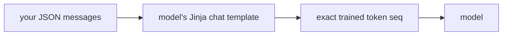

# Lecture 3: OpenAI-compatible serving and the three tuning knobs

> The previous two lectures explained *why* vLLM is fast — continuous batching and PagedAttention. This one turns that engine into a running, tuned endpoint your whole stack can talk to without a single code change, and hands you the three flags that decide whether it boots at all. There are exactly two ways a fresh vLLM deployment ruins your afternoon: it OOMs on the KV cache, or it silently degrades quality because the chat template is wrong. Both are diagnosable from the logs alone — if you know what you're looking at. After this lecture you can read a launch command line-by-line, explain the request/response wire format down to the SSE chunks, spot a template mismatch from rambling output, and turn the three knobs (`--max-model-len`, `--max-num-seqs`, `--gpu-memory-utilization`) in the right direction to fix an OOM instead of thrashing randomly.

**Prerequisites:** Lectures 1–2 (continuous batching, PagedAttention, the paged KV cache), Phase 9's LiteLLM gateway and OpenAI-compatible chat APIs, comfort reading a `docker run` line and a `curl` against `/v1/chat/completions` · **Reading time:** ~30 min · **Part of:** Phase 10 (LLMOps: Serving, Optimization & Deployment) Week 1

---

## The core idea (plain language)

Three ideas, and they build on each other.

**Portability is the whole reason to prefer an OpenAI-compatible server.** vLLM exposes the same three HTTP routes the hosted APIs do — `/v1/chat/completions`, `/v1/completions`, `/v1/models`. The payoff is brutal in its simplicity: your application code, the LiteLLM gateway sitting in front of it, and your eval harness from Phase 7 all keep working when you swap the model from `gpt-4o-mini` on OpenAI to `Qwen2.5-7B` on your own box. The *only* thing that changes is `base_url`. Everything downstream — the `openai` Python client, the retry logic, the streaming parser, the trace instrumentation — is untouched. That is not a convenience; it's what lets you A/B a self-hosted model against a hosted one, or fall back from your GPU to a hosted API during an incident, without rewriting anything.

**The chat template is the one thing that must match between training and serving.** A chat model was fine-tuned on text that looked like `<|im_start|>user\nHi<|im_end|>\n<|im_start|>assistant\n...` — a specific, exact token sequence with special tokens marking role boundaries. At serve time, *something* has to turn your tidy JSON list of `{"role": "user", "content": "Hi"}` messages back into that exact byte sequence. That something is the model's **Jinja chat template**, shipped in its tokenizer config, and vLLM applies it automatically on the `/v1/chat/completions` route. Get it wrong — hand-build the tags yourself, use the wrong template, or send raw text through `/v1/completions` — and the model doesn't crash. It just gets *worse*: it rambles, ignores the system prompt, doesn't know when to stop. Silent quality loss is the worst kind of bug because nothing alerts you.

**Three flags decide whether the server boots and how much throughput you get.** `--max-model-len` caps the context length per sequence (and thus KV cache per sequence). `--max-num-seqs` caps how many sequences run concurrently (more = more throughput, more KV pressure). `--gpu-memory-utilization` is the *fraction* of VRAM vLLM is allowed to claim — not gigabytes, a fraction between 0 and 1 — and the KV-cache pool is whatever's left after the model weights are loaded. Get the arithmetic wrong and vLLM either refuses to start ("not enough KV cache blocks") or crashes partway through loading. Knowing which lever moves which direction is the difference between fixing it in one restart versus flailing for an hour.

---

## How it actually works (mechanism, from first principles)

### Part 1 — Portability: the routes, the launch, the wire

**The three routes.** An OpenAI-compatible server is defined by a small, stable HTTP contract:

- `GET /v1/models` — lists the model IDs this server will answer to. Your client calls this to discover the name to put in the `model` field.
- `POST /v1/chat/completions` — the one you almost always want. Takes a `messages` array (role + content), applies the chat template server-side, generates, returns a completion. This is the route that speaks "chat."
- `POST /v1/completions` — the legacy raw-text route. Takes a `prompt` string, does **no** templating, generates a raw continuation. Useful for base (non-chat) models and for measuring raw throughput; a trap for chat models (Part 2).

**Anatomy of a launch command.** Here is a representative vLLM launch, annotated. (Docker form; the bare `vllm serve <model> <flags>` form takes the identical flags.)

```bash
docker run --gpus all --rm -p 8000:8000 \
  -v ~/.cache/huggingface:/root/.cache/huggingface \   # cache weights on host so restarts are fast
  -e HF_TOKEN="$HF_TOKEN" \                             # for gated models (Llama etc.)
  vllm/vllm-openai:latest \
  --model Qwen/Qwen2.5-7B-Instruct \   # HF repo id OR local path; also the id in /v1/models
  --gpu-memory-utilization 0.90 \      # KNOB 3: claim 90% of VRAM
  --max-model-len 8192 \               # KNOB 1: max context per sequence (prompt + output)
  --max-num-seqs 64 \                  # KNOB 2: concurrency ceiling
  --enable-prefix-caching              # reuse KV for identical prompt prefixes
```

`--model` does double duty: it's what to load *and* the string clients must pass as `model`. Serve `Qwen/Qwen2.5-7B-Instruct` and a request for `model: "gpt-4o"` is rejected. `--served-model-name` lets you alias it if you want a friendlier handle.

**The request wire format.** A chat request is JSON:

```json
{
  "model": "Qwen/Qwen2.5-7B-Instruct",
  "messages": [
    {"role": "system", "content": "You are a terse assistant."},
    {"role": "user", "content": "Reply with exactly: pong"}
  ],
  "max_tokens": 5,
  "temperature": 0,
  "stream": false
}
```

The fields that matter for reasoning about behavior:

- **`messages`** — the ordered conversation. `role` is `system` (instructions/persona), `user`, or `assistant` (prior turns, for multi-turn). The server templates this whole array.
- **`max_tokens`** — cap on *output* tokens. Note the asymmetry: it does **not** limit input. Prompt tokens + `max_tokens` must fit under `--max-model-len`, or the request is rejected. This bites you when a long RAG context leaves no room for the answer.
- **`temperature`** — sampling randomness. `0` is greedy/near-deterministic (use for tests and extraction); `0.7–1.0` for creative text. High temperature over a bad template makes rambling worse, which confuses debugging.
- **`stream`** — `false` returns one JSON blob; `true` returns Server-Sent Events (below).

**The response (non-streaming)** mirrors OpenAI exactly — `choices[0].message.content` holds the text, `usage` holds `prompt_tokens` / `completion_tokens` / `total_tokens`, `finish_reason` tells you *why* it stopped (`stop` = hit a stop token, `length` = hit `max_tokens`). If you see `finish_reason: "length"` on answers that look cut off, raise `max_tokens`.

**Streaming (SSE).** With `stream: true`, the server sends `text/event-stream`: a series of `data: {...}` lines, one per token-ish chunk, each carrying a `delta` (the new text fragment), terminated by a literal `data: [DONE]`.

```
data: {"choices":[{"delta":{"role":"assistant"}}]}
data: {"choices":[{"delta":{"content":"po"}}]}
data: {"choices":[{"delta":{"content":"ng"}}]}
data: {"choices":[{"finish_reason":"stop","delta":{}}]}
data: [DONE]
```

The time until that *first* `content` chunk arrives is **TTFT** (time to first token) — dominated by prefill and queueing. The gap between subsequent chunks is **TPOT/ITL** (Week 2). This is exactly the wire format the `openai` client parses for you; you rarely hand-parse it, but you must recognize it in a raw `curl -N`.

**See it with your own eyes.** The `openai` client is convenient, but hit the raw route once with `curl` so the contract stops being abstract — this is what the SDK, the LiteLLM gateway, and your eval harness are all secretly doing:

```bash
# Non-streaming: one JSON blob back
curl http://localhost:8000/v1/chat/completions \
  -H 'Content-Type: application/json' \
  -d '{"model":"Qwen/Qwen2.5-7B-Instruct",
       "messages":[{"role":"user","content":"Reply with exactly: pong"}],
       "max_tokens":5,"temperature":0}'
# -> {"id":"chatcmpl-...","choices":[{"message":{"role":"assistant",
#     "content":"pong"},"finish_reason":"stop"}],"usage":{...}}

# Streaming: -N disables curl buffering so you watch the SSE chunks arrive live
curl -N http://localhost:8000/v1/chat/completions \
  -H 'Content-Type: application/json' \
  -d '{"model":"Qwen/Qwen2.5-7B-Instruct",
       "messages":[{"role":"user","content":"count to three"}],
       "stream":true}'
# -> a stream of `data: {...delta...}` lines, ending in `data: [DONE]`
```

`GET /v1/models` is the discovery call the SDK's `.models.list()` wraps — `curl http://localhost:8000/v1/models` returns the served id you must echo back in the `model` field. That is the *entire* portability surface: three routes, JSON in, JSON (or SSE) out, and only `base_url` differs between your box and a hosted provider.

### Part 2 — Chat templates: the exact token sequence

Here is the mechanism that trips up almost everyone. A chat model never saw JSON. During instruction tuning it saw flat token streams like:

```
<|im_start|>system
You are a terse assistant.<|im_end|>
<|im_start|>user
Reply with exactly: pong<|im_end|>
<|im_start|>assistant
```

Those `<|im_start|>` / `<|im_end|>` are **special tokens** — single vocabulary entries, not the literal characters. The model learned that after `<|im_start|>assistant\n`, *its* turn begins, and it should emit content then `<|im_end|>` to stop. This "ChatML" style is what Qwen and many others use; Llama-3 uses a different scheme (`<|start_header_id|>`), Mistral uses `[INST] ... [/INST]`. Each family has its own.

The **chat template** is a Jinja2 string shipped in the model's `tokenizer_config.json`. vLLM loads it and, on `/v1/chat/completions`, runs your `messages` array through it to produce that exact token sequence — including the trailing `<|im_start|>assistant\n` "generation prompt" that cues the model to answer. You send clean JSON; the server produces the training-time byte sequence. When training and serving use the *same* template, the model sees at inference exactly the shape it saw during training, and behaves as intended.



Now the three ways to break it:

1. **Hand-building tags in your app.** You write `"<|im_start|>user\n" + text` into a `/v1/completions` `prompt`. Miss a newline, use the wrong special-token spelling, or forget the trailing generation prompt, and the sequence no longer matches training. The model, having never seen your almost-but-not-quite format, degrades.
2. **Wrong or missing template.** A model ships without a template, or with a broken one, and the server falls back to something generic. Roles blur; the system prompt gets ignored.
3. **Using `/v1/completions` with raw chat text.** This route does zero templating by design. Send it a chat-shaped string and you're back to case 1 — you own the tags, and any mistake is silent.

The symptoms are recognizable: the model **rambles** past where it should stop (it never saw the stop token in the right place, so `finish_reason` is `length` not `stop`), **ignores the system role** (persona/format instructions don't land), or produces subtly off-tone answers. Nothing errors. The fix: **use `/v1/chat/completions` and let the server template.** If a model genuinely ships a broken template, override it with `--chat-template ./template.jinja`. This is *the* single thing that must match between how a model is trained and how it's served.

### Part 3 — The three knobs and the KV-cache budget

To turn the knobs correctly you need the VRAM mental model (full arithmetic is Week 2; here's what you need to reason *now*). When vLLM starts, VRAM is spent in this order:

```
Total VRAM
  └─ (× gpu-memory-utilization)  ── the budget vLLM may touch
        ├─ model weights            ── fixed: params × bytes/param (7B fp16 ≈ 14 GB)
        ├─ activations / CUDA graphs ── modest, transient
        └─ KV CACHE POOL            ── everything LEFT OVER  ← this is the elastic part
```

The KV-cache pool is the leftover. vLLM chops it into fixed-size **blocks** (PagedAttention) and logs how many it got. Every token of every active sequence consumes KV cache; the pool size caps `context_length × concurrent_sequences`. The three knobs push on this budget:

- **`--max-model-len`** — max tokens (prompt + output) per sequence. It caps KV *per sequence*. Lower it → each sequence can use less KV → more room for more sequences, and startup needs a smaller worst-case reservation. Raise it → longer contexts allowed, but each sequence can hog more KV.
- **`--max-num-seqs`** — the concurrency ceiling: how many sequences decode at once. Raise it → more throughput (bigger batches, and decode batching is nearly free — Week 2) but more simultaneous KV demand. Lower it → less KV pressure, lower throughput.
- **`--gpu-memory-utilization`** — the **fraction** (0–1) of the card vLLM may claim. Default ~0.90. Raise it → weights are fixed, so *all* the extra goes to the KV pool → more concurrency/context headroom. But push past ~0.92–0.95 and you starve CUDA graphs, other processes, or fragmentation headroom, and OOM at the worst time. It is a fraction, **not gigabytes** — `0.90` means "90% of the card," not "90 GB."

**OOM at startup vs mid-load.** These are different failures:

- **Startup OOM / refusal:** vLLM computes the worst case — `max-num-seqs` sequences each up to `max-model-len` tokens — and finds the KV pool can't hold even the minimum it needs. It errors immediately, often *before* serving a single request, with a message about KV cache blocks. Cause: your knobs demand more KV than the leftover VRAM provides.
- **Mid-load OOM:** it started fine but crashes under real traffic — usually because a burst of long-context requests arrived together and the actual KV demand exceeded the pool. vLLM preempts/recomputes to cope, but if you set `gpu-memory-utilization` too high there's no slack and CUDA itself OOMs.

**Reading the log line.** On boot vLLM prints something like:

```
GPU KV cache size: 42,336 tokens
# or, in other versions:
# available KV cache blocks: 331 (block_size=16 tokens)  ->  331 × 16 = 5,296 tokens of KV
```

Multiply blocks × block_size to get total KV *tokens* available. Then sanity-check: can it hold at least one full-length sequence? If `available_tokens < max-model-len`, the server can't even serve one max-length request and will refuse or thrash. That single line tells you whether your knobs are viable *before* you send traffic.

---

## Worked example

You rent a 24 GB L4 and launch `Qwen/Qwen2.5-7B-Instruct` (fp16 ≈ 14 GB weights) with the aggressive settings from the lab's "break it on purpose" step:

```bash
vllm serve Qwen/Qwen2.5-7B-Instruct \
  --gpu-memory-utilization 0.90 --max-model-len 32768 --max-num-seqs 256
```

**The arithmetic.** Budget = 24 × 0.90 ≈ 21.6 GB. Weights take ~14 GB. Activations/graphs ~1–1.5 GB. KV pool leftover ≈ **6 GB**. Suppose this model costs (illustratively) ~0.13 GB per 1k tokens of KV. Then 6 GB ÷ 0.13 ≈ **~46k tokens** of total KV capacity. But you asked for `max-model-len 32768` — a *single* max-length sequence would need ~4.2 GB of KV. Two of them ≈ 8.4 GB > 6 GB pool. And you told it `--max-num-seqs 256`. vLLM computes the worst case, sees the pool can't back the reservation, and **refuses at startup** with an "available KV cache blocks" line showing far fewer tokens than `max-model-len` × any reasonable concurrency.

**Now fix it — and know which lever and why:**

- **Lower `--max-model-len` to 8192.** A max sequence now needs ~1 GB of KV, so 6 GB holds ~6 concurrent full-length sequences — enough to boot and serve real chat. Best fix when you don't actually need 32k context (most chat doesn't). *Tradeoff:* you can no longer accept prompts longer than 8k.
- **Lower `--max-num-seqs` to 16.** Cuts the concurrency ceiling so the worst-case reservation shrinks. Boots. *Tradeoff:* lower peak throughput under heavy load.
- **Raise `--gpu-memory-utilization` to 0.95** (last resort). Budget → 22.8 GB, KV pool → ~7.2 GB. A little more room. *Tradeoff:* thin margin; a traffic spike or another process can trigger a mid-load CUDA OOM. Use this to reclaim a *little* headroom, not to paper over knobs that are fundamentally too big.

The disciplined move for a 24 GB card serving 7B chat: `--max-model-len 8192 --max-num-seqs 64 --gpu-memory-utilization 0.90`. Boots comfortably, healthy KV pool, good throughput. You reached it by reading one log line and doing arithmetic, not by guessing.

---

## How it shows up in production

**Portability saves you during incidents.** Because your gateway only knows `base_url` + `model`, when your self-hosted GPU wedges you flip LiteLLM to a hosted fallback (`together_ai/Qwen...`) and stay up. Same client code, same eval harness — you can even run the eval suite against *both* endpoints nightly to catch quality drift between your box and the hosted reference. This portability is the single biggest operational argument for OpenAI-compatible servers over bespoke ones.

**Template bugs masquerade as "the model is dumb."** The classic ticket: "the self-hosted model is noticeably worse than the same model on Fireworks/Together." Nine times out of ten it isn't the weights — it's a template mismatch (someone hand-built prompts, or hit `/v1/completions`). The tell is in the logs and outputs: `finish_reason: length` everywhere, rambling that runs to `max_tokens`, ignored system instructions. Suspect the template *before* the weights; it's cheaper to check and more often the culprit.

**KV cache, not weights, caps your concurrency.** Teams size a GPU on weights ("14 GB fits in 24 GB, done") and are shocked when concurrency is low or it OOMs under load. Weights are the *floor*; the KV pool is what serves users, and it's the leftover. Every VRAM decision routes through "how much KV is left, and does it back my `max-model-len × max-num-seqs`?"

**`max_tokens` + long context = rejected requests.** In a RAG app, a 7k-token retrieved context on an 8k `--max-model-len` leaves ~1k for the answer; ask for `max_tokens: 2000` and vLLM rejects the request (prompt + max_tokens > max_model_len). This surfaces as intermittent 400s correlated with long retrievals — trace it back to the context budget, not a "flaky server."

---

## Common misconceptions & failure modes

- **"`--gpu-memory-utilization` is in gigabytes."** No — it's a **fraction** of the card, 0–1. `0.90` = 90% of VRAM. Setting `24` doesn't give you 24 GB; it's out of range.
- **"Bigger `--gpu-memory-utilization` is always safer/faster."** It grows the KV pool, but past ~0.92–0.95 you starve CUDA graphs and other processes and invite mid-load OOM. Headroom is a feature.
- **"I'll build the chat tags myself, it's just string formatting."** That's exactly how you desync from the training format. Let the server template via `/v1/chat/completions`; only override with `--chat-template` when a model's shipped template is genuinely broken.
- **"`/v1/completions` and `/v1/chat/completions` are interchangeable."** They are not. `/completions` does no templating (raw text; correct for base models and raw-throughput tests). `/chat/completions` templates. Sending chat messages as raw text to `/completions` silently degrades quality.
- **"OOM means I need a bigger GPU."** Often you just need smaller knobs. Drop `--max-model-len` and/or `--max-num-seqs` first; a bigger card is the expensive last resort.
- **"`max_tokens` limits the whole request."** It caps *output* only. Input isn't limited by it — but prompt + `max_tokens` must fit under `--max-model-len`.
- **"Rambling output = bad weights."** Usually a template mismatch: the model never sees the stop token in the trained position, so it runs to `length`. Check the template before blaming the model.

---

## Rules of thumb / cheat sheet

- **Portability contract:** app code, LiteLLM, and evals should change *only* `base_url` (and the `model` string) between hosted and self-hosted. If more changes, something isn't truly OpenAI-compatible.
- **Route choice:** chat model → **`/v1/chat/completions`** (templated). Base model or raw-throughput test → `/v1/completions`. Discovery → `/v1/models`.
- **Template is sacred:** the one thing that must match train↔serve. Let the server template; override with `--chat-template` only for a proven-broken template.
- **Knob directions (memorize):**
  - `--max-model-len` ↓ → less KV/seq → more room, boots easier; ↑ → longer contexts, more KV/seq.
  - `--max-num-seqs` ↑ → more throughput, more KV pressure; ↓ → safer, less throughput.
  - `--gpu-memory-utilization` ↑ → bigger KV pool but thinner safety margin; **fraction, not GB**.
- **Fix an OOM in this order:** (1) lower `--max-model-len` to what you actually need, (2) lower `--max-num-seqs`, (3) nudge `--gpu-memory-utilization` to ~0.92–0.95 as a last small gain.
- **Read the boot log:** find "available KV cache blocks" (× block_size = KV tokens). If it's below `--max-model-len`, your knobs are non-viable — shrink them.
- **Sane 7B-on-24GB default:** `--max-model-len 8192 --max-num-seqs 64 --gpu-memory-utilization 0.90 --enable-prefix-caching`.
- **Debug tells:** `finish_reason: length` + rambling → template/`max_tokens`; refusal at boot mentioning KV blocks → knobs too big; intermittent 400s on long RAG → prompt + `max_tokens` > `max-model-len`.

---

## Connect to the lab

Week 1's lab is this lecture executed on a real GPU. **Step 1–2** launch vLLM with these exact flags and hit it with the *unchanged* stock `openai` client plus a raw `curl` — proving portability and letting you see the wire format (roles, `max_tokens`, streaming SSE) with your own eyes. **Step 3 "break it on purpose"** is Parts 2 and 3 made concrete: relaunch with `--max-model-len 32768 --max-num-seqs 256` to reproduce the KV-cache OOM, read the "available KV cache blocks" line, and record *which knob you pulled and why* in `notes/tuning-log.md`; then run `client/chat_template_check.py` to compare a hand-built `/v1/completions` prompt against the templated `/v1/chat/completions` path and watch the mismatched one ramble. The Definition of Done requires exactly this: a reproduced OOM with the fixing flag documented, and a visible quality gap from a template mismatch.

---

## Going deeper (optional)

- **vLLM docs** — the OpenAI-compatible server reference, engine args (every flag here), and conserving-memory / troubleshooting guides. Root: `docs.vllm.ai`. Search: `vllm openai compatible server engine args`, `vllm gpu memory utilization kv cache`, `vllm chat template`.
- **vLLM GitHub** — issues are a goldmine for real OOM and template threads. Root: `github.com/vllm-project/vllm`. Search: `vllm available kv cache blocks OOM`, `vllm --chat-template not applied`.
- **OpenAI API reference** — the canonical chat/completions request+response schema and SSE streaming format vLLM mirrors. Root: `platform.openai.com/docs/api-reference`. Search: `openai chat completions streaming server sent events`.
- **Hugging Face chat templating** — how Jinja chat templates live in `tokenizer_config.json`, `apply_chat_template`, and the generation prompt. Root: `huggingface.co/docs/transformers/main/en/chat_templating`. Search: `huggingface apply_chat_template add_generation_prompt`.
- **ChatML / special tokens** — the `<|im_start|>` convention. Search: `ChatML im_start format`, `Qwen2.5 chat template`.
- **LiteLLM docs** — pointing a gateway at a self-hosted OpenAI-compatible `base_url`. Root: `docs.litellm.ai`. Search: `litellm openai compatible custom base_url`.

---

## Check yourself

1. Your teammate says "we moved from OpenAI to our own vLLM box and had to rewrite the client, the gateway config, and the eval harness." What does that tell you went wrong, and what *should* have changed?
2. Explain why `--gpu-memory-utilization 0.90` on a 24 GB card serving a 14 GB (fp16) 7B model does **not** leave 10 GB for the KV cache. Where does the KV pool actually come from?
3. A model's outputs ramble far past where they should stop, ignore the system prompt, and every response has `finish_reason: "length"`. The weights are fine on a hosted provider. Name the most likely cause and two concrete fixes.
4. On boot, vLLM logs "available KV cache blocks: 300" with block_size 16, and you launched with `--max-model-len 8192`. Can this server reliably serve even one max-length request? Show the arithmetic and say what you'd change.
5. For each knob — `--max-model-len`, `--max-num-seqs`, `--gpu-memory-utilization` — state the direction that *reduces* KV-cache OOM risk and the cost of moving it that way.
6. Why is sending chat-formatted text to `/v1/completions` a silent bug rather than a loud error, and what's the one-line fix?

### Answer key

1. Nothing should have changed except `base_url` (and possibly the `model` string). Having to rewrite the client/gateway/evals means either the server isn't truly OpenAI-compatible or they were using a bespoke SDK instead of the standard `openai` client + gateway abstraction. The entire point of `/v1/chat/completions` portability is that app code, LiteLLM, and the eval harness point at a new `base_url` and are otherwise untouched.
2. Budget = 24 × 0.90 ≈ 21.6 GB, not 24. Weights (~14 GB) come out first, then activations/CUDA graphs (~1–1.5 GB). The **KV cache pool is the leftover** — roughly 21.6 − 14 − 1.5 ≈ 6 GB, not 10. The KV pool is elastic and always what remains after weights and overhead inside the utilization budget.
3. **Chat-template mismatch** — the model isn't seeing its trained token format, so it never hits the stop token in the right place (hence `finish_reason: length` and rambling) and role boundaries blur (ignored system prompt). Fixes: (a) use `/v1/chat/completions` and let the server apply the template instead of hand-building tags or using `/v1/completions`; (b) if the shipped template is broken/missing, pass `--chat-template ./template.jinja` with the correct one.
4. Total KV tokens = 300 × 16 = **4,800 tokens**, which is *less than* `--max-model-len 8192`. So a single max-length sequence (8,192 tokens) doesn't even fit — the server cannot reliably serve one full request and will refuse or thrash. Fix: lower `--max-model-len` to ≤ ~4,096 (and/or free KV by lowering `--max-num-seqs` or nudging `--gpu-memory-utilization` up) so available KV comfortably exceeds one sequence's needs.
5. `--max-model-len` **down** reduces OOM risk (less KV per sequence) at the cost of rejecting longer prompts. `--max-num-seqs` **down** reduces risk (fewer simultaneous sequences) at the cost of lower peak throughput. `--gpu-memory-utilization` **up** reduces *startup*-OOM risk by enlarging the KV pool, but at the cost of a thinner safety margin (past ~0.95 it invites mid-load CUDA OOM from spikes/other processes) — so it's the small last-resort lever, and it's a fraction, not GB.
6. `/v1/completions` does no templating by design — it faithfully generates a continuation of whatever raw text you send. So chat text with hand-built or missing tags is *valid input*; the server has no way to know it's malformed, and just produces lower-quality output. No error fires. One-line fix: send chat messages to **`/v1/chat/completions`** and let the server apply the model's chat template.
