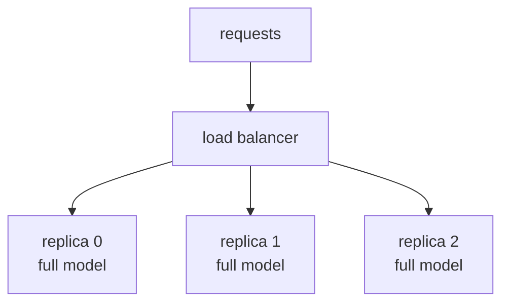
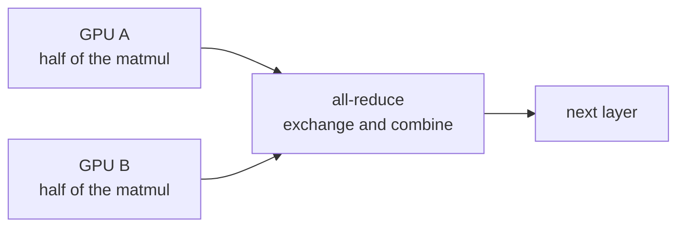
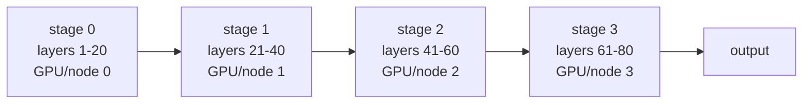

# Lecture 4: Parallelism for serving — tensor vs pipeline vs data

> The last three lectures got a single model running fast on a single GPU. This one is about what to do when one GPU is not enough — and the trap is that there are three different "not enoughs," each with a different fix, and reaching for the wrong one costs you money, latency, or a launch that won't boot. "The model won't fit" and "the endpoint can't keep up with traffic" are opposite problems with opposite solutions, and mixing them up is the single most common architecture mistake in self-hosted inference. After this lecture you can look at a symptom — an OOM at load, or a p95 latency that climbs under load — and know immediately whether you need tensor parallelism, pipeline parallelism, or just more replicas. You'll be able to size a 70B model against a fleet of GPUs on the back of an envelope, read `--tensor-parallel-size` and `--pipeline-parallel-size` and predict what each does to memory and throughput, and state the decision rule cold: replicas for QPS, tensor-parallel to make it fit on a node, pipeline-parallel only when it won't fit even on one node.

**Prerequisites:** Lectures 1–3 (continuous batching, PagedAttention, OpenAI-compatible serving and the three tuning knobs), a rough sense of what a transformer layer is (a stack of attention + MLP blocks, each a few big matrix multiplies), and comfort with the idea that a model's weights live in VRAM · **Reading time:** ~30 min · **Part of:** Phase 10 (LLMOps: Serving, Optimization & Deployment) Week 1

---

## The core idea (plain language)

There are exactly three ways to spread inference across more than one GPU, and they answer three different questions. Confusing them is where people burn money.

**Data parallelism (replicas) answers "how do I serve more traffic?"** You run N complete, independent copies of the model — each on its own GPU (or its own group of GPUs) — and put a load balancer in front. Request comes in, balancer picks a copy, that copy answers. The copies never talk to each other. This is the primary, boring, correct lever for scaling QPS. It scales horizontally forever, it needs no special interconnect, and it's the thing you reach for *first* when the endpoint is slow under load. The catch: each replica must hold the *entire* model, so replicas do nothing to help a model that won't fit on one card.

**Tensor parallelism answers "the model doesn't fit on one GPU — how do I split it across a few cards on the same machine?"** Instead of copying the model, you *shard* it: each layer's weight matrices are sliced across N GPUs, so every GPU holds 1/N of the weights. All N GPUs work on the *same* request at the *same* time, and they have to exchange partial results after essentially every layer — an all-reduce, many times per token. That chatter is constant and latency-sensitive, so tensor parallelism demands a fast interconnect (NVLink) and, in practice, all the GPUs living inside one node. You use it *only* to make a model fit (or to squeeze more KV-cache headroom), never as your first move for throughput.

**Pipeline parallelism answers "the model doesn't even fit on one whole node — how do I split it across machines?"** You cut the model by *layers*: GPU 0 (or node 0) runs layers 1–20, GPU 1 runs 21–40, and so on, like stations on an assembly line. A request flows through the stages in sequence. The communication is tiny (you only pass the activation between stages, once per boundary), so it tolerates slower links and works across nodes — but the assembly-line structure creates idle time ("bubbles") that hurt efficiency. It's the last resort, for models so big they span multiple machines.

Here's the whole decision in one breath: **scale QPS with replicas first; use tensor-parallel only to make a model fit on a node; use pipeline-parallel only when it won't fit even on one node.** Everything below is why.

---

## How it actually works (mechanism, from first principles)

### Data parallelism / replicas — the one you'll use most

There is almost nothing to explain, which is exactly the point. A replica is a full, self-contained inference server (a whole vLLM process holding all the weights). You run several, and a load balancer distributes requests:


Each replica is a full model on its own GPUs, with no cross-talk.

Properties that matter in production:

- **Throughput scales ~linearly.** Three replicas serve ~3× the QPS of one, minus a little load-balancer overhead. There is no coordination cost because the replicas never communicate.
- **No interconnect required.** Replicas can be on different machines, different racks, different availability zones. They share nothing but the model weights on disk.
- **Latency per request is unchanged.** A single request is answered entirely by one replica at the same speed as if it were the only replica. Replicas add capacity, not speed.
- **Cost scales linearly.** Two replicas cost 2× the GPU-hours of one. This is the honest, predictable part of the cost story, and it ties directly to Week 2: your $/hr is (replicas × GPUs-per-replica × per-GPU rate), full stop.

In managed serving (Kubernetes, Ray Serve, vLLM's own multi-instance setups, or a serverless platform like Modal/Baseten) "add replicas" is an autoscaling knob: set min/max replica counts, scale on queue depth or GPU utilization. That's the whole game for QPS.

### Tensor parallelism — split each layer across GPUs on one node

Now the model is too big for one card. A transformer layer is, mechanically, a sequence of large matrix multiplications (the attention projections and the MLP's two big linear layers). Tensor parallelism slices those weight matrices across GPUs. With `--tensor-parallel-size 2`, each of the two GPUs holds half of every weight matrix, does half of each matmul, and then the GPUs **all-reduce** — combine their partial results — so that each ends up with the correct full output to feed the next sub-layer.


This repeats for essentially every layer, every token, for one request at TP=2.

The consequences you must internalize:

- **Per-GPU memory drops ~1/N for the weights.** A model needing 40 GB of weights fits in 2×24 GB cards under TP=2 (~20 GB of weights each), leaving room for KV cache. Making it *fit* is the entire reason to do this.
- **All N GPUs are busy on one request.** Unlike replicas, TP does not add serving capacity by itself — it lets *one* copy of a too-big model exist. (You then add replicas of that TP group to scale QPS.)
- **Communication is frequent and latency-critical.** That all-reduce happens on the order of twice per layer, per generated token. For a 32-layer model generating 200 tokens, that's thousands of collective operations for a single response. If the GPUs talk over a slow link, this communication becomes the bottleneck and your tokens/sec craters.
- **Therefore: NVLink, and stay on one node.** NVLink (and NVSwitch) give GPUs inside a server ~hundreds of GB/s of direct GPU-to-GPU bandwidth. PCIe alone is far slower and turns TP into a crawl; crossing to another machine over Ethernet is out of the question for tensor-parallel. **Rule: TP size should not exceed the number of NVLink-connected GPUs in one box** (commonly 2, 4, or 8).
- **It is not free even when it works.** You pay a communication tax on every token, so a model that *could* fit on one card served with TP=2 will usually be *slower per request* than on one card. Only shard when you must.

A practical constraint that bites at launch: `--tensor-parallel-size` must evenly divide the model's attention-head count (vLLM enforces divisibility). TP of 1, 2, 4, 8 are the safe values; TP=3 or TP=6 often won't launch.

### Pipeline parallelism — split layers across GPUs or nodes

When the model is so large its weights won't fit even across all the NVLinked GPUs in one node, you split it by depth. `--pipeline-parallel-size 4` cuts the layer stack into 4 contiguous stages, each on its own GPU or node. A request enters stage 0, whose output activation is shipped to stage 1, and so on:



Why it's the last resort:

- **Communication is cheap and infrequent.** You pass one activation tensor across each stage boundary — a handful of transfers per token, not thousands. This is exactly why pipeline parallel tolerates *slower* interconnects (regular datacenter Ethernet / InfiniBand between nodes) where tensor parallel would die.
- **But you get pipeline bubbles.** With a single request in flight, stage 1 sits idle while stage 0 works, stage 2 idles while stage 1 works, and so on. At any instant, most of your GPUs are doing nothing — the "bubble." Utilization for one request is roughly 1/(number of stages). You claw the bubble back by keeping *many* requests in flight so that while stage 0 works on request B, stage 1 is working on request A — continuous batching (Lecture 2) is what fills the pipe. But you never fully hide the bubble, so pipeline parallelism has a structural efficiency penalty that tensor parallelism (all GPUs busy on the same request) does not.
- **It's what makes multi-node serving possible at all.** You combine it with TP: TP=8 within each node to shard across the NVLinked GPUs, PP across nodes to add depth. That's how frontier-scale models get served.

The mental model: **tensor parallel = split each worker's job (fast link, one node); pipeline parallel = split the assembly line into stations (slow link OK, multi-node, but bubbles).**

---

## Worked example — does a 70B fit, and what do I launch?

Let's size a Llama-3.1-70B-class model. The weights-only VRAM is the first-order number (Week 2 breaks down the full weights + activations + KV-cache equation; here we just need weights + headroom).

**Weights in fp16/bf16 = params × 2 bytes:**

```
70e9 params × 2 bytes = 140 GB  (just the weights)
```

Now walk the cards:

**1 × 80 GB (one A100/H100 80GB).** 140 GB of weights into 80 GB? No — not even close. You can't load the model at all, let alone leave room for KV cache. A single 80 GB card **cannot** serve 70B in fp16. (This is exactly the OOM-at-load you'd hit if you naively `vllm serve`'d it.)

**2 × 80 GB with TP=2.** Weights shard to ~70 GB per GPU. That fits in 80 GB, but only ~10 GB per card is left for KV cache and activations — tight, and your `--max-num-seqs`/`--max-model-len` will be constrained. Launch:

```bash
vllm serve meta-llama/Llama-3.1-70B-Instruct \
  --tensor-parallel-size 2 \
  --gpu-memory-utilization 0.92 \
  --max-model-len 8192
```

Workable on a 2×80 GB NVLinked node. If you want comfortable KV headroom (long context, high concurrency), go **4 × 80 GB with TP=4** (~35 GB weights/GPU, ~45 GB free each for KV cache) — much healthier, at 2× the hardware cost.

**The cheaper alternative: quantize.** At int4 (AWQ/GPTQ), 70B weights ≈ 70e9 × 0.5 bytes = **35 GB**, which *does* fit on a single 80 GB card with room for KV cache — no parallelism at all. This is why quantization and parallelism are the two answers to "won't fit," and quantization is usually the cheaper one (re-eval quality after quantizing — Week 2's warning).

**Now the QPS question.** Say the 2×80 GB TP=2 server sustains, hypothetically, ~1,500 tokens/sec, and your traffic needs ~6,000 tokens/sec at peak. You do **not** raise TP — TP doesn't add capacity. You run **4 replicas of the TP=2 group** = 8×80 GB total, behind a load balancer, and put an autoscaler on it. Cost: 8 GPU-hours per wall-clock hour, scaling linearly with the replica count. That's the whole architecture: TP to fit the model, replicas to hit the QPS, cost = replicas × GPUs-per-replica × rate.

---

## How it shows up in production

- **The symptom tells you the fix.** *OOM at model load / "not enough memory to load weights"* → the model doesn't fit → tensor-parallel (or quantize). *Endpoint healthy but p95 latency climbs and a request queue forms under load* → you're capacity-bound → **more replicas**, not more TP. People who reach for TP to fix a throughput problem end up with a slower, more expensive server that still can't keep up.

- **TP over the wrong interconnect is a silent performance cliff.** If you set TP=4 on a box where only pairs of GPUs are NVLinked (or worse, GPUs only see each other over PCIe), the per-token all-reduce dominates and your tokens/sec can drop by multiples. `nvidia-smi topo -m` shows the interconnect matrix; you want `NV#` links between the GPUs in your TP group, not `PHB`/`SYS` (PCIe/across-socket). This is a "why is my 8-GPU server slower than my 2-GPU server" bug.

- **Replicas multiply your bill linearly — and that's the honest cost lever.** This connects straight to Week 2's break-even math: doubling replicas doubles $/hr. Autoscaling replicas down at night (or scale-to-zero on serverless) is where real money is saved; over-provisioning replicas "for safety" is where it's quietly wasted. Track utilization per replica; if replicas sit at 20% SM util, you have too many.

- **TP shrinks per-GPU weight footprint, which can *buy* you KV cache.** Occasionally you'll use TP not because the weights don't fit, but because one card fits the weights with no room left for a usable KV cache. Sharding weights across 2 cards frees VRAM per card for KV blocks → higher concurrency. It's a memory play, not a speed play.

- **Pipeline bubbles show up as low, uneven GPU utilization across nodes.** If a multi-node PP deployment shows node 0 at 90% and nodes 1–3 near idle, your batch isn't deep enough to fill the pipe. The fix is more concurrent requests (higher `--max-num-seqs`), not more hardware.

- **Cold starts get worse with size.** A TP/PP model spread over many GPUs takes longer to load weights into all of them — relevant when a serverless replica scales from zero. Multi-GPU replicas amortize worse under bursty traffic.

---

## Common misconceptions & failure modes

- **"Tensor parallelism makes it faster."** No. For a model that already fits on one GPU, TP=2 is typically *slower* per request because of the communication tax. TP makes a too-big model *possible*, and can add KV headroom; it is not a throughput multiplier. Replicas are your throughput multiplier.

- **"More GPUs = more QPS, whatever the parallelism."** Only replicas add QPS. Adding GPUs via TP or PP to a model that already fit just adds communication overhead. Add GPUs the right way for the problem you have.

- **"I'll just set TP=8 to be safe."** TP has to divide the head count and must stay within one NVLinked node; oversized TP either fails to launch or runs over slow links and tanks. Match TP to your actual NVLink topology (2/4/8), no larger than you need to fit.

- **"Pipeline parallel across nodes will scale my throughput."** PP exists to make a model *fit* across machines, not to scale QPS, and it comes with bubbles. If your model fits on one node, do not use PP; scale with replicas.

- **"TP=3 for my 3 GPUs."** Head counts are powers-of-two-friendly; TP must divide them evenly. TP=3 usually won't launch. Use TP=2 and put the third GPU elsewhere, or get to 4 cards.

- **Mixing up the two "doesn't fit" cases.** Won't fit on one *card* → TP within a node. Won't fit on one *node* → PP across nodes (plus TP within each). Reaching for PP when TP would do adds bubbles for no reason.

- **Forgetting KV cache exists.** "Weights are 140 GB, I have 2×80=160 GB, done." No — you also need KV cache and activations. The weights fitting is necessary, not sufficient. Always leave headroom (Week 2's full equation).

---

## Rules of thumb / cheat sheet

*(All figures approximate — validate against your model's `config.json` and your GPU's actual VRAM.)*

- **Decision order:** (1) Does it fit on one GPU (weights + KV headroom)? → single GPU, add **replicas** for QPS. (2) Fits on one node but not one card? → **tensor-parallel** across the NVLinked GPUs, then replicas of that group. (3) Won't fit on one node? → **pipeline-parallel** across nodes (× TP within each), last resort.
- **QPS is always replicas.** TP and PP never scale throughput; they scale *fit*.
- **TP size ≤ NVLinked GPUs in the box.** Use 2, 4, or 8. Must divide the head count. Needs NVLink; check `nvidia-smi topo -m`.
- **Weights VRAM ≈ params × bytes/param:** fp16 = 2 B, fp8 = 1 B, int4 ≈ 0.5 B. So 70B fp16 ≈ 140 GB; 70B int4 ≈ 35 GB.
- **Before adding GPUs, consider quantization.** int4 often removes the need for parallelism entirely and is cheaper — just re-eval quality.
- **Cost = replicas × GPUs-per-replica × $/GPU-hr.** Linear. Autoscale replicas down when idle.
- **Symptom → lever:** OOM at load → TP/quantize. Queue builds under load → replicas. Slow multi-GPU server → check interconnect topology. Idle downstream nodes in PP → deeper batch.
- **`--tensor-parallel-size N`** shards within a node; **`--pipeline-parallel-size M`** stages across nodes; total GPUs per replica = N × M.

---

## Connect to the lab

Week 1's lab has you launch and tune a single-GPU vLLM server; this lecture is the "what if it doesn't fit / can't keep up" companion. In your Step 5 README note, write the three-line "when to use tensor-parallel" rule in your own words and add the sizing check: for the model you served, compute weights VRAM (params × 2 for fp16) and state whether it fit on your card with KV headroom, and what you'd do (quantize / TP / replicas) if it didn't. If you have access to a 2-GPU box, relaunch with `--tensor-parallel-size 2` and note in `notes/tuning-log.md` whether tokens/sec went up or *down* versus single-GPU for the same model — proving to yourself that TP is a fit lever, not a speed lever. The break-even chart you build in Week 2 uses exactly the cost = replicas × GPUs × rate relationship from here.

## Going deeper (optional)

- **vLLM docs — "Distributed Inference and Serving"** (docs.vllm.ai). The authoritative guide to `--tensor-parallel-size` / `--pipeline-parallel-size`, when to use each, and multi-node setup. Read this before any multi-GPU launch. Search: `vllm distributed inference tensor parallel pipeline parallel`.
- **Hugging Face — "Model Parallelism"** conceptual guide (huggingface.co docs). Clear diagrams of tensor vs pipeline vs data parallelism. Search: `huggingface model parallelism guide`.
- **NVIDIA Megatron-LM** (github.com/NVIDIA/Megatron-LM) — the canonical implementation and origin of the tensor/pipeline-parallel vocabulary. The README and its linked papers are the source material; you want the intuition, not the derivations. Search: `Megatron-LM tensor pipeline parallelism`.
- **GPipe / pipeline bubble** — for the assembly-line intuition and where bubbles come from. Search: `GPipe pipeline parallelism bubble`.
- **`nvidia-smi topo -m`** — run it on any multi-GPU box to read the interconnect matrix (NVLink vs PCIe). Search: `nvidia-smi topo interpret NVLink NV1 NV2`.
- **Ray Serve / Kubernetes autoscaling for LLMs** — for the replica/data-parallel side. Search: `ray serve vllm autoscaling replicas` or `kubernetes gpu autoscaling llm inference`.

## Check yourself

1. Your vLLM server is healthy at low load, but under a traffic spike the request queue grows and p95 latency doubles. Do you raise `--tensor-parallel-size` or add replicas? Why?
2. You try to serve a 70B fp16 model on a single 80 GB GPU and it OOMs at load. Give two different fixes and say which is usually cheaper.
3. Why does tensor parallelism demand NVLink while pipeline parallelism tolerates ordinary datacenter Ethernet between nodes?
4. What is a pipeline bubble, and what technique from Lecture 2 helps hide it?
5. You have a model that fits on one card and want to double throughput. A colleague sets `--tensor-parallel-size 2`. What likely happens to per-request latency, and what should they have done instead?
6. Write the formula for your monthly GPU cost of a service running R replicas, each using G GPUs, on cards renting at $H per GPU-hour, at full utilization 24/7.

### Answer key

1. **Add replicas.** A growing queue under load is a *capacity* (QPS) problem, and data parallelism is the only lever that adds serving capacity. TP would keep the same single-copy throughput while adding communication overhead — it does not help throughput and may hurt it.
2. (a) **Tensor-parallel across 2×80 GB (TP=2)** so weights shard to ~70 GB/card; (b) **quantize to int4 (AWQ/GPTQ)** so weights drop to ~35 GB and fit on the one 80 GB card. Quantization is usually cheaper (one GPU instead of two) — with the caveat that you must re-evaluate quality after quantizing.
3. TP does an all-reduce roughly twice per layer per token — thousands of latency-sensitive collective ops per response — so it needs the hundreds-of-GB/s, low-latency GPU-to-GPU bandwidth of NVLink. PP only passes one activation tensor across each stage boundary (a few transfers per token), so the low, infrequent communication is fine over slower node-to-node links.
4. A bubble is the idle time when, for a single request, downstream pipeline stages wait for upstream stages (utilization ~1/stages for one request in flight). **Continuous batching** (keeping many requests in flight so a later stage works on request A while an earlier stage works on request B) fills the pipe and hides most of the bubble.
5. Per-request latency likely gets **worse**, because a model that already fit now pays the per-token all-reduce communication tax with no memory benefit. To double throughput they should have run **2 replicas** behind a load balancer.
6. `monthly_cost = R × G × H × 24 × 30` (≈ R × G × H × 730 hours/month). It scales linearly in the replica count R.
