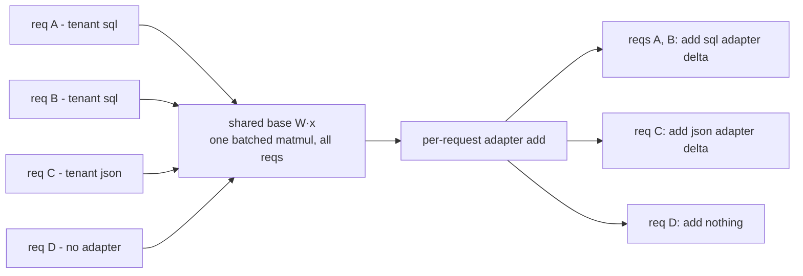

# Lecture 5: Multi-LoRA serving — many fine-tunes, one base model in VRAM

> Your product just promised every enterprise customer their "own" fine-tuned model. The naive reading of that promise is a bankruptcy note: 40 tenants × a 7B model in fp16 = 40 × 14GB = 560GB of VRAM, roughly seven H100s doing nothing but holding weights, before you serve a single token. This lecture shows you the trick that turns that 560GB into ~14GB + a rounding error. You'll learn what a LoRA adapter *is* at serving time (megabytes of low-rank deltas, not a whole model), how vLLM holds one frozen base in VRAM and applies a different adapter per request inside the *same* batch, exactly which flags wire it up and how they bite you, and how this pairs with the `tenant_id` routing you'll build in Week 3. After this you can price a per-tenant fine-tune business and stand up the server that makes the economics real.

**Prerequisites:** you know what fine-tuning is and have at least heard of LoRA from a training context (Phase 8); comfort with vLLM launch flags and the OpenAI client (Lectures 1–4); rough VRAM literacy (7B fp16 ≈ 14GB). · **Reading time:** ~24 min · **Part of:** Phase 10 (LLMOps) Week 1

## The core idea (plain language)

A full fine-tune produces a whole new set of model weights. If you fine-tune a 7B model for a customer, you get another 7B model — 14GB in fp16. Do that for 40 customers and you own 40 separate 14GB artifacts, and to serve them all with low latency you'd need them all resident in GPU memory at once. That does not scale; it barely *starts*.

LoRA (Low-Rank Adaptation) changes the shape of the artifact. Instead of a new full weight matrix, a LoRA fine-tune freezes the base model and learns a small **low-rank delta** for a handful of weight matrices. The delta for a matrix is stored as two skinny matrices, `A` and `B`, whose product is the correction applied on top of the frozen base. For a 7B model these adapters are typically **10–200 MB**, not 14GB — often 100–1000× smaller than the base.

That size gap is the entire unlock. If the base weights are frozen and *shared*, and each tenant's customization is just a small `A`/`B` pair, then you keep **one** base model in VRAM and swap in the relevant tiny adapter per request. Your VRAM bill goes from `N × base` to `1 × base + N × adapter`. Ten tenants stop costing ten GPUs and start costing one GPU plus a few hundred megabytes. The modern engines go one step further: they don't just *swap* adapters between requests, they apply *different adapters to different requests in the same batch*, so you keep continuous batching's throughput while serving a dozen tenants' bespoke models simultaneously.

## How it actually works (mechanism, from first principles)

### What a LoRA adapter is, mechanically

Pick one weight matrix inside the transformer — say a query projection `W` of shape `[d, d]` with `d = 4096`. That's 4096 × 4096 ≈ 16.8M parameters. A full fine-tune would relearn all 16.8M numbers.

LoRA instead freezes `W` and learns a correction `ΔW = B · A`, where `A` is `[r, d]` and `B` is `[d, r]`, and `r` — the **rank** — is small (8, 16, 32, 64). The forward pass becomes:

```
y = W·x           (frozen base, shared across all tenants)
  + (B·A)·x       (the adapter's contribution)
  scaled by α/r   (a fixed scalar baked into the adapter)
```

Count the adapter parameters for `r = 16`: `A` is 16 × 4096 and `B` is 4096 × 16, so `2 × 16 × 4096 ≈ 131K` parameters for that matrix — versus 16.8M for a full retrain. That's **0.8%** of the size. Multiply across the ~7 matrices per layer that LoRA typically targets (the attention `q,k,v,o` projections and sometimes the MLP `gate,up,down`) and across all layers, and you land at an adapter that's a low single-digit percent of the base — the tens-of-megabytes figure.

The load-bearing insight for serving: **`W` never changes.** Every tenant's adapter is a different `(A, B)` bolted onto the *same* frozen `W`. So the expensive thing (the base) is shared, and the per-tenant thing (the deltas) is cheap.

### From "swap" to "batched multi-adapter"

The simple version is adapter *swapping*: load base once, and for each request, add the right `B·A` into the math, serve, move on. That already gets you the VRAM win. But if you did it one request at a time you'd throw away continuous batching (Lecture 1) — the whole reason the GPU stays busy.

The real trick, which vLLM implements and S-LoRA pioneered, is to keep the base matmul batched across *all* requests while routing each request's tokens through *its own* adapter:



The base projection is one large, efficient matmul over the whole batch. The adapter contributions are small extra matmuls (rank `r` is tiny) gathered per request. Because the adapters are stored together and applied with batched/grouped kernels, the overhead of serving *mixed* adapters in one batch is modest — you keep most of your single-model throughput. This is why "requests for different adapters share one batch" is not a footnote; it's what makes multi-LoRA viable in production rather than a memory trick that tanks your tokens/sec.

### The vLLM flags, and exactly what each constrains

```bash
vllm serve Qwen/Qwen2.5-7B-Instruct \
  --enable-lora \
  --lora-modules sql-adapter=/adapters/sql json-adapter=/adapters/json \
  --max-loras 4 \
  --max-lora-rank 16 \
  --max-cpu-loras 32          # optional: pool of adapters kept in host RAM
```

- **`--enable-lora`** — turns the whole subsystem on. Without it the other flags are ignored and requests naming an adapter fail.
- **`--lora-modules name=path …`** — registers adapters at boot and gives each a **name**. That name is the routing key: it's what you put in the request's `model` field. The path points at a directory holding the adapter (`adapter_config.json` + the `A`/`B` weights, typically `adapter_model.safetensors`).
- **`--max-loras`** — how many *distinct* adapters can be **active in a single batch at once**. This is a GPU-memory / kernel-slot budget, not the total you can register. If `--max-loras 4` and a batch needs a 5th distinct adapter, that request waits for a slot. Set it to your realistic per-batch tenant fan-out, not to your tenant count.
- **`--max-lora-rank`** — the maximum rank the server reserves buffers for. **It must be ≥ the largest rank among all adapters you load.** vLLM allocates adapter buffers sized for this rank; an adapter with a bigger `r` cannot fit, and loading fails — often with an unhelpful shape/assert error rather than "rank too big." This is the single most common multi-LoRA footgun.
- **`--max-cpu-loras`** — size of the host-RAM pool of adapters that can be swapped onto the GPU on demand (the dynamic-loading story below). Adapters live cheaply in CPU RAM and get paged to VRAM when a request needs them.

**Routing by name.** Once registered, you select an adapter exactly like a model:

```python
client.chat.completions.create(
    model="sql-adapter",          # <-- the --lora-modules name, not the base id
    messages=[{"role": "user", "content": "Top 5 customers by revenue?"}],
)
```

Pass the base model id (`Qwen/Qwen2.5-7B-Instruct`) and you get the un-adapted base. Pass `sql-adapter` and the base runs with that tenant's deltas applied. Same endpoint, same continuous batch, different behavior — chosen by a string.

### Dynamic adapter loading

Registering everything at boot doesn't scale to hundreds of tenants and it means a redeploy to add a customer. Modern vLLM supports **loading adapters at runtime** (via an admin API to add/remove LoRA modules, gated by `VLLM_ALLOW_RUNTIME_LORA_UPDATING`), and keeping a CPU-side pool (`--max-cpu-loras`) that pages adapters in and out of VRAM per request. The mental model: adapters are cheap enough to treat like *cache entries*. Hot tenants stay resident; cold ones live in host RAM (or on disk / object storage) and load on first request, paying a small load latency once.

## Worked example

You run a B2B tool and sell each customer a "custom model." You have **40 tenants** today. Base model: Qwen2.5-7B, fp16 ≈ 14GB. Each LoRA adapter: rank 16, ~**80 MB** on disk.

**Option A — 40 full fine-tunes.** Each is its own 7B model. To serve any tenant without a cold model-load on every request, you want them resident: 40 × 14GB = **560GB**. That's ~7× 80GB H100s just holding weights — before KV cache, before serving anyone. At a rough $2/hr per H100 that's ~$14/hr ≈ **$10,000/month** in idle weight storage alone. Absurd for 40 customers.

**Option B — 40 LoRA adapters on one base.** One base in VRAM: 14GB. Forty adapters: 40 × 80MB = 3.2GB. Total weight footprint ≈ **17.2GB** — comfortably one 24GB A10 (with room left for KV cache) or trivially one A100. One GPU at, say, $0.40–1.20/hr ≈ **$300–870/month**, and it's serving *all* tenants concurrently.

The VRAM bill contrast, in one line:

```
              weights resident        GPUs (80GB)     ~$/month (idle weights)
40 full FTs   40 × 14GB = 560 GB      ~7              ~$10,000
40 LoRAs      14GB + 40×80MB ≈ 17GB   1 (fits on 24GB) ~$300–870
```

Now the batching subtlety in numbers. Say at any instant you have 24 in-flight requests spread across 9 distinct tenants. With `--max-loras 8`, at most 8 distinct adapters run per batch step; the 9th tenant's requests wait one scheduling cycle for a slot — sub-second, invisible to users. The base matmul is still *one* batched op over all 24 requests. You pay a small adapter-gather overhead (rule of thumb: often **single-digit to ~20% throughput cost** versus pure single-model serving — approximate, workload- and rank-dependent), and in exchange you serve 9 "different models" from 17GB of weights.

The economics flip: full fine-tunes make per-tenant customization a *cost center that grows linearly with customers*. Multi-LoRA makes it grow with **adapter storage** (megabytes) while compute stays roughly flat until you actually saturate the GPU with traffic. That's the difference between "we can't afford per-tenant models" and "per-tenant models are a feature we give away."

## How it shows up in production

- **The "add a customer" path becomes a file upload, not a deploy.** Onboarding a tenant = train an 80MB adapter and register it (dynamic load) or drop it in the adapters directory and add one `--lora-modules` entry. No new GPU, no new service.
- **Adapter loads fail cryptically and you burn an afternoon.** You trained one tenant's adapter at rank 32 while the server booted with `--max-lora-rank 16`. The error is a tensor-shape mismatch deep in a kernel, not "rank 32 > max 16." First thing to check on any LoRA load failure: **ranks and target modules.**
- **Base/adapter version drift silently degrades quality.** An adapter is trained against a *specific* base checkpoint. You bump the base model (new Qwen point release, different quantization, or even a different chat template) and keep serving the old adapters. Nothing errors — the deltas still mathematically apply — but they were tuned for weights that no longer exist, and output quality quietly rots. Adapters must be versioned *with* the base they were trained on.
- **`--max-loras` too low throttles your tail latency, not your correctness.** Requests still get the right adapter; they just queue for an adapter slot under high tenant fan-out. If p99 latency spikes when many tenants are active at once, suspect `--max-loras` before you blame the GPU.
- **Quantized base + LoRA needs care.** Serving an AWQ/GPTQ base with LoRA adapters trained on the fp16 base can work but is a common source of subtle quality loss or load errors; confirm your engine/version supports your exact base-quant + adapter combo before promising it to a customer.
- **`nvidia-smi` proves the win.** In the lab you'll confirm that serving `sql-adapter`, `json-adapter`, and the base shows **one base model's worth of weights** resident — the visual proof that ten "models" cost one model's VRAM.

## Common misconceptions & failure modes

- **"`--max-loras` is how many adapters I can register."** No. It's how many *distinct adapters run concurrently in one batch*. You can register far more (and with dynamic loading / `--max-cpu-loras`, keep a large pool). `--max-loras` is a per-batch slot budget that trades VRAM/kernel overhead against tenant fan-out.
- **"`--max-lora-rank` can be anything ≥ what I use."** Set it too *high* and you waste buffer memory for ranks nobody uses; set it *below* your largest adapter and loading fails. Set it to exactly the max rank across your fleet. When one premium tenant trains at rank 64, the whole server must boot with `--max-lora-rank 64`.
- **"Any adapter works on any base."** An adapter targets specific named modules (e.g., `q_proj`, `v_proj`) that must exist in the base architecture. Load a Llama-trained adapter against a Qwen base, or an adapter that targets MLP modules the base config doesn't expose the same way, and it fails or misbehaves. Adapter and base must be architecture-matched *and* checkpoint-matched.
- **"Multi-LoRA is free throughput-wise."** Close, not free. Mixed-adapter batches carry a modest gather/apply overhead versus pure single-model serving. It's usually well worth it, but measure it; don't assume identical tokens/sec.
- **"LoRA and full fine-tune are interchangeable in quality."** For many task-specialization jobs LoRA is competitive, but a full fine-tune can capture changes a low-rank delta can't. The multi-LoRA economics are so good that LoRA is the *default* for per-tenant work — but "we chose LoRA" is a quality/cost tradeoff, not a free lunch.
- **"Higher rank is always better."** Bigger `r` = more capacity but larger adapters, more VRAM per slot, and it forces `--max-lora-rank` up for everyone. Most task adapters do fine at `r = 8–32`; reach higher only when eval says you need it.

## Rules of thumb / cheat sheet

- **Per-tenant customization → LoRA on a shared base, not full fine-tunes.** It's the difference between `N × base` and `1 × base + N × tiny`.
- **`--max-lora-rank` = the *largest* rank in your fleet.** Not the average, not a guess. Below it, loads fail cryptically.
- **On any LoRA load failure, check rank and target modules first.** They cause the majority of cryptic errors.
- **`--max-loras` ≈ your realistic per-batch distinct-tenant fan-out**, not your total tenant count. Raise it if tail latency spikes under multi-tenant load.
- **Version every adapter with the exact base checkpoint it was trained against.** A base bump silently rots un-retrained adapters.
- **Route by putting the adapter name in the `model` field.** Base id → un-adapted base; adapter name → that tenant's deltas.
- **Use dynamic loading + a CPU pool for many/rare tenants;** register-at-boot only for a small, hot, stable set.
- **Budget ~single-digit-to-20% throughput overhead for mixed-adapter batches** (approximate) — measure on your workload.
- **Adapters are ~10–200MB for a 7B base;** if yours is gigabytes, you didn't train a LoRA, you trained something else.

## Connect to the lab

Week 1, Step 4 is this lecture made real: you launch vLLM with `--enable-lora`, register 2–3 adapters via `--lora-modules`, set `--max-loras` and `--max-lora-rank`, then in `lora/route_lora.py` send requests with `model="sql-adapter"` vs `model="json-adapter"` vs the base and watch **one** loaded base produce three behaviors. The Definition of Done gate — `nvidia-smi` showing only one base model's weights while three "models" answer — is the VRAM-bill contrast from this lecture, verified on your own GPU. In the Week 3 gateway lab, this becomes the serving half of `tenant_id` routing: the gateway maps each tenant to its adapter name and drops it into the `model` field, so per-tenant fine-tunes and per-tenant cost attribution ride the same request path.

## Going deeper (optional)

- **vLLM LoRA docs** — `docs.vllm.ai`, the "LoRA Adapters" / "Using LoRA adapters" page. Covers `--enable-lora`, `--lora-modules`, `--max-loras`, `--max-lora-rank`, and the runtime add/remove API. Canonical repo: `github.com/vllm-project/vllm`.
- **LoRA (original method)** — "LoRA: Low-Rank Adaptation of Large Language Models" (Hu et al., 2021). Read *about* the `B·A` decomposition and rank for intuition; skip the derivations. Search: "LoRA low-rank adaptation paper".
- **S-LoRA** — the technique for serving thousands of concurrent adapters on one base (unified paging for adapter weights, batched multi-adapter kernels). Search: "S-LoRA serving thousands of LoRA adapters" and repo `github.com/S-LoRA/S-LoRA`.
- **LoRAX (Predibase)** — the same idea productized as a dedicated multi-LoRA inference server with dynamic adapter loading. Repo `github.com/predibase/lorax`; docs at `predibase.github.io/lorax` (verify via search "LoRAX Predibase docs"). Search: "LoRAX dynamic adapter loading".
- **PEFT (Hugging Face)** — the library you'll train adapters with; its `adapter_config.json` (rank `r`, `lora_alpha`, `target_modules`) is exactly what the serving flags must match. Repo `github.com/huggingface/peft`. Search: "huggingface PEFT LoRA target_modules".
- **QLoRA** — LoRA on a quantized base for cheap training; relevant when your base is quantized at serve time too. Search: "QLoRA paper".

## Check yourself

1. In one or two sentences, why does serving N tenant LoRAs on one base cost roughly `1 base + N × adapter` of VRAM instead of `N × base`?
2. You boot vLLM with `--max-lora-rank 16` and adapter loading fails with a tensor-shape error. What's the most likely cause and fix?
3. What does `--max-loras` actually limit, and what symptom appears in production if it's set too low relative to your tenant fan-out?
4. How do you route a request to a specific tenant's adapter versus the un-adapted base, using the OpenAI-style API?
5. Explain "base/adapter version drift" and why it's dangerous *precisely because nothing errors*.
6. Multi-LoRA lets different adapters share one continuous batch. Why does that matter for cost, and what's the approximate catch?

### Answer key

1. Because LoRA freezes and **shares** the base weights across all tenants; each tenant's customization is only a small low-rank `A`/`B` delta (tens of MB). The expensive part (the ~14GB base) is stored once, and you add N cheap adapters, so total ≈ base + N × adapter rather than N full copies of the base.
2. The most likely cause is an **adapter whose rank exceeds `--max-lora-rank`** (e.g., trained at rank 32). vLLM sized its buffers for rank 16, so a bigger adapter can't fit and throws a shape/assert error rather than a clear "rank too big." Fix: reboot with `--max-lora-rank` ≥ the largest adapter's rank (check the adapter's `adapter_config.json` `r`). Also verify `target_modules` match the base.
3. It limits the number of **distinct adapters that can be active in a single batch simultaneously** (a per-batch VRAM/kernel-slot budget), not the number you can register. Too low relative to fan-out → requests for adapters beyond the slot budget **queue for a slot**, so tail latency (p99) spikes under multi-tenant load while correctness is unaffected.
4. Put the value in the request's `model` field: the base model id (e.g., `Qwen/Qwen2.5-7B-Instruct`) selects the un-adapted base; the registered adapter **name** (from `--lora-modules name=path`, e.g., `sql-adapter`) selects that tenant's deltas. Same endpoint, string chooses the behavior.
5. An adapter is trained against a specific base checkpoint (weights, quantization, chat template). If you upgrade or change the base but keep serving the old adapters, the deltas still *mathematically* apply, so there's no crash — but they were tuned for weights that no longer exist, and output quality silently degrades. It's dangerous because there's no error to alert you; only evals catch it, which is why adapters must be versioned with their base.
6. It matters because keeping continuous batching means the base matmul stays one big efficient batched op over all requests, so you preserve most of your single-model throughput while serving many tenants' "models" from one base — the economics only work if throughput doesn't collapse. The catch: mixed-adapter batches carry a modest per-request adapter gather/apply overhead (roughly single-digit to ~20% throughput cost, approximate and workload-dependent), so it's cheap but not literally free.
